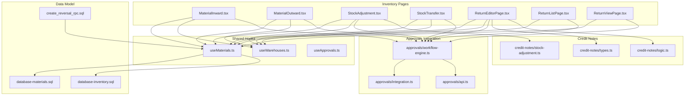
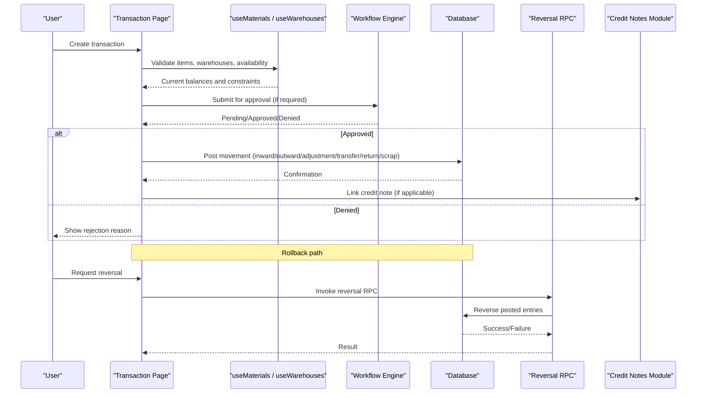
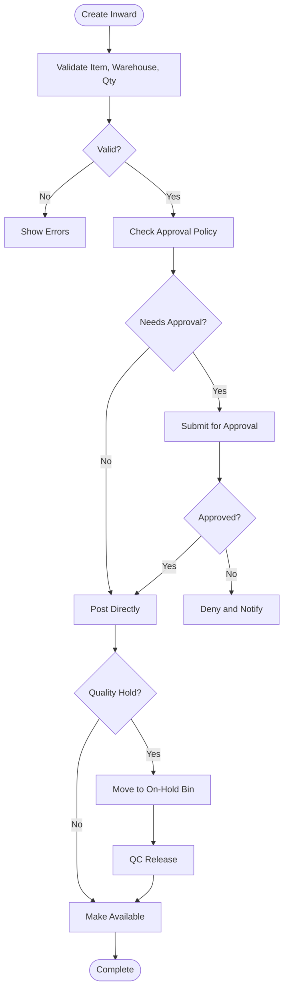
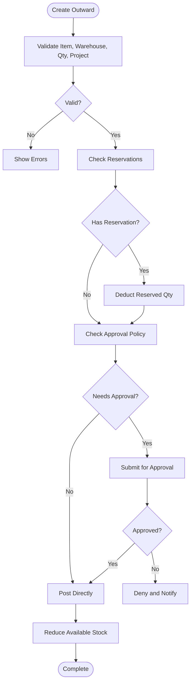
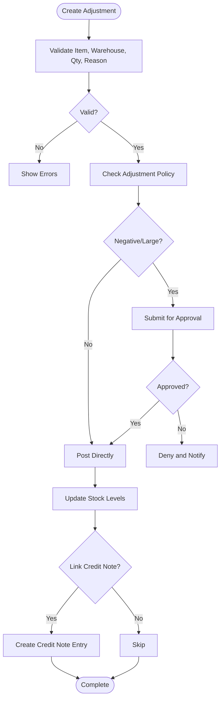
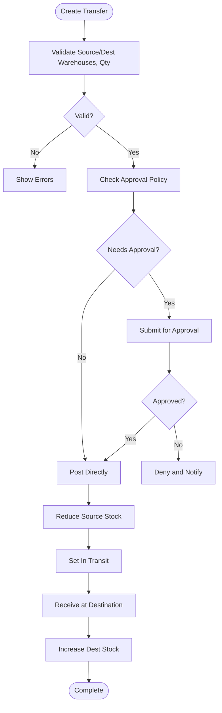
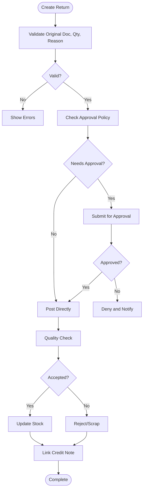
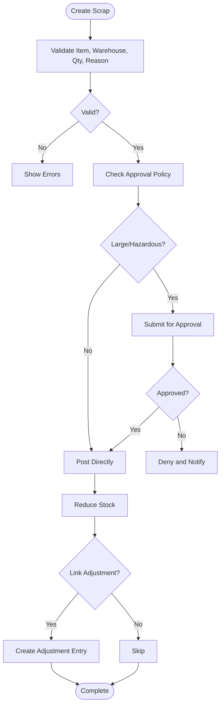
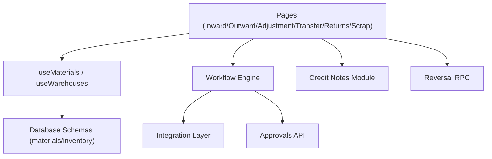

# Transaction Types & Lifecycle

<cite>
**Referenced Files in This Document**
- [MaterialInward.tsx](file://src/pages/MaterialInward.tsx)
- [MaterialOutward.tsx](file://src/pages/MaterialOutward.tsx)
- [StockAdjustment.tsx](file://src/pages/StockAdjustment.tsx)
- [StockTransfer.tsx](file://src/pages/StockTransfer.tsx)
- [ReturnEditorPage.tsx](file://src/pages/ReturnEditorPage.tsx)
- [ReturnListPage.tsx](file://src/pages/ReturnListPage.tsx)
- [ReturnViewPage.tsx](file://src/pages/ReturnViewPage.tsx)
- [useMaterials.ts](file://src/hooks/useMaterials.ts)
- [useWarehouses.ts](file://src/hooks/useWarehouses.ts)
- [database-materials.sql](file://src/database-materials.sql)
- [database-inventory.sql](file://src/database-inventory.sql)
- [create_reversal_rpc.sql](file://sql/create_reversal_rpc.sql)
- [material-intents/api.ts](file://src/material-intents/api.ts)
- [material-usage/api.ts](file://src/material-usage/api.ts)
- [credit-notes/types.ts](file://src/credit-notes/types.ts)
- [credit-notes/logic.ts](file://src/credit-notes/logic.ts)
- [credit-notes/stock-adjustment.ts](file://src/credit-notes/stock-adjustment.ts)
- [approvals/workflow-engine.ts](file://src/approvals/workflow-engine.ts)
- [approvals/integration.ts](file://src/approvals/integration.ts)
- [approvals/api.ts](file://src/approvals/api.ts)
- [hooks/useApprovals.ts](file://src/hooks/useApprovals.ts)
</cite>

## Table of Contents
1. [Introduction](#introduction)
2. [Project Structure](#project-structure)
3. [Core Components](#core-components)
4. [Architecture Overview](#architecture-overview)
5. [Detailed Component Analysis](#detailed-component-analysis)
6. [Dependency Analysis](#dependency-analysis)
7. [Performance Considerations](#performance-considerations)
8. [Troubleshooting Guide](#troubleshooting-guide)
9. [Conclusion](#conclusion)

## Introduction
This document explains the stock transaction types and their lifecycle management across inward receipts, outward issues, stock adjustments, inter-warehouse transfers, returns, and scrap processing. It covers the transaction state machine, validation rules, business logic for each type, creation and approval workflows, audit trail requirements, complex scenarios (partial deliveries, quality holds, conditional releases), rollback mechanisms, error handling, and recovery procedures. The content is grounded in the repository’s pages, hooks, database schemas, approvals integration, and credit-note-related modules that interact with inventory movements.

## Project Structure
The stock transaction features are implemented primarily as React pages under src/pages, supported by shared hooks and database schema definitions. Key areas:
- Inward receipts: MaterialInward page
- Outward issues: MaterialOutward page
- Stock adjustments: StockAdjustment page
- Inter-warehouse transfers: StockTransfer page
- Returns: ReturnEditorPage, ReturnListPage, ReturnViewPage
- Approvals integration: approvals module and hooks
- Inventory data model and queries: database-materials.sql, database-inventory.sql
- Reversals and audit: create_reversal_rpc.sql
- Credit notes linkage: credit-notes module

**Diagram sources**
- [MaterialInward.tsx](file://src/pages/MaterialInward.tsx)
- [MaterialOutward.tsx](file://src/pages/MaterialOutward.tsx)
- [StockAdjustment.tsx](file://src/pages/StockAdjustment.tsx)
- [StockTransfer.tsx](file://src/pages/StockTransfer.tsx)
- [ReturnEditorPage.tsx](file://src/pages/ReturnEditorPage.tsx)
- [ReturnListPage.tsx](file://src/pages/ReturnListPage.tsx)
- [ReturnViewPage.tsx](file://src/pages/ReturnViewPage.tsx)
- [useMaterials.ts](file://src/hooks/useMaterials.ts)
- [useWarehouses.ts](file://src/hooks/useWarehouses.ts)
- [useApprovals.ts](file://src/hooks/useApprovals.ts)
- [approvals/workflow-engine.ts](file://src/approvals/workflow-engine.ts)
- [approvals/integration.ts](file://src/approvals/integration.ts)
- [approvals/api.ts](file://src/approvals/api.ts)
- [database-materials.sql](file://src/database-materials.sql)
- [database-inventory.sql](file://src/database-inventory.sql)
- [create_reversal_rpc.sql](file://sql/create_reversal_rpc.sql)
- [credit-notes/types.ts](file://src/credit-notes/types.ts)
- [credit-notes/logic.ts](file://src/credit-notes/logic.ts)
- [credit-notes/stock-adjustment.ts](file://src/credit-notes/stock-adjustment.ts)

**Section sources**
- [MaterialInward.tsx](file://src/pages/MaterialInward.tsx)
- [MaterialOutward.tsx](file://src/pages/MaterialOutward.tsx)
- [StockAdjustment.tsx](file://src/pages/StockAdjustment.tsx)
- [StockTransfer.tsx](file://src/pages/StockTransfer.tsx)
- [ReturnEditorPage.tsx](file://src/pages/ReturnEditorPage.tsx)
- [ReturnListPage.tsx](file://src/pages/ReturnListPage.tsx)
- [ReturnViewPage.tsx](file://src/pages/ReturnViewPage.tsx)
- [useMaterials.ts](file://src/hooks/useMaterials.ts)
- [useWarehouses.ts](file://src/hooks/useWarehouses.ts)
- [useApprovals.ts](file://src/hooks/useApprovals.ts)
- [approvals/workflow-engine.ts](file://src/approvals/workflow-engine.ts)
- [approvals/integration.ts](file://src/approvals/integration.ts)
- [approvals/api.ts](file://src/approvals/api.ts)
- [database-materials.sql](file://src/database-materials.sql)
- [database-inventory.sql](file://src/database-inventory.sql)
- [create_reversal_rpc.sql](file://sql/create_reversal_rpc.sql)
- [credit-notes/types.ts](file://src/credit-notes/types.ts)
- [credit-notes/logic.ts](file://src/credit-notes/logic.ts)
- [credit-notes/stock-adjustment.ts](file://src/credit-notes/stock-adjustment.ts)

## Core Components
- Material Inward: Captures purchase receipts, partial quantities, lot/batch info, quality inspection flags, and links to purchase orders when applicable. Supports approval gating before posting.
- Material Outward: Issues materials to projects or consumption points; enforces availability checks and project allocations; supports partial issues and reservation via material intents.
- Stock Adjustment: Records corrections due to damage, shrinkage, or count differences; requires justification and typically approval; can be linked to credit notes for write-offs.
- Inter-warehouse Transfer: Moves stock between warehouses; creates outbound and inbound legs; supports staging and transit states; may require approvals based on value or policy.
- Returns: Handles vendor returns and customer returns; integrates with credit notes; supports partial returns and rework/rejection decisions; includes inspection outcomes.
- Scrap Processing: Marks items as scrapped; reduces available stock; often tied to adjustment entries and audit trails; may trigger credit note generation if recoverable.

Key supporting elements:
- useMaterials and useWarehouses provide item and warehouse metadata and live stock balances.
- Approval workflow engine gates critical actions and records audit events.
- Database schemas define core entities and constraints for transactions and inventory.
- Reversal RPC provides a mechanism to undo posted transactions safely.

**Section sources**
- [MaterialInward.tsx](file://src/pages/MaterialInward.tsx)
- [MaterialOutward.tsx](file://src/pages/MaterialOutward.tsx)
- [StockAdjustment.tsx](file://src/pages/StockAdjustment.tsx)
- [StockTransfer.tsx](file://src/pages/StockTransfer.tsx)
- [ReturnEditorPage.tsx](file://src/pages/ReturnEditorPage.tsx)
- [ReturnListPage.tsx](file://src/pages/ReturnListPage.tsx)
- [ReturnViewPage.tsx](file://src/pages/ReturnViewPage.tsx)
- [useMaterials.ts](file://src/hooks/useMaterials.ts)
- [useWarehouses.ts](file://src/hooks/useWarehouses.ts)
- [approvals/workflow-engine.ts](file://src/approvals/workflow-engine.ts)
- [database-materials.sql](file://src/database-materials.sql)
- [database-inventory.sql](file://src/database-inventory.sql)
- [create_reversal_rpc.sql](file://sql/create_reversal_rpc.sql)

## Architecture Overview
The system follows a layered architecture:
- UI Layer: Pages implement transaction forms, lists, and views.
- Hook Layer: useMaterials and useWarehouses encapsulate data fetching and caching.
- Workflow Layer: Approval engine orchestrates multi-step approvals and notifications.
- Data Layer: Database schemas enforce integrity; reversal RPC enables safe rollbacks.
- Integration Layer: Credit notes module connects financial impacts to physical movements.

**Diagram sources**
- [MaterialInward.tsx](file://src/pages/MaterialInward.tsx)
- [MaterialOutward.tsx](file://src/pages/MaterialOutward.tsx)
- [StockAdjustment.tsx](file://src/pages/StockAdjustment.tsx)
- [StockTransfer.tsx](file://src/pages/StockTransfer.tsx)
- [ReturnEditorPage.tsx](file://src/pages/ReturnEditorPage.tsx)
- [useMaterials.ts](file://src/hooks/useMaterials.ts)
- [useWarehouses.ts](file://src/hooks/useWarehouses.ts)
- [approvals/workflow-engine.ts](file://src/approvals/workflow-engine.ts)
- [create_reversal_rpc.sql](file://sql/create_reversal_rpc.sql)
- [credit-notes/logic.ts](file://src/credit-notes/logic.ts)

## Detailed Component Analysis

### Inward Receipts (Purchase Receipts)
- Purpose: Record receipt of goods from vendors, including partial deliveries and quality inspection holds.
- State transitions: Draft → Pending Approval → Posted → Completed (with optional Inspection Hold).
- Validation rules:
  - Item must exist and be active.
  - Warehouse must be valid and have receiving capability.
  - Quantity cannot exceed PO quantity unless allowed by configuration.
  - Lot/batch and expiry fields validated when applicable.
- Business logic:
  - Partial receipts increment received totals without closing the PO line.
  - Quality hold prevents immediate stock availability until release.
  - Links to purchase order lines for traceability.
- Approval workflow:
  - If configured, posts require approval; otherwise auto-post.
  - Audit trail captures user, timestamps, and changes.
- Complex scenarios:
  - Partial delivery: Multiple receipts per PO line; remaining open balance tracked.
  - Quality inspection hold: Items moved to “on-hold” bin until QC release.
  - Conditional release: Release only after QC pass or manager override.

**Diagram sources**
- [MaterialInward.tsx](file://src/pages/MaterialInward.tsx)
- [approvals/workflow-engine.ts](file://src/approvals/workflow-engine.ts)
- [database-materials.sql](file://src/database-materials.sql)
- [database-inventory.sql](file://src/database-inventory.sql)

**Section sources**
- [MaterialInward.tsx](file://src/pages/MaterialInward.tsx)
- [approvals/workflow-engine.ts](file://src/approvals/workflow-engine.ts)
- [database-materials.sql](file://src/database-materials.sql)
- [database-inventory.sql](file://src/database-inventory.sql)

### Outward Issues (Consumption/Dispatch)
- Purpose: Issue materials to projects or consumption points; reduce available stock.
- State transitions: Draft → Pending Approval → Posted → Shipped/Consumed.
- Validation rules:
  - Sufficient available stock at source warehouse.
  - Project allocation must be valid and within budget limits if enforced.
  - Reservation via material intents respected.
- Business logic:
  - Partial issues allowed; outstanding reserved quantities tracked.
  - Backorders handled when stock insufficient.
  - Links to project tasks or job cards for traceability.
- Approval workflow:
  - High-value or restricted items require approval.
  - Audit trail records issuer, destination, and rationale.
- Complex scenarios:
  - Partial issue: Split issuance across multiple dates/locations.
  - Reservation conflict: Resolve against existing material intents.
  - Conditional release: Require supervisor sign-off for restricted items.

**Diagram sources**
- [MaterialOutward.tsx](file://src/pages/MaterialOutward.tsx)
- [material-intents/api.ts](file://src/material-intents/api.ts)
- [approvals/workflow-engine.ts](file://src/approvals/workflow-engine.ts)
- [database-inventory.sql](file://src/database-inventory.sql)

**Section sources**
- [MaterialOutward.tsx](file://src/pages/MaterialOutward.tsx)
- [material-intents/api.ts](file://src/material-intents/api.ts)
- [approvals/workflow-engine.ts](file://src/approvals/workflow-engine.ts)
- [database-inventory.sql](file://src/database-inventory.sql)

### Stock Adjustments
- Purpose: Correct inventory counts due to damage, shrinkage, or miscounts.
- State transitions: Draft → Pending Approval → Posted → Closed.
- Validation rules:
  - Adjustment quantity must not exceed current available stock for reductions.
  - Justification field mandatory for negative adjustments.
  - Warehouse and item must be valid.
- Business logic:
  - Positive adjustments increase stock; negative decrease stock.
  - Often linked to credit notes for write-offs or insurance claims.
- Approval workflow:
  - Negative adjustments typically require approval.
  - Audit trail captures adjuster, reason, and impact.
- Complex scenarios:
  - Bulk adjustments: Import spreadsheets with batch updates.
  - Conditional posting: Requires dual authorization for large variances.

**Diagram sources**
- [StockAdjustment.tsx](file://src/pages/StockAdjustment.tsx)
- [credit-notes/types.ts](file://src/credit-notes/types.ts)
- [credit-notes/logic.ts](file://src/credit-notes/logic.ts)
- [credit-notes/stock-adjustment.ts](file://src/credit-notes/stock-adjustment.ts)
- [approvals/workflow-engine.ts](file://src/approvals/workflow-engine.ts)
- [database-inventory.sql](file://src/database-inventory.sql)

**Section sources**
- [StockAdjustment.tsx](file://src/pages/StockAdjustment.tsx)
- [credit-notes/types.ts](file://src/credit-notes/types.ts)
- [credit-notes/logic.ts](file://src/credit-notes/logic.ts)
- [credit-notes/stock-adjustment.ts](file://src/credit-notes/stock-adjustment.ts)
- [approvals/workflow-engine.ts](file://src/approvals/workflow-engine.ts)
- [database-inventory.sql](file://src/database-inventory.sql)

### Inter-Warehouse Transfers
- Purpose: Move stock between warehouses; supports staging and transit states.
- State transitions: Draft → Pending Approval → Posted → In Transit → Received → Completed.
- Validation rules:
  - Source warehouse must have sufficient available stock.
  - Destination warehouse must be valid and capable of receiving.
  - Transfer quantity cannot exceed available stock.
- Business logic:
  - Creates outbound leg (reduce source) and inbound leg (increase destination).
  - Transit state allows tracking while goods are in motion.
  - Partial transfers supported; remainder remains pending.
- Approval workflow:
  - High-value or cross-org transfers may require approval.
  - Audit trail records initiator, route, and timestamps.
- Complex scenarios:
  - Partial transfer: Split shipments across multiple batches.
  - Conditional release: Destination must confirm receipt before completion.

**Diagram sources**
- [StockTransfer.tsx](file://src/pages/StockTransfer.tsx)
- [approvals/workflow-engine.ts](file://src/approvals/workflow-engine.ts)
- [database-inventory.sql](file://src/database-inventory.sql)

**Section sources**
- [StockTransfer.tsx](file://src/pages/StockTransfer.tsx)
- [approvals/workflow-engine.ts](file://src/approvals/workflow-engine.ts)
- [database-inventory.sql](file://src/database-inventory.sql)

### Returns (Vendor/Customer)
- Purpose: Handle returns to vendors or customers; integrate with credit notes; support partial returns and QC outcomes.
- State transitions: Draft → Pending Approval → Posted → Returned → Credit Note Linked.
- Validation rules:
  - Return quantity cannot exceed original receipt/issue quantity.
  - Reason codes and QC results captured.
  - Destination/source warehouses validated.
- Business logic:
  - Vendor returns reduce stock at site and link to vendor credit notes.
  - Customer returns increase stock upon acceptance; rejected items scrapped or reworked.
  - Partial returns allowed; remaining balance tracked.
- Approval workflow:
  - Returns above thresholds require approval.
  - Audit trail includes return origin, QC decision, and financial linkage.
- Complex scenarios:
  - Partial return: Return only defective units.
  - Conditional acceptance: Accept partially damaged goods at reduced value.

**Diagram sources**
- [ReturnEditorPage.tsx](file://src/pages/ReturnEditorPage.tsx)
- [ReturnListPage.tsx](file://src/pages/ReturnListPage.tsx)
- [ReturnViewPage.tsx](file://src/pages/ReturnViewPage.tsx)
- [credit-notes/logic.ts](file://src/credit-notes/logic.ts)
- [approvals/workflow-engine.ts](file://src/approvals/workflow-engine.ts)
- [database-inventory.sql](file://src/database-inventory.sql)

**Section sources**
- [ReturnEditorPage.tsx](file://src/pages/ReturnEditorPage.tsx)
- [ReturnListPage.tsx](file://src/pages/ReturnListPage.tsx)
- [ReturnViewPage.tsx](file://src/pages/ReturnViewPage.tsx)
- [credit-notes/logic.ts](file://src/credit-notes/logic.ts)
- [approvals/workflow-engine.ts](file://src/approvals/workflow-engine.ts)
- [database-inventory.sql](file://src/database-inventory.sql)

### Scrap Processing
- Purpose: Mark items as scrapped; reduce available stock; maintain audit trail; optionally link to credit notes for salvage value.
- State transitions: Draft → Pending Approval → Posted → Scrapped.
- Validation rules:
  - Scrap quantity cannot exceed available stock.
  - Reason and location mandatory.
- Business logic:
  - Reduces stock immediately upon posting.
  - Can be integrated with adjustment entries for accounting consistency.
- Approval workflow:
  - Large scrap volumes require approval.
  - Audit trail captures approver and rationale.
- Complex scenarios:
  - Batch scrap: Process multiple lots simultaneously.
  - Conditional scrap: Requires safety officer sign-off for hazardous materials.

**Diagram sources**
- [StockAdjustment.tsx](file://src/pages/StockAdjustment.tsx)
- [approvals/workflow-engine.ts](file://src/approvals/workflow-engine.ts)
- [database-inventory.sql](file://src/database-inventory.sql)

**Section sources**
- [StockAdjustment.tsx](file://src/pages/StockAdjustment.tsx)
- [approvals/workflow-engine.ts](file://src/approvals/workflow-engine.ts)
- [database-inventory.sql](file://src/database-inventory.sql)

## Dependency Analysis
- Pages depend on hooks for data access and validation.
- Hooks depend on database schemas for constraints and indexes.
- Approval engine depends on integration layer and API endpoints.
- Credit notes module depends on transaction postings to generate financial entries.
- Reversal RPC provides a controlled rollback path for posted transactions.

**Diagram sources**
- [MaterialInward.tsx](file://src/pages/MaterialInward.tsx)
- [MaterialOutward.tsx](file://src/pages/MaterialOutward.tsx)
- [StockAdjustment.tsx](file://src/pages/StockAdjustment.tsx)
- [StockTransfer.tsx](file://src/pages/StockTransfer.tsx)
- [ReturnEditorPage.tsx](file://src/pages/ReturnEditorPage.tsx)
- [useMaterials.ts](file://src/hooks/useMaterials.ts)
- [useWarehouses.ts](file://src/hooks/useWarehouses.ts)
- [approvals/workflow-engine.ts](file://src/approvals/workflow-engine.ts)
- [approvals/integration.ts](file://src/approvals/integration.ts)
- [approvals/api.ts](file://src/approvals/api.ts)
- [credit-notes/logic.ts](file://src/credit-notes/logic.ts)
- [create_reversal_rpc.sql](file://sql/create_reversal_rpc.sql)
- [database-materials.sql](file://src/database-materials.sql)
- [database-inventory.sql](file://src/database-inventory.sql)

**Section sources**
- [useMaterials.ts](file://src/hooks/useMaterials.ts)
- [useWarehouses.ts](file://src/hooks/useWarehouses.ts)
- [approvals/workflow-engine.ts](file://src/approvals/workflow-engine.ts)
- [approvals/integration.ts](file://src/approvals/integration.ts)
- [approvals/api.ts](file://src/approvals/api.ts)
- [credit-notes/logic.ts](file://src/credit-notes/logic.ts)
- [create_reversal_rpc.sql](file://sql/create_reversal_rpc.sql)
- [database-materials.sql](file://src/database-materials.sql)
- [database-inventory.sql](file://src/database-inventory.sql)

## Performance Considerations
- Use pagination and filtering in list views to reduce payload sizes.
- Cache item and warehouse metadata using hooks to avoid repeated fetches.
- Batch operations where possible (e.g., bulk adjustments) to minimize round trips.
- Leverage database indexes defined in schemas for faster lookups.
- Avoid unnecessary recalculations; compute derived fields on demand.

[No sources needed since this section provides general guidance]

## Troubleshooting Guide
Common issues and resolutions:
- Validation failures: Ensure item and warehouse IDs are correct; check quantity constraints and project allocations.
- Approval denials: Review policy settings and reasons provided; resubmit with corrected data.
- Stock discrepancies: Use reversal RPC to undo incorrect postings; investigate audit logs for root cause.
- Partial delivery mismatches: Verify PO line balances and receipt history; reconcile with supplier documents.
- Credit note linkage errors: Confirm transaction status and amounts; ensure proper mapping between physical and financial entries.

Recovery procedures:
- Use reversal RPC to reverse posted transactions when errors are detected post-approval.
- Re-run reconciliation scripts to align inventory and financial records.
- Consult audit logs for step-by-step changes and responsible users.

**Section sources**
- [create_reversal_rpc.sql](file://sql/create_reversal_rpc.sql)
- [approvals/workflow-engine.ts](file://src/approvals/workflow-engine.ts)
- [database-inventory.sql](file://src/database-inventory.sql)

## Conclusion
The stock transaction system provides robust lifecycle management across inward receipts, outward issues, adjustments, transfers, returns, and scrap processing. Validation rules, approval workflows, and audit trails ensure accuracy and compliance. Complex scenarios like partial deliveries, quality holds, and conditional releases are supported through flexible state machines and integrations with credit notes and reversal mechanisms. Proper use of hooks, schemas, and approval engines enables reliable and auditable inventory operations.

[No sources needed since this section summarizes without analyzing specific files]