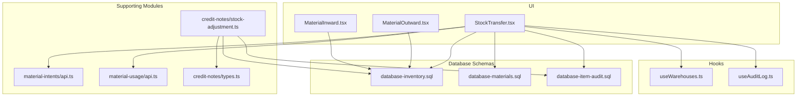
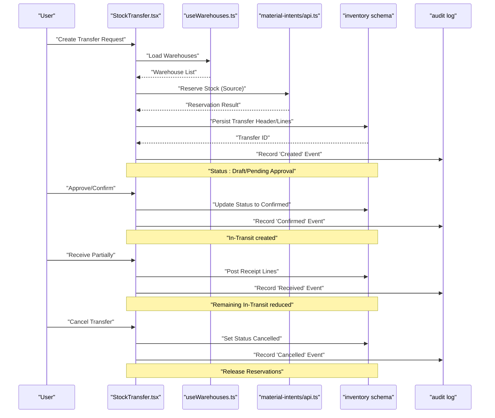
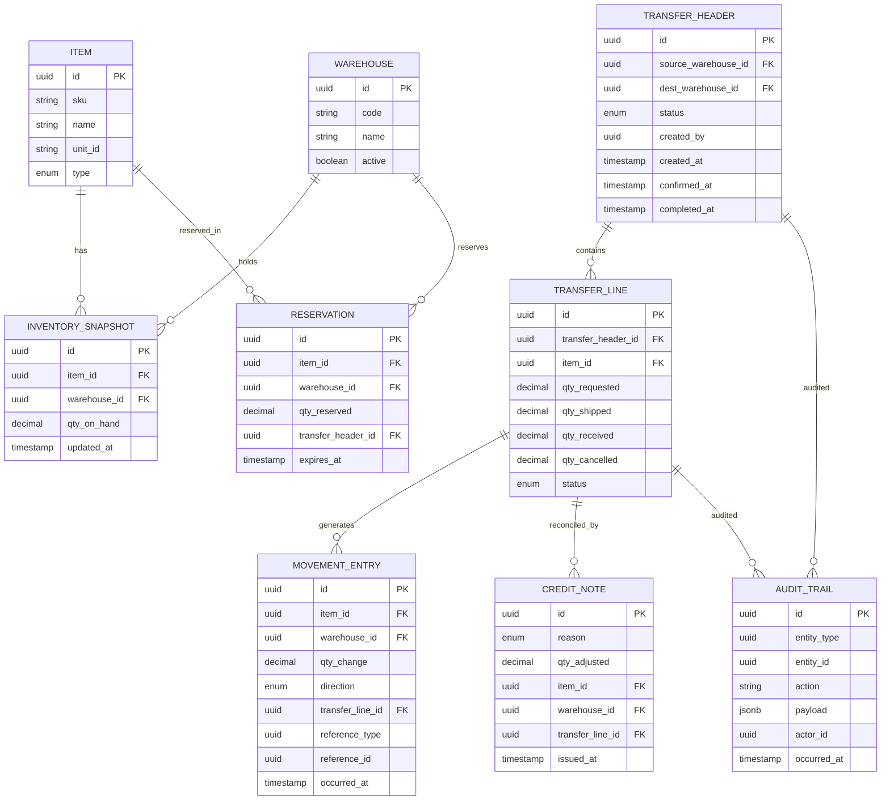
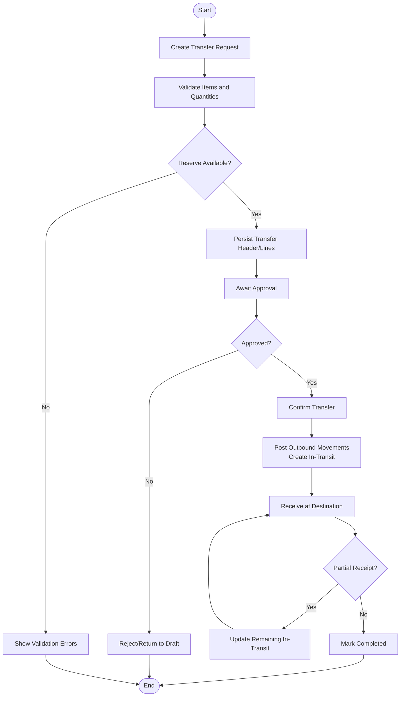
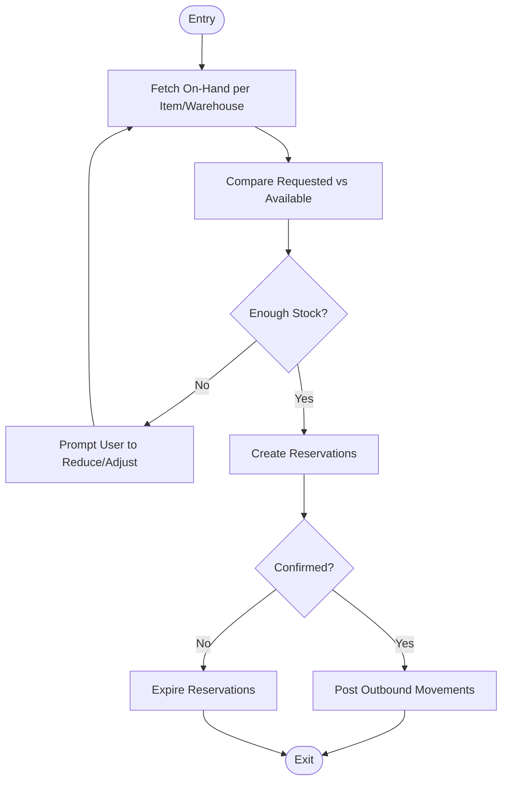
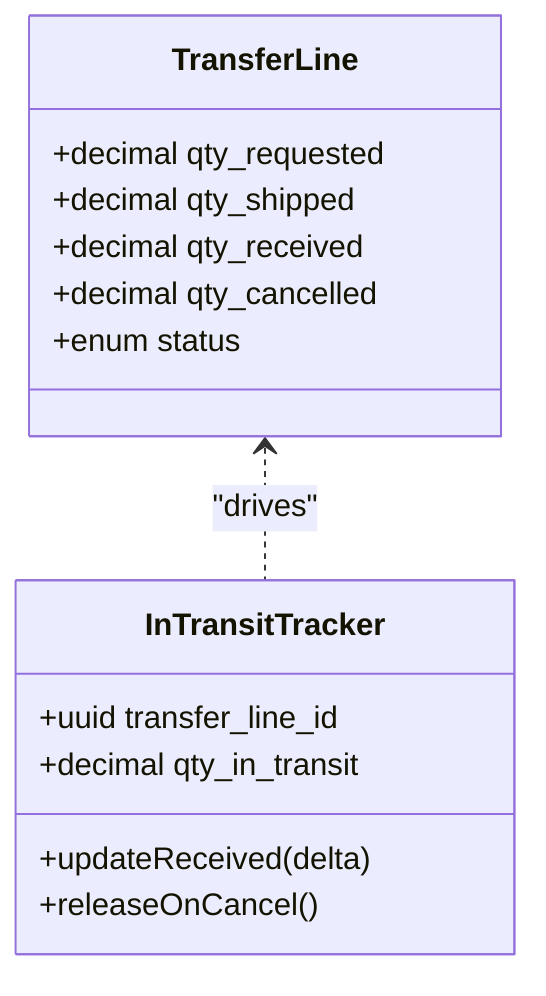
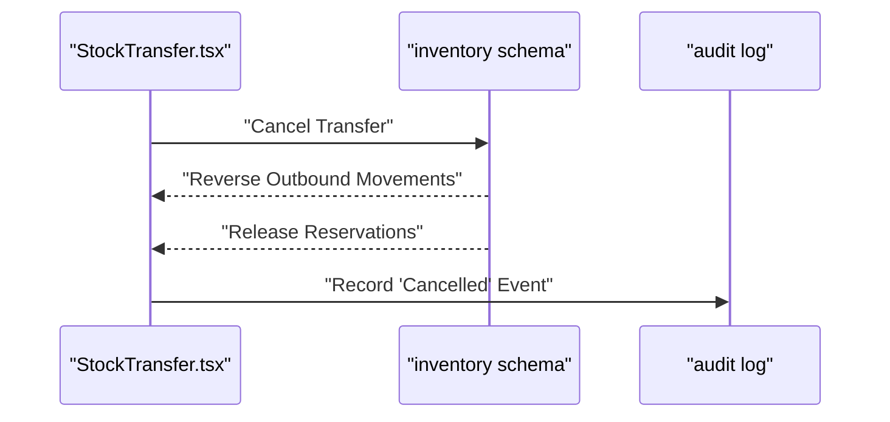
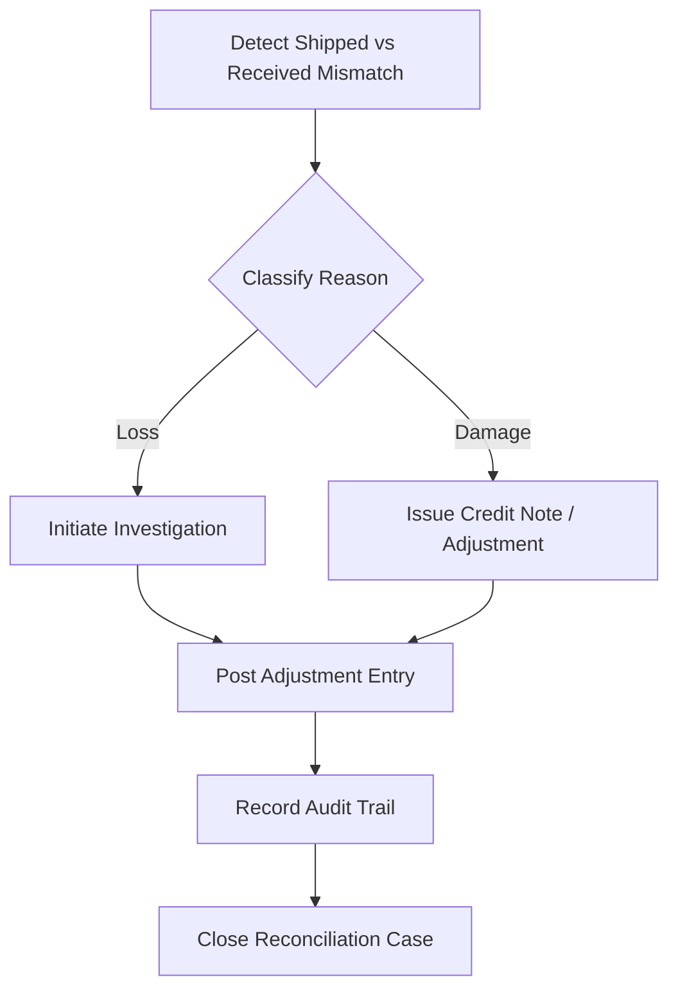
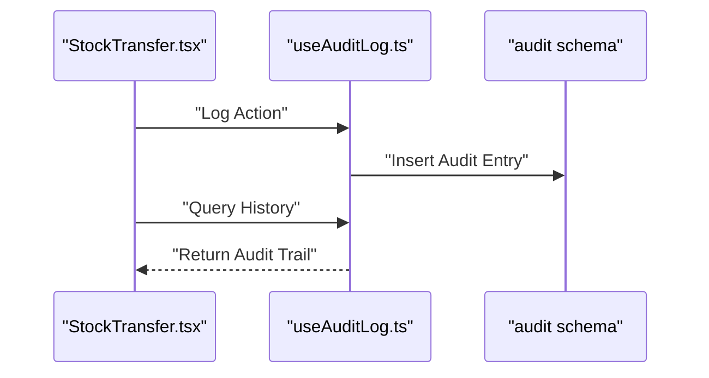
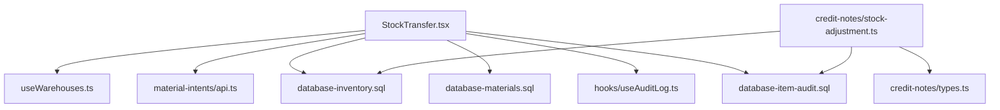

# Inter-Warehouse Transfers & Reconciliation

<cite>
**Referenced Files in This Document**
- [StockTransfer.tsx](file://src/pages/StockTransfer.tsx)
- [useWarehouses.ts](file://src/hooks/useWarehouses.ts)
- [database-inventory.sql](file://src/database-inventory.sql)
- [database-materials.sql](file://src/database-materials.sql)
- [database-item-audit.sql](file://src/database-item-audit.sql)
- [material-intents/api.ts](file://src/material-intents/api.ts)
- [material-usage/api.ts](file://src/material-usage/api.ts)
- [credit-notes/types.ts](file://src/credit-notes/types.ts)
- [credit-notes/stock-adjustment.ts](file://src/credit-notes/stock-adjustment.ts)
- [hooks/useAuditLog.ts](file://src/hooks/useAuditLog.ts)
- [pages/MaterialOutward.tsx](file://src/pages/MaterialOutward.tsx)
- [pages/MaterialInward.tsx](file://src/pages/MaterialInward.tsx)
</cite>

## Table of Contents
1. [Introduction](#introduction)
2. [Project Structure](#project-structure)
3. [Core Components](#core-components)
4. [Architecture Overview](#architecture-overview)
5. [Detailed Component Analysis](#detailed-component-analysis)
6. [Dependency Analysis](#dependency-analysis)
7. [Performance Considerations](#performance-considerations)
8. [Troubleshooting Guide](#troubleshooting-guide)
9. [Conclusion](#conclusion)
10. [Appendices](#appendices)

## Introduction
This document defines the data model and workflows for inter-warehouse stock transfers and reconciliation. It covers transfer request creation, approval and status tracking, validation of stock movements, quantity allocation, confirmation procedures, in-transit handling, partial transfers, cancellations, discrepancy reconciliation, damage claims, loss recovery, audit trails, and compliance reporting. The content is grounded in the repository’s UI pages, hooks, database schemas, and related modules.

## Project Structure
The inter-warehouse transfer capability spans UI pages, hooks, database schema definitions, and supporting modules:
- Transfer UI and orchestration are centered around a dedicated page component.
- Warehouse selection and listing are provided by a hook.
- Inventory and materials schemas define core entities and constraints.
- Material intents and usage APIs support reservation and consumption flows.
- Credit notes and stock adjustments provide mechanisms for reconciling discrepancies.
- Audit log hooks enable traceability across all stock movements.

**Diagram sources**
- [StockTransfer.tsx](file://src/pages/StockTransfer.tsx)
- [useWarehouses.ts](file://src/hooks/useWarehouses.ts)
- [database-inventory.sql](file://src/database-inventory.sql)
- [database-materials.sql](file://src/database-materials.sql)
- [database-item-audit.sql](file://src/database-item-audit.sql)
- [material-intents/api.ts](file://src/material-intents/api.ts)
- [material-usage/api.ts](file://src/material-usage/api.ts)
- [credit-notes/types.ts](file://src/credit-notes/types.ts)
- [credit-notes/stock-adjustment.ts](file://src/credit-notes/stock-adjustment.ts)
- [MaterialInward.tsx](file://src/pages/MaterialInward.tsx)
- [MaterialOutward.tsx](file://src/pages/MaterialOutward.tsx)

**Section sources**
- [StockTransfer.tsx](file://src/pages/StockTransfer.tsx)
- [useWarehouses.ts](file://src/hooks/useWarehouses.ts)
- [database-inventory.sql](file://src/database-inventory.sql)
- [database-materials.sql](file://src/database-materials.sql)
- [database-item-audit.sql](file://src/database-item-audit.sql)
- [material-intents/api.ts](file://src/material-intents/api.ts)
- [material-usage/api.ts](file://src/material-usage/api.ts)
- [credit-notes/types.ts](file://src/credit-notes/types.ts)
- [credit-notes/stock-adjustment.ts](file://src/credit-notes/stock-adjustment.ts)
- [MaterialInward.tsx](file://src/pages/MaterialInward.tsx)
- [MaterialOutward.tsx](file://src/pages/MaterialOutward.tsx)

## Core Components
- Transfer Request Page: Orchestrates creation of an inter-warehouse transfer, including source/destination warehouse selection, item lines, requested quantities, and optional remarks. It integrates with warehouse listing and material intent APIs to validate availability and reserve stock.
- Warehouse Hook: Provides access to available warehouses and their attributes (e.g., location, capacity flags).
- Inventory Schema: Defines tables for inventory snapshots, reservations, and movement records that underpin stock changes during transfers.
- Materials Schema: Defines items, units, variants, and relationships used by transfer lines.
- Material Intents API: Supports pre-allocation/reservation of stock before outbound confirmation.
- Material Usage API: Records consumption or deduction events when stock leaves the source warehouse.
- Credit Notes and Stock Adjustments: Provide reconciliation pathways for discrepancies, damages, and losses.
- Audit Log Hook: Enables retrieval and display of audit trails for stock movements.

Key responsibilities:
- Validate requested quantities against available stock at the source warehouse.
- Create transfer header and line items with statuses reflecting lifecycle stages.
- Manage in-transit balances until destination receipt.
- Support partial receipts and cancellations.
- Record immutable audit entries for each state change and physical movement.

**Section sources**
- [StockTransfer.tsx](file://src/pages/StockTransfer.tsx)
- [useWarehouses.ts](file://src/hooks/useWarehouses.ts)
- [database-inventory.sql](file://src/database-inventory.sql)
- [database-materials.sql](file://src/database-materials.sql)
- [material-intents/api.ts](file://src/material-intents/api.ts)
- [material-usage/api.ts](file://src/material-usage/api.ts)
- [credit-notes/types.ts](file://src/credit-notes/types.ts)
- [credit-notes/stock-adjustment.ts](file://src/credit-notes/stock-adjustment.ts)
- [hooks/useAuditLog.ts](file://src/hooks/useAuditLog.ts)

## Architecture Overview
The transfer workflow follows a stateful process from request to completion, with explicit transitions for approvals, confirmations, partial receipts, and cancellations. In-transit stock is tracked until final receipt at the destination. Discrepancies are reconciled via credit notes and stock adjustments, with full audit coverage.

**Diagram sources**
- [StockTransfer.tsx](file://src/pages/StockTransfer.tsx)
- [useWarehouses.ts](file://src/hooks/useWarehouses.ts)
- [material-intents/api.ts](file://src/material-intents/api.ts)
- [database-inventory.sql](file://src/database-inventory.sql)
- [database-item-audit.sql](file://src/database-item-audit.sql)

## Detailed Component Analysis

### Data Model Entities
The following entities form the backbone of inter-warehouse transfers and reconciliation:
- Item: Represents a product or material with unit and variant information.
- Warehouse: A storage location with attributes such as code, name, and operational settings.
- Inventory Snapshot: Current on-hand quantities per item per warehouse.
- Reservation: Pre-allocated stock for pending outbound actions.
- Transfer Header: Top-level record capturing source/destination, dates, requester, and overall status.
- Transfer Line: Per-item details including requested, shipped, received, and cancelled quantities.
- Movement Entry: Immutable record of stock changes (outbound, inbound, adjustment).
- Audit Trail: Append-only log of user actions and system events tied to transfers and movements.
- Credit Note / Adjustment: Reconciliation documents for discrepancies, damage, and loss.

**Diagram sources**
- [database-materials.sql](file://src/database-materials.sql)
- [database-inventory.sql](file://src/database-inventory.sql)
- [database-item-audit.sql](file://src/database-item-audit.sql)
- [credit-notes/types.ts](file://src/credit-notes/types.ts)

**Section sources**
- [database-materials.sql](file://src/database-materials.sql)
- [database-inventory.sql](file://src/database-inventory.sql)
- [database-item-audit.sql](file://src/database-item-audit.sql)
- [credit-notes/types.ts](file://src/credit-notes/types.ts)

### Transfer Request Workflow and Status Tracking
- Creation: The user creates a transfer request specifying source and destination warehouses, item lines, and requested quantities. The UI validates inputs and may call reservation APIs to lock stock.
- Approval: Depending on policy, a transfer may require approval before confirmation. The status transitions reflect draft/pending/approved states.
- Confirmation: Upon confirmation, outbound movements are posted at the source, creating in-transit balances until receipt.
- Partial Receipt: Destination can receive partial quantities; remaining in-transit persists until fully received.
- Cancellation: If cancelled, reservations are released and any posted movements are reversed or adjusted according to policy.

**Diagram sources**
- [StockTransfer.tsx](file://src/pages/StockTransfer.tsx)
- [material-intents/api.ts](file://src/material-intents/api.ts)
- [database-inventory.sql](file://src/database-inventory.sql)

**Section sources**
- [StockTransfer.tsx](file://src/pages/StockTransfer.tsx)
- [material-intents/api.ts](file://src/material-intents/api.ts)
- [database-inventory.sql](file://src/database-inventory.sql)

### Stock Movement Validation and Quantity Allocation
- Availability Check: Before reservation, the system checks on-hand inventory at the source warehouse for each item.
- Reservation: Successful reservations reduce available stock for other operations until expiry or confirmation.
- Allocation Rules: Transfer lines allocate requested quantities; if insufficient, the UI should prompt for reduced quantities or split into multiple requests.
- Idempotency: Reservation and posting operations must be idempotent to prevent double-counting.

**Diagram sources**
- [material-intents/api.ts](file://src/material-intents/api.ts)
- [database-inventory.sql](file://src/database-inventory.sql)

**Section sources**
- [material-intents/api.ts](file://src/material-intents/api.ts)
- [database-inventory.sql](file://src/database-inventory.sql)

### In-Transit Stock Handling
- In-Transit Balance: After confirmation, a portion of stock becomes “in-transit” between source and destination.
- Visibility: Users can view in-transit quantities per transfer line and per item.
- Updates: Partial receipts decrement in-transit balances; cancellations reverse postings and release reservations.

**Diagram sources**
- [database-inventory.sql](file://src/database-inventory.sql)

**Section sources**
- [database-inventory.sql](file://src/database-inventory.sql)

### Partial Transfers and Cancellations
- Partial Transfers: Destination receives a subset of shipped quantities; remaining in-transit persists until further receipt.
- Cancellations: Cancelling a transfer reverses outbound movements and releases reservations. Any already-received portions may require reversal or adjustment depending on policy.

**Diagram sources**
- [StockTransfer.tsx](file://src/pages/StockTransfer.tsx)
- [database-inventory.sql](file://src/database-inventory.sql)
- [database-item-audit.sql](file://src/database-item-audit.sql)

**Section sources**
- [StockTransfer.tsx](file://src/pages/StockTransfer.tsx)
- [database-inventory.sql](file://src/database-inventory.sql)
- [database-item-audit.sql](file://src/database-item-audit.sql)

### Reconciliation Processes
- Discrepancy Detection: Differences between shipped and received quantities trigger reconciliation workflows.
- Damage Claims: Damaged goods are recorded via credit notes or adjustments, reducing received quantities and documenting reasons.
- Loss Recovery: Lost items are handled through adjustments and investigations, with audit trails linking to responsible parties and timestamps.

**Diagram sources**
- [credit-notes/types.ts](file://src/credit-notes/types.ts)
- [credit-notes/stock-adjustment.ts](file://src/credit-notes/stock-adjustment.ts)
- [database-item-audit.sql](file://src/database-item-audit.sql)

**Section sources**
- [credit-notes/types.ts](file://src/credit-notes/types.ts)
- [credit-notes/stock-adjustment.ts](file://src/credit-notes/stock-adjustment.ts)
- [database-item-audit.sql](file://src/database-item-audit.sql)

### Audit Trails and Compliance Reporting
- Audit Entries: Every significant action (create, approve, confirm, receive, cancel, adjust) generates an audit trail entry linked to the relevant entity.
- Traceability: Users can trace the complete history of a transfer, including who performed actions and when.
- Compliance: Reports can be generated to show transfer volumes, discrepancies, adjustments, and outcomes for audits and management reviews.

**Diagram sources**
- [hooks/useAuditLog.ts](file://src/hooks/useAuditLog.ts)
- [database-item-audit.sql](file://src/database-item-audit.sql)

**Section sources**
- [hooks/useAuditLog.ts](file://src/hooks/useAuditLog.ts)
- [database-item-audit.sql](file://src/database-item-audit.sql)

## Dependency Analysis
Inter-warehouse transfers depend on several modules and schemas:
- UI depends on warehouse listing and material intent APIs to validate and reserve stock.
- Database schemas enforce integrity for inventory, reservations, transfers, and audit logs.
- Credit notes and adjustments integrate with inventory and audit systems for reconciliation.

**Diagram sources**
- [StockTransfer.tsx](file://src/pages/StockTransfer.tsx)
- [useWarehouses.ts](file://src/hooks/useWarehouses.ts)
- [material-intents/api.ts](file://src/material-intents/api.ts)
- [database-inventory.sql](file://src/database-inventory.sql)
- [database-materials.sql](file://src/database-materials.sql)
- [hooks/useAuditLog.ts](file://src/hooks/useAuditLog.ts)
- [database-item-audit.sql](file://src/database-item-audit.sql)
- [credit-notes/stock-adjustment.ts](file://src/credit-notes/stock-adjustment.ts)
- [credit-notes/types.ts](file://src/credit-notes/types.ts)

**Section sources**
- [StockTransfer.tsx](file://src/pages/StockTransfer.tsx)
- [useWarehouses.ts](file://src/hooks/useWarehouses.ts)
- [material-intents/api.ts](file://src/material-intents/api.ts)
- [database-inventory.sql](file://src/database-inventory.sql)
- [database-materials.sql](file://src/database-materials.sql)
- [hooks/useAuditLog.ts](file://src/hooks/useAuditLog.ts)
- [database-item-audit.sql](file://src/database-item-audit.sql)
- [credit-notes/stock-adjustment.ts](file://src/credit-notes/stock-adjustment.ts)
- [credit-notes/types.ts](file://src/credit-notes/types.ts)

## Performance Considerations
- Batch Operations: When processing large transfers, batch reservation and posting calls to reduce round trips.
- Indexing: Ensure indexes on foreign keys and frequently queried columns (item_id, warehouse_id, transfer_header_id) to optimize lookups.
- Concurrency Control: Use optimistic locking or version fields to prevent race conditions during concurrent updates.
- Pagination: For audit logs and transfer histories, implement pagination to avoid heavy payloads.
- Caching: Cache warehouse lists and item catalogs where appropriate to improve responsiveness.

[No sources needed since this section provides general guidance]

## Troubleshooting Guide
Common issues and resolutions:
- Insufficient Stock: Verify on-hand quantities and adjust requested amounts; ensure reservations have not expired.
- Duplicate Posting: Confirm idempotency keys and transaction boundaries to avoid double-counting.
- Partial Receipt Errors: Validate that received quantities do not exceed shipped quantities; check in-transit balances.
- Cancellation Failures: Ensure no downstream dependencies block cancellation; verify reversal logic for posted movements.
- Missing Audit Entries: Confirm audit logging hooks are invoked for all critical actions.

**Section sources**
- [material-intents/api.ts](file://src/material-intents/api.ts)
- [database-inventory.sql](file://src/database-inventory.sql)
- [hooks/useAuditLog.ts](file://src/hooks/useAuditLog.ts)

## Conclusion
The inter-warehouse transfer and reconciliation system is built around robust data models and clear workflows. By enforcing validation, managing in-transit stock, supporting partial receipts and cancellations, and providing comprehensive audit trails, the system ensures accurate inventory control and compliance. Reconciliation via credit notes and adjustments resolves discrepancies while maintaining traceability.

[No sources needed since this section summarizes without analyzing specific files]

## Appendices

### Key UI Pages and Hooks
- StockTransfer.tsx: Primary interface for creating and managing transfers.
- useWarehouses.ts: Provides warehouse data for selection and validation.
- MaterialInward.tsx and MaterialOutward.tsx: Related inward/outward processes that interact with inventory.

**Section sources**
- [StockTransfer.tsx](file://src/pages/StockTransfer.tsx)
- [useWarehouses.ts](file://src/hooks/useWarehouses.ts)
- [MaterialInward.tsx](file://src/pages/MaterialInward.tsx)
- [MaterialOutward.tsx](file://src/pages/MaterialOutward.tsx)