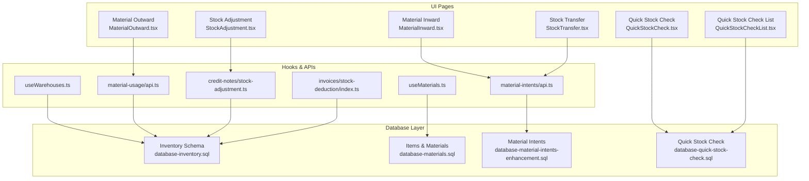
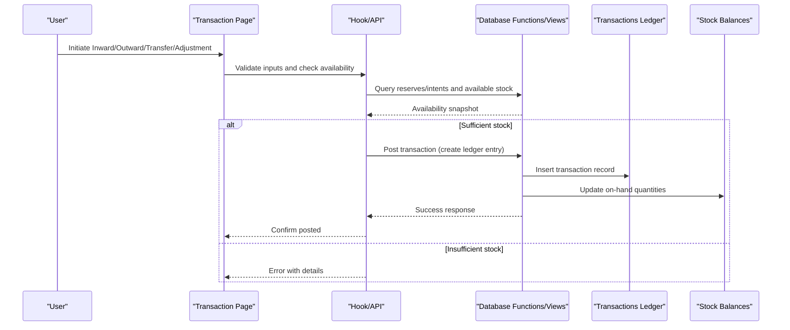
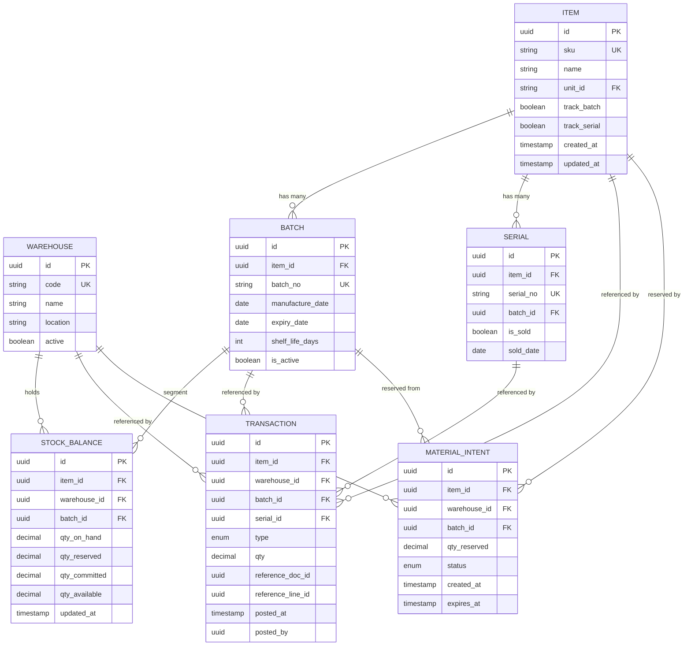
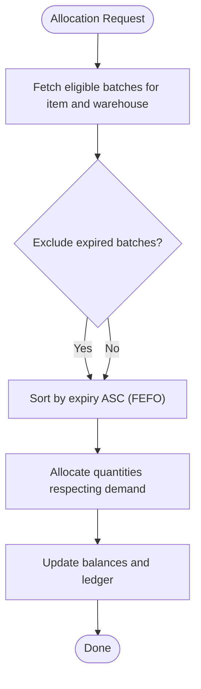
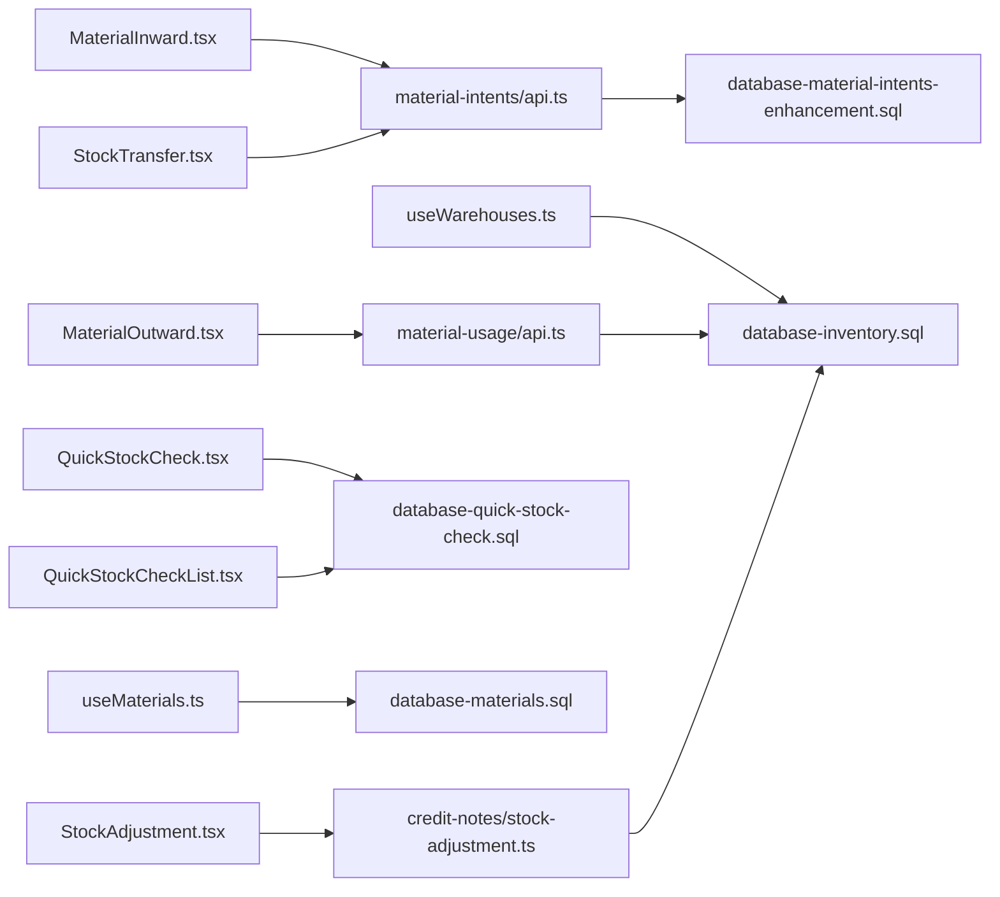

# Stock Tracking & Inventory Control

<cite>
**Referenced Files in This Document**
- [database-inventory.sql](file://src/database-inventory.sql)
- [database-materials.sql](file://src/database-materials.sql)
- [database-material-intents-enhancement.sql](file://src/database-material-intents-enhancement.sql)
- [database-quick-stock-check.sql](file://src/database-quick-stock-check.sql)
- [StockAdjustment.tsx](file://src/pages/StockAdjustment.tsx)
- [StockTransfer.tsx](file://src/pages/StockTransfer.tsx)
- [MaterialInward.tsx](file://src/pages/MaterialInward.tsx)
- [MaterialOutward.tsx](file://src/pages/MaterialOutward.tsx)
- [QuickStockCheck.tsx](file://src/pages/QuickStockCheck.tsx)
- [QuickStockCheckList.tsx](file://src/pages/QuickStockCheckList.tsx)
- [useMaterials.ts](file://src/hooks/useMaterials.ts)
- [useWarehouses.ts](file://src/hooks/useWarehouses.ts)
- [material-intents/api.ts](file://src/material-intents/api.ts)
- [material-usage/api.ts](file://src/material-usage/api.ts)
- [credit-notes/stock-adjustment.ts](file://src/credit-notes/stock-adjustment.ts)
- [invoices/stock-deduction/index.ts](file://src/invoices/stock-deduction/index.ts)
</cite>

## Table of Contents
1. [Introduction](#introduction)
2. [Project Structure](#project-structure)
3. [Core Components](#core-components)
4. [Architecture Overview](#architecture-overview)
5. [Detailed Component Analysis](#detailed-component-analysis)
6. [Dependency Analysis](#dependency-analysis)
7. [Performance Considerations](#performance-considerations)
8. [Troubleshooting Guide](#troubleshooting-guide)
9. [Conclusion](#conclusion)
10. [Appendices](#appendices)

## Introduction
This document provides a comprehensive data model and process documentation for the stock tracking and inventory control system. It explains how real-time stock levels are calculated, how batch numbers and serial numbers are tracked, and how various stock transactions (inward, outward, transfer, adjustment) impact inventory. It also covers expiry date tracking, shelf life management, automatic stock rotation, complex availability queries, reserved and committed stock calculations, and reconciliation workflows to resolve discrepancies.

## Project Structure
The inventory subsystem spans database schema definitions, UI pages that initiate transactions, hooks for data access, and API modules for material intents and usage. The key areas include:
- Database schema for items, warehouses, stock balances, batches, serials, and transaction logs
- Pages for creating inward, outward, transfers, and adjustments
- Hooks and APIs for querying materials, warehouses, and performing operations
- Specialized flows for credit note stock adjustments and invoice-driven deductions

**Diagram sources**
- [database-inventory.sql](file://src/database-inventory.sql)
- [database-materials.sql](file://src/database-materials.sql)
- [database-material-intents-enhancement.sql](file://src/database-material-intents-enhancement.sql)
- [database-quick-stock-check.sql](file://src/database-quick-stock-check.sql)
- [MaterialInward.tsx](file://src/pages/MaterialInward.tsx)
- [MaterialOutward.tsx](file://src/pages/MaterialOutward.tsx)
- [StockTransfer.tsx](file://src/pages/StockTransfer.tsx)
- [StockAdjustment.tsx](file://src/pages/StockAdjustment.tsx)
- [QuickStockCheck.tsx](file://src/pages/QuickStockCheck.tsx)
- [QuickStockCheckList.tsx](file://src/pages/QuickStockCheckList.tsx)
- [useMaterials.ts](file://src/hooks/useMaterials.ts)
- [useWarehouses.ts](file://src/hooks/useWarehouses.ts)
- [material-intents/api.ts](file://src/material-intents/api.ts)
- [material-usage/api.ts](file://src/material-usage/api.ts)
- [credit-notes/stock-adjustment.ts](file://src/credit-notes/stock-adjustment.ts)
- [invoices/stock-deduction/index.ts](file://src/invoices/stock-deduction/index.ts)

**Section sources**
- [database-inventory.sql](file://src/database-inventory.sql)
- [database-materials.sql](file://src/database-materials.sql)
- [database-material-intents-enhancement.sql](file://src/database-material-intents-enhancement.sql)
- [database-quick-stock-check.sql](file://src/database-quick-stock-check.sql)
- [MaterialInward.tsx](file://src/pages/MaterialInward.tsx)
- [MaterialOutward.tsx](file://src/pages/MaterialOutward.tsx)
- [StockTransfer.tsx](file://src/pages/StockTransfer.tsx)
- [StockAdjustment.tsx](file://src/pages/StockAdjustment.tsx)
- [QuickStockCheck.tsx](file://src/pages/QuickStockCheck.tsx)
- [QuickStockCheckList.tsx](file://src/pages/QuickStockCheckList.tsx)
- [useMaterials.ts](file://src/hooks/useMaterials.ts)
- [useWarehouses.ts](file://src/hooks/useWarehouses.ts)
- [material-intents/api.ts](file://src/material-intents/api.ts)
- [material-usage/api.ts](file://src/material-usage/api.ts)
- [credit-notes/stock-adjustment.ts](file://src/credit-notes/stock-adjustment.ts)
- [invoices/stock-deduction/index.ts](file://src/invoices/stock-deduction/index.ts)

## Core Components
- Items and Units: Define product master data including units of measure and variants.
- Warehouses and Locations: Model physical storage locations and their attributes.
- Batches and Serial Numbers: Track production or receipt batches and unique serial identifiers per unit.
- Stock Balances: Maintain current on-hand quantities per item, warehouse, batch, and serial scope.
- Transactions Ledger: Record all movements (inward, outward, transfer, adjustment) with timestamps and references.
- Material Intents: Represent pre-commit reservations or planned allocations before finalization.
- Quick Stock Check: Provide fast availability snapshots and filters.

Key responsibilities:
- Real-time balance updates upon transaction posting
- Reservation handling via intents
- Expiry-aware allocation and rotation
- Auditability through transaction logs

**Section sources**
- [database-materials.sql](file://src/database-materials.sql)
- [database-inventory.sql](file://src/database-inventory.sql)
- [database-material-intents-enhancement.sql](file://src/database-material-intents-enhancement.sql)
- [database-quick-stock-check.sql](file://src/database-quick-stock-check.sql)

## Architecture Overview
The system follows a layered architecture:
- UI layer initiates transactions and displays availability
- Hook/API layer orchestrates business logic and calls database functions
- Database layer enforces constraints, maintains balances, and exposes views for reporting

**Diagram sources**
- [MaterialInward.tsx](file://src/pages/MaterialInward.tsx)
- [MaterialOutward.tsx](file://src/pages/MaterialOutward.tsx)
- [StockTransfer.tsx](file://src/pages/StockTransfer.tsx)
- [StockAdjustment.tsx](file://src/pages/StockAdjustment.tsx)
- [material-intents/api.ts](file://src/material-intents/api.ts)
- [material-usage/api.ts](file://src/material-usage/api.ts)
- [database-inventory.sql](file://src/database-inventory.sql)

## Detailed Component Analysis

### Data Model Entities and Relationships
This section outlines the core entities involved in inventory control, including items, warehouses, batches, serials, balances, and transactions.

**Diagram sources**
- [database-materials.sql](file://src/database-materials.sql)
- [database-inventory.sql](file://src/database-inventory.sql)
- [database-material-intents-enhancement.sql](file://src/database-material-intents-enhancement.sql)

**Section sources**
- [database-materials.sql](file://src/database-materials.sql)
- [database-inventory.sql](file://src/database-inventory.sql)
- [database-material-intents-enhancement.sql](file://src/database-material-intents-enhancement.sql)

### Real-Time Stock Level Calculations
Real-time availability is derived from:
- On-hand quantity per item, warehouse, and batch
- Reserved quantities from material intents
- Committed quantities from finalized outbound documents
- Adjustments and postings reflected immediately in the ledger

Availability formula:
- Available = On-hand - Reserved - Committed

Updates occur when:
- Inward transactions post positive quantities
- Outward transactions post negative quantities
- Transfers move quantities between warehouses
- Adjustments correct discrepancies

Complexity considerations:
- Aggregations over large ledgers should be optimized using indexes and materialized views where appropriate
- Batch-level and serial-level granularity increases cardinality; ensure efficient filtering

**Section sources**
- [database-inventory.sql](file://src/database-inventory.sql)
- [database-material-intents-enhancement.sql](file://src/database-material-intents-enhancement.sql)

### Batch Number Tracking
Batches encapsulate production or receipt lots with attributes such as manufacture date, expiry date, and shelf life. They segment stock balances and transactions to enable FEFO/FIFO rotation and expiry controls.

Key behaviors:
- Each inbound lot creates or increments a batch-specific balance
- Outbound selection prefers earliest expiry (FEFO) unless overridden
- Expired batches can be flagged and excluded from allocation

**Section sources**
- [database-materials.sql](file://src/database-materials.sql)
- [database-inventory.sql](file://src/database-inventory.sql)

### Serial Number Management
Serial numbers provide unit-level traceability. They are linked to items and optionally to batches. Sales or consumption mark serials as sold and record sale dates.

Key behaviors:
- Serial issuance occurs during outward transactions
- Serial lookup supports warranty and recall processes
- Serial-level balances may be maintained for high-value items

**Section sources**
- [database-materials.sql](file://src/database-materials.sql)
- [database-inventory.sql](file://src/database-inventory.sql)

### Stock Transaction Types and Impact
- Inward: Increases on-hand quantity; may create new batches; sets initial serial records if applicable.
- Outward: Decreases on-hand quantity; selects batches based on rotation rules; marks serials as sold.
- Transfer: Moves quantities between warehouses without changing total on-hand; updates source and destination balances.
- Adjustment: Corrects discrepancies; posts positive or negative changes with audit trail.

Impact summary:
- All transactions update the ledger and recalculate balances
- Reservations and commitments affect availability but not on-hand until finalized

**Section sources**
- [MaterialInward.tsx](file://src/pages/MaterialInward.tsx)
- [MaterialOutward.tsx](file://src/pages/MaterialOutward.tsx)
- [StockTransfer.tsx](file://src/pages/StockTransfer.tsx)
- [StockAdjustment.tsx](file://src/pages/StockAdjustment.tsx)
- [database-inventory.sql](file://src/database-inventory.sql)

### Expiry Date Tracking and Shelf Life Management
Expiry and shelf life drive allocation policies:
- FEFO prioritizes batches with earlier expiry dates
- Shelf life days inform warnings and auto-exclusion of expired stock
- Reports highlight near-expiry items for proactive action

**Diagram sources**
- [database-inventory.sql](file://src/database-inventory.sql)

**Section sources**
- [database-inventory.sql](file://src/database-inventory.sql)

### Automatic Stock Rotation
Rotation strategies:
- FEFO (First Expired, First Out): Preferred for perishables and time-sensitive goods
- FIFO (First In, First Out): Alternative strategy based on receipt order
- LIFO (Last In, First Out): Rarely used; supported if configured

Implementation notes:
- Sorting criteria applied during allocation
- Configurable per item or warehouse policy
- Overrides allowed for compliance or operational reasons

**Section sources**
- [database-inventory.sql](file://src/database-inventory.sql)

### Complex Queries: Availability, Reserved, and Committed Stock
Common query patterns:
- Total available per item across warehouses
- Available per item per warehouse per batch
- Reserved totals by intent status and expiration
- Committed totals by finalized outbound documents

Optimization tips:
- Use indexed columns for item_id, warehouse_id, batch_id
- Aggregate with window functions for multi-dimensional views
- Cache frequent snapshots for dashboards

**Section sources**
- [database-quick-stock-check.sql](file://src/database-quick-stock-check.sql)
- [database-material-intents-enhancement.sql](file://src/database-material-intents-enhancement.sql)
- [database-inventory.sql](file://src/database-inventory.sql)

### Stock Reconciliation and Discrepancy Resolution
Reconciliation workflow:
- Compare system balances against physical counts
- Identify discrepancies by item, warehouse, and batch
- Create adjustment transactions to align system with reality
- Audit trail captures reason codes and approvers

Discrepancy resolution steps:
- Investigate root causes (missed postings, misallocations)
- Approve adjustments following governance rules
- Monitor recurring issues and refine controls

**Section sources**
- [StockAdjustment.tsx](file://src/pages/StockAdjustment.tsx)
- [database-inventory.sql](file://src/database-inventory.sql)

## Dependency Analysis
The following diagram shows dependencies among UI pages, hooks, APIs, and database components.

**Diagram sources**
- [MaterialInward.tsx](file://src/pages/MaterialInward.tsx)
- [MaterialOutward.tsx](file://src/pages/MaterialOutward.tsx)
- [StockTransfer.tsx](file://src/pages/StockTransfer.tsx)
- [StockAdjustment.tsx](file://src/pages/StockAdjustment.tsx)
- [QuickStockCheck.tsx](file://src/pages/QuickStockCheck.tsx)
- [QuickStockCheckList.tsx](file://src/pages/QuickStockCheckList.tsx)
- [useMaterials.ts](file://src/hooks/useMaterials.ts)
- [useWarehouses.ts](file://src/hooks/useWarehouses.ts)
- [material-intents/api.ts](file://src/material-intents/api.ts)
- [material-usage/api.ts](file://src/material-usage/api.ts)
- [credit-notes/stock-adjustment.ts](file://src/credit-notes/stock-adjustment.ts)
- [database-quick-stock-check.sql](file://src/database-quick-stock-check.sql)
- [database-materials.sql](file://src/database-materials.sql)
- [database-inventory.sql](file://src/database-inventory.sql)
- [database-material-intents-enhancement.sql](file://src/database-material-intents-enhancement.sql)

**Section sources**
- [MaterialInward.tsx](file://src/pages/MaterialInward.tsx)
- [MaterialOutward.tsx](file://src/pages/MaterialOutward.tsx)
- [StockTransfer.tsx](file://src/pages/StockTransfer.tsx)
- [StockAdjustment.tsx](file://src/pages/StockAdjustment.tsx)
- [QuickStockCheck.tsx](file://src/pages/QuickStockCheck.tsx)
- [QuickStockCheckList.tsx](file://src/pages/QuickStockCheckList.tsx)
- [useMaterials.ts](file://src/hooks/useMaterials.ts)
- [useWarehouses.ts](file://src/hooks/useWarehouses.ts)
- [material-intents/api.ts](file://src/material-intents/api.ts)
- [material-usage/api.ts](file://src/material-usage/api.ts)
- [credit-notes/stock-adjustment.ts](file://src/credit-notes/stock-adjustment.ts)
- [database-quick-stock-check.sql](file://src/database-quick-stock-check.sql)
- [database-materials.sql](file://src/database-materials.sql)
- [database-inventory.sql](file://src/database-inventory.sql)
- [database-material-intents-enhancement.sql](file://src/database-material-intents-enhancement.sql)

## Performance Considerations
- Indexing: Ensure composite indexes on (item_id, warehouse_id, batch_id) for fast lookups
- Aggregation: Use materialized views for heavy reports like availability snapshots
- Partitioning: Consider partitioning transaction logs by date ranges for large datasets
- Caching: Cache quick stock checks for read-heavy dashboards
- Concurrency: Apply optimistic locking or row-level locks during balance updates to prevent race conditions

[No sources needed since this section provides general guidance]

## Troubleshooting Guide
Common issues and resolutions:
- Negative stock after posting: Verify reservation release and commitment rollback logic
- Allocation errors due to expiry: Review FEFO rules and batch validity flags
- Slow availability queries: Add missing indexes or optimize aggregation queries
- Discrepancies between system and physical counts: Perform reconciliation and adjust with proper approvals

Operational checks:
- Validate transaction types and referenced documents
- Confirm batch and serial integrity constraints
- Review intent expiration and cleanup jobs

**Section sources**
- [database-inventory.sql](file://src/database-inventory.sql)
- [database-material-intents-enhancement.sql](file://src/database-material-intents-enhancement.sql)
- [database-quick-stock-check.sql](file://src/database-quick-stock-check.sql)

## Conclusion
The inventory control system integrates robust data modeling with transactional integrity to support accurate stock tracking, batch and serial traceability, and expiry-aware allocation. By leveraging material intents for reservations and maintaining detailed transaction logs, the system ensures reliable availability calculations and supports reconciliation workflows. Proper indexing, caching, and concurrency controls further enhance performance and reliability.

[No sources needed since this section summarizes without analyzing specific files]

## Appendices

### Appendix A: Key Tables and Columns Summary
- Items: SKU, name, unit, variant flags
- Warehouses: Code, location, active status
- Batches: Batch number, manufacture/expiry dates, shelf life
- Serials: Unique serial number, link to item/batch, sale status
- Stock Balances: On-hand, reserved, committed, available per scope
- Transactions: Type, quantity, references, timestamps, user
- Material Intents: Reserved quantities, status, expiration

**Section sources**
- [database-materials.sql](file://src/database-materials.sql)
- [database-inventory.sql](file://src/database-inventory.sql)
- [database-material-intents-enhancement.sql](file://src/database-material-intents-enhancement.sql)

### Appendix B: Example Query Patterns
- Available per item across warehouses: Sum on-hand minus reserved and committed grouped by item
- Available per item per warehouse per batch: Same aggregation with warehouse and batch filters
- Reserved totals by intent: Sum reserved quantities filtered by status and expiration
- Committed totals by outbound docs: Sum outbound quantities linked to finalized documents

**Section sources**
- [database-quick-stock-check.sql](file://src/database-quick-stock-check.sql)
- [database-material-intents-enhancement.sql](file://src/database-material-intents-enhancement.sql)
- [database-inventory.sql](file://src/database-inventory.sql)