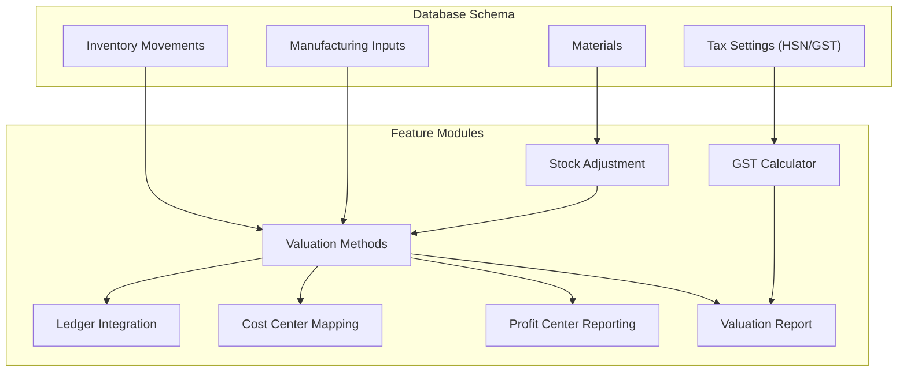
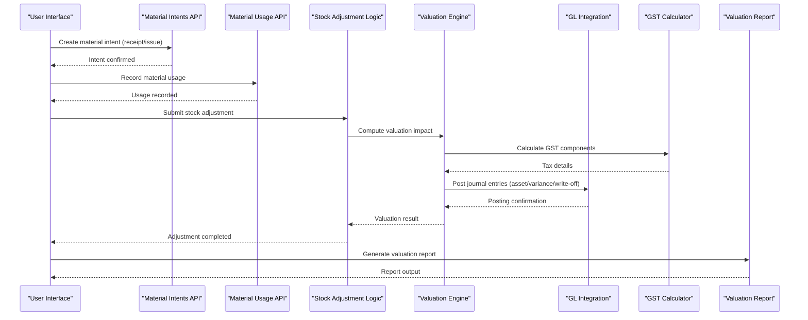
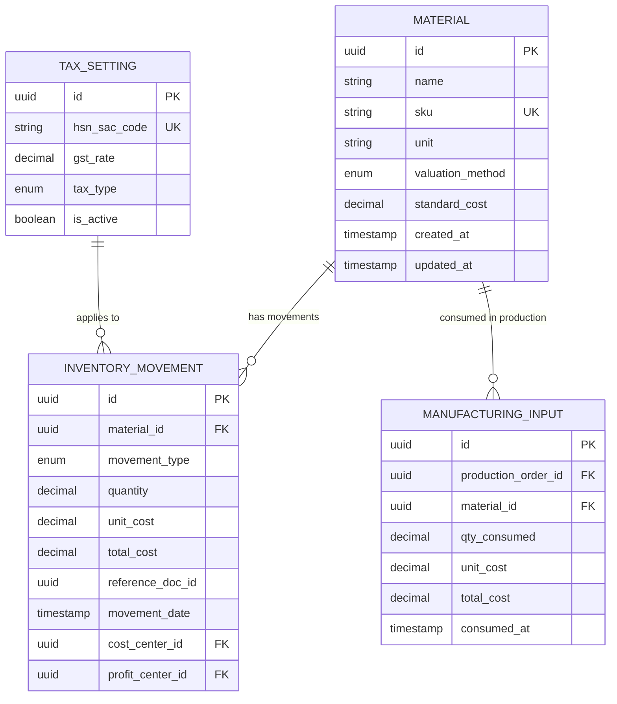
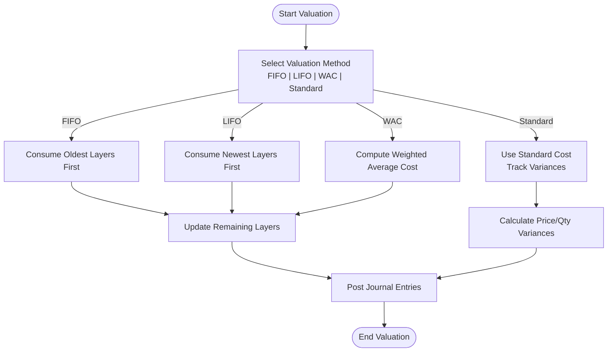
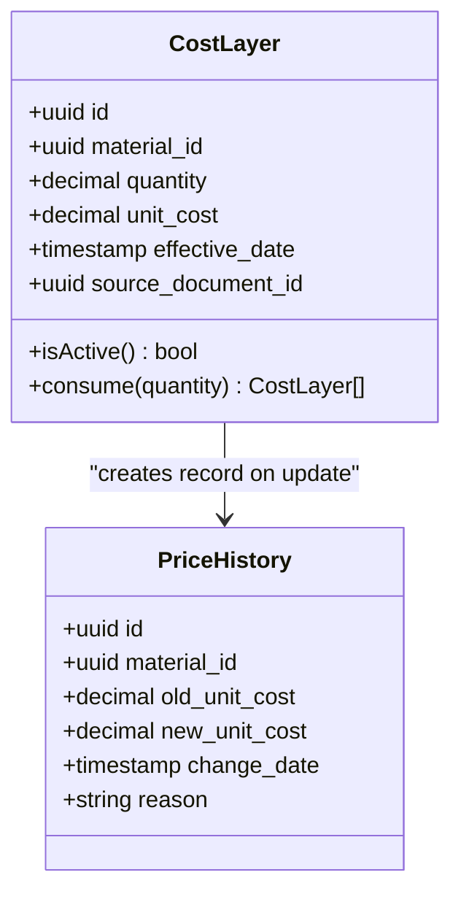
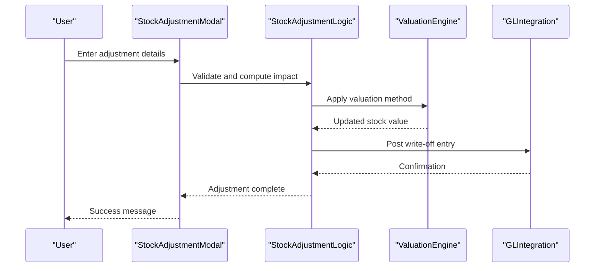
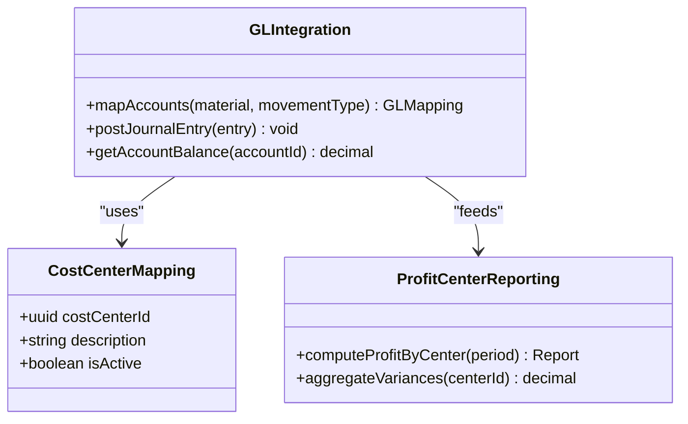
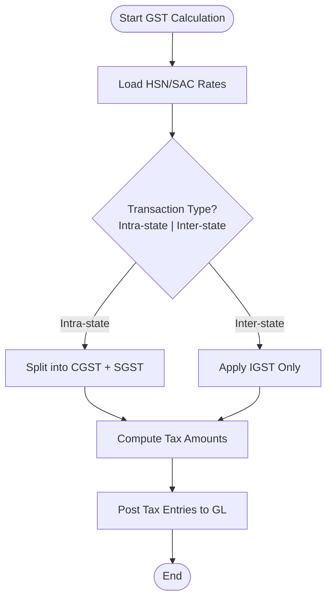
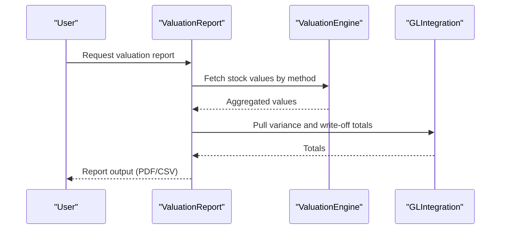
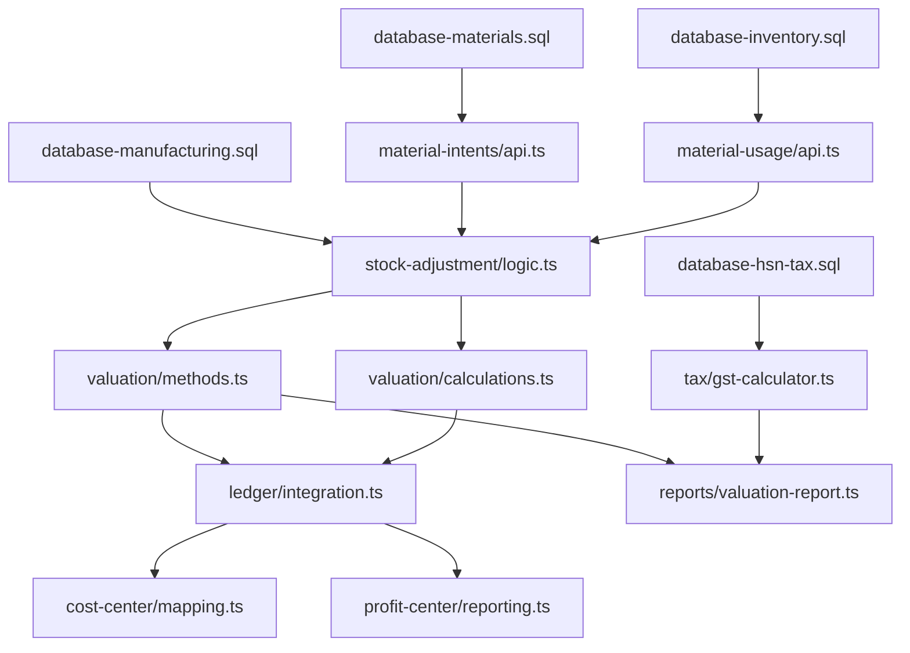

# Stock Valuation & Cost Accounting

<cite>
**Referenced Files in This Document**
- [database-inventory.sql](file://src/database-inventory.sql)
- [database-materials.sql](file://src/database-materials.sql)
- [database-manufacturing.sql](file://src/database-manufacturing.sql)
- [database-hsn-tax.sql](file://src/database-hsn-tax.sql)
- [material-intents/api.ts](file://src/material-intents/api.ts)
- [material-usage/api.ts](file://src/material-usage/api.ts)
- [features/materials/stock-adjustment/types.ts](file://src/features/materials/stock-adjustment/types.ts)
- [features/materials/stock-adjustment/logic.ts](file://src/features/materials/stock-adjustment/logic.ts)
- [features/materials/stock-adjustment/hooks.ts](file://src/features/materials/stock-adjustment/hooks.ts)
- [features/materials/stock-adjustment/components/StockAdjustmentModal.tsx](file://src/features/materials/stock-adjustment/components/StockAdjustmentModal.tsx)
- [features/materials/valuation/methods.ts](file://src/features/materials/valuation/methods.ts)
- [features/materials/valuation/calculations.ts](file://src/features/materials/valuation/calculations.ts)
- [features/materials/ledger/integration.ts](file://src/features/materials/ledger/integration.ts)
- [features/materials/cost-center/mapping.ts](file://src/features/materials/cost-center/mapping.ts)
- [features/materials/profit-center/reporting.ts](file://src/features/materials/profit-center/reporting.ts)
- [features/materials/tax/gst-calculator.ts](file://src/features/materials/tax/gst-calculator.ts)
- [features/materials/reports/valuation-report.ts](file://src/features/materials/reports/valuation-report.ts)
</cite>

## Table of Contents
1. [Introduction](#introduction)
2. [Project Structure](#project-structure)
3. [Core Components](#core-components)
4. [Architecture Overview](#architecture-overview)
5. [Detailed Component Analysis](#detailed-component-analysis)
6. [Dependency Analysis](#dependency-analysis)
7. [Performance Considerations](#performance-considerations)
8. [Troubleshooting Guide](#troubleshooting-guide)
9. [Conclusion](#conclusion)
10. [Appendices](#appendices)

## Introduction
This document provides comprehensive data model documentation for the stock valuation and cost accounting system. It covers:
- Valuation methods: FIFO, LIFO, weighted average cost, and standard costing
- Cost layer management and price history tracking
- Valuation adjustments and write-offs
- Integration with general ledger accounts, cost centers, and profit center accounting
- Calculation algorithms for stock value computation, variance analysis, and inventory write-offs
- Tax implications, GST calculations, and financial reporting requirements

The goal is to present a clear, accessible guide for both technical and non-technical stakeholders while maintaining traceability to source files.

## Project Structure
The stock valuation and cost accounting functionality spans database schemas, feature modules, and utility services. The key areas include:
- Database schema definitions for materials, inventory movements, manufacturing inputs, and tax settings
- Feature modules for stock adjustments, valuation methods, ledger integration, cost center mapping, profit center reporting, and GST calculation
- Reports for valuation outputs and compliance

[No sources needed since this diagram shows conceptual workflow, not actual code structure]

## Core Components
- Materials and Inventory Data Model
  - Material master records define item attributes, units, and default valuation method.
  - Inventory movements capture receipts, issues, transfers, and adjustments with timestamps and reference documents.
  - Manufacturing inputs link raw materials to production orders and track consumption quantities and costs.
  - Tax settings store HSN/SAC codes and GST rates applicable to items and transactions.

- Valuation Methods
  - FIFO: First-in, first-out; oldest cost layers are consumed first.
  - LIFO: Last-in, first-out; newest cost layers are consumed first.
  - Weighted Average Cost: Rolling average based on total cost divided by total quantity across layers.
  - Standard Costing: Uses predefined standard costs; variances are tracked and posted to GL.

- Cost Layer Management
  - Each receipt creates a new cost layer with unit cost, quantity, effective date, and source document.
  - Issues consume layers according to the selected valuation method.
  - Price history tracks changes over time for auditability and revaluation.

- Ledger Integration
  - Inventory asset accounts, purchase variance accounts, and write-off accounts are mapped to GL accounts.
  - Transactions generate journal entries with debits/credits aligned to cost centers and profit centers.

- Cost Centers and Profit Centers
  - Cost centers group expenses and inventory usage by department or project.
  - Profit centers enable profitability analysis per business unit or product line.

- GST and Tax Calculations
  - GST components (CGST, SGST, IGST) are calculated based on HSN/SAC codes and transaction type.
  - Tax postings integrate with GL for input tax credit and output tax liability.

- Reporting Requirements
  - Valuation reports summarize stock at cost, variances, and write-offs.
  - Compliance reports support statutory requirements and audits.

**Section sources**
- [database-materials.sql](file://src/database-materials.sql)
- [database-inventory.sql](file://src/database-inventory.sql)
- [database-manufacturing.sql](file://src/database-manufacturing.sql)
- [database-hsn-tax.sql](file://src/database-hsn-tax.sql)

## Architecture Overview
The system architecture integrates data models, valuation logic, ledger posting, and reporting.

**Diagram sources**
- [material-intents/api.ts](file://src/material-intents/api.ts)
- [material-usage/api.ts](file://src/material-usage/api.ts)
- [features/materials/stock-adjustment/logic.ts](file://src/features/materials/stock-adjustment/logic.ts)
- [features/materials/valuation/methods.ts](file://src/features/materials/valuation/methods.ts)
- [features/materials/valuation/calculations.ts](file://src/features/materials/valuation/calculations.ts)
- [features/materials/ledger/integration.ts](file://src/features/materials/ledger/integration.ts)
- [features/materials/tax/gst-calculator.ts](file://src/features/materials/tax/gst-calculator.ts)
- [features/materials/reports/valuation-report.ts](file://src/features/materials/reports/valuation-report.ts)

## Detailed Component Analysis

### Data Models and Relationships
The core entities include materials, inventory movements, manufacturing inputs, and tax settings. Their relationships ensure accurate valuation and reporting.

**Diagram sources**
- [database-materials.sql](file://src/database-materials.sql)
- [database-inventory.sql](file://src/database-inventory.sql)
- [database-manufacturing.sql](file://src/database-manufacturing.sql)
- [database-hsn-tax.sql](file://src/database-hsn-tax.sql)

**Section sources**
- [database-materials.sql](file://src/database-materials.sql)
- [database-inventory.sql](file://src/database-inventory.sql)
- [database-manufacturing.sql](file://src/database-manufacturing.sql)
- [database-hsn-tax.sql](file://src/database-hsn-tax.sql)

### Valuation Methods and Algorithms
Valuation methods determine how cost layers are consumed and how stock value is computed.

**Diagram sources**
- [features/materials/valuation/methods.ts](file://src/features/materials/valuation/methods.ts)
- [features/materials/valuation/calculations.ts](file://src/features/materials/valuation/calculations.ts)

**Section sources**
- [features/materials/valuation/methods.ts](file://src/features/materials/valuation/methods.ts)
- [features/materials/valuation/calculations.ts](file://src/features/materials/valuation/calculations.ts)

### Cost Layer Management and Price History
Cost layers represent batches of inventory with specific unit costs and effective dates. Price history ensures auditability and supports revaluation.

**Diagram sources**
- [features/materials/valuation/methods.ts](file://src/features/materials/valuation/methods.ts)
- [features/materials/valuation/calculations.ts](file://src/features/materials/valuation/calculations.ts)

**Section sources**
- [features/materials/valuation/methods.ts](file://src/features/materials/valuation/methods.ts)
- [features/materials/valuation/calculations.ts](file://src/features/materials/valuation/calculations.ts)

### Stock Adjustments and Write-offs
Stock adjustments handle corrections, damages, obsolescence, and physical count differences. Write-offs reduce inventory value and post losses to GL.

**Diagram sources**
- [features/materials/stock-adjustment/components/StockAdjustmentModal.tsx](file://src/features/materials/stock-adjustment/components/StockAdjustmentModal.tsx)
- [features/materials/stock-adjustment/logic.ts](file://src/features/materials/stock-adjustment/logic.ts)
- [features/materials/valuation/methods.ts](file://src/features/materials/valuation/methods.ts)
- [features/materials/ledger/integration.ts](file://src/features/materials/ledger/integration.ts)

**Section sources**
- [features/materials/stock-adjustment/types.ts](file://src/features/materials/stock-adjustment/types.ts)
- [features/materials/stock-adjustment/logic.ts](file://src/features/materials/stock-adjustment/logic.ts)
- [features/materials/stock-adjustment/hooks.ts](file://src/features/materials/stock-adjustment/hooks.ts)
- [features/materials/stock-adjustment/components/StockAdjustmentModal.tsx](file://src/features/materials/stock-adjustment/components/StockAdjustmentModal.tsx)

### General Ledger Integration
Ledger integration posts inventory-related transactions to GL accounts, including asset accounts, variance accounts, and write-off accounts.

**Diagram sources**
- [features/materials/ledger/integration.ts](file://src/features/materials/ledger/integration.ts)
- [features/materials/cost-center/mapping.ts](file://src/features/materials/cost-center/mapping.ts)
- [features/materials/profit-center/reporting.ts](file://src/features/materials/profit-center/reporting.ts)

**Section sources**
- [features/materials/ledger/integration.ts](file://src/features/materials/ledger/integration.ts)
- [features/materials/cost-center/mapping.ts](file://src/features/materials/cost-center/mapping.ts)
- [features/materials/profit-center/reporting.ts](file://src/features/materials/profit-center/reporting.ts)

### GST and Tax Calculations
GST calculator computes CGST, SGST, and IGST based on HSN/SAC codes and transaction context.

**Diagram sources**
- [features/materials/tax/gst-calculator.ts](file://src/features/materials/tax/gst-calculator.ts)
- [database-hsn-tax.sql](file://src/database-hsn-tax.sql)

**Section sources**
- [features/materials/tax/gst-calculator.ts](file://src/features/materials/tax/gst-calculator.ts)
- [database-hsn-tax.sql](file://src/database-hsn-tax.sql)

### Financial Reporting Requirements
Valuation reports provide insights into stock value, variances, and write-offs for internal and statutory purposes.

**Diagram sources**
- [features/materials/reports/valuation-report.ts](file://src/features/materials/reports/valuation-report.ts)
- [features/materials/valuation/methods.ts](file://src/features/materials/valuation/methods.ts)
- [features/materials/ledger/integration.ts](file://src/features/materials/ledger/integration.ts)

**Section sources**
- [features/materials/reports/valuation-report.ts](file://src/features/materials/reports/valuation-report.ts)

## Dependency Analysis
The following diagram illustrates dependencies between feature modules and database schemas.

**Diagram sources**
- [database-materials.sql](file://src/database-materials.sql)
- [database-inventory.sql](file://src/database-inventory.sql)
- [database-manufacturing.sql](file://src/database-manufacturing.sql)
- [database-hsn-tax.sql](file://src/database-hsn-tax.sql)
- [material-intents/api.ts](file://src/material-intents/api.ts)
- [material-usage/api.ts](file://src/material-usage/api.ts)
- [features/materials/stock-adjustment/logic.ts](file://src/features/materials/stock-adjustment/logic.ts)
- [features/materials/valuation/methods.ts](file://src/features/materials/valuation/methods.ts)
- [features/materials/valuation/calculations.ts](file://src/features/materials/valuation/calculations.ts)
- [features/materials/ledger/integration.ts](file://src/features/materials/ledger/integration.ts)
- [features/materials/cost-center/mapping.ts](file://src/features/materials/cost-center/mapping.ts)
- [features/materials/profit-center/reporting.ts](file://src/features/materials/profit-center/reporting.ts)
- [features/materials/tax/gst-calculator.ts](file://src/features/materials/tax/gst-calculator.ts)
- [features/materials/reports/valuation-report.ts](file://src/features/materials/reports/valuation-report.ts)

**Section sources**
- [material-intents/api.ts](file://src/material-intents/api.ts)
- [material-usage/api.ts](file://src/material-usage/api.ts)
- [features/materials/stock-adjustment/logic.ts](file://src/features/materials/stock-adjustment/logic.ts)
- [features/materials/valuation/methods.ts](file://src/features/materials/valuation/methods.ts)
- [features/materials/valuation/calculations.ts](file://src/features/materials/valuation/calculations.ts)
- [features/materials/ledger/integration.ts](file://src/features/materials/ledger/integration.ts)
- [features/materials/cost-center/mapping.ts](file://src/features/materials/cost-center/mapping.ts)
- [features/materials/profit-center/reporting.ts](file://src/features/materials/profit-center/reporting.ts)
- [features/materials/tax/gst-calculator.ts](file://src/features/materials/tax/gst-calculator.ts)
- [features/materials/reports/valuation-report.ts](file://src/features/materials/reports/valuation-report.ts)

## Performance Considerations
- Batch processing for large inventories to minimize lock contention during valuation runs.
- Indexing strategies on material IDs, movement dates, and cost center identifiers for faster queries.
- Caching of weighted averages and standard costs where appropriate to reduce recomputation.
- Asynchronous posting to GL to avoid blocking user operations.
- Partitioning of inventory movements by date ranges for historical performance.

[No sources needed since this section provides general guidance]

## Troubleshooting Guide
Common issues and resolutions:
- Mismatched valuation methods: Ensure each material’s valuation method aligns with policy and that updates propagate to existing layers.
- Incorrect GST application: Verify HSN/SAC mappings and intra/inter-state classification for correct CGST/SGST/IGST splits.
- Ledger posting failures: Check account mappings and cost/profit center assignments before resubmitting.
- Write-off discrepancies: Reconcile physical counts with system quantities and validate adjustment approvals.

**Section sources**
- [features/materials/stock-adjustment/logic.ts](file://src/features/materials/stock-adjustment/logic.ts)
- [features/materials/tax/gst-calculator.ts](file://src/features/materials/tax/gst-calculator.ts)
- [features/materials/ledger/integration.ts](file://src/features/materials/ledger/integration.ts)

## Conclusion
The stock valuation and cost accounting system integrates robust data models, flexible valuation methods, precise tax calculations, and comprehensive reporting. By adhering to defined processes for cost layer management, ledger integration, and compliance reporting, organizations can maintain accurate inventory valuations and meet financial and statutory requirements.

[No sources needed since this section summarizes without analyzing specific files]

## Appendices
- Glossary of terms: FIFO, LIFO, WAC, Standard Costing, HSN/SAC, CGST, SGST, IGST
- Best practices for valuation method selection and periodic reviews
- Audit trail recommendations for price history and adjustments

[No sources needed since this section provides general guidance]