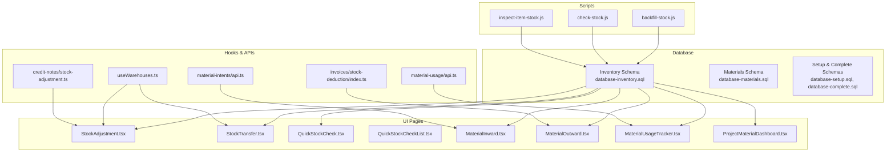
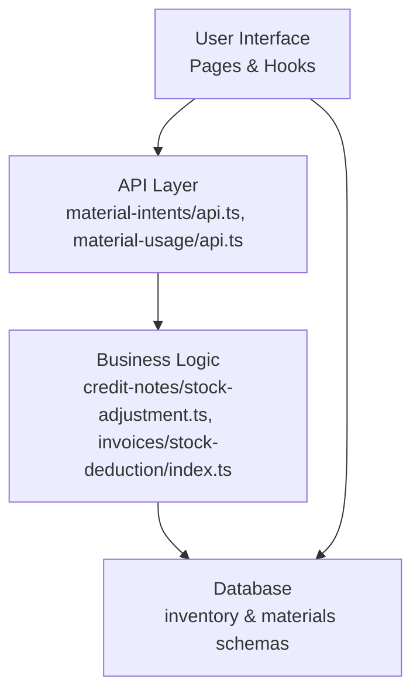
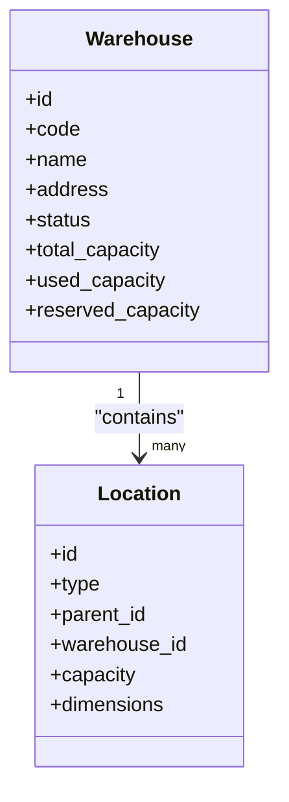
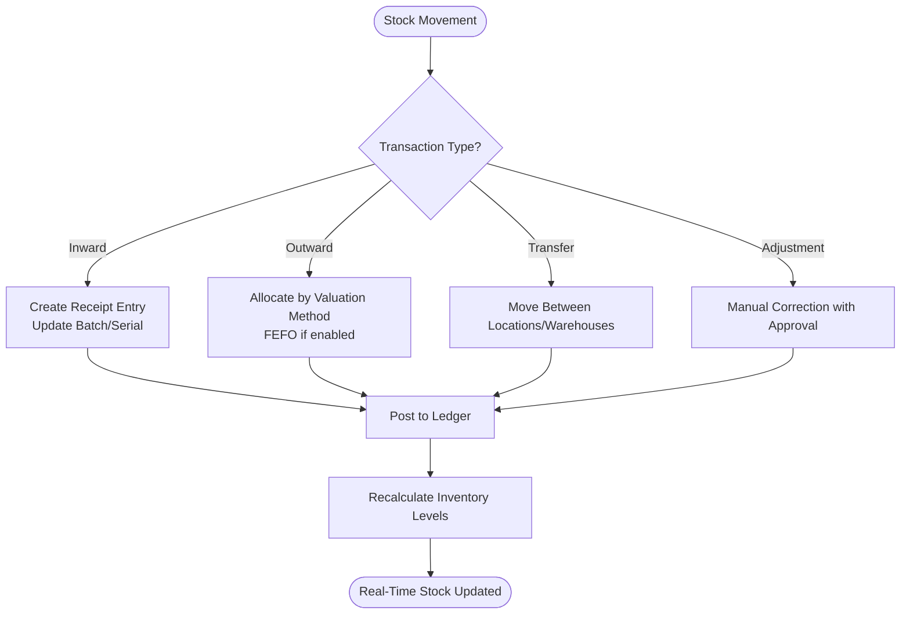
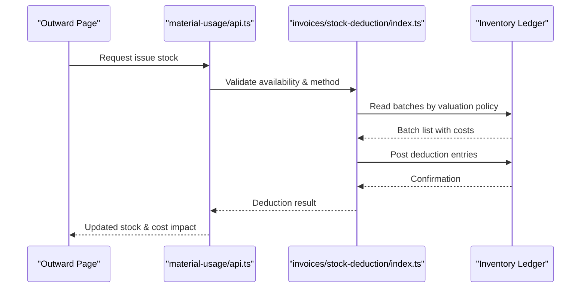
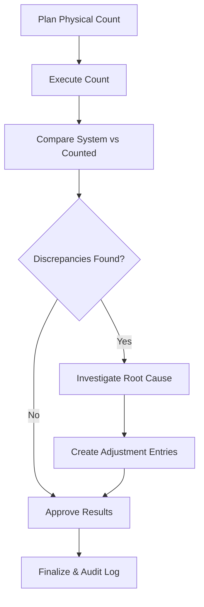
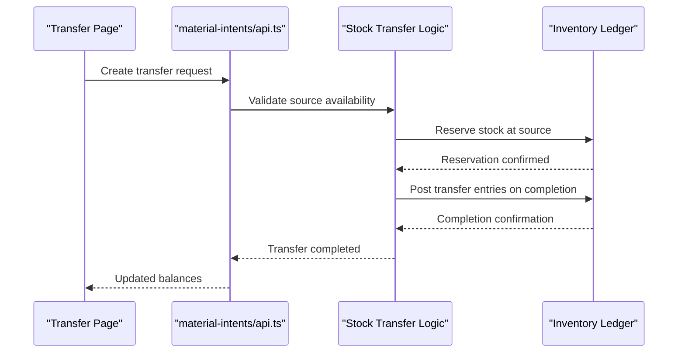
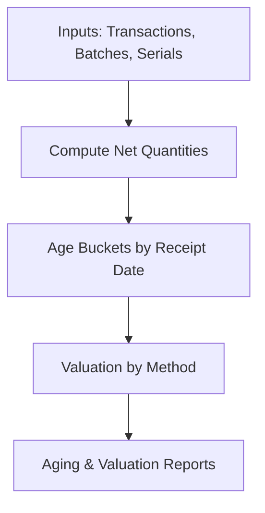
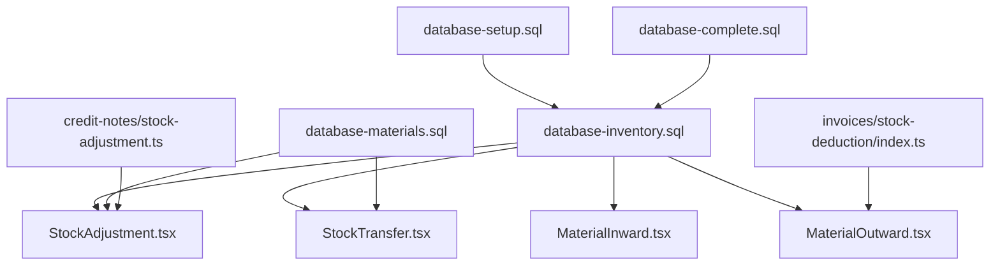
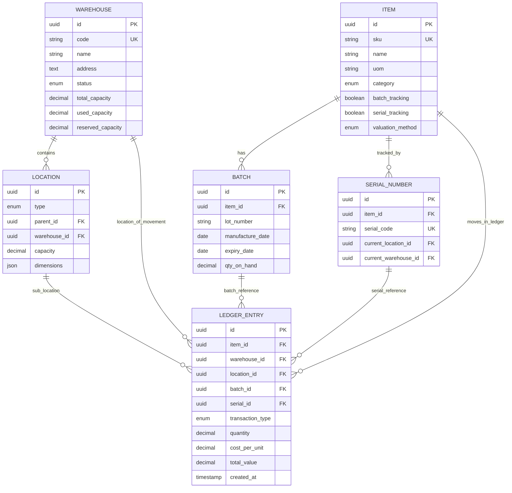

# Warehouse & Stock Management

<cite>
**Referenced Files in This Document**
- [database-inventory.sql](file://src/database-inventory.sql)
- [database-materials.sql](file://src/database-materials.sql)
- [database-setup.sql](file://src/database-setup.sql)
- [database-complete.sql](file://src/database-complete.sql)
- [useWarehouses.ts](file://src/hooks/useWarehouses.ts)
- [StockAdjustment.tsx](file://src/pages/StockAdjustment.tsx)
- [StockTransfer.tsx](file://src/pages/StockTransfer.tsx)
- [QuickStockCheck.tsx](file://src/pages/QuickStockCheck.tsx)
- [QuickStockCheckList.tsx](file://src/pages/QuickStockCheckList.tsx)
- [MaterialInward.tsx](file://src/pages/MaterialInward.tsx)
- [MaterialOutward.tsx](file://src/pages/MaterialOutward.tsx)
- [MaterialUsageTracker.tsx](file://src/pages/MaterialUsageTracker.tsx)
- [ProjectMaterialDashboard.tsx](file://src/pages/ProjectMaterialDashboard.tsx)
- [material-intents/api.ts](file://src/material-intents/api.ts)
- [material-usage/api.ts](file://src/material-usage/api.ts)
- [credit-notes/stock-adjustment.ts](file://src/credit-notes/stock-adjustment.ts)
- [invoices/stock-deduction/index.ts](file://src/invoices/stock-deduction/index.ts)
- [backfill-stock.js](file://scratch/backfill-stock.js)
- [check-stock.js](file://scratch/check-stock.js)
- [inspect-item-stock.js](file://scratch/inspect-item-stock.js)
</cite>

## Table of Contents
1. [Introduction](#introduction)
2. [Project Structure](#project-structure)
3. [Core Components](#core-components)
4. [Architecture Overview](#architecture-overview)
5. [Detailed Component Analysis](#detailed-component-analysis)
6. [Dependency Analysis](#dependency-analysis)
7. [Performance Considerations](#performance-considerations)
8. [Troubleshooting Guide](#troubleshooting-guide)
9. [Conclusion](#conclusion)
10. [Appendices](#appendices)

## Introduction
This document provides a comprehensive data model and process documentation for the warehouse and stock management system. It covers:
- Warehouse entity structure, location hierarchy, and capacity management
- Stock tracking mechanisms including real-time inventory levels, batch numbers, serial number tracking, and expiry date management
- Stock valuation methods (FIFO, LIFO, weighted average) and cost accounting integration
- Stock adjustment processes, physical verification workflows, and discrepancy handling
- Complex queries for stock level calculations, aging reports, and inventory valuation
- Multi-warehouse scenarios, inter-warehouse transfers, and stock reconciliation procedures

The goal is to make the system understandable for both technical and non-technical stakeholders while providing actionable guidance for implementation and operations.

## Project Structure
The warehouse and stock management features are implemented across database migrations, UI pages, hooks, and utility scripts. Key areas include:
- Database schema definitions for inventory, materials, and related entities
- UI pages for stock adjustments, transfers, inward/outward processing, usage tracking, and quick checks
- Hooks and APIs for material intents and usage
- Scripts for backfilling and validating stock data

**Diagram sources**
- [database-inventory.sql](file://src/database-inventory.sql)
- [database-materials.sql](file://src/database-materials.sql)
- [database-setup.sql](file://src/database-setup.sql)
- [database-complete.sql](file://src/database-complete.sql)
- [StockAdjustment.tsx](file://src/pages/StockAdjustment.tsx)
- [StockTransfer.tsx](file://src/pages/StockTransfer.tsx)
- [QuickStockCheck.tsx](file://src/pages/QuickStockCheck.tsx)
- [QuickStockCheckList.tsx](file://src/pages/QuickStockCheckList.tsx)
- [MaterialInward.tsx](file://src/pages/MaterialInward.tsx)
- [MaterialOutward.tsx](file://src/pages/MaterialOutward.tsx)
- [MaterialUsageTracker.tsx](file://src/pages/MaterialUsageTracker.tsx)
- [ProjectMaterialDashboard.tsx](file://src/pages/ProjectMaterialDashboard.tsx)
- [useWarehouses.ts](file://src/hooks/useWarehouses.ts)
- [material-intents/api.ts](file://src/material-intents/api.ts)
- [material-usage/api.ts](file://src/material-usage/api.ts)
- [credit-notes/stock-adjustment.ts](file://src/credit-notes/stock-adjustment.ts)
- [invoices/stock-deduction/index.ts](file://src/invoices/stock-deduction/index.ts)
- [backfill-stock.js](file://scratch/backfill-stock.js)
- [check-stock.js](file://scratch/check-stock.js)
- [inspect-item-stock.js](file://scratch/inspect-item-stock.js)

**Section sources**
- [database-inventory.sql](file://src/database-inventory.sql)
- [database-materials.sql](file://src/database-materials.sql)
- [database-setup.sql](file://src/database-setup.sql)
- [database-complete.sql](file://src/database-complete.sql)
- [useWarehouses.ts](file://src/hooks/useWarehouses.ts)
- [StockAdjustment.tsx](file://src/pages/StockAdjustment.tsx)
- [StockTransfer.tsx](file://src/pages/StockTransfer.tsx)
- [QuickStockCheck.tsx](file://src/pages/QuickStockCheck.tsx)
- [QuickStockCheckList.tsx](file://src/pages/QuickStockCheckList.tsx)
- [MaterialInward.tsx](file://src/pages/MaterialInward.tsx)
- [MaterialOutward.tsx](file://src/pages/MaterialOutward.tsx)
- [MaterialUsageTracker.tsx](file://src/pages/MaterialUsageTracker.tsx)
- [ProjectMaterialDashboard.tsx](file://src/pages/ProjectMaterialDashboard.tsx)
- [material-intents/api.ts](file://src/material-intents/api.ts)
- [material-usage/api.ts](file://src/material-usage/api.ts)
- [credit-notes/stock-adjustment.ts](file://src/credit-notes/stock-adjustment.ts)
- [invoices/stock-deduction/index.ts](file://src/invoices/stock-deduction/index.ts)
- [backfill-stock.js](file://scratch/backfill-stock.js)
- [check-stock.js](file://scratch/check-stock.js)
- [inspect-item-stock.js](file://scratch/inspect-item-stock.js)

## Core Components
This section outlines the core data entities and relationships that underpin warehouse and stock management.

- Warehouse
  - Represents a physical or logical storage location with attributes such as name, code, address, and status.
  - Supports hierarchical organization via parent-child relationships to model buildings, floors, aisles, racks, and bins.
  - Capacity management includes total capacity, used capacity, and reserved capacity fields to enforce allocation constraints.

- Location Hierarchy
  - A recursive structure enabling nested locations within warehouses.
  - Each location has a type (e.g., warehouse, building, floor, aisle, rack, bin), parent reference, and metadata like dimensions and capacity.

- Item Master
  - Defines items with unit of measure, category, and optional batch/serial tracking flags.
  - Includes pricing defaults and valuation method selection (FIFO, LIFO, weighted average).

- Inventory Ledger
  - Tracks all stock movements with transaction types (inward, outward, transfer, adjustment, return).
  - Captures quantity, cost per unit, total value, timestamps, and references to source documents.
  - Supports batch and serial number linkage for traceability.

- Batch and Serial Tracking
  - Batch records store production/expiry dates, supplier lot numbers, and associated quantities.
  - Serial number records link unique identifiers to specific units and their current location.

- Expiry Date Management
  - Items can have configurable shelf life rules.
  - System enforces FEFO (first-expired-first-out) logic when applicable alongside FIFO/LIFO policies.

- Valuation Methods
  - FIFO: Oldest available batches are consumed first.
  - LIFO: Newest available batches are consumed first.
  - Weighted Average: Cost per unit is recalculated after each receipt based on total cost and total quantity.

- Real-Time Inventory Levels
  - Aggregated from ledger transactions to provide current stock by item, warehouse, and location.
  - Reserved quantities account for pending outbound documents.

- Cost Accounting Integration
  - Ledger entries post to general ledger accounts for receipts, issues, adjustments, and transfers.
  - Variance analysis compares standard vs actual costs.

**Section sources**
- [database-inventory.sql](file://src/database-inventory.sql)
- [database-materials.sql](file://src/database-materials.sql)
- [database-setup.sql](file://src/database-setup.sql)
- [database-complete.sql](file://src/database-complete.sql)

## Architecture Overview
The system integrates UI-driven workflows with backend data models to manage stock across multiple warehouses. The following diagram illustrates the high-level architecture and key interactions.

**Diagram sources**
- [material-intents/api.ts](file://src/material-intents/api.ts)
- [material-usage/api.ts](file://src/material-usage/api.ts)
- [credit-notes/stock-adjustment.ts](file://src/credit-notes/stock-adjustment.ts)
- [invoices/stock-deduction/index.ts](file://src/invoices/stock-deduction/index.ts)
- [database-inventory.sql](file://src/database-inventory.sql)
- [database-materials.sql](file://src/database-materials.sql)

## Detailed Component Analysis

### Warehouse Entity and Location Hierarchy
- Warehouse entity supports multi-location modeling with hierarchical children.
- Capacity fields enable enforcement of storage limits and prevent over-allocation.
- Hierarchical queries traverse parent-child links to compute totals at any level.

**Diagram sources**
- [database-inventory.sql](file://src/database-inventory.sql)
- [database-materials.sql](file://src/database-materials.sql)

**Section sources**
- [database-inventory.sql](file://src/database-inventory.sql)
- [database-materials.sql](file://src/database-materials.sql)

### Stock Tracking Mechanisms
- Real-time inventory levels are derived from ledger transactions.
- Batch numbers capture lot-specific details and support expiry-based consumption.
- Serial numbers uniquely identify individual units and track movement history.
- Expiry dates drive FEFO logic and alerting for near-expiry items.

**Diagram sources**
- [database-inventory.sql](file://src/database-inventory.sql)
- [MaterialInward.tsx](file://src/pages/MaterialInward.tsx)
- [MaterialOutward.tsx](file://src/pages/MaterialOutward.tsx)
- [StockAdjustment.tsx](file://src/pages/StockAdjustment.tsx)
- [StockTransfer.tsx](file://src/pages/StockTransfer.tsx)

**Section sources**
- [database-inventory.sql](file://src/database-inventory.sql)
- [MaterialInward.tsx](file://src/pages/MaterialInward.tsx)
- [MaterialOutward.tsx](file://src/pages/MaterialOutward.tsx)
- [StockAdjustment.tsx](file://src/pages/StockAdjustment.tsx)
- [StockTransfer.tsx](file://src/pages/StockTransfer.tsx)

### Stock Valuation Methods and Cost Accounting
- FIFO consumes oldest batches first; LIFO consumes newest; weighted average recalculates cost per unit after receipts.
- Cost accounting posts ledger entries to GL accounts for accurate financial reporting.
- Variance analysis highlights differences between expected and actual costs.

**Diagram sources**
- [MaterialOutward.tsx](file://src/pages/MaterialOutward.tsx)
- [material-usage/api.ts](file://src/material-usage/api.ts)
- [invoices/stock-deduction/index.ts](file://src/invoices/stock-deduction/index.ts)
- [database-inventory.sql](file://src/database-inventory.sql)

**Section sources**
- [database-inventory.sql](file://src/database-inventory.sql)
- [MaterialOutward.tsx](file://src/pages/MaterialOutward.tsx)
- [material-usage/api.ts](file://src/material-usage/api.ts)
- [invoices/stock-deduction/index.ts](file://src/invoices/stock-deduction/index.ts)

### Stock Adjustment Processes and Physical Verification
- Adjustments allow manual corrections with audit trails and approvals.
- Physical verification workflows compare system stock vs counted stock and generate discrepancies.
- Discrepancy handling includes root cause analysis and corrective actions.

**Diagram sources**
- [StockAdjustment.tsx](file://src/pages/StockAdjustment.tsx)
- [QuickStockCheck.tsx](file://src/pages/QuickStockCheck.tsx)
- [QuickStockCheckList.tsx](file://src/pages/QuickStockCheckList.tsx)
- [credit-notes/stock-adjustment.ts](file://src/credit-notes/stock-adjustment.ts)

**Section sources**
- [StockAdjustment.tsx](file://src/pages/StockAdjustment.tsx)
- [QuickStockCheck.tsx](file://src/pages/QuickStockCheck.tsx)
- [QuickStockCheckList.tsx](file://src/pages/QuickStockCheckList.tsx)
- [credit-notes/stock-adjustment.ts](file://src/credit-notes/stock-adjustment.ts)

### Multi-Warehouse Scenarios and Inter-Warehouse Transfers
- Transfers move stock between warehouses or locations with full audit trails.
- Transfer orders create reservation entries and update ledger upon completion.
- Reconciliation ensures balances match across warehouses after transfers.

**Diagram sources**
- [StockTransfer.tsx](file://src/pages/StockTransfer.tsx)
- [material-intents/api.ts](file://src/material-intents/api.ts)
- [database-inventory.sql](file://src/database-inventory.sql)

**Section sources**
- [StockTransfer.tsx](file://src/pages/StockTransfer.tsx)
- [material-intents/api.ts](file://src/material-intents/api.ts)
- [database-inventory.sql](file://src/database-inventory.sql)

### Complex Queries: Stock Levels, Aging Reports, and Inventory Valuation
- Stock Level Calculations
  - Sum inbound minus outbound quantities grouped by item, warehouse, and location.
  - Include reserved quantities for accurate availability.
- Aging Reports
  - Classify stock by age buckets using receipt dates and current date.
  - Highlight slow-moving and obsolete items.
- Inventory Valuation
  - Apply selected valuation method to compute total value.
  - Generate variance reports comparing standard vs actual costs.

[No sources needed since this diagram shows conceptual workflow, not actual code structure]

## Dependency Analysis
The warehouse and stock modules depend on shared database schemas and integrate with credit notes and invoicing flows.

**Diagram sources**
- [database-inventory.sql](file://src/database-inventory.sql)
- [database-materials.sql](file://src/database-materials.sql)
- [database-setup.sql](file://src/database-setup.sql)
- [database-complete.sql](file://src/database-complete.sql)
- [StockAdjustment.tsx](file://src/pages/StockAdjustment.tsx)
- [StockTransfer.tsx](file://src/pages/StockTransfer.tsx)
- [MaterialInward.tsx](file://src/pages/MaterialInward.tsx)
- [MaterialOutward.tsx](file://src/pages/MaterialOutward.tsx)
- [credit-notes/stock-adjustment.ts](file://src/credit-notes/stock-adjustment.ts)
- [invoices/stock-deduction/index.ts](file://src/invoices/stock-deduction/index.ts)

**Section sources**
- [database-inventory.sql](file://src/database-inventory.sql)
- [database-materials.sql](file://src/database-materials.sql)
- [database-setup.sql](file://src/database-setup.sql)
- [database-complete.sql](file://src/database-complete.sql)
- [StockAdjustment.tsx](file://src/pages/StockAdjustment.tsx)
- [StockTransfer.tsx](file://src/pages/StockTransfer.tsx)
- [MaterialInward.tsx](file://src/pages/MaterialInward.tsx)
- [MaterialOutward.tsx](file://src/pages/MaterialOutward.tsx)
- [credit-notes/stock-adjustment.ts](file://src/credit-notes/stock-adjustment.ts)
- [invoices/stock-deduction/index.ts](file://src/invoices/stock-deduction/index.ts)

## Performance Considerations
- Indexing strategies for frequent filters (item, warehouse, date ranges).
- Partitioning large ledger tables by date to improve query performance.
- Caching aggregated stock levels for read-heavy dashboards.
- Batch processing for bulk adjustments and transfers to reduce lock contention.
- Efficient FEFO/FIFO algorithms to minimize scanning overhead.

[No sources needed since this section provides general guidance]

## Troubleshooting Guide
Common issues and resolutions:
- Negative stock occurrences
  - Validate reservation logic and concurrent access controls.
  - Review allocation order and valuation method settings.
- Discrepancies after transfers
  - Inspect transfer ledger entries and ensure completion steps executed.
  - Use reconciliation tools to identify missing postings.
- Incorrect valuation results
  - Verify batch cost updates and weighted average recalculation triggers.
  - Check for unposted adjustments affecting averages.
- Slow report generation
  - Optimize indexes and consider pre-aggregated summary tables.
  - Limit date ranges and use pagination.

Operational utilities:
- Backfill stock data to reconcile historical gaps.
- Check stock consistency across warehouses and locations.
- Inspect item-level stock details for anomalies.

**Section sources**
- [backfill-stock.js](file://scratch/backfill-stock.js)
- [check-stock.js](file://scratch/check-stock.js)
- [inspect-item-stock.js](file://scratch/inspect-item-stock.js)

## Conclusion
The warehouse and stock management system provides robust capabilities for multi-warehouse operations, precise stock tracking, and flexible valuation methods. By leveraging hierarchical locations, batch and serial tracking, and comprehensive adjustment and transfer workflows, the system supports accurate inventory control and financial reporting. Continuous monitoring, reconciliation, and performance optimization ensure reliability and scalability.

[No sources needed since this section summarizes without analyzing specific files]

## Appendices

### Data Model Diagram

**Diagram sources**
- [database-inventory.sql](file://src/database-inventory.sql)
- [database-materials.sql](file://src/database-materials.sql)