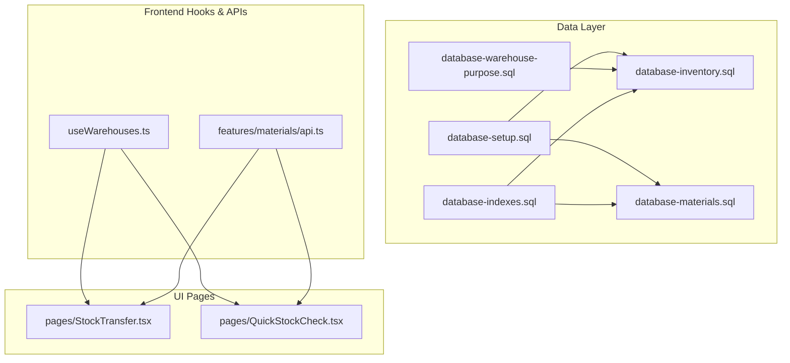
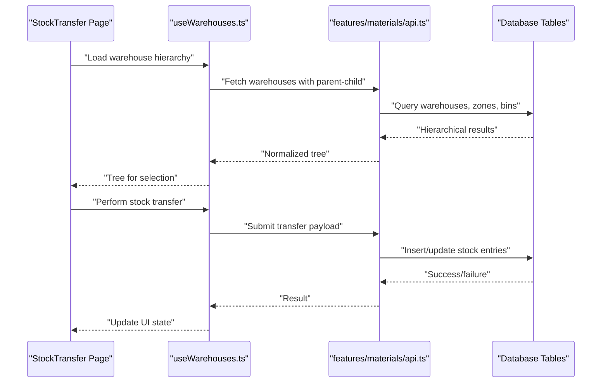
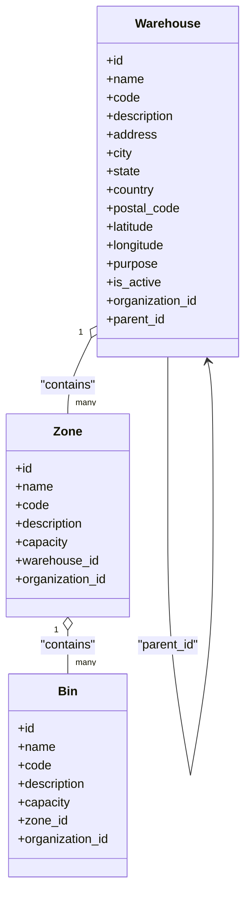
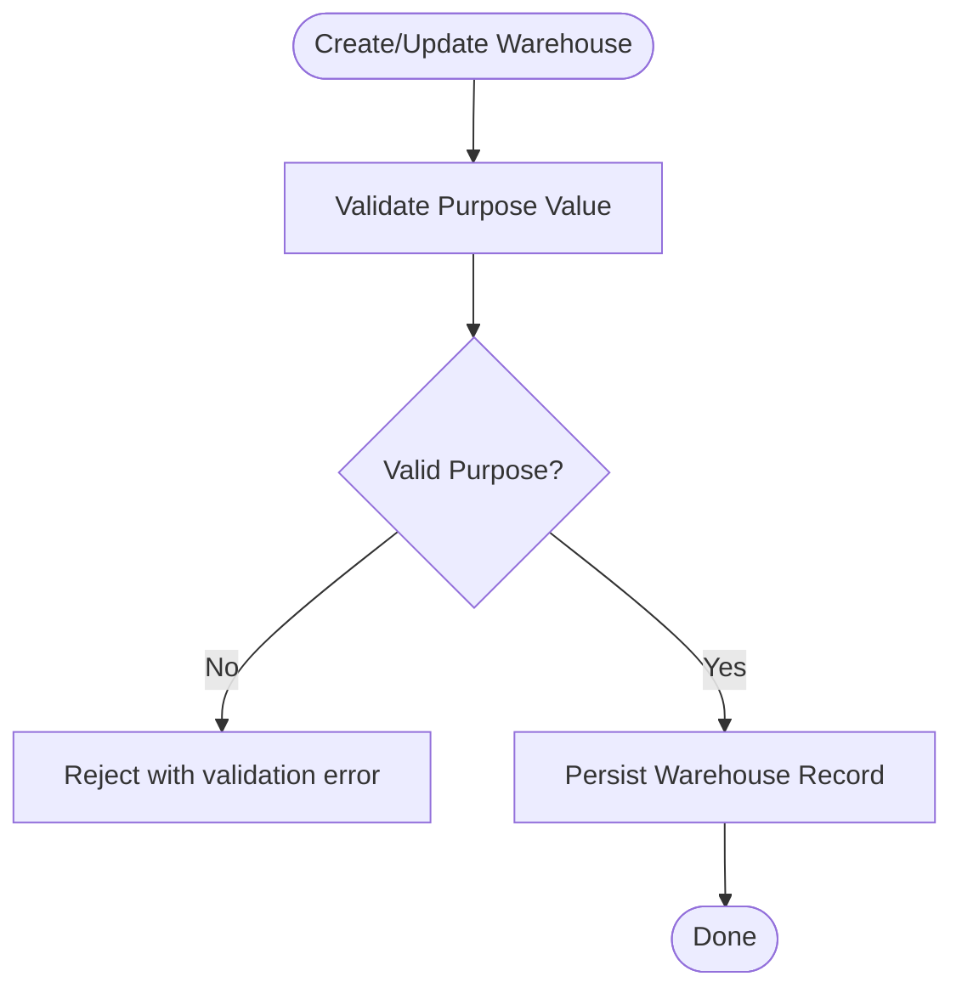
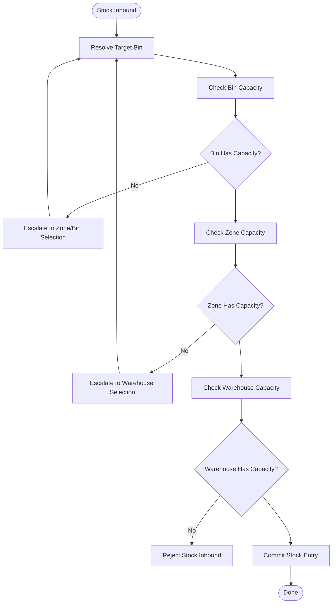
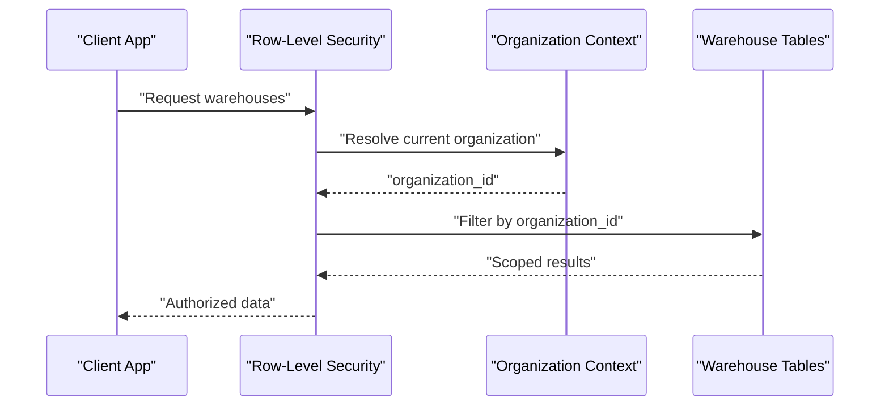
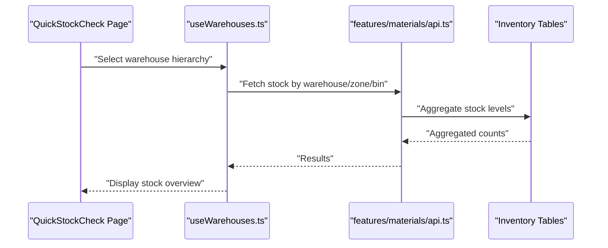
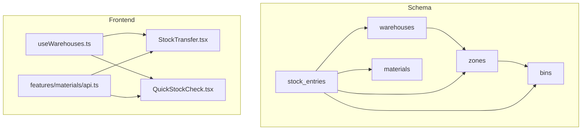

# Warehouse Locations & Hierarchy

<cite>
**Referenced Files in This Document**
- [database-warehouse-purpose.sql](file://src/database-warehouse-purpose.sql)
- [useWarehouses.ts](file://src/hooks/useWarehouses.ts)
- [materials.ts](file://src/features/materials/api.ts)
- [StockTransfer.tsx](file://src/pages/StockTransfer.tsx)
- [QuickStockCheck.tsx](file://src/pages/QuickStockCheck.tsx)
- [database-inventory.sql](file://src/database-inventory.sql)
- [database-materials.sql](file://src/database-materials.sql)
- [database-setup.sql](file://src/database-setup.sql)
- [database-indexes.sql](file://database-indexes.sql)
</cite>

## Table of Contents
1. [Introduction](#introduction)
2. [Project Structure](#project-structure)
3. [Core Components](#core-components)
4. [Architecture Overview](#architecture-overview)
5. [Detailed Component Analysis](#detailed-component-analysis)
6. [Dependency Analysis](#dependency-analysis)
7. [Performance Considerations](#performance-considerations)
8. [Troubleshooting Guide](#troubleshooting-guide)
9. [Conclusion](#conclusion)
10. [Appendices](#appendices)

## Introduction
This document describes the data model and implementation for warehouse location management, including:
- Warehouse entity structure with hierarchical locations (parent-child relationships)
- Geographic information fields
- Capacity management at warehouse, zone, and bin levels
- Storage zones and bin-level organization
- Purpose classification (raw materials, finished goods, work-in-progress)
- Access control mechanisms
- Database schema, foreign keys, and indexing strategies
- Multi-tenant scenarios and organization-specific configurations

The goal is to provide a clear, code-sourced reference for developers and domain users working with warehouses and inventory operations.

## Project Structure
Warehouse-related functionality spans database migrations/schema files, API hooks, and UI pages that consume warehouse data. The key areas are:
- Data definitions and constraints in SQL migration files
- Frontend hooks and APIs for warehouse queries and mutations
- Pages that perform stock transfers and quick checks using warehouse hierarchies

**Diagram sources**
- [database-setup.sql](file://src/database-setup.sql)
- [database-inventory.sql](file://src/database-inventory.sql)
- [database-materials.sql](file://src/database-materials.sql)
- [database-warehouse-purpose.sql](file://src/database-warehouse-purpose.sql)
- [database-indexes.sql](file://database-indexes.sql)
- [useWarehouses.ts](file://src/hooks/useWarehouses.ts)
- [materials.ts](file://src/features/materials/api.ts)
- [StockTransfer.tsx](file://src/pages/StockTransfer.tsx)
- [QuickStockCheck.tsx](file://src/pages/QuickStockCheck.tsx)

**Section sources**
- [database-setup.sql](file://src/database-setup.sql)
- [database-inventory.sql](file://src/database-inventory.sql)
- [database-materials.sql](file://src/database-materials.sql)
- [database-warehouse-purpose.sql](file://src/database-warehouse-purpose.sql)
- [database-indexes.sql](file://database-indexes.sql)
- [useWarehouses.ts](file://src/hooks/useWarehouses.ts)
- [materials.ts](file://src/features/materials/api.ts)
- [StockTransfer.tsx](file://src/pages/StockTransfer.tsx)
- [QuickStockCheck.tsx](file://src/pages/QuickStockCheck.tsx)

## Core Components
- Warehouse entity and hierarchy
  - Supports parent-child relationships to model building → floor → aisle → rack → bin structures
  - Includes geographic fields such as address, city, state, country, postal code, latitude, longitude
- Purpose classification
  - Enumerated purpose values include raw materials, finished goods, work-in-progress
  - Enforced via dedicated purpose table or column constraints
- Capacity management
  - Warehouse-level capacity limits
  - Zone-level capacity and utilization tracking
  - Bin-level capacity and occupancy
- Storage zones and bins
  - Zones partition warehouses by function or product type
  - Bins represent the smallest storage unit within zones
- Access control
  - Row-level security policies scoped by organization
  - Role-based access to create, read, update, delete warehouses and related entities
- Multi-tenancy
  - Organization-scoped records ensure isolation across tenants
  - Organization-specific configuration flags per warehouse

**Section sources**
- [database-warehouse-purpose.sql](file://src/database-warehouse-purpose.sql)
- [database-inventory.sql](file://src/database-inventory.sql)
- [database-materials.sql](file://src/database-materials.sql)
- [database-setup.sql](file://src/database-setup.sql)
- [useWarehouses.ts](file://src/hooks/useWarehouses.ts)
- [StockTransfer.tsx](file://src/pages/StockTransfer.tsx)
- [QuickStockCheck.tsx](file://src/pages/QuickStockCheck.tsx)

## Architecture Overview
The warehouse data model integrates with inventory and materials modules. UI pages use hooks and APIs to query hierarchical warehouses and execute stock movements.

**Diagram sources**
- [useWarehouses.ts](file://src/hooks/useWarehouses.ts)
- [materials.ts](file://src/features/materials/api.ts)
- [StockTransfer.tsx](file://src/pages/StockTransfer.tsx)
- [database-inventory.sql](file://src/database-inventory.sql)
- [database-materials.sql](file://src/database-materials.sql)

## Detailed Component Analysis

### Warehouse Entity and Hierarchy
- Parent-child relationships enable deep nesting (e.g., site → building → floor → aisle → rack → bin)
- Each node can carry metadata like name, code, description, active flag, and sort order
- Geographic attributes support mapping and logistics planning

**Diagram sources**
- [database-inventory.sql](file://src/database-inventory.sql)
- [database-materials.sql](file://src/database-materials.sql)

**Section sources**
- [database-inventory.sql](file://src/database-inventory.sql)
- [database-materials.sql](file://src/database-materials.sql)

### Purpose Classification
- Purpose values categorize warehouses into functional types
- Enforced through a dedicated purpose definition or constrained column
- Used to filter and route inventory flows appropriately

**Diagram sources**
- [database-warehouse-purpose.sql](file://src/database-warehouse-purpose.sql)

**Section sources**
- [database-warehouse-purpose.sql](file://src/database-warehouse-purpose.sql)

### Capacity Management
- Warehouse-level capacity sets an upper bound on total stored items
- Zone-level capacity partitions capacity by area/function
- Bin-level capacity enforces granular limits and prevents overstocking
- Utilization metrics can be computed from current stock vs. capacities

**Diagram sources**
- [database-inventory.sql](file://src/database-inventory.sql)
- [database-materials.sql](file://src/database-materials.sql)

**Section sources**
- [database-inventory.sql](file://src/database-inventory.sql)
- [database-materials.sql](file://src/database-materials.sql)

### Access Control and Multi-Tenancy
- Organization scoping ensures each tenant’s warehouses are isolated
- Row-level security policies restrict access based on user’s organization context
- Role-based permissions govern CRUD operations on warehouses, zones, and bins

**Diagram sources**
- [database-setup.sql](file://src/database-setup.sql)
- [database-inventory.sql](file://src/database-inventory.sql)
- [database-materials.sql](file://src/database-materials.sql)

**Section sources**
- [database-setup.sql](file://src/database-setup.sql)
- [database-inventory.sql](file://src/database-inventory.sql)
- [database-materials.sql](file://src/database-materials.sql)

### UI Integration and Workflows
- useWarehouses hook provides hierarchical warehouse trees for selection
- Stock transfer page orchestrates source-to-destination movement using selected bins/zones
- Quick stock check leverages warehouse hierarchy to aggregate stock levels

**Diagram sources**
- [useWarehouses.ts](file://src/hooks/useWarehouses.ts)
- [materials.ts](file://src/features/materials/api.ts)
- [QuickStockCheck.tsx](file://src/pages/QuickStockCheck.tsx)
- [database-inventory.sql](file://src/database-inventory.sql)

**Section sources**
- [useWarehouses.ts](file://src/hooks/useWarehouses.ts)
- [materials.ts](file://src/features/materials/api.ts)
- [QuickStockCheck.tsx](file://src/pages/QuickStockCheck.tsx)
- [database-inventory.sql](file://src/database-inventory.sql)

## Dependency Analysis
- Database dependencies
  - Inventory tables depend on materials definitions and warehouse hierarchy
  - Purpose classification constrains valid warehouse types
- Frontend dependencies
  - Hooks depend on API endpoints for warehouse and stock data
  - Pages depend on hooks for rendering and actions

**Diagram sources**
- [database-inventory.sql](file://src/database-inventory.sql)
- [database-materials.sql](file://src/database-materials.sql)
- [useWarehouses.ts](file://src/hooks/useWarehouses.ts)
- [materials.ts](file://src/features/materials/api.ts)
- [StockTransfer.tsx](file://src/pages/StockTransfer.tsx)
- [QuickStockCheck.tsx](file://src/pages/QuickStockCheck.tsx)

**Section sources**
- [database-inventory.sql](file://src/database-inventory.sql)
- [database-materials.sql](file://src/database-materials.sql)
- [useWarehouses.ts](file://src/hooks/useWarehouses.ts)
- [materials.ts](file://src/features/materials/api.ts)
- [StockTransfer.tsx](file://src/pages/StockTransfer.tsx)
- [QuickStockCheck.tsx](file://src/pages/QuickStockCheck.tsx)

## Performance Considerations
- Indexing strategy
  - Primary keys on all core tables
  - Foreign key indexes on warehouse_id, zone_id, bin_id, material_id
  - Composite indexes for frequent queries (e.g., organization_id + warehouse_id)
  - Spatial indexes if geospatial queries are used
- Query optimization
  - Use hierarchical CTEs for efficient tree traversal
  - Aggregate stock levels with precomputed summaries where appropriate
- Concurrency
  - Apply optimistic locking or row versioning for stock updates
  - Use transactions for multi-step stock movements to maintain consistency

[No sources needed since this section provides general guidance]

## Troubleshooting Guide
- Common issues
  - Missing organization_id leads to cross-tenant data leakage; verify RLS policies
  - Invalid purpose values cause constraint violations; validate against purpose definitions
  - Capacity exceeded errors indicate incorrect bin/zone selection logic
- Debugging steps
  - Inspect warehouse hierarchy resolution in the hook layer
  - Validate API payloads before submission
  - Review database logs for constraint failures and RLS denials

**Section sources**
- [database-setup.sql](file://src/database-setup.sql)
- [database-warehouse-purpose.sql](file://src/database-warehouse-purpose.sql)
- [database-inventory.sql](file://src/database-inventory.sql)
- [useWarehouses.ts](file://src/hooks/useWarehouses.ts)
- [materials.ts](file://src/features/materials/api.ts)

## Conclusion
The warehouse location management system models a robust hierarchy with purpose classification, capacity controls, and strong multi-tenant isolation. The integration between database schemas, frontend hooks, and UI pages enables efficient stock operations while maintaining data integrity and performance. Proper indexing and RLS policies ensure scalability and security across organizations.

[No sources needed since this section summarizes without analyzing specific files]

## Appendices

### Database Schema Summary
- Core tables
  - Warehouses: id, name, code, description, address, city, state, country, postal_code, latitude, longitude, purpose, is_active, organization_id, parent_id
  - Zones: id, name, code, description, capacity, warehouse_id, organization_id
  - Bins: id, name, code, description, capacity, zone_id, organization_id
  - Stock entries: id, material_id, warehouse_id, zone_id, bin_id, quantity, organization_id, timestamps
- Foreign key relationships
  - Zones.warehouse_id → Warehouses.id
  - Bins.zone_id → Zones.id
  - Stock entries.warehouse_id → Warehouses.id
  - Stock entries.zone_id → Zones.id
  - Stock entries.bin_id → Bins.id
  - Stock entries.material_id → Materials.id
- Indexing strategies
  - PK indexes on all tables
  - FK indexes on warehouse_id, zone_id, bin_id, material_id
  - Composite indexes on organization_id + warehouse_id, organization_id + zone_id, organization_id + bin_id
  - Additional indexes for frequent filters (e.g., purpose, is_active)

**Section sources**
- [database-inventory.sql](file://src/database-inventory.sql)
- [database-materials.sql](file://src/database-materials.sql)
- [database-indexes.sql](file://database-indexes.sql)