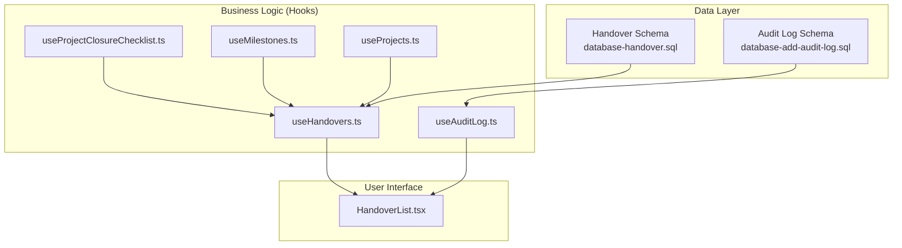
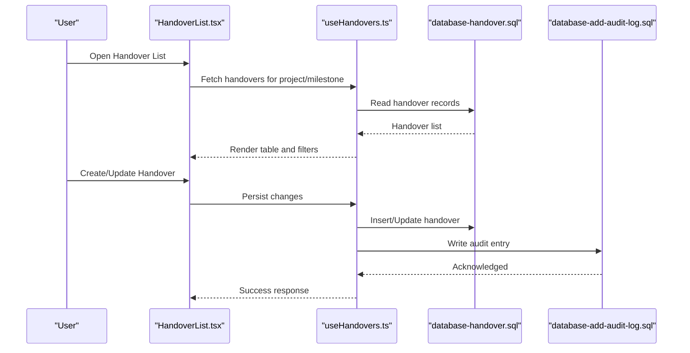
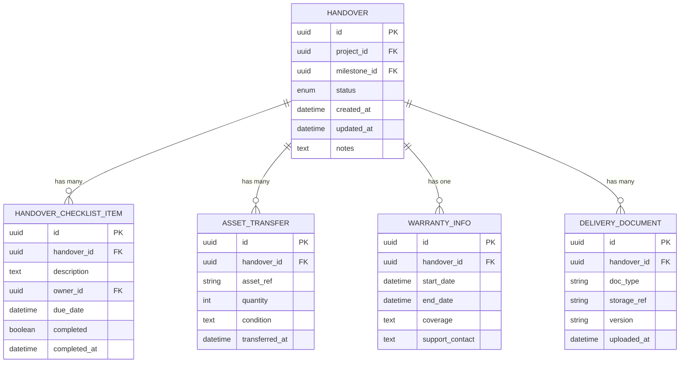
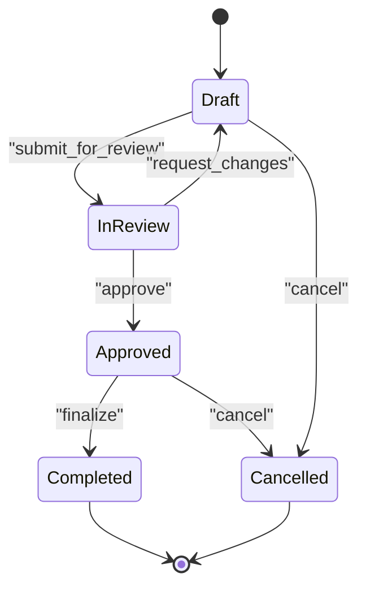
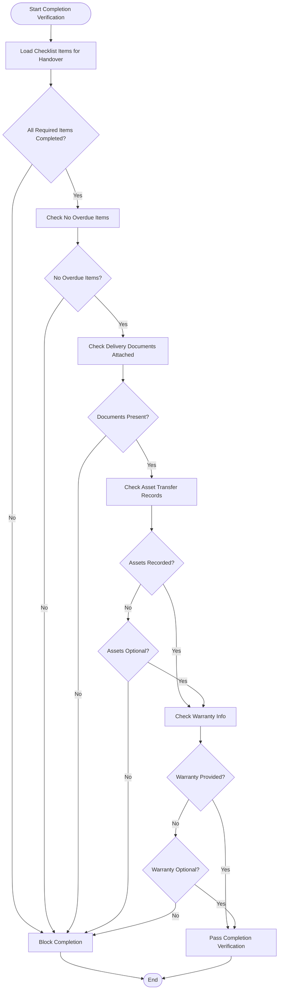
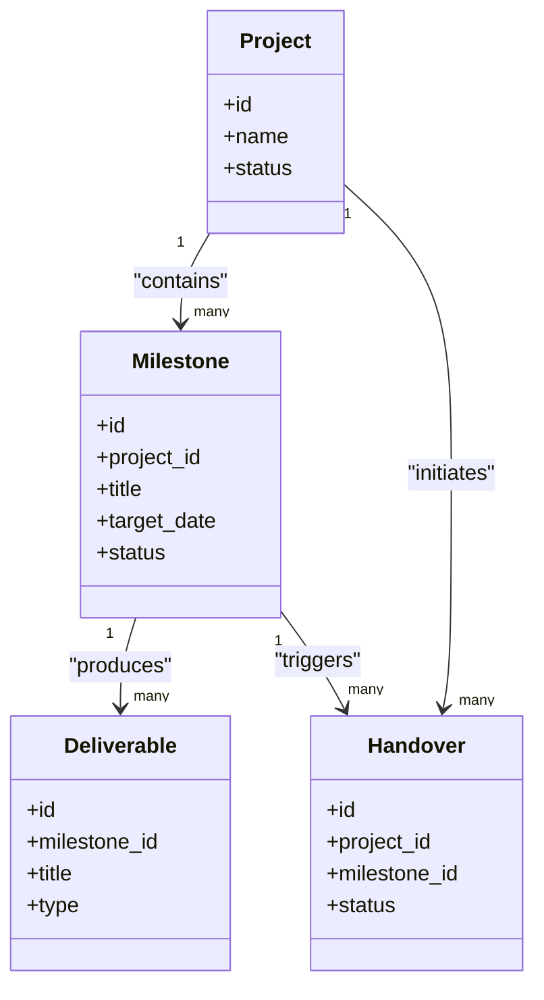
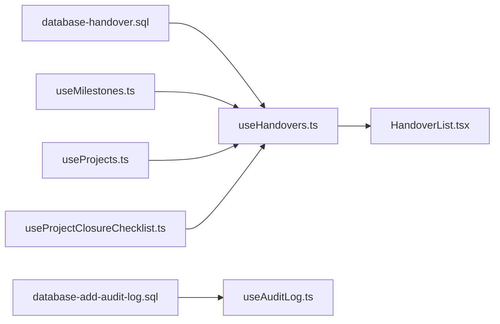

# Project Handover & Closure

<cite>
**Referenced Files in This Document**
- [database-handover.sql](file://src/database-handover.sql)
- [useHandovers.ts](file://src/hooks/useHandovers.ts)
- [HandoverList.tsx](file://src/pages/HandoverList.tsx)
- [useProjectClosureChecklist.ts](file://src/hooks/useProjectClosureChecklist.ts)
- [ticket-002-closure-checklist.md](file://.wayfinder/ticket-002-closure-checklist.md)
- [useMilestones.ts](file://src/hooks/useMilestones.ts)
- [useProjects.ts](file://src/hooks/useProjects.ts)
- [useAuditLog.ts](file://src/hooks/useAuditLog.ts)
- [database-add-audit-log.sql](file://src/database-add-audit-log.sql)
</cite>

## Table of Contents
1. [Introduction](#introduction)
2. [Project Structure](#project-structure)
3. [Core Components](#core-components)
4. [Architecture Overview](#architecture-overview)
5. [Detailed Component Analysis](#detailed-component-analysis)
6. [Dependency Analysis](#dependency-analysis)
7. [Performance Considerations](#performance-considerations)
8. [Troubleshooting Guide](#troubleshooting-guide)
9. [Conclusion](#conclusion)
10. [Appendices](#appendices)

## Introduction
This document provides a comprehensive data model and process guide for project handover and closure. It covers:
- Handover checklists and completion criteria
- Delivery documentation structures
- Relationships between milestones, deliverables, and handover stages
- Asset transfer records, warranty information, and post-completion support tracking
- Examples of handover status queries, completion verification, and closure reporting
- Validation rules, document attachment handling, and audit trail requirements

The goal is to enable smooth project handover and closure with clear data contracts, validation, and traceability.

## Project Structure
The handover and closure capabilities are implemented across database schema definitions, hooks for data access, and UI pages for interaction. The key areas include:
- Database schema for handover entities and audit logs
- Hooks that encapsulate API/data operations for handovers and closure checklists
- UI page listing and managing handovers
- Milestone and project integration points
- Audit log infrastructure for compliance and traceability

**Diagram sources**
- [database-handover.sql](file://src/database-handover.sql)
- [database-add-audit-log.sql](file://src/database-add-audit-log.sql)
- [useHandovers.ts](file://src/hooks/useHandovers.ts)
- [useProjectClosureChecklist.ts](file://src/hooks/useProjectClosureChecklist.ts)
- [useMilestones.ts](file://src/hooks/useMilestones.ts)
- [useProjects.ts](file://src/hooks/useProjects.ts)
- [useAuditLog.ts](file://src/hooks/useAuditLog.ts)
- [HandoverList.tsx](file://src/pages/HandoverList.tsx)

**Section sources**
- [database-handover.sql](file://src/database-handover.sql)
- [database-add-audit-log.sql](file://src/database-add-audit-log.sql)
- [useHandovers.ts](file://src/hooks/useHandovers.ts)
- [useProjectClosureChecklist.ts](file://src/hooks/useProjectClosureChecklist.ts)
- [useMilestones.ts](file://src/hooks/useMilestones.ts)
- [useProjects.ts](file://src/hooks/useProjects.ts)
- [useAuditLog.ts](file://src/hooks/useAuditLog.ts)
- [HandoverList.tsx](file://src/pages/HandoverList.tsx)

## Core Components
- Handover entity and lifecycle states
  - Represents a formal handover event tied to a project and milestone/deliverable context.
  - Tracks status transitions from draft to completed or cancelled.
  - Includes fields for dates, responsible parties, and notes.
- Handover checklist items
  - Checklist entries associated with a handover record.
  - Each item has a description, owner, due date, and completion status.
- Asset transfer records
  - Records linking assets to a handover, including asset identifiers, quantities, and transfer conditions.
- Warranty and post-completion support
  - Warranty start/end dates, coverage details, and support contacts linked to the handover.
- Delivery documentation attachments
  - Metadata for documents attached to handover records (e.g., type, version, storage reference).
- Audit trail
  - Immutable log entries capturing creation, updates, approvals, and deletions for handover-related entities.

Examples of usage patterns:
- Querying handover status by project and milestone
- Verifying completion via checklist pass rate and required documents
- Generating closure reports aggregating handover outcomes and audit events

**Section sources**
- [database-handover.sql](file://src/database-handover.sql)
- [useHandovers.ts](file://src/hooks/useHandovers.ts)
- [useProjectClosureChecklist.ts](file://src/hooks/useProjectClosureChecklist.ts)
- [useAuditLog.ts](file://src/hooks/useAuditLog.ts)

## Architecture Overview
The system integrates handover management with existing project and milestone data, ensuring consistent state transitions and auditability.

**Diagram sources**
- [HandoverList.tsx](file://src/pages/HandoverList.tsx)
- [useHandovers.ts](file://src/hooks/useHandovers.ts)
- [database-handover.sql](file://src/database-handover.sql)
- [database-add-audit-log.sql](file://src/database-add-audit-log.sql)

## Detailed Component Analysis

### Handover Data Model
The handover data model centers around a primary handover record and related entities such as checklist items, asset transfers, warranties, and attachments.

**Diagram sources**
- [database-handover.sql](file://src/database-handover.sql)

**Section sources**
- [database-handover.sql](file://src/database-handover.sql)

### Handover Lifecycle and Status Transitions
Handover records progress through defined statuses. Typical transitions include:
- Draft: Initial creation before review
- In Review: Submitted for stakeholder review
- Approved: Meets completion criteria and approved
- Completed: Finalized with all deliverables and checks passed
- Cancelled: Terminated without completion

**Diagram sources**
- [useHandovers.ts](file://src/hooks/useHandovers.ts)
- [database-handover.sql](file://src/database-handover.sql)

**Section sources**
- [useHandovers.ts](file://src/hooks/useHandovers.ts)
- [database-handover.sql](file://src/database-handover.sql)

### Completion Criteria and Checklists
Completion criteria are enforced via checklist items and validation rules:
- Required checklist items must be marked completed
- Due dates should not be overdue at completion time
- At least one delivery document must be attached
- Asset transfer records must be present if applicable
- Warranty information must be provided when applicable

**Diagram sources**
- [useProjectClosureChecklist.ts](file://src/hooks/useProjectClosureChecklist.ts)
- [useHandovers.ts](file://src/hooks/useHandovers.ts)
- [database-handover.sql](file://src/database-handover.sql)

**Section sources**
- [useProjectClosureChecklist.ts](file://src/hooks/useProjectClosureChecklist.ts)
- [useHandovers.ts](file://src/hooks/useHandovers.ts)
- [database-handover.sql](file://src/database-handover.sql)

### Milestones, Deliverables, and Handover Stages
Handovers are closely tied to project milestones and deliverables:
- A handover can be initiated per milestone or per set of deliverables
- Milestone completion triggers readiness for handover
- Deliverables map to checklist items and documentation requirements

**Diagram sources**
- [useMilestones.ts](file://src/hooks/useMilestones.ts)
- [useProjects.ts](file://src/hooks/useProjects.ts)
- [useHandovers.ts](file://src/hooks/useHandovers.ts)
- [database-handover.sql](file://src/database-handover.sql)

**Section sources**
- [useMilestones.ts](file://src/hooks/useMilestones.ts)
- [useProjects.ts](file://src/hooks/useProjects.ts)
- [useHandovers.ts](file://src/hooks/useHandovers.ts)
- [database-handover.sql](file://src/database-handover.sql)

### Document Attachment Handling
Delivery documents are attached to handover records with metadata:
- Document type classification
- Version control for revisions
- Storage reference for retrieval
- Upload timestamp for auditability

Validation rules:
- Mandatory document types based on handover category
- Minimum number of documents required for completion
- File size and format constraints enforced at upload

**Section sources**
- [database-handover.sql](file://src/database-handover.sql)
- [useHandovers.ts](file://src/hooks/useHandovers.ts)

### Audit Trail Requirements
Audit logging captures critical actions:
- Creation, update, approval, and deletion events
- Actor identification and timestamps
- Change summaries for compliance

Integration points:
- Handover hook writes audit entries on mutations
- UI surfaces audit history for transparency

**Section sources**
- [useAuditLog.ts](file://src/hooks/useAuditLog.ts)
- [database-add-audit-log.sql](file://src/database-add-audit-log.sql)
- [useHandovers.ts](file://src/hooks/useHandovers.ts)

## Dependency Analysis
The following diagram shows dependencies among core components involved in handover and closure:

**Diagram sources**
- [database-handover.sql](file://src/database-handover.sql)
- [database-add-audit-log.sql](file://src/database-add-audit-log.sql)
- [useHandovers.ts](file://src/hooks/useHandovers.ts)
- [useProjectClosureChecklist.ts](file://src/hooks/useProjectClosureChecklist.ts)
- [useMilestones.ts](file://src/hooks/useMilestones.ts)
- [useProjects.ts](file://src/hooks/useProjects.ts)
- [useAuditLog.ts](file://src/hooks/useAuditLog.ts)
- [HandoverList.tsx](file://src/pages/HandoverList.tsx)

**Section sources**
- [database-handover.sql](file://src/database-handover.sql)
- [database-add-audit-log.sql](file://src/database-add-audit-log.sql)
- [useHandovers.ts](file://src/hooks/useHandovers.ts)
- [useProjectClosureChecklist.ts](file://src/hooks/useProjectClosureChecklist.ts)
- [useMilestones.ts](file://src/hooks/useMilestones.ts)
- [useProjects.ts](file://src/hooks/useProjects.ts)
- [useAuditLog.ts](file://src/hooks/useAuditLog.ts)
- [HandoverList.tsx](file://src/pages/HandoverList.tsx)

## Performance Considerations
- Use efficient queries to filter handovers by project and milestone
- Paginate large lists of checklist items and attachments
- Cache frequently accessed project and milestone data
- Batch write audit entries where appropriate to reduce overhead
- Avoid unnecessary re-renders in UI by memoizing computed completion status

[No sources needed since this section provides general guidance]

## Troubleshooting Guide
Common issues and resolutions:
- Missing required checklist items
  - Ensure all mandatory items are marked completed before finalization
- Overdue checklist items
  - Update due dates or complete items to avoid blocking completion
- Missing delivery documents
  - Attach required documents and verify metadata completeness
- Audit log gaps
  - Confirm audit hook integration and permissions for writing logs
- Handover status inconsistencies
  - Validate state transitions and ensure proper approval workflow

**Section sources**
- [useProjectClosureChecklist.ts](file://src/hooks/useProjectClosureChecklist.ts)
- [useHandovers.ts](file://src/hooks/useHandovers.ts)
- [useAuditLog.ts](file://src/hooks/useAuditLog.ts)

## Conclusion
The handover and closure system integrates robust data models, validation rules, and audit trails to ensure reliable project transitions. By aligning milestones, deliverables, and handover stages, teams can achieve consistent completion criteria and transparent reporting. Proper document attachment handling and warranty tracking further enhance post-completion support and accountability.

[No sources needed since this section summarizes without analyzing specific files]

## Appendices

### Example Queries and Reports
- Handover status query by project and milestone
  - Filter handovers by project ID and milestone ID; return status, dates, and notes
- Completion verification report
  - Aggregate checklist completion rates, overdue items, and missing documents
- Closure summary report
  - Summarize finalized handovers, asset transfers, warranty periods, and audit events

**Section sources**
- [useHandovers.ts](file://src/hooks/useHandovers.ts)
- [useProjectClosureChecklist.ts](file://src/hooks/useProjectClosureChecklist.ts)
- [useAuditLog.ts](file://src/hooks/useAuditLog.ts)

### Process Documentation Reference
- Closure checklist specification and workflow details

**Section sources**
- [ticket-002-closure-checklist.md](file://.wayfinder/ticket-002-closure-checklist.md)