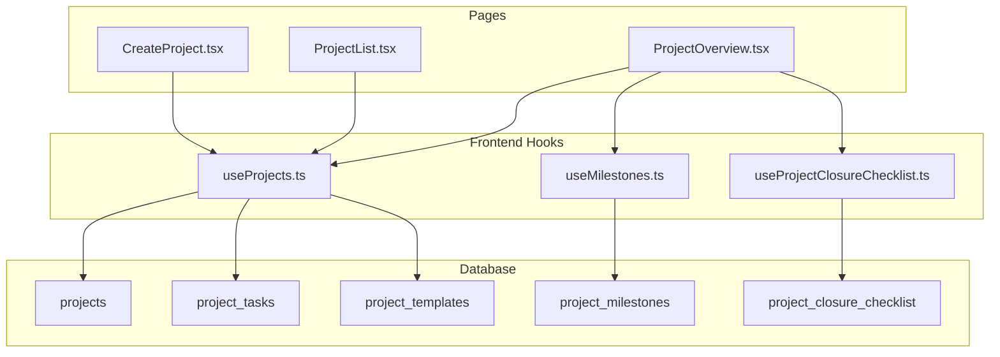
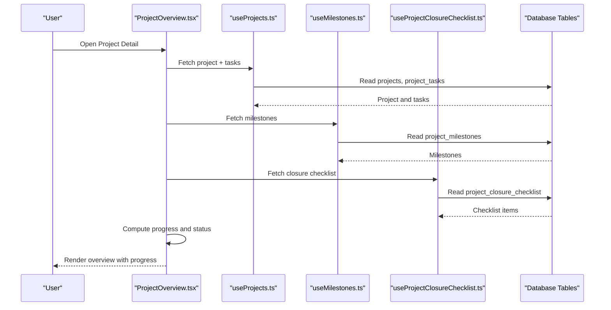
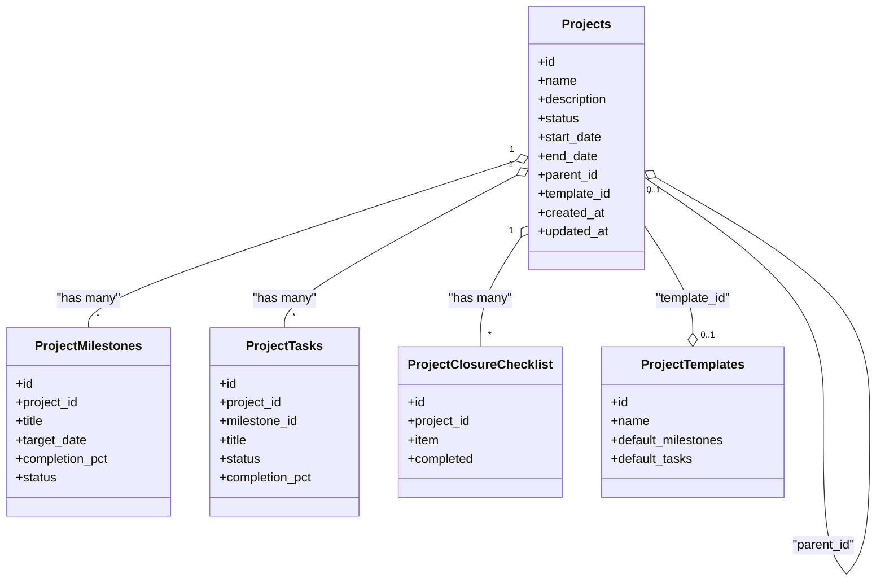
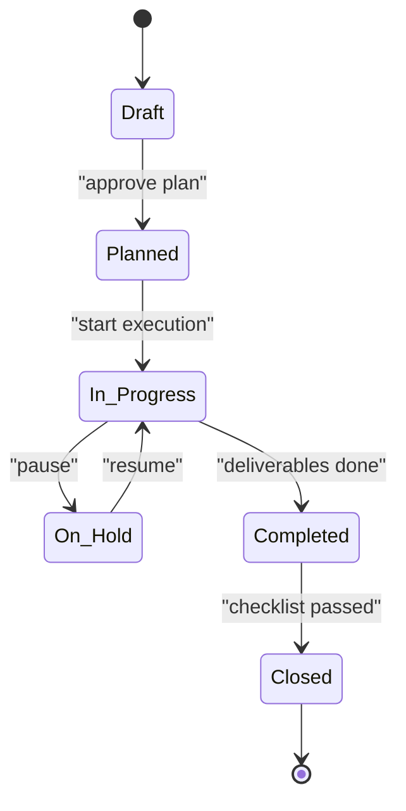
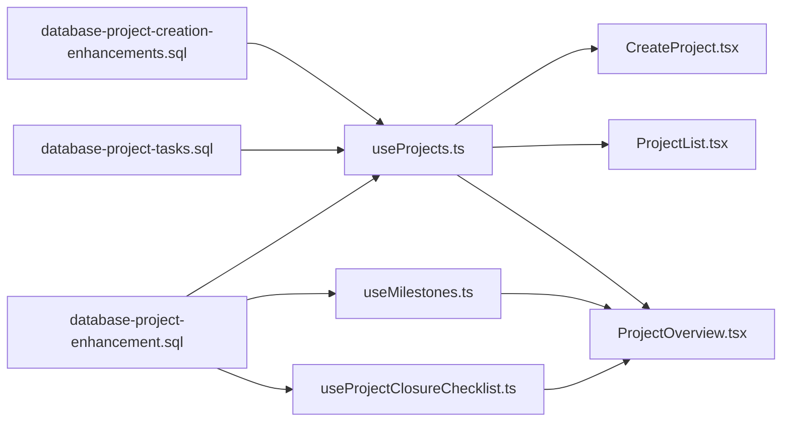

# Project Lifecycle & Structure

<cite>
**Referenced Files in This Document**
- [database-project-creation-enhancements.sql](file://src/database-project-creation-enhancements.sql)
- [database-project-enhancement.sql](file://src/database-project-enhancement.sql)
- [database-project-tasks.sql](file://src/database-project-tasks.sql)
- [useProjects.ts](file://src/hooks/useProjects.ts)
- [useMilestones.ts](file://src/hooks/useMilestones.ts)
- [useProjectClosureChecklist.ts](file://src/hooks/useProjectClosureChecklist.ts)
- [CreateProject.tsx](file://src/pages/CreateProject.tsx)
- [ProjectList.tsx](file://src/pages/ProjectList.tsx)
- [ProjectOverview.tsx](file://src/pages/ProjectOverview.tsx)
- [supabase-tables.sql](file://supabase-tables.sql)
</cite>

## Table of Contents
1. [Introduction](#introduction)
2. [Project Structure](#project-structure)
3. [Core Components](#core-components)
4. [Architecture Overview](#architecture-overview)
5. [Detailed Component Analysis](#detailed-component-analysis)
6. [Dependency Analysis](#dependency-analysis)
7. [Performance Considerations](#performance-considerations)
8. [Troubleshooting Guide](#troubleshooting-guide)
9. [Conclusion](#conclusion)

## Introduction
This document describes the data model and lifecycle for projects, covering creation, planning, execution, and closure phases. It explains project status workflows, milestones, phase transitions, hierarchy (parent-child), templates, validation rules, audit requirements, and performance considerations for large datasets. It also provides example queries for setup, status tracking, and progress calculations.

## Project Structure
The project module is implemented across database migrations, hooks, and pages:
- Database schema and enhancements are defined in SQL migration files under src/.
- Frontend hooks encapsulate data access and state for projects, milestones, and closure checklists.
- Pages provide UI entry points for creating, listing, and viewing projects.

**Diagram sources**
- [database-project-creation-enhancements.sql](file://src/database-project-creation-enhancements.sql)
- [database-project-enhancement.sql](file://src/database-project-enhancement.sql)
- [database-project-tasks.sql](file://src/database-project-tasks.sql)
- [useProjects.ts](file://src/hooks/useProjects.ts)
- [useMilestones.ts](file://src/hooks/useMilestones.ts)
- [useProjectClosureChecklist.ts](file://src/hooks/useProjectClosureChecklist.ts)
- [CreateProject.tsx](file://src/pages/CreateProject.tsx)
- [ProjectList.tsx](file://src/pages/ProjectList.tsx)
- [ProjectOverview.tsx](file://src/pages/ProjectOverview.tsx)

**Section sources**
- [database-project-creation-enhancements.sql](file://src/database-project-creation-enhancements.sql)
- [database-project-enhancement.sql](file://src/database-project-enhancement.sql)
- [database-project-tasks.sql](file://src/database-project-tasks.sql)
- [useProjects.ts](file://src/hooks/useProjects.ts)
- [useMilestones.ts](file://src/hooks/useMilestones.ts)
- [useProjectClosureChecklist.ts](file://src/hooks/useProjectClosureChecklist.ts)
- [CreateProject.tsx](file://src/pages/CreateProject.tsx)
- [ProjectList.tsx](file://src/pages/ProjectList.tsx)
- [ProjectOverview.tsx](file://src/pages/ProjectOverview.tsx)

## Core Components
- Projects: Central entity representing a project with lifecycle fields such as status, dates, parent reference, and template linkage.
- Milestones: Time-bound deliverables tied to a project, used for planning and progress measurement.
- Tasks: Execution items linked to a project and optionally to milestones; support completion tracking.
- Closure Checklist: Items that must be completed before a project can be closed.
- Templates: Reusable project definitions that seed default milestones, tasks, or metadata when creating new projects.

Key relationships:
- projects.parent_id references projects.id for hierarchical structures.
- project_milestones.project_id references projects.id.
- project_tasks.project_id references projects.id; optional link to milestones.
- project_closure_checklist.project_id references projects.id.
- project_templates.id referenced by projects.template_id for templated creation.

Lifecycle states (typical):
- Draft -> Planned -> In Progress -> On Hold -> Completed -> Closed
- Transitions are enforced via validation and UI flows; some transitions may require checklist completion.

Progress calculation:
- Weighted by milestone completion and task completion within each milestone.
- Aggregated at the project level using weighted averages.

**Section sources**
- [database-project-creation-enhancements.sql](file://src/database-project-creation-enhancements.sql)
- [database-project-enhancement.sql](file://src/database-project-enhancement.sql)
- [database-project-tasks.sql](file://src/database-project-tasks.sql)
- [useProjects.ts](file://src/hooks/useProjects.ts)
- [useMilestones.ts](file://src/hooks/useMilestones.ts)
- [useProjectClosureChecklist.ts](file://src/hooks/useProjectClosureChecklist.ts)

## Architecture Overview
The system follows a layered architecture:
- Data layer: Relational tables defined in SQL migrations.
- Access layer: TypeScript hooks abstracting CRUD operations and aggregations.
- Presentation layer: Pages orchestrating user interactions and displaying project information.

**Diagram sources**
- [ProjectOverview.tsx](file://src/pages/ProjectOverview.tsx)
- [useProjects.ts](file://src/hooks/useProjects.ts)
- [useMilestones.ts](file://src/hooks/useMilestones.ts)
- [useProjectClosureChecklist.ts](file://src/hooks/useProjectClosureChecklist.ts)
- [database-project-tasks.sql](file://src/database-project-tasks.sql)
- [database-project-enhancement.sql](file://src/database-project-enhancement.sql)

## Detailed Component Analysis

### Projects Data Model
- Purpose: Represents a project instance with lifecycle attributes and hierarchy.
- Key fields: id, name, description, status, start_date, end_date, parent_id, template_id, created_at, updated_at.
- Relationships:
  - Parent-child via self-referencing parent_id.
  - Template linkage via template_id.
  - One-to-many with milestones, tasks, and closure checklist.

Validation rules:
- Status transitions must follow allowed sequences.
- Dates must be consistent (start <= end).
- Parent cannot be a descendant (no cycles).

Audit requirements:
- Track created_by, updated_by, timestamps.
- Maintain change history for critical fields (status, dates).

Example queries:
- Create project from template: insert into projects selecting defaults from project_templates where id = :template_id.
- List active projects: select * from projects where status in ('Planned','In Progress') order by start_date.

**Section sources**
- [database-project-creation-enhancements.sql](file://src/database-project-creation-enhancements.sql)
- [database-project-enhancement.sql](file://src/database-project-enhancement.sql)
- [useProjects.ts](file://src/hooks/useProjects.ts)
- [CreateProject.tsx](file://src/pages/CreateProject.tsx)

#### Class Diagram: Projects and Related Entities

**Diagram sources**
- [database-project-creation-enhancements.sql](file://src/database-project-creation-enhancements.sql)
- [database-project-enhancement.sql](file://src/database-project-enhancement.sql)
- [database-project-tasks.sql](file://src/database-project-tasks.sql)

### Milestones Data Model
- Purpose: Define key deliverables and targets within a project.
- Key fields: id, project_id, title, target_date, completion_pct, status.
- Relationships: Linked to projects; tasks may be grouped under milestones.

Validation rules:
- Target date constraints relative to project dates.
- Completion percentage bounded between 0 and 100.

Progress contribution:
- Each milestone contributes a weight to overall project progress.

Example queries:
- Get milestone progress: select sum(completion_pct * weight) / sum(weight) from project_milestones where project_id = :pid.

**Section sources**
- [database-project-enhancement.sql](file://src/database-project-enhancement.sql)
- [useMilestones.ts](file://src/hooks/useMilestones.ts)
- [ProjectOverview.tsx](file://src/pages/ProjectOverview.tsx)

### Tasks Data Model
- Purpose: Execution units supporting project delivery.
- Key fields: id, project_id, milestone_id, title, status, completion_pct.
- Relationships: Belong to a project; optionally belong to a milestone.

Validation rules:
- Task status transitions aligned with workflow.
- Completion percentage consistency with status.

Aggregation:
- Task completion per milestone feeds milestone progress.

Example queries:
- Count tasks by status per project: select status, count(*) from project_tasks where project_id = :pid group by status.

**Section sources**
- [database-project-tasks.sql](file://src/database-project-tasks.sql)
- [useProjects.ts](file://src/hooks/useProjects.ts)
- [ProjectOverview.tsx](file://src/pages/ProjectOverview.tsx)

### Closure Checklist Data Model
- Purpose: Ensure prerequisites are met before closing a project.
- Key fields: id, project_id, item, completed.
- Relationships: Tied to a specific project.

Validation rules:
- All required items must be marked completed to allow transition to Closed.

Example queries:
- Check closure readiness: select not exists(select 1 from project_closure_checklist where project_id = :pid and completed = false) as ready.

**Section sources**
- [useProjectClosureChecklist.ts](file://src/hooks/useProjectClosureChecklist.ts)
- [ProjectOverview.tsx](file://src/pages/ProjectOverview.tsx)

### Project Templates Data Model
- Purpose: Provide reusable structure for new projects.
- Key fields: id, name, default_milestones, default_tasks.
- Usage: When creating a project, copy template-defined milestones and tasks.

Example queries:
- Clone template to new project: insert into project_milestones(project_id, ...) select :new_pid, ... from project_templates where id = :tid.

**Section sources**
- [database-project-creation-enhancements.sql](file://src/database-project-creation-enhancements.sql)
- [CreateProject.tsx](file://src/pages/CreateProject.tsx)

### Project Lifecycle Workflow

**Diagram sources**
- [database-project-enhancement.sql](file://src/database-project-enhancement.sql)
- [useProjectClosureChecklist.ts](file://src/hooks/useProjectClosureChecklist.ts)

### Example Queries
- Setup: Initialize a new project from a template and seed milestones/tasks.
- Status tracking: Retrieve current status and recent changes.
- Progress calculation: Aggregate milestone and task completion percentages with weights.

**Section sources**
- [database-project-creation-enhancements.sql](file://src/database-project-creation-enhancements.sql)
- [database-project-enhancement.sql](file://src/database-project-enhancement.sql)
- [database-project-tasks.sql](file://src/database-project-tasks.sql)
- [useProjects.ts](file://src/hooks/useProjects.ts)
- [useMilestones.ts](file://src/hooks/useMilestones.ts)
- [useProjectClosureChecklist.ts](file://src/hooks/useProjectClosureChecklist.ts)

## Dependency Analysis
- Frontend hooks depend on database tables defined in SQL migrations.
- Pages depend on hooks for data fetching and mutations.
- Templates influence project creation flow and initial data population.

**Diagram sources**
- [database-project-creation-enhancements.sql](file://src/database-project-creation-enhancements.sql)
- [database-project-enhancement.sql](file://src/database-project-enhancement.sql)
- [database-project-tasks.sql](file://src/database-project-tasks.sql)
- [useProjects.ts](file://src/hooks/useProjects.ts)
- [useMilestones.ts](file://src/hooks/useMilestones.ts)
- [useProjectClosureChecklist.ts](file://src/hooks/useProjectClosureChecklist.ts)
- [CreateProject.tsx](file://src/pages/CreateProject.tsx)
- [ProjectList.tsx](file://src/pages/ProjectList.tsx)
- [ProjectOverview.tsx](file://src/pages/ProjectOverview.tsx)

**Section sources**
- [database-project-creation-enhancements.sql](file://src/database-project-creation-enhancements.sql)
- [database-project-enhancement.sql](file://src/database-project-enhancement.sql)
- [database-project-tasks.sql](file://src/database-project-tasks.sql)
- [useProjects.ts](file://src/hooks/useProjects.ts)
- [useMilestones.ts](file://src/hooks/useMilestones.ts)
- [useProjectClosureChecklist.ts](file://src/hooks/useProjectClosureChecklist.ts)
- [CreateProject.tsx](file://src/pages/CreateProject.tsx)
- [ProjectList.tsx](file://src/pages/ProjectList.tsx)
- [ProjectOverview.tsx](file://src/pages/ProjectOverview.tsx)

## Performance Considerations
- Indexing: Add indexes on foreign keys (project_id, parent_id, template_id) and frequently filtered columns (status, start_date, end_date).
- Query optimization: Use selective filters and avoid full table scans; leverage computed columns or materialized views for heavy aggregations if needed.
- Pagination: Implement server-side pagination for large project lists and milestone/task tables.
- Caching: Cache read-heavy endpoints (e.g., project overview) with appropriate invalidation strategies.
- Batch operations: For bulk updates (e.g., marking multiple tasks complete), use batched transactions to reduce round trips.

[No sources needed since this section provides general guidance]

## Troubleshooting Guide
Common issues and resolutions:
- Invalid status transition: Validate against allowed transitions before applying updates.
- Cycle detection in hierarchy: Prevent setting a project as its own ancestor; validate parent path.
- Incomplete closure checklist: Block transition to Closed until all required items are completed.
- Date inconsistencies: Enforce start_date <= end_date and milestone target_date within project bounds.
- Audit gaps: Ensure created_by/updated_by and timestamps are populated on inserts and updates.

Operational checks:
- Verify RLS policies and permissions for project-related tables.
- Confirm triggers or application logic enforce validation rules consistently.

**Section sources**
- [database-project-enhancement.sql](file://src/database-project-enhancement.sql)
- [useProjectClosureChecklist.ts](file://src/hooks/useProjectClosureChecklist.ts)
- [supabase-tables.sql](file://supabase-tables.sql)

## Conclusion
The project lifecycle model integrates hierarchical organization, templated creation, milestone-driven planning, task-based execution, and structured closure. Validation rules and audit trails ensure integrity and traceability. With proper indexing, caching, and query design, the system scales effectively for large project datasets.

[No sources needed since this section summarizes without analyzing specific files]