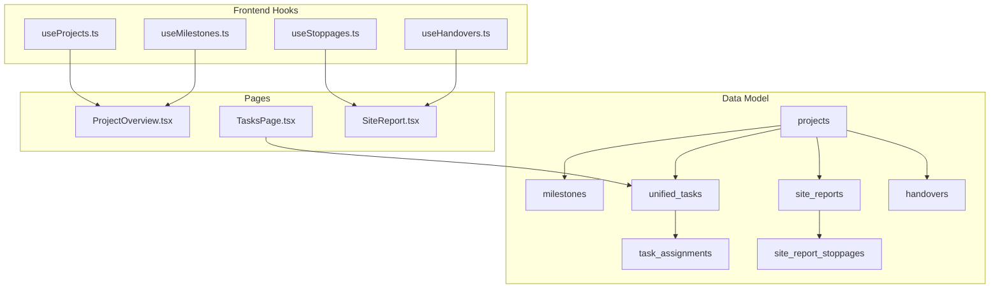
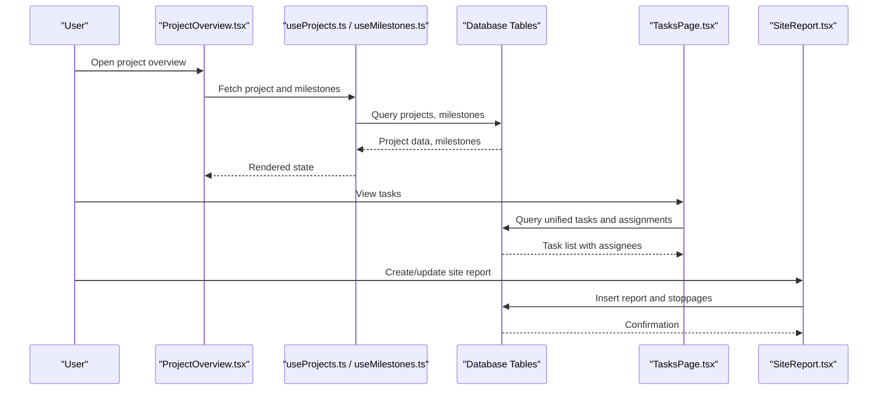
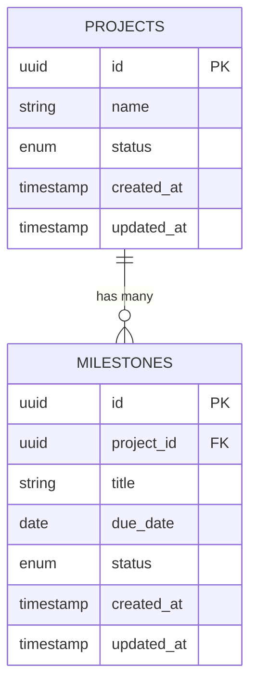
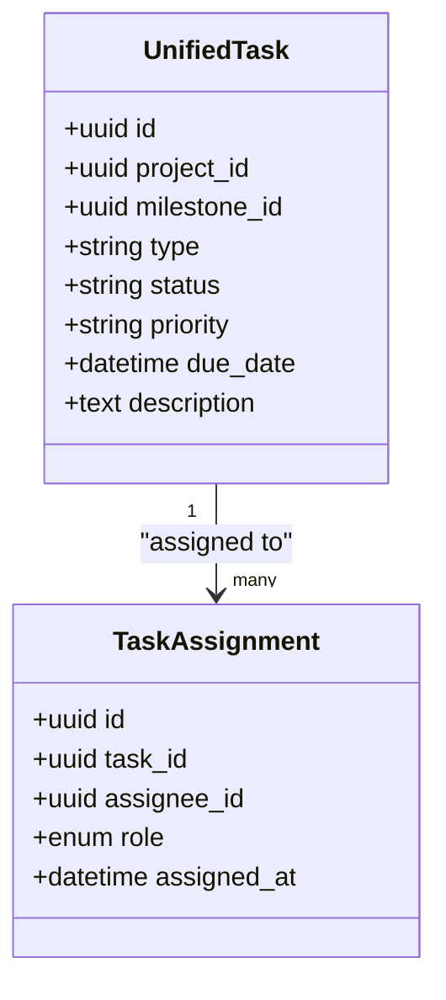
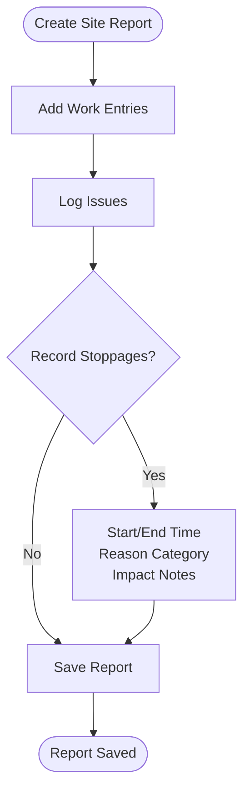
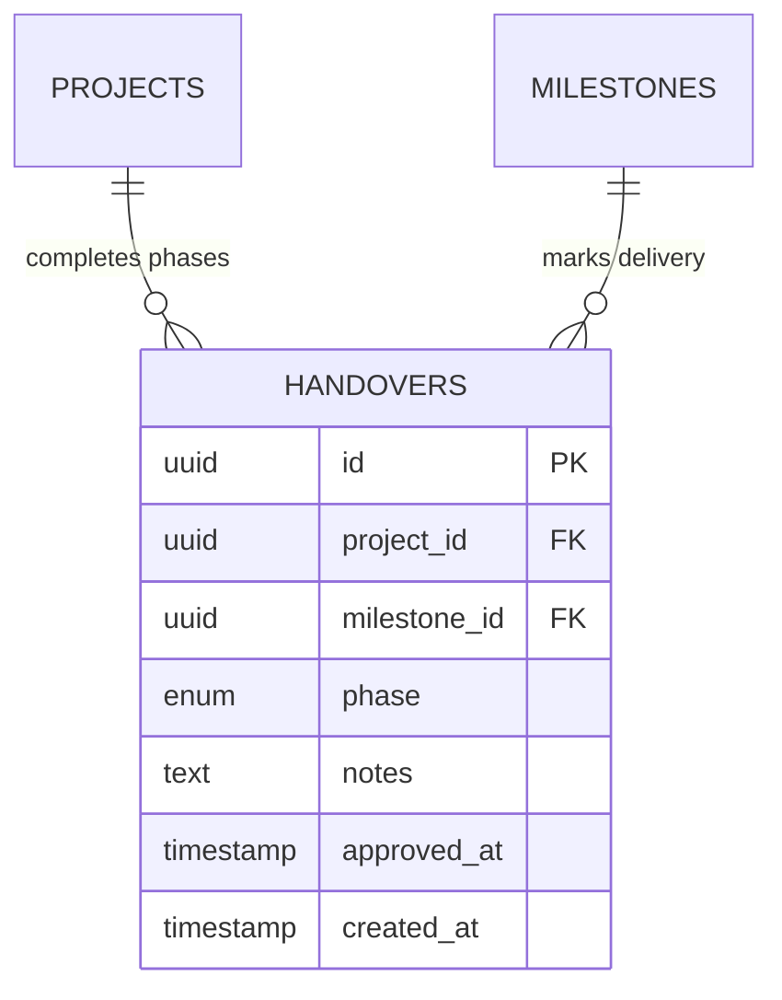
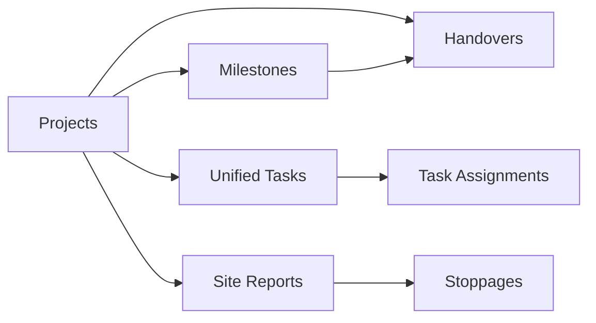

# Project Management & Tasks

<cite>
**Referenced Files in This Document**
- [database-project-tasks.sql](file://src/database-project-tasks.sql)
- [database-unified-tasks.sql](file://src/database-unified-tasks.sql)
- [database-site-reports.sql](file://src/database-site-reports.sql)
- [database-site-report-stoppages.sql](file://src/database-site-report-stoppages.sql)
- [database-handover.sql](file://src/database-handover.sql)
- [useProjects.ts](file://src/hooks/useProjects.ts)
- [useMilestones.ts](file://src/hooks/useMilestones.ts)
- [useStoppages.ts](file://src/hooks/useStoppages.ts)
- [useHandovers.ts](file://src/hooks/useHandovers.ts)
- [SiteReport.tsx](file://src/pages/SiteReport.tsx)
- [TasksPage.tsx](file://src/pages/TasksPage.tsx)
- [ProjectOverview.tsx](file://src/pages/ProjectOverview.tsx)
- [PRD-WORK-STOPPAGES-TWO-DATE-MODEL.md](file://docs/PRD-WORK-STOPPAGES-TWO-DATE-MODEL.md)
</cite>

## Table of Contents
1. [Introduction](#introduction)
2. [Project Structure](#project-structure)
3. [Core Components](#core-components)
4. [Architecture Overview](#architecture-overview)
5. [Detailed Component Analysis](#detailed-component-analysis)
6. [Dependency Analysis](#dependency-analysis)
7. [Performance Considerations](#performance-considerations)
8. [Troubleshooting Guide](#troubleshooting-guide)
9. [Conclusion](#conclusion)
10. [Appendices](#appendices)

## Introduction
This document provides comprehensive data model documentation for the project management and task tracking system. It covers project lifecycle tables, unified task management, milestone tracking, site reporting structures, stoppage tracking, and handover processes. It explains relationships between projects, tasks, resources, and deliverables, and includes examples of queries for project progress, resource allocation reports, and timeline analysis. The guide also addresses data consistency across project phases, audit requirements, and performance considerations for large datasets.

## Project Structure
The data model is defined primarily through SQL migration files under src/, with supporting hooks and pages that consume these models. Key areas:
- Projects and milestones are modeled and queried via dedicated migrations and hooks.
- Unified tasks support multiple task types and assignments.
- Site reports capture daily site activities, including stoppages and photos.
- Handover records formalize project phase transitions and acceptance.

**Diagram sources**
- [database-project-tasks.sql](file://src/database-project-tasks.sql)
- [database-unified-tasks.sql](file://src/database-unified-tasks.sql)
- [database-site-reports.sql](file://src/database-site-reports.sql)
- [database-site-report-stoppages.sql](file://src/database-site-report-stoppages.sql)
- [database-handover.sql](file://src/database-handover.sql)
- [useProjects.ts](file://src/hooks/useProjects.ts)
- [useMilestones.ts](file://src/hooks/useMilestones.ts)
- [useStoppages.ts](file://src/hooks/useStoppages.ts)
- [useHandovers.ts](file://src/hooks/useHandovers.ts)
- [ProjectOverview.tsx](file://src/pages/ProjectOverview.tsx)
- [TasksPage.tsx](file://src/pages/TasksPage.tsx)
- [SiteReport.tsx](file://src/pages/SiteReport.tsx)

**Section sources**
- [database-project-tasks.sql](file://src/database-project-tasks.sql)
- [database-unified-tasks.sql](file://src/database-unified-tasks.sql)
- [database-site-reports.sql](file://src/database-site-reports.sql)
- [database-site-report-stoppages.sql](file://src/database-site-report-stoppages.sql)
- [database-handover.sql](file://src/database-handover.sql)
- [useProjects.ts](file://src/hooks/useProjects.ts)
- [useMilestones.ts](file://src/hooks/useMilestones.ts)
- [useStoppages.ts](file://src/hooks/useStoppages.ts)
- [useHandovers.ts](file://src/hooks/useHandovers.ts)
- [ProjectOverview.tsx](file://src/pages/ProjectOverview.tsx)
- [TasksPage.tsx](file://src/pages/TasksPage.tsx)
- [SiteReport.tsx](file://src/pages/SiteReport.tsx)

## Core Components
- Projects: Represent a project entity with lifecycle states and metadata.
- Milestones: Define key phases or deliverables within a project timeline.
- Unified Tasks: Support multiple task types (e.g., design, procurement, installation) with flexible assignment and status tracking.
- Task Assignments: Link users/resources to specific tasks.
- Site Reports: Daily records of site activities, including work done, issues, and stoppages.
- Stoppages: Track planned/unplanned work stoppages with start/end times and reasons.
- Handovers: Formalize phase completion and acceptance, linking to deliverables and approvals.

These components form a cohesive model enabling end-to-end project execution tracking from initiation to handover.

**Section sources**
- [database-project-tasks.sql](file://src/database-project-tasks.sql)
- [database-unified-tasks.sql](file://src/database-unified-tasks.sql)
- [database-site-reports.sql](file://src/database-site-reports.sql)
- [database-site-report-stoppages.sql](file://src/database-site-report-stoppages.sql)
- [database-handover.sql](file://src/database-handover.sql)

## Architecture Overview
The system integrates data definitions (SQL), frontend hooks, and UI pages to provide a complete project management experience.

**Diagram sources**
- [ProjectOverview.tsx](file://src/pages/ProjectOverview.tsx)
- [TasksPage.tsx](file://src/pages/TasksPage.tsx)
- [SiteReport.tsx](file://src/pages/SiteReport.tsx)
- [useProjects.ts](file://src/hooks/useProjects.ts)
- [useMilestones.ts](file://src/hooks/useMilestones.ts)
- [database-project-tasks.sql](file://src/database-project-tasks.sql)
- [database-unified-tasks.sql](file://src/database-unified-tasks.sql)
- [database-site-reports.sql](file://src/database-site-reports.sql)

## Detailed Component Analysis

### Projects and Milestones
Projects define the scope and lifecycle; milestones mark critical checkpoints. Relationships:
- One project has many milestones.
- Milestones may reference deliverables and approval states.

**Diagram sources**
- [database-project-tasks.sql](file://src/database-project-tasks.sql)

**Section sources**
- [database-project-tasks.sql](file://src/database-project-tasks.sql)
- [useProjects.ts](file://src/hooks/useProjects.ts)
- [useMilestones.ts](file://src/hooks/useMilestones.ts)
- [ProjectOverview.tsx](file://src/pages/ProjectOverview.tsx)

### Unified Task System
Unified tasks support multiple task types and flexible assignments. Key entities:
- unified_tasks: Central task record with type, status, priority, and links to project/milestone.
- task_assignments: Many-to-many mapping between tasks and users/resources.

**Diagram sources**
- [database-unified-tasks.sql](file://src/database-unified-tasks.sql)

**Section sources**
- [database-unified-tasks.sql](file://src/database-unified-tasks.sql)
- [TasksPage.tsx](file://src/pages/TasksPage.tsx)

### Site Reports and Stoppages
Site reports capture daily site activities, including work performed, issues, and stoppages. Stoppages track planned/unplanned interruptions with detailed context.

**Diagram sources**
- [database-site-reports.sql](file://src/database-site-reports.sql)
- [database-site-report-stoppages.sql](file://src/database-site-report-stoppages.sql)
- [SiteReport.tsx](file://src/pages/SiteReport.tsx)

**Section sources**
- [database-site-reports.sql](file://src/database-site-reports.sql)
- [database-site-report-stoppages.sql](file://src/database-site-report-stoppages.sql)
- [useStoppages.ts](file://src/hooks/useStoppages.ts)
- [SiteReport.tsx](file://src/pages/SiteReport.tsx)
- [PRD-WORK-STOPPAGES-TWO-DATE-MODEL.md](file://docs/PRD-WORK-STOPPAGES-TWO-DATE-MODEL.md)

### Handover Processes
Handovers formalize phase completion and acceptance, linking to deliverables and approvals. They ensure traceability and compliance.

**Diagram sources**
- [database-handover.sql](file://src/database-handover.sql)

**Section sources**
- [database-handover.sql](file://src/database-handover.sql)
- [useHandovers.ts](file://src/hooks/useHandovers.ts)
- [SiteReport.tsx](file://src/pages/SiteReport.tsx)

## Dependency Analysis
The data model dependencies reflect clear separation of concerns:
- Projects anchor milestones, tasks, reports, and handovers.
- Unified tasks depend on project/milestone context and link to assignments.
- Site reports and stoppages are tied to projects and dates.
- Handovers connect milestones to project phases.

**Diagram sources**
- [database-project-tasks.sql](file://src/database-project-tasks.sql)
- [database-unified-tasks.sql](file://src/database-unified-tasks.sql)
- [database-site-reports.sql](file://src/database-site-reports.sql)
- [database-site-report-stoppages.sql](file://src/database-site-report-stoppages.sql)
- [database-handover.sql](file://src/database-handover.sql)

**Section sources**
- [database-project-tasks.sql](file://src/database-project-tasks.sql)
- [database-unified-tasks.sql](file://src/database-unified-tasks.sql)
- [database-site-reports.sql](file://src/database-site-reports.sql)
- [database-site-report-stoppages.sql](file://src/database-site-report-stoppages.sql)
- [database-handover.sql](file://src/database-handover.sql)

## Performance Considerations
For large project datasets:
- Index frequently queried columns such as project_id, status, due_date, and created_at.
- Use pagination and filtering in hooks to reduce payload sizes.
- Normalize heavy fields (e.g., descriptions) and load on demand.
- Cache read-heavy aggregates (e.g., milestone completion rates) where appropriate.
- Avoid deep joins in hot paths; precompute summaries if needed.

[No sources needed since this section provides general guidance]

## Troubleshooting Guide
Common issues and resolutions:
- Missing foreign keys: Ensure all referenced IDs exist before inserts.
- Inconsistent statuses: Validate state transitions in application logic.
- Duplicate assignments: Enforce unique constraints on task-assignee pairs.
- Stoppage time overlaps: Validate non-overlapping intervals per site/day.
- Audit gaps: Enable audit logging for critical changes to projects, tasks, and reports.

**Section sources**
- [database-project-tasks.sql](file://src/database-project-tasks.sql)
- [database-unified-tasks.sql](file://src/database-unified-tasks.sql)
- [database-site-reports.sql](file://src/database-site-reports.sql)
- [database-site-report-stoppages.sql](file://src/database-site-report-stoppages.sql)
- [database-handover.sql](file://src/database-handover.sql)

## Conclusion
The data model provides a robust foundation for project management and task tracking, integrating projects, milestones, unified tasks, site reports, stoppages, and handovers. With careful indexing, validation, and auditing, it supports scalable operations and reliable reporting across large datasets.

[No sources needed since this section summarizes without analyzing specific files]

## Appendices

### Example Queries
- Project Progress: Aggregate milestone completion by project over time.
- Resource Allocation: Count active task assignments per user/resource.
- Timeline Analysis: Compare planned vs actual dates using milestones and stoppages.

[No sources needed since this section provides general guidance]