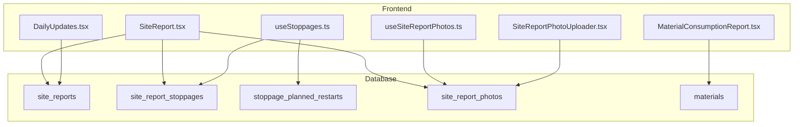
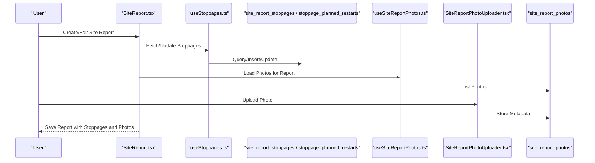
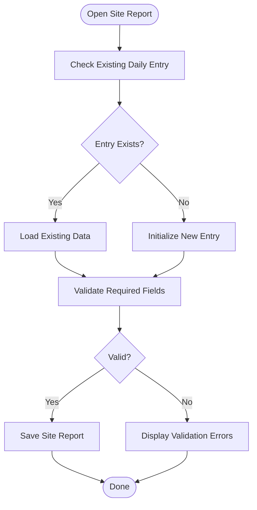
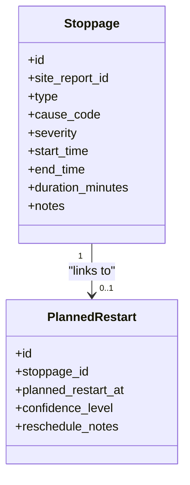
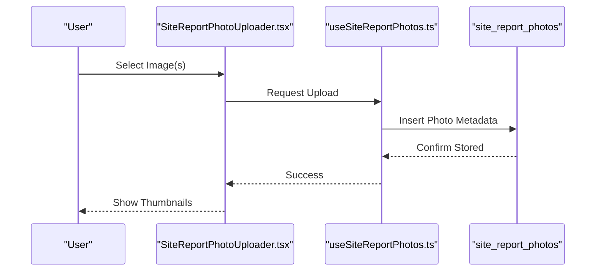
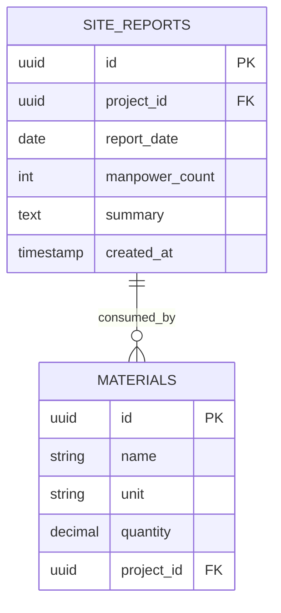
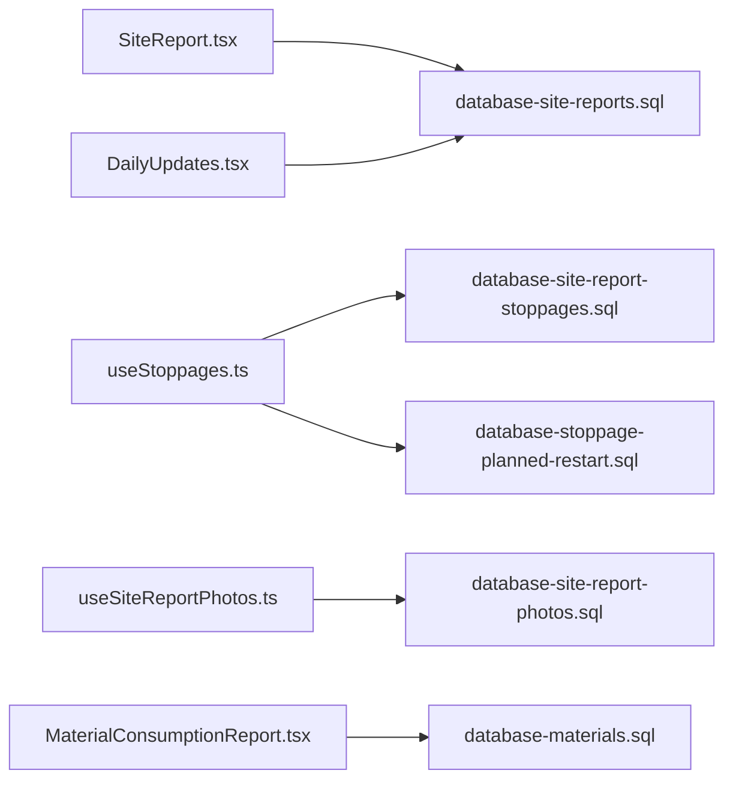

# Site Operations & Reporting

<cite>
**Referenced Files in This Document**
- [database-site-reports.sql](file://src/database-site-reports.sql)
- [database-site-report-stoppages.sql](file://src/database-site-report-stoppages.sql)
- [database-stoppage-planned-restart.sql](file://src/database-stoppage-planned-restart.sql)
- [database-site-report-photos.sql](file://src/database-site-report-photos.sql)
- [database-materials.sql](file://src/database-materials.sql)
- [MaterialConsumptionReport.tsx](file://src/pages/MaterialConsumptionReport.tsx)
- [SiteReport.tsx](file://src/pages/SiteReport.tsx)
- [DailyUpdates.tsx](file://src/pages/DailyUpdates.tsx)
- [useStoppages.ts](file://src/hooks/useStoppages.ts)
- [useSiteReportPhotos.ts](file://src/hooks/useSiteReportPhotos.ts)
- [SiteReportPhotoUploader.tsx](file://src/components/SiteReportPhotoUploader.tsx)
- [PRD-WORK-STOPPAGES-TWO-DATE-MODEL.md](file://docs/PRD-WORK-STOPPAGES-TWO-DATE-MODEL.md)
</cite>

## Table of Contents
1. [Introduction](#introduction)
2. [Project Structure](#project-structure)
3. [Core Components](#core-components)
4. [Architecture Overview](#architecture-overview)
5. [Detailed Component Analysis](#detailed-component-analysis)
6. [Dependency Analysis](#dependency-analysis)
7. [Performance Considerations](#performance-considerations)
8. [Troubleshooting Guide](#troubleshooting-guide)
9. [Conclusion](#conclusion)
10. [Appendices](#appendices)

## Introduction
This document provides comprehensive data model documentation for site operations and reporting systems. It focuses on:
- Site report structures and daily updates
- Photo uploads and storage integration
- Stoppage tracking with planned restart times
- Relationships between site activities, materials consumption, and labor tracking
- Stoppage classification, impact assessment, and recovery planning
- Examples of productivity queries, material usage analysis, and downtime reporting
- Data validation for site entries
- Performance considerations for real-time site updates

The goal is to make the data model accessible to both technical and non-technical readers while providing actionable guidance for implementation and maintenance.

## Project Structure
The site operations and reporting system spans database migrations, UI pages, hooks, and components:
- Database schema definitions for site reports, stoppages, photos, and materials
- Pages for creating and viewing site reports and daily updates
- Hooks for fetching and managing stoppages and photos
- Components for uploading site photos

**Diagram sources**
- [database-site-reports.sql](file://src/database-site-reports.sql)
- [database-site-report-stoppages.sql](file://src/database-site-report-stoppages.sql)
- [database-stoppage-planned-restart.sql](file://src/database-stoppage-planned-restart.sql)
- [database-site-report-photos.sql](file://src/database-site-report-photos.sql)
- [database-materials.sql](file://src/database-materials.sql)
- [SiteReport.tsx](file://src/pages/SiteReport.tsx)
- [DailyUpdates.tsx](file://src/pages/DailyUpdates.tsx)
- [MaterialConsumptionReport.tsx](file://src/pages/MaterialConsumptionReport.tsx)
- [useStoppages.ts](file://src/hooks/useStoppages.ts)
- [useSiteReportPhotos.ts](file://src/hooks/useSiteReportPhotos.ts)
- [SiteReportPhotoUploader.tsx](file://src/components/SiteReportPhotoUploader.tsx)

**Section sources**
- [database-site-reports.sql](file://src/database-site-reports.sql)
- [database-site-report-stoppages.sql](file://src/database-site-report-stoppages.sql)
- [database-stoppage-planned-restart.sql](file://src/database-stoppage-planned-restart.sql)
- [database-site-report-photos.sql](file://src/database-site-report-photos.sql)
- [database-materials.sql](file://src/database-materials.sql)
- [SiteReport.tsx](file://src/pages/SiteReport.tsx)
- [DailyUpdates.tsx](file://src/pages/DailyUpdates.tsx)
- [MaterialConsumptionReport.tsx](file://src/pages/MaterialConsumptionReport.tsx)
- [useStoppages.ts](file://src/hooks/useStoppages.ts)
- [useSiteReportPhotos.ts](file://src/hooks/useSiteReportPhotos.ts)
- [SiteReportPhotoUploader.tsx](file://src/components/SiteReportPhotoUploader.tsx)

## Core Components
This section outlines the core data entities and their relationships relevant to site operations and reporting.

- Site Reports
  - Purpose: Capture daily site progress, notes, weather, manpower counts, and status indicators.
  - Key fields include identifiers, project linkage, date, summary text, weather conditions, workforce counts, and timestamps.
  - Daily updates are created per day and linked to a specific project.

- Stoppages
  - Purpose: Record work interruptions with classification, cause, duration, and impact.
  - Fields include stoppage type (e.g., equipment failure, safety incident), start/end times, reason codes, severity, and notes.
  - Supports planned restart scheduling via a separate table.

- Planned Restart Times
  - Purpose: Track when work is expected to resume after a stoppage.
  - Fields link to a stoppage record and capture planned restart datetime, confidence level, and rescheduling notes.

- Photos
  - Purpose: Attach visual evidence to site reports or stoppages.
  - Fields include file metadata, upload timestamp, uploader identity, and optional captions or tags.

- Materials
  - Purpose: Track inventory items consumed at the site.
  - Fields include item identifiers, units, quantities, and links to projects or site reports for traceability.

Relationships:
- Site Reports connect to Stoppages and Photos.
- Stoppages connect to Planned Restart Times.
- Materials consumption can be associated with Site Reports or tracked independently for analysis.

**Section sources**
- [database-site-reports.sql](file://src/database-site-reports.sql)
- [database-site-report-stoppages.sql](file://src/database-site-report-stoppages.sql)
- [database-stoppage-planned-restart.sql](file://src/database-stoppage-planned-restart.sql)
- [database-site-report-photos.sql](file://src/database-site-report-photos.sql)
- [database-materials.sql](file://src/database-materials.sql)

## Architecture Overview
The architecture integrates frontend pages and hooks with backend database tables to support site reporting workflows.

**Diagram sources**
- [SiteReport.tsx](file://src/pages/SiteReport.tsx)
- [useStoppages.ts](file://src/hooks/useStoppages.ts)
- [database-site-report-stoppages.sql](file://src/database-site-report-stoppages.sql)
- [database-stoppage-planned-restart.sql](file://src/database-stoppage-planned-restart.sql)
- [useSiteReportPhotos.ts](file://src/hooks/useSiteReportPhotos.ts)
- [SiteReportPhotoUploader.tsx](file://src/components/SiteReportPhotoUploader.tsx)
- [database-site-report-photos.sql](file://src/database-site-report-photos.sql)

## Detailed Component Analysis

### Site Reports and Daily Updates
- Site reports aggregate daily progress, manpower, weather, and notes.
- Daily updates are typically one entry per site per day, enabling time-series analysis.
- The SiteReport page orchestrates creation and editing; DailyUpdates provides a focused view for day-level entries.

**Diagram sources**
- [SiteReport.tsx](file://src/pages/SiteReport.tsx)
- [DailyUpdates.tsx](file://src/pages/DailyUpdates.tsx)
- [database-site-reports.sql](file://src/database-site-reports.sql)

**Section sources**
- [SiteReport.tsx](file://src/pages/SiteReport.tsx)
- [DailyUpdates.tsx](file://src/pages/DailyUpdates.tsx)
- [database-site-reports.sql](file://src/database-site-reports.sql)

### Stoppage Tracking and Planned Restart Times
- Stoppage records classify interruptions by type and severity, capturing start/end times and reasons.
- Planned restarts allow forecasting recovery timelines and comparing planned vs actual restarts.
- The useStoppages hook centralizes CRUD operations and state management.

**Diagram sources**
- [database-site-report-stoppages.sql](file://src/database-site-report-stoppages.sql)
- [database-stoppage-planned-restart.sql](file://src/database-stoppage-planned-restart.sql)
- [useStoppages.ts](file://src/hooks/useStoppages.ts)

**Section sources**
- [database-site-report-stoppages.sql](file://src/database-site-report-stoppages.sql)
- [database-stoppage-planned-restart.sql](file://src/database-stoppage-planned-restart.sql)
- [useStoppages.ts](file://src/hooks/useStoppages.ts)
- [PRD-WORK-STOPPAGES-TWO-DATE-MODEL.md](file://docs/PRD-WORK-STOPPAGES-TWO-DATE-MODEL.md)

### Photo Uploads and Storage Integration
- Photos attach to site reports or stoppages with metadata such as uploader, timestamp, and caption.
- The SiteReportPhotoUploader component handles selection and upload flow; useSiteReportPhotos manages listing and retrieval.

**Diagram sources**
- [SiteReportPhotoUploader.tsx](file://src/components/SiteReportPhotoUploader.tsx)
- [useSiteReportPhotos.ts](file://src/hooks/useSiteReportPhotos.ts)
- [database-site-report-photos.sql](file://src/database-site-report-photos.sql)

**Section sources**
- [SiteReportPhotoUploader.tsx](file://src/components/SiteReportPhotoUploader.tsx)
- [useSiteReportPhotos.ts](file://src/hooks/useSiteReportPhotos.ts)
- [database-site-report-photos.sql](file://src/database-site-report-photos.sql)

### Materials Consumption and Labor Tracking
- Materials consumption ties item usage to projects or site reports for traceability.
- MaterialConsumptionReport aggregates usage metrics and supports analysis across time periods.
- Labor tracking complements materials by correlating workforce counts from site reports with output and consumption.

**Diagram sources**
- [database-materials.sql](file://src/database-materials.sql)
- [database-site-reports.sql](file://src/database-site-reports.sql)
- [MaterialConsumptionReport.tsx](file://src/pages/MaterialConsumptionReport.tsx)

**Section sources**
- [database-materials.sql](file://src/database-materials.sql)
- [database-site-reports.sql](file://src/database-site-reports.sql)
- [MaterialConsumptionReport.tsx](file://src/pages/MaterialConsumptionReport.tsx)

## Dependency Analysis
The following diagram shows how frontend components and hooks depend on database tables for site operations and reporting.

**Diagram sources**
- [SiteReport.tsx](file://src/pages/SiteReport.tsx)
- [DailyUpdates.tsx](file://src/pages/DailyUpdates.tsx)
- [useStoppages.ts](file://src/hooks/useStoppages.ts)
- [useSiteReportPhotos.ts](file://src/hooks/useSiteReportPhotos.ts)
- [MaterialConsumptionReport.tsx](file://src/pages/MaterialConsumptionReport.tsx)
- [database-site-reports.sql](file://src/database-site-reports.sql)
- [database-site-report-stoppages.sql](file://src/database-site-report-stoppages.sql)
- [database-stoppage-planned-restart.sql](file://src/database-stoppage-planned-restart.sql)
- [database-site-report-photos.sql](file://src/database-site-report-photos.sql)
- [database-materials.sql](file://src/database-materials.sql)

**Section sources**
- [SiteReport.tsx](file://src/pages/SiteReport.tsx)
- [DailyUpdates.tsx](file://src/pages/DailyUpdates.tsx)
- [useStoppages.ts](file://src/hooks/useStoppages.ts)
- [useSiteReportPhotos.ts](file://src/hooks/useSiteReportPhotos.ts)
- [MaterialConsumptionReport.tsx](file://src/pages/MaterialConsumptionReport.tsx)
- [database-site-reports.sql](file://src/database-site-reports.sql)
- [database-site-report-stoppages.sql](file://src/database-site-report-stoppages.sql)
- [database-stoppage-planned-restart.sql](file://src/database-stoppage-planned-restart.sql)
- [database-site-report-photos.sql](file://src/database-site-report-photos.sql)
- [database-materials.sql](file://src/database-materials.sql)

## Performance Considerations
- Real-time updates: Use lightweight polling or optimistic UI updates in hooks to minimize latency for stoppage and photo operations.
- Pagination and filtering: Apply server-side pagination and filters for large datasets like materials consumption and site reports.
- Indexing: Ensure indexes on foreign keys and frequently queried columns (e.g., project_id, report_date, stoppage start/end times).
- Photo handling: Compress images before upload and store only necessary metadata in the database to reduce payload sizes.
- Batch operations: Group related writes (e.g., saving a site report with multiple stoppages) into transactions where supported.

[No sources needed since this section provides general guidance]

## Troubleshooting Guide
Common issues and resolutions:
- Missing required fields in site reports: Validate mandatory inputs before persisting; display clear error messages.
- Duplicate daily entries: Enforce uniqueness constraints on project_id and report_date combinations.
- Stoppage duration inconsistencies: Compute duration from start/end times and validate that end >= start.
- Photo upload failures: Check storage permissions and file size limits; retry with compression if needed.
- Planned restart conflicts: Prevent overlapping planned restarts for the same stoppage; log rescheduling changes.

**Section sources**
- [database-site-reports.sql](file://src/database-site-reports.sql)
- [database-site-report-stoppages.sql](file://src/database-site-report-stoppages.sql)
- [database-stoppage-planned-restart.sql](file://src/database-stoppage-planned-restart.sql)
- [database-site-report-photos.sql](file://src/database-site-report-photos.sql)

## Conclusion
The site operations and reporting system integrates structured data models for site reports, stoppages, planned restarts, photos, and materials consumption. By aligning frontend workflows with robust database schemas and applying performance best practices, teams can achieve accurate daily tracking, effective downtime analysis, and informed resource planning.

[No sources needed since this section summarizes without analyzing specific files]

## Appendices

### Example Queries and Analyses
- Site productivity query: Aggregate completed tasks or output per site report over a date range, correlated with manpower counts.
- Material usage analysis: Summarize consumption by item and project across selected periods, identifying trends and anomalies.
- Downtime reporting: Calculate total stoppage duration by type and severity, compare planned vs actual restart times, and assess impact on schedule.

[No sources needed since this section provides conceptual examples]