# Progress Tracking and Status Management

<cite>
**Referenced Files in This Document**
- [database-project-tasks.sql](file://src/database-project-tasks.sql)
- [database-unified-tasks.sql](file://src/database-unified-tasks.sql)
- [useMilestones.ts](file://src/hooks/useMilestones.ts)
- [useTaskSearch.ts](file://src/hooks/useTaskSearch.ts)
- [TasksPage.tsx](file://src/pages/TasksPage.tsx)
- [components/tasks/index.ts](file://src/components/tasks/index.ts)
- [components/tasks/TaskCard.tsx](file://src/components/tasks/TaskCard.tsx)
- [components/tasks/TaskBoardView.tsx](file://src/components/tasks/TaskBoardView.tsx)
- [components/tasks/TaskListView.tsx](file://src/components/tasks/TaskListView.tsx)
- [components/tasks/TaskCalendarView.tsx](file://src/components/tasks/TaskCalendarView.tsx)
- [components/tasks/TaskGanttView.tsx](file://src/components/tasks/TaskGanttView.tsx)
- [components/tasks/TaskProgressIndicator.tsx](file://src/components/tasks/TaskProgressIndicator.tsx)
- [components/tasks/TaskStatusBadge.tsx](file://src/components/tasks/TaskStatusBadge.tsx)
- [components/tasks/TaskTimeTracking.tsx](file://src/components/tasks/TaskTimeTracking.tsx)
- [components/tasks/TaskComments.tsx](file://src/components/tasks/TaskComments.tsx)
- [components/tasks/TaskFileUploads.tsx](file://src/components/tasks/TaskFileUploads.tsx)
- [components/tasks/TaskNotifications.tsx](file://src/components/tasks/TaskNotifications.tsx)
- [components/tasks/TaskAuditLog.tsx](file://src/components/tasks/TaskAuditLog.tsx)
- [lib/followup/task-progress-utils.ts](file://src/lib/followup/task-progress-utils.ts)
- [lib/followup/task-status-validation.ts](file://src/lib/followup/task-status-validation.ts)
- [hooks/useProjectClosureChecklist.ts](file://src/hooks/useProjectClosureChecklist.ts)
- [pages/ProjectOverview.tsx](file://src/pages/ProjectOverview.tsx)
</cite>

## Table of Contents
1. [Introduction](#introduction)
2. [Project Structure](#project-structure)
3. [Core Components](#core-components)
4. [Architecture Overview](#architecture-overview)
5. [Detailed Component Analysis](#detailed-component-analysis)
6. [Dependency Analysis](#dependency-analysis)
7. [Performance Considerations](#performance-considerations)
8. [Troubleshooting Guide](#troubleshooting-guide)
9. [Conclusion](#conclusion)
10. [Appendices](#appendices)

## Introduction
This document explains how task progress tracking and status management are implemented across the application. It covers:
- Status definitions and completion criteria for different task types
- Progress calculation methods and validation rules
- Time tracking integration, milestone marking, and automated updates from related activities (comments, file uploads)
- Progress visualization across board, list, calendar, and Gantt views
- Custom progress indicators, reporting, and notifications for overdue or at-risk tasks
- Audit trails for status changes

The goal is to provide a clear, end-to-end understanding for both technical and non-technical readers.

## Project Structure
The progress tracking system spans database schemas, hooks, UI components, and utilities:
- Database schemas define task entities, statuses, milestones, time logs, comments, files, and audit entries
- Hooks provide data access and business logic for milestones and search
- Pages orchestrate views and user interactions
- Components implement view-specific rendering and reusable UI elements
- Utilities encapsulate progress calculations, validations, and automation helpers

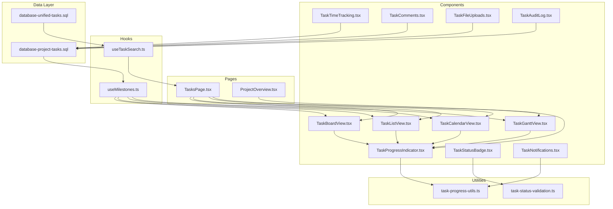

**Diagram sources**
- [database-project-tasks.sql](file://src/database-project-tasks.sql)
- [database-unified-tasks.sql](file://src/database-unified-tasks.sql)
- [useMilestones.ts](file://src/hooks/useMilestones.ts)
- [useTaskSearch.ts](file://src/hooks/useTaskSearch.ts)
- [TasksPage.tsx](file://src/pages/TasksPage.tsx)
- [TaskBoardView.tsx](file://src/components/tasks/TaskBoardView.tsx)
- [TaskListView.tsx](file://src/components/tasks/TaskListView.tsx)
- [TaskCalendarView.tsx](file://src/components/tasks/TaskCalendarView.tsx)
- [TaskGanttView.tsx](file://src/components/tasks/TaskGanttView.tsx)
- [TaskProgressIndicator.tsx](file://src/components/tasks/TaskProgressIndicator.tsx)
- [TaskStatusBadge.tsx](file://src/components/tasks/TaskStatusBadge.tsx)
- [TaskTimeTracking.tsx](file://src/components/tasks/TaskTimeTracking.tsx)
- [TaskComments.tsx](file://src/components/tasks/TaskComments.tsx)
- [TaskFileUploads.tsx](file://src/components/tasks/TaskFileUploads.tsx)
- [TaskNotifications.tsx](file://src/components/tasks/TaskNotifications.tsx)
- [TaskAuditLog.tsx](file://src/components/tasks/TaskAuditLog.tsx)
- [task-progress-utils.ts](file://src/lib/followup/task-progress-utils.ts)
- [task-status-validation.ts](file://src/lib/followup/task-status-validation.ts)
- [ProjectOverview.tsx](file://src/pages/ProjectOverview.tsx)

**Section sources**
- [database-project-tasks.sql](file://src/database-project-tasks.sql)
- [database-unified-tasks.sql](file://src/database-unified-tasks.sql)
- [useMilestones.ts](file://src/hooks/useMilestones.ts)
- [useTaskSearch.ts](file://src/hooks/useTaskSearch.ts)
- [TasksPage.tsx](file://src/pages/TasksPage.tsx)
- [TaskBoardView.tsx](file://src/components/tasks/TaskBoardView.tsx)
- [TaskListView.tsx](file://src/components/tasks/TaskListView.tsx)
- [TaskCalendarView.tsx](file://src/components/tasks/TaskCalendarView.tsx)
- [TaskGanttView.tsx](file://src/components/tasks/TaskGanttView.tsx)
- [TaskProgressIndicator.tsx](file://src/components/tasks/TaskProgressIndicator.tsx)
- [TaskStatusBadge.tsx](file://src/components/tasks/TaskStatusBadge.tsx)
- [TaskTimeTracking.tsx](file://src/components/tasks/TaskTimeTracking.tsx)
- [TaskComments.tsx](file://src/components/tasks/TaskComments.tsx)
- [TaskFileUploads.tsx](file://src/components/tasks/TaskFileUploads.tsx)
- [TaskNotifications.tsx](file://src/components/tasks/TaskNotifications.tsx)
- [TaskAuditLog.tsx](file://src/components/tasks/TaskAuditLog.tsx)
- [task-progress-utils.ts](file://src/lib/followup/task-progress-utils.ts)
- [task-status-validation.ts](file://src/lib/followup/task-status-validation.ts)
- [ProjectOverview.tsx](file://src/pages/ProjectOverview.tsx)

## Core Components
- Task entity and lifecycle:
  - Tasks store core fields such as title, description, assignee, due date, priority, type, and status
  - Status transitions are governed by validation rules and audit logging
- Milestones:
  - Milestone markers tied to projects or phases; completion contributes to overall project progress
- Time tracking:
  - Time logs associated with tasks; cumulative hours influence progress calculations
- Comments and files:
  - Activity-driven updates can incrementally adjust progress based on new comments or uploaded artifacts
- Views:
  - Board, list, calendar, and Gantt render task states and progress consistently
- Notifications and audit:
  - Automated alerts for overdue/at-risk tasks; immutable audit trail for status changes

**Section sources**
- [database-project-tasks.sql](file://src/database-project-tasks.sql)
- [database-unified-tasks.sql](file://src/database-unified-tasks.sql)
- [useMilestones.ts](file://src/hooks/useMilestones.ts)
- [TaskTimeTracking.tsx](file://src/components/tasks/TaskTimeTracking.tsx)
- [TaskComments.tsx](file://src/components/tasks/TaskComments.tsx)
- [TaskFileUploads.tsx](file://src/components/tasks/TaskFileUploads.tsx)
- [TaskNotifications.tsx](file://src/components/tasks/TaskNotifications.tsx)
- [TaskAuditLog.tsx](file://src/components/tasks/TaskAuditLog.tsx)

## Architecture Overview
The system follows a layered architecture:
- Data layer: SQL schemas define tasks, milestones, time logs, comments, files, and audit entries
- Service layer: Hooks and utilities compute progress, validate transitions, and manage search/filtering
- Presentation layer: Page orchestrates views; components render progress, status, and interactive features

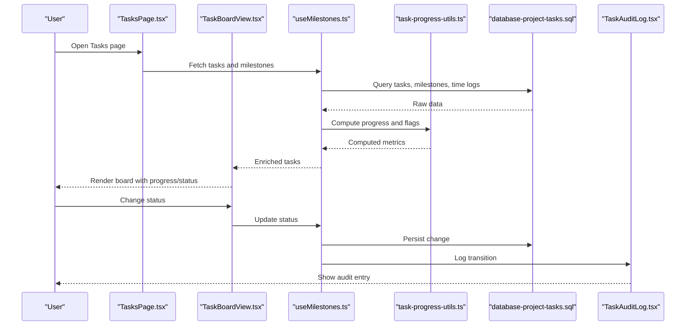

**Diagram sources**
- [TasksPage.tsx](file://src/pages/TasksPage.tsx)
- [TaskBoardView.tsx](file://src/components/tasks/TaskBoardView.tsx)
- [useMilestones.ts](file://src/hooks/useMilestones.ts)
- [task-progress-utils.ts](file://src/lib/followup/task-progress-utils.ts)
- [database-project-tasks.sql](file://src/database-project-tasks.sql)
- [TaskAuditLog.tsx](file://src/components/tasks/TaskAuditLog.tsx)

## Detailed Component Analysis

### Status Definitions and Completion Criteria
- Status values:
  - Typical statuses include Draft, In Progress, Review, Blocked, Completed, Cancelled
  - Each status has specific meaning and allowed transitions
- Completion criteria:
  - A task completes when all required subtasks/milestones are done, time logged meets thresholds, and no blockers remain
  - Type-specific rules may require approvals or attachments before completion

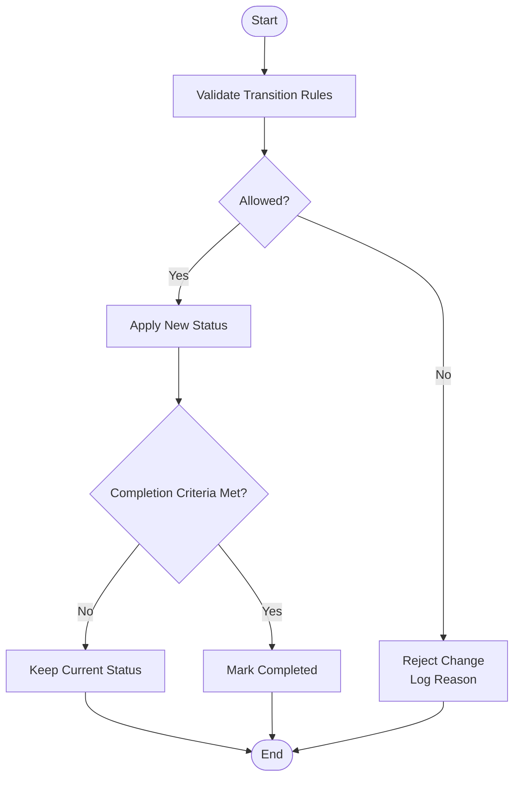

**Diagram sources**
- [task-status-validation.ts](file://src/lib/followup/task-status-validation.ts)
- [database-project-tasks.sql](file://src/database-project-tasks.sql)

**Section sources**
- [task-status-validation.ts](file://src/lib/followup/task-status-validation.ts)
- [database-project-tasks.sql](file://src/database-project-tasks.sql)

### Progress Calculation Methods
- Weighted contributions:
  - Subtasks, milestones, time logged, and activity signals contribute to an aggregate percentage
- Formulas:
  - Base progress = sum(weight_i * completion_i) / total_weight
  - Adjustments for time spent vs planned hours and activity density
- Real-time updates:
  - On comment creation or file upload, recalculate progress if configured

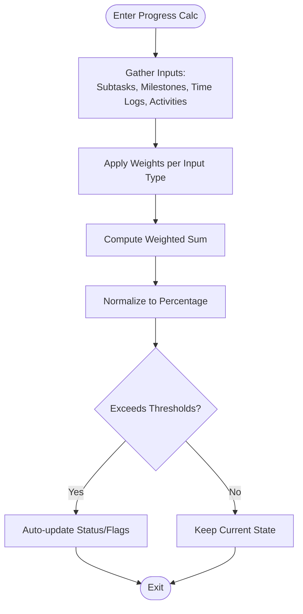

**Diagram sources**
- [task-progress-utils.ts](file://src/lib/followup/task-progress-utils.ts)
- [database-project-tasks.sql](file://src/database-project-tasks.sql)

**Section sources**
- [task-progress-utils.ts](file://src/lib/followup/task-progress-utils.ts)
- [database-project-tasks.sql](file://src/database-project-tasks.sql)

### Time Tracking Integration
- Time logs:
  - Entries record duration, start/end times, and notes
  - Cumulative logged hours feed into progress calculations
- Integration points:
  - TaskTimeTracking component manages CRUD operations
  - Updates trigger recalculations via progress utilities

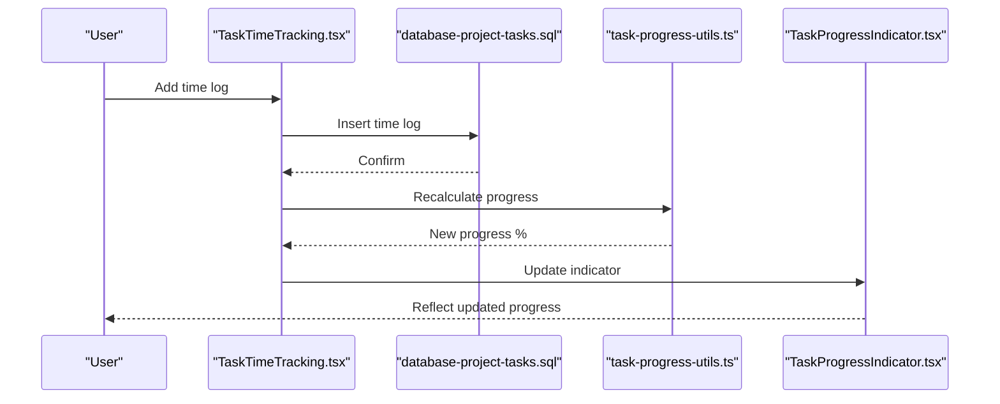

**Diagram sources**
- [TaskTimeTracking.tsx](file://src/components/tasks/TaskTimeTracking.tsx)
- [database-project-tasks.sql](file://src/database-project-tasks.sql)
- [task-progress-utils.ts](file://src/lib/followup/task-progress-utils.ts)
- [TaskProgressIndicator.tsx](file://src/components/tasks/TaskProgressIndicator.tsx)

**Section sources**
- [TaskTimeTracking.tsx](file://src/components/tasks/TaskTimeTracking.tsx)
- [database-project-tasks.sql](file://src/database-project-tasks.sql)
- [task-progress-utils.ts](file://src/lib/followup/task-progress-utils.ts)
- [TaskProgressIndicator.tsx](file://src/components/tasks/TaskProgressIndicator.tsx)

### Milestone Marking
- Milestones:
  - Represent key deliverables or phases within a project
  - Completion contributes to project-level progress
- Hook usage:
  - useMilestones provides fetching and updating milestones
  - Milestone completion triggers progress recalculation

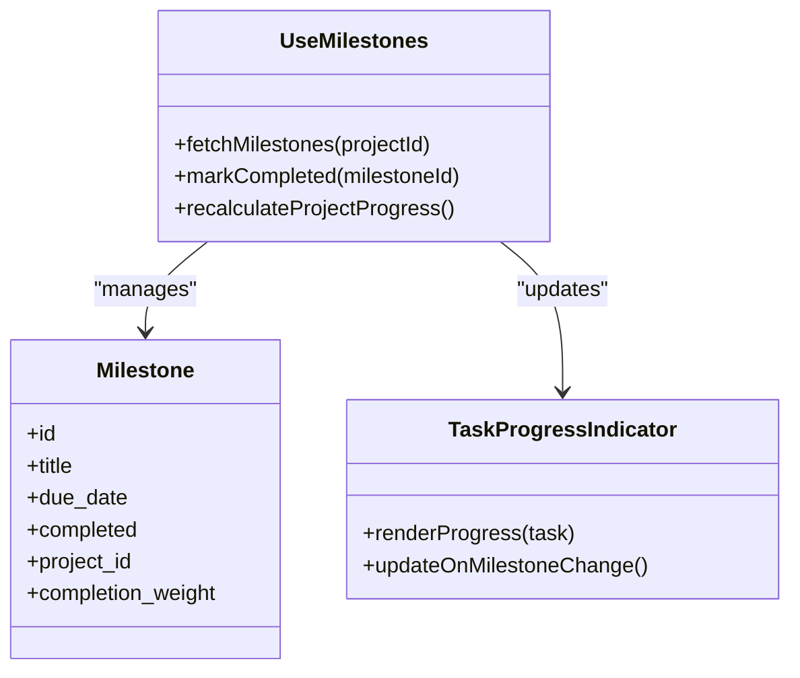

**Diagram sources**
- [useMilestones.ts](file://src/hooks/useMilestones.ts)
- [TaskProgressIndicator.tsx](file://src/components/tasks/TaskProgressIndicator.tsx)

**Section sources**
- [useMilestones.ts](file://src/hooks/useMilestones.ts)
- [TaskProgressIndicator.tsx](file://src/components/tasks/TaskProgressIndicator.tsx)

### Progress Visualization Across Views
- Board view:
  - Cards show status badges and compact progress bars
- List view:
  - Rows display detailed progress and time summaries
- Calendar view:
  - Events highlight overdue and at-risk tasks
- Gantt view:
  - Bars represent planned vs actual durations with progress overlays

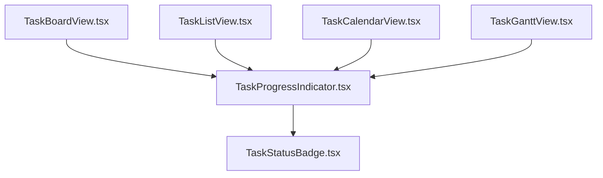

**Diagram sources**
- [TaskBoardView.tsx](file://src/components/tasks/TaskBoardView.tsx)
- [TaskListView.tsx](file://src/components/tasks/TaskListView.tsx)
- [TaskCalendarView.tsx](file://src/components/tasks/TaskCalendarView.tsx)
- [TaskGanttView.tsx](file://src/components/tasks/TaskGanttView.tsx)
- [TaskProgressIndicator.tsx](file://src/components/tasks/TaskProgressIndicator.tsx)
- [TaskStatusBadge.tsx](file://src/components/tasks/TaskStatusBadge.tsx)

**Section sources**
- [TaskBoardView.tsx](file://src/components/tasks/TaskBoardView.tsx)
- [TaskListView.tsx](file://src/components/tasks/TaskListView.tsx)
- [TaskCalendarView.tsx](file://src/components/tasks/TaskCalendarView.tsx)
- [TaskGanttView.tsx](file://src/components/tasks/TaskGanttView.tsx)
- [TaskProgressIndicator.tsx](file://src/components/tasks/TaskProgressIndicator.tsx)
- [TaskStatusBadge.tsx](file://src/components/tasks/TaskStatusBadge.tsx)

### Automated Progress Updates from Related Activities
- Comments:
  - New comments can incrementally increase progress if configured
- File uploads:
  - Attachments signal work artifacts; progress adjusts accordingly
- Notifications:
  - Alerts for overdue or at-risk tasks based on due dates and progress trends

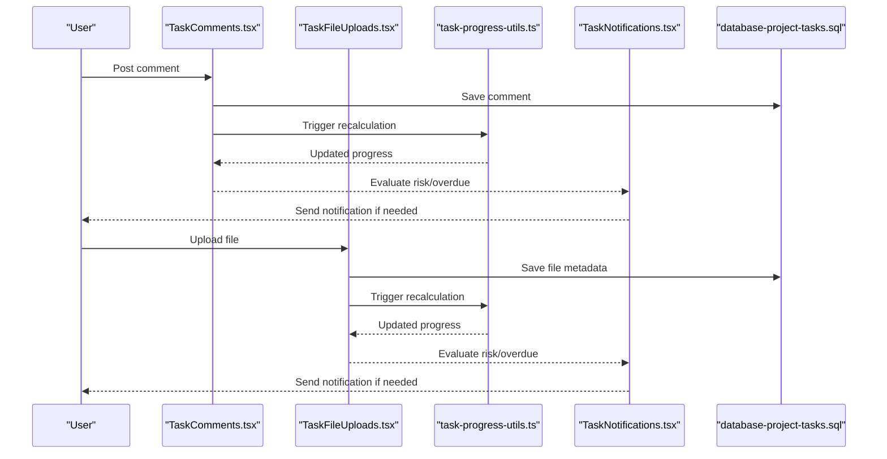

**Diagram sources**
- [TaskComments.tsx](file://src/components/tasks/TaskComments.tsx)
- [TaskFileUploads.tsx](file://src/components/tasks/TaskFileUploads.tsx)
- [task-progress-utils.ts](file://src/lib/followup/task-progress-utils.ts)
- [TaskNotifications.tsx](file://src/components/tasks/TaskNotifications.tsx)
- [database-project-tasks.sql](file://src/database-project-tasks.sql)

**Section sources**
- [TaskComments.tsx](file://src/components/tasks/TaskComments.tsx)
- [TaskFileUploads.tsx](file://src/components/tasks/TaskFileUploads.tsx)
- [task-progress-utils.ts](file://src/lib/followup/task-progress-utils.ts)
- [TaskNotifications.tsx](file://src/components/tasks/TaskNotifications.tsx)
- [database-project-tasks.sql](file://src/database-project-tasks.sql)

### Custom Progress Indicators and Reporting
- Custom indicators:
  - Reusable component renders percentage, color-coded status, and tooltips
- Reporting:
  - Aggregated metrics across tasks and milestones for dashboards
  - Exportable summaries for stakeholders

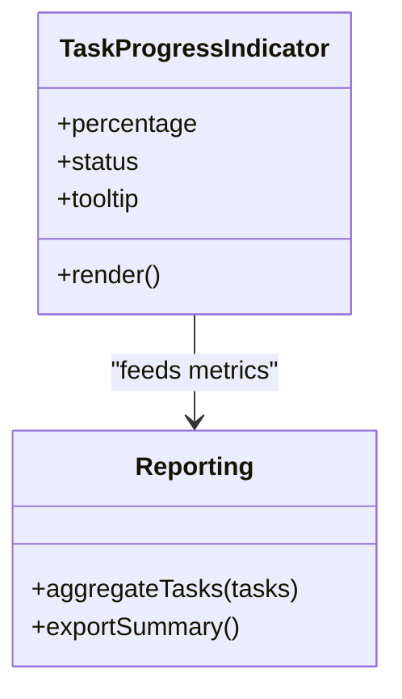

**Diagram sources**
- [TaskProgressIndicator.tsx](file://src/components/tasks/TaskProgressIndicator.tsx)

**Section sources**
- [TaskProgressIndicator.tsx](file://src/components/tasks/TaskProgressIndicator.tsx)

### Audit Trails for Status Changes
- Audit entries:
  - Immutable records capture who changed status, when, and why
- Access:
  - Dedicated component displays history and supports filtering

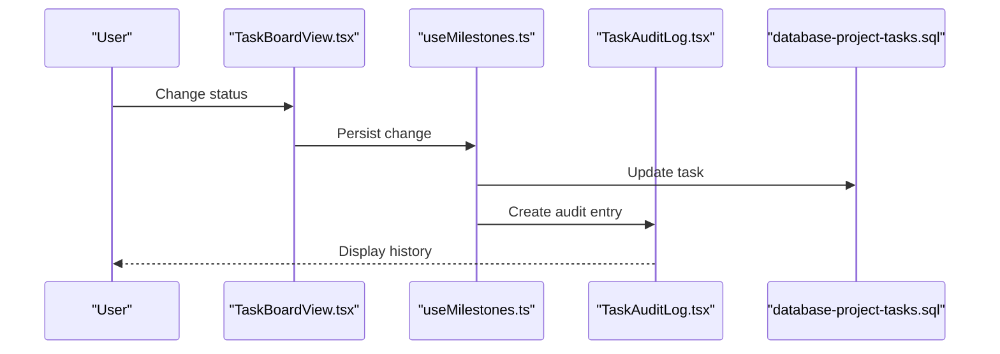

**Diagram sources**
- [TaskBoardView.tsx](file://src/components/tasks/TaskBoardView.tsx)
- [useMilestones.ts](file://src/hooks/useMilestones.ts)
- [TaskAuditLog.tsx](file://src/components/tasks/TaskAuditLog.tsx)
- [database-project-tasks.sql](file://src/database-project-tasks.sql)

**Section sources**
- [TaskBoardView.tsx](file://src/components/tasks/TaskBoardView.tsx)
- [useMilestones.ts](file://src/hooks/useMilestones.ts)
- [TaskAuditLog.tsx](file://src/components/tasks/TaskAuditLog.tsx)
- [database-project-tasks.sql](file://src/database-project-tasks.sql)

## Dependency Analysis
Key dependencies and relationships:
- Database schemas underpin all components and hooks
- Hooks centralize data access and computation
- Components depend on hooks and utilities for consistent behavior
- Notifications and audit rely on computed progress and status transitions

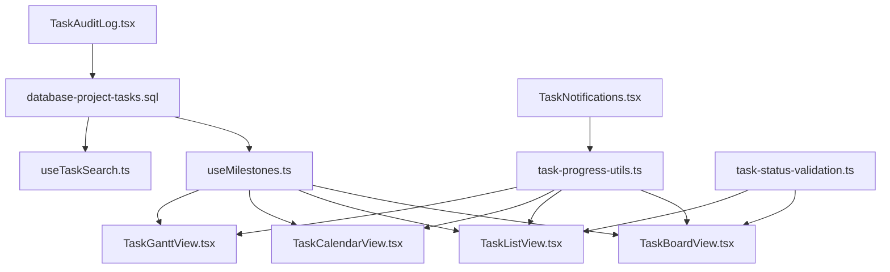

**Diagram sources**
- [database-project-tasks.sql](file://src/database-project-tasks.sql)
- [useMilestones.ts](file://src/hooks/useMilestones.ts)
- [useTaskSearch.ts](file://src/hooks/useTaskSearch.ts)
- [TaskBoardView.tsx](file://src/components/tasks/TaskBoardView.tsx)
- [TaskListView.tsx](file://src/components/tasks/TaskListView.tsx)
- [TaskCalendarView.tsx](file://src/components/tasks/TaskCalendarView.tsx)
- [TaskGanttView.tsx](file://src/components/tasks/TaskGanttView.tsx)
- [task-progress-utils.ts](file://src/lib/followup/task-progress-utils.ts)
- [task-status-validation.ts](file://src/lib/followup/task-status-validation.ts)
- [TaskNotifications.tsx](file://src/components/tasks/TaskNotifications.tsx)
- [TaskAuditLog.tsx](file://src/components/tasks/TaskAuditLog.tsx)

**Section sources**
- [database-project-tasks.sql](file://src/database-project-tasks.sql)
- [useMilestones.ts](file://src/hooks/useMilestones.ts)
- [useTaskSearch.ts](file://src/hooks/useTaskSearch.ts)
- [TaskBoardView.tsx](file://src/components/tasks/TaskBoardView.tsx)
- [TaskListView.tsx](file://src/components/tasks/TaskListView.tsx)
- [TaskCalendarView.tsx](file://src/components/tasks/TaskCalendarView.tsx)
- [TaskGanttView.tsx](file://src/components/tasks/TaskGanttView.tsx)
- [task-progress-utils.ts](file://src/lib/followup/task-progress-utils.ts)
- [task-status-validation.ts](file://src/lib/followup/task-status-validation.ts)
- [TaskNotifications.tsx](file://src/components/tasks/TaskNotifications.tsx)
- [TaskAuditLog.tsx](file://src/components/tasks/TaskAuditLog.tsx)

## Performance Considerations
- Batch updates:
  - Group multiple progress-related mutations to reduce re-renders
- Efficient queries:
  - Use selective fields and indexes for tasks, milestones, and time logs
- Memoization:
  - Cache computed progress results where appropriate
- Lazy loading:
  - Load heavy views (Gantt) lazily to improve initial load time

[No sources needed since this section provides general guidance]

## Troubleshooting Guide
Common issues and resolutions:
- Status transition rejected:
  - Check validation rules and ensure prerequisites are met
- Progress not updating:
  - Verify that activity events (comments/files) trigger recalculation
- Overdue notifications missing:
  - Confirm due date logic and threshold settings
- Audit entries missing:
  - Ensure persistence and logging steps execute after status changes

**Section sources**
- [task-status-validation.ts](file://src/lib/followup/task-status-validation.ts)
- [task-progress-utils.ts](file://src/lib/followup/task-progress-utils.ts)
- [TaskNotifications.tsx](file://src/components/tasks/TaskNotifications.tsx)
- [TaskAuditLog.tsx](file://src/components/tasks/TaskAuditLog.tsx)

## Conclusion
The progress tracking and status management system integrates data, computation, and presentation layers to provide accurate, real-time insights into task health. By enforcing validation rules, computing weighted progress, and maintaining audit trails, the system ensures reliability and transparency. Visualizations across multiple views support diverse workflows, while automated notifications keep teams informed about risks and deadlines.

[No sources needed since this section summarizes without analyzing specific files]

## Appendices
- Example custom progress indicator usage:
  - Reference path: [TaskProgressIndicator.tsx](file://src/components/tasks/TaskProgressIndicator.tsx)
- Example milestone marking flow:
  - Reference path: [useMilestones.ts](file://src/hooks/useMilestones.ts)
- Example project closure checklist integration:
  - Reference path: [useProjectClosureChecklist.ts](file://src/hooks/useProjectClosureChecklist.ts)
- Example project overview aggregation:
  - Reference path: [ProjectOverview.tsx](file://src/pages/ProjectOverview.tsx)

**Section sources**
- [TaskProgressIndicator.tsx](file://src/components/tasks/TaskProgressIndicator.tsx)
- [useMilestones.ts](file://src/hooks/useMilestones.ts)
- [useProjectClosureChecklist.ts](file://src/hooks/useProjectClosureChecklist.ts)
- [ProjectOverview.tsx](file://src/pages/ProjectOverview.tsx)