# Task Assignment and Workflows

<cite>
**Referenced Files in This Document**
- [TasksPage.tsx](file://src/pages/TasksPage.tsx)
- [useTaskSearch.ts](file://src/hooks/useTaskSearch.ts)
- [database-unified-tasks.sql](file://src/database-unified-tasks.sql)
- [database-project-tasks.sql](file://src/database-project-tasks.sql)
- [database-tasks-fix.sql](file://src/database-tasks-fix.sql)
- [database-tasks-migration.sql](file://src/database-tasks-migration.sql)
- [components/tasks/TaskList.tsx](file://src/components/tasks/TaskList.tsx)
- [components/tasks/TaskDetailDrawer.tsx](file://src/components/tasks/TaskDetailDrawer.tsx)
- [components/tasks/TaskAssignmentModal.tsx](file://src/components/tasks/TaskAssignmentModal.tsx)
- [components/tasks/TaskBulkActions.tsx](file://src/components/tasks/TaskBulkActions.tsx)
- [hooks/useFollowupAssignees.ts](file://src/hooks/useFollowupAssignees.ts)
- [lib/followup/workflowEngine.ts](file://src/lib/followup/workflowEngine.ts)
- [approvals/workflow-engine.ts](file://src/approvals/workflow-engine.ts)
- [api.ts (tasks)](file://src/api.ts)
</cite>

## Table of Contents
1. [Introduction](#introduction)
2. [Project Structure](#project-structure)
3. [Core Components](#core-components)
4. [Architecture Overview](#architecture-overview)
5. [Detailed Component Analysis](#detailed-component-analysis)
6. [Dependency Analysis](#dependency-analysis)
7. [Performance Considerations](#performance-considerations)
8. [Troubleshooting Guide](#troubleshooting-guide)
9. [Conclusion](#conclusion)
10. [Appendices](#appendices)

## Introduction
This document explains task assignment workflows and user interactions across the application. It covers manual assignment, automatic assignment rules, workload balancing, status transitions, approval workflows, escalation procedures, and relationships between tasks and users, teams, and organizational units. It also includes examples for complex scenarios, bulk operations, automated routing, conflict resolution when multiple users are assigned to the same task, and delegation patterns for temporary reassignment.

## Project Structure
The task system spans UI components, hooks, API integrations, and database schemas:
- UI layer: pages and reusable components for listing, viewing, assigning, and bulk-managing tasks
- Hooks: data fetching, search, and assignee management
- API: server-side endpoints and RPCs for task operations
- Database: schema definitions and migrations for tasks, assignments, approvals, and escalations

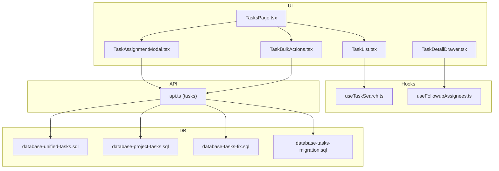

**Diagram sources**
- [TasksPage.tsx](file://src/pages/TasksPage.tsx)
- [components/tasks/TaskList.tsx](file://src/components/tasks/TaskList.tsx)
- [components/tasks/TaskDetailDrawer.tsx](file://src/components/tasks/TaskDetailDrawer.tsx)
- [components/tasks/TaskAssignmentModal.tsx](file://src/components/tasks/TaskAssignmentModal.tsx)
- [components/tasks/TaskBulkActions.tsx](file://src/components/tasks/TaskBulkActions.tsx)
- [useTaskSearch.ts](file://src/hooks/useTaskSearch.ts)
- [hooks/useFollowupAssignees.ts](file://src/hooks/useFollowupAssignees.ts)
- [api.ts (tasks)](file://src/api.ts)
- [database-unified-tasks.sql](file://src/database-unified-tasks.sql)
- [database-project-tasks.sql](file://src/database-project-tasks.sql)
- [database-tasks-fix.sql](file://src/database-tasks-fix.sql)
- [database-tasks-migration.sql](file://src/database-tasks-migration.sql)

**Section sources**
- [TasksPage.tsx](file://src/pages/TasksPage.tsx)
- [components/tasks/TaskList.tsx](file://src/components/tasks/TaskList.tsx)
- [components/tasks/TaskDetailDrawer.tsx](file://src/components/tasks/TaskDetailDrawer.tsx)
- [components/tasks/TaskAssignmentModal.tsx](file://src/components/tasks/TaskAssignmentModal.tsx)
- [components/tasks/TaskBulkActions.tsx](file://src/components/tasks/TaskBulkActions.tsx)
- [useTaskSearch.ts](file://src/hooks/useTaskSearch.ts)
- [hooks/useFollowupAssignees.ts](file://src/hooks/useFollowupAssignees.ts)
- [api.ts (tasks)](file://src/api.ts)
- [database-unified-tasks.sql](file://src/database-unified-tasks.sql)
- [database-project-tasks.sql](file://src/database-project-tasks.sql)
- [database-tasks-fix.sql](file://src/database-tasks-fix.sql)
- [database-tasks-migration.sql](file://src/database-tasks-migration.sql)

## Core Components
- Task list and detail views: provide filtering, search, and detailed context for assignment and workflow actions
- Assignment modal: supports manual assignment, team-based selection, and delegation options
- Bulk actions: enable batch updates such as reassigning, changing status, or applying tags
- Search hook: powers efficient querying with filters and pagination
- Follow-up assignees hook: manages assignee lists and availability signals

Key responsibilities:
- Present available assignees and enforce permissions
- Validate assignment changes and persist via API
- Coordinate status transitions and trigger downstream workflows

**Section sources**
- [components/tasks/TaskList.tsx](file://src/components/tasks/TaskList.tsx)
- [components/tasks/TaskDetailDrawer.tsx](file://src/components/tasks/TaskDetailDrawer.tsx)
- [components/tasks/TaskAssignmentModal.tsx](file://src/components/tasks/TaskAssignmentModal.tsx)
- [components/tasks/TaskBulkActions.tsx](file://src/components/tasks/TaskBulkActions.tsx)
- [useTaskSearch.ts](file://src/hooks/useTaskSearch.ts)
- [hooks/useFollowupAssignees.ts](file://src/hooks/useFollowupAssignees.ts)

## Architecture Overview
End-to-end flow from UI to persistence and back:

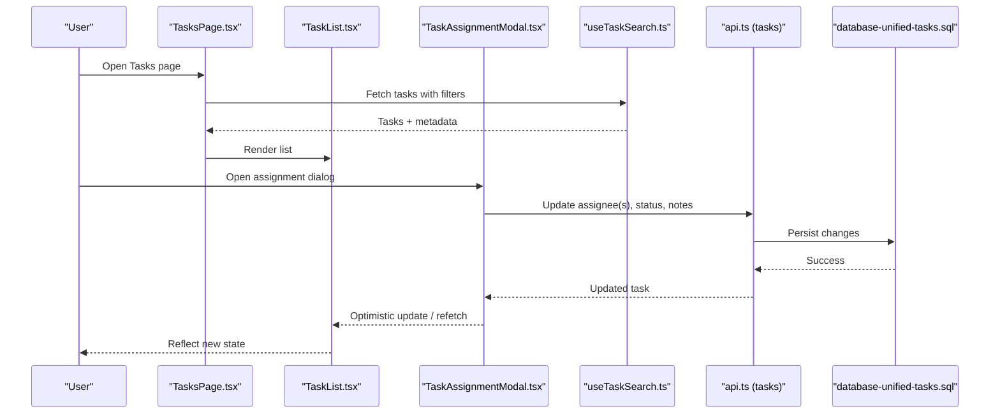

**Diagram sources**
- [TasksPage.tsx](file://src/pages/TasksPage.tsx)
- [components/tasks/TaskList.tsx](file://src/components/tasks/TaskList.tsx)
- [components/tasks/TaskAssignmentModal.tsx](file://src/components/tasks/TaskAssignmentModal.tsx)
- [useTaskSearch.ts](file://src/hooks/useTaskSearch.ts)
- [api.ts (tasks)](file://src/api.ts)
- [database-unified-tasks.sql](file://src/database-unified-tasks.sql)

## Detailed Component Analysis

### Manual Assignment Flow
Manual assignment is initiated from the task detail view or inline list controls. The assignment modal presents eligible users and teams, validates constraints, and persists changes through the API.

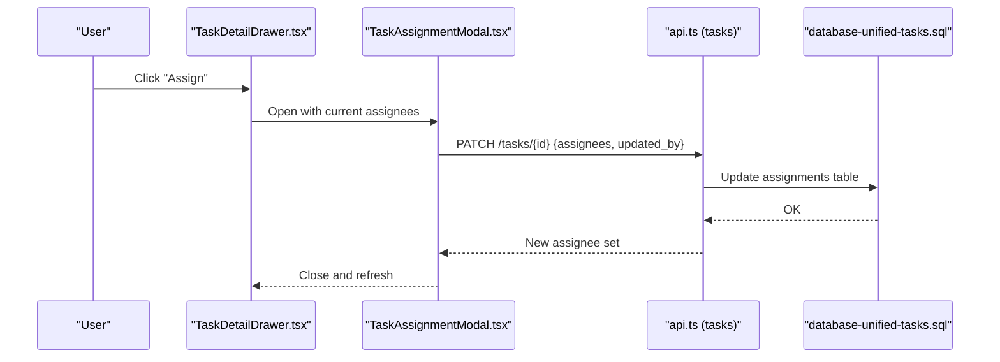

**Diagram sources**
- [components/tasks/TaskDetailDrawer.tsx](file://src/components/tasks/TaskDetailDrawer.tsx)
- [components/tasks/TaskAssignmentModal.tsx](file://src/components/tasks/TaskAssignmentModal.tsx)
- [api.ts (tasks)](file://src/api.ts)
- [database-unified-tasks.sql](file://src/database-unified-tasks.sql)

**Section sources**
- [components/tasks/TaskDetailDrawer.tsx](file://src/components/tasks/TaskDetailDrawer.tsx)
- [components/tasks/TaskAssignmentModal.tsx](file://src/components/tasks/TaskAssignmentModal.tsx)
- [api.ts (tasks)](file://src/api.ts)
- [database-unified-tasks.sql](file://src/database-unified-tasks.sql)

### Automatic Assignment Rules and Workload Balancing
Automatic assignment can be implemented by evaluating candidate users against rules such as role, skills, capacity, and current load. A typical algorithm:
- Filter candidates by eligibility (role, org unit, project membership)
- Score candidates by workload balance (e.g., fewer active tasks preferred)
- Apply tiebreakers (availability, priority, SLA proximity)
- Select top candidate(s) and persist assignment

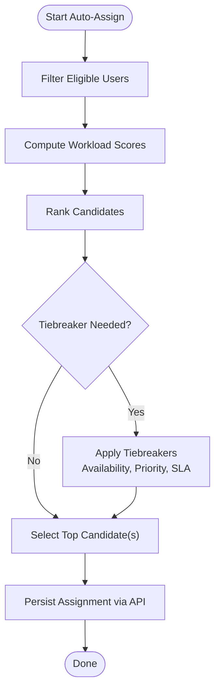

[No sources needed since this diagram shows conceptual workflow, not actual code structure]

### Status Transitions and Approval Workflows
Status transitions are governed by business rules and may require approvals. The approval engine coordinates multi-step reviews and escalations.

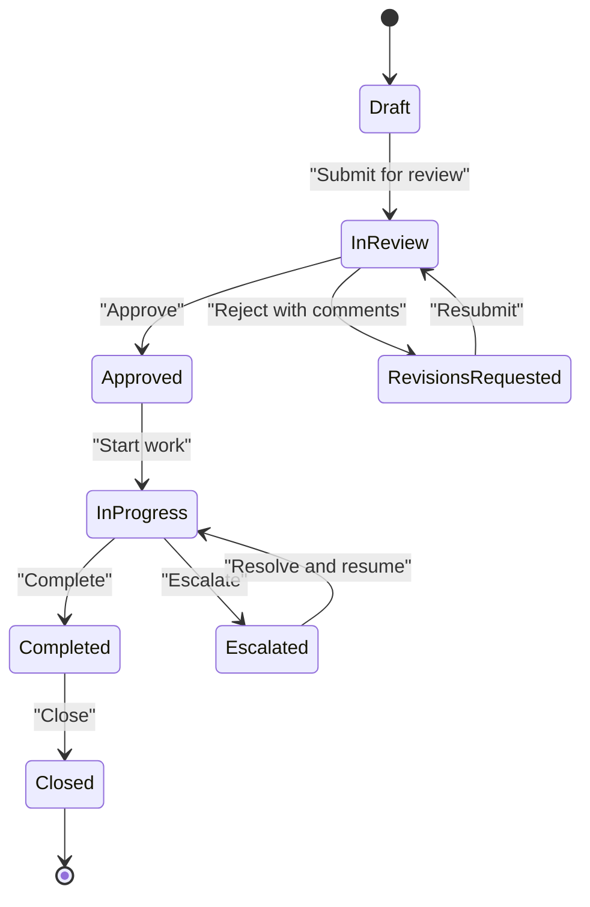

**Diagram sources**
- [approvals/workflow-engine.ts](file://src/approvals/workflow-engine.ts)

**Section sources**
- [approvals/workflow-engine.ts](file://src/approvals/workflow-engine.ts)

### Escalation Procedures
Escalation routes tasks to higher-level reviewers or managers based on thresholds such as age, SLA breach, or repeated rejections.

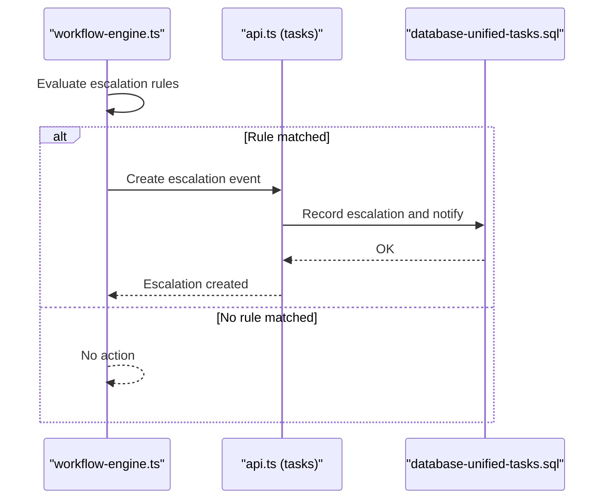

**Diagram sources**
- [approvals/workflow-engine.ts](file://src/approvals/workflow-engine.ts)
- [api.ts (tasks)](file://src/api.ts)
- [database-unified-tasks.sql](file://src/database-unified-tasks.sql)

**Section sources**
- [approvals/workflow-engine.ts](file://src/approvals/workflow-engine.ts)
- [api.ts (tasks)](file://src/api.ts)
- [database-unified-tasks.sql](file://src/database-unified-tasks.sql)

### Relationships: Tasks, Users, Teams, and Organizational Units
Tasks relate to users (assignees, creators, approvers), teams (group ownership), and organizational units (contextual scope). These relationships are enforced at the database level and surfaced in UI components.

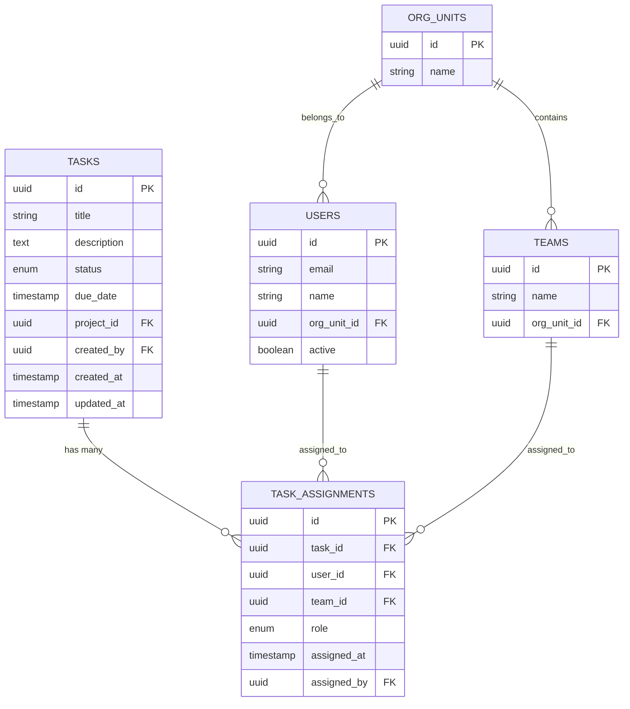

**Diagram sources**
- [database-unified-tasks.sql](file://src/database-unified-tasks.sql)
- [database-project-tasks.sql](file://src/database-project-tasks.sql)

**Section sources**
- [database-unified-tasks.sql](file://src/database-unified-tasks.sql)
- [database-project-tasks.sql](file://src/database-project-tasks.sql)

### Conflict Resolution for Multiple Assignees
When multiple users are assigned to the same task, the system should:
- Prevent conflicting primary owner unless explicitly allowed
- Provide a clear hierarchy (primary vs secondary)
- Surface notifications and audit trails
- Allow reassignment with reason tracking

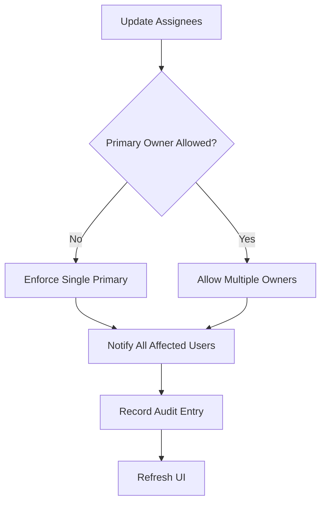

[No sources needed since this diagram shows conceptual workflow, not actual code structure]

### Delegation Patterns for Temporary Reassignment
Delegation allows a user to temporarily transfer responsibility to another user while preserving original ownership and auditability.

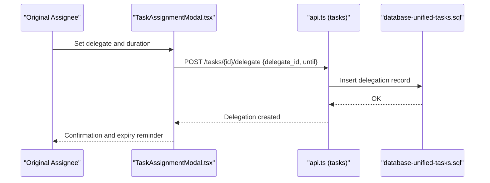

**Diagram sources**
- [components/tasks/TaskAssignmentModal.tsx](file://src/components/tasks/TaskAssignmentModal.tsx)
- [api.ts (tasks)](file://src/api.ts)
- [database-unified-tasks.sql](file://src/database-unified-tasks.sql)

**Section sources**
- [components/tasks/TaskAssignmentModal.tsx](file://src/components/tasks/TaskAssignmentModal.tsx)
- [api.ts (tasks)](file://src/api.ts)
- [database-unified-tasks.sql](file://src/database-unified-tasks.sql)

### Complex Assignment Scenarios
- Multi-skill matching: select assignees with required skills and lowest workload
- Team handover: reassign an entire team’s tasks to another team during transitions
- Conditional routing: route tasks based on project type, client tier, or region
- Time-bound delegation: auto-expire delegations and revert to original owner

[No sources needed since this section provides general guidance]

### Bulk Operations
Bulk operations allow updating multiple tasks at once:
- Reassign selected tasks to a user or team
- Change status in batches
- Apply tags or labels
- Trigger notifications and audit entries

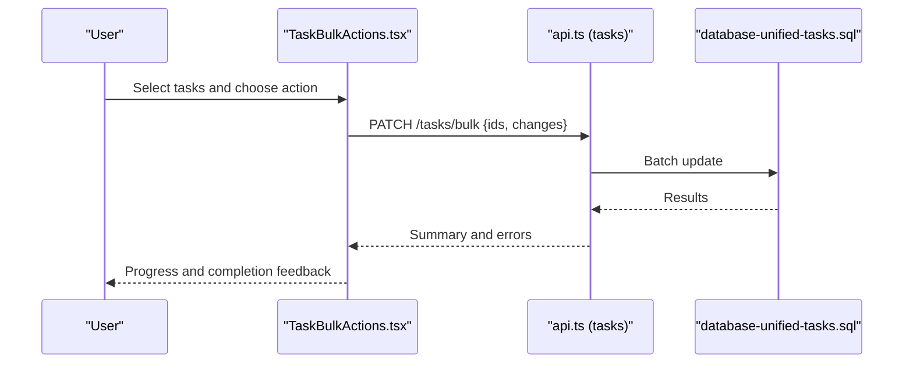

**Diagram sources**
- [components/tasks/TaskBulkActions.tsx](file://src/components/tasks/TaskBulkActions.tsx)
- [api.ts (tasks)](file://src/api.ts)
- [database-unified-tasks.sql](file://src/database-unified-tasks.sql)

**Section sources**
- [components/tasks/TaskBulkActions.tsx](file://src/components/tasks/TaskBulkActions.tsx)
- [api.ts (tasks)](file://src/api.ts)
- [database-unified-tasks.sql](file://src/database-unified-tasks.sql)

### Automated Task Routing
Automated routing integrates with workflow engines to evaluate conditions and assign tasks automatically upon creation or state change.

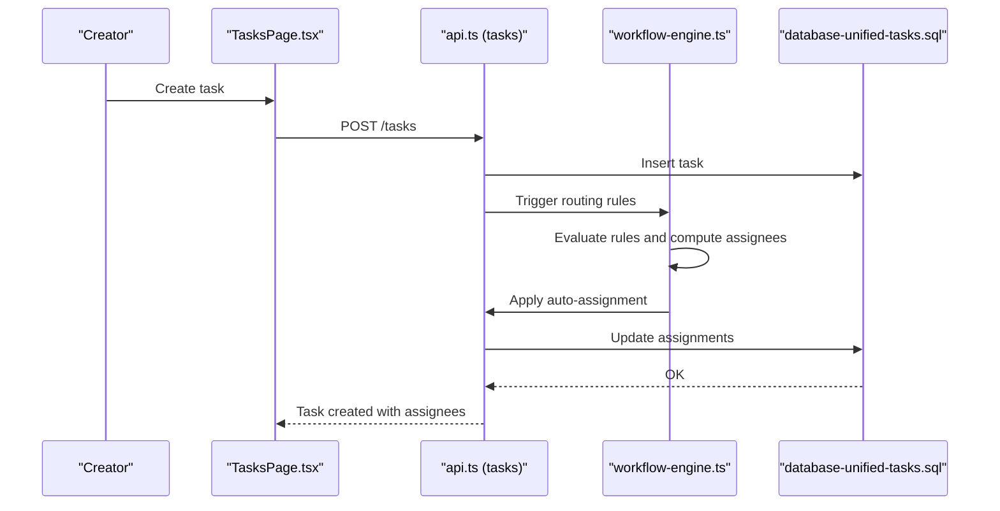

**Diagram sources**
- [TasksPage.tsx](file://src/pages/TasksPage.tsx)
- [api.ts (tasks)](file://src/api.ts)
- [approvals/workflow-engine.ts](file://src/approvals/workflow-engine.ts)
- [database-unified-tasks.sql](file://src/database-unified-tasks.sql)

**Section sources**
- [TasksPage.tsx](file://src/pages/TasksPage.tsx)
- [api.ts (tasks)](file://src/api.ts)
- [approvals/workflow-engine.ts](file://src/approvals/workflow-engine.ts)
- [database-unified-tasks.sql](file://src/database-unified-tasks.sql)

## Dependency Analysis
High-level dependencies among modules:

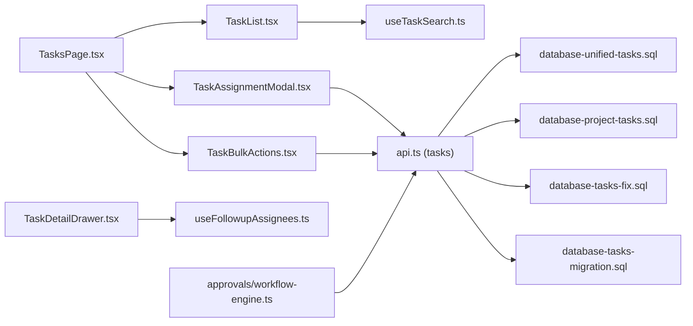

**Diagram sources**
- [TasksPage.tsx](file://src/pages/TasksPage.tsx)
- [components/tasks/TaskList.tsx](file://src/components/tasks/TaskList.tsx)
- [components/tasks/TaskDetailDrawer.tsx](file://src/components/tasks/TaskDetailDrawer.tsx)
- [components/tasks/TaskAssignmentModal.tsx](file://src/components/tasks/TaskAssignmentModal.tsx)
- [components/tasks/TaskBulkActions.tsx](file://src/components/tasks/TaskBulkActions.tsx)
- [useTaskSearch.ts](file://src/hooks/useTaskSearch.ts)
- [hooks/useFollowupAssignees.ts](file://src/hooks/useFollowupAssignees.ts)
- [api.ts (tasks)](file://src/api.ts)
- [database-unified-tasks.sql](file://src/database-unified-tasks.sql)
- [database-project-tasks.sql](file://src/database-project-tasks.sql)
- [database-tasks-fix.sql](file://src/database-tasks-fix.sql)
- [database-tasks-migration.sql](file://src/database-tasks-migration.sql)
- [approvals/workflow-engine.ts](file://src/approvals/workflow-engine.ts)

**Section sources**
- [TasksPage.tsx](file://src/pages/TasksPage.tsx)
- [components/tasks/TaskList.tsx](file://src/components/tasks/TaskList.tsx)
- [components/tasks/TaskDetailDrawer.tsx](file://src/components/tasks/TaskDetailDrawer.tsx)
- [components/tasks/TaskAssignmentModal.tsx](file://src/components/tasks/TaskAssignmentModal.tsx)
- [components/tasks/TaskBulkActions.tsx](file://src/components/tasks/TaskBulkActions.tsx)
- [useTaskSearch.ts](file://src/hooks/useTaskSearch.ts)
- [hooks/useFollowupAssignees.ts](file://src/hooks/useFollowupAssignees.ts)
- [api.ts (tasks)](file://src/api.ts)
- [database-unified-tasks.sql](file://src/database-unified-tasks.sql)
- [database-project-tasks.sql](file://src/database-project-tasks.sql)
- [database-tasks-fix.sql](file://src/database-tasks-fix.sql)
- [database-tasks-migration.sql](file://src/database-tasks-migration.sql)
- [approvals/workflow-engine.ts](file://src/approvals/workflow-engine.ts)

## Performance Considerations
- Use efficient queries and indexes for task search and filtering
- Implement optimistic UI updates for assignment changes to improve responsiveness
- Paginate large task lists and use virtualization where appropriate
- Cache assignee availability and workload metrics to reduce repeated computations
- Batch API calls for bulk operations to minimize network overhead

[No sources needed since this section provides general guidance]

## Troubleshooting Guide
Common issues and resolutions:
- Permission denied on assignment: verify user roles and org unit access
- Duplicate primary owners: ensure enforcement logic prevents conflicts
- Stale UI state after assignment: trigger refetch or optimistic update reconciliation
- Delegation not expiring: check automation jobs and cron triggers
- Bulk operation partial failures: inspect per-item error summaries and retry failed items

**Section sources**
- [components/tasks/TaskAssignmentModal.tsx](file://src/components/tasks/TaskAssignmentModal.tsx)
- [components/tasks/TaskBulkActions.tsx](file://src/components/tasks/TaskBulkActions.tsx)
- [api.ts (tasks)](file://src/api.ts)

## Conclusion
The task assignment system combines robust UI components, flexible hooks, and well-defined API and database layers to support manual and automated assignment, workload balancing, approvals, and escalations. Clear relationships between tasks, users, teams, and organizational units enable scalable workflows. With careful attention to conflict resolution, delegation, and performance, the system delivers reliable and responsive task management experiences.

## Appendices

### Data Model References
- Unified tasks schema and relationships
- Project-specific task extensions
- Task fixes and migrations

**Section sources**
- [database-unified-tasks.sql](file://src/database-unified-tasks.sql)
- [database-project-tasks.sql](file://src/database-project-tasks.sql)
- [database-tasks-fix.sql](file://src/database-tasks-fix.sql)
- [database-tasks-migration.sql](file://src/database-tasks-migration.sql)