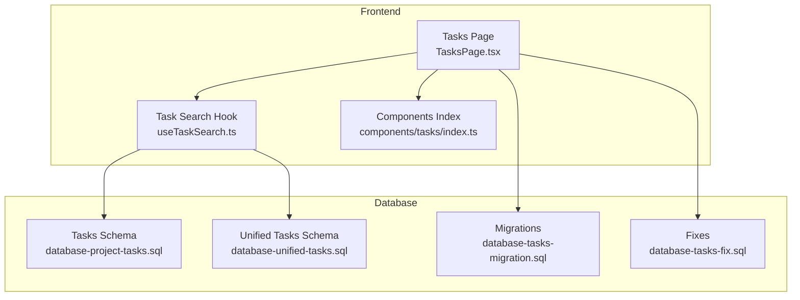
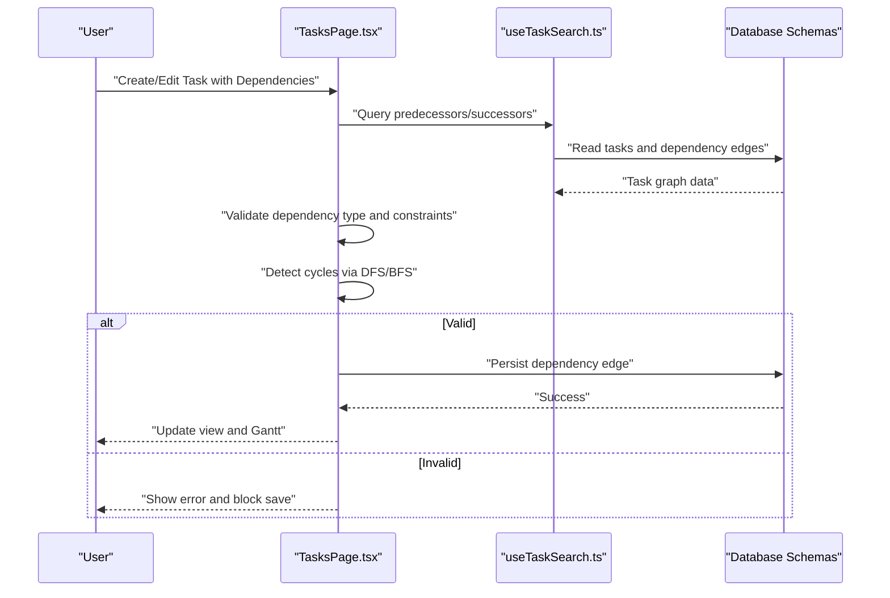
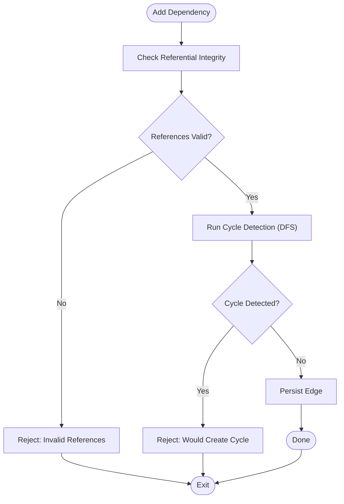
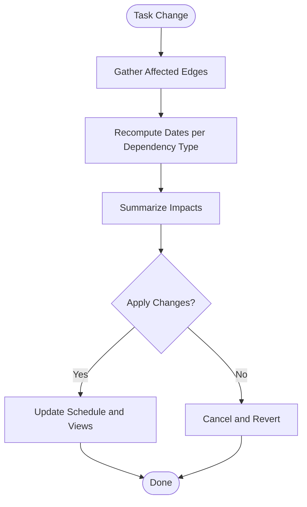
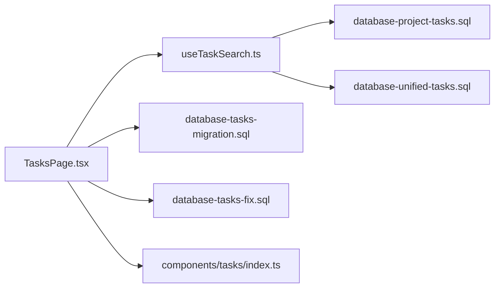

# Task Dependencies and Relationships

<cite>
**Referenced Files in This Document**
- [database-project-tasks.sql](file://src/database-project-tasks.sql)
- [database-unified-tasks.sql](file://src/database-unified-tasks.sql)
- [database-tasks-migration.sql](file://src/database-tasks-migration.sql)
- [database-tasks-fix.sql](file://src/database-tasks-fix.sql)
- [useTaskSearch.ts](file://src/hooks/useTaskSearch.ts)
- [TasksPage.tsx](file://src/pages/TasksPage.tsx)
- [components/tasks/index.ts](file://src/components/tasks/index.ts)
</cite>

## Table of Contents
1. [Introduction](#introduction)
2. [Project Structure](#project-structure)
3. [Core Components](#core-components)
4. [Architecture Overview](#architecture-overview)
5. [Detailed Component Analysis](#detailed-component-analysis)
6. [Dependency Analysis](#dependency-analysis)
7. [Performance Considerations](#performance-considerations)
8. [Troubleshooting Guide](#troubleshooting-guide)
9. [Conclusion](#conclusion)
10. [Appendices](#appendices)

## Introduction
This document explains how task dependencies and relationships are modeled, validated, and visualized in the application. It covers dependency types (finish-to-start, start-to-start, finish-to-finish, start-to-finish), subtask hierarchies, parent-child relationships, cross-project linking, validation rules, circular dependency detection, impact analysis, conflict management, Gantt visualization, and performance strategies for large graphs and real-time updates.

## Project Structure
The task dependency feature spans database schema definitions, migration scripts, UI pages, hooks, and component exports:
- Database schemas define tasks, dependencies, and hierarchy fields.
- Migration scripts evolve the schema to support dependency types and constraints.
- The Tasks page provides the user interface for managing tasks and dependencies.
- Hooks provide search and data access utilities used by the UI.
- Component index centralizes task-related UI components.

**Diagram sources**
- [database-project-tasks.sql](file://src/database-project-tasks.sql)
- [database-unified-tasks.sql](file://src/database-unified-tasks.sql)
- [database-tasks-migration.sql](file://src/database-tasks-migration.sql)
- [database-tasks-fix.sql](file://src/database-tasks-fix.sql)
- [TasksPage.tsx](file://src/pages/TasksPage.tsx)
- [useTaskSearch.ts](file://src/hooks/useTaskSearch.ts)
- [components/tasks/index.ts](file://src/components/tasks/index.ts)

**Section sources**
- [database-project-tasks.sql](file://src/database-project-tasks.sql)
- [database-unified-tasks.sql](file://src/database-unified-tasks.sql)
- [database-tasks-migration.sql](file://src/database-tasks-migration.sql)
- [database-tasks-fix.sql](file://src/database-tasks-fix.sql)
- [TasksPage.tsx](file://src/pages/TasksPage.tsx)
- [useTaskSearch.ts](file://src/hooks/useTaskSearch.ts)
- [components/tasks/index.ts](file://src/components/tasks/index.ts)

## Core Components
- Tasks model with hierarchical fields (parent_id) and optional project scoping.
- Dependency edges between tasks supporting multiple relationship types.
- Validation layer ensuring referential integrity and preventing cycles.
- UI surface for creating, editing, and visualizing dependencies.
- Search and filtering hook to efficiently query dependent and predecessor tasks.

Key responsibilities:
- Persist dependency metadata and enforce constraints at the database level where possible.
- Provide client-side checks for cycle prevention before persistence.
- Expose APIs/hook methods to compute successors/predecessors and impacted tasks.
- Render dependency networks and integrate with Gantt views.

**Section sources**
- [database-project-tasks.sql](file://src/database-project-tasks.sql)
- [database-unified-tasks.sql](file://src/database-unified-tasks.sql)
- [database-tasks-migration.sql](file://src/database-tasks-migration.sql)
- [database-tasks-fix.sql](file://src/database-tasks-fix.sql)
- [useTaskSearch.ts](file://src/hooks/useTaskSearch.ts)
- [TasksPage.tsx](file://src/pages/TasksPage.tsx)
- [components/tasks/index.ts](file://src/components/tasks/index.ts)

## Architecture Overview
The system separates concerns across layers:
- Data Layer: SQL schemas and migrations define tasks, dependencies, and constraints.
- Service/Logic Layer: Client logic validates relationships, detects cycles, and computes impacts.
- Presentation Layer: Tasks page and components render dependency graphs and Gantt charts.

**Diagram sources**
- [TasksPage.tsx](file://src/pages/TasksPage.tsx)
- [useTaskSearch.ts](file://src/hooks/useTaskSearch.ts)
- [database-project-tasks.sql](file://src/database-project-tasks.sql)
- [database-unified-tasks.sql](file://src/database-unified-tasks.sql)

## Detailed Component Analysis

### Dependency Types and Semantics
Supported dependency types:
- Finish-to-Start (FS): Successor cannot start until predecessor finishes.
- Start-to-Start (SS): Successor cannot start until predecessor starts.
- Finish-to-Finish (FF): Successor cannot finish until predecessor finishes.
- Start-to-Finish (SF): Successor cannot finish until predecessor starts.

Implementation considerations:
- Store dependency type explicitly on the edge.
- Enforce temporal constraints during scheduling and validation.
- Use these semantics to compute earliest start/finish dates and critical path.

**Section sources**
- [database-project-tasks.sql](file://src/database-project-tasks.sql)
- [database-unified-tasks.sql](file://src/database-unified-tasks.sql)

### Subtask Hierarchies and Parent-Child Relationships
- Tasks include a parent_id field to represent hierarchical decomposition.
- Children inherit or roll up certain attributes (e.g., progress, status) depending on business rules.
- Cross-level navigation allows drilling from parent to children and vice versa.

Operational rules:
- Prevent self-parenting and ensure parent exists.
- Maintain consistent ordering within levels if required.
- Support collapsing/expanding trees in UI.

**Section sources**
- [database-project-tasks.sql](file://src/database-project-tasks.sql)
- [database-unified-tasks.sql](file://src/database-unified-tasks.sql)

### Cross-Project Task Linking
- Allow dependencies that span projects when permitted by policy.
- Validate cross-project links against permissions and visibility rules.
- Surface cross-project impacts in dashboards and reports.

**Section sources**
- [database-unified-tasks.sql](file://src/database-unified-tasks.sql)

### Dependency Validation Rules
- Referential integrity: both source and target tasks must exist.
- Type-specific constraints: e.g., FS requires valid date windows; SS/FF/SF require alignment checks.
- No duplicate edges between the same pair with the same type.
- Optional lag/lead offsets must be non-negative unless explicitly allowed.

**Section sources**
- [database-tasks-migration.sql](file://src/database-tasks-migration.sql)
- [database-tasks-fix.sql](file://src/database-tasks-fix.sql)

### Circular Dependency Detection
- Perform cycle detection before persisting new edges.
- Use depth-first search or topological sort to detect back edges.
- Block creation/update if a cycle would be introduced.

**Diagram sources**
- [TasksPage.tsx](file://src/pages/TasksPage.tsx)
- [useTaskSearch.ts](file://src/hooks/useTaskSearch.ts)

**Section sources**
- [TasksPage.tsx](file://src/pages/TasksPage.tsx)
- [useTaskSearch.ts](file://src/hooks/useTaskSearch.ts)

### Impact Analysis When Tasks Are Modified
- Identify all successors/predecessors affected by changes to duration, dates, or status.
- Recompute downstream schedules respecting dependency types.
- Present a summary of impacted tasks and proposed reschedules.

**Diagram sources**
- [TasksPage.tsx](file://src/pages/TasksPage.tsx)
- [useTaskSearch.ts](file://src/hooks/useTaskSearch.ts)

**Section sources**
- [TasksPage.tsx](file://src/pages/TasksPage.tsx)
- [useTaskSearch.ts](file://src/hooks/useTaskSearch.ts)

### Creating Complex Dependency Networks
- Build multi-layered networks using combinations of FS, SS, FF, SF.
- Introduce lags/leads to model realistic constraints.
- Validate incrementally to avoid introducing cycles early.

Best practices:
- Prefer FS for most sequencing; use SS/FF/SF sparingly and document rationale.
- Keep graphs acyclic and minimize long chains to reduce propagation cost.

**Section sources**
- [database-project-tasks.sql](file://src/database-project-tasks.sql)
- [database-unified-tasks.sql](file://src/database-unified-tasks.sql)

### Visualizing Task Relationships in Gantt Charts
- Render dependency arrows between bars based on computed dates.
- Highlight critical path and constrained tasks.
- Support zooming and filtering by project or hierarchy.

Integration points:
- Use computed schedule data from hooks/services.
- Bind dependency edges to chart elements for interactive inspection.

**Section sources**
- [TasksPage.tsx](file://src/pages/TasksPage.tsx)
- [useTaskSearch.ts](file://src/hooks/useTaskSearch.ts)

### Managing Dependency Conflicts
- Detect overlapping constraints (e.g., conflicting SS and FF).
- Resolve conflicts by adjusting lags/leads or reordering tasks.
- Provide guided suggestions and rollback options.

**Section sources**
- [database-tasks-migration.sql](file://src/database-tasks-migration.sql)
- [database-tasks-fix.sql](file://src/database-tasks-fix.sql)

## Dependency Analysis
Relationships among modules and files:
- UI depends on hooks for data retrieval and validation.
- Hooks depend on database schemas for structure and constraints.
- Migrations and fixes maintain schema evolution and correctness.

**Diagram sources**
- [TasksPage.tsx](file://src/pages/TasksPage.tsx)
- [useTaskSearch.ts](file://src/hooks/useTaskSearch.ts)
- [database-project-tasks.sql](file://src/database-project-tasks.sql)
- [database-unified-tasks.sql](file://src/database-unified-tasks.sql)
- [database-tasks-migration.sql](file://src/database-tasks-migration.sql)
- [database-tasks-fix.sql](file://src/database-tasks-fix.sql)
- [components/tasks/index.ts](file://src/components/tasks/index.ts)

**Section sources**
- [TasksPage.tsx](file://src/pages/TasksPage.tsx)
- [useTaskSearch.ts](file://src/hooks/useTaskSearch.ts)
- [database-project-tasks.sql](file://src/database-project-tasks.sql)
- [database-unified-tasks.sql](file://src/database-unified-tasks.sql)
- [database-tasks-migration.sql](file://src/database-tasks-migration.sql)
- [database-tasks-fix.sql](file://src/database-tasks-fix.sql)
- [components/tasks/index.ts](file://src/components/tasks/index.ts)

## Performance Considerations
- Graph algorithms:
  - Use adjacency lists for O(V+E) traversal.
  - Cache successor/predecessor sets per task to avoid recomputation.
- Query optimization:
  - Fetch only relevant subgraphs for a given task context.
  - Paginate or virtualize large dependency lists in UI.
- Real-time updates:
  - Debounce rapid edits and batch updates.
  - Use optimistic UI with rollback on failure.
- Scheduling:
  - Incremental recalculation of impacted tasks rather than full re-schedule.
  - Limit propagation depth for very large graphs.

[No sources needed since this section provides general guidance]

## Troubleshooting Guide
Common issues and resolutions:
- Cycle detected: Review newly added edges and remove or reorder to break the loop.
- Invalid references: Ensure both source and target tasks exist and are visible.
- Duplicate edges: Remove redundant edges with the same type.
- Constraint violations: Adjust lags/leads or dependency types to satisfy business rules.

Diagnostic steps:
- Inspect dependency edges for the affected tasks.
- Run cycle detection locally before saving.
- Validate referential integrity and permission scopes.

**Section sources**
- [database-tasks-migration.sql](file://src/database-tasks-migration.sql)
- [database-tasks-fix.sql](file://src/database-tasks-fix.sql)
- [TasksPage.tsx](file://src/pages/TasksPage.tsx)
- [useTaskSearch.ts](file://src/hooks/useTaskSearch.ts)

## Conclusion
The task dependency system models rich relationships across tasks and projects, enforces robust validation, and supports visualization and impact analysis. By combining clear schema design, strong validation, efficient algorithms, and responsive UI, it enables reliable planning and execution even in complex environments.

[No sources needed since this section summarizes without analyzing specific files]

## Appendices

### Example Workflows

#### Creating a Finish-to-Start Network
- Define tasks A, B, C.
- Add FS edges: A→B, B→C.
- Validate and persist; verify earliest start/finish propagation.

#### Adding Lag/Lead to Start-to-Start
- Create SS edge with positive lag to delay successor start relative to predecessor start.
- Validate constraint and update schedule.

#### Resolving a Conflict Between SS and FF
- Detect overlapping constraints.
- Adjust lag/lead or change one edge type to resolve.

[No sources needed since this section provides conceptual examples]