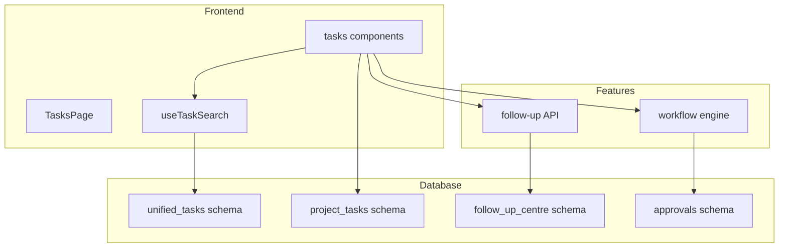
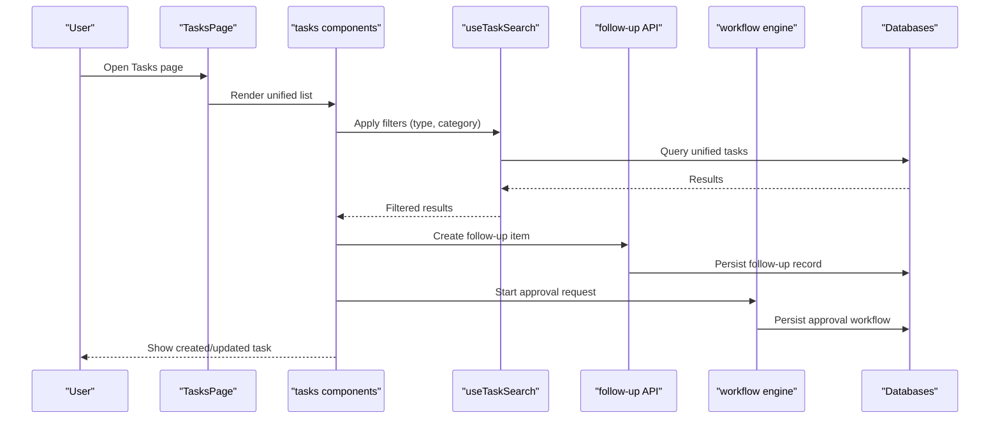
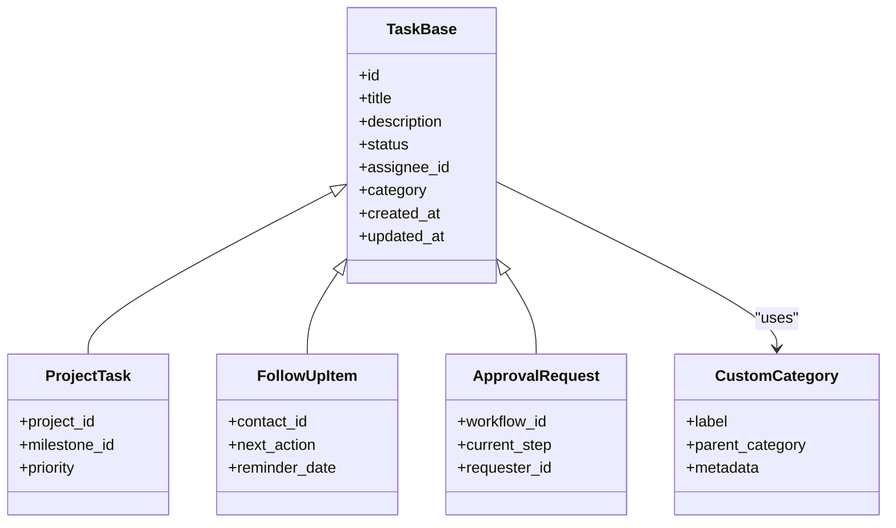
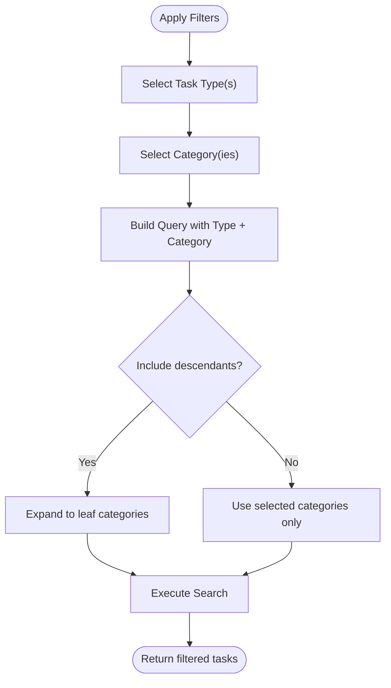
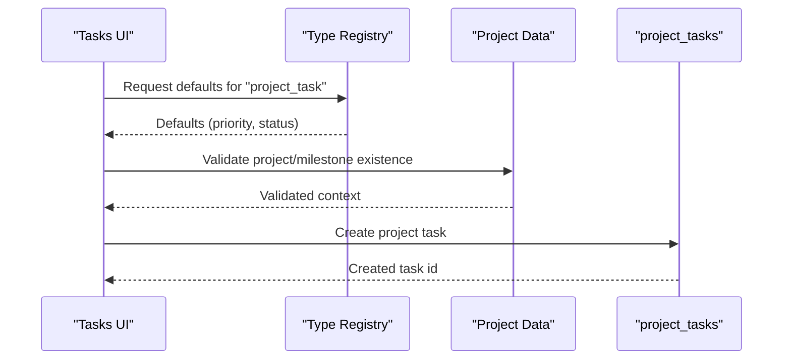
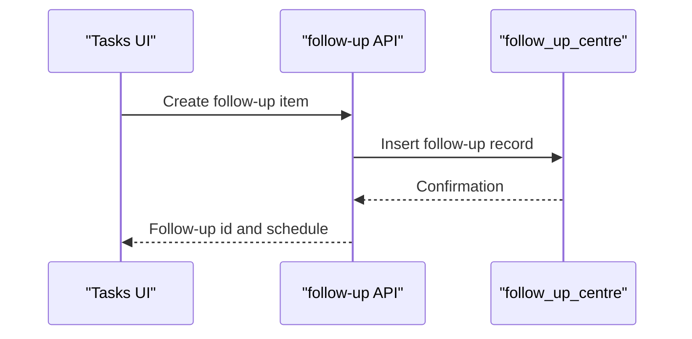
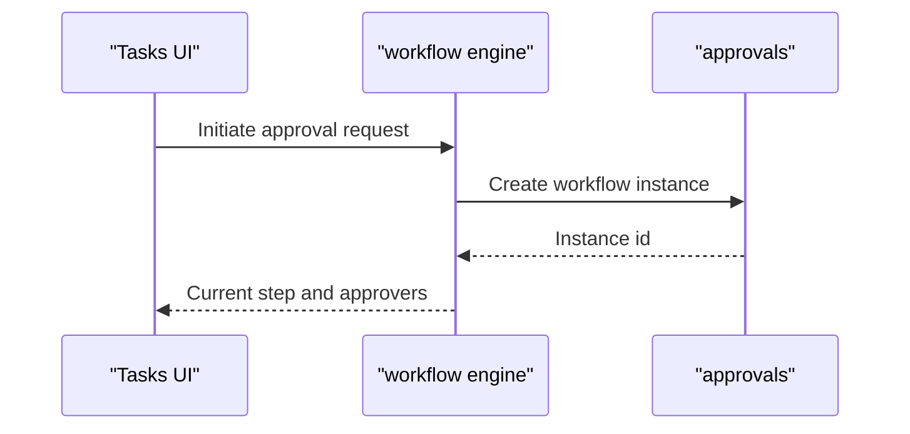
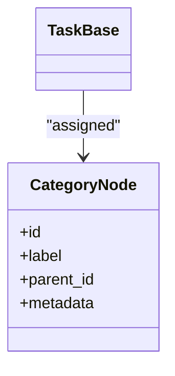
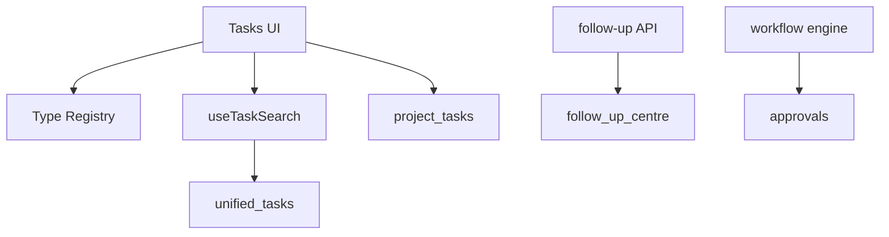

# Task Types and Categories

<cite>
**Referenced Files in This Document**
- [database-unified-tasks.sql](file://src/database-unified-tasks.sql)
- [database-project-tasks.sql](file://src/database-project-tasks.sql)
- [database-follow-up-centre.sql](file://src/database-follow-up-centre.sql)
- [database-approvals.sql](file://src/database-approvals.sql)
- [components/tasks/index.tsx](file://src/components/tasks/index.tsx)
- [components/tasks/types.ts](file://src/components/tasks/types.ts)
- [hooks/useTaskSearch.ts](file://src/hooks/useTaskSearch.ts)
- [pages/TasksPage.tsx](file://src/pages/TasksPage.tsx)
- [follow-up/api.ts](file://src/follow-up/api.ts)
- [approvals/workflow-engine.ts](file://src/approvals/workflow-engine.ts)
- [lib/followup/index.ts](file://src/lib/followup/index.ts)
</cite>

## Table of Contents
1. [Introduction](#introduction)
2. [Project Structure](#project-structure)
3. [Core Components](#core-components)
4. [Architecture Overview](#architecture-overview)
5. [Detailed Component Analysis](#detailed-component-analysis)
6. [Dependency Analysis](#dependency-analysis)
7. [Performance Considerations](#performance-considerations)
8. [Troubleshooting Guide](#troubleshooting-guide)
9. [Conclusion](#conclusion)
10. [Appendices](#appendices)

## Introduction
This document explains the unified task management system’s task types and categories. It covers supported task types (project tasks, follow-up items, approval requests, and custom categories), type hierarchies and inheritance patterns, category-based filtering, configuration options (default properties, validation rules, workflow associations), examples for creating and assigning tasks, and migration strategies with backward compatibility considerations.

## Project Structure
The task system is implemented across database schemas, UI components, hooks, and feature modules:
- Database schemas define core entities and relationships for tasks, project tasks, follow-ups, and approvals.
- UI components provide a unified interface to create, view, and manage tasks.
- Hooks encapsulate search and filtering logic.
- Feature modules integrate with approvals workflows and follow-up APIs.

**Diagram sources**
- [database-unified-tasks.sql](file://src/database-unified-tasks.sql)
- [database-project-tasks.sql](file://src/database-project-tasks.sql)
- [database-follow-up-centre.sql](file://src/database-follow-up-centre.sql)
- [database-approvals.sql](file://src/database-approvals.sql)
- [components/tasks/index.tsx](file://src/components/tasks/index.tsx)
- [hooks/useTaskSearch.ts](file://src/hooks/useTaskSearch.ts)
- [pages/TasksPage.tsx](file://src/pages/TasksPage.tsx)
- [follow-up/api.ts](file://src/follow-up/api.ts)
- [approvals/workflow-engine.ts](file://src/approvals/workflow-engine.ts)

**Section sources**
- [database-unified-tasks.sql](file://src/database-unified-tasks.sql)
- [database-project-tasks.sql](file://src/database-project-tasks.sql)
- [database-follow-up-centre.sql](file://src/database-follow-up-centre.sql)
- [database-approvals.sql](file://src/database-approvals.sql)
- [components/tasks/index.tsx](file://src/components/tasks/index.tsx)
- [hooks/useTaskSearch.ts](file://src/hooks/useTaskSearch.ts)
- [pages/TasksPage.tsx](file://src/pages/TasksPage.tsx)
- [follow-up/api.ts](file://src/follow-up/api.ts)
- [approvals/workflow-engine.ts](file://src/approvals/workflow-engine.ts)

## Core Components
- Unified task model: A central entity that normalizes different task kinds behind a common interface.
- Type registry: A mapping from task type identifiers to their metadata, default properties, and behavior hooks.
- Category taxonomy: A hierarchical set of categories used for grouping and filtering tasks.
- Search and filter layer: Encapsulates query building and client-side filtering by type and category.
- Integration points: Follow-up and approvals modules plug into the unified task surface via shared IDs or references.

Key responsibilities:
- Normalize creation and updates across task types.
- Provide consistent validation and defaults per type.
- Enable category-based filtering and reporting.
- Maintain backward compatibility during migrations.

**Section sources**
- [components/tasks/types.ts](file://src/components/tasks/types.ts)
- [hooks/useTaskSearch.ts](file://src/hooks/useTaskSearch.ts)
- [components/tasks/index.tsx](file://src/components/tasks/index.tsx)

## Architecture Overview
The unified task system exposes a single entry point for task operations while delegating type-specific logic to registries and integrations.

**Diagram sources**
- [pages/TasksPage.tsx](file://src/pages/TasksPage.tsx)
- [components/tasks/index.tsx](file://src/components/tasks/index.tsx)
- [hooks/useTaskSearch.ts](file://src/hooks/useTaskSearch.ts)
- [follow-up/api.ts](file://src/follow-up/api.ts)
- [approvals/workflow-engine.ts](file://src/approvals/workflow-engine.ts)
- [database-unified-tasks.sql](file://src/database-unified-tasks.sql)

## Detailed Component Analysis

### Unified Task Model and Type Registry
- Purpose: Define a common shape for all tasks and map type identifiers to behaviors.
- Key concepts:
  - Base task fields shared across all types.
  - Type-specific extension fields stored in a typed payload.
  - Default property templates per type.
  - Validation rules per type.
  - Workflow association metadata.

**Diagram sources**
- [components/tasks/types.ts](file://src/components/tasks/types.ts)
- [database-unified-tasks.sql](file://src/database-unified-tasks.sql)

**Section sources**
- [components/tasks/types.ts](file://src/components/tasks/types.ts)
- [database-unified-tasks.sql](file://src/database-unified-tasks.sql)

### Category Taxonomy and Filtering
- Hierarchical categories support parent-child relationships.
- Filtering supports exact match, ancestor traversal, and multi-select.
- Category metadata can drive default properties and validation hints.

**Diagram sources**
- [hooks/useTaskSearch.ts](file://src/hooks/useTaskSearch.ts)
- [database-unified-tasks.sql](file://src/database-unified-tasks.sql)

**Section sources**
- [hooks/useTaskSearch.ts](file://src/hooks/useTaskSearch.ts)
- [database-unified-tasks.sql](file://src/database-unified-tasks.sql)

### Project Tasks
- Characteristics: Linked to projects and milestones; may include priority and due dates.
- Configuration: Defaults inherited from project settings; validation enforces required project linkage.
- Workflow: Optional association with project milestone completion gates.

**Diagram sources**
- [database-project-tasks.sql](file://src/database-project-tasks.sql)
- [components/tasks/index.tsx](file://src/components/tasks/index.tsx)

**Section sources**
- [database-project-tasks.sql](file://src/database-project-tasks.sql)
- [components/tasks/index.tsx](file://src/components/tasks/index.tsx)

### Follow-Up Items
- Characteristics: Action-oriented reminders tied to contacts or entities.
- Configuration: Default next action text, reminder cadence, and assignees.
- Integration: Follow-up API provides creation and scheduling helpers.

**Diagram sources**
- [follow-up/api.ts](file://src/follow-up/api.ts)
- [database-follow-up-centre.sql](file://src/database-follow-up-centre.sql)

**Section sources**
- [follow-up/api.ts](file://src/follow-up/api.ts)
- [database-follow-up-centre.sql](file://src/database-follow-up-centre.sql)

### Approval Requests
- Characteristics: Workflow-driven approvals with steps and roles.
- Configuration: Workflow template selection, step validators, and escalation rules.
- Integration: Workflow engine manages transitions and notifications.

**Diagram sources**
- [approvals/workflow-engine.ts](file://src/approvals/workflow-engine.ts)
- [database-approvals.sql](file://src/database-approvals.sql)

**Section sources**
- [approvals/workflow-engine.ts](file://src/approvals/workflow-engine.ts)
- [database-approvals.sql](file://src/database-approvals.sql)

### Custom Task Categories
- Characteristics: Extensible categories with labels, parent categories, and metadata.
- Usage: Drive default properties, validation rules, and UI rendering hints.
- Example: “Compliance”, “Finance”, “Operations” with nested subcategories.

**Diagram sources**
- [database-unified-tasks.sql](file://src/database-unified-tasks.sql)
- [components/tasks/types.ts](file://src/components/tasks/types.ts)

**Section sources**
- [database-unified-tasks.sql](file://src/database-unified-tasks.sql)
- [components/tasks/types.ts](file://src/components/tasks/types.ts)

### Creating Different Task Types
- Steps:
  - Choose task type from the registry.
  - Load defaults and validation rules.
  - Fill required fields and optional metadata.
  - Submit through the unified task endpoint.
- Examples:
  - Create a project task linked to a project and milestone.
  - Create a follow-up item with a reminder date.
  - Start an approval request using a workflow template.

**Section sources**
- [components/tasks/index.tsx](file://src/components/tasks/index.tsx)
- [hooks/useTaskSearch.ts](file://src/hooks/useTaskSearch.ts)

### Assigning Categories
- Steps:
  - Select one or more categories.
  - Optionally expand to include descendant categories.
  - Save and verify filtering behavior.

**Section sources**
- [hooks/useTaskSearch.ts](file://src/hooks/useTaskSearch.ts)
- [database-unified-tasks.sql](file://src/database-unified-tasks.sql)

### Implementing Type-Specific Behaviors
- Patterns:
  - Extend base task fields with type-specific payloads.
  - Register validation functions per type.
  - Attach workflow associations where applicable.
- Best practices:
  - Keep shared logic in the registry.
  - Isolate integrations (follow-up, approvals) behind adapters.

**Section sources**
- [components/tasks/types.ts](file://src/components/tasks/types.ts)
- [lib/followup/index.ts](file://src/lib/followup/index.ts)

## Dependency Analysis
- Frontend dependencies:
  - Tasks UI depends on the type registry and search hook.
  - Follow-up and approvals features depend on their respective APIs and databases.
- Database dependencies:
  - Unified tasks reference categories and may link to project tasks, follow-ups, and approvals via foreign keys or normalized IDs.

**Diagram sources**
- [components/tasks/index.tsx](file://src/components/tasks/index.tsx)
- [hooks/useTaskSearch.ts](file://src/hooks/useTaskSearch.ts)
- [follow-up/api.ts](file://src/follow-up/api.ts)
- [approvals/workflow-engine.ts](file://src/approvals/workflow-engine.ts)
- [database-unified-tasks.sql](file://src/database-unified-tasks.sql)
- [database-project-tasks.sql](file://src/database-project-tasks.sql)
- [database-follow-up-centre.sql](file://src/database-follow-up-centre.sql)
- [database-approvals.sql](file://src/database-approvals.sql)

**Section sources**
- [components/tasks/index.tsx](file://src/components/tasks/index.tsx)
- [hooks/useTaskSearch.ts](file://src/hooks/useTaskSearch.ts)
- [follow-up/api.ts](file://src/follow-up/api.ts)
- [approvals/workflow-engine.ts](file://src/approvals/workflow-engine.ts)
- [database-unified-tasks.sql](file://src/database-unified-tasks.sql)
- [database-project-tasks.sql](file://src/database-project-tasks.sql)
- [database-follow-up-centre.sql](file://src/database-follow-up-centre.sql)
- [database-approvals.sql](file://src/database-approvals.sql)

## Performance Considerations
- Indexing: Ensure indexes on frequently filtered columns such as type, category, assignee, and status.
- Pagination: Use server-side pagination for large task lists.
- Caching: Cache category trees and type registry metadata at startup.
- Query optimization: Prefer joins over multiple round-trips when retrieving related data.

[No sources needed since this section provides general guidance]

## Troubleshooting Guide
- Common issues:
  - Missing required fields for specific task types.
  - Invalid category selections causing empty results.
  - Workflow initiation failures due to missing templates or permissions.
- Diagnostics:
  - Inspect validation errors returned by the type registry.
  - Verify category hierarchy expansion logic.
  - Check workflow engine logs for step transitions.

**Section sources**
- [components/tasks/types.ts](file://src/components/tasks/types.ts)
- [hooks/useTaskSearch.ts](file://src/hooks/useTaskSearch.ts)
- [approvals/workflow-engine.ts](file://src/approvals/workflow-engine.ts)

## Conclusion
The unified task system standardizes diverse task types under a common interface while preserving type-specific behaviors through a registry and integrations. Categories enable flexible grouping and filtering, and the architecture supports extensibility for new task types and workflows. Migrations should maintain backward compatibility by preserving existing IDs and providing default mappings.

[No sources needed since this section summarizes without analyzing specific files]

## Appendices

### Migration Strategies and Backward Compatibility
- Preserve legacy IDs: Map old identifiers to unified task IDs during migration.
- Default mappings: Provide sensible defaults for new required fields.
- Gradual rollout: Introduce new types and categories incrementally with feature flags.
- Rollback plan: Keep reverse migrations and data reconciliation scripts ready.

[No sources needed since this section provides general guidance]