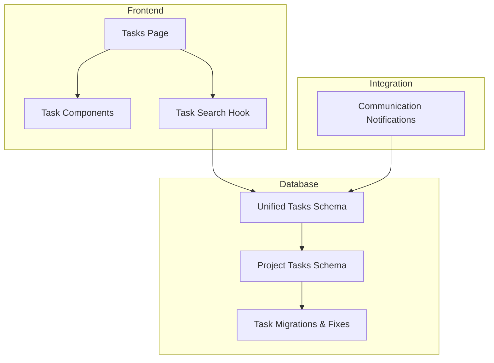
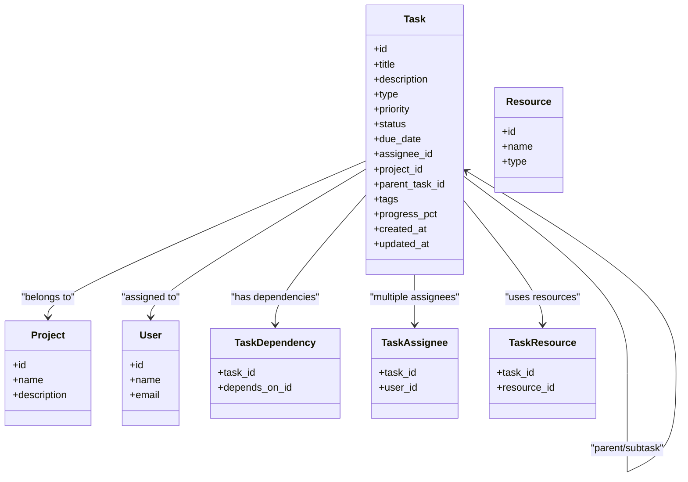
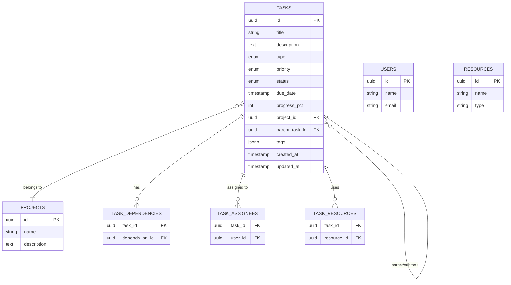
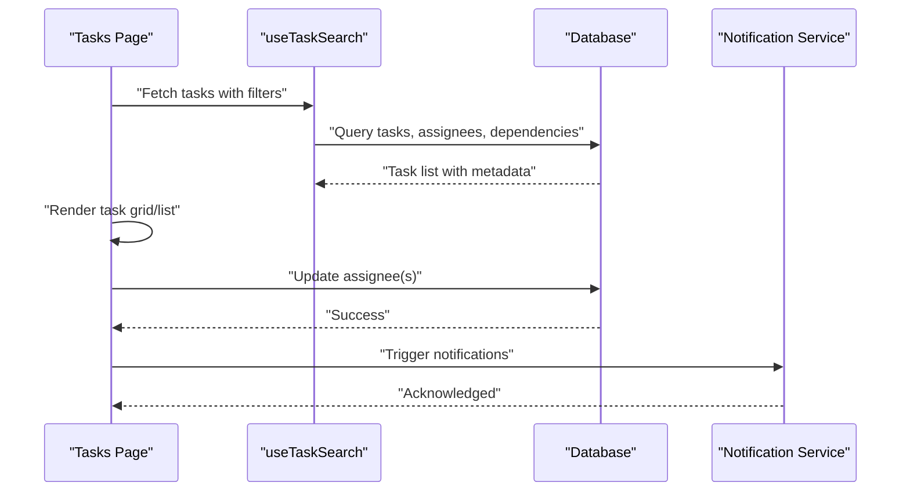
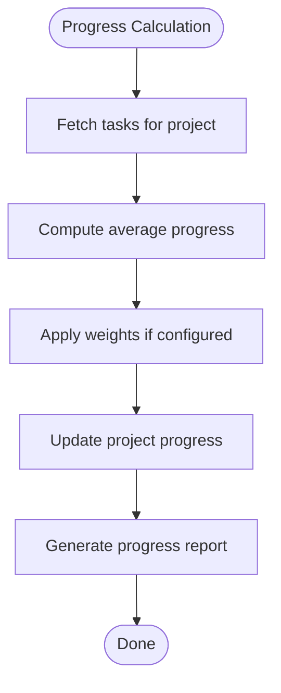
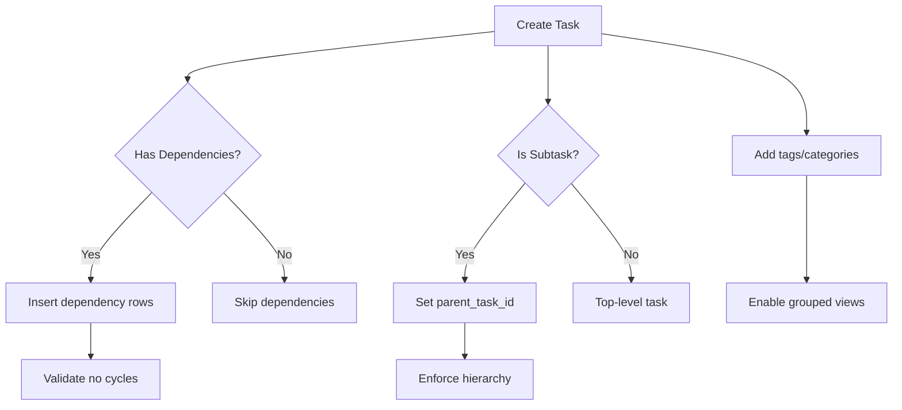
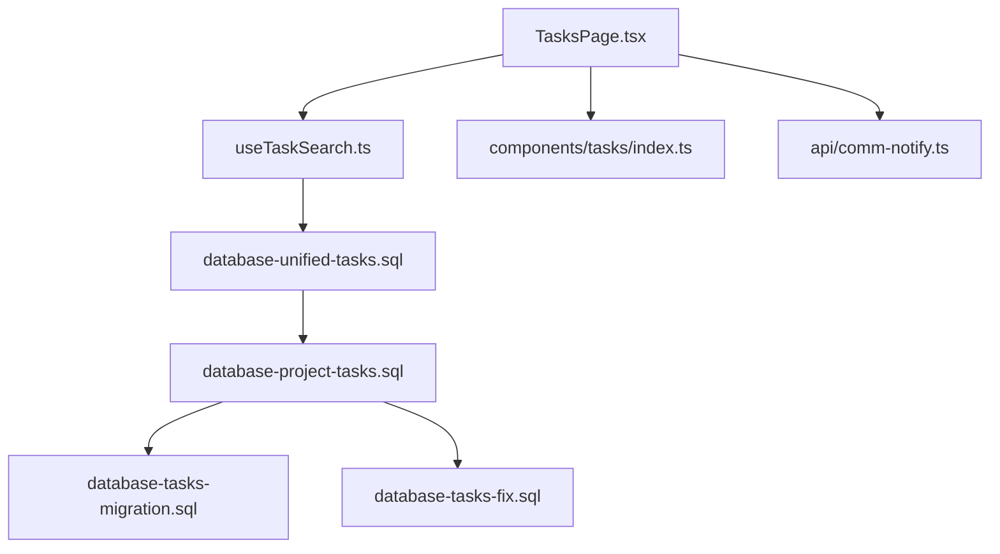

# Unified Task Management System

<cite>
**Referenced Files in This Document**
- [database-unified-tasks.sql](file://src/database-unified-tasks.sql)
- [database-project-tasks.sql](file://src/database-project-tasks.sql)
- [database-tasks-migration.sql](file://src/database-tasks-migration.sql)
- [database-tasks-fix.sql](file://src/database-tasks-fix.sql)
- [useTaskSearch.ts](file://src/hooks/useTaskSearch.ts)
- [TasksPage.tsx](file://src/pages/TasksPage.tsx)
- [components/tasks/index.ts](file://src/components/tasks/index.ts)
- [api/comm-notify.ts](file://api/comm-notify.ts)
</cite>

## Table of Contents
1. [Introduction](#introduction)
2. [Project Structure](#project-structure)
3. [Core Components](#core-components)
4. [Architecture Overview](#architecture-overview)
5. [Detailed Component Analysis](#detailed-component-analysis)
6. [Dependency Analysis](#dependency-analysis)
7. [Performance Considerations](#performance-considerations)
8. [Troubleshooting Guide](#troubleshooting-guide)
9. [Conclusion](#conclusion)
10. [Appendices](#appendices)

## Introduction
This document provides a comprehensive data model and operational guide for the unified task management system. It explains how tasks are modeled, assigned, prioritized, and tracked across projects and users. It also covers task dependencies, subtasks, grouping mechanisms, assignment queries, progress tracking, workload distribution reports, validation rules, notification triggers, and performance optimization strategies for high-volume operations.

## Project Structure
The task management feature spans database schema definitions, UI pages, hooks for search and filtering, and notification utilities. The key areas include:
- Database schemas defining core entities and relationships
- UI entry points for task listing and management
- Hooks for querying and searching tasks
- Notification integration for task-related events

**Diagram sources**
- [database-unified-tasks.sql](file://src/database-unified-tasks.sql)
- [database-project-tasks.sql](file://src/database-project-tasks.sql)
- [database-tasks-migration.sql](file://src/database-tasks-migration.sql)
- [database-tasks-fix.sql](file://src/database-tasks-fix.sql)
- [TasksPage.tsx](file://src/pages/TasksPage.tsx)
- [components/tasks/index.ts](file://src/components/tasks/index.ts)
- [useTaskSearch.ts](file://src/hooks/useTaskSearch.ts)
- [api/comm-notify.ts](file://api/comm-notify.ts)

**Section sources**
- [database-unified-tasks.sql](file://src/database-unified-tasks.sql)
- [database-project-tasks.sql](file://src/database-project-tasks.sql)
- [database-tasks-migration.sql](file://src/database-tasks-migration.sql)
- [database-tasks-fix.sql](file://src/database-tasks-fix.sql)
- [TasksPage.tsx](file://src/pages/TasksPage.tsx)
- [components/tasks/index.ts](file://src/components/tasks/index.ts)
- [useTaskSearch.ts](file://src/hooks/useTaskSearch.ts)
- [api/comm-notify.ts](file://api/comm-notify.ts)

## Core Components
This section outlines the primary data entities and their relationships within the unified task management system.

- Task entity
  - Represents an individual unit of work with attributes such as title, description, type, priority, status, due date, assignee, project linkage, parent-child relationships, and metadata.
  - Supports categorization via task types and grouping via tags or categories.
  - Includes fields to track progress (e.g., completion percentage), timestamps (created, updated), and audit information.

- Project linkage
  - Tasks are associated with projects to provide context and enable project-level reporting and dashboards.
  - Projects may have multiple tasks; tasks belong to one project.

- User and assignees
  - Users are linked to tasks as assignees.
  - Multiple assignees can be supported through a join table or array field depending on implementation.
  - Ownership and collaboration are modeled by linking users to tasks.

- Resources
  - Optional resource allocation is modeled via references to resources (e.g., materials, equipment).
  - Resource usage can be tracked per task line item if needed.

- Dependencies and subtasks
  - Parent-child relationships allow hierarchical task structures (subtasks).
  - Dependency edges define precedence constraints between tasks.

- Priority levels and status tracking
  - Priority levels indicate urgency (e.g., low, medium, high, critical).
  - Status values represent lifecycle stages (e.g., open, in progress, blocked, completed, cancelled).

- Grouping mechanisms
  - Tags, categories, or labels group related tasks for filtering and reporting.
  - Milestones or phases can organize tasks into larger deliverables.

**Section sources**
- [database-unified-tasks.sql](file://src/database-unified-tasks.sql)
- [database-project-tasks.sql](file://src/database-project-tasks.sql)
- [database-tasks-migration.sql](file://src/database-tasks-migration.sql)
- [database-tasks-fix.sql](file://src/database-tasks-fix.sql)

## Architecture Overview
The architecture integrates database schemas with frontend components and hooks to provide a cohesive task management experience.

**Diagram sources**
- [database-unified-tasks.sql](file://src/database-unified-tasks.sql)
- [database-project-tasks.sql](file://src/database-project-tasks.sql)

## Detailed Component Analysis

### Data Model Entities and Relationships
This analysis maps the core entities and their relationships based on the database schemas.

**Diagram sources**
- [database-unified-tasks.sql](file://src/database-unified-tasks.sql)
- [database-project-tasks.sql](file://src/database-project-tasks.sql)

**Section sources**
- [database-unified-tasks.sql](file://src/database-unified-tasks.sql)
- [database-project-tasks.sql](file://src/database-project-tasks.sql)

### Task Types, Priorities, and Statuses
- Task types categorize work items (e.g., development, testing, documentation, support).
- Priority levels drive scheduling and attention (e.g., low, medium, high, critical).
- Status values reflect lifecycle progression (e.g., open, in progress, blocked, completed, cancelled).

These enumerations are defined in the schema and enforced at the database level to ensure consistency.

**Section sources**
- [database-unified-tasks.sql](file://src/database-unified-tasks.sql)

### Assignment Workflows
- Assignments link users to tasks via a dedicated join table to support multiple assignees.
- Ownership can be inferred from a primary assignee or derived from creation context.
- Reassignment workflows update the assignee records while preserving history.

**Diagram sources**
- [TasksPage.tsx](file://src/pages/TasksPage.tsx)
- [useTaskSearch.ts](file://src/hooks/useTaskSearch.ts)
- [database-unified-tasks.sql](file://src/database-unified-tasks.sql)
- [api/comm-notify.ts](file://api/comm-notify.ts)

**Section sources**
- [TasksPage.tsx](file://src/pages/TasksPage.tsx)
- [useTaskSearch.ts](file://src/hooks/useTaskSearch.ts)
- [database-unified-tasks.sql](file://src/database-unified-tasks.sql)
- [api/comm-notify.ts](file://api/comm-notify.ts)

### Progress Tracking and Reporting
- Progress is tracked via a percentage field on tasks.
- Aggregations compute project-level progress by averaging or weighting task progress.
- Reports summarize statuses, priorities, and overdue tasks.

[No sources needed since this diagram shows conceptual workflow, not actual code structure]

### Task Dependencies, Subtasks, and Grouping
- Dependencies enforce precedence using a dependency table.
- Subtasks are represented via parent-child links.
- Grouping uses tags/categories for flexible organization.

**Diagram sources**
- [database-unified-tasks.sql](file://src/database-unified-tasks.sql)

**Section sources**
- [database-unified-tasks.sql](file://src/database-unified-tasks.sql)

### Examples of Queries and Reports
- Assignment queries: Retrieve tasks assigned to a specific user, including project context and dependencies.
- Progress tracking: Summarize task statuses and compute overall project completion.
- Workload distribution: Count active tasks per user to balance assignments.

Example query patterns:
- List tasks by assignee and project with status and priority.
- Aggregate tasks by status for a given project.
- Count tasks per user to identify workload hotspots.

**Section sources**
- [useTaskSearch.ts](file://src/hooks/useTaskSearch.ts)
- [database-unified-tasks.sql](file://src/database-unified-tasks.sql)

### Validation Rules
- Required fields: title, project linkage, status defaults.
- Due date constraints: cannot be earlier than current date unless overridden.
- Dependency cycle detection: prevent circular dependencies.
- Assignee existence: ensure referenced users exist.
- Progress bounds: clamp percentage to valid range.

**Section sources**
- [database-unified-tasks.sql](file://src/database-unified-tasks.sql)
- [database-tasks-fix.sql](file://src/database-tasks-fix.sql)

### Notification Triggers
- New task creation notifies project stakeholders.
- Assignee changes trigger messages to both old and new assignees.
- Status transitions (e.g., to blocked or completed) notify relevant parties.
- Overdue reminders alert assignees and managers.

**Section sources**
- [api/comm-notify.ts](file://api/comm-notify.ts)
- [database-unified-tasks.sql](file://src/database-unified-tasks.sql)

## Dependency Analysis
This section visualizes how components depend on each other and where potential coupling exists.

**Diagram sources**
- [TasksPage.tsx](file://src/pages/TasksPage.tsx)
- [useTaskSearch.ts](file://src/hooks/useTaskSearch.ts)
- [database-unified-tasks.sql](file://src/database-unified-tasks.sql)
- [database-project-tasks.sql](file://src/database-project-tasks.sql)
- [database-tasks-migration.sql](file://src/database-tasks-migration.sql)
- [database-tasks-fix.sql](file://src/database-tasks-fix.sql)
- [components/tasks/index.ts](file://src/components/tasks/index.ts)
- [api/comm-notify.ts](file://api/comm-notify.ts)

**Section sources**
- [TasksPage.tsx](file://src/pages/TasksPage.tsx)
- [useTaskSearch.ts](file://src/hooks/useTaskSearch.ts)
- [database-unified-tasks.sql](file://src/database-unified-tasks.sql)
- [database-project-tasks.sql](file://src/database-project-tasks.sql)
- [database-tasks-migration.sql](file://src/database-tasks-migration.sql)
- [database-tasks-fix.sql](file://src/database-tasks-fix.sql)
- [components/tasks/index.ts](file://src/components/tasks/index.ts)
- [api/comm-notify.ts](file://api/comm-notify.ts)

## Performance Considerations
- Indexing: Ensure indexes on frequently filtered columns (assignee_id, project_id, status, due_date).
- Pagination: Implement server-side pagination for large task lists.
- Query optimization: Use selective joins and avoid fetching unnecessary fields.
- Caching: Cache read-heavy queries (e.g., task lists by project) with appropriate invalidation.
- Batch updates: For bulk reassignments or status changes, use batch operations to reduce round trips.
- Dependency checks: Perform cycle detection efficiently using graph algorithms and cache results.

[No sources needed since this section provides general guidance]

## Troubleshooting Guide
Common issues and resolutions:
- Missing assignees: Validate user IDs before assignment; handle foreign key violations.
- Orphaned tasks: Ensure project linkage exists; backfill missing project references.
- Duplicate dependencies: Enforce unique constraints on dependency pairs.
- Stale progress: Refresh aggregated project progress after task updates.
- Notification failures: Check notification service connectivity and retry logic.

**Section sources**
- [database-tasks-fix.sql](file://src/database-tasks-fix.sql)
- [api/comm-notify.ts](file://api/comm-notify.ts)

## Conclusion
The unified task management system provides a robust data model supporting diverse task types, clear assignment workflows, structured priorities, and comprehensive status tracking. With well-defined relationships to projects, users, and resources, it enables effective dependency management, subtask hierarchies, and grouping mechanisms. Operational features like assignment queries, progress tracking, and workload distribution reports empower teams to manage tasks efficiently. Validation rules and notification triggers enhance reliability and communication, while performance optimizations ensure scalability under high-volume conditions.

## Appendices

### Appendix A: Entity Definitions Summary
- Task: Core work item with attributes for type, priority, status, due date, assignees, project linkage, dependencies, subtasks, tags, and progress.
- Project: Container for tasks providing context and aggregation.
- User: Actor who can be assigned to tasks.
- Resource: Optional allocation linked to tasks.
- TaskDependency: Precedence constraints between tasks.
- TaskAssignee: Many-to-many relationship between tasks and users.
- TaskResource: Many-to-many relationship between tasks and resources.

**Section sources**
- [database-unified-tasks.sql](file://src/database-unified-tasks.sql)
- [database-project-tasks.sql](file://src/database-project-tasks.sql)