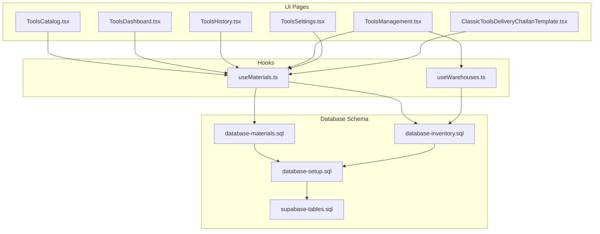
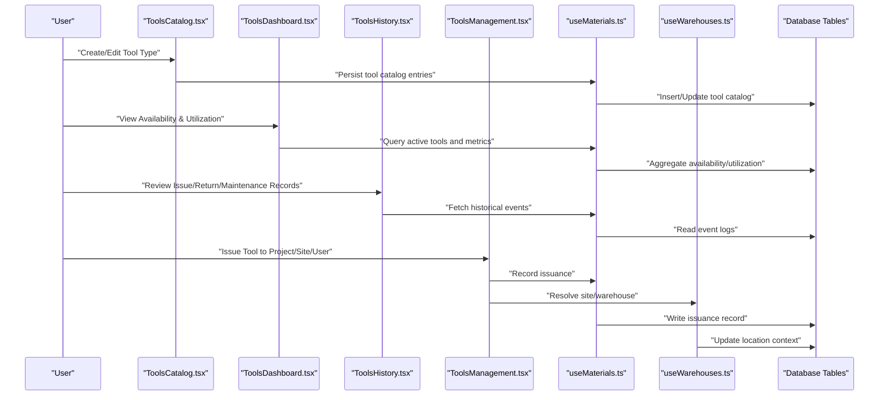
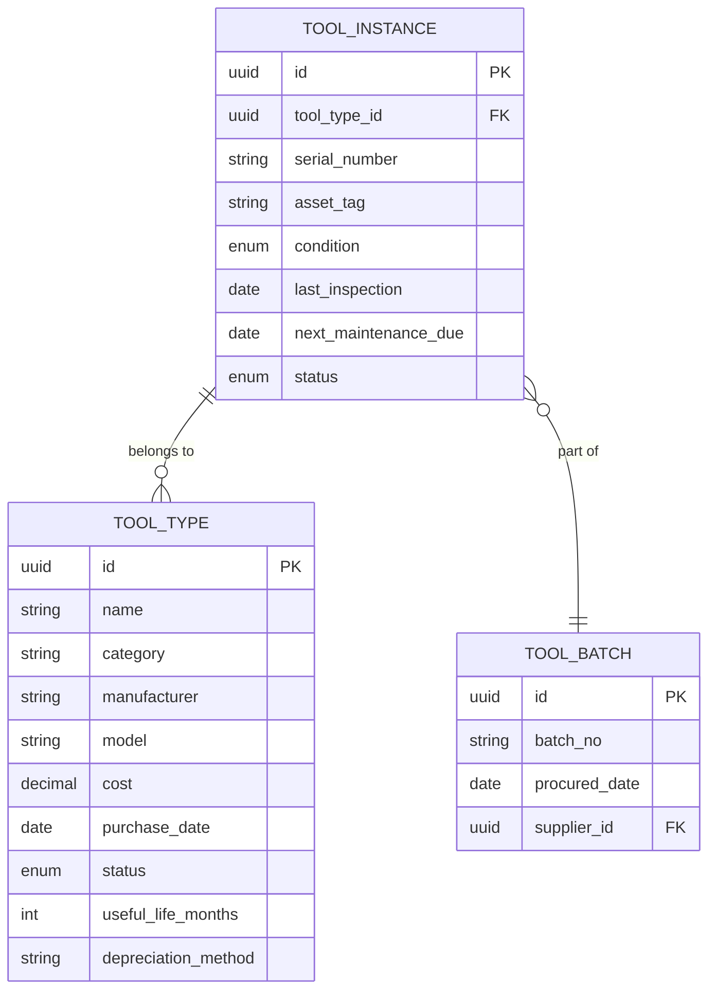
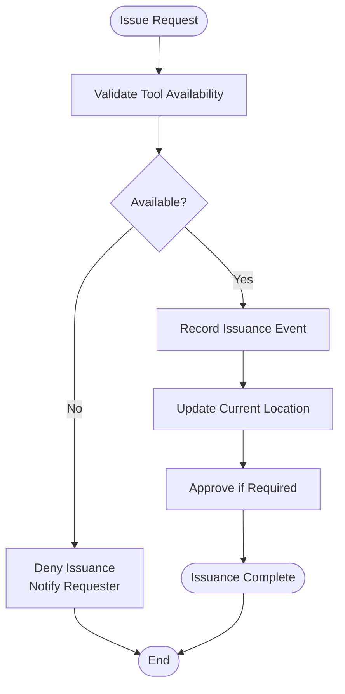
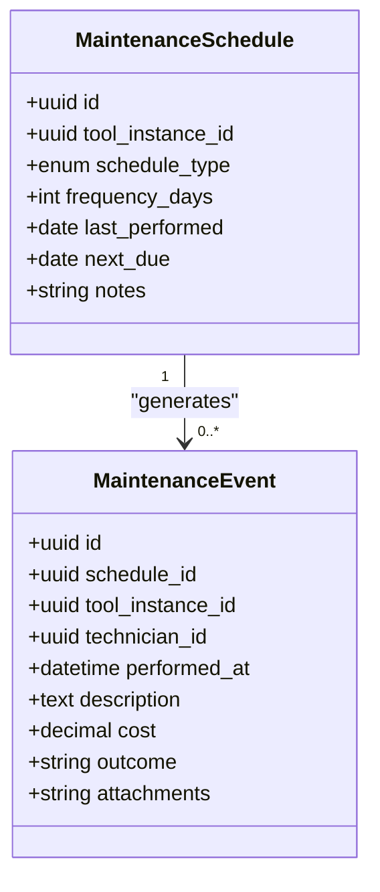
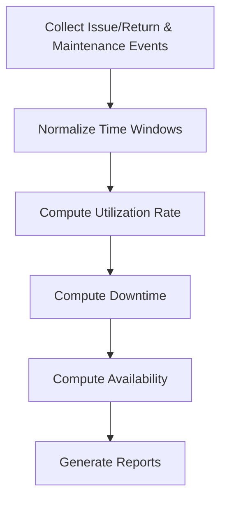
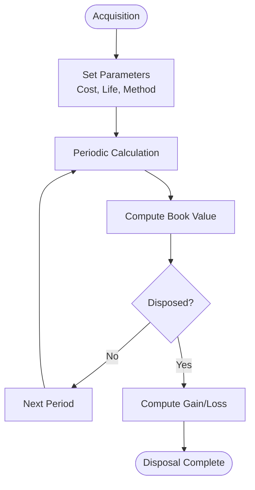
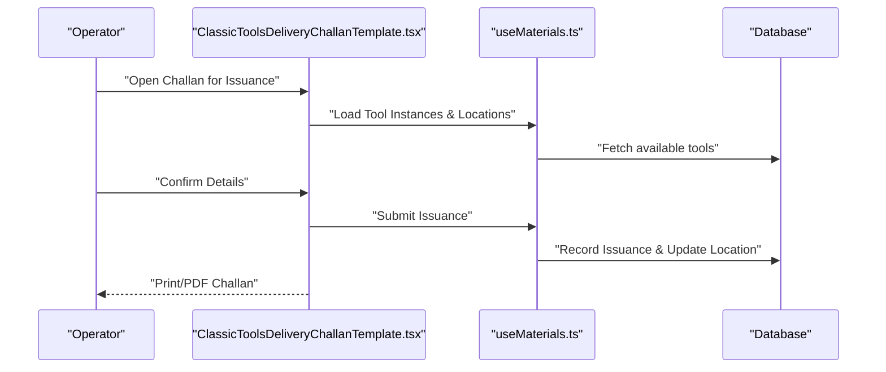
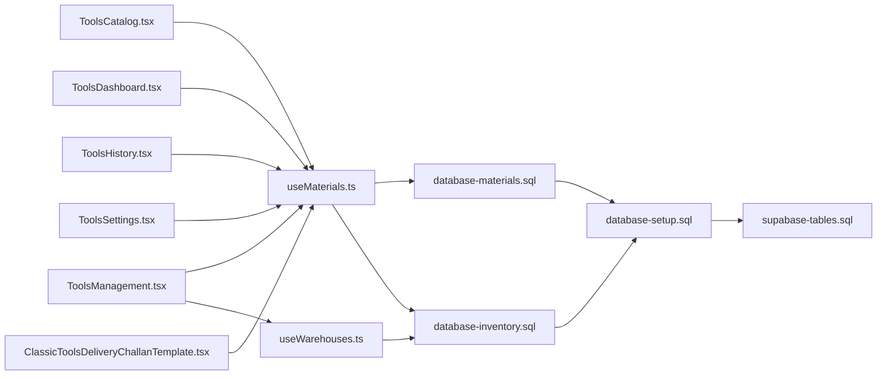

# Tools & Equipment Management

<cite>
**Referenced Files in This Document**
- [ToolsCatalog.tsx](file://src/pages/ToolsCatalog.tsx)
- [ToolsDashboard.tsx](file://src/pages/ToolsDashboard.tsx)
- [ToolsHistory.tsx](file://src/pages/ToolsHistory.tsx)
- [ToolsManagement.tsx](file://src/pages/ToolsManagement.tsx)
- [ToolsSettings.tsx](file://src/pages/ToolsSettings.tsx)
- [ClassicToolsDeliveryChallanTemplate.tsx](file://src/pages/ClassicToolsDeliveryChallanTemplate.tsx)
- [useMaterials.ts](file://src/hooks/useMaterials.ts)
- [useWarehouses.ts](file://src/hooks/useWarehouses.ts)
- [database-materials.sql](file://src/database-materials.sql)
- [database-inventory.sql](file://src/database-inventory.sql)
- [database-setup.sql](file://src/database-setup.sql)
- [supabase-tables.sql](file://supabase-tables.sql)
</cite>

## Table of Contents
1. [Introduction](#introduction)
2. [Project Structure](#project-structure)
3. [Core Components](#core-components)
4. [Architecture Overview](#architecture-overview)
5. [Detailed Component Analysis](#detailed-component-analysis)
6. [Dependency Analysis](#dependency-analysis)
7. [Performance Considerations](#performance-considerations)
8. [Troubleshooting Guide](#troubleshooting-guide)
9. [Conclusion](#conclusion)
10. [Appendices](#appendices)

## Introduction
This document provides a comprehensive data model and operational guide for the Tools & Equipment Management system. It covers:
- Tool catalog, equipment tracking, maintenance scheduling, and utilization monitoring
- The complete tool lifecycle from acquisition to disposal (including issuance, returns, and maintenance records)
- Relationships between tools, projects, sites, and users
- Maintenance schedules, repair histories, depreciation tracking
- Examples of availability queries, utilization reports, and maintenance planning scripts
- Asset tracking requirements, compliance documentation, and performance optimization for equipment databases

The goal is to make the system understandable for both technical and non-technical stakeholders while providing actionable guidance for implementation and operations.

## Project Structure
The Tools & Equipment feature spans UI pages, hooks, and database schema definitions. Key areas include:
- Pages for cataloging, dashboarding, history, management, and settings
- A delivery challan template for issuing tools
- Hooks for materials and warehouses that underpin inventory and location tracking
- SQL migrations defining core tables and relationships

**Diagram sources**
- [ToolsCatalog.tsx](file://src/pages/ToolsCatalog.tsx)
- [ToolsDashboard.tsx](file://src/pages/ToolsDashboard.tsx)
- [ToolsHistory.tsx](file://src/pages/ToolsHistory.tsx)
- [ToolsManagement.tsx](file://src/pages/ToolsManagement.tsx)
- [ToolsSettings.tsx](file://src/pages/ToolsSettings.tsx)
- [ClassicToolsDeliveryChallanTemplate.tsx](file://src/pages/ClassicToolsDeliveryChallanTemplate.tsx)
- [useMaterials.ts](file://src/hooks/useMaterials.ts)
- [useWarehouses.ts](file://src/hooks/useWarehouses.ts)
- [database-materials.sql](file://src/database-materials.sql)
- [database-inventory.sql](file://src/database-inventory.sql)
- [database-setup.sql](file://src/database-setup.sql)
- [supabase-tables.sql](file://supabase-tables.sql)

**Section sources**
- [ToolsCatalog.tsx](file://src/pages/ToolsCatalog.tsx)
- [ToolsDashboard.tsx](file://src/pages/ToolsDashboard.tsx)
- [ToolsHistory.tsx](file://src/pages/ToolsHistory.tsx)
- [ToolsManagement.tsx](file://src/pages/ToolsManagement.tsx)
- [ToolsSettings.tsx](file://src/pages/ToolsSettings.tsx)
- [ClassicToolsDeliveryChallanTemplate.tsx](file://src/pages/ClassicToolsDeliveryChallanTemplate.tsx)
- [useMaterials.ts](file://src/hooks/useMaterials.ts)
- [useWarehouses.ts](file://src/hooks/useWarehouses.ts)
- [database-materials.sql](file://src/database-materials.sql)
- [database-inventory.sql](file://src/database-inventory.sql)
- [database-setup.sql](file://src/database-setup.sql)
- [supabase-tables.sql](file://supabase-tables.sql)

## Core Components
This section outlines the primary entities and their roles in the Tools & Equipment domain.

- Tool Catalog
  - Purpose: Master list of tool types and specifications
  - Key attributes: type, category, serial number, manufacturer, model, purchase date, cost, warranty dates, status, depreciation parameters
  - Lifecycle states: Acquired, In Stock, Issued, Returned, Under Maintenance, Decommissioned, Disposed

- Equipment Tracking
  - Purpose: Track individual instances or batches of tools
  - Key attributes: asset tag, linked tool type, current location (site/warehouse), condition, last inspection date, next maintenance due date
  - Integrates with inventory and warehouse modules

- Maintenance Scheduling
  - Purpose: Plan and record preventive and corrective maintenance
  - Key attributes: schedule type, frequency, last performed, next due, assigned technician, notes, attachments
  - Links to equipment and users

- Utilization Monitoring
  - Purpose: Measure usage intensity and availability over time
  - Key attributes: issue/return timestamps, project/site linkage, user/operator, duration, downtime reasons
  - Supports reporting and capacity planning

- Projects, Sites, Users
  - Projects: Context for tool assignment and cost allocation
  - Sites: Physical locations where tools are used
  - Users: Operators, approvers, and maintainers

- Depreciation Tracking
  - Purpose: Financial tracking of tool value over time
  - Key attributes: acquisition cost, useful life, depreciation method, accumulated depreciation, book value, disposal value

**Section sources**
- [database-materials.sql](file://src/database-materials.sql)
- [database-inventory.sql](file://src/database-inventory.sql)
- [database-setup.sql](file://src/database-setup.sql)
- [supabase-tables.sql](file://supabase-tables.sql)

## Architecture Overview
The system integrates UI pages with hooks and database schemas to manage tools and equipment across their lifecycle.

**Diagram sources**
- [ToolsCatalog.tsx](file://src/pages/ToolsCatalog.tsx)
- [ToolsDashboard.tsx](file://src/pages/ToolsDashboard.tsx)
- [ToolsHistory.tsx](file://src/pages/ToolsHistory.tsx)
- [ToolsManagement.tsx](file://src/pages/ToolsManagement.tsx)
- [useMaterials.ts](file://src/hooks/useMaterials.ts)
- [useWarehouses.ts](file://src/hooks/useWarehouses.ts)
- [database-materials.sql](file://src/database-materials.sql)
- [database-inventory.sql](file://src/database-inventory.sql)

## Detailed Component Analysis

### Tool Catalog Data Model
- Entities
  - Tool Types: master definitions for categories, specs, and financial parameters
  - Tool Instances: individual assets with serial numbers and conditions
  - Categories/Manufacturers: reference lists for classification and sourcing
- Relationships
  - Tool Instances belong to a Tool Type
  - Tool Instances may be grouped into Batches for procurement and depreciation
- Lifecycle States
  - Acquired, In Stock, Issued, Returned, Under Maintenance, Decommissioned, Disposed
- Compliance Fields
  - Certifications, inspection results, safety checks, calibration records

**Diagram sources**
- [database-materials.sql](file://src/database-materials.sql)
- [database-inventory.sql](file://src/database-inventory.sql)

**Section sources**
- [database-materials.sql](file://src/database-materials.sql)
- [database-inventory.sql](file://src/database-inventory.sql)

### Equipment Tracking and Inventory Integration
- Entities
  - Inventory Movements: issuance, returns, transfers
  - Warehouses/Sites: storage and deployment locations
  - Current Location: dynamic mapping of tool instance to site/warehouse
- Relationships
  - Inventory Movement links Tool Instance, Source Location, Destination Location, User, Project
- Operational Notes
  - Ensure atomic updates on issuance/return to prevent double-issuance
  - Maintain audit trail for all movements

**Diagram sources**
- [ToolsManagement.tsx](file://src/pages/ToolsManagement.tsx)
- [useMaterials.ts](file://src/hooks/useMaterials.ts)
- [useWarehouses.ts](file://src/hooks/useWarehouses.ts)
- [database-inventory.sql](file://src/database-inventory.sql)

**Section sources**
- [ToolsManagement.tsx](file://src/pages/ToolsManagement.tsx)
- [useMaterials.ts](file://src/hooks/useMaterials.ts)
- [useWarehouses.ts](file://src/hooks/useWarehouses.ts)
- [database-inventory.sql](file://src/database-inventory.sql)

### Maintenance Scheduling and Repair Histories
- Entities
  - Maintenance Schedules: recurring plans tied to tool instances or types
  - Maintenance Events: actual work performed, outcomes, costs, attachments
  - Technicians/Users: responsible parties
- Relationships
  - Schedule -> Tool Instance/Type
  - Event -> Schedule (optional), Tool Instance, Technician
- Compliance
  - Attach inspection certificates, calibration logs, safety approvals

**Diagram sources**
- [database-materials.sql](file://src/database-materials.sql)
- [database-inventory.sql](file://src/database-inventory.sql)

**Section sources**
- [database-materials.sql](file://src/database-materials.sql)
- [database-inventory.sql](file://src/database-inventory.sql)

### Utilization Monitoring and Reporting
- Metrics
  - Utilization Rate: ratio of issued days to total days in period
  - Downtime: unplanned outages due to maintenance or damage
  - Availability: percentage of time ready for use
- Data Sources
  - Issue/Return events, Maintenance Events, Calendar periods
- Reports
  - Tool-level utilization trends
  - Site/project consumption summaries
  - Cost-per-use calculations including depreciation and maintenance

**Diagram sources**
- [ToolsDashboard.tsx](file://src/pages/ToolsDashboard.tsx)
- [useMaterials.ts](file://src/hooks/useMaterials.ts)
- [database-materials.sql](file://src/database-materials.sql)

**Section sources**
- [ToolsDashboard.tsx](file://src/pages/ToolsDashboard.tsx)
- [useMaterials.ts](file://src/hooks/useMaterials.ts)
- [database-materials.sql](file://src/database-materials.sql)

### Depreciation Tracking
- Methods
  - Straight-line, declining balance, units-of-production
- Inputs
  - Acquisition cost, useful life, salvage/disposal value, usage hours/days
- Outputs
  - Accumulated depreciation, book value per period, disposal gain/loss

**Diagram sources**
- [database-materials.sql](file://src/database-materials.sql)

**Section sources**
- [database-materials.sql](file://src/database-materials.sql)

### Issuance Workflow via Delivery Challan
- Purpose: Formalize tool issuance with documentation
- Steps
  - Create challan referencing tool instance(s), project, site, user
  - Capture signatures/approvals
  - Update inventory and current location
  - Archive challan PDF

**Diagram sources**
- [ClassicToolsDeliveryChallanTemplate.tsx](file://src/pages/ClassicToolsDeliveryChallanTemplate.tsx)
- [useMaterials.ts](file://src/hooks/useMaterials.ts)
- [database-inventory.sql](file://src/database-inventory.sql)

**Section sources**
- [ClassicToolsDeliveryChallanTemplate.tsx](file://src/pages/ClassicToolsDeliveryChallanTemplate.tsx)
- [useMaterials.ts](file://src/hooks/useMaterials.ts)
- [database-inventory.sql](file://src/database-inventory.sql)

## Dependency Analysis
- UI Dependencies
  - Tools pages depend on hooks for data access and business logic
  - Warehouse integration supports location resolution and updates
- Database Dependencies
  - Materials and inventory schemas define core entities and constraints
  - Setup and Supabase tables provide foundational structures and policies

**Diagram sources**
- [ToolsCatalog.tsx](file://src/pages/ToolsCatalog.tsx)
- [ToolsDashboard.tsx](file://src/pages/ToolsDashboard.tsx)
- [ToolsHistory.tsx](file://src/pages/ToolsHistory.tsx)
- [ToolsManagement.tsx](file://src/pages/ToolsManagement.tsx)
- [ToolsSettings.tsx](file://src/pages/ToolsSettings.tsx)
- [ClassicToolsDeliveryChallanTemplate.tsx](file://src/pages/ClassicToolsDeliveryChallanTemplate.tsx)
- [useMaterials.ts](file://src/hooks/useMaterials.ts)
- [useWarehouses.ts](file://src/hooks/useWarehouses.ts)
- [database-materials.sql](file://src/database-materials.sql)
- [database-inventory.sql](file://src/database-inventory.sql)
- [database-setup.sql](file://src/database-setup.sql)
- [supabase-tables.sql](file://supabase-tables.sql)

**Section sources**
- [ToolsCatalog.tsx](file://src/pages/ToolsCatalog.tsx)
- [ToolsDashboard.tsx](file://src/pages/ToolsDashboard.tsx)
- [ToolsHistory.tsx](file://src/pages/ToolsHistory.tsx)
- [ToolsManagement.tsx](file://src/pages/ToolsManagement.tsx)
- [ToolsSettings.tsx](file://src/pages/ToolsSettings.tsx)
- [ClassicToolsDeliveryChallanTemplate.tsx](file://src/pages/ClassicToolsDeliveryChallanTemplate.tsx)
- [useMaterials.ts](file://src/hooks/useMaterials.ts)
- [useWarehouses.ts](file://src/hooks/useWarehouses.ts)
- [database-materials.sql](file://src/database-materials.sql)
- [database-inventory.sql](file://src/database-inventory.sql)
- [database-setup.sql](file://src/database-setup.sql)
- [supabase-tables.sql](file://supabase-tables.sql)

## Performance Considerations
- Indexing
  - Add indexes on foreign keys (tool_instance_id, project_id, site_id, user_id)
  - Index status and date fields for availability and maintenance queries
- Query Optimization
  - Use aggregated views for utilization and availability metrics
  - Partition large event tables by date ranges if necessary
- Concurrency Control
  - Implement optimistic locking or row-level locks for issuance/returns
- Caching
  - Cache catalog and configuration data at the hook layer
- Archival
  - Archive historical events periodically to keep hot tables lean

[No sources needed since this section provides general guidance]

## Troubleshooting Guide
- Common Issues
  - Double issuance: ensure atomic transactions and unique constraints on active issuances
  - Missing location updates: validate triggers or application logic after issuance
  - Incorrect utilization: verify time window alignment and timezone handling
- Diagnostics
  - Review issuance/return logs and maintenance events
  - Cross-check current location against expected site/warehouse
- Recovery
  - Reconcile discrepancies using audit trails
  - Roll back erroneous transactions if supported

**Section sources**
- [database-inventory.sql](file://src/database-inventory.sql)
- [database-materials.sql](file://src/database-materials.sql)

## Conclusion
The Tools & Equipment Management system provides a robust framework for managing tool lifecycles, maintenance, utilization, and compliance. By integrating cataloging, inventory, maintenance scheduling, and reporting, it supports efficient operations and informed decision-making. Proper indexing, concurrency controls, and archival strategies will ensure scalability and reliability.

[No sources needed since this section summarizes without analyzing specific files]

## Appendices

### Example Queries and Scripts

- Tool Availability Query
  - Purpose: List currently available tools by type and location
  - Approach: Filter tool instances with status In Stock; join to tool types and current locations
  - Output columns: tool type, serial number, asset tag, current site/warehouse

- Utilization Report
  - Purpose: Summarize utilization rate per tool over a period
  - Approach: Count issued days vs total days; subtract downtime days from maintenance events
  - Output columns: tool instance, period start/end, utilization %, downtime hours

- Maintenance Planning Script
  - Purpose: Generate upcoming maintenance tasks based on schedules
  - Approach: Select schedules with next_due within threshold; assign technicians; create events
  - Output: task list with due dates and responsibilities

[No sources needed since this section provides conceptual examples]

### Compliance Documentation Checklist
- Inspection certificates and calibration logs
- Safety approvals and risk assessments
- Maintenance records with outcomes and costs
- Issuance/return challans with signatures
- Disposal records and environmental compliance

[No sources needed since this section provides conceptual guidance]