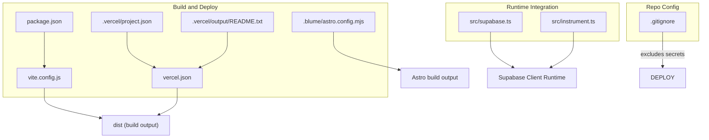
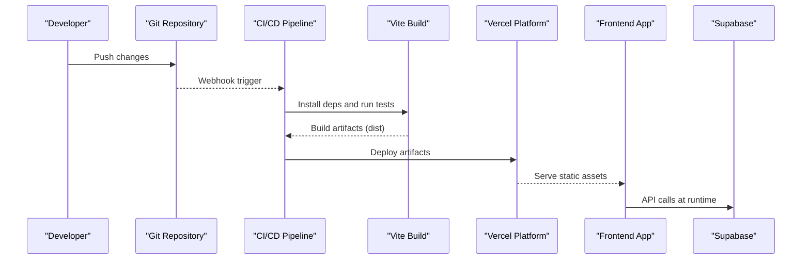
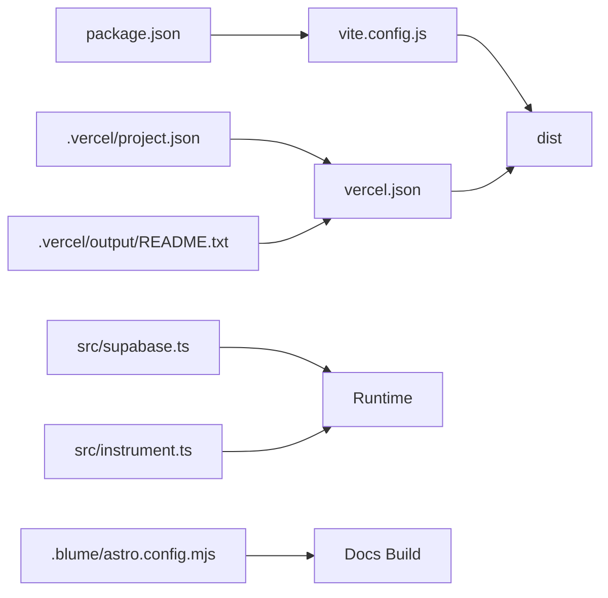

# Deployment & DevOps

<cite>
**Referenced Files in This Document**
- [vercel.json](file://vercel.json)
- [package.json](file://package.json)
- [vite.config.js](file://vite.config.js)
- [astro.config.mjs](file://.blume/astro.config.mjs)
- [project.json](file://.vercel/project.json)
- [README.txt](file://.vercel/output/README.txt)
- [supabase.ts](file://src/supabase.ts)
- [instrument.ts](file://src/instrument.ts)
- [.gitignore](file://.gitignore)
</cite>

## Table of Contents
1. [Introduction](#introduction)
2. [Project Structure](#project-structure)
3. [Core Components](#core-components)
4. [Architecture Overview](#architecture-overview)
5. [Detailed Component Analysis](#detailed-component-analysis)
6. [Dependency Analysis](#dependency-analysis)
7. [Performance Considerations](#performance-considerations)
8. [Troubleshooting Guide](#troubleshooting-guide)
9. [Conclusion](#conclusion)
10. [Appendices](#appendices)

## Introduction
This document provides comprehensive deployment and DevOps guidance for the MEP Project, focusing on build pipeline configuration, environment management, and production deployment strategies. It explains Vercel deployment setup, environment variables, configuration management, CI/CD automation, automated testing gates, and deployment verification processes. It also covers containerization considerations, infrastructure-as-code practices, monitoring and logging, error tracking, performance monitoring, backup and recovery, disaster recovery planning, scaling strategies, security hardening, SSL certificate management, and compliance requirements for enterprise deployments.

## Project Structure
The project is a modern web application with:
- A Vite-based frontend build configured via vite.config.js
- A Vercel deployment configuration via vercel.json
- Supabase client integration for backend services
- Optional Astro configuration under .blume for documentation or microsites
- Build artifacts and metadata under dist and .vercel directories

**Diagram sources**
- [vite.config.js](file://vite.config.js)
- [package.json](file://package.json)
- [vercel.json](file://vercel.json)
- [astro.config.mjs](file://.blume/astro.config.mjs)
- [project.json](file://.vercel/project.json)
- [README.txt](file://.vercel/output/README.txt)
- [supabase.ts](file://src/supabase.ts)
- [instrument.ts](file://src/instrument.ts)
- [.gitignore](file://.gitignore)

**Section sources**
- [vite.config.js](file://vite.config.js)
- [package.json](file://package.json)
- [vercel.json](file://vercel.json)
- [astro.config.mjs](file://.blume/astro.config.mjs)
- [project.json](file://.vercel/project.json)
- [README.txt](file://.vercel/output/README.txt)
- [supabase.ts](file://src/supabase.ts)
- [instrument.ts](file://src/instrument.ts)
- [.gitignore](file://.gitignore)

## Core Components
- Build system: Vite-driven build producing static assets under dist; package.json defines scripts and dependencies.
- Vercel deployment: vercel.json configures build settings, rewrites, headers, and redirects; .vercel contains project metadata and output readme.
- Environment configuration: Supabase client initialization and runtime instrumentation are defined in src/supabase.ts and src/instrument.ts.
- Documentation site (optional): Astro configuration under .blume supports building docs or microsites alongside the app.

Key responsibilities:
- Build pipeline: compile TypeScript/JSX, bundle assets, optimize outputs.
- Deployment: Vercel builds from source, injects environment variables, serves static assets.
- Runtime integrations: Supabase client usage and optional telemetry/performance instrumentation.

**Section sources**
- [package.json](file://package.json)
- [vite.config.js](file://vite.config.js)
- [vercel.json](file://vercel.json)
- [project.json](file://.vercel/project.json)
- [README.txt](file://.vercel/output/README.txt)
- [supabase.ts](file://src/supabase.ts)
- [instrument.ts](file://src/instrument.ts)
- [astro.config.mjs](file://.blume/astro.config.mjs)

## Architecture Overview
High-level architecture for deployment:
- Source code repository triggers CI/CD on push/PR.
- Build stage runs tests and produces static assets using Vite.
- Vercel deploys the built assets to edge locations with global CDN.
- Runtime integrates with Supabase for data and authentication.
- Monitoring and logging are enabled via instrumentation hooks.

[No sources needed since this diagram shows conceptual workflow, not actual code structure]

## Detailed Component Analysis

### Vercel Deployment Configuration
- vercel.json defines build commands, output directory, rewrites, headers, and redirects.
- .vercel/project.json stores project metadata used by Vercel CLI and platform.
- .vercel/output/README.txt may contain generated notes about the output structure.

Operational guidance:
- Ensure build command matches your package.json scripts.
- Configure environment variables in Vercel dashboard per environment (development, preview, production).
- Use rewrites to route API-like paths if needed, or proxy to external services.
- Set headers for caching, security policies, and content types.

**Section sources**
- [vercel.json](file://vercel.json)
- [project.json](file://.vercel/project.json)
- [README.txt](file://.vercel/output/README.txt)

### Build Pipeline (Vite + Package Scripts)
- vite.config.js controls build targets, plugins, asset handling, and output path.
- package.json defines install, build, test, and lint scripts.

Operational guidance:
- Align Vite build output with Vercel’s expected artifact directory.
- Pin dependency versions and use lockfiles for reproducible builds.
- Enable incremental builds and caching in CI to speed up pipelines.

**Section sources**
- [vite.config.js](file://vite.config.js)
- [package.json](file://package.json)

### Environment Management
- Supabase client initialization resides in src/supabase.ts; ensure environment variables for Supabase URL and anonymous/public keys are set in Vercel.
- instrument.ts may include telemetry or performance hooks; configure feature flags via environment variables.

Operational guidance:
- Store secrets in Vercel environment variables; never commit them to the repository.
- Validate required env vars at startup and fail fast if missing.
- Separate dev, preview, and prod environments with distinct credentials.

**Section sources**
- [supabase.ts](file://src/supabase.ts)
- [instrument.ts](file://src/instrument.ts)

### Documentation Site (Optional Astro)
- .blume/astro.config.mjs configures an Astro site that can be built independently or integrated into the main build.

Operational guidance:
- If used, add a separate build step in CI to generate docs and deploy to a subpath or separate domain.
- Cache node_modules and Astro build cache to improve CI times.

**Section sources**
- [astro.config.mjs](file://.blume/astro.config.mjs)

### Security and Secrets Hygiene
- .gitignore should exclude sensitive files such as .env, local configs, and build artifacts.

Operational guidance:
- Enforce pre-commit checks to prevent accidental secret commits.
- Rotate secrets regularly and audit access logs.

**Section sources**
- [.gitignore](file://.gitignore)

## Dependency Analysis
The following diagram maps key configuration and runtime files involved in build and deployment:

**Diagram sources**
- [package.json](file://package.json)
- [vite.config.js](file://vite.config.js)
- [vercel.json](file://vercel.json)
- [project.json](file://.vercel/project.json)
- [README.txt](file://.vercel/output/README.txt)
- [supabase.ts](file://src/supabase.ts)
- [instrument.ts](file://src/instrument.ts)
- [astro.config.mjs](file://.blume/astro.config.mjs)

**Section sources**
- [package.json](file://package.json)
- [vite.config.js](file://vite.config.js)
- [vercel.json](file://vercel.json)
- [project.json](file://.vercel/project.json)
- [README.txt](file://.vercel/output/README.txt)
- [supabase.ts](file://src/supabase.ts)
- [instrument.ts](file://src/instrument.ts)
- [astro.config.mjs](file://.blume/astro.config.mjs)

## Performance Considerations
- Enable Vite optimizations (minification, tree-shaking, code splitting) via vite.config.js.
- Configure appropriate cache-control headers in vercel.json for static assets.
- Use Vercel’s Edge Network for low-latency global delivery.
- Monitor performance with instrumentation hooks in instrument.ts and integrate with APM tools.
- Keep bundle size small; analyze dependencies and lazy-load heavy modules.

[No sources needed since this section provides general guidance]

## Troubleshooting Guide
Common issues and resolutions:
- Missing environment variables: Verify all required variables are set in Vercel dashboard for each environment.
- Build failures: Check Node version compatibility and dependency locks; ensure build scripts match package.json.
- Supabase connectivity errors: Confirm URLs and keys in environment variables; validate network rules and CORS.
- Caching problems: Adjust cache headers and purge caches when necessary.
- Instrumentation errors: Guard telemetry calls with feature flags and fallbacks.

**Section sources**
- [vercel.json](file://vercel.json)
- [package.json](file://package.json)
- [supabase.ts](file://src/supabase.ts)
- [instrument.ts](file://src/instrument.ts)

## Conclusion
The MEP Project leverages a Vite-based build pipeline and Vercel for deployment, integrating with Supabase at runtime. By configuring environment variables securely, optimizing builds, and enabling monitoring and logging, teams can achieve reliable, scalable, and secure production deployments. The provided diagrams and guidance outline best practices for CI/CD automation, testing gates, and operational excellence.

[No sources needed since this section summarizes without analyzing specific files]

## Appendices

### CI/CD Automation and Testing Gates
- Recommended steps:
  - Install dependencies and cache node_modules.
  - Run linters and type checks.
  - Execute unit and integration tests.
  - Build the app with Vite.
  - Deploy artifacts to Vercel.
- Gate criteria:
  - All tests must pass.
  - No critical vulnerabilities detected.
  - Bundle size within thresholds.

[No sources needed since this section provides general guidance]

### Containerization Strategies
- For static apps like this one, containerization is typically unnecessary; Vercel handles hosting efficiently.
- If containers are required (e.g., custom serverless functions), define Dockerfiles and orchestrate via Kubernetes or managed platforms.

[No sources needed since this section provides general guidance]

### Infrastructure-as-Code Practices
- Manage Vercel projects and environment variables via Vercel CLI or APIs.
- Version control configuration files (vercel.json, package.json, vite.config.js).
- Use GitHub Actions or similar CI runners to automate deployments.

[No sources needed since this section provides general guidance]

### Monitoring and Logging
- Integrate error tracking (e.g., Sentry) and performance monitoring (e.g., Vercel Analytics or third-party APM).
- Centralize logs and correlate with deployments and user sessions.
- Set alerts for error rates and latency thresholds.

[No sources needed since this section provides general guidance]

### Backup and Recovery, Disaster Recovery
- Back up Supabase databases and storage buckets regularly.
- Define RPO/RTO targets and test restoration procedures.
- Maintain runbooks for incident response and rollback strategies.

[No sources needed since this section provides general guidance]

### Scaling Strategies
- Leverage Vercel’s auto-scaling for static assets and serverless functions.
- Optimize payloads and enable CDN caching.
- Use database connection pooling and query optimization for Supabase.

[No sources needed since this section provides general guidance]

### Security Hardening and Compliance
- Enforce HTTPS and HSTS via Vercel defaults and custom headers.
- Manage SSL certificates automatically through Vercel.
- Apply least-privilege access controls and rotate secrets.
- Conduct regular audits and maintain compliance evidence.

[No sources needed since this section provides general guidance]