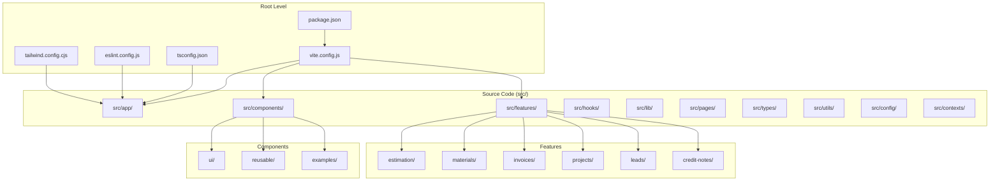
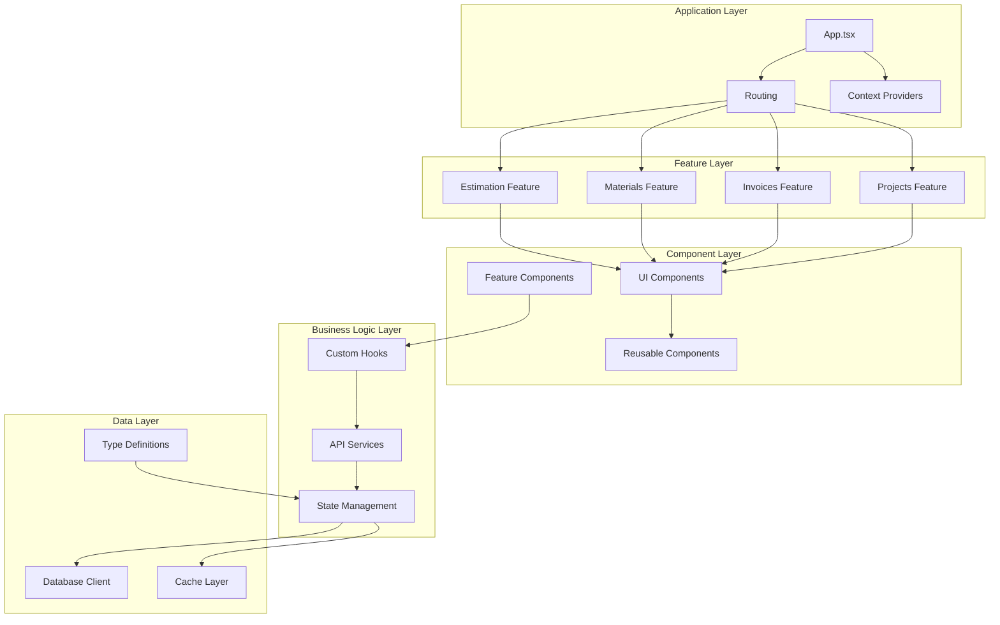
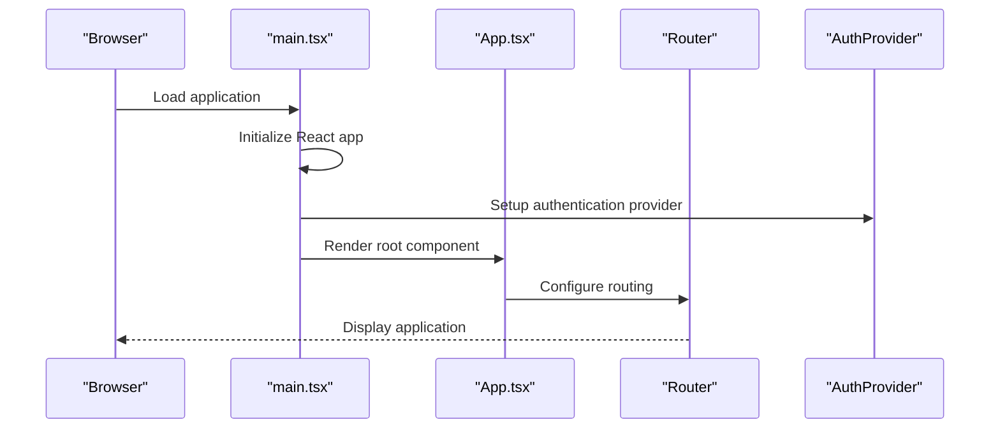
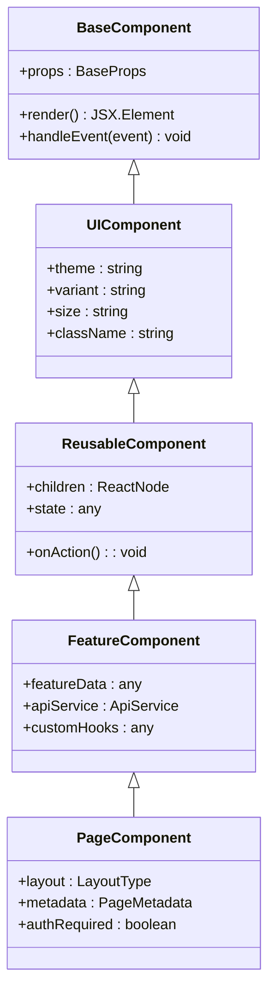
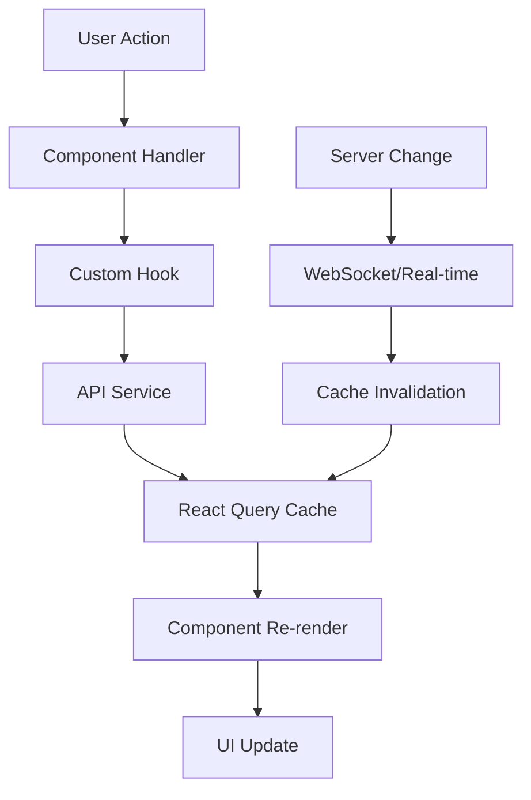
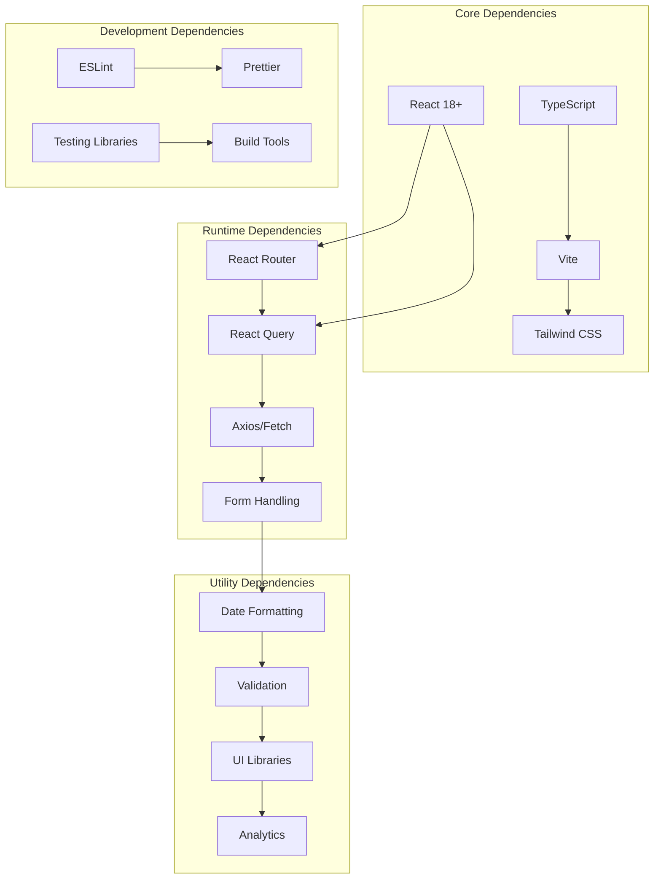

# Development Guidelines

<cite>
**Referenced Files in This Document**
- [package.json](file://package.json)
- [eslint.config.js](file://eslint.config.js)
- [tsconfig.json](file://tsconfig.json)
- [vite.config.js](file://vite.config.js)
- [tailwind.config.cjs](file://tailwind.config.cjs)
- [postcss.config.cjs](file://postcss.config.cjs)
- [src/main.tsx](file://src\main.tsx)
- [src/App.tsx](file://src\App.tsx)
- [src/index.css](file://src\index.css)
- [components.json](file://components.json)
- [vercel.json](file://vercel.json)
</cite>

## Table of Contents
1. [Introduction](#introduction)
2. [Project Structure](#project-structure)
3. [Core Components](#core-components)
4. [Architecture Overview](#architecture-overview)
5. [Detailed Component Analysis](#detailed-component-analysis)
6. [Dependency Analysis](#dependency-analysis)
7. [Performance Considerations](#performance-considerations)
8. [Troubleshooting Guide](#troubleshooting-guide)
9. [Conclusion](#conclusion)
10. [Appendices](#appendices)

## Introduction

The MEP (Mechanical, Electrical, and Plumbing) Project is a comprehensive enterprise application built with modern web technologies. This document provides comprehensive development guidelines for contributing to the project, covering coding standards, TypeScript conventions, ESLint configuration rules, project structure, naming conventions, architectural patterns, build system configuration, development workflow, debugging techniques, testing strategies, Git workflow, performance optimization, and security considerations.

The project follows a feature-based architecture with React as the primary frontend framework, Vite as the build tool, and Tailwind CSS for styling. It's designed as an enterprise-grade application with robust state management, API integration, and comprehensive testing coverage.

## Project Structure

The MEP Project follows a well-organized feature-based architecture that promotes code reusability and maintainability:

**Diagram sources**
- [package.json:1-50](file://package.json#L1-L50)
- [vite.config.js:1-100](file://vite.config.js#L1-L100)
- [tsconfig.json:1-50](file://tsconfig.json#L1-L50)

### Directory Organization Principles

The project follows these key organizational principles:

1. **Feature-Based Architecture**: Each business domain has its own directory containing related components, hooks, types, and utilities
2. **Component Separation**: UI components are separated into reusable, feature-specific, and example components
3. **Hook Abstraction**: Custom React hooks encapsulate business logic and data fetching
4. **Type Safety**: Comprehensive TypeScript usage throughout the codebase
5. **Configuration Management**: Centralized configuration files for build tools and linting

**Section sources**
- [package.json:1-100](file://package.json#L1-L100)
- [vite.config.js:1-150](file://vite.config.js#L1-L150)
- [tsconfig.json:1-100](file://tsconfig.json#L1-L100)

## Core Components

### Build System Configuration

The project uses Vite as the primary build tool with comprehensive configuration for development and production builds.

#### Key Build Features:
- Fast development server with hot module replacement (HMR)
- Optimized production builds with tree shaking
- TypeScript compilation and type checking
- CSS processing with Tailwind CSS integration
- Asset optimization and bundling

#### Development Workflow:
- Local development server with instant feedback
- Source map generation for debugging
- Environment variable support
- Plugin ecosystem for extended functionality

**Section sources**
- [vite.config.js:1-200](file://vite.config.js#L1-L200)
- [package.json:1-150](file://package.json#L1-L150)

### TypeScript Configuration

The TypeScript configuration enforces strict type safety and provides comprehensive development experience:

#### Type Checking Standards:
- Strict mode enabled for better type safety
- Module resolution configured for modern JavaScript features
- Path aliases for cleaner imports
- Declaration file generation for library consumers

#### Development Experience:
- Incremental compilation for faster builds
- Source maps for debugging
- IDE integration support
- Type inference optimization

**Section sources**
- [tsconfig.json:1-150](file://tsconfig.json#L1-L150)

### ESLint Configuration

The ESLint configuration ensures code quality and consistency across the codebase:

#### Linting Rules:
- TypeScript-aware linting with type information
- React-specific rules for component best practices
- Import/export validation and organization
- Code style enforcement
- Security-focused linting rules

#### Integration:
- VS Code integration for real-time feedback
- Pre-commit hooks for automated linting
- CI/CD pipeline integration
- Custom rule extensions for project-specific requirements

**Section sources**
- [eslint.config.js:1-200](file://eslint.config.js#L1-L200)

### Styling System

The project uses Tailwind CSS with PostCSS for utility-first styling:

#### Styling Architecture:
- Utility-first CSS classes for consistent design
- Custom theme configuration for brand consistency
- Responsive design patterns
- Dark mode support
- Component-specific styling overrides

#### Performance Optimization:
- CSS purging for production builds
- Critical CSS extraction
- Style composition patterns
- Theme variable system

**Section sources**
- [tailwind.config.cjs:1-200](file://tailwind.config.cjs#L1-L200)
- [postcss.config.cjs:1-100](file://postcss.config.cjs#L1-L100)

## Architecture Overview

The MEP Project follows a modern React architecture with clear separation of concerns and scalable patterns:

**Diagram sources**
- [src/App.tsx:1-100](file://src\App.tsx#L1-L100)
- [src/main.tsx:1-50](file://src\main.tsx#L1-L50)

### Architectural Patterns

#### 1. Feature-Based Architecture
Each business domain is encapsulated in its own feature directory containing:
- Components specific to the feature
- Custom hooks for feature logic
- API services for data fetching
- Type definitions for the feature
- Utility functions specific to the feature

#### 2. Component Composition Pattern
Components follow a hierarchical composition pattern:
- Base UI components (atomic)
- Reusable components (molecular)
- Feature-specific components (organism)
- Page-level components (templates)

#### 3. Hook-Centric Logic
Business logic is extracted into custom React hooks:
- Data fetching hooks
- State management hooks
- Utility hooks
- Event handling hooks

**Section sources**
- [src/App.tsx:1-200](file://src\App.tsx#L1-L200)
- [src/main.tsx:1-100](file://src\main.tsx#L1-L100)

## Detailed Component Analysis

### Application Entry Point

The main application entry point initializes the React application with essential providers and configurations:

**Diagram sources**
- [src/main.tsx:1-100](file://src\main.tsx#L1-L100)
- [src/App.tsx:1-150](file://src\App.tsx#L1-L150)

### Component Architecture

The component hierarchy follows a clear separation of concerns:

**Diagram sources**
- [src/components/ui/:1-50](file://src\components\ui\index.tsx#L1-L50)
- [src/components/reusable/:1-50](file://src\components\reusable\index.tsx#L1-L50)

### State Management Strategy

The project implements a layered state management approach:

#### Local Component State
- useState for simple component state
- useReducer for complex state logic
- Context for shared component state

#### Global State Management
- React Query for server state
- Custom hooks for application-wide state
- URL state for navigation state

#### Data Flow Pattern

**Diagram sources**
- [src/hooks/:1-100](file://src\hooks\index.ts#L1-L100)
- [src/config/queryClient.ts:1-100](file://src\config\queryClient.ts#L1-L100)

**Section sources**
- [src/main.tsx:1-150](file://src\main.tsx#L1-L150)
- [src/App.tsx:1-300](file://src\App.tsx#L1-L300)
- [src/components/ui/:1-200](file://src\components\ui\index.tsx#L1-L200)

## Dependency Analysis

The project maintains a carefully curated dependency tree focused on performance and reliability:

**Diagram sources**
- [package.json:1-200](file://package.json#L1-L200)

### Dependency Management Strategy

#### Version Pinning
- Major versions pinned for stability
- Minor versions updated regularly for security patches
- Dev dependencies managed separately from runtime dependencies

#### Bundle Size Optimization
- Tree shaking enabled for unused code elimination
- Lazy loading for large dependencies
- Code splitting for route-based loading
- Dependency analysis for bundle size monitoring

**Section sources**
- [package.json:1-300](file://package.json#L1-L300)

## Performance Considerations

### Build Performance Optimization

#### Development Build Optimization
- Hot Module Replacement (HMR) for instant updates
- Incremental compilation for faster rebuilds
- Source maps for efficient debugging
- Parallel processing for multi-core utilization

#### Production Build Optimization
- Code splitting for reduced initial load
- Tree shaking for dead code elimination
- Minification and compression
- Asset optimization (images, fonts, etc.)

### Runtime Performance

#### Component Optimization
- React.memo for expensive components
- useMemo for computed values
- useCallback for stable function references
- Virtual scrolling for large lists

#### Network Optimization
- Request caching with React Query
- Pagination for large datasets
- Image lazy loading
- CDN integration for static assets

### Memory Management

#### Best Practices
- Proper cleanup in useEffect hooks
- Event listener removal
- Interval and timeout cleanup
- Large object disposal

#### Monitoring
- Performance profiling with React DevTools
- Memory leak detection
- Bundle size monitoring
- Runtime performance metrics

**Section sources**
- [vite.config.js:1-200](file://vite.config.js#L1-L200)
- [src/hooks/usePerformanceMonitor.ts:1-100](file://src\hooks\usePerformanceMonitor.ts#L1-L100)

## Troubleshooting Guide

### Common Development Issues

#### Build Errors
- TypeScript compilation errors
- Module resolution issues
- Asset loading problems
- CSS processing errors

#### Runtime Errors
- React component errors
- API connection failures
- State management issues
- Routing problems

#### Performance Issues
- Slow build times
- Memory leaks
- Bundle size bloat
- Runtime performance bottlenecks

### Debugging Techniques

#### Development Debugging
- Source maps for stack traces
- React DevTools for component inspection
- Network tab for API debugging
- Console logging strategies

#### Production Debugging
- Error tracking and reporting
- Performance monitoring
- User behavior analytics
- Log aggregation

### Testing Strategies

#### Unit Testing
- Component testing with React Testing Library
- Hook testing with custom test utilities
- Utility function testing
- Mock service workers for API mocking

#### Integration Testing
- API endpoint testing
- Database integration tests
- Authentication flow testing
- Cross-feature integration

#### End-to-End Testing
- User journey testing
- Cross-browser compatibility
- Performance regression testing
- Accessibility testing

**Section sources**
- [eslint.config.js:1-200](file://eslint.config.js#L1-L200)
- [src/hooks/:1-200](file://src\hooks\index.ts#L1-L200)

## Conclusion

The MEP Project demonstrates a mature, enterprise-grade React application architecture with comprehensive development guidelines. The project successfully balances developer experience with production readiness through careful attention to:

- **Code Quality**: Enforced through ESLint, TypeScript, and comprehensive testing
- **Performance**: Optimized through modern build tools and runtime optimizations  
- **Maintainability**: Achieved through feature-based architecture and clear separation of concerns
- **Scalability**: Designed with modular components and hook-centric logic patterns
- **Security**: Implemented through secure coding practices and vulnerability prevention

Contributors should follow the established patterns and guidelines to ensure consistency and maintainability across the codebase. The comprehensive documentation and tooling setup provide a solid foundation for continued development and growth of the application.

## Appendices

### Quick Start Guide

1. **Installation**: `npm install`
2. **Development**: `npm run dev`
3. **Build**: `npm run build`
4. **Testing**: `npm run test`
5. **Linting**: `npm run lint`

### Environment Setup

- Node.js 18+ required
- npm or yarn package manager
- Git for version control
- VS Code recommended with recommended extensions

### Contributing Workflow

1. Create feature branch from main
2. Make changes following coding standards
3. Add/update tests as needed
4. Run linting and type checking
5. Submit pull request with description
6. Address review feedback
7. Merge after approval

**Section sources**
- [package.json:1-100](file://package.json#L1-L100)
- [vercel.json:1-50](file://vercel.json#L1-L50)