# Account Reconciliation

<cite>
**Referenced Files in This Document**
- [LedgerDashboard.tsx](file://src/ledger/LedgerDashboard.tsx)
- [LedgerModal.tsx](file://src/ledger/LedgerModal.tsx)
- [OpeningBalanceTab.tsx](file://src/ledger/OpeningBalanceTab.tsx)
- [api.ts](file://src/ledger/api.ts)
- [hooks.ts](file://src/ledger/hooks.ts)
- [schemas.ts](file://src/ledger/schemas.ts)
- [utils.ts](file://src/ledger/utils.ts)
- [useAuditLog.ts](file://src/hooks/useAuditLog.ts)
- [database-add-audit-log.sql](file://src/database-add-audit-log.sql)
- [supabase.ts](file://src/supabase.ts)
</cite>

## Table of Contents
1. [Introduction](#introduction)
2. [Project Structure](#project-structure)
3. [Core Components](#core-components)
4. [Architecture Overview](#architecture-overview)
5. [Detailed Component Analysis](#detailed-component-analysis)
6. [Dependency Analysis](#dependency-analysis)
7. [Performance Considerations](#performance-considerations)
8. [Troubleshooting Guide](#troubleshooting-guide)
9. [Conclusion](#conclusion)
10. [Appendices](#appendices)

## Introduction
This document explains the Account Reconciliation processes as implemented in the application, focusing on bank statement matching, account balancing procedures, discrepancy resolution workflows, automatic reconciliation rules, manual adjustments, and status tracking. It also covers variance analysis tools, aging reports, exception handling mechanisms, approval workflows, audit trails, compliance reporting requirements, and integration points with banking APIs and statement import capabilities. The goal is to provide both high-level guidance and code-mapped details for developers and finance users.

## Project Structure
The reconciliation feature is primarily centered around the ledger module and related hooks and utilities:
- Ledger UI components for dashboards, modals, and opening balance management
- API layer for data access and mutations
- Hooks for data fetching and state management
- Schemas for validation and type safety
- Utilities for calculations and formatting
- Audit logging integration for compliance and traceability
- Supabase client configuration for database connectivity

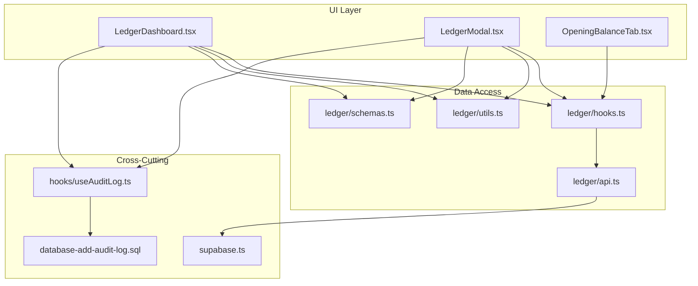

**Diagram sources**
- [LedgerDashboard.tsx](file://src/ledger/LedgerDashboard.tsx)
- [LedgerModal.tsx](file://src/ledger/LedgerModal.tsx)
- [OpeningBalanceTab.tsx](file://src/ledger/OpeningBalanceTab.tsx)
- [api.ts](file://src/ledger/api.ts)
- [hooks.ts](file://src/ledger/hooks.ts)
- [schemas.ts](file://src/ledger/schemas.ts)
- [utils.ts](file://src/ledger/utils.ts)
- [useAuditLog.ts](file://src/hooks/useAuditLog.ts)
- [database-add-audit-log.sql](file://src/database-add-audit-log.sql)
- [supabase.ts](file://src/supabase.ts)

**Section sources**
- [LedgerDashboard.tsx](file://src/ledger/LedgerDashboard.tsx)
- [LedgerModal.tsx](file://src/ledger/LedgerModal.tsx)
- [OpeningBalanceTab.tsx](file://src/ledger/OpeningBalanceTab.tsx)
- [api.ts](file://src/ledger/api.ts)
- [hooks.ts](file://src/ledger/hooks.ts)
- [schemas.ts](file://src/ledger/schemas.ts)
- [utils.ts](file://src/ledger/utils.ts)
- [useAuditLog.ts](file://src/hooks/useAuditLog.ts)
- [database-add-audit-log.sql](file://src/database-add-audit-log.sql)
- [supabase.ts](file://src/supabase.ts)

## Core Components
- Ledger Dashboard: Provides an overview of accounts, balances, and reconciliation status indicators. It integrates with hooks to fetch real-time data and exposes actions to open reconciliation workflows.
- Ledger Modal: Handles detailed reconciliation tasks such as matching transactions, applying rules, creating manual adjustments, and recording approvals.
- Opening Balance Tab: Manages initial balances and ensures they are correctly set before period reconciliation begins.
- API Layer: Encapsulates all server interactions for reading statements, posting adjustments, and retrieving reconciliation metadata.
- Hooks: Centralize data fetching, caching, and mutation logic; expose typed interfaces to UI components.
- Schemas: Define validation rules for inputs (e.g., amounts, dates, account IDs) and outputs (e.g., matched pairs).
- Utilities: Implement core calculations like variance computation, aging buckets, and currency normalization.
- Audit Logging: Records user actions and system events for compliance and traceability.

**Section sources**
- [LedgerDashboard.tsx](file://src/ledger/LedgerDashboard.tsx)
- [LedgerModal.tsx](file://src/ledger/LedgerModal.tsx)
- [OpeningBalanceTab.tsx](file://src/ledger/OpeningBalanceTab.tsx)
- [api.ts](file://src/ledger/api.ts)
- [hooks.ts](file://src/ledger/hooks.ts)
- [schemas.ts](file://src/ledger/schemas.ts)
- [utils.ts](file://src/ledger/utils.ts)
- [useAuditLog.ts](file://src/hooks/useAuditLog.ts)

## Architecture Overview
The reconciliation architecture follows a layered approach:
- Presentation Layer: React components render dashboards and modals, handle user interactions, and display reconciliation outcomes.
- Business Logic Layer: Hooks orchestrate data flow, apply business rules, and coordinate API calls.
- Data Access Layer: API functions interact with the database via the Supabase client.
- Compliance Layer: Audit logs capture changes and approvals for regulatory reporting.

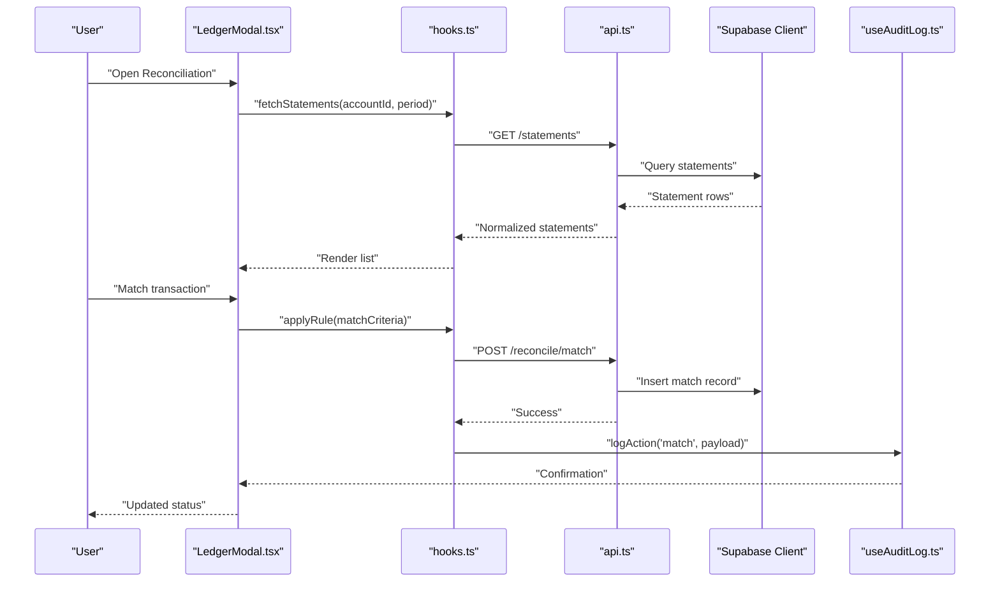

**Diagram sources**
- [LedgerModal.tsx](file://src/ledger/LedgerModal.tsx)
- [hooks.ts](file://src/ledger/hooks.ts)
- [api.ts](file://src/ledger/api.ts)
- [useAuditLog.ts](file://src/hooks/useAuditLog.ts)
- [supabase.ts](file://src/supabase.ts)

## Detailed Component Analysis

### Bank Statement Matching
- Purpose: Align internal ledger entries with external bank statement lines using deterministic and heuristic rules.
- Inputs: Statement rows, internal transactions, rule definitions, tolerance thresholds.
- Processing:
  - Normalize amounts and dates across currencies and time zones.
  - Apply exact matches (amount + date ± tolerance).
  - Apply fuzzy matches (reference numbers, payee names).
  - Group potential matches and present candidates for review.
- Outputs: Matched pairs, unmatched items, confidence scores.

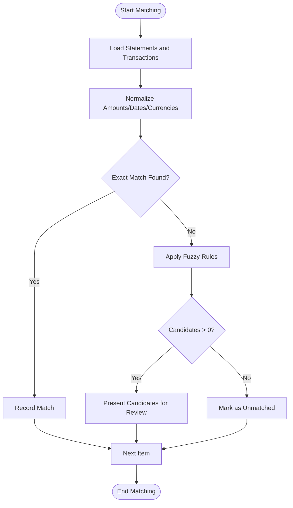

**Diagram sources**
- [LedgerModal.tsx](file://src/ledger/LedgerModal.tsx)
- [hooks.ts](file://src/ledger/hooks.ts)
- [utils.ts](file://src/ledger/utils.ts)

**Section sources**
- [LedgerModal.tsx](file://src/ledger/LedgerModal.tsx)
- [hooks.ts](file://src/ledger/hooks.ts)
- [utils.ts](file://src/ledger/utils.ts)

### Account Balancing Procedures
- Purpose: Ensure that debits equal credits within a period and reconcile differences.
- Steps:
  - Sum debits and credits per account and per period.
  - Compute variance and flag discrepancies beyond tolerance.
  - Generate balancing report with breakdown by category.
- Integration: Uses utility functions for arithmetic precision and currency conversion.

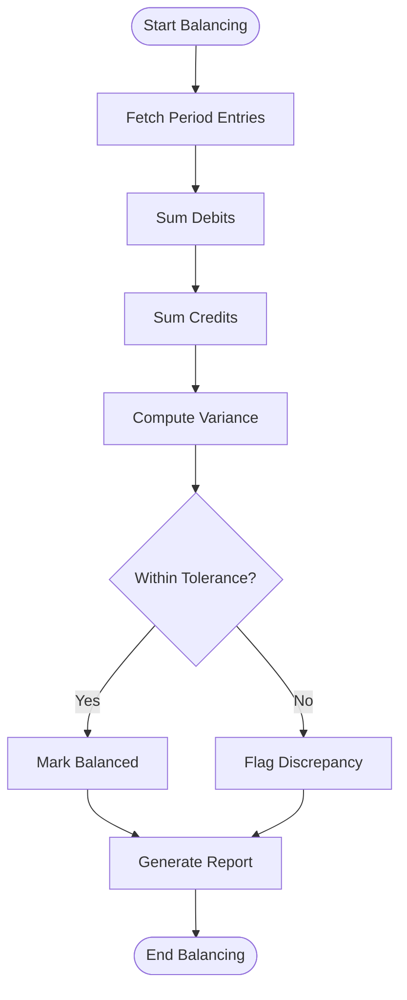

**Diagram sources**
- [utils.ts](file://src/ledger/utils.ts)
- [hooks.ts](file://src/ledger/hooks.ts)

**Section sources**
- [utils.ts](file://src/ledger/utils.ts)
- [hooks.ts](file://src/ledger/hooks.ts)

### Discrepancy Resolution Workflows
- Purpose: Investigate and resolve mismatches between ledger and bank statements.
- Actions:
  - Create manual adjustments with justification.
  - Route adjustments for approval based on policy.
  - Update reconciliation status upon approval.
- Tracking: Status transitions recorded with timestamps and actor information.

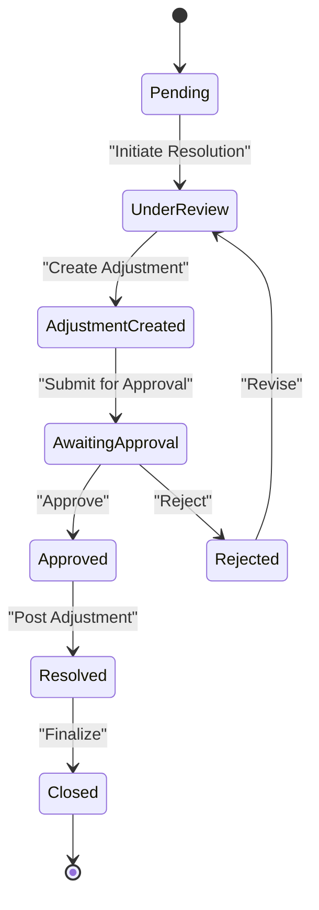

**Diagram sources**
- [LedgerModal.tsx](file://src/ledger/LedgerModal.tsx)
- [hooks.ts](file://src/ledger/hooks.ts)

**Section sources**
- [LedgerModal.tsx](file://src/ledger/LedgerModal.tsx)
- [hooks.ts](file://src/ledger/hooks.ts)

### Automatic Reconciliation Rules
- Purpose: Automate matching based on configurable criteria.
- Rule Types:
  - Exact amount and date window.
  - Reference number pattern matching.
  - Payee name similarity thresholds.
  - Multi-currency normalization with exchange rates.
- Configuration: Stored centrally and applied during batch processing.

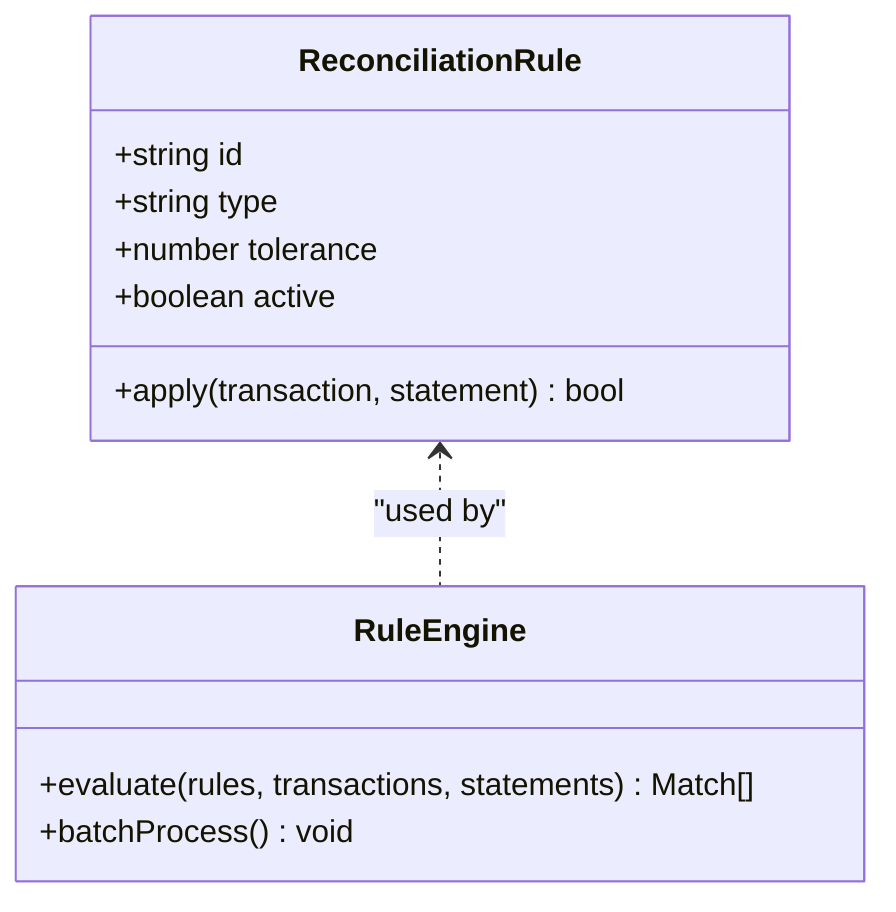

**Diagram sources**
- [hooks.ts](file://src/ledger/hooks.ts)
- [schemas.ts](file://src/ledger/schemas.ts)

**Section sources**
- [hooks.ts](file://src/ledger/hooks.ts)
- [schemas.ts](file://src/ledger/schemas.ts)

### Manual Adjustment Processes
- Purpose: Allow authorized users to correct discrepancies not resolved automatically.
- Workflow:
  - Create adjustment entry with reason codes.
  - Validate against policies and limits.
  - Submit for approval if required.
  - Post to ledger upon approval.

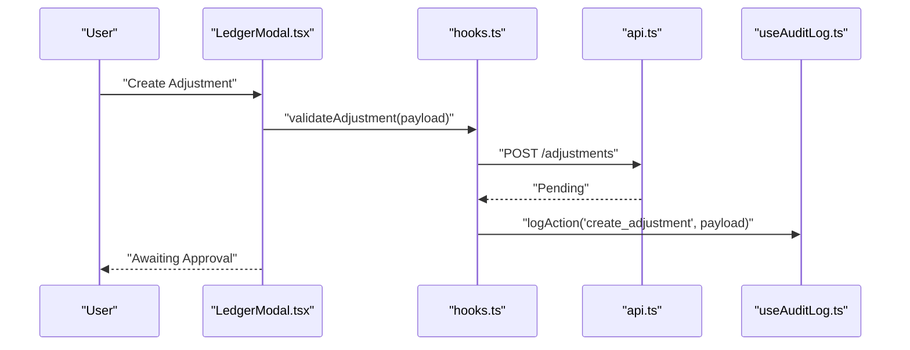

**Diagram sources**
- [LedgerModal.tsx](file://src/ledger/LedgerModal.tsx)
- [hooks.ts](file://src/ledger/hooks.ts)
- [api.ts](file://src/ledger/api.ts)
- [useAuditLog.ts](file://src/hooks/useAuditLog.ts)

**Section sources**
- [LedgerModal.tsx](file://src/ledger/LedgerModal.tsx)
- [hooks.ts](file://src/ledger/hooks.ts)
- [api.ts](file://src/ledger/api.ts)
- [useAuditLog.ts](file://src/hooks/useAuditLog.ts)

### Reconciliation Status Tracking
- Purpose: Provide visibility into reconciliation progress and outcomes.
- States: Pending, In Progress, Matched, Unmatched, Adjusted, Approved, Closed.
- Indicators: Dashboard badges and drill-down views.

**Section sources**
- [LedgerDashboard.tsx](file://src/ledger/LedgerDashboard.tsx)
- [hooks.ts](file://src/ledger/hooks.ts)

### Variance Analysis Tools
- Purpose: Quantify differences and trends over periods.
- Features:
  - Variance by account, category, and currency.
  - Aging buckets for unmatched items.
  - Exportable reports for further analysis.

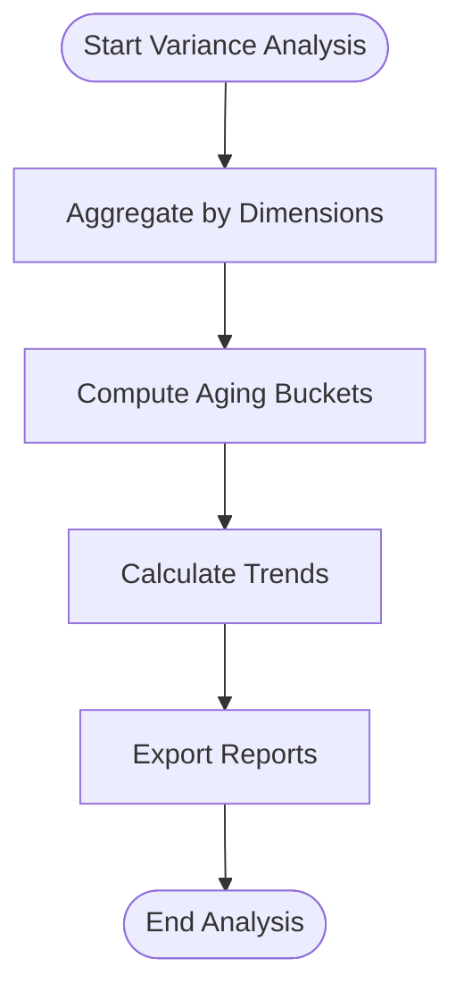

**Diagram sources**
- [utils.ts](file://src/ledger/utils.ts)
- [hooks.ts](file://src/ledger/hooks.ts)

**Section sources**
- [utils.ts](file://src/ledger/utils.ts)
- [hooks.ts](file://src/ledger/hooks.ts)

### Aging Reports
- Purpose: Track age of unmatched or partially reconciled items.
- Buckets: Current, 1–30 days, 31–60 days, 61–90 days, 90+ days.
- Usage: Prioritize resolution efforts and assess risk exposure.

**Section sources**
- [utils.ts](file://src/ledger/utils.ts)
- [hooks.ts](file://src/ledger/hooks.ts)

### Exception Handling Mechanisms
- Purpose: Gracefully manage errors during reconciliation operations.
- Strategies:
  - Input validation failures return actionable messages.
  - Network errors trigger retries and fallback states.
  - Policy violations block unsafe actions and log warnings.

**Section sources**
- [schemas.ts](file://src/ledger/schemas.ts)
- [hooks.ts](file://src/ledger/hooks.ts)

### Examples
- Bank Reconciliation Example:
  - Import bank statement, run auto-match, review candidates, post adjustments, approve, close.
- Inter-Account Transfer Example:
  - Create transfer entry, validate counterpart account, reconcile both sides, mark balanced.
- Accrual Adjustment Example:
  - Record accrual entry, link to period, reconcile against expected accrual schedule, adjust if needed.

[No sources needed since this section provides conceptual examples without analyzing specific files]

### Approval Workflows
- Purpose: Enforce governance for sensitive reconciliation actions.
- Flow:
  - Submission triggers workflow based on role and threshold.
  - Approvers review details and comments.
  - Outcome updates status and posts adjustments.

**Section sources**
- [LedgerModal.tsx](file://src/ledger/LedgerModal.tsx)
- [hooks.ts](file://src/ledger/hooks.ts)

### Audit Trails and Compliance Reporting
- Purpose: Maintain immutable records of actions for audits and compliance.
- Implementation:
  - Audit hook logs actions with context.
  - SQL schema supports audit table structure.
  - Reports can be generated from audit data.

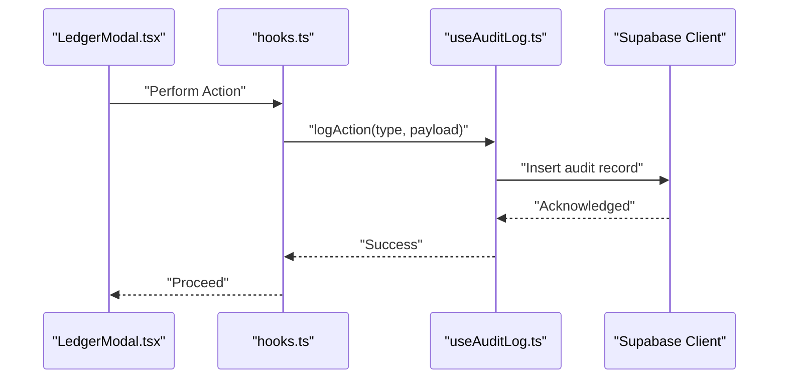

**Diagram sources**
- [LedgerModal.tsx](file://src/ledger/LedgerModal.tsx)
- [hooks.ts](file://src/ledger/hooks.ts)
- [useAuditLog.ts](file://src/hooks/useAuditLog.ts)
- [database-add-audit-log.sql](file://src/database-add-audit-log.sql)
- [supabase.ts](file://src/supabase.ts)

**Section sources**
- [useAuditLog.ts](file://src/hooks/useAuditLog.ts)
- [database-add-audit-log.sql](file://src/database-add-audit-log.sql)
- [supabase.ts](file://src/supabase.ts)

### Integration with Banking APIs and Statement Import
- Purpose: Automate ingestion of bank statements and synchronize with internal ledgers.
- Capabilities:
  - Import CSV/OFX formats.
  - Map fields to internal schema.
  - Trigger reconciliation pipeline after import.

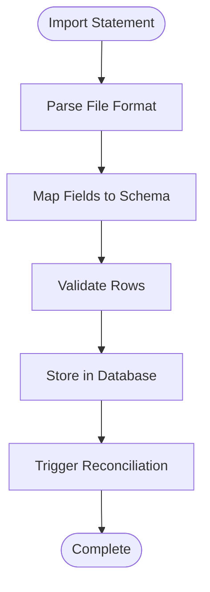

**Diagram sources**
- [api.ts](file://src/ledger/api.ts)
- [hooks.ts](file://src/ledger/hooks.ts)
- [schemas.ts](file://src/ledger/schemas.ts)

**Section sources**
- [api.ts](file://src/ledger/api.ts)
- [hooks.ts](file://src/ledger/hooks.ts)
- [schemas.ts](file://src/ledger/schemas.ts)

## Dependency Analysis
The reconciliation feature depends on:
- UI components for interaction and visualization
- Hooks for data orchestration
- API layer for persistence and cross-cutting concerns
- Audit logging for compliance
- Supabase client for database operations

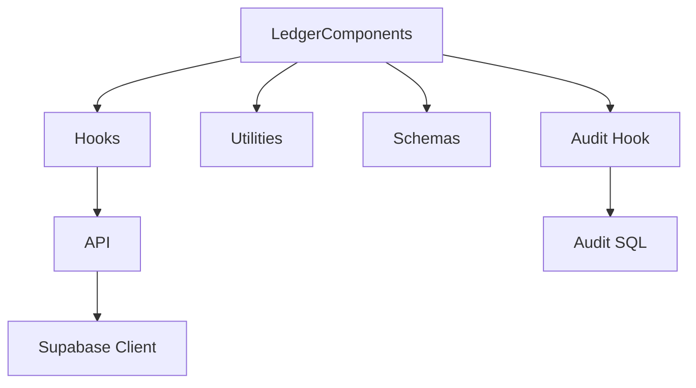

**Diagram sources**
- [LedgerDashboard.tsx](file://src/ledger/LedgerDashboard.tsx)
- [LedgerModal.tsx](file://src/ledger/LedgerModal.tsx)
- [OpeningBalanceTab.tsx](file://src/ledger/OpeningBalanceTab.tsx)
- [hooks.ts](file://src/ledger/hooks.ts)
- [api.ts](file://src/ledger/api.ts)
- [utils.ts](file://src/ledger/utils.ts)
- [schemas.ts](file://src/ledger/schemas.ts)
- [useAuditLog.ts](file://src/hooks/useAuditLog.ts)
- [database-add-audit-log.sql](file://src/database-add-audit-log.sql)
- [supabase.ts](file://src/supabase.ts)

**Section sources**
- [hooks.ts](file://src/ledger/hooks.ts)
- [api.ts](file://src/ledger/api.ts)
- [utils.ts](file://src/ledger/utils.ts)
- [schemas.ts](file://src/ledger/schemas.ts)
- [useAuditLog.ts](file://src/hooks/useAuditLog.ts)
- [database-add-audit-log.sql](file://src/database-add-audit-log.sql)
- [supabase.ts](file://src/supabase.ts)

## Performance Considerations
- Batch processing for large statement imports to avoid UI blocking.
- Pagination and lazy loading for long lists of transactions.
- Caching strategies for frequently accessed reference data (rules, accounts).
- Efficient queries with appropriate indexes on statement and transaction tables.
- Debounced search and filtering in reconciliation UI.

[No sources needed since this section provides general guidance]

## Troubleshooting Guide
Common issues and resolutions:
- Validation Errors: Check input schemas and ensure required fields are provided.
- Network Failures: Verify Supabase client configuration and retry failed requests.
- Policy Violations: Review approval thresholds and user permissions.
- Audit Gaps: Confirm audit logging is enabled and records are being inserted.

**Section sources**
- [schemas.ts](file://src/ledger/schemas.ts)
- [hooks.ts](file://src/ledger/hooks.ts)
- [useAuditLog.ts](file://src/hooks/useAuditLog.ts)

## Conclusion
The Account Reconciliation implementation combines robust UI components, well-structured hooks, validated schemas, and comprehensive audit logging to deliver a reliable reconciliation experience. Automatic rules streamline matching, while manual adjustments and approvals ensure governance. Variance analysis and aging reports support proactive management, and integration points enable automated statement ingestion.

[No sources needed since this section summarizes without analyzing specific files]

## Appendices
- Best Practices:
  - Define clear tolerance thresholds and rule sets.
  - Regularly review unmatched items and aging reports.
  - Maintain up-to-date exchange rates for multi-currency reconciliation.
  - Ensure audit logs are retained per compliance requirements.

[No sources needed since this section provides general guidance]