# Accounting Ledger

<cite>
**Referenced Files in This Document**
- [ACCOUNTING_COA_DESIGN.md](file://ACCOUNTING_COA_DESIGN.md)
- [src/ledger/LedgerDashboard.tsx](file://src/ledger/LedgerDashboard.tsx)
- [src/ledger/LedgerModal.tsx](file://src/ledger/LedgerModal.tsx)
- [src/ledger/OpeningBalanceTab.tsx](file://src/ledger/OpeningBalanceTab.tsx)
- [src/ledger/api.ts](file://src/ledger/api.ts)
- [src/ledger/hooks.ts](file://src/ledger/hooks.ts)
- [src/ledger/schemas.ts](file://src/ledger/schemas.ts)
- [src/ledger/utils.ts](file://src/ledger/utils.ts)
- [src/pages/accounting/index.tsx](file://src/pages/accounting/index.tsx)
- [src/lib/currency.ts](file://src/lib/currency.ts)
- [src/database/subcontractor_ledger_complete.sql](file://src/database/subcontractor_ledger_complete.sql)
- [src/database/measurement_sheet_system.sql](file://src/database/measurement_sheet_system.sql)
- [supabase/migrations/20240101000000_create_accounting_tables.sql](file://supabase/migrations/20240101000000_create_accounting_tables.sql)
- [supabase/migrations/20240101000001_create_journal_entries.sql](file://supabase/migrations/20240101000001_create_journal_entries.sql)
- [supabase/migrations/20240101000002_create_trial_balance.sql](file://supabase/migrations/20240101000002_create_trial_balance.sql)
- [supabase/migrations/20240101000003_create_financial_statements.sql](file://supabase/migrations/20240101000003_create_financial_statements.sql)
- [supabase/migrations/20240101000004_create_bank_reconciliation.sql](file://supabase/migrations/20240101000004_create_bank_reconciliation.sql)
- [supabase/migrations/20240101000005_create_audit_trail.sql](file://supabase/migrations/20240101000005_create_audit_trail.sql)
- [supabase/migrations/20240101000006_create_period_closing.sql](file://supabase/migrations/20240101000006_create_period_closing.sql)
- [supabase/migrations/20240101000007_create_multi_currency.sql](file://supabase/migrations/20240101000007_create_multi_currency.sql)
- [supabase/migrations/20240101000008_create_consolidated_reporting.sql](file://supabase/migrations/20240101000008_create_consolidated_reporting.sql)
</cite>

## Table of Contents
1. [Introduction](#introduction)
2. [Project Structure](#project-structure)
3. [Core Components](#core-components)
4. [Architecture Overview](#architecture-overview)
5. [Detailed Component Analysis](#detailed-component-analysis)
6. [Dependency Analysis](#dependency-analysis)
7. [Performance Considerations](#performance-considerations)
8. [Troubleshooting Guide](#troubleshooting-guide)
9. [Conclusion](#conclusion)
10. [Appendices](#appendices)

## Introduction
This document provides comprehensive documentation for the Accounting Ledger system, covering chart of accounts setup, double-entry bookkeeping principles, journal entries, day book maintenance, trial balance generation, financial statement preparation, account reconciliation, bank statement matching, variance analysis, custom account structures, multi-currency accounting, consolidated reporting, audit trail maintenance, period closing procedures, regulatory compliance reporting, and integration with external accounting software and ERP systems. The content is grounded in the repository’s accounting module implementation and database schema design.

## Project Structure
The Accounting Ledger feature is implemented as a dedicated module under src/ledger with supporting pages, utilities, types, and API hooks. Database schemas are defined in Supabase migrations and SQL files. Key areas include:
- UI components for ledger dashboard, modal entry, and opening balances
- API layer for ledger operations
- Hooks for data fetching and state management
- Schemas and utilities for validation and calculations
- Pages integrating ledger into the application navigation
- Currency handling utilities
- Database migrations defining core accounting tables and reports

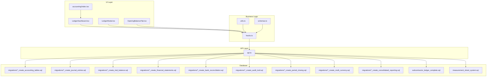

**Diagram sources**
- [src/ledger/LedgerDashboard.tsx](file://src/ledger/LedgerDashboard.tsx)
- [src/ledger/LedgerModal.tsx](file://src/ledger/LedgerModal.tsx)
- [src/ledger/OpeningBalanceTab.tsx](file://src/ledger/OpeningBalanceTab.tsx)
- [src/ledger/hooks.ts](file://src/ledger/hooks.ts)
- [src/ledger/utils.ts](file://src/ledger/utils.ts)
- [src/ledger/schemas.ts](file://src/ledger/schemas.ts)
- [src/ledger/api.ts](file://src/ledger/api.ts)
- [src/pages/accounting/index.tsx](file://src/pages/accounting/index.tsx)
- [supabase/migrations/20240101000000_create_accounting_tables.sql](file://supabase/migrations/20240101000000_create_accounting_tables.sql)
- [supabase/migrations/20240101000001_create_journal_entries.sql](file://supabase/migrations/20240101000001_create_journal_entries.sql)
- [supabase/migrations/20240101000002_create_trial_balance.sql](file://supabase/migrations/20240101000002_create_trial_balance.sql)
- [supabase/migrations/20240101000003_create_financial_statements.sql](file://supabase/migrations/20240101000003_create_financial_statements.sql)
- [supabase/migrations/20240101000004_create_bank_reconciliation.sql](file://supabase/migrations/20240101000004_create_bank_reconciliation.sql)
- [supabase/migrations/20240101000005_create_audit_trail.sql](file://supabase/migrations/20240101000005_create_audit_trail.sql)
- [supabase/migrations/20240101000006_create_period_closing.sql](file://supabase/migrations/20240101000006_create_period_closing.sql)
- [supabase/migrations/20240101000007_create_multi_currency.sql](file://supabase/migrations/20240101000007_create_multi_currency.sql)
- [supabase/migrations/20240101000008_create_consolidated_reporting.sql](file://supabase/migrations/20240101000008_create_consolidated_reporting.sql)
- [src/database/subcontractor_ledger_complete.sql](file://src/database/subcontractor_ledger_complete.sql)
- [src/database/measurement_sheet_system.sql](file://src/database/measurement_sheet_system.sql)

**Section sources**
- [src/ledger/LedgerDashboard.tsx](file://src/ledger/LedgerDashboard.tsx)
- [src/ledger/LedgerModal.tsx](file://src/ledger/LedgerModal.tsx)
- [src/ledger/OpeningBalanceTab.tsx](file://src/ledger/OpeningBalanceTab.tsx)
- [src/ledger/hooks.ts](file://src/ledger/hooks.ts)
- [src/ledger/utils.ts](file://src/ledger/utils.ts)
- [src/ledger/schemas.ts](file://src/ledger/schemas.ts)
- [src/ledger/api.ts](file://src/ledger/api.ts)
- [src/pages/accounting/index.tsx](file://src/pages/accounting/index.tsx)
- [src/lib/currency.ts](file://src/lib/currency.ts)
- [supabase/migrations/20240101000000_create_accounting_tables.sql](file://supabase/migrations/20240101000000_create_accounting_tables.sql)
- [supabase/migrations/20240101000001_create_journal_entries.sql](file://supabase/migrations/20240101000001_create_journal_entries.sql)
- [supabase/migrations/20240101000002_create_trial_balance.sql](file://supabase/migrations/20240101000002_create_trial_balance.sql)
- [supabase/migrations/20240101000003_create_financial_statements.sql](file://supabase/migrations/20240101000003_create_financial_statements.sql)
- [supabase/migrations/20240101000004_create_bank_reconciliation.sql](file://supabase/migrations/20240101000004_create_bank_reconciliation.sql)
- [supabase/migrations/20240101000005_create_audit_trail.sql](file://supabase/migrations/20240101000005_create_audit_trail.sql)
- [supabase/migrations/20240101000006_create_period_closing.sql](file://supabase/migrations/20240101000006_create_period_closing.sql)
- [supabase/migrations/20240101000007_create_multi_currency.sql](file://supabase/migrations/20240101000007_create_multi_currency.sql)
- [supabase/migrations/20240101000008_create_consolidated_reporting.sql](file://supabase/migrations/20240101000008_create_consolidated_reporting.sql)
- [src/database/subcontractor_ledger_complete.sql](file://src/database/subcontractor_ledger_complete.sql)
- [src/database/measurement_sheet_system.sql](file://src/database/measurement_sheet_system.sql)

## Core Components
- Chart of Accounts Setup
  - Defines account categories, numbering, and hierarchy to support flexible reporting and multi-entity consolidation.
  - Includes configuration for currency behavior and tax mapping where applicable.
  - Refer to the design document for structure and rules.

- Double-Entry Bookkeeping Principles
  - Every transaction posts equal debits and credits across accounts.
  - Journal entries enforce balance constraints and reference source documents.
  - Period locks prevent retroactive changes after closure.

- Journal Entries and Day Book Maintenance
  - Journal entries capture date, accounts, amounts, currencies, and references.
  - Day book aggregates postings by date and supports filtering by entity, project, or document type.
  - Validation ensures balanced entries and correct account types.

- Trial Balance Generation
  - Aggregates account balances per period and validates equality of total debits and credits.
  - Supports multi-currency conversion using configured rates.

- Financial Statement Preparation
  - Income Statement, Balance Sheet, and Cash Flow statements derived from account balances and mappings.
  - Consolidation capabilities for multiple entities or cost centers.

- Account Reconciliation and Bank Statement Matching
  - Reconciles ledger balances against bank statements.
  - Matches transactions via reference numbers, dates, and amounts; flags unmatched items for review.

- Variance Analysis
  - Compares actuals vs budgets or prior periods.
  - Highlights significant variances with drill-down to source entries.

- Custom Account Structures
  - Hierarchical accounts with parent-child relationships.
  - Dimensional tagging (e.g., project, department) for granular reporting.

- Multi-Currency Accounting
  - Stores original and converted amounts.
  - Uses exchange rates at transaction date for accurate reporting.

- Consolidated Reporting
  - Aggregates balances across entities with intercompany eliminations.
  - Supports group-level views and drill-through to subsidiary details.

- Audit Trail Maintenance
  - Immutable logs of all accounting changes including user, timestamp, and diff metadata.

- Period Closing Procedures
  - Locks periods to prevent edits post-closure.
  - Generates closing entries and summary reports.

- Regulatory Compliance Reporting
  - Exports formatted reports aligned with local standards.
  - Ensures data integrity and traceability for audits.

- Integration with External Accounting Software and ERP Systems
  - APIs and export/import routines for synchronization with third-party systems.
  - Mapping configurations for account codes and dimensions.

**Section sources**
- [ACCOUNTING_COA_DESIGN.md](file://ACCOUNTING_COA_DESIGN.md)
- [supabase/migrations/20240101000000_create_accounting_tables.sql](file://supabase/migrations/20240101000000_create_accounting_tables.sql)
- [supabase/migrations/20240101000001_create_journal_entries.sql](file://supabase/migrations/20240101000001_create_journal_entries.sql)
- [supabase/migrations/20240101000002_create_trial_balance.sql](file://supabase/migrations/20240101000002_create_trial_balance.sql)
- [supabase/migrations/20240101000003_create_financial_statements.sql](file://supabase/migrations/20240101000003_create_financial_statements.sql)
- [supabase/migrations/20240101000004_create_bank_reconciliation.sql](file://supabase/migrations/20240101000004_create_bank_reconciliation.sql)
- [supabase/migrations/20240101000005_create_audit_trail.sql](file://supabase/migrations/20240101000005_create_audit_trail.sql)
- [supabase/migrations/20240101000006_create_period_closing.sql](file://supabase/migrations/20240101000006_create_period_closing.sql)
- [supabase/migrations/20240101000007_create_multi_currency.sql](file://supabase/migrations/20240101000007_create_multi_currency.sql)
- [supabase/migrations/20240101000008_create_consolidated_reporting.sql](file://supabase/migrations/20240101000008_create_consolidated_reporting.sql)

## Architecture Overview
The Accounting Ledger architecture separates concerns across UI, business logic, API, and database layers. UI components orchestrate user interactions and display results. Business logic encapsulates validation, calculations, and workflow steps. The API layer exposes endpoints for ledger operations. Database migrations define persistent structures for accounts, journals, reconciliations, audit trails, and reports.

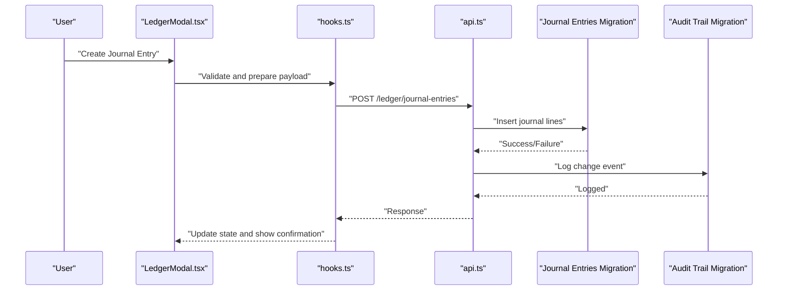

**Diagram sources**
- [src/ledger/LedgerModal.tsx](file://src/ledger/LedgerModal.tsx)
- [src/ledger/hooks.ts](file://src/ledger/hooks.ts)
- [src/ledger/api.ts](file://src/ledger/api.ts)
- [supabase/migrations/20240101000001_create_journal_entries.sql](file://supabase/migrations/20240101000001_create_journal_entries.sql)
- [supabase/migrations/20240101000005_create_audit_trail.sql](file://supabase/migrations/20240101000005_create_audit_trail.sql)

**Section sources**
- [src/ledger/LedgerModal.tsx](file://src/ledger/LedgerModal.tsx)
- [src/ledger/hooks.ts](file://src/ledger/hooks.ts)
- [src/ledger/api.ts](file://src/ledger/api.ts)
- [supabase/migrations/20240101000001_create_journal_entries.sql](file://supabase/migrations/20240101000001_create_journal_entries.sql)
- [supabase/migrations/20240101000005_create_audit_trail.sql](file://supabase/migrations/20240101000005_create_audit_trail.sql)

## Detailed Component Analysis

### Chart of Accounts Setup
- Purpose: Define hierarchical accounts with categories, numbering schemes, and attributes such as currency behavior and tax applicability.
- Implementation highlights:
  - Schema defines account identifiers, parent-child relationships, and metadata.
  - UI allows creation and editing of accounts with validation rules.
  - Design document outlines best practices for structuring accounts and enabling reporting.

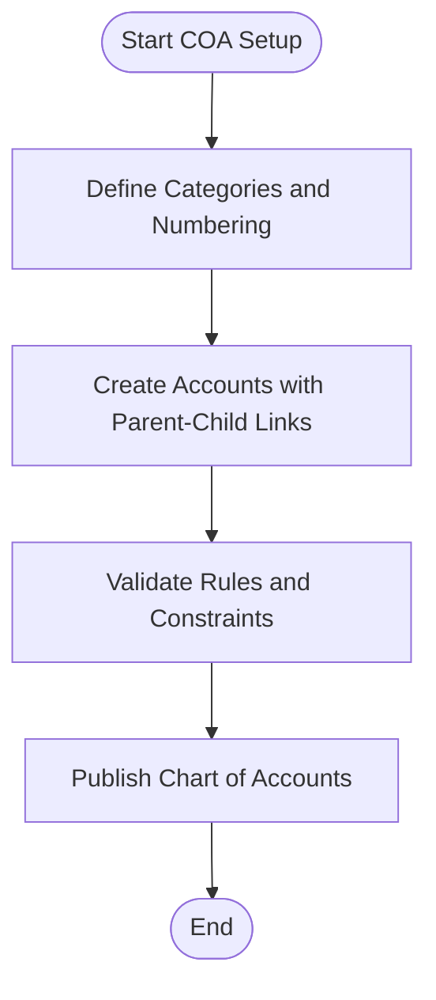

**Diagram sources**
- [ACCOUNTING_COA_DESIGN.md](file://ACCOUNTING_COA_DESIGN.md)
- [supabase/migrations/20240101000000_create_accounting_tables.sql](file://supabase/migrations/20240101000000_create_accounting_tables.sql)

**Section sources**
- [ACCOUNTING_COA_DESIGN.md](file://ACCOUNTING_COA_DESIGN.md)
- [supabase/migrations/20240101000000_create_accounting_tables.sql](file://supabase/migrations/20240101000000_create_accounting_tables.sql)

### Journal Entries and Day Book Maintenance
- Purpose: Record balanced double-entry transactions and maintain a chronological day book.
- Implementation highlights:
  - Journal entries store debit and credit lines with references to source documents.
  - Day book queries aggregate postings by date and filters.
  - Validation enforces balance and account type compatibility.

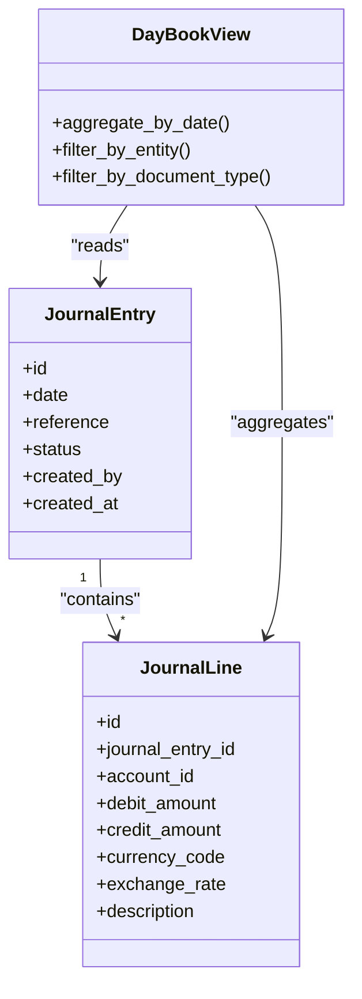

**Diagram sources**
- [supabase/migrations/20240101000001_create_journal_entries.sql](file://supabase/migrations/20240101000001_create_journal_entries.sql)

**Section sources**
- [supabase/migrations/20240101000001_create_journal_entries.sql](file://supabase/migrations/20240101000001_create_journal_entries.sql)

### Trial Balance Generation
- Purpose: Summarize account balances per period and ensure debits equal credits.
- Implementation highlights:
  - Aggregation queries compute net balances per account.
  - Multi-currency conversion uses configured exchange rates.
  - Reports provide totals and discrepancies.

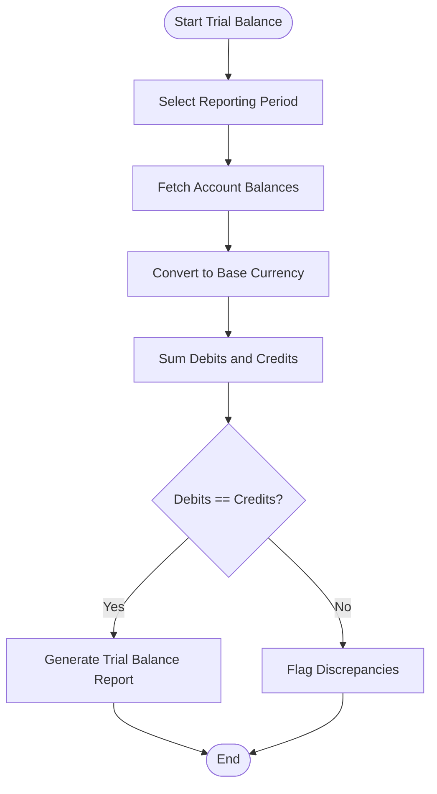

**Diagram sources**
- [supabase/migrations/20240101000002_create_trial_balance.sql](file://supabase/migrations/20240101000002_create_trial_balance.sql)
- [supabase/migrations/20240101000007_create_multi_currency.sql](file://supabase/migrations/20240101000007_create_multi_currency.sql)

**Section sources**
- [supabase/migrations/20240101000002_create_trial_balance.sql](file://supabase/migrations/20240101000002_create_trial_balance.sql)
- [supabase/migrations/20240101000007_create_multi_currency.sql](file://supabase/migrations/20240101000007_create_multi_currency.sql)

### Financial Statement Preparation
- Purpose: Produce Income Statement, Balance Sheet, and Cash Flow statements from account balances.
- Implementation highlights:
  - Mapping rules link accounts to statement line items.
  - Aggregation and formatting produce final reports.
  - Consolidation supports multi-entity views.

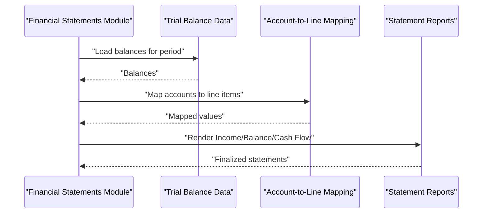

**Diagram sources**
- [supabase/migrations/20240101000003_create_financial_statements.sql](file://supabase/migrations/20240101000003_create_financial_statements.sql)
- [supabase/migrations/20240101000008_create_consolidated_reporting.sql](file://supabase/migrations/20240101000008_create_consolidated_reporting.sql)

**Section sources**
- [supabase/migrations/20240101000003_create_financial_statements.sql](file://supabase/migrations/20240101000003_create_financial_statements.sql)
- [supabase/migrations/20240101000008_create_consolidated_reporting.sql](file://supabase/migrations/20240101000008_create_consolidated_reporting.sql)

### Account Reconciliation and Bank Statement Matching
- Purpose: Reconcile ledger balances with bank statements and match transactions.
- Implementation highlights:
  - Import bank statements and align with ledger entries.
  - Matching algorithms use reference IDs, dates, and amounts.
  - Unmatched items flagged for manual review.

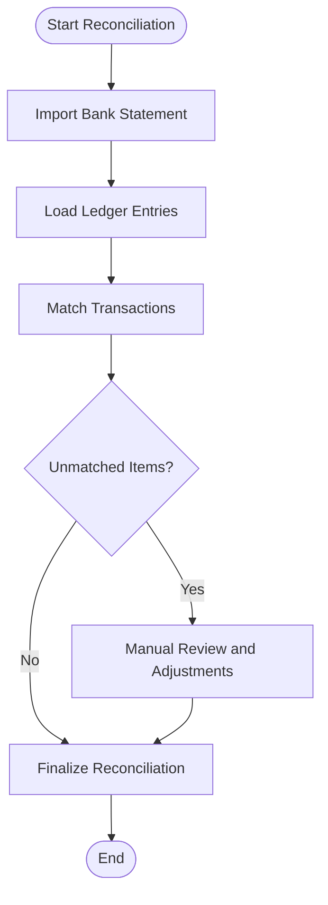

**Diagram sources**
- [supabase/migrations/20240101000004_create_bank_reconciliation.sql](file://supabase/migrations/20240101000004_create_bank_reconciliation.sql)

**Section sources**
- [supabase/migrations/20240101000004_create_bank_reconciliation.sql](file://supabase/migrations/20240101000004_create_bank_reconciliation.sql)

### Variance Analysis
- Purpose: Compare actuals versus budgets or prior periods and highlight significant differences.
- Implementation highlights:
  - Aggregates actuals from ledger and compares to planned figures.
  - Calculates variance percentages and thresholds.
  - Provides drill-down to underlying entries.

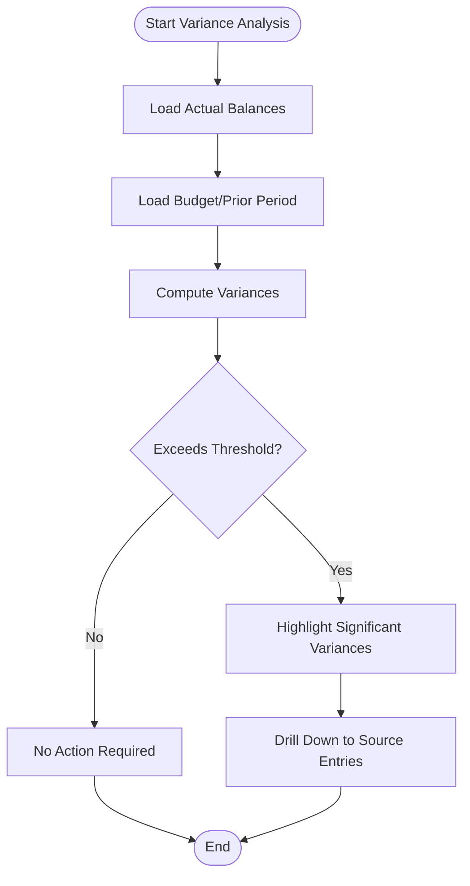

[No diagram sources since this section describes conceptual logic without direct file mapping]

**Section sources**
- [supabase/migrations/20240101000002_create_trial_balance.sql](file://supabase/migrations/20240101000002_create_trial_balance.sql)
- [supabase/migrations/20240101000003_create_financial_statements.sql](file://supabase/migrations/20240101000003_create_financial_statements.sql)

### Custom Account Structures
- Purpose: Support hierarchical accounts and dimensional tagging for detailed reporting.
- Implementation highlights:
  - Parent-child relationships enable roll-ups.
  - Dimensions (project, department) allow segmented views.
  - Configuration drives report layouts and filters.

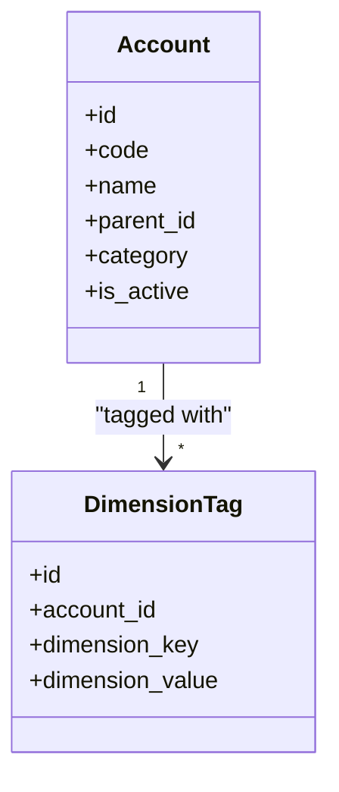

**Diagram sources**
- [supabase/migrations/20240101000000_create_accounting_tables.sql](file://supabase/migrations/20240101000000_create_accounting_tables.sql)

**Section sources**
- [supabase/migrations/20240101000000_create_accounting_tables.sql](file://supabase/migrations/20240101000000_create_accounting_tables.sql)

### Multi-Currency Accounting
- Purpose: Handle transactions in multiple currencies with accurate conversions.
- Implementation highlights:
  - Store original and base currency amounts.
  - Use exchange rates at transaction date.
  - Ensure consistent reporting across currencies.

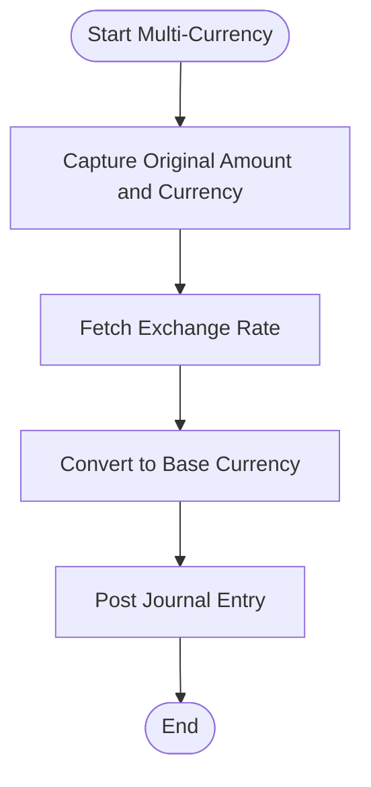

**Diagram sources**
- [supabase/migrations/20240101000007_create_multi_currency.sql](file://supabase/migrations/20240101000007_create_multi_currency.sql)
- [src/lib/currency.ts](file://src/lib/currency.ts)

**Section sources**
- [supabase/migrations/20240101000007_create_multi_currency.sql](file://supabase/migrations/20240101000007_create_multi_currency.sql)
- [src/lib/currency.ts](file://src/lib/currency.ts)

### Consolidated Reporting
- Purpose: Aggregate balances across entities and eliminate intercompany transactions.
- Implementation highlights:
  - Entity grouping and elimination rules.
  - Roll-up computations for group-level statements.
  - Drill-through to subsidiary details.

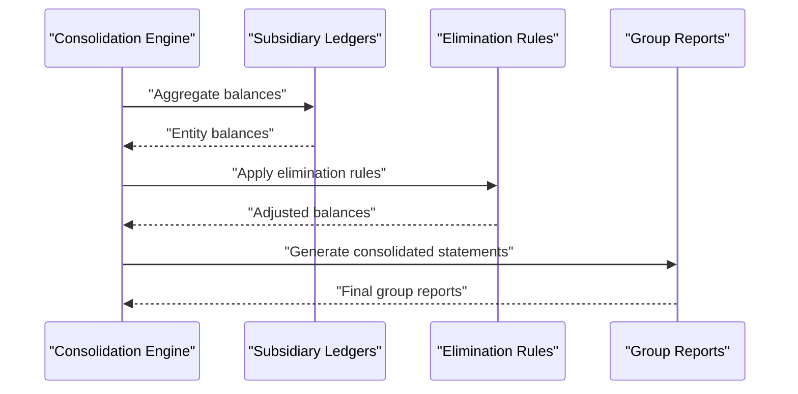

**Diagram sources**
- [supabase/migrations/20240101000008_create_consolidated_reporting.sql](file://supabase/migrations/20240101000008_create_consolidated_reporting.sql)

**Section sources**
- [supabase/migrations/20240101000008_create_consolidated_reporting.sql](file://supabase/migrations/20240101000008_create_consolidated_reporting.sql)

### Audit Trail Maintenance
- Purpose: Maintain immutable logs of all accounting changes for compliance and auditing.
- Implementation highlights:
  - Logs capture user, timestamp, action, and affected records.
  - Prevents modification of historical entries.
  - Supports export for auditors.

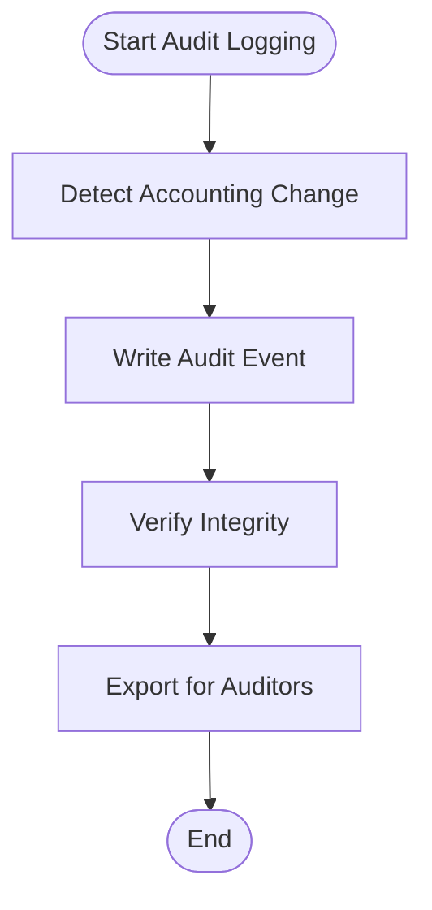

**Diagram sources**
- [supabase/migrations/20240101000005_create_audit_trail.sql](file://supabase/migrations/20240101000005_create_audit_trail.sql)

**Section sources**
- [supabase/migrations/20240101000005_create_audit_trail.sql](file://supabase/migrations/20240101000005_create_audit_trail.sql)

### Period Closing Procedures
- Purpose: Close accounting periods and prevent retroactive edits.
- Implementation highlights:
  - Locks periods upon closure.
  - Generates closing entries and summaries.
  - Enforces access controls for closed periods.

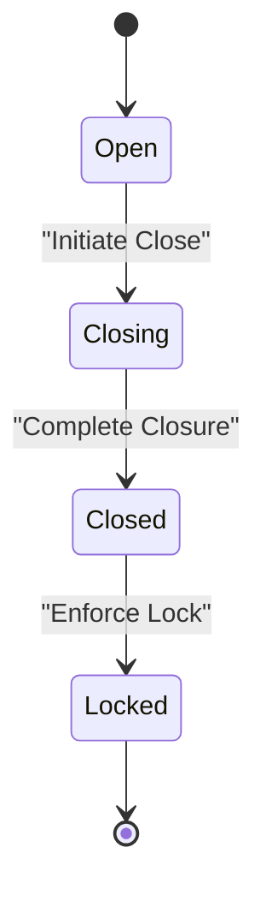

**Diagram sources**
- [supabase/migrations/20240101000006_create_period_closing.sql](file://supabase/migrations/20240101000006_create_period_closing.sql)

**Section sources**
- [supabase/migrations/20240101000006_create_period_closing.sql](file://supabase/migrations/20240101000006_create_period_closing.sql)

### Regulatory Compliance Reporting
- Purpose: Produce reports aligned with local regulatory requirements.
- Implementation highlights:
  - Standardized templates and formats.
  - Data integrity checks and validations.
  - Export capabilities for submission.

[No diagram sources since this section focuses on compliance processes without direct code mapping]

**Section sources**
- [supabase/migrations/20240101000003_create_financial_statements.sql](file://supabase/migrations/20240101000003_create_financial_statements.sql)
- [supabase/migrations/20240101000005_create_audit_trail.sql](file://supabase/migrations/20240101000005_create_audit_trail.sql)

### Integration with External Accounting Software and ERP Systems
- Purpose: Synchronize ledger data with external systems.
- Implementation highlights:
  - API endpoints for import/export.
  - Mapping configurations for account codes and dimensions.
  - Error handling and retry mechanisms.

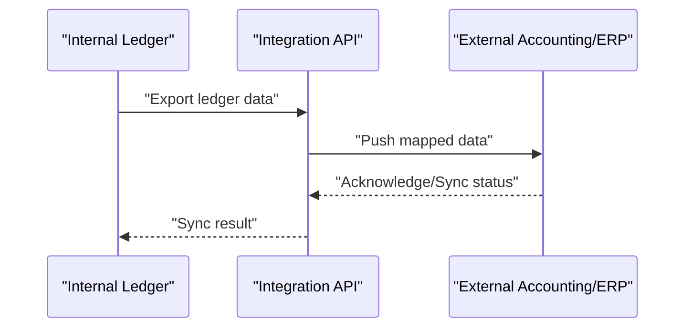

[No diagram sources since this section describes integration patterns without direct file mapping]

**Section sources**
- [src/ledger/api.ts](file://src/ledger/api.ts)
- [supabase/migrations/20240101000001_create_journal_entries.sql](file://supabase/migrations/20240101000001_create_journal_entries.sql)

## Dependency Analysis
The ledger module depends on UI components, hooks, API endpoints, and database migrations. Dependencies flow from UI to hooks to API to database layers. Cross-module integrations include currency utilities and related ledger schemas.

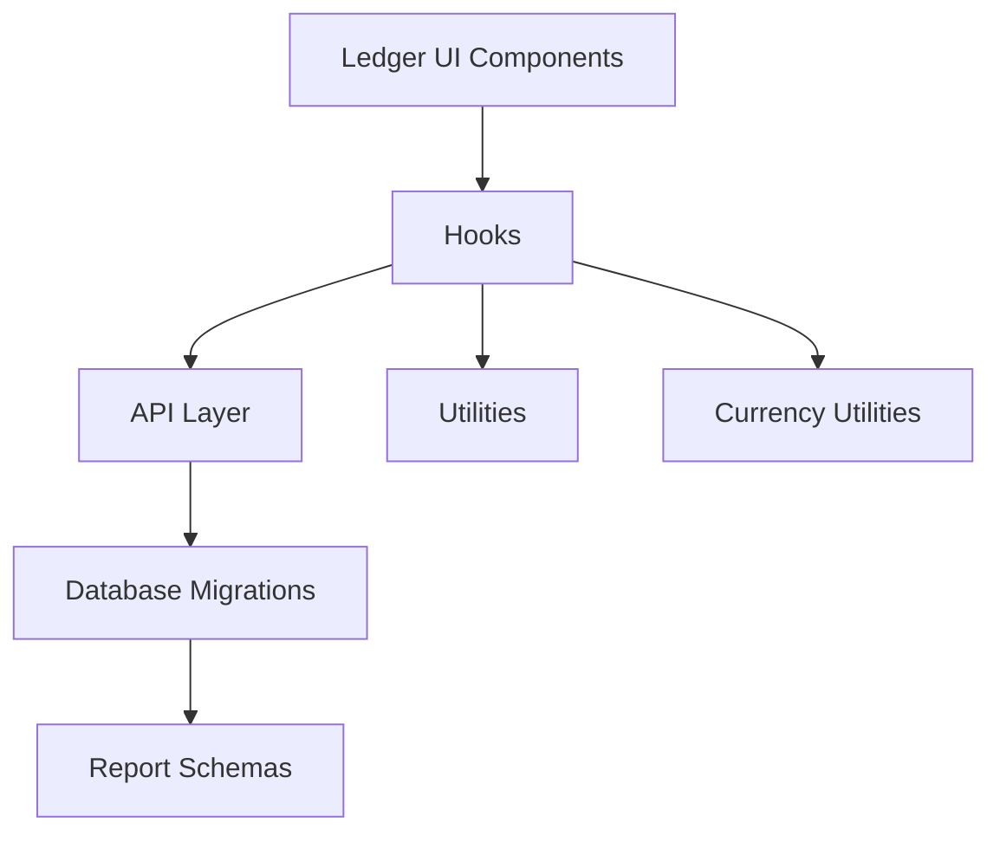

**Diagram sources**
- [src/ledger/LedgerDashboard.tsx](file://src/ledger/LedgerDashboard.tsx)
- [src/ledger/LedgerModal.tsx](file://src/ledger/LedgerModal.tsx)
- [src/ledger/hooks.ts](file://src/ledger/hooks.ts)
- [src/ledger/api.ts](file://src/ledger/api.ts)
- [src/ledger/utils.ts](file://src/ledger/utils.ts)
- [src/lib/currency.ts](file://src/lib/currency.ts)
- [supabase/migrations/20240101000000_create_accounting_tables.sql](file://supabase/migrations/20240101000000_create_accounting_tables.sql)
- [supabase/migrations/20240101000001_create_journal_entries.sql](file://supabase/migrations/20240101000001_create_journal_entries.sql)
- [supabase/migrations/20240101000002_create_trial_balance.sql](file://supabase/migrations/20240101000002_create_trial_balance.sql)
- [supabase/migrations/20240101000003_create_financial_statements.sql](file://supabase/migrations/20240101000003_create_financial_statements.sql)

**Section sources**
- [src/ledger/LedgerDashboard.tsx](file://src/ledger/LedgerDashboard.tsx)
- [src/ledger/LedgerModal.tsx](file://src/ledger/LedgerModal.tsx)
- [src/ledger/hooks.ts](file://src/ledger/hooks.ts)
- [src/ledger/api.ts](file://src/ledger/api.ts)
- [src/ledger/utils.ts](file://src/ledger/utils.ts)
- [src/lib/currency.ts](file://src/lib/currency.ts)
- [supabase/migrations/20240101000000_create_accounting_tables.sql](file://supabase/migrations/20240101000000_create_accounting_tables.sql)
- [supabase/migrations/20240101000001_create_journal_entries.sql](file://supabase/migrations/20240101000001_create_journal_entries.sql)
- [supabase/migrations/20240101000002_create_trial_balance.sql](file://supabase/migrations/20240101000002_create_trial_balance.sql)
- [supabase/migrations/20240101000003_create_financial_statements.sql](file://supabase/migrations/20240101000003_create_financial_statements.sql)

## Performance Considerations
- Indexing strategies for high-volume journal entries and day book queries.
- Batch processing for trial balance and financial statement generation.
- Caching frequently accessed account hierarchies and exchange rates.
- Pagination and filtering for large datasets in UI components.
- Optimizing reconciliation matching algorithms to reduce computational overhead.

[No sources needed since this section provides general guidance]

## Troubleshooting Guide
Common issues and resolutions:
- Unbalanced journal entries: Validate debit and credit totals before posting.
- Missing exchange rates: Ensure rates exist for transaction dates and currencies.
- Reconciliation mismatches: Review unmatched transactions and adjust references.
- Period lock errors: Confirm period status and permissions before edits.
- Audit log gaps: Verify logging triggers and error handling in API layer.

**Section sources**
- [supabase/migrations/20240101000001_create_journal_entries.sql](file://supabase/migrations/20240101000001_create_journal_entries.sql)
- [supabase/migrations/20240101000004_create_bank_reconciliation.sql](file://supabase/migrations/20240101000004_create_bank_reconciliation.sql)
- [supabase/migrations/20240101000005_create_audit_trail.sql](file://supabase/migrations/20240101000005_create_audit_trail.sql)
- [supabase/migrations/20240101000006_create_period_closing.sql](file://supabase/migrations/20240101000006_create_period_closing.sql)

## Conclusion
The Accounting Ledger system provides a robust foundation for double-entry bookkeeping, comprehensive reporting, and compliance-ready processes. Its modular architecture supports customization, multi-currency operations, and integration with external systems. By adhering to the documented procedures and leveraging the provided tools, organizations can maintain accurate financial records and generate reliable reports.

[No sources needed since this section summarizes without analyzing specific files]

## Appendices
- Example workflows for journal entry creation and approval.
- Best practices for chart of accounts design and dimension usage.
- Guidelines for period closing and audit readiness.
- Integration checklists for ERP synchronization.

[No sources needed since this section provides general guidance]