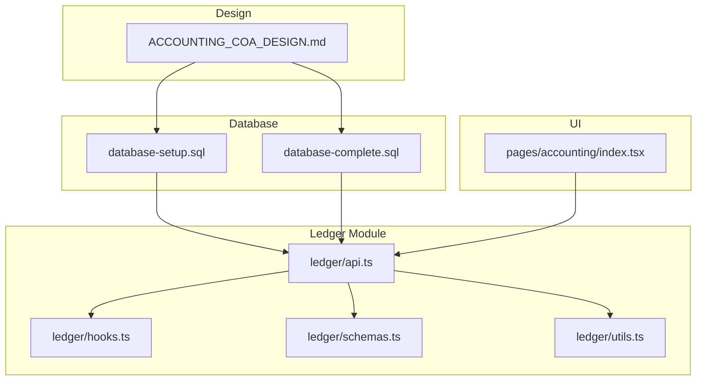
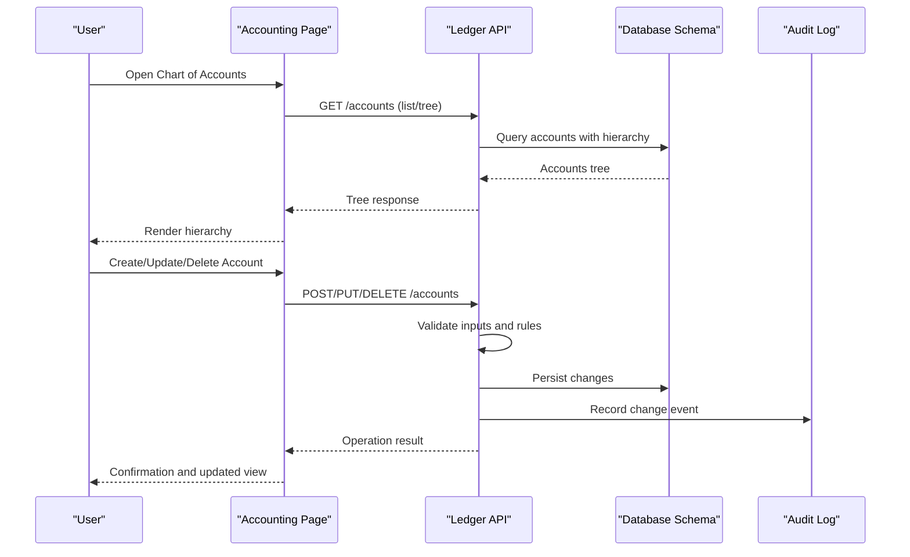
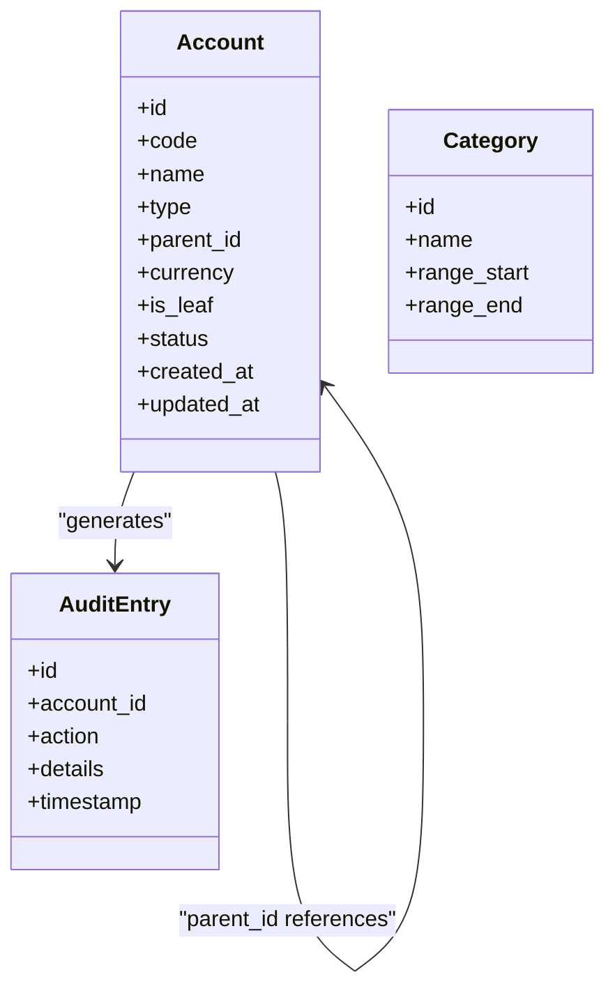
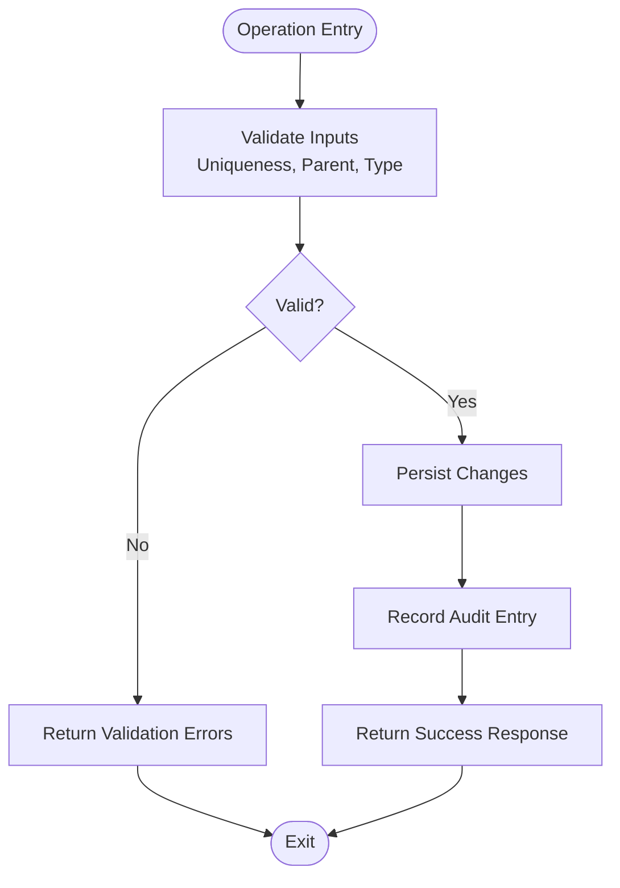
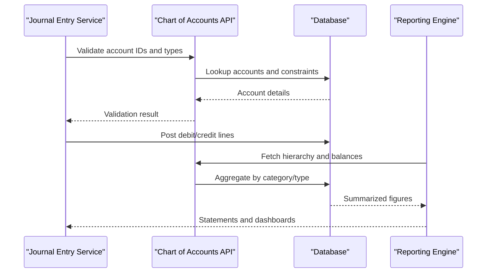
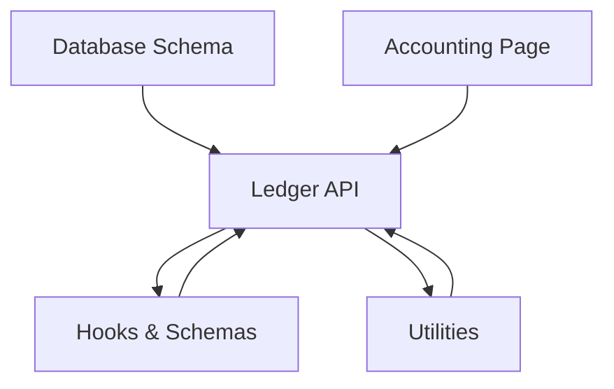

# Chart of Accounts

<cite>
**Referenced Files in This Document**
- [ACCOUNTING_COA_DESIGN.md](file://ACCOUNTING_COA_DESIGN.md)
- [database-complete.sql](file://src/database-complete.sql)
- [database-setup.sql](file://src/database-setup.sql)
- [ledger/api.ts](file://src/ledger/api.ts)
- [ledger/hooks.ts](file://src/ledger/hooks.ts)
- [ledger/schemas.ts](file://src/ledger/schemas.ts)
- [ledger/utils.ts](file://src/ledger/utils.ts)
- [pages/accounting/index.tsx](file://src/pages/accounting/index.tsx)
</cite>

## Table of Contents
1. [Introduction](#introduction)
2. [Project Structure](#project-structure)
3. [Core Components](#core-components)
4. [Architecture Overview](#architecture-overview)
5. [Detailed Component Analysis](#detailed-component-analysis)
6. [Dependency Analysis](#dependency-analysis)
7. [Performance Considerations](#performance-considerations)
8. [Troubleshooting Guide](#troubleshooting-guide)
9. [Conclusion](#conclusion)
10. [Appendices](#appendices)

## Introduction
This document explains the Chart of Accounts (CoA) system, including account hierarchy, types, numbering conventions, grouping logic, lifecycle operations (create, modify, delete), validation and duplicate prevention, audit trail, multi-currency considerations, and integration with journal entries and financial reporting. It synthesizes design notes and implementation details from the repository to provide a clear, practical guide for both technical and non-technical users.

## Project Structure
The CoA is implemented across database schema definitions, API endpoints, hooks, schemas, utilities, and UI pages:
- Design specification and rules are captured in a dedicated design document.
- Database schema files define tables, constraints, and indexes that enforce structure and integrity.
- The ledger module provides API, hooks, schemas, and utilities for CoA operations.
- A dedicated accounting page exposes the user interface for managing accounts.

**Diagram sources**
- [ACCOUNTING_COA_DESIGN.md](file://ACCOUNTING_COA_DESIGN.md)
- [database-setup.sql](file://src/database-setup.sql)
- [database-complete.sql](file://src/database-complete.sql)
- [ledger/api.ts](file://src/ledger/api.ts)
- [ledger/hooks.ts](file://src/ledger/hooks.ts)
- [ledger/schemas.ts](file://src/ledger/schemas.ts)
- [ledger/utils.ts](file://src/ledger/utils.ts)
- [pages/accounting/index.tsx](file://src/pages/accounting/index.tsx)

**Section sources**
- [ACCOUNTING_COA_DESIGN.md](file://ACCOUNTING_COA_DESIGN.md)
- [database-setup.sql](file://src/database-setup.sql)
- [database-complete.sql](file://src/database-complete.sql)
- [ledger/api.ts](file://src/ledger/api.ts)
- [ledger/hooks.ts](file://src/ledger/hooks.ts)
- [ledger/schemas.ts](file://src/ledger/schemas.ts)
- [ledger/utils.ts](file://src/ledger/utils.ts)
- [pages/accounting/index.tsx](file://src/pages/accounting/index.tsx)

## Core Components
- Account model and hierarchy:
  - Root-level categories (e.g., Assets, Liabilities, Equity, Income, Expenses).
  - Parent-child relationships enabling nested groupings and drill-down reporting.
  - Classification flags and type codes to drive behavior and reporting.
- Numbering conventions:
  - Hierarchical numeric or alphanumeric codes reflecting parent-child paths.
  - Reserved ranges per category to simplify sorting and filtering.
- Lifecycle operations:
  - Create, update, archive/delete with validation and conflict checks.
  - Audit logging for all changes to maintain compliance and traceability.
- Multi-currency support:
  - Per-account currency configuration where applicable.
  - Conversion and reporting considerations at aggregation time.
- Integration points:
  - Journal entry postings reference accounts by ID and code.
  - Financial reports aggregate balances using hierarchy traversal and classification.

**Section sources**
- [ACCOUNTING_COA_DESIGN.md](file://ACCOUNTING_COA_DESIGN.md)
- [database-setup.sql](file://src/database-setup.sql)
- [database-complete.sql](file://src/database-complete.sql)
- [ledger/api.ts](file://src/ledger/api.ts)
- [ledger/schemas.ts](file://src/ledger/schemas.ts)
- [ledger/utils.ts](file://src/ledger/utils.ts)

## Architecture Overview
The CoA architecture separates concerns into design, persistence, service layer, and UI:
- Design document defines taxonomy, rules, and examples.
- Database schema enforces structural integrity via foreign keys, unique constraints, and indexes.
- Ledger API encapsulates business logic for CRUD, validation, and audit.
- Hooks and schemas standardize data handling on the client side.
- Accounting UI orchestrates user workflows for account management.

**Diagram sources**
- [ledger/api.ts](file://src/ledger/api.ts)
- [database-setup.sql](file://src/database-setup.sql)
- [database-complete.sql](file://src/database-complete.sql)
- [pages/accounting/index.tsx](file://src/pages/accounting/index.tsx)

## Detailed Component Analysis

### Account Model and Hierarchy
- Categories and types:
  - Standard top-level categories include Assets, Liabilities, Equity, Income, Expenses.
  - Each account has a type/classification used for reporting and validation.
- Parent-child relationships:
  - Accounts can be grouped under parents to form a hierarchical tree.
  - Leaf accounts represent transactional detail; header accounts summarize children.
- Numbering conventions:
  - Codes reflect hierarchy depth and position within categories.
  - Ranges reserved per category ensure consistent ordering and easy scanning.
- Grouping logic:
  - Reports traverse the tree to roll up balances from leaves to headers.
  - Filters apply by category, type, or custom tags/metadata.

**Diagram sources**
- [database-setup.sql](file://src/database-setup.sql)
- [database-complete.sql](file://src/database-complete.sql)

**Section sources**
- [ACCOUNTING_COA_DESIGN.md](file://ACCOUNTING_COA_DESIGN.md)
- [database-setup.sql](file://src/database-setup.sql)
- [database-complete.sql](file://src/database-complete.sql)

### Account Creation, Modification, and Deletion
- Creation:
  - Validate uniqueness of account code within scope.
  - Enforce parent existence and leaf/header consistency.
  - Assign default currency if not provided.
  - Emit audit log entry for creation.
- Modification:
  - Prevent re-parenting that would create cycles.
  - Disallow updates to locked or closed periods if enforced elsewhere.
  - Update metadata such as name, tags, or currency safely.
  - Emit audit log entry for modifications.
- Deletion:
  - Block deletion if referenced by existing journal entries or balances.
  - Support soft-delete/archival where appropriate.
  - Emit audit log entry for deletion.

**Diagram sources**
- [ledger/api.ts](file://src/ledger/api.ts)
- [ledger/schemas.ts](file://src/ledger/schemas.ts)
- [ledger/utils.ts](file://src/ledger/utils.ts)

**Section sources**
- [ledger/api.ts](file://src/ledger/api.ts)
- [ledger/schemas.ts](file://src/ledger/schemas.ts)
- [ledger/utils.ts](file://src/ledger/utils.ts)

### Validation Rules and Duplicate Prevention
- Unique constraints:
  - Account code must be unique within organization scope.
  - Optional composite uniqueness by currency when supported.
- Structural rules:
  - Parent must exist and be compatible with child type.
  - No cycles in parent-child links.
  - Header accounts cannot have transactions directly.
- Data integrity:
  - Referential integrity enforced via foreign keys.
  - Indexes optimize lookups and prevent duplicates efficiently.

**Section sources**
- [database-setup.sql](file://src/database-setup.sql)
- [database-complete.sql](file://src/database-complete.sql)
- [ledger/schemas.ts](file://src/ledger/schemas.ts)

### Audit Trail Maintenance
- All create, update, and delete actions generate audit entries.
- Audit records capture actor, timestamp, and change details.
- Queries allow filtering by account, action, and date range.

**Section sources**
- [ledger/api.ts](file://src/ledger/api.ts)
- [database-setup.sql](file://src/database-setup.sql)
- [database-complete.sql](file://src/database-complete.sql)

### Multi-Currency Account Configurations
- Currency field on accounts enables per-account currency context.
- Aggregation and reporting convert amounts to organizational base currency.
- Validation ensures compatibility between account currency and transaction currency.

**Section sources**
- [database-setup.sql](file://src/database-setup.sql)
- [database-complete.sql](file://src/database-complete.sql)
- [ledger/utils.ts](file://src/ledger/utils.ts)

### Integration with Journal Entries and Financial Reporting
- Journal entries reference accounts by ID and code.
- Posting validates account status and type before allowing debits/credits.
- Financial reports traverse the hierarchy to compute balances and statements.

**Diagram sources**
- [ledger/api.ts](file://src/ledger/api.ts)
- [database-setup.sql](file://src/database-setup.sql)
- [database-complete.sql](file://src/database-complete.sql)

**Section sources**
- [ledger/api.ts](file://src/ledger/api.ts)
- [database-setup.sql](file://src/database-setup.sql)
- [database-complete.sql](file://src/database-complete.sql)

### Examples and Custom Setups
- Standard structures:
  - Typical small-to-medium enterprise layouts with five primary categories.
  - Subcategories for Cash, Receivables, Payables, Revenue, Cost of Goods Sold, Operating Expenses.
- Custom setups:
  - Industry-specific branches (e.g., Construction, Manufacturing) add specialized groups.
  - Department or project tagging supports multi-dimensional reporting.
- Multi-currency:
  - Regional subsidiaries maintain local currency accounts while consolidating to base currency.

[No sources needed since this section provides conceptual examples]

## Dependency Analysis
The CoA depends on database constraints for integrity, API for business logic, and UI for interaction.

**Diagram sources**
- [database-setup.sql](file://src/database-setup.sql)
- [database-complete.sql](file://src/database-complete.sql)
- [ledger/api.ts](file://src/ledger/api.ts)
- [ledger/hooks.ts](file://src/ledger/hooks.ts)
- [ledger/schemas.ts](file://src/ledger/schemas.ts)
- [ledger/utils.ts](file://src/ledger/utils.ts)
- [pages/accounting/index.tsx](file://src/pages/accounting/index.tsx)

**Section sources**
- [ledger/api.ts](file://src/ledger/api.ts)
- [ledger/hooks.ts](file://src/ledger/hooks.ts)
- [ledger/schemas.ts](file://src/ledger/schemas.ts)
- [ledger/utils.ts](file://src/ledger/utils.ts)
- [pages/accounting/index.tsx](file://src/pages/accounting/index.tsx)
- [database-setup.sql](file://src/database-setup.sql)
- [database-complete.sql](file://src/database-complete.sql)

## Performance Considerations
- Indexing:
  - Ensure indexes on account code, parent_id, and type for fast lookups and tree traversal.
- Caching:
  - Cache read-heavy hierarchy queries at the API or client level with invalidation on writes.
- Batch operations:
  - Use batched reads/writes for bulk imports or migrations to reduce round-trips.
- Reporting optimization:
  - Materialized views or summary tables can accelerate balance roll-ups for large datasets.

[No sources needed since this section provides general guidance]

## Troubleshooting Guide
- Duplicate account code errors:
  - Check uniqueness constraints and organization scoping.
- Invalid parent assignment:
  - Verify parent exists and is compatible with child type; avoid cycles.
- Cannot delete account:
  - Confirm no journal entries or balances reference the account; consider archival instead.
- Audit gaps:
  - Ensure audit triggers or API calls record all mutations consistently.

**Section sources**
- [ledger/api.ts](file://src/ledger/api.ts)
- [database-setup.sql](file://src/database-setup.sql)
- [database-complete.sql](file://src/database-complete.sql)

## Conclusion
The Chart of Accounts system provides a robust, hierarchical foundation for accounting operations. With clear taxonomy, strong validation, comprehensive audit trails, and multi-currency support, it integrates seamlessly with journal entries and reporting. Proper indexing and caching strategies ensure performance at scale, while flexible categorization accommodates diverse business needs.

[No sources needed since this section summarizes without analyzing specific files]

## Appendices
- Best practices:
  - Maintain consistent numbering conventions and reserve ranges per category.
  - Prefer archival over hard deletes to preserve historical integrity.
  - Regularly review audit logs for anomalies and compliance.
- Migration tips:
  - Back up data before bulk updates.
  - Validate new hierarchies against reporting outputs post-migration.

[No sources needed since this section provides general guidance]