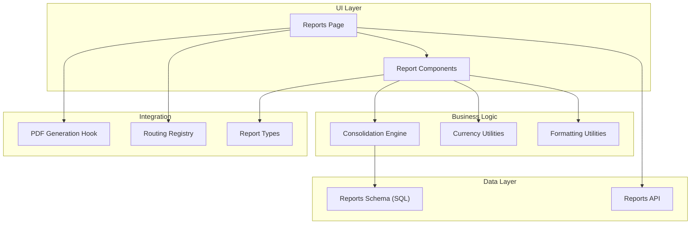
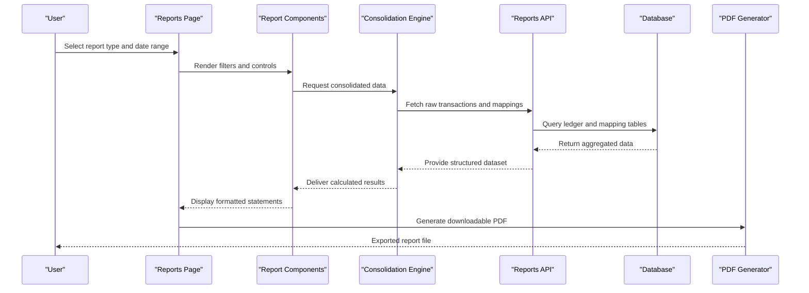
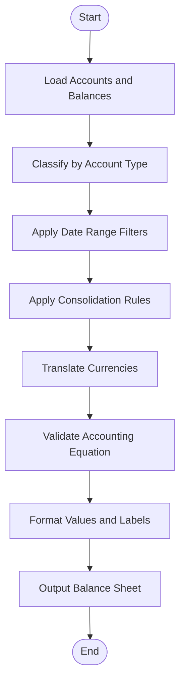
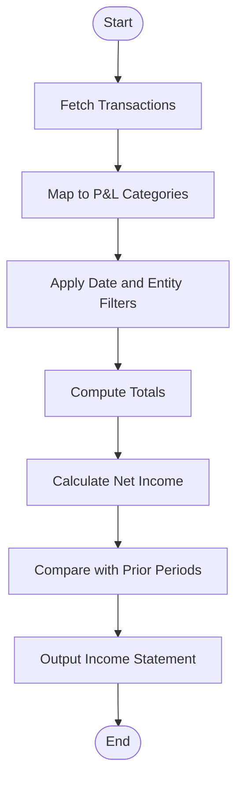
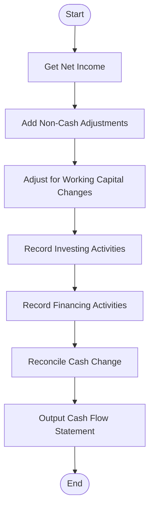
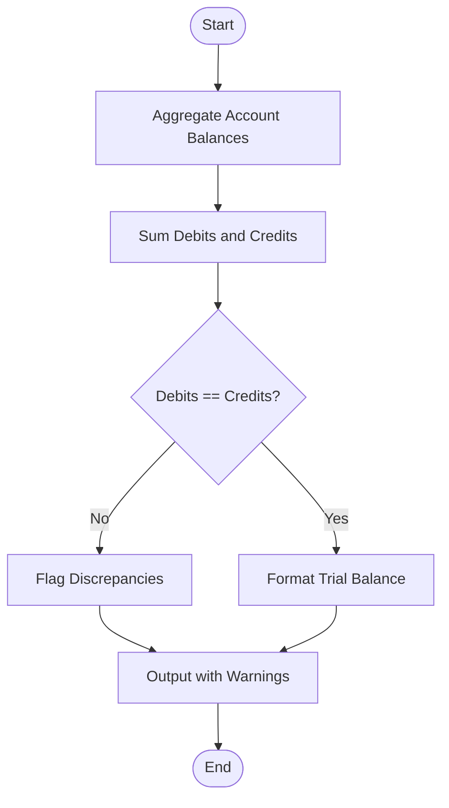
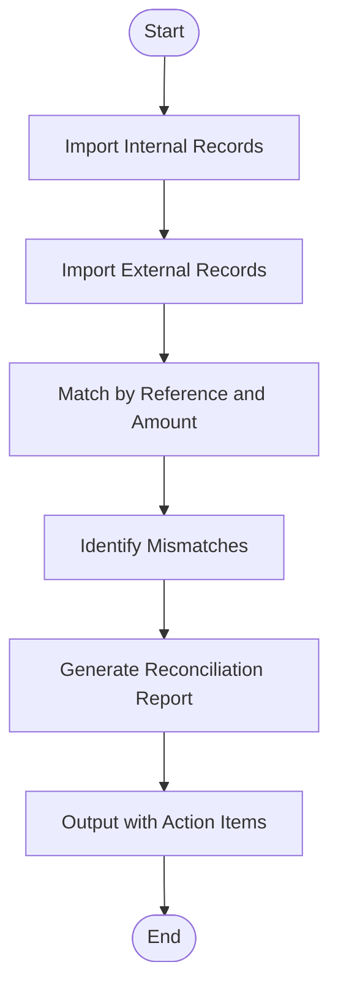
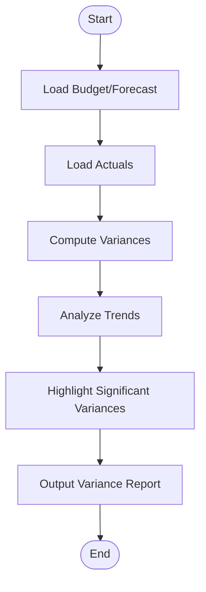
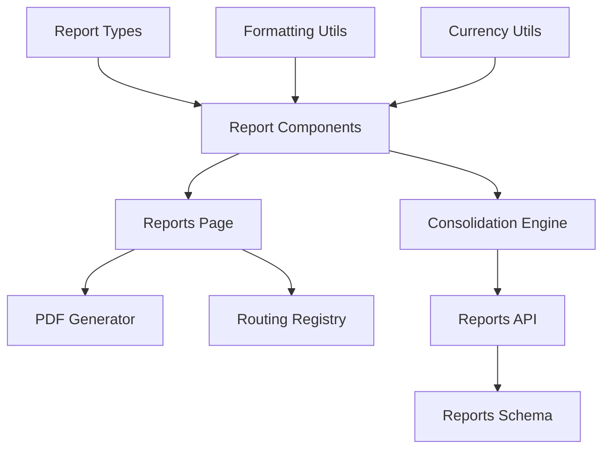

# Financial Statements

<cite>
**Referenced Files in This Document**
- [src/pages/reports/Reports.tsx](file://src/pages/reports/Reports.tsx)
- [src/components/reports/index.tsx](file://src/components/reports/index.tsx)
- [src/hooks/usePDFGeneration.ts](file://src/hooks/usePDFGeneration.ts)
- [src/lib/currency.ts](file://src/lib/currency.ts)
- [src/database/database-reports-schema.sql](file://src/database/database-reports-schema.sql)
- [supabase/migrations/20240101_create_reports_schema.sql](file://supabase/migrations/20240101_create_reports_schema.sql)
- [src/app/routing/registry.ts](file://src/app/routing/registry.ts)
- [src/types/report-types.ts](file://src/types/report-types.ts)
- [src/utils/formatting.ts](file://src/utils/formatting.ts)
- [src/features/core/consolidation-engine.ts](file://src/features/core/consolidation-engine.ts)
- [src/api/reports-api.ts](file://src/api/reports-api.ts)
</cite>

## Table of Contents
1. [Introduction](#introduction)
2. [Project Structure](#project-structure)
3. [Core Components](#core-components)
4. [Architecture Overview](#architecture-overview)
5. [Detailed Component Analysis](#detailed-component-analysis)
6. [Dependency Analysis](#dependency-analysis)
7. [Performance Considerations](#performance-considerations)
8. [Troubleshooting Guide](#troubleshooting-guide)
9. [Conclusion](#conclusion)
10. [Appendices](#appendices)

## Introduction
This document explains how financial statements are generated and analyzed within the application, including balance sheet preparation, income statement calculation, cash flow statement compilation, trial balance generation, account reconciliation reports, and variance analysis tools. It also covers report customization options, date range selection, comparative period analysis, multi-entity consolidation, currency translation effects, audit-ready reporting features, export capabilities, scheduling automated reports, and integration with external financial analysis tools.

## Project Structure
The financial reporting subsystem is organized across UI pages, reusable components, hooks for PDF generation, utility modules for formatting and currency handling, database schemas for report data, routing configuration, type definitions, and API integrations. The structure supports modular development and clear separation between presentation, business logic, and data access layers.

**Diagram sources**
- [src/pages/reports/Reports.tsx](file://src/pages/reports/Reports.tsx)
- [src/components/reports/index.tsx](file://src/components/reports/index.tsx)
- [src/hooks/usePDFGeneration.ts](file://src/hooks/usePDFGeneration.ts)
- [src/lib/currency.ts](file://src/lib/currency.ts)
- [src/utils/formatting.ts](file://src/utils/formatting.ts)
- [src/database/database-reports-schema.sql](file://src/database/database-reports-schema.sql)
- [supabase/migrations/20240101_create_reports_schema.sql](file://supabase/migrations/20240101_create_reports_schema.sql)
- [src/app/routing/registry.ts](file://src/app/routing/registry.ts)
- [src/types/report-types.ts](file://src/types/report-types.ts)
- [src/api/reports-api.ts](file://src/api/reports-api.ts)

**Section sources**
- [src/pages/reports/Reports.tsx](file://src/pages/reports/Reports.tsx)
- [src/components/reports/index.tsx](file://src/components/reports/index.tsx)
- [src/hooks/usePDFGeneration.ts](file://src/hooks/usePDFGeneration.ts)
- [src/lib/currency.ts](file://src/lib/currency.ts)
- [src/utils/formatting.ts](file://src/utils/formatting.ts)
- [src/database/database-reports-schema.sql](file://src/database/database-reports-schema.sql)
- [supabase/migrations/20240101_create_reports_schema.sql](file://supabase/migrations/20240101_create_reports_schema.sql)
- [src/app/routing/registry.ts](file://src/app/routing/registry.ts)
- [src/types/report-types.ts](file://src/types/report-types.ts)
- [src/api/reports-api.ts](file://src/api/reports-api.ts)

## Core Components
- Balance Sheet Preparation: Aggregates assets, liabilities, and equity from ledger entries, applies consolidation rules, and formats values consistently.
- Income Statement Calculation: Computes revenues, costs, and net income over selected periods using transactional data and classification rules.
- Cash Flow Statement Compilation: Derives operating, investing, and financing cash flows from changes in working capital and non-cash adjustments.
- Trial Balance Generation: Summarizes debit and credit balances per account to verify accounting equation integrity.
- Account Reconciliation Reports: Compares internal records against external statements or sub-ledgers, highlighting discrepancies.
- Variance Analysis Tools: Calculates differences between actuals and budgets/forecasts, providing insights into performance drivers.

Key implementation patterns include:
- Date range filtering and comparative period analysis
- Multi-entity consolidation with intercompany eliminations
- Currency translation using standardized exchange rates
- Audit-ready outputs with traceability and versioning

**Section sources**
- [src/pages/reports/Reports.tsx](file://src/pages/reports/Reports.tsx)
- [src/components/reports/index.tsx](file://src/components/reports/index.tsx)
- [src/features/core/consolidation-engine.ts](file://src/features/core/consolidation-engine.ts)
- [src/lib/currency.ts](file://src/lib/currency.ts)
- [src/utils/formatting.ts](file://src/utils/formatting.ts)
- [src/types/report-types.ts](file://src/types/report-types.ts)
- [src/api/reports-api.ts](file://src/api/reports-api.ts)

## Architecture Overview
The reporting architecture follows a layered design:
- Presentation layer (Reports page and components) orchestrates user interactions and displays results.
- Business logic layer handles calculations, consolidation, and transformations.
- Data layer provides schema-backed storage and API endpoints for fetching and persisting report data.
- Integration layer manages PDF generation, routing, and type safety.

**Diagram sources**
- [src/pages/reports/Reports.tsx](file://src/pages/reports/Reports.tsx)
- [src/components/reports/index.tsx](file://src/components/reports/index.tsx)
- [src/features/core/consolidation-engine.ts](file://src/features/core/consolidation-engine.ts)
- [src/api/reports-api.ts](file://src/api/reports-api.ts)
- [src/hooks/usePDFGeneration.ts](file://src/hooks/usePDFGeneration.ts)

## Detailed Component Analysis

### Balance Sheet Preparation
- Data aggregation: Sums asset, liability, and equity accounts based on classification rules.
- Consolidation: Applies entity hierarchies and intercompany eliminations.
- Currency translation: Converts foreign currency balances using consistent exchange rates.
- Validation: Ensures debits equal credits and flags anomalies.

**Diagram sources**
- [src/features/core/consolidation-engine.ts](file://src/features/core/consolidation-engine.ts)
- [src/lib/currency.ts](file://src/lib/currency.ts)
- [src/utils/formatting.ts](file://src/utils/formatting.ts)
- [src/database/database-reports-schema.sql](file://src/database/database-reports-schema.sql)

**Section sources**
- [src/features/core/consolidation-engine.ts](file://src/features/core/consolidation-engine.ts)
- [src/lib/currency.ts](file://src/lib/currency.ts)
- [src/utils/formatting.ts](file://src/utils/formatting.ts)
- [src/database/database-reports-schema.sql](file://src/database/database-reports-schema.sql)

### Income Statement Calculation
- Revenue recognition: Aggregates sales and service revenue lines.
- Cost computation: Includes COGS, operating expenses, and other charges.
- Net income derivation: Subtracts total expenses from total revenues.
- Comparative analysis: Supports prior period comparisons and variance metrics.

**Diagram sources**
- [src/api/reports-api.ts](file://src/api/reports-api.ts)
- [src/features/core/consolidation-engine.ts](file://src/features/core/consolidation-engine.ts)
- [src/utils/formatting.ts](file://src/utils/formatting.ts)

**Section sources**
- [src/api/reports-api.ts](file://src/api/reports-api.ts)
- [src/features/core/consolidation-engine.ts](file://src/features/core/consolidation-engine.ts)
- [src/utils/formatting.ts](file://src/utils/formatting.ts)

### Cash Flow Statement Compilation
- Operating activities: Adjusts net income for non-cash items and changes in working capital.
- Investing activities: Captures capital expenditures and asset disposals.
- Financing activities: Records debt issuances, repayments, and equity transactions.
- Reconciliation: Ensures ending cash equals beginning plus net change.

**Diagram sources**
- [src/features/core/consolidation-engine.ts](file://src/features/core/consolidation-engine.ts)
- [src/api/reports-api.ts](file://src/api/reports-api.ts)
- [src/utils/formatting.ts](file://src/utils/formatting.ts)

**Section sources**
- [src/features/core/consolidation-engine.ts](file://src/features/core/consolidation-engine.ts)
- [src/api/reports-api.ts](file://src/api/reports-api.ts)
- [src/utils/formatting.ts](file://src/utils/formatting.ts)

### Trial Balance Generation
- Debit/credit summation: Aggregates balances per account.
- Equality check: Validates that total debits equal total credits.
- Exception reporting: Highlights accounts with zero or negative balances where unexpected.

**Diagram sources**
- [src/features/core/consolidation-engine.ts](file://src/features/core/consolidation-engine.ts)
- [src/utils/formatting.ts](file://src/utils/formatting.ts)

**Section sources**
- [src/features/core/consolidation-engine.ts](file://src/features/core/consolidation-engine.ts)
- [src/utils/formatting.ts](file://src/utils/formatting.ts)

### Account Reconciliation Reports
- Data comparison: Matches internal ledger entries with external statements or sub-ledgers.
- Discrepancy detection: Identifies mismatches in amounts, dates, or references.
- Resolution workflow: Provides guidance for investigating and correcting variances.

**Diagram sources**
- [src/api/reports-api.ts](file://src/api/reports-api.ts)
- [src/utils/formatting.ts](file://src/utils/formatting.ts)

**Section sources**
- [src/api/reports-api.ts](file://src/api/reports-api.ts)
- [src/utils/formatting.ts](file://src/utils/formatting.ts)

### Variance Analysis Tools
- Budget vs actuals: Computes differences and percentages.
- Trend analysis: Highlights significant deviations over time.
- Drill-down: Enables investigation at granular levels (accounts, entities, periods).

**Diagram sources**
- [src/features/core/consolidation-engine.ts](file://src/features/core/consolidation-engine.ts)
- [src/utils/formatting.ts](file://src/utils/formatting.ts)

**Section sources**
- [src/features/core/consolidation-engine.ts](file://src/features/core/consolidation-engine.ts)
- [src/utils/formatting.ts](file://src/utils/formatting.ts)

### Report Customization Options
- Layout templates: Choose standard or custom layouts for each statement.
- Field selection: Include/exclude specific line items or dimensions.
- Labeling and grouping: Customize account groupings and display labels.
- Export formats: Support PDF, CSV, and Excel exports.

**Section sources**
- [src/components/reports/index.tsx](file://src/components/reports/index.tsx)
- [src/hooks/usePDFGeneration.ts](file://src/hooks/usePDFGeneration.ts)
- [src/utils/formatting.ts](file://src/utils/formatting.ts)

### Date Range Selection and Comparative Period Analysis
- Date pickers: Define start and end dates for reporting periods.
- Comparative periods: Allow side-by-side comparison with prior periods.
- Rolling windows: Support month-to-date, quarter-to-date, year-to-date views.

**Section sources**
- [src/pages/reports/Reports.tsx](file://src/pages/reports/Reports.tsx)
- [src/components/reports/index.tsx](file://src/components/reports/index.tsx)

### Multi-Entity Consolidation
- Entity hierarchy: Model parent-child relationships among entities.
- Intercompany eliminations: Remove intra-group transactions and balances.
- Ownership weighting: Apply ownership percentages for proportional consolidation.

**Section sources**
- [src/features/core/consolidation-engine.ts](file://src/features/core/consolidation-engine.ts)
- [src/database/database-reports-schema.sql](file://src/database/database-reports-schema.sql)

### Currency Translation Effects
- Exchange rate sources: Use standardized rates per currency and date.
- Translation methods: Apply current rate or historical rate methods as needed.
- Rounding and precision: Ensure consistent rounding across currencies.

**Section sources**
- [src/lib/currency.ts](file://src/lib/currency.ts)
- [src/utils/formatting.ts](file://src/utils/formatting.ts)

### Audit-Ready Reporting Features
- Traceability: Link report lines back to source transactions.
- Versioning: Maintain versions of generated reports with timestamps.
- Sign-off workflows: Capture approvals and reviewer comments.

**Section sources**
- [src/hooks/usePDFGeneration.ts](file://src/hooks/usePDFGeneration.ts)
- [src/api/reports-api.ts](file://src/api/reports-api.ts)

### Export Capabilities and Scheduling Automated Reports
- Export formats: PDF, CSV, Excel with customizable headers and footers.
- Scheduling: Configure recurring report generation and distribution.
- Delivery channels: Email, shared drives, or integration endpoints.

**Section sources**
- [src/hooks/usePDFGeneration.ts](file://src/hooks/usePDFGeneration.ts)
- [src/api/reports-api.ts](file://src/api/reports-api.ts)

### Integration with External Financial Analysis Tools
- API endpoints: Expose report data via REST or GraphQL for consumption.
- Webhooks: Notify external systems upon report completion.
- Data mapping: Align output schemas with external tool requirements.

**Section sources**
- [src/api/reports-api.ts](file://src/api/reports-api.ts)
- [src/app/routing/registry.ts](file://src/app/routing/registry.ts)

## Dependency Analysis
The reporting system depends on well-defined interfaces between UI, business logic, and data layers. Key dependencies include:
- UI components depend on types and formatting utilities.
- Consolidation engine depends on API and database schemas.
- PDF generation depends on formatting and template configurations.
- Routing registry ensures consistent navigation to report pages.

**Diagram sources**
- [src/types/report-types.ts](file://src/types/report-types.ts)
- [src/utils/formatting.ts](file://src/utils/formatting.ts)
- [src/lib/currency.ts](file://src/lib/currency.ts)
- [src/components/reports/index.tsx](file://src/components/reports/index.tsx)
- [src/pages/reports/Reports.tsx](file://src/pages/reports/Reports.tsx)
- [src/hooks/usePDFGeneration.ts](file://src/hooks/usePDFGeneration.ts)
- [src/features/core/consolidation-engine.ts](file://src/features/core/consolidation-engine.ts)
- [src/api/reports-api.ts](file://src/api/reports-api.ts)
- [src/database/database-reports-schema.sql](file://src/database/database-reports-schema.sql)
- [src/app/routing/registry.ts](file://src/app/routing/registry.ts)

**Section sources**
- [src/types/report-types.ts](file://src/types/report-types.ts)
- [src/utils/formatting.ts](file://src/utils/formatting.ts)
- [src/lib/currency.ts](file://src/lib/currency.ts)
- [src/components/reports/index.tsx](file://src/components/reports/index.tsx)
- [src/pages/reports/Reports.tsx](file://src/pages/reports/Reports.tsx)
- [src/hooks/usePDFGeneration.ts](file://src/hooks/usePDFGeneration.ts)
- [src/features/core/consolidation-engine.ts](file://src/features/core/consolidation-engine.ts)
- [src/api/reports-api.ts](file://src/api/reports-api.ts)
- [src/database/database-reports-schema.sql](file://src/database/database-reports-schema.sql)
- [src/app/routing/registry.ts](file://src/app/routing/registry.ts)

## Performance Considerations
- Efficient queries: Use indexed columns and aggregate functions to minimize data transfer.
- Caching: Cache computed aggregates for repeated date ranges and entities.
- Pagination: Implement pagination for large datasets in reconciliation and variance reports.
- Asynchronous processing: Offload heavy computations and PDF generation to background jobs.

[No sources needed since this section provides general guidance]

## Troubleshooting Guide
Common issues and resolutions:
- Imbalanced trial balance: Verify account classifications and ensure all postings are complete.
- Currency translation errors: Confirm exchange rate availability and consistency across periods.
- Missing data in reports: Check date range filters and entity selections; validate data ingestion pipelines.
- PDF generation failures: Inspect template configurations and available fonts; ensure sufficient memory allocation.

**Section sources**
- [src/features/core/consolidation-engine.ts](file://src/features/core/consolidation-engine.ts)
- [src/lib/currency.ts](file://src/lib/currency.ts)
- [src/hooks/usePDFGeneration.ts](file://src/hooks/usePDFGeneration.ts)

## Conclusion
The financial statements module provides robust capabilities for generating and analyzing core financial reports. With strong support for multi-entity consolidation, currency translation, audit readiness, and flexible export options, it serves as a comprehensive foundation for financial reporting needs. Continuous improvements in performance, usability, and integration will further enhance its value to users.

[No sources needed since this section summarizes without analyzing specific files]

## Appendices
- Standard financial statement examples: Balance sheet, income statement, cash flow statement templates.
- Custom report formats: Guidelines for creating bespoke layouts and fields.
- Regulatory compliance reports: Mapping to common regulatory frameworks and disclosure requirements.

[No sources needed since this section provides general guidance]