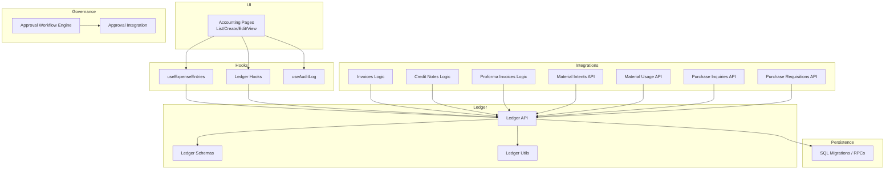
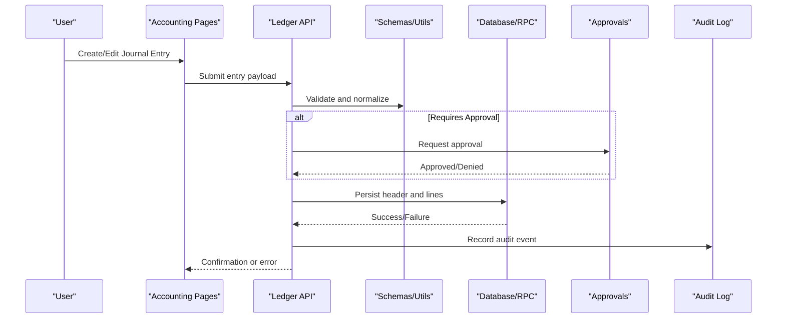
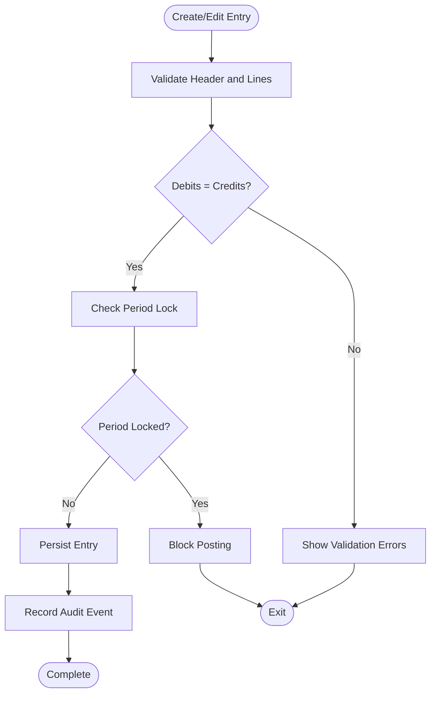
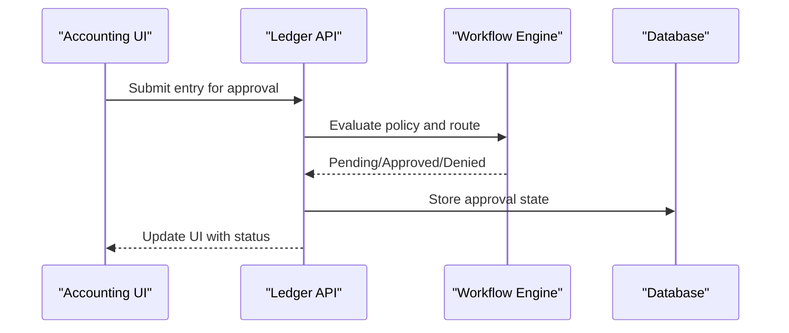
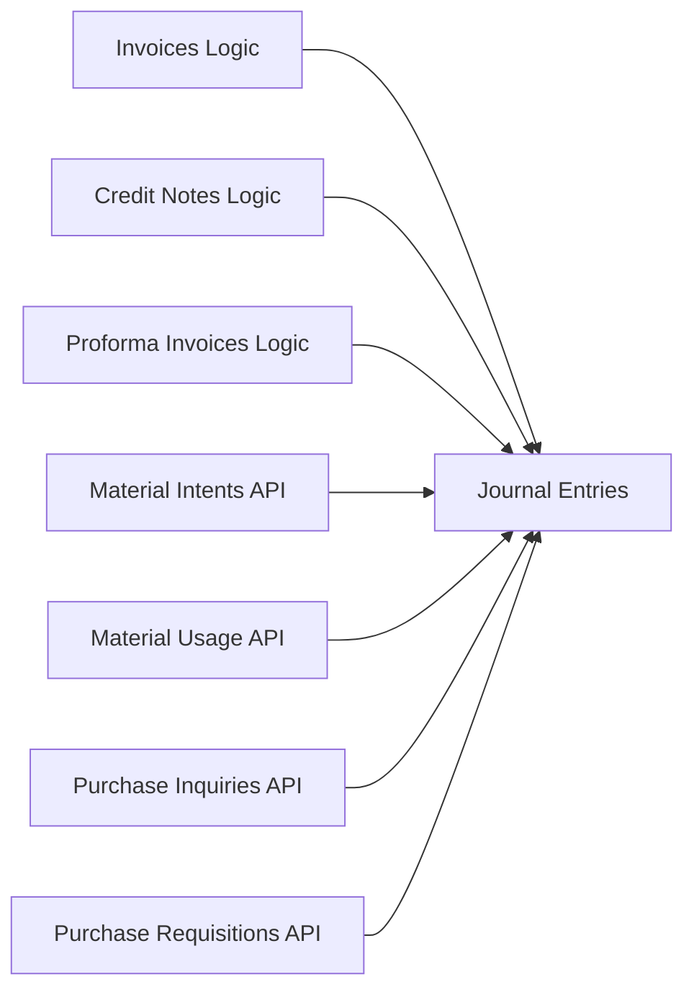
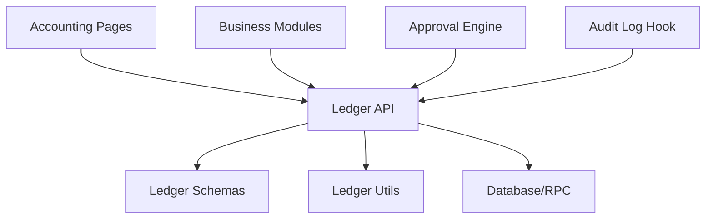

# Journal Entries

<cite>
**Referenced Files in This Document**
- [create_reversal_rpc.sql](file://sql/create_reversal_rpc.sql)
- [update_production_entries_edit.sql](file://sql/update_production_entries_edit.sql)
- [database-complete.sql](file://src/database-complete.sql)
- [useExpenseEntries.ts](file://src/hooks/useExpenseEntries.ts)
- [ledger/api.ts](file://src/ledger/api.ts)
- [ledger/hooks.ts](file://src/ledger/hooks.ts)
- [ledger/schemas.ts](file://src/ledger/schemas.ts)
- [ledger/utils.ts](file://src/ledger/utils.ts)
- [pages/accounting/index.tsx](file://src/pages/accounting/index.tsx)
- [pages/accounting/journal-entry-list.tsx](file://src/pages/accounting/journal-entry-list.tsx)
- [pages/accounting/journal-entry-create.tsx](file://src/pages/accounting/journal-entry-create.tsx)
- [pages/accounting/journal-entry-edit.tsx](file://src/pages/accounting/journal-entry-edit.tsx)
- [pages/accounting/journal-entry-view.tsx](file://src/pages/accounting/journal-entry-view.tsx)
- [invoices/logic.ts](file://src/invoices/logic.ts)
- [credit-notes/logic.ts](file://src/credit-notes/logic.ts)
- [material-intents/api.ts](file://src/material-intents/api.ts)
- [material-usage/api.ts](file://src/material-usage/api.ts)
- [purchase-inquiries/api.ts](file://src/purchase-inquiries/api.ts)
- [purchase-requisitions/api.ts](file://src/purchase-requisitions/api.ts)
- [proforma-invoices/logic.ts](file://src/proforma-invoices/logic.ts)
- [approvals/workflow-engine.ts](file://src/approvals/workflow-engine.ts)
- [approvals/integration.ts](file://src/approvals/integration.ts)
- [hooks/useAuditLog.ts](file://src/hooks/useAuditLog.ts)
</cite>

## Table of Contents
1. [Introduction](#introduction)
2. [Project Structure](#project-structure)
3. [Core Components](#core-components)
4. [Architecture Overview](#architecture-overview)
5. [Detailed Component Analysis](#detailed-component-analysis)
6. [Dependency Analysis](#dependency-analysis)
7. [Performance Considerations](#performance-considerations)
8. [Troubleshooting Guide](#troubleshooting-guide)
9. [Conclusion](#conclusion)
10. [Appendices](#appendices)

## Introduction
This document explains how journal entries are managed across the application, focusing on double-entry bookkeeping principles, debit and credit rules, validation, creation, editing, posting, and reversal workflows. It also covers entry types (manual, automated from transactions, recurring), examples of common and compound entries, inter-company transactions, approval workflows, audit trails, period locking, batch processing, templates, and integrations with source documents such as invoices and purchase orders.

## Project Structure
Journal entry functionality spans UI pages, hooks, ledger utilities, SQL migrations/RPCs, and integration points with business modules (invoices, credit notes, material intents/usage, proforma invoices). The key areas include:
- Ledger layer for schema, API, hooks, and utilities
- Accounting pages for listing, creating, editing, and viewing entries
- Reversal RPC for generating reversing entries
- Business module integrations that auto-generate journal entries
- Approval workflow engine and audit logging hooks

**Diagram sources**
- [pages/accounting/journal-entry-list.tsx](file://src/pages/accounting/journal-entry-list.tsx)
- [pages/accounting/journal-entry-create.tsx](file://src/pages/accounting/journal-entry-create.tsx)
- [pages/accounting/journal-entry-edit.tsx](file://src/pages/accounting/journal-entry-edit.tsx)
- [pages/accounting/journal-entry-view.tsx](file://src/pages/accounting/journal-entry-view.tsx)
- [hooks/useExpenseEntries.ts](file://src/hooks/useExpenseEntries.ts)
- [ledger/api.ts](file://src/ledger/api.ts)
- [ledger/hooks.ts](file://src/ledger/hooks.ts)
- [ledger/schemas.ts](file://src/ledger/schemas.ts)
- [ledger/utils.ts](file://src/ledger/utils.ts)
- [invoices/logic.ts](file://src/invoices/logic.ts)
- [credit-notes/logic.ts](file://src/credit-notes/logic.ts)
- [proforma-invoices/logic.ts](file://src/proforma-invoices/logic.ts)
- [material-intents/api.ts](file://src/material-intents/api.ts)
- [material-usage/api.ts](file://src/material-usage/api.ts)
- [purchase-inquiries/api.ts](file://src/purchase-inquiries/api.ts)
- [purchase-requisitions/api.ts](file://src/purchase-requisitions/api.ts)
- [create_reversal_rpc.sql](file://sql/create_reversal_rpc.sql)
- [update_production_entries_edit.sql](file://sql/update_production_entries_edit.sql)
- [approvals/workflow-engine.ts](file://src/approvals/workflow-engine.ts)
- [approvals/integration.ts](file://src/approvals/integration.ts)
- [hooks/useAuditLog.ts](file://src/hooks/useAuditLog.ts)

**Section sources**
- [pages/accounting/journal-entry-list.tsx](file://src/pages/accounting/journal-entry-list.tsx)
- [pages/accounting/journal-entry-create.tsx](file://src/pages/accounting/journal-entry-create.tsx)
- [pages/accounting/journal-entry-edit.tsx](file://src/pages/accounting/journal-entry-edit.tsx)
- [pages/accounting/journal-entry-view.tsx](file://src/pages/accounting/journal-entry-view.tsx)
- [hooks/useExpenseEntries.ts](file://src/hooks/useExpenseEntries.ts)
- [ledger/api.ts](file://src/ledger/api.ts)
- [ledger/hooks.ts](file://src/ledger/hooks.ts)
- [ledger/schemas.ts](file://src/ledger/schemas.ts)
- [ledger/utils.ts](file://src/ledger/utils.ts)
- [invoices/logic.ts](file://src/invoices/logic.ts)
- [credit-notes/logic.ts](file://src/credit-notes/logic.ts)
- [proforma-invoices/logic.ts](file://src/proforma-invoices/logic.ts)
- [material-intents/api.ts](file://src/material-intents/api.ts)
- [material-usage/api.ts](file://src/material-usage/api.ts)
- [purchase-inquiries/api.ts](file://src/purchase-inquiries/api.ts)
- [purchase-requisitions/api.ts](file://src/purchase-requisitions/api.ts)
- [create_reversal_rpc.sql](file://sql/create_reversal_rpc.sql)
- [update_production_entries_edit.sql](file://sql/update_production_entries_edit.sql)
- [approvals/workflow-engine.ts](file://src/approvals/workflow-engine.ts)
- [approvals/integration.ts](file://src/approvals/integration.ts)
- [hooks/useAuditLog.ts](file://src/hooks/useAuditLog.ts)

## Core Components
- Ledger API: Central interface to create, update, list, and manage journal entries; enforces schemas and orchestrates persistence.
- Ledger Schemas: Validation rules for journal headers and lines, including mandatory fields, amount balancing, and type constraints.
- Ledger Utils: Helpers for debits/credits normalization, currency handling, and derived calculations.
- Accounting Pages: User interfaces for listing, creating, editing, and viewing journal entries.
- Expense Entries Hook: Specialized hook for expense-related journal flows.
- Reversal RPC: Server-side routine to generate reversing entries for posted items.
- Integrations: Modules that automatically produce journal entries upon business events (e.g., invoice posting, material usage).
- Approvals and Audit: Workflow engine and audit log hooks to enforce approvals and record changes.

Key responsibilities:
- Ensure double-entry balance per entry and per period
- Enforce posting controls and period locks
- Provide audit trail for all mutations
- Support manual, automated, and recurring entry patterns
- Enable reversal via dedicated RPC

**Section sources**
- [ledger/api.ts](file://src/ledger/api.ts)
- [ledger/schemas.ts](file://src/ledger/schemas.ts)
- [ledger/utils.ts](file://src/ledger/utils.ts)
- [pages/accounting/journal-entry-list.tsx](file://src/pages/accounting/journal-entry-list.tsx)
- [pages/accounting/journal-entry-create.tsx](file://src/pages/accounting/journal-entry-create.tsx)
- [pages/accounting/journal-entry-edit.tsx](file://src/pages/accounting/journal-entry-edit.tsx)
- [pages/accounting/journal-entry-view.tsx](file://src/pages/accounting/journal-entry-view.tsx)
- [hooks/useExpenseEntries.ts](file://src/hooks/useExpenseEntries.ts)
- [create_reversal_rpc.sql](file://sql/create_reversal_rpc.sql)
- [approvals/workflow-engine.ts](file://src/approvals/workflow-engine.ts)
- [hooks/useAuditLog.ts](file://src/hooks/useAuditLog.ts)

## Architecture Overview
The system follows a layered architecture:
- Presentation Layer: Accounting pages render lists, forms, and details.
- Service Layer: Ledger API coordinates validations, approvals, and persistence.
- Domain Integrations: Business modules trigger journal creation through well-defined contracts.
- Persistence Layer: SQL migrations and RPCs implement storage and advanced operations like reversals.
- Governance: Approval workflows gate certain actions; audit logs capture immutable history.

**Diagram sources**
- [pages/accounting/journal-entry-create.tsx](file://src/pages/accounting/journal-entry-create.tsx)
- [ledger/api.ts](file://src/ledger/api.ts)
- [ledger/schemas.ts](file://src/ledger/schemas.ts)
- [ledger/utils.ts](file://src/ledger/utils.ts)
- [approvals/workflow-engine.ts](file://src/approvals/workflow-engine.ts)
- [hooks/useAuditLog.ts](file://src/hooks/useAuditLog.ts)

## Detailed Component Analysis

### Double-Entry Bookkeeping Principles and Rules
- Every journal entry must have equal total debits and credits.
- Each line item specifies an account, direction (debit/credit), and amount.
- Compound entries allow multiple accounts within a single entry.
- Period-aware postings ensure entries cannot affect closed periods.

Validation and enforcement:
- Schema-level checks for required fields and numeric precision.
- Balance checks before persisting.
- Period lock checks prior to posting.

**Section sources**
- [ledger/schemas.ts](file://src/ledger/schemas.ts)
- [ledger/utils.ts](file://src/ledger/utils.ts)

### Entry Types
- Manual Entries: Created directly by users via accounting pages.
- Automated Entries: Generated by business events (e.g., invoice posting, material usage).
- Recurring Entries: Scheduled generation based on templates and frequency settings.

Integration points:
- Invoice logic triggers revenue and receivable entries.
- Credit note logic triggers reversal-like adjustments.
- Material intents/usage drive inventory and cost entries.
- Purchase inquiries/requisitions can initiate accruals or commitments.

**Section sources**
- [invoices/logic.ts](file://src/invoices/logic.ts)
- [credit-notes/logic.ts](file://src/credit-notes/logic.ts)
- [material-intents/api.ts](file://src/material-intents/api.ts)
- [material-usage/api.ts](file://src/material-usage/api.ts)
- [purchase-inquiries/api.ts](file://src/purchase-inquiries/api.ts)
- [purchase-requisitions/api.ts](file://src/purchase-requisitions/api.ts)

### Creation, Editing, Posting, and Reversal
Creation:
- Users fill header metadata and line items; UI validates totals and formats.
- Backend normalizes amounts and applies currency rules.

Editing:
- Editable only if not posted or allowed by policy.
- Changes re-validate balances and period locks.

Posting:
- Finalizes entries, updates ledgers, and records audit events.
- May require approval depending on workflow configuration.

Reversal:
- Dedicated RPC generates a reversing entry with mirrored debits/credits and reference linkage.

**Diagram sources**
- [pages/accounting/journal-entry-create.tsx](file://src/pages/accounting/journal-entry-create.tsx)
- [pages/accounting/journal-entry-edit.tsx](file://src/pages/accounting/journal-entry-edit.tsx)
- [ledger/api.ts](file://src/ledger/api.ts)
- [ledger/schemas.ts](file://src/ledger/schemas.ts)
- [ledger/utils.ts](file://src/ledger/utils.ts)
- [create_reversal_rpc.sql](file://sql/create_reversal_rpc.sql)

**Section sources**
- [pages/accounting/journal-entry-create.tsx](file://src/pages/accounting/journal-entry-create.tsx)
- [pages/accounting/journal-entry-edit.tsx](file://src/pages/accounting/journal-entry-edit.tsx)
- [pages/accounting/journal-entry-view.tsx](file://src/pages/accounting/journal-entry-view.tsx)
- [ledger/api.ts](file://src/ledger/api.ts)
- [ledger/schemas.ts](file://src/ledger/schemas.ts)
- [ledger/utils.ts](file://src/ledger/utils.ts)
- [create_reversal_rpc.sql](file://sql/create_reversal_rpc.sql)

### Examples of Common Accounting Entries
- Cash receipt: Debit cash/bank, Credit revenue or receivables.
- Payment to vendor: Debit payable, Credit cash/bank.
- Accruals: Debit expense, Credit accrued liability.
- Depreciation: Debit depreciation expense, Credit accumulated depreciation.
- Inter-company transfer: Mirror entries across company accounts with proper references.

These patterns are enforced by the same validation and posting pipeline used for manual and automated entries.

[No sources needed since this section provides conceptual examples]

### Compound Entries and Inter-Company Transactions
- Compound entries support multiple accounts per side to reflect complex transactions.
- Inter-company transactions require consistent references and cross-entity mapping to maintain consolidated reporting.

Implementation guidance:
- Use standardized reference fields to link related entries.
- Apply entity/company dimension to each line for consolidation.

**Section sources**
- [ledger/schemas.ts](file://src/ledger/schemas.ts)
- [ledger/utils.ts](file://src/ledger/utils.ts)

### Approval Workflows
- Certain entries may require approval before posting based on thresholds, roles, or policies.
- The workflow engine evaluates conditions and routes requests to approvers.
- Integration layer handles notifications and status transitions.

**Diagram sources**
- [approvals/workflow-engine.ts](file://src/approvals/workflow-engine.ts)
- [approvals/integration.ts](file://src/approvals/integration.ts)
- [ledger/api.ts](file://src/ledger/api.ts)

**Section sources**
- [approvals/workflow-engine.ts](file://src/approvals/workflow-engine.ts)
- [approvals/integration.ts](file://src/approvals/integration.ts)

### Audit Trails
- All mutations to journal entries are recorded with user context, timestamps, and change summaries.
- Audit logs support traceability for compliance and reconciliation.

**Section sources**
- [hooks/useAuditLog.ts](file://src/hooks/useAuditLog.ts)

### Period Locking Mechanisms
- Period locks prevent posting to closed fiscal periods.
- Validation occurs before any write operation; locked periods block edits and postings.

**Section sources**
- [ledger/schemas.ts](file://src/ledger/schemas.ts)
- [ledger/utils.ts](file://src/ledger/utils.ts)

### Batch Processing Capabilities
- Batch creation is supported via bulk submission endpoints in the ledger API.
- Each batch item undergoes individual validation and auditing.

**Section sources**
- [ledger/api.ts](file://src/ledger/api.ts)

### Entry Templates
- Templates define reusable sets of line items and metadata to accelerate manual entry creation.
- Templates integrate with the creation flow to pre-populate forms.

**Section sources**
- [pages/accounting/journal-entry-create.tsx](file://src/pages/accounting/journal-entry-create.tsx)
- [ledger/schemas.ts](file://src/ledger/schemas.ts)

### Integration with Source Documents
- Invoices: Posting creates revenue and receivable entries.
- Credit Notes: Adjustments mirror original entries where applicable.
- Proforma Invoices: Can draft entries without final posting until conversion.
- Material Intents/Usage: Drive inventory and cost-of-goods-sold entries.
- Purchase Inquiries/Requisitions: Initiate accruals or commitment tracking.

**Diagram sources**
- [invoices/logic.ts](file://src/invoices/logic.ts)
- [credit-notes/logic.ts](file://src/credit-notes/logic.ts)
- [proforma-invoices/logic.ts](file://src/proforma-invoices/logic.ts)
- [material-intents/api.ts](file://src/material-intents/api.ts)
- [material-usage/api.ts](file://src/material-usage/api.ts)
- [purchase-inquiries/api.ts](file://src/purchase-inquiries/api.ts)
- [purchase-requisitions/api.ts](file://src/purchase-requisitions/api.ts)

**Section sources**
- [invoices/logic.ts](file://src/invoices/logic.ts)
- [credit-notes/logic.ts](file://src/credit-notes/logic.ts)
- [proforma-invoices/logic.ts](file://src/proforma-invoices/logic.ts)
- [material-intents/api.ts](file://src/material-intents/api.ts)
- [material-usage/api.ts](file://src/material-usage/api.ts)
- [purchase-inquiries/api.ts](file://src/purchase-inquiries/api.ts)
- [purchase-requisitions/api.ts](file://src/purchase-requisitions/api.ts)

## Dependency Analysis
The following diagram highlights core dependencies between components involved in journal entry management.

**Diagram sources**
- [pages/accounting/journal-entry-list.tsx](file://src/pages/accounting/journal-entry-list.tsx)
- [pages/accounting/journal-entry-create.tsx](file://src/pages/accounting/journal-entry-create.tsx)
- [pages/accounting/journal-entry-edit.tsx](file://src/pages/accounting/journal-entry-edit.tsx)
- [pages/accounting/journal-entry-view.tsx](file://src/pages/accounting/journal-entry-view.tsx)
- [ledger/api.ts](file://src/ledger/api.ts)
- [ledger/schemas.ts](file://src/ledger/schemas.ts)
- [ledger/utils.ts](file://src/ledger/utils.ts)
- [create_reversal_rpc.sql](file://sql/create_reversal_rpc.sql)
- [approvals/workflow-engine.ts](file://src/approvals/workflow-engine.ts)
- [hooks/useAuditLog.ts](file://src/hooks/useAuditLog.ts)

**Section sources**
- [ledger/api.ts](file://src/ledger/api.ts)
- [ledger/schemas.ts](file://src/ledger/schemas.ts)
- [ledger/utils.ts](file://src/ledger/utils.ts)
- [create_reversal_rpc.sql](file://sql/create_reversal_rpc.sql)
- [approvals/workflow-engine.ts](file://src/approvals/workflow-engine.ts)
- [hooks/useAuditLog.ts](file://src/hooks/useAuditLog.ts)

## Performance Considerations
- Prefer batch submissions for large volumes of entries to reduce round-trips.
- Leverage server-side validation and normalization to minimize client retries.
- Use efficient queries in ledger hooks for list views and filtering.
- Avoid unnecessary recalculations by caching derived values where appropriate.

[No sources needed since this section provides general guidance]

## Troubleshooting Guide
Common issues and resolutions:
- Unbalanced entries: Ensure total debits equal total credits; check rounding and currency conversions.
- Period locked errors: Verify fiscal period status; request reopening if necessary.
- Approval failures: Review workflow policies and approver assignments.
- Missing audit records: Confirm audit logging is enabled and permissions allow writes.

Operational checks:
- Inspect ledger API responses for detailed validation messages.
- Review approval workflow logs for routing decisions.
- Use audit logs to trace changes and identify discrepancies.

**Section sources**
- [ledger/api.ts](file://src/ledger/api.ts)
- [ledger/schemas.ts](file://src/ledger/schemas.ts)
- [approvals/workflow-engine.ts](file://src/approvals/workflow-engine.ts)
- [hooks/useAuditLog.ts](file://src/hooks/useAuditLog.ts)

## Conclusion
Journal entry management in this system adheres to robust double-entry principles with strong validation, approval gating, auditability, and period controls. Manual, automated, and recurring entries are supported through a cohesive ledger layer integrated with business modules. Reversals, batching, and templates streamline operations while maintaining integrity and compliance.

[No sources needed since this section summarizes without analyzing specific files]

## Appendices

### Database and Migration References
- Core database schema definitions and tables relevant to journal entries are maintained in migration scripts.
- Production entry edit enhancements and reversal capabilities are implemented via SQL scripts.

**Section sources**
- [database-complete.sql](file://src/database-complete.sql)
- [update_production_entries_edit.sql](file://sql/update_production_entries_edit.sql)
- [create_reversal_rpc.sql](file://sql/create_reversal_rpc.sql)