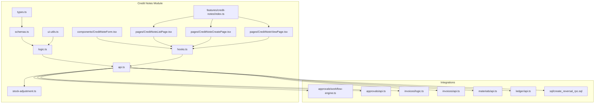
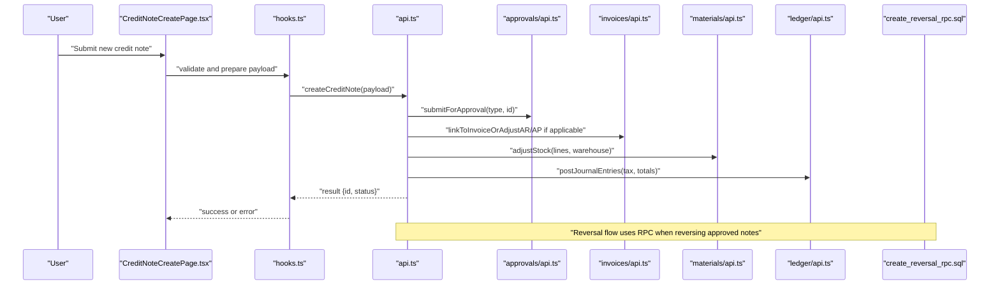
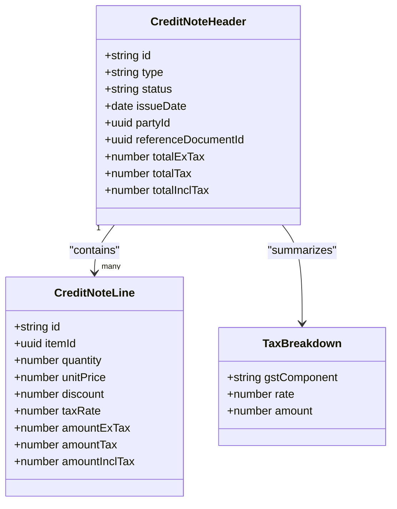
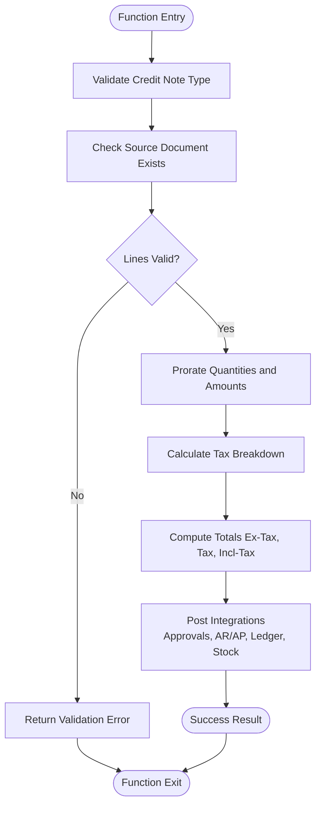
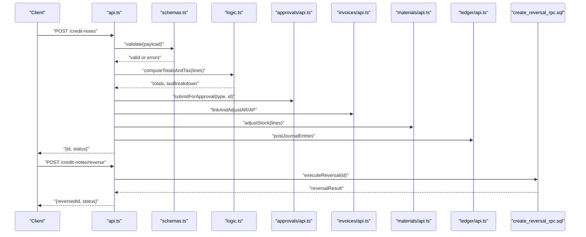
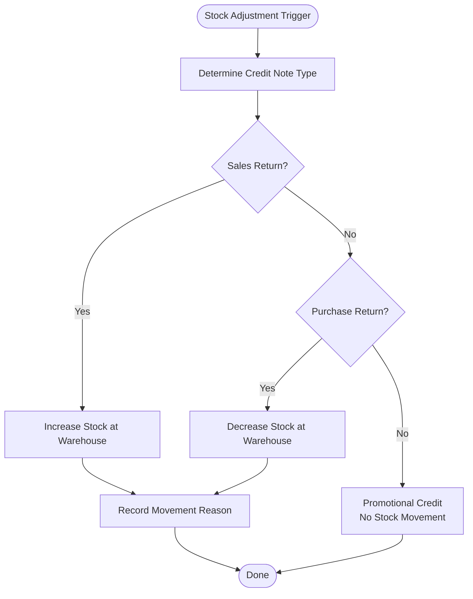
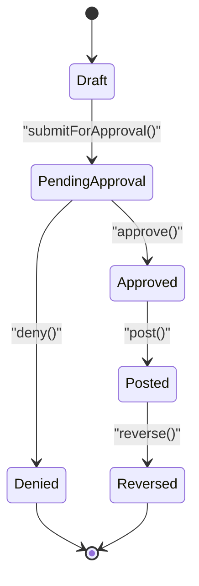
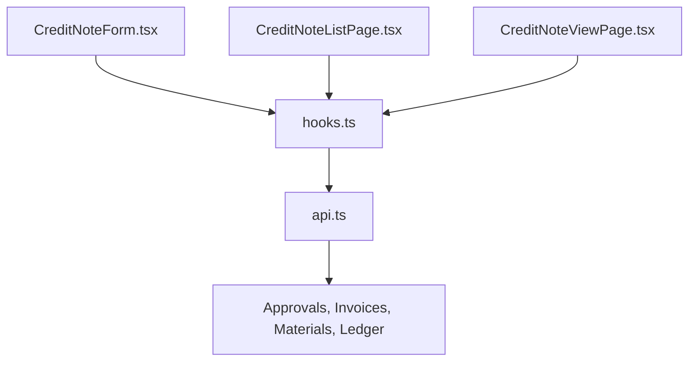
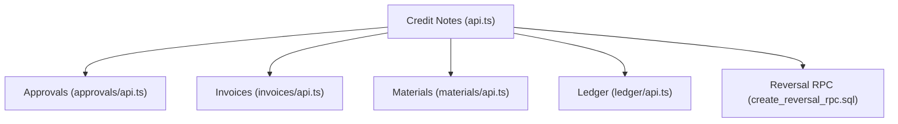

# Credit Notes

<cite>
**Referenced Files in This Document**
- [src/credit-notes/types.ts](file://src/credit-notes/types.ts)
- [src/credit-notes/schemas.ts](file://src/credit-notes/schemas.ts)
- [src/credit-notes/logic.ts](file://src/credit-notes/logic.ts)
- [src/credit-notes/api.ts](file://src/credit-notes/api.ts)
- [src/credit-notes/hooks.ts](file://src/credit-notes/hooks.ts)
- [src/credit-notes/ui-utils.ts](file://src/credit-notes/ui-utils.ts)
- [src/credit-notes/stock-adjustment.ts](file://src/credit-notes/stock-adjustment.ts)
- [src/credit-notes/components/CreditNoteForm.tsx](file://src/credit-notes/components/CreditNoteForm.tsx)
- [src/credit-notes/pages/CreditNoteListPage.tsx](file://src/credit-notes/pages/CreditNoteListPage.tsx)
- [src/credit-notes/pages/CreditNoteCreatePage.tsx](file://src/credit-notes/pages/CreditNoteCreatePage.tsx)
- [src/credit-notes/pages/CreditNoteViewPage.tsx](file://src/credit-notes/pages/CreditNoteViewPage.tsx)
- [src/features/credit-notes/index.ts](file://src/features/credit-notes/index.ts)
- [src/approvals/workflow-engine.ts](file://src/approvals/workflow-engine.ts)
- [src/approvals/api.ts](file://src/approvals/api.ts)
- [src/invoices/logic.ts](file://src/invoices/logic.ts)
- [src/invoices/api.ts](file://src/invoices/api.ts)
- [src/materials/api.ts](file://src/materials/api.ts)
- [src/ledger/api.ts](file://src/ledger/api.ts)
- [sql/create_reversal_rpc.sql](file://sql/create_reversal_rpc.sql)
</cite>

## Table of Contents
1. [Introduction](#introduction)
2. [Project Structure](#project-structure)
3. [Core Components](#core-components)
4. [Architecture Overview](#architecture-overview)
5. [Detailed Component Analysis](#detailed-component-analysis)
6. [Dependency Analysis](#dependency-analysis)
7. [Performance Considerations](#performance-considerations)
8. [Troubleshooting Guide](#troubleshooting-guide)
9. [Conclusion](#conclusion)
10. [Appendices](#appendices)

## Introduction
This document explains the Credit Notes system, covering creation for returns, adjustments, and price corrections; credit note types (sales returns, purchase returns, promotional credits); integration with inventory and financial ledgers; partial credit notes, reversals, and bulk processing; tax implications including GST handling; approval workflows; and integration with accounts receivable/payable systems. The content is grounded in the repository’s credit notes module and its integrations with approvals, invoices, materials, ledger, and SQL utilities.

## Project Structure
The Credit Notes feature is implemented as a dedicated module under src/credit-notes with clear separation of concerns:
- Types and schemas define data contracts and validation rules.
- Logic encapsulates business rules and calculations.
- API layer exposes endpoints and orchestrates cross-module operations.
- Hooks provide React integration for UI state and data fetching.
- UI utilities support formatting and display logic.
- Stock adjustment integration handles inventory impacts.
- Pages and components implement user flows for listing, creating, and viewing credit notes.
- Feature registration wires the module into the application.

**Diagram sources**
- [src/credit-notes/types.ts](file://src/credit-notes/types.ts)
- [src/credit-notes/schemas.ts](file://src/credit-notes/schemas.ts)
- [src/credit-notes/logic.ts](file://src/credit-notes/logic.ts)
- [src/credit-notes/api.ts](file://src/credit-notes/api.ts)
- [src/credit-notes/hooks.ts](file://src/credit-notes/hooks.ts)
- [src/credit-notes/ui-utils.ts](file://src/credit-notes/ui-utils.ts)
- [src/credit-notes/stock-adjustment.ts](file://src/credit-notes/stock-adjustment.ts)
- [src/credit-notes/components/CreditNoteForm.tsx](file://src/credit-notes/components/CreditNoteForm.tsx)
- [src/credit-notes/pages/CreditNoteListPage.tsx](file://src/credit-notes/pages/CreditNoteListPage.tsx)
- [src/credit-notes/pages/CreditNoteCreatePage.tsx](file://src/credit-notes/pages/CreditNoteCreatePage.tsx)
- [src/credit-notes/pages/CreditNoteViewPage.tsx](file://src/credit-notes/pages/CreditNoteViewPage.tsx)
- [src/features/credit-notes/index.ts](file://src/features/credit-notes/index.ts)
- [src/approvals/workflow-engine.ts](file://src/approvals/workflow-engine.ts)
- [src/approvals/api.ts](file://src/approvals/api.ts)
- [src/invoices/logic.ts](file://src/invoices/logic.ts)
- [src/invoices/api.ts](file://src/invoices/api.ts)
- [src/materials/api.ts](file://src/materials/api.ts)
- [src/ledger/api.ts](file://src/ledger/api.ts)
- [sql/create_reversal_rpc.sql](file://sql/create_reversal_rpc.sql)

**Section sources**
- [src/credit-notes/types.ts](file://src/credit-notes/types.ts)
- [src/credit-notes/schemas.ts](file://src/credit-notes/schemas.ts)
- [src/credit-notes/logic.ts](file://src/credit-notes/logic.ts)
- [src/credit-notes/api.ts](file://src/credit-notes/api.ts)
- [src/credit-notes/hooks.ts](file://src/credit-notes/hooks.ts)
- [src/credit-notes/ui-utils.ts](file://src/credit-notes/ui-utils.ts)
- [src/credit-notes/stock-adjustment.ts](file://src/credit-notes/stock-adjustment.ts)
- [src/credit-notes/components/CreditNoteForm.tsx](file://src/credit-notes/components/CreditNoteForm.tsx)
- [src/credit-notes/pages/CreditNoteListPage.tsx](file://src/credit-notes/pages/CreditNoteListPage.tsx)
- [src/credit-notes/pages/CreditNoteCreatePage.tsx](file://src/credit-notes/pages/CreditNoteCreatePage.tsx)
- [src/credit-notes/pages/CreditNoteViewPage.tsx](file://src/credit-notes/pages/CreditNoteViewPage.tsx)
- [src/features/credit-notes/index.ts](file://src/features/credit-notes/index.ts)

## Core Components
- Data model and validation:
  - Types define core entities such as credit note headers, line items, taxes, and linkage to source documents.
  - Schemas enforce input validation, required fields, and constraints for creation and updates.
- Business logic:
  - Calculations for totals, tax breakdowns, and proration for partial credits.
  - Rules for allowable reversal and adjustment scenarios.
- API orchestration:
  - Endpoints to create, update, list, view, reverse, and bulk process credit notes.
  - Integration calls to approvals, invoices, materials, ledger, and reversal RPC.
- UI integration:
  - Hooks manage loading, caching, mutations, and error states.
  - UI utilities format currency, tax labels, and status text.
- Inventory impact:
  - Stock adjustments are triggered based on credit note type and lines.
- Approval workflow:
  - Submission triggers approval requests; actions update credit note state.

**Section sources**
- [src/credit-notes/types.ts](file://src/credit-notes/types.ts)
- [src/credit-notes/schemas.ts](file://src/credit-notes/schemas.ts)
- [src/credit-notes/logic.ts](file://src/credit-notes/logic.ts)
- [src/credit-notes/api.ts](file://src/credit-notes/api.ts)
- [src/credit-notes/hooks.ts](file://src/credit-notes/hooks.ts)
- [src/credit-notes/ui-utils.ts](file://src/credit-notes/ui-utils.ts)
- [src/credit-notes/stock-adjustment.ts](file://src/credit-notes/stock-adjustment.ts)

## Architecture Overview
The Credit Notes system follows a layered architecture:
- Presentation layer: pages and components render forms, lists, and views.
- State layer: hooks coordinate data fetching and mutations.
- Domain layer: logic implements business rules and calculations.
- Integration layer: api.ts coordinates external modules and services.
- Persistence layer: database interactions via Supabase and SQL RPCs.

**Diagram sources**
- [src/credit-notes/pages/CreditNoteCreatePage.tsx](file://src/credit-notes/pages/CreditNoteCreatePage.tsx)
- [src/credit-notes/hooks.ts](file://src/credit-notes/hooks.ts)
- [src/credit-notes/api.ts](file://src/credit-notes/api.ts)
- [src/approvals/api.ts](file://src/approvals/api.ts)
- [src/invoices/api.ts](file://src/invoices/api.ts)
- [src/materials/api.ts](file://src/materials/api.ts)
- [src/ledger/api.ts](file://src/ledger/api.ts)
- [sql/create_reversal_rpc.sql](file://sql/create_reversal_rpc.sql)

## Detailed Component Analysis

### Data Model and Validation
- Types define:
  - Header-level attributes: type (sales return, purchase return, promotional credit), reference document IDs, dates, parties, currencies, and statuses.
  - Line-level attributes: item references, quantities, unit prices, discounts, tax rates, and amounts.
  - Tax details: GST components and totals.
- Schemas enforce:
  - Required header fields and valid type values.
  - Line item constraints (non-negative quantities, valid tax rates).
  - Cross-field validations (e.g., total cannot exceed original invoice amount for returns).

**Diagram sources**
- [src/credit-notes/types.ts](file://src/credit-notes/types.ts)
- [src/credit-notes/schemas.ts](file://src/credit-notes/schemas.ts)

**Section sources**
- [src/credit-notes/types.ts](file://src/credit-notes/types.ts)
- [src/credit-notes/schemas.ts](file://src/credit-notes/schemas.ts)

### Business Logic and Calculations
- Partial credit notes:
  - Prorate quantities and amounts against original invoice lines.
  - Validate that cumulative credited quantities do not exceed original delivered quantities.
- Adjustments and price corrections:
  - Allow negative quantities or zero-quantity lines with explicit reason codes.
  - Recalculate tax and totals after applying discounts and corrections.
- Reversals:
  - Reverse an existing credit note by creating a compensating entry and updating statuses.
  - Ensure only approved or posted notes can be reversed.

**Diagram sources**
- [src/credit-notes/logic.ts](file://src/credit-notes/logic.ts)

**Section sources**
- [src/credit-notes/logic.ts](file://src/credit-notes/logic.ts)

### API Orchestration and Integrations
- Create flow:
  - Validates payload using schemas.
  - Submits for approval if required by policy.
  - Links to invoices and adjusts accounts receivable/payable.
  - Posts journal entries to the ledger.
  - Triggers stock adjustments for returns.
- List and view flows:
  - Fetches credit notes with filters and pagination.
  - Displays linked documents, approvals, and audit trails.
- Reversal flow:
  - Calls reversal RPC to ensure atomicity and consistency.
  - Updates statuses and notifies downstream systems.

**Diagram sources**
- [src/credit-notes/api.ts](file://src/credit-notes/api.ts)
- [src/credit-notes/schemas.ts](file://src/credit-notes/schemas.ts)
- [src/credit-notes/logic.ts](file://src/credit-notes/logic.ts)
- [src/approvals/api.ts](file://src/approvals/api.ts)
- [src/invoices/api.ts](file://src/invoices/api.ts)
- [src/materials/api.ts](file://src/materials/api.ts)
- [src/ledger/api.ts](file://src/ledger/api.ts)
- [sql/create_reversal_rpc.sql](file://sql/create_reversal_rpc.sql)

**Section sources**
- [src/credit-notes/api.ts](file://src/credit-notes/api.ts)
- [sql/create_reversal_rpc.sql](file://sql/create_reversal_rpc.sql)

### Stock Adjustment Integration
- For sales returns:
  - Increases stock at the originating warehouse.
  - Records movement reasons and links to the credit note.
- For purchase returns:
  - Decreases stock at the receiving warehouse.
  - Ensures batch/lot tracking if applicable.
- Promotional credits:
  - Typically no stock movement unless tied to physical goods.

**Diagram sources**
- [src/credit-notes/stock-adjustment.ts](file://src/credit-notes/stock-adjustment.ts)

**Section sources**
- [src/credit-notes/stock-adjustment.ts](file://src/credit-notes/stock-adjustment.ts)

### Approval Workflows
- Submission:
  - When a credit note is created, the system checks approval settings and submits a request if required.
- Actions:
  - Approvers can approve or deny; upon approval, the credit note transitions to an approved/posted state.
- Notifications:
  - Stakeholders receive notifications for pending actions and outcomes.

**Diagram sources**
- [src/approvals/workflow-engine.ts](file://src/approvals/workflow-engine.ts)
- [src/approvals/api.ts](file://src/approvals/api.ts)

**Section sources**
- [src/approvals/workflow-engine.ts](file://src/approvals/workflow-engine.ts)
- [src/approvals/api.ts](file://src/approvals/api.ts)

### UI Components and Pages
- Forms:
  - CreditNoteForm validates inputs and displays real-time totals and tax breakdowns.
- Lists:
  - CreditNoteListPage supports filtering by type, date range, status, and linked documents.
- Views:
  - CreditNoteViewPage shows full details, approval history, and related transactions.

**Diagram sources**
- [src/credit-notes/components/CreditNoteForm.tsx](file://src/credit-notes/components/CreditNoteForm.tsx)
- [src/credit-notes/pages/CreditNoteListPage.tsx](file://src/credit-notes/pages/CreditNoteListPage.tsx)
- [src/credit-notes/pages/CreditNoteViewPage.tsx](file://src/credit-notes/pages/CreditNoteViewPage.tsx)
- [src/credit-notes/hooks.ts](file://src/credit-notes/hooks.ts)
- [src/credit-notes/api.ts](file://src/credit-notes/api.ts)

**Section sources**
- [src/credit-notes/components/CreditNoteForm.tsx](file://src/credit-notes/components/CreditNoteForm.tsx)
- [src/credit-notes/pages/CreditNoteListPage.tsx](file://src/credit-notes/pages/CreditNoteListPage.tsx)
- [src/credit-notes/pages/CreditNoteViewPage.tsx](file://src/credit-notes/pages/CreditNoteViewPage.tsx)
- [src/credit-notes/hooks.ts](file://src/credit-notes/hooks.ts)

### Examples and Use Cases
- Partial credit notes:
  - Create a credit note referencing an invoice and specify quantities less than the original delivery. The system prorates amounts and taxes accordingly.
- Credit note reversals:
  - Reverse an approved credit note using the reversal endpoint; the system creates a compensating entry and updates statuses.
- Bulk credit processing:
  - Submit multiple credit notes in a single operation; the API batches submissions and returns aggregated results.

[No sources needed since this section provides general guidance]

## Dependency Analysis
The Credit Notes module depends on several internal modules and SQL utilities:
- Approvals: submission and action handling.
- Invoices: linking and AR/AP adjustments.
- Materials: stock movements.
- Ledger: journal postings.
- SQL RPC: atomic reversal operations.

**Diagram sources**
- [src/credit-notes/api.ts](file://src/credit-notes/api.ts)
- [src/approvals/api.ts](file://src/approvals/api.ts)
- [src/invoices/api.ts](file://src/invoices/api.ts)
- [src/materials/api.ts](file://src/materials/api.ts)
- [src/ledger/api.ts](file://src/ledger/api.ts)
- [sql/create_reversal_rpc.sql](file://sql/create_reversal_rpc.sql)

**Section sources**
- [src/credit-notes/api.ts](file://src/credit-notes/api.ts)
- [src/approvals/api.ts](file://src/approvals/api.ts)
- [src/invoices/api.ts](file://src/invoices/api.ts)
- [src/materials/api.ts](file://src/materials/api.ts)
- [src/ledger/api.ts](file://src/ledger/api.ts)
- [sql/create_reversal_rpc.sql](file://sql/create_reversal_rpc.sql)

## Performance Considerations
- Batch operations:
  - Prefer bulk endpoints for large sets of credit notes to reduce round trips.
- Caching:
  - Leverage hooks’ caching strategies for list views and frequently accessed credit notes.
- Validation early:
  - Perform schema validation on the client side to minimize server load and improve UX.
- Idempotency:
  - Ensure create and reversal operations are idempotent to handle retries safely.

[No sources needed since this section provides general guidance]

## Troubleshooting Guide
Common issues and resolutions:
- Validation failures:
  - Check required fields and constraints enforced by schemas.
- Approval bottlenecks:
  - Verify approval policies and notify approvers through the workflow engine.
- Stock discrepancies:
  - Confirm warehouse selection and movement reasons; review stock adjustment logs.
- Ledger mismatches:
  - Inspect journal entries posted by the ledger integration; reconcile totals and tax breakdowns.
- Reversal errors:
  - Ensure the credit note is in an eligible state; check RPC execution logs.

**Section sources**
- [src/credit-notes/schemas.ts](file://src/credit-notes/schemas.ts)
- [src/approvals/workflow-engine.ts](file://src/approvals/workflow-engine.ts)
- [src/credit-notes/stock-adjustment.ts](file://src/credit-notes/stock-adjustment.ts)
- [src/ledger/api.ts](file://src/ledger/api.ts)
- [sql/create_reversal_rpc.sql](file://sql/create_reversal_rpc.sql)

## Conclusion
The Credit Notes system provides robust capabilities for returns, adjustments, and price corrections with strong integrations across approvals, invoices, inventory, and ledger. It supports partial credits, reversals, and bulk processing while enforcing validation and compliance. The modular design ensures maintainability and scalability, with clear separation between UI, state, domain logic, and integrations.

[No sources needed since this section summarizes without analyzing specific files]

## Appendices

### Credit Note Types
- Sales Returns:
  - Link to customer invoices; increase stock; adjust AR.
- Purchase Returns:
  - Link to supplier receipts; decrease stock; adjust AP.
- Promotional Credits:
  - Non-inventory adjustments; typically no stock movement; may affect pricing promotions.

[No sources needed since this section provides general guidance]

### Tax Implications and GST Handling
- GST components:
  - Calculate CGST, SGST, IGST based on place of supply and tax rates.
- Compliance:
  - Ensure tax rates and HSN/SAC codes are correctly associated with items.
- Reporting:
  - Export tax summaries for regulatory filings.

[No sources needed since this section provides general guidance]

### Accounts Receivable/Payable Integration
- AR:
  - Reduce outstanding balances for sales returns and promotional credits.
- AP:
  - Reduce payable obligations for purchase returns.
- Reconciliation:
  - Maintain traceability from credit notes to ledger entries and party balances.

[No sources needed since this section provides general guidance]