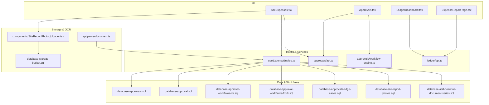
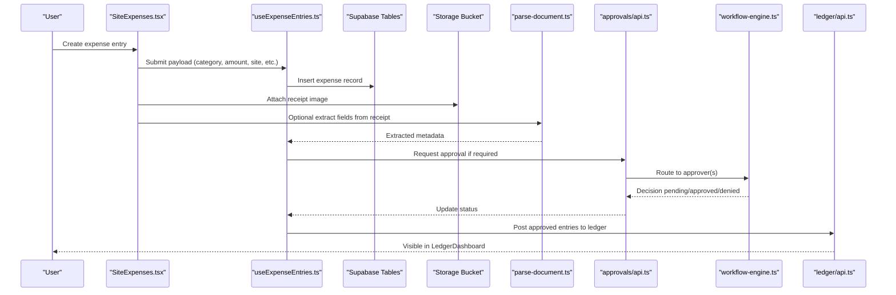
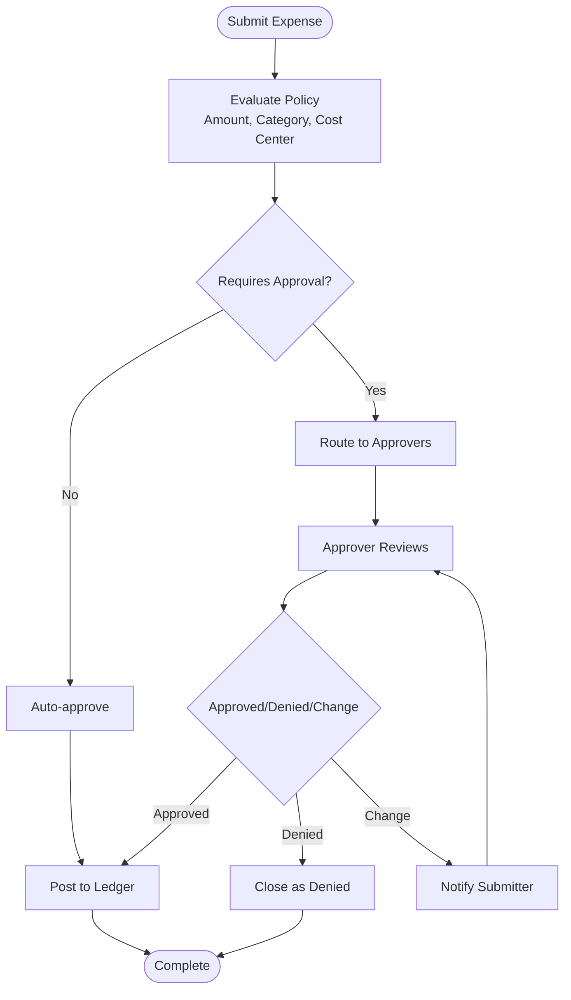
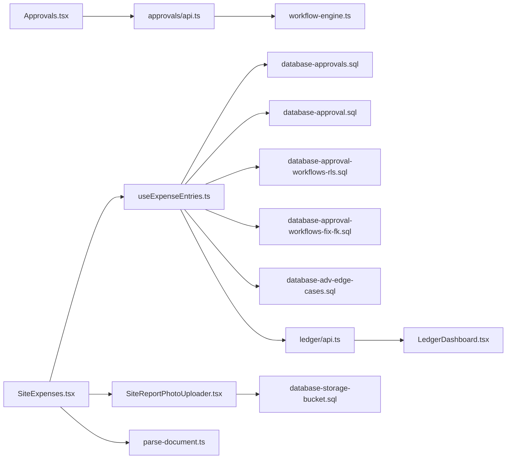

# Expense Management

<cite>
**Referenced Files in This Document**
- [SiteExpenses.tsx](file://src/pages/SiteExpenses.tsx)
- [useExpenseEntries.ts](file://src/hooks/useExpenseEntries.ts)
- [AdvanceExpense/index.ts](file://src/modules/AdvanceExpense/index.ts)
- [AdvanceExpense/api.ts](file://src/modules/AdvanceExpense/api.ts)
- [Approvals.tsx](file://src/pages/Approvals.tsx)
- [approvals/api.ts](file://src/approvals/api.ts)
- [approvals/workflow-engine.ts](file://src/approvals/workflow-engine.ts)
- [ledger/LedgerDashboard.tsx](file://src/ledger/LedgerDashboard.tsx)
- [ledger/api.ts](file://src/ledger/api.ts)
- [database-add-columns-document-series.sql](file://src/database-add-columns-document-series.sql)
- [database-approval-workflows-fix-fk.sql](file://src/database-approval-workflows-fix-fk.sql)
- [database-approval-workflows-rls.sql](file://src/database-approval-workflows-rls.sql)
- [database-approval.sql](file://src/database-approval.sql)
- [database-approvals-edge-cases.sql](file://src/database-approvals-edge-cases.sql)
- [database-approvals.sql](file://src/database-approvals.sql)
- [database-site-report-photos.sql](file://src/database-site-report-photos.sql)
- [database-storage-bucket.sql](file://src/database-storage-bucket.sql)
- [components/SiteReportPhotoUploader.tsx](file://src/components/SiteReportPhotoUploader.tsx)
- [api/parse-document.ts](file://api/parse-document.ts)
- [hooks/useAuditLog.ts](file://src/hooks/useAuditLog.ts)
- [reports/ExpenseReportPage.tsx](file://src/pages/reports/ExpenseReportPage.tsx)
</cite>

## Table of Contents
1. [Introduction](#introduction)
2. [Project Structure](#project-structure)
3. [Core Components](#core-components)
4. [Architecture Overview](#architecture-overview)
5. [Detailed Component Analysis](#detailed-component-analysis)
6. [Dependency Analysis](#dependency-analysis)
7. [Performance Considerations](#performance-considerations)
8. [Troubleshooting Guide](#troubleshooting-guide)
9. [Conclusion](#conclusion)
10. [Appendices](#appendices)

## Introduction
This document describes the Expense Management module, covering expense entry creation with categorization and receipt attachment, site-specific expenses, travel claims, petty cash management, reporting, budget monitoring, cost center allocation, recurring expenses, advance settlements, reimbursement processing, mobile capture, OCR scanning, accounting integrations, policies and approval hierarchies, and audit trail maintenance. It maps these capabilities to the existing codebase and highlights where features are implemented versus planned.

## Project Structure
The Expense Management functionality spans UI pages, hooks for data access, approval workflows, ledger integration, storage for receipts, and database migrations that define core tables and relationships.

**Diagram sources**
- [SiteExpenses.tsx](file://src/pages/SiteExpenses.tsx)
- [useExpenseEntries.ts](file://src/hooks/useExpenseEntries.ts)
- [Approvals.tsx](file://src/pages/Approvals.tsx)
- [approvals/api.ts](file://src/approvals/api.ts)
- [approvals/workflow-engine.ts](file://src/approvals/workflow-engine.ts)
- [ledger/LedgerDashboard.tsx](file://src/ledger/LedgerDashboard.tsx)
- [ledger/api.ts](file://src/ledger/api.ts)
- [database-storage-bucket.sql](file://src/database-storage-bucket.sql)
- [components/SiteReportPhotoUploader.tsx](file://src/components/SiteReportPhotoUploader.tsx)
- [api/parse-document.ts](file://api/parse-document.ts)
- [database-approvals.sql](file://src/database-approvals.sql)
- [database-approval.sql](file://src/database-approval.sql)
- [database-approval-workflows-rls.sql](file://src/database-approval-workflows-rls.sql)
- [database-approval-workflows-fix-fk.sql](file://src/database-approval-workflows-fix-fk.sql)
- [database-approvals-edge-cases.sql](file://src/database-approvals-edge-cases.sql)
- [database-site-report-photos.sql](file://src/database-site-report-photos.sql)
- [database-add-columns-document-series.sql](file://src/database-add-columns-document-series.sql)

**Section sources**
- [SiteExpenses.tsx](file://src/pages/SiteExpenses.tsx)
- [useExpenseEntries.ts](file://src/hooks/useExpenseEntries.ts)
- [Approvals.tsx](file://src/pages/Approvals.tsx)
- [approvals/api.ts](file://src/approvals/api.ts)
- [approvals/workflow-engine.ts](file://src/approvals/workflow-engine.ts)
- [ledger/LedgerDashboard.tsx](file://src/ledger/LedgerDashboard.tsx)
- [ledger/api.ts](file://src/ledger/api.ts)
- [database-storage-bucket.sql](file://src/database-storage-bucket.sql)
- [components/SiteReportPhotoUploader.tsx](file://src/components/SiteReportPhotoUploader.tsx)
- [api/parse-document.ts](file://api/parse-document.ts)
- [database-approvals.sql](file://src/database-approvals.sql)
- [database-approval.sql](file://src/database-approval.sql)
- [database-approval-workflows-rls.sql](file://src/database-approval-workflows-rls.sql)
- [database-approval-workflows-fix-fk.sql](file://src/database-approval-workflows-fix-fk.sql)
- [database-approvals-edge-cases.sql](file://src/database-approvals-edge-cases.sql)
- [database-site-report-photos.sql](file://src/database-site-report-photos.sql)
- [database-add-columns-document-series.sql](file://src/database-add-columns-document-series.sql)

## Core Components
- Site Expenses Entry: The page provides a form-like interface to create and manage site-related expenses, including categorization and attachments. It integrates with an expense entries hook for data operations and supports photo uploads via a shared uploader component.
- Approval Workflow: Approvals page orchestrates submission, review, and actioning of expense requests through the approvals API and workflow engine.
- Ledger Integration: The ledger dashboard exposes financial postings and balances, enabling reconciliation and reporting from expense transactions.
- Storage and OCR: Receipt images are stored using a storage bucket mechanism; a document parser endpoint is available for OCR-style extraction.
- Audit Trail: An audit log hook is present to support tracking changes and actions across modules.

Key implementation references:
- Expense entry UI and data binding: [SiteExpenses.tsx](file://src/pages/SiteExpenses.tsx), [useExpenseEntries.ts](file://src/hooks/useExpenseEntries.ts)
- Photo upload: [components/SiteReportPhotoUploader.tsx](file://src/components/SiteReportPhotoUploader.tsx), [database-storage-bucket.sql](file://src/database-storage-bucket.sql)
- Approvals: [Approvals.tsx](file://src/pages/Approvals.tsx), [approvals/api.ts](file://src/approvals/api.ts), [approvals/workflow-engine.ts](file://src/approvals/workflow-engine.ts)
- Ledger: [ledger/LedgerDashboard.tsx](file://src/ledger/LedgerDashboard.tsx), [ledger/api.ts](file://src/ledger/api.ts)
- OCR parsing: [api/parse-document.ts](file://api/parse-document.ts)
- Audit logging: [hooks/useAuditLog.ts](file://src/hooks/useAuditLog.ts)

**Section sources**
- [SiteExpenses.tsx](file://src/pages/SiteExpenses.tsx)
- [useExpenseEntries.ts](file://src/hooks/useExpenseEntries.ts)
- [components/SiteReportPhotoUploader.tsx](file://src/components/SiteReportPhotoUploader.tsx)
- [database-storage-bucket.sql](file://src/database-storage-bucket.sql)
- [Approvals.tsx](file://src/pages/Approvals.tsx)
- [approvals/api.ts](file://src/approvals/api.ts)
- [approvals/workflow-engine.ts](file://src/approvals/workflow-engine.ts)
- [ledger/LedgerDashboard.tsx](file://src/ledger/LedgerDashboard.tsx)
- [ledger/api.ts](file://src/ledger/api.ts)
- [api/parse-document.ts](file://api/parse-document.ts)
- [hooks/useAuditLog.ts](file://src/hooks/useAuditLog.ts)

## Architecture Overview
The expense flow connects user input (site expenses), validation and persistence (hooks and DB), optional OCR extraction, receipt storage, approval routing, and ledger posting. Reporting and dashboards consume posted data for insights.

**Diagram sources**
- [SiteExpenses.tsx](file://src/pages/SiteExpenses.tsx)
- [useExpenseEntries.ts](file://src/hooks/useExpenseEntries.ts)
- [database-storage-bucket.sql](file://src/database-storage-bucket.sql)
- [api/parse-document.ts](file://api/parse-document.ts)
- [approvals/api.ts](file://src/approvals/api.ts)
- [approvals/workflow-engine.ts](file://src/approvals/workflow-engine.ts)
- [ledger/api.ts](file://src/ledger/api.ts)

## Detailed Component Analysis

### Expense Entry Creation and Categorization
- Purpose: Allow users to create expense entries with category selection, site/project linkage, amounts, dates, and notes.
- Data Access: Uses a dedicated hook to perform CRUD operations against the expense schema.
- Validation: Client-side checks ensure required fields and numeric constraints before submission.
- Persistence: Inserts records into the expense table and updates related dimensions (site, project, cost center).

Implementation references:
- [SiteExpenses.tsx](file://src/pages/SiteExpenses.tsx)
- [useExpenseEntries.ts](file://src/hooks/useExpenseEntries.ts)

**Section sources**
- [SiteExpenses.tsx](file://src/pages/SiteExpenses.tsx)
- [useExpenseEntries.ts](file://src/hooks/useExpenseEntries.ts)

### Receipt Attachment and Mobile Capture
- Purpose: Attach receipts to expense entries for audit and verification.
- Storage: Images are uploaded to a storage bucket configured by migration scripts.
- UI: A reusable photo uploader component handles drag-and-drop and camera capture on mobile devices.

Implementation references:
- [components/SiteReportPhotoUploader.tsx](file://src/components/SiteReportPhotoUploader.tsx)
- [database-storage-bucket.sql](file://src/database-storage-bucket.sql)

**Section sources**
- [components/SiteReportPhotoUploader.tsx](file://src/components/SiteReportPhotoUploader.tsx)
- [database-storage-bucket.sql](file://src/database-storage-bucket.sql)

### OCR Receipt Scanning
- Purpose: Extract structured data from receipts (vendor, date, amount, tax) to prefill expense lines.
- Flow: Image upload triggers a parse endpoint which returns extracted fields; UI merges them into the draft entry.

Implementation references:
- [api/parse-document.ts](file://api/parse-document.ts)

**Section sources**
- [api/parse-document.ts](file://api/parse-document.ts)

### Approval Workflows and Hierarchies
- Purpose: Enforce policy-based approvals based on amount thresholds, categories, or cost centers.
- Routing: The workflow engine determines approvers and escalation paths; the approvals API manages state transitions.
- Actions: Approvers can approve, deny, or request changes; statuses propagate back to the expense entry.

Implementation references:
- [Approvals.tsx](file://src/pages/Approvals.tsx)
- [approvals/api.ts](file://src/approvals/api.ts)
- [approvals/workflow-engine.ts](file://src/approvals/workflow-engine.ts)
- [database-approvals.sql](file://src/database-approvals.sql)
- [database-approval.sql](file://src/database-approval.sql)
- [database-approval-workflows-rls.sql](file://src/database-approval-workflows-rls.sql)
- [database-approval-workflows-fix-fk.sql](file://src/database-approval-workflows-fix-fk.sql)
- [database-approvals-edge-cases.sql](file://src/database-approvals-edge-cases.sql)

**Diagram sources**
- [approvals/workflow-engine.ts](file://src/approvals/workflow-engine.ts)
- [approvals/api.ts](file://src/approvals/api.ts)
- [database-approvals.sql](file://src/database-approvals.sql)
- [database-approval.sql](file://src/database-approval.sql)
- [database-approval-workflows-rls.sql](file://src/database-approval-workflows-rls.sql)
- [database-approval-workflows-fix-fk.sql](file://src/database-approval-workflows-fix-fk.sql)
- [database-approvals-edge-cases.sql](file://src/database-approvals-edge-cases.sql)

**Section sources**
- [Approvals.tsx](file://src/pages/Approvals.tsx)
- [approvals/api.ts](file://src/approvals/api.ts)
- [approvals/workflow-engine.ts](file://src/approvals/workflow-engine.ts)
- [database-approvals.sql](file://src/database-approvals.sql)
- [database-approval.sql](file://src/database-approval.sql)
- [database-approval-workflows-rls.sql](file://src/database-approval-workflows-rls.sql)
- [database-approval-workflows-fix-fk.sql](file://src/database-approval-workflows-fix-fk.sql)
- [database-approvals-edge-cases.sql](file://src/database-approvals-edge-cases.sql)

### Site-Specific Expenses, Travel Claims, and Petty Cash
- Site Expenses: Entries are linked to sites/projects and can include per-diem and travel line items.
- Travel Claims: Specialized categories and allowances can be modeled within the same entry structure.
- Petty Cash: Small-value expenses can be batched and reconciled at site level.

Implementation references:
- [SiteExpenses.tsx](file://src/pages/SiteExpenses.tsx)
- [useExpenseEntries.ts](file://src/hooks/useExpenseEntries.ts)

**Section sources**
- [SiteExpenses.tsx](file://src/pages/SiteExpenses.tsx)
- [useExpenseEntries.ts](file://src/hooks/useExpenseEntries.ts)

### Advance Settlements and Reimbursement Processing
- Advances: The AdvanceExpense module provides interfaces for requesting and settling advances.
- Settlement: When expenses are approved, they can offset outstanding advances; remaining balances trigger reimbursements.
- Reimbursements: Posted entries feed into payroll or vendor payment flows via ledger integrations.

Implementation references:
- [modules/AdvanceExpense/index.ts](file://src/modules/AdvanceExpense/index.ts)
- [modules/AdvanceExpense/api.ts](file://src/modules/AdvanceExpense/api.ts)
- [ledger/api.ts](file://src/ledger/api.ts)

**Section sources**
- [modules/AdvanceExpense/index.ts](file://src/modules/AdvanceExpense/index.ts)
- [modules/AdvanceExpense/api.ts](file://src/modules/AdvanceExpense/api.ts)
- [ledger/api.ts](file://src/ledger/api.ts)

### Expense Reporting, Budget Monitoring, and Cost Center Allocation
- Reporting: Reports aggregate expenses by period, site, category, and cost center.
- Budget Monitoring: Compare actuals vs budgets using ledger postings and dimension filters.
- Cost Centers: Entries carry cost center attributes; reports roll up accordingly.

Implementation references:
- [reports/ExpenseReportPage.tsx](file://src/pages/reports/ExpenseReportPage.tsx)
- [ledger/LedgerDashboard.tsx](file://src/ledger/LedgerDashboard.tsx)
- [ledger/api.ts](file://src/ledger/api.ts)

**Section sources**
- [reports/ExpenseReportPage.tsx](file://src/pages/reports/ExpenseReportPage.tsx)
- [ledger/LedgerDashboard.tsx](file://src/ledger/LedgerDashboard.tsx)
- [ledger/api.ts](file://src/ledger/api.ts)

### Recurring Expenses
- Concept: Recurring patterns (subscriptions, rent, utilities) can be modeled as templates or scheduled drafts.
- Automation: Future work may introduce cron jobs to auto-create entries based on schedules.

Implementation references:
- [useExpenseEntries.ts](file://src/hooks/useExpenseEntries.ts)

**Section sources**
- [useExpenseEntries.ts](file://src/hooks/useExpenseEntries.ts)

### Accounting Integrations
- Posting: Approved expenses post to general ledger accounts defined in chart of accounts.
- Series and Numbering: Document series columns support consistent numbering for auditability.
- Export: Ledger exports can integrate with external accounting systems.

Implementation references:
- [database-add-columns-document-series.sql](file://src/database-add-columns-document-series.sql)
- [ledger/api.ts](file://src/ledger/api.ts)

**Section sources**
- [database-add-columns-document-series.sql](file://src/database-add-columns-document-series.sql)
- [ledger/api.ts](file://src/ledger/api.ts)

### Policies, Approval Hierarchies, and Audit Trail
- Policies: Rules govern who approves what based on amount, category, and department/cost center.
- Hierarchies: Multi-level approvals and escalations are supported by the workflow engine.
- Audit Trail: Changes and actions are logged for compliance and traceability.

Implementation references:
- [approvals/workflow-engine.ts](file://src/approvals/workflow-engine.ts)
- [approvals/api.ts](file://src/approvals/api.ts)
- [hooks/useAuditLog.ts](file://src/hooks/useAuditLog.ts)

**Section sources**
- [approvals/workflow-engine.ts](file://src/approvals/workflow-engine.ts)
- [approvals/api.ts](file://src/approvals/api.ts)
- [hooks/useAuditLog.ts](file://src/hooks/useAuditLog.ts)

## Dependency Analysis
The following diagram shows key dependencies between UI, hooks, services, storage, and database layers.

**Diagram sources**
- [SiteExpenses.tsx](file://src/pages/SiteExpenses.tsx)
- [useExpenseEntries.ts](file://src/hooks/useExpenseEntries.ts)
- [Approvals.tsx](file://src/pages/Approvals.tsx)
- [approvals/api.ts](file://src/approvals/api.ts)
- [approvals/workflow-engine.ts](file://src/approvals/workflow-engine.ts)
- [database-approvals.sql](file://src/database-approvals.sql)
- [database-approval.sql](file://src/database-approval.sql)
- [database-approval-workflows-rls.sql](file://src/database-approval-workflows-rls.sql)
- [database-approval-workflows-fix-fk.sql](file://src/database-approval-workflows-fix-fk.sql)
- [database-approvals-edge-cases.sql](file://src/database-approvals-edge-cases.sql)
- [components/SiteReportPhotoUploader.tsx](file://src/components/SiteReportPhotoUploader.tsx)
- [database-storage-bucket.sql](file://src/database-storage-bucket.sql)
- [api/parse-document.ts](file://api/parse-document.ts)
- [ledger/api.ts](file://src/ledger/api.ts)
- [ledger/LedgerDashboard.tsx](file://src/ledger/LedgerDashboard.tsx)

**Section sources**
- [SiteExpenses.tsx](file://src/pages/SiteExpenses.tsx)
- [useExpenseEntries.ts](file://src/hooks/useExpenseEntries.ts)
- [Approvals.tsx](file://src/pages/Approvals.tsx)
- [approvals/api.ts](file://src/approvals/api.ts)
- [approvals/workflow-engine.ts](file://src/approvals/workflow-engine.ts)
- [database-approvals.sql](file://src/database-approvals.sql)
- [database-approval.sql](file://src/database-approval.sql)
- [database-approval-workflows-rls.sql](file://src/database-approval-workflows-rls.sql)
- [database-approval-workflows-fix-fk.sql](file://src/database-approval-workflows-fix-fk.sql)
- [database-approvals-edge-cases.sql](file://src/database-approvals-edge-cases.sql)
- [components/SiteReportPhotoUploader.tsx](file://src/components/SiteReportPhotoUploader.tsx)
- [database-storage-bucket.sql](file://src/database-storage-bucket.sql)
- [api/parse-document.ts](file://api/parse-document.ts)
- [ledger/api.ts](file://src/ledger/api.ts)
- [ledger/LedgerDashboard.tsx](file://src/ledger/LedgerDashboard.tsx)

## Performance Considerations
- Batch Operations: For large site expense batches, prefer bulk inserts and updates to reduce round-trips.
- Image Handling: Compress and resize receipts before upload to minimize bandwidth and storage costs.
- Pagination and Filtering: Use server-side pagination and indexed filters for reports and approvals queues.
- Caching: Cache reference data (categories, cost centers, approvers) to avoid repeated lookups.
- OCR Throttling: Queue OCR jobs and debounce heavy parsing to prevent UI blocking.

[No sources needed since this section provides general guidance]

## Troubleshooting Guide
- Approval Not Routing: Verify workflow rules and RLS policies; check foreign key integrity for approver mappings.
- Missing Receipts: Confirm storage bucket permissions and upload success callbacks.
- Ledger Mismatch: Validate document series and account mappings; reconcile posted entries with source expenses.
- OCR Failures: Inspect parse endpoint responses and retry with higher-quality images.
- Audit Gaps: Ensure audit log writes succeed and are not suppressed by environment settings.

**Section sources**
- [database-approval-workflows-rls.sql](file://src/database-approval-workflows-rls.sql)
- [database-approval-workflows-fix-fk.sql](file://src/database-approval-workflows-fix-fk.sql)
- [database-storage-bucket.sql](file://src/database-storage-bucket.sql)
- [database-add-columns-document-series.sql](file://src/database-add-columns-document-series.sql)
- [api/parse-document.ts](file://api/parse-document.ts)
- [hooks/useAuditLog.ts](file://src/hooks/useAuditLog.ts)

## Conclusion
The Expense Management module integrates entry creation, receipt handling, OCR assistance, robust approvals, and ledger posting. With current components and migrations, teams can manage site expenses, travel claims, petty cash, advances, and reimbursements while maintaining auditability and supporting reporting and budget control. Future enhancements can expand recurring automation, richer OCR, and deeper accounting system integrations.

[No sources needed since this section summarizes without analyzing specific files]

## Appendices

### Example Workflows

#### Recurring Expenses
- Define a template with category, cost center, and schedule.
- On schedule, create draft entries for approval.
- Auto-approve low-risk recurring items per policy.

References:
- [useExpenseEntries.ts](file://src/hooks/useExpenseEntries.ts)

#### Advance Settlement
- Employee requests advance; admin approves.
- Employee submits expenses linked to advance.
- System offsets advance balance and posts remainder to ledger.

References:
- [modules/AdvanceExpense/index.ts](file://src/modules/AdvanceExpense/index.ts)
- [modules/AdvanceExpense/api.ts](file://src/modules/AdvanceExpense/api.ts)
- [ledger/api.ts](file://src/ledger/api.ts)

#### Reimbursement Processing
- Approved expenses generate payable entries.
- Payroll or payments module processes disbursements.
- Status updates reflect completion in approvals and ledger.

References:
- [ledger/api.ts](file://src/ledger/api.ts)
- [Approvals.tsx](file://src/pages/Approvals.tsx)