# Financial Operations

<cite>
**Referenced Files in This Document**
- [invoices/index.ts](file://src/invoices/index.ts)
- [invoices/api.ts](file://src/invoices/api.ts)
- [invoices/hooks.ts](file://src/invoices/hooks.ts)
- [invoices/types.ts](file://src/invoices/types.ts)
- [invoices/logic.ts](file://src/invoices/logic.ts)
- [invoices/schemas.ts](file://src/invoices/schemas.ts)
- [invoices/components/CreateProjectInvoiceModal.tsx](file://src/components/CreateProjectInvoiceModal.tsx)
- [proforma-invoices/index.ts](file://src/proforma-invoices/index.ts)
- [proforma-invoices/api.ts](file://src/proforma-invoices/api.ts)
- [proforma-invoices/hooks.ts](file://src/proforma-invoices/hooks.ts)
- [proforma-invoices/types.ts](file://src/proforma-invoices/types.ts)
- [credit-notes/index.ts](file://src/credit-notes/index.ts)
- [credit-notes/api.ts](file://src/credit-notes/api.ts)
- [credit-notes/hooks.ts](file://src/credit-notes/hooks.ts)
- [credit-notes/types.ts](file://src/credit-notes/types.ts)
- [credit-notes/logic.ts](file://src/credit-notes/logic.ts)
- [ledger/LedgerDashboard.tsx](file://src/ledger/LedgerDashboard.tsx)
- [ledger/LedgerModal.tsx](file://src/ledger/LedgerModal.tsx)
- [ledger/api.ts](file://src/ledger/api.ts)
- [ledger/hooks.ts](file://src/ledger/hooks.ts)
- [ledger/schemas.ts](file://src/ledger/schemas.ts)
- [ledger/utils.ts](file://src/ledger/utils.ts)
- [purchase-requisitions/index.ts](file://src/purchase-requisitions/index.ts)
- [purchase-requisitions/api.ts](file://src/purchase-requisitions/api.ts)
- [modules/Purchase/index.ts](file://src/modules/Purchase/index.ts)
- [modules/Purchase/api.ts](file://src/modules/Purchase/api.ts)
- [pages/CreatePO.tsx](file://src/pages/CreatePO.tsx)
- [pages/POList.tsx](file://src/pages/POList.tsx)
- [pages/PODetails.tsx](file://src/pages/PODetails.tsx)
- [hooks/useExpenseEntries.ts](file://src/hooks/useExpenseEntries.ts)
- [pages/SiteExpenses.tsx](file://src/pages/SiteExpenses.tsx)
- [lib/currency.ts](file://src/lib/currency.ts)
- [database/database-hsn-tax.sql](file://src/database-hsn-tax.sql)
- [database/database-proforma-invoices.sql](file://src/database-proforma-invoices.sql)
- [database/database-purchase-module.sql](file://src/database-purchase-module.sql)
- [database/database-subcontractor-ledger-complete.sql](file://src/database/subcontractor_ledger_complete.sql)
- [database/database-document-series.sql](file://src/database-document-series.sql)
- [database/database-item-audit.sql](file://src/database-item-audit.sql)
- [database/database-approval-workflows-rls.sql](file://src/database-approval-workflows-rls.sql)
- [approvals/workflow-engine.ts](file://src/approvals/workflow-engine.ts)
- [approvals/settings-api.ts](file://src/approvals/settings-api.ts)
- [approvals/integration.ts](file://src/approvals/integration.ts)
- [hooks/useApprovals.ts](file://src/hooks/useApprovals.ts)
- [hooks/useAuditLog.ts](file://src/hooks/useAuditLog.ts)
- [pages/accounting/index.tsx](file://src/pages/accounting/index.tsx)
- [pages/reports/index.tsx](file://src/pages/reports/index.tsx)
</cite>

## Table of Contents
1. [Introduction](#introduction)
2. [Project Structure](#project-structure)
3. [Core Components](#core-components)
4. [Architecture Overview](#architecture-overview)
5. [Detailed Component Analysis](#detailed-component-analysis)
6. [Dependency Analysis](#dependency-analysis)
7. [Performance Considerations](#performance-considerations)
8. [Troubleshooting Guide](#troubleshooting-guide)
9. [Conclusion](#conclusion)
10. [Appendices](#appendices)

## Introduction
This document describes the Financial Operations system with a focus on invoicing, purchase orders, expenses, credit notes, ledger and accounts, proforma invoices, approvals, tax and currency handling, audit trails, compliance, and reporting. It provides end-to-end workflows, data flows, integration points, and customization guidance for building robust financial processes.

## Project Structure
The financial operations are implemented across feature modules and shared utilities:
- Invoicing: creation, listing, PDF generation, project-linked billing, and conversion to invoices
- Proforma Invoices: pre-invoicing and advance payment scenarios
- Credit Notes: returns, adjustments, and stock impact
- Purchase Orders: requisitions, PO lifecycle, vendor management
- Expenses: site-level expense tracking
- Ledger and Accounts: general ledger, opening balances, account management
- Approvals and Audit: workflow engine, settings, RLS policies, and audit logging
- Tax and Currency: HSN/SAC tax configuration and multi-currency support
- Reporting and Accounting: consolidated views and accounting exports

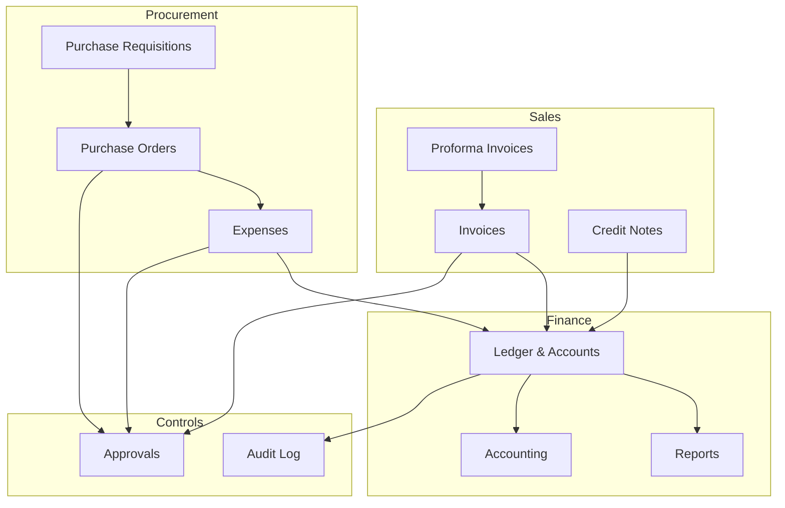

[No sources needed since this diagram shows conceptual workflow, not actual code structure]

## Core Components
- Invoicing module: schema validation, business logic, API hooks, UI components, and PDF generation
- Proforma module: pre-invoice creation and conversion to invoice
- Credit Notes module: issuance, linkage to invoices, and stock adjustments
- Purchase module: requisition to PO flow, vendor mapping, and payment terms
- Expense tracking: capture and categorization of site expenses
- Ledger and Accounts: transaction recording, opening balances, and account hierarchy
- Approvals and Audit: configurable approval hierarchies, RLS-based security, and immutable audit trails
- Tax and Currency: HSN/SAC tax rules and multi-currency calculations
- Reporting and Accounting: financial summaries and export integrations

**Section sources**
- [invoices/index.ts](file://src/invoices/index.ts)
- [invoices/api.ts](file://src/invoices/api.ts)
- [invoices/hooks.ts](file://src/invoices/hooks.ts)
- [invoices/types.ts](file://src/invoices/types.ts)
- [invoices/logic.ts](file://src/invoices/logic.ts)
- [invoices/schemas.ts](file://src/invoices/schemas.ts)
- [proforma-invoices/index.ts](file://src/proforma-invoices/index.ts)
- [proforma-invoices/api.ts](file://src/proforma-invoices/api.ts)
- [proforma-invoices/hooks.ts](file://src/proforma-invoices/hooks.ts)
- [proforma-invoices/types.ts](file://src/proforma-invoices/types.ts)
- [credit-notes/index.ts](file://src/credit-notes/index.ts)
- [credit-notes/api.ts](file://src/credit-notes/api.ts)
- [credit-notes/hooks.ts](file://src/credit-notes/hooks.ts)
- [credit-notes/types.ts](file://src/credit-notes/types.ts)
- [credit-notes/logic.ts](file://src/credit-notes/logic.ts)
- [purchase-requisitions/index.ts](file://src/purchase-requisitions/index.ts)
- [purchase-requisitions/api.ts](file://src/purchase-requisitions/api.ts)
- [modules/Purchase/index.ts](file://src/modules/Purchase/index.ts)
- [modules/Purchase/api.ts](file://src/modules/Purchase/api.ts)
- [pages/CreatePO.tsx](file://src/pages/CreatePO.tsx)
- [pages/POList.tsx](file://src/pages/POList.tsx)
- [pages/PODetails.tsx](file://src/pages/PODetails.tsx)
- [hooks/useExpenseEntries.ts](file://src/hooks/useExpenseEntries.ts)
- [pages/SiteExpenses.tsx](file://src/pages/SiteExpenses.tsx)
- [ledger/LedgerDashboard.tsx](file://src/ledger/LedgerDashboard.tsx)
- [ledger/LedgerModal.tsx](file://src/ledger/LedgerModal.tsx)
- [ledger/api.ts](file://src/ledger/api.ts)
- [ledger/hooks.ts](file://src/ledger/hooks.ts)
- [ledger/schemas.ts](file://src/ledger/schemas.ts)
- [ledger/utils.ts](file://src/ledger/utils.ts)
- [lib/currency.ts](file://src/lib/currency.ts)
- [database/database-hsn-tax.sql](file://src/database-hsn-tax.sql)
- [database/database-proforma-invoices.sql](file://src/database-proforma-invoices.sql)
- [database/database-purchase-module.sql](file://src/database-purchase-module.sql)
- [database/database-subcontractor-ledger-complete.sql](file://src/database/subcontractor_ledger_complete.sql)
- [database/database-document-series.sql](file://src/database-document-series.sql)
- [database/database-item-audit.sql](file://src/database-item-audit.sql)
- [database/database-approval-workflows-rls.sql](file://src/database-approval-workflows-rls.sql)
- [approvals/workflow-engine.ts](file://src/approvals/workflow-engine.ts)
- [approvals/settings-api.ts](file://src/approvals/settings-api.ts)
- [approvals/integration.ts](file://src/approvals/integration.ts)
- [hooks/useApprovals.ts](file://src/hooks/useApprovals.ts)
- [hooks/useAuditLog.ts](file://src/hooks/useAuditLog.ts)
- [pages/accounting/index.tsx](file://src/pages/accounting/index.tsx)
- [pages/reports/index.tsx](file://src/pages/reports/index.tsx)

## Architecture Overview
The system follows a modular architecture with clear separation between UI, hooks, APIs, schemas, and database migrations. Shared utilities handle currency and tax computations. Approval workflows enforce controls before committing financial transactions.

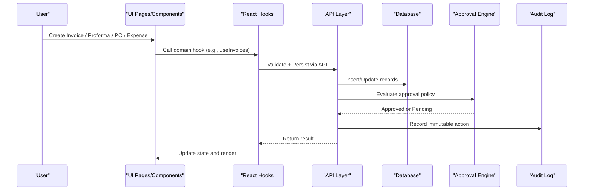

**Diagram sources**
- [invoices/api.ts](file://src/invoices/api.ts)
- [proforma-invoices/api.ts](file://src/proforma-invoices/api.ts)
- [credit-notes/api.ts](file://src/credit-notes/api.ts)
- [purchase-requisitions/api.ts](file://src/purchase-requisitions/api.ts)
- [modules/Purchase/api.ts](file://src/modules/Purchase/api.ts)
- [hooks/useExpenseEntries.ts](file://src/hooks/useExpenseEntries.ts)
- [approvals/workflow-engine.ts](file://src/approvals/workflow-engine.ts)
- [hooks/useAuditLog.ts](file://src/hooks/useAuditLog.ts)

## Detailed Component Analysis

### Invoicing Workflow
End-to-end flow from creation to payment and reconciliation:
- Creation: validate inputs, compute totals, apply taxes, and persist
- Payment processing: record payments, reconcile against invoices, update balances
- Reconciliation: match payments to invoices, handle partial payments, generate statements

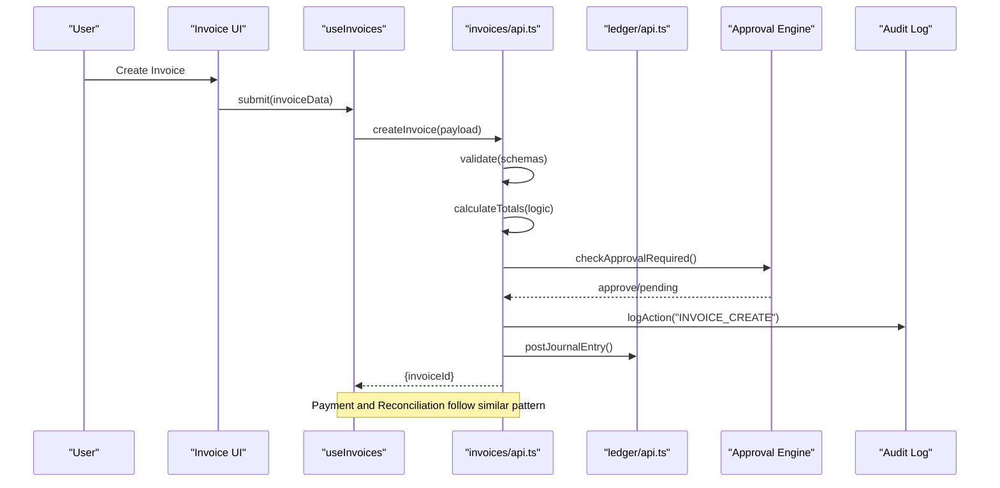

**Diagram sources**
- [invoices/api.ts](file://src/invoices/api.ts)
- [invoices/schemas.ts](file://src/invoices/schemas.ts)
- [invoices/logic.ts](file://src/invoices/logic.ts)
- [ledger/api.ts](file://src/ledger/api.ts)
- [approvals/workflow-engine.ts](file://src/approvals/workflow-engine.ts)
- [hooks/useAuditLog.ts](file://src/hooks/useAuditLog.ts)

**Section sources**
- [invoices/index.ts](file://src/invoices/index.ts)
- [invoices/api.ts](file://src/invoices/api.ts)
- [invoices/hooks.ts](file://src/invoices/hooks.ts)
- [invoices/types.ts](file://src/invoices/types.ts)
- [invoices/logic.ts](file://src/invoices/logic.ts)
- [invoices/schemas.ts](file://src/invoices/schemas.ts)
- [components/CreateProjectInvoiceModal.tsx](file://src/components/CreateProjectInvoiceModal.tsx)

### Proforma Invoices
Supports pre-invoicing and advance payments:
- Create proforma with items, taxes, and terms
- Convert to invoice upon confirmation or receipt of advance
- Track advance payments and link to final invoice

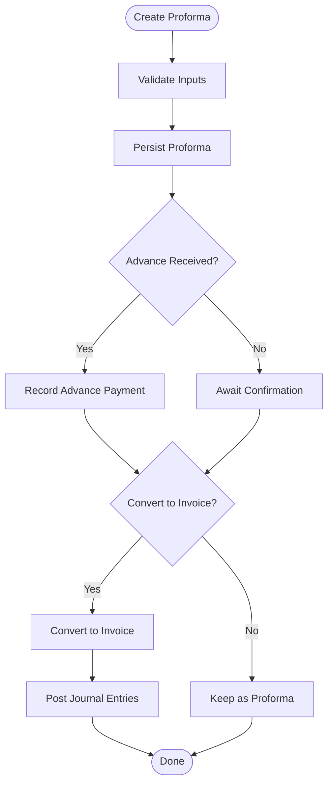

**Diagram sources**
- [proforma-invoices/api.ts](file://src/proforma-invoices/api.ts)
- [proforma-invoices/hooks.ts](file://src/proforma-invoices/hooks.ts)
- [proforma-invoices/types.ts](file://src/proforma-invoices/types.ts)
- [database/database-proforma-invoices.sql](file://src/database-proforma-invoices.sql)

**Section sources**
- [proforma-invoices/index.ts](file://src/proforma-invoices/index.ts)
- [proforma-invoices/api.ts](file://src/proforma-invoices/api.ts)
- [proforma-invoices/hooks.ts](file://src/proforma-invoices/hooks.ts)
- [proforma-invoices/types.ts](file://src/proforma-invoices/types.ts)
- [database/database-proforma-invoices.sql](file://src/database-proforma-invoices.sql)

### Credit Notes
Handles returns, allowances, and adjustments:
- Link to original invoice or standalone
- Compute net amounts and tax impacts
- Optionally adjust inventory levels

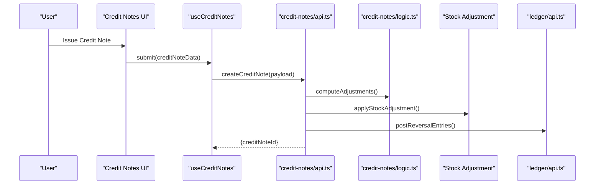

**Diagram sources**
- [credit-notes/api.ts](file://src/credit-notes/api.ts)
- [credit-notes/logic.ts](file://src/credit-notes/logic.ts)
- [credit-notes/hooks.ts](file://src/credit-notes/hooks.ts)
- [credit-notes/types.ts](file://src/credit-notes/types.ts)
- [ledger/api.ts](file://src/ledger/api.ts)

**Section sources**
- [credit-notes/index.ts](file://src/credit-notes/index.ts)
- [credit-notes/api.ts](file://src/credit-notes/api.ts)
- [credit-notes/hooks.ts](file://src/credit-notes/hooks.ts)
- [credit-notes/types.ts](file://src/credit-notes/types.ts)
- [credit-notes/logic.ts](file://src/credit-notes/logic.ts)

### Purchase Order Management
From requisition to approved PO:
- Create purchase requisition
- Generate PO with vendor details, line items, and payment terms
- Enforce approval workflows based on thresholds
- Track utilization and receipts

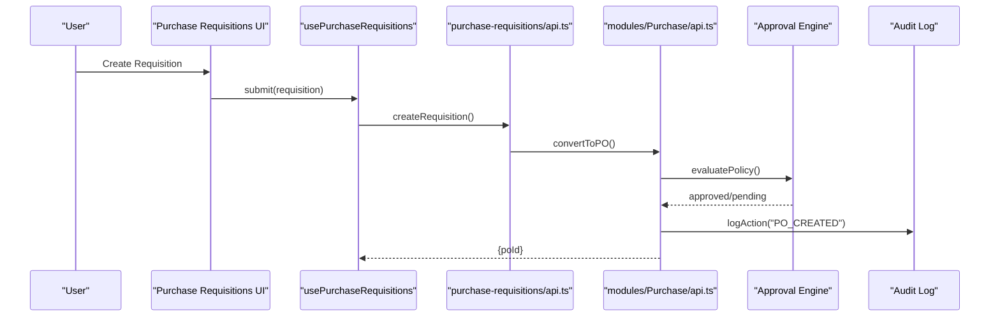

**Diagram sources**
- [purchase-requisitions/api.ts](file://src/purchase-requisitions/api.ts)
- [modules/Purchase/api.ts](file://src/modules/Purchase/api.ts)
- [approvals/workflow-engine.ts](file://src/approvals/workflow-engine.ts)
- [hooks/useAuditLog.ts](file://src/hooks/useAuditLog.ts)

**Section sources**
- [purchase-requisitions/index.ts](file://src/purchase-requisitions/index.ts)
- [purchase-requisitions/api.ts](file://src/purchase-requisitions/api.ts)
- [modules/Purchase/index.ts](file://src/modules/Purchase/index.ts)
- [modules/Purchase/api.ts](file://src/modules/Purchase/api.ts)
- [pages/CreatePO.tsx](file://src/pages/CreatePO.tsx)
- [pages/POList.tsx](file://src/pages/POList.tsx)
- [pages/PODetails.tsx](file://src/pages/PODetails.tsx)
- [database/database-purchase-module.sql](file://src/database-purchase-module.sql)

### Expense Tracking
Capture site-level expenses with categories and attachments:
- Create expense entries linked to projects or cost centers
- Aggregate by date, category, and vendor
- Export for accounting and reimbursement

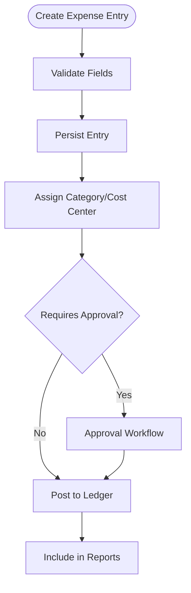

**Diagram sources**
- [hooks/useExpenseEntries.ts](file://src/hooks/useExpenseEntries.ts)
- [pages/SiteExpenses.tsx](file://src/pages/SiteExpenses.tsx)
- [approvals/workflow-engine.ts](file://src/approvals/workflow-engine.ts)

**Section sources**
- [hooks/useExpenseEntries.ts](file://src/hooks/useExpenseEntries.ts)
- [pages/SiteExpenses.tsx](file://src/pages/SiteExpenses.tsx)

### Ledger System and Account Management
Maintain double-entry records and account hierarchy:
- General ledger dashboard and modal entry
- Opening balance setup
- Account types, mappings, and journal postings

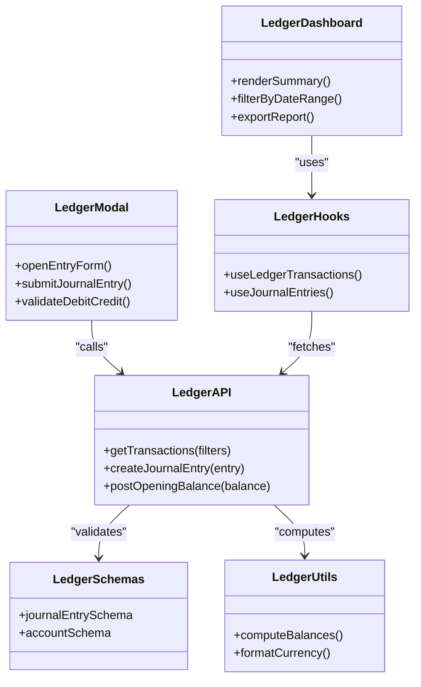

**Diagram sources**
- [ledger/LedgerDashboard.tsx](file://src/ledger/LedgerDashboard.tsx)
- [ledger/LedgerModal.tsx](file://src/ledger/LedgerModal.tsx)
- [ledger/api.ts](file://src/ledger/api.ts)
- [ledger/hooks.ts](file://src/ledger/hooks.ts)
- [ledger/schemas.ts](file://src/ledger/schemas.ts)
- [ledger/utils.ts](file://src/ledger/utils.ts)

**Section sources**
- [ledger/LedgerDashboard.tsx](file://src/ledger/LedgerDashboard.tsx)
- [ledger/LedgerModal.tsx](file://src/ledger/LedgerModal.tsx)
- [ledger/api.ts](file://src/ledger/api.ts)
- [ledger/hooks.ts](file://src/ledger/hooks.ts)
- [ledger/schemas.ts](file://src/ledger/schemas.ts)
- [ledger/utils.ts](file://src/ledger/utils.ts)
- [database/database-subcontractor-ledger-complete.sql](file://src/database/subcontractor_ledger_complete.sql)

### Tax Calculations and Multi-Currency Support
- HSN/SAC tax configuration and rates
- Currency formatting and exchange rate handling
- Multi-currency invoicing and ledger postings

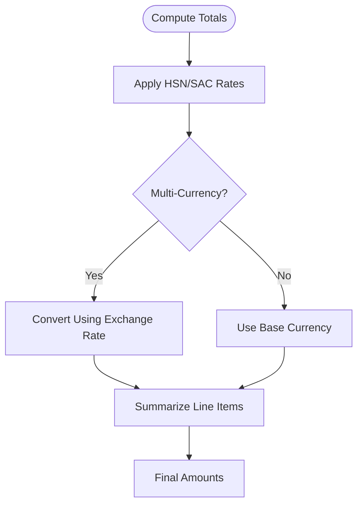

**Diagram sources**
- [lib/currency.ts](file://src/lib/currency.ts)
- [database/database-hsn-tax.sql](file://src/database-hsn-tax.sql)

**Section sources**
- [lib/currency.ts](file://src/lib/currency.ts)
- [database/database-hsn-tax.sql](file://src/database-hsn-tax.sql)

### Approvals, Controls, and Audit Trails
Configurable approval hierarchies and immutable audit logs:
- Policy evaluation based on amount, entity, and role
- RLS policies to restrict access
- Audit trail for all financial actions

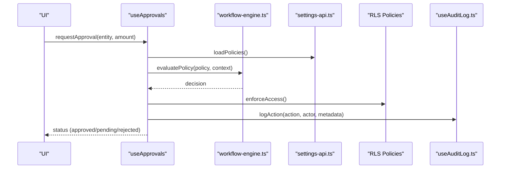

**Diagram sources**
- [hooks/useApprovals.ts](file://src/hooks/useApprovals.ts)
- [approvals/workflow-engine.ts](file://src/approvals/workflow-engine.ts)
- [approvals/settings-api.ts](file://src/approvals/settings-api.ts)
- [database/database-approval-workflows-rls.sql](file://src/database-approval-workflows-rls.sql)
- [hooks/useAuditLog.ts](file://src/hooks/useAuditLog.ts)

**Section sources**
- [hooks/useApprovals.ts](file://src/hooks/useApprovals.ts)
- [approvals/workflow-engine.ts](file://src/approvals/workflow-engine.ts)
- [approvals/settings-api.ts](file://src/approvals/settings-api.ts)
- [approvals/integration.ts](file://src/approvals/integration.ts)
- [database/database-approval-workflows-rls.sql](file://src/database-approval-workflows-rls.sql)
- [hooks/useAuditLog.ts](file://src/hooks/useAuditLog.ts)

### Financial Reporting and Accounting Integration
Consolidated reports and accounting exports:
- Financial dashboards and summary views
- Export formats compatible with accounting systems
- Mapping to chart of accounts and series numbering

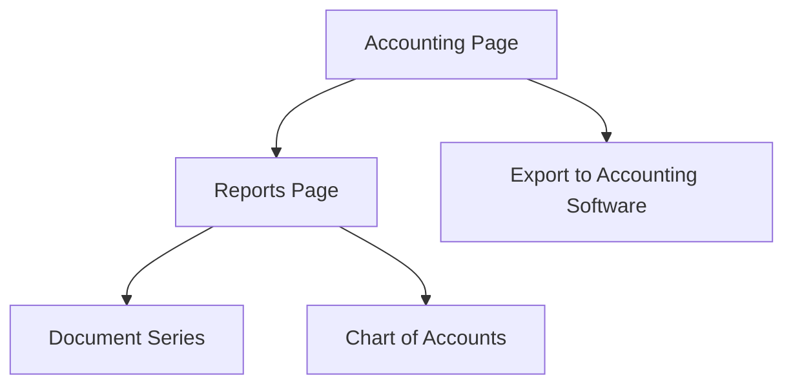

**Diagram sources**
- [pages/accounting/index.tsx](file://src/pages/accounting/index.tsx)
- [pages/reports/index.tsx](file://src/pages/reports/index.tsx)
- [database/database-document-series.sql](file://src/database-document-series.sql)

**Section sources**
- [pages/accounting/index.tsx](file://src/pages/accounting/index.tsx)
- [pages/reports/index.tsx](file://src/pages/reports/index.tsx)
- [database/database-document-series.sql](file://src/database-document-series.sql)

## Dependency Analysis
Key dependencies and relationships:
- UI components depend on hooks for state and side effects
- Hooks call API layers for persistence and orchestration
- API layers validate using schemas and compute using logic modules
- Database migrations define tables, indexes, and constraints
- Approval engine integrates with RLS and audit logging

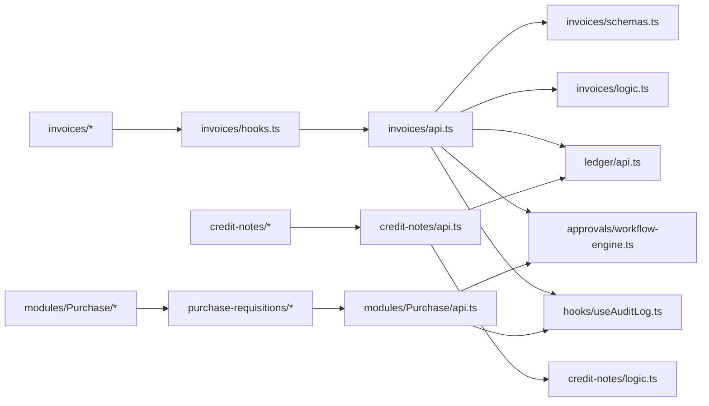

**Diagram sources**
- [invoices/hooks.ts](file://src/invoices/hooks.ts)
- [invoices/api.ts](file://src/invoices/api.ts)
- [invoices/schemas.ts](file://src/invoices/schemas.ts)
- [invoices/logic.ts](file://src/invoices/logic.ts)
- [ledger/api.ts](file://src/ledger/api.ts)
- [approvals/workflow-engine.ts](file://src/approvals/workflow-engine.ts)
- [hooks/useAuditLog.ts](file://src/hooks/useAuditLog.ts)
- [purchase-requisitions/api.ts](file://src/purchase-requisitions/api.ts)
- [modules/Purchase/api.ts](file://src/modules/Purchase/api.ts)
- [credit-notes/api.ts](file://src/credit-notes/api.ts)
- [credit-notes/logic.ts](file://src/credit-notes/logic.ts)

**Section sources**
- [invoices/hooks.ts](file://src/invoices/hooks.ts)
- [invoices/api.ts](file://src/invoices/api.ts)
- [invoices/schemas.ts](file://src/invoices/schemas.ts)
- [invoices/logic.ts](file://src/invoices/logic.ts)
- [ledger/api.ts](file://src/ledger/api.ts)
- [approvals/workflow-engine.ts](file://src/approvals/workflow-engine.ts)
- [hooks/useAuditLog.ts](file://src/hooks/useAuditLog.ts)
- [purchase-requisitions/api.ts](file://src/purchase-requisitions/api.ts)
- [modules/Purchase/api.ts](file://src/modules/Purchase/api.ts)
- [credit-notes/api.ts](file://src/credit-notes/api.ts)
- [credit-notes/logic.ts](file://src/credit-notes/logic.ts)

## Performance Considerations
- Use pagination and filtering in list views for large datasets
- Cache frequently accessed reference data (tax rates, currencies)
- Batch journal postings where possible to reduce database round-trips
- Optimize queries with appropriate indexes defined in migrations
- Avoid heavy computations in UI; delegate to backend or worker functions

[No sources needed since this section provides general guidance]

## Troubleshooting Guide
Common issues and resolutions:
- Validation failures: ensure schema definitions match input payloads
- Approval bottlenecks: review policy configurations and user roles
- Currency mismatches: verify exchange rates and base currency settings
- Ledger imbalance: confirm debit equals credit for each journal entry
- Audit gaps: check that all critical actions are logged with required metadata

**Section sources**
- [invoices/schemas.ts](file://src/invoices/schemas.ts)
- [approvals/settings-api.ts](file://src/approvals/settings-api.ts)
- [lib/currency.ts](file://src/lib/currency.ts)
- [ledger/schemas.ts](file://src/ledger/schemas.ts)
- [hooks/useAuditLog.ts](file://src/hooks/useAuditLog.ts)

## Conclusion
The Financial Operations system provides a comprehensive suite for invoicing, purchasing, expenses, credit notes, ledger management, approvals, and reporting. Its modular design supports customization, compliance, and integration with external accounting software. By leveraging schemas, logic modules, and approval workflows, organizations can implement robust financial controls and maintain accurate audit trails.

[No sources needed since this section summarizes without analyzing specific files]

## Appendices

### Customizing Financial Workflows
- Extend approval policies by adding new rules in settings and integrating with the workflow engine
- Customize invoice and PO templates by updating UI components and PDF generators
- Add new account types and mappings in ledger schemas and migration scripts

**Section sources**
- [approvals/settings-api.ts](file://src/approvals/settings-api.ts)
- [approvals/workflow-engine.ts](file://src/approvals/workflow-engine.ts)
- [invoices/pdf.tsx](file://src/invoices/pdf.tsx)
- [ledger/schemas.ts](file://src/ledger/schemas.ts)

### Integrating with Accounting Software
- Map document series and chart of accounts to external systems
- Export standardized formats (CSV/JSON) for import into accounting platforms
- Ensure consistent tax codes and currency conversions during export

**Section sources**
- [pages/accounting/index.tsx](file://src/pages/accounting/index.tsx)
- [pages/reports/index.tsx](file://src/pages/reports/index.tsx)
- [database/database-document-series.sql](file://src/database-document-series.sql)

### Compliance Features
- Immutable audit logs for all financial actions
- Role-based access control via RLS policies
- Document series enforcement for regulatory compliance

**Section sources**
- [hooks/useAuditLog.ts](file://src/hooks/useAuditLog.ts)
- [database/database-approval-workflows-rls.sql](file://src/database-approval-workflows-rls.sql)
- [database/database-document-series.sql](file://src/database-document-series.sql)
- [database/database-item-audit.sql](file://src/database-item-audit.sql)