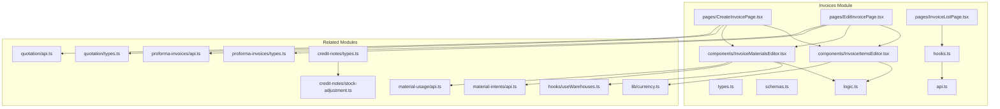
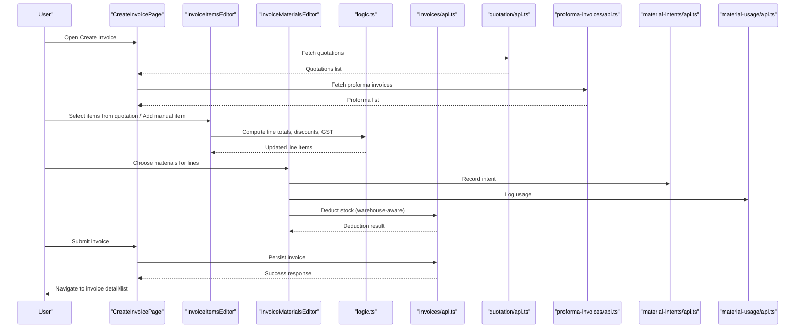
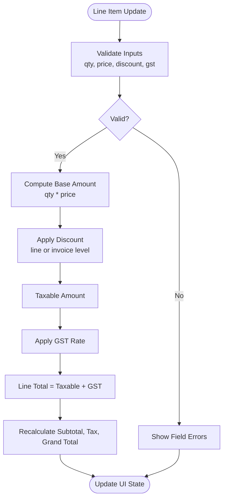
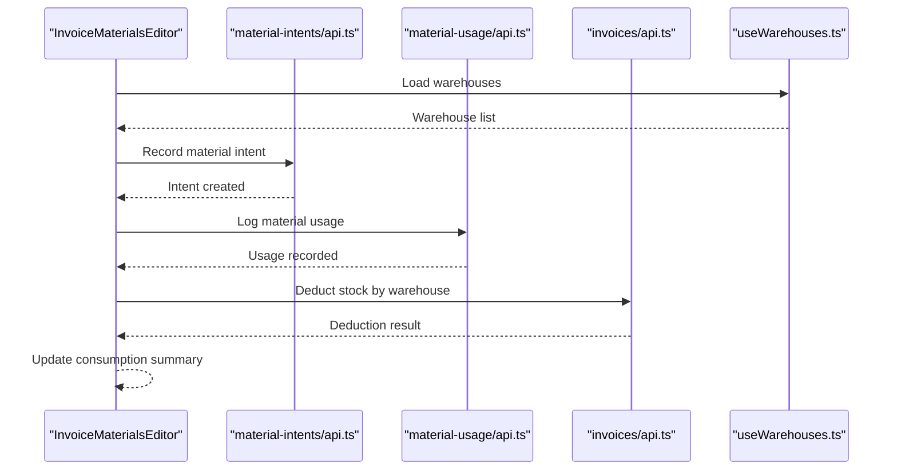
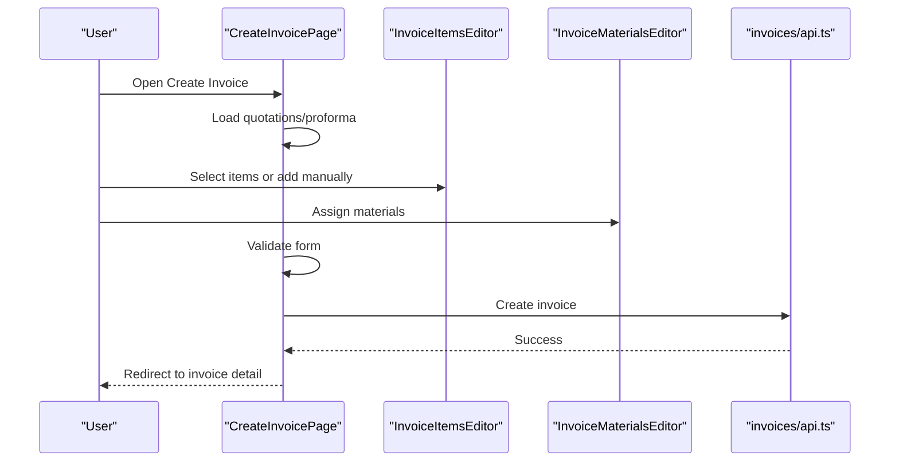
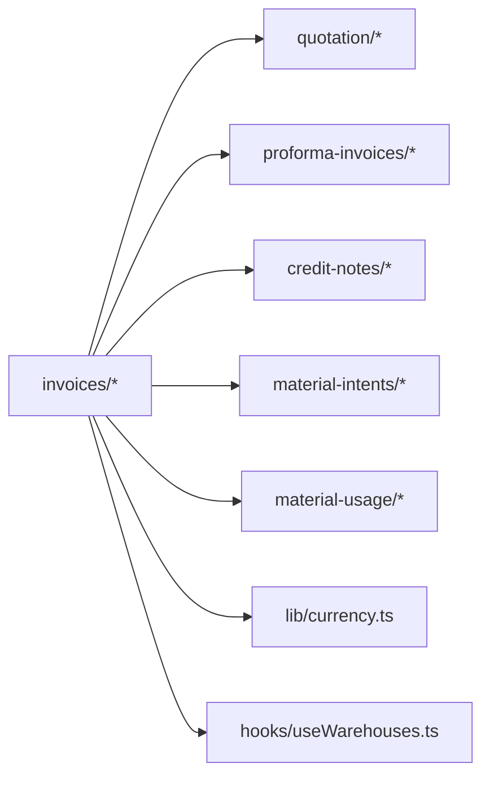

# Invoice Creation & Management

<cite>
**Referenced Files in This Document**
- [invoices/index.ts](file://src/invoices/index.ts)
- [invoices/types.ts](file://src/invoices/types.ts)
- [invoices/schemas.ts](file://src/invoices/schemas.ts)
- [invoices/logic.ts](file://src/invoices/logic.ts)
- [invoices/api.ts](file://src/invoices/api.ts)
- [invoices/hooks.ts](file://src/invoices/hooks.ts)
- [invoices/components/InvoiceItemsEditor.tsx](file://src/invoices/components/InvoiceItemsEditor.tsx)
- [invoices/components/InvoiceMaterialsEditor.tsx](file://src/invoices/components/InvoiceMaterialsEditor.tsx)
- [invoices/pages/CreateInvoicePage.tsx](file://src/invoices/pages/CreateInvoicePage.tsx)
- [invoices/pages/EditInvoicePage.tsx](file://src/invoices/pages/EditInvoicePage.tsx)
- [invoices/pages/InvoiceListPage.tsx](file://src/invoices/pages/InvoiceListPage.tsx)
- [proforma-invoices/types.ts](file://src/proforma-invoices/types.ts)
- [proforma-invoices/api.ts](file://src/proforma-invoices/api.ts)
- [quotation/types.ts](file://src/quotation/types.ts)
- [quotation/api.ts](file://src/quotation/api.ts)
- [credit-notes/types.ts](file://src/credit-notes/types.ts)
- [credit-notes/stock-adjustment.ts](file://src/credit-notes/stock-adjustment.ts)
- [material-intents/api.ts](file://src/material-intents/api.ts)
- [material-usage/api.ts](file://src/material-usage/api.ts)
- [lib/currency.ts](file://src/lib/currency.ts)
- [hooks/useWarehouses.ts](file://src/hooks/useWarehouses.ts)
</cite>

## Table of Contents
1. [Introduction](#introduction)
2. [Project Structure](#project-structure)
3. [Core Components](#core-components)
4. [Architecture Overview](#architecture-overview)
5. [Detailed Component Analysis](#detailed-component-analysis)
6. [Dependency Analysis](#dependency-analysis)
7. [Performance Considerations](#performance-considerations)
8. [Troubleshooting Guide](#troubleshooting-guide)
9. [Conclusion](#conclusion)
10. [Appendices](#appendices)

## Introduction
This document explains the end-to-end workflow for creating and managing invoices, including:
- Creating invoices from existing quotations
- Converting proforma invoices to invoices
- Adding items manually or selecting from quotations
- Material-based invoicing with automatic consumption tracking and stock deduction
- Pricing calculations, discount applications, and GST handling
- Validation rules, data schemas, and form state management patterns

The goal is to provide both a high-level understanding and detailed technical guidance for developers working on invoice creation and management features.

## Project Structure
The invoice feature is organized under src/invoices with clear separation of concerns:
- Types and schemas define domain models and validation rules
- Logic module encapsulates pricing, tax, and discount computations
- API layer handles persistence and integration points
- Hooks manage data fetching and mutation orchestration
- Components implement UI editors for line items and materials
- Pages compose workflows for create, edit, and list operations

**Diagram sources**
- [invoices/index.ts](file://src/invoices/index.ts)
- [invoices/types.ts](file://src/invoices/types.ts)
- [invoices/schemas.ts](file://src/invoices/schemas.ts)
- [invoices/logic.ts](file://src/invoices/logic.ts)
- [invoices/api.ts](file://src/invoices/api.ts)
- [invoices/hooks.ts](file://src/invoices/hooks.ts)
- [invoices/components/InvoiceItemsEditor.tsx](file://src/invoices/components/InvoiceItemsEditor.tsx)
- [invoices/components/InvoiceMaterialsEditor.tsx](file://src/invoices/components/InvoiceMaterialsEditor.tsx)
- [invoices/pages/CreateInvoicePage.tsx](file://src/invoices/pages/CreateInvoicePage.tsx)
- [invoices/pages/EditInvoicePage.tsx](file://src/invoices/pages/EditInvoicePage.tsx)
- [invoices/pages/InvoiceListPage.tsx](file://src/invoices/pages/InvoiceListPage.tsx)
- [quotation/types.ts](file://src/quotation/types.ts)
- [quotation/api.ts](file://src/quotation/api.ts)
- [proforma-invoices/types.ts](file://src/proforma-invoices/types.ts)
- [proforma-invoices/api.ts](file://src/proforma-invoices/api.ts)
- [credit-notes/types.ts](file://src/credit-notes/types.ts)
- [credit-notes/stock-adjustment.ts](file://src/credit-notes/stock-adjustment.ts)
- [material-intents/api.ts](file://src/material-intents/api.ts)
- [material-usage/api.ts](file://src/material-usage/api.ts)
- [lib/currency.ts](file://src/lib/currency.ts)
- [hooks/useWarehouses.ts](file://src/hooks/useWarehouses.ts)

**Section sources**
- [invoices/index.ts](file://src/invoices/index.ts)
- [invoices/types.ts](file://src/invoices/types.ts)
- [invoices/schemas.ts](file://src/invoices/schemas.ts)
- [invoices/logic.ts](file://src/invoices/logic.ts)
- [invoices/api.ts](file://src/invoices/api.ts)
- [invoices/hooks.ts](file://src/invoices/hooks.ts)
- [invoices/components/InvoiceItemsEditor.tsx](file://src/invoices/components/InvoiceItemsEditor.tsx)
- [invoices/components/InvoiceMaterialsEditor.tsx](file://src/invoices/components/InvoiceMaterialsEditor.tsx)
- [invoices/pages/CreateInvoicePage.tsx](file://src/invoices/pages/CreateInvoicePage.tsx)
- [invoices/pages/EditInvoicePage.tsx](file://src/invoices/pages/EditInvoicePage.tsx)
- [invoices/pages/InvoiceListPage.tsx](file://src/invoices/pages/InvoiceListPage.tsx)

## Core Components
- InvoiceItemsEditor: Manages line items, supports selection from quotations, manual addition, quantity edits, unit price changes, discounts, and GST computation. It orchestrates recalculations and maintains item-level state.
- InvoiceMaterialsEditor: Tracks material consumption per invoice line, integrates with material intents and usage APIs, and coordinates stock deductions based on warehouse and item mappings.
- CreateInvoicePage: Orchestrates the full invoice creation flow, including sourcing from quotations or proforma invoices, validating inputs, and persisting via API hooks.
- EditInvoicePage: Enables editing existing invoices while preserving auditability and ensuring constraints (e.g., partial delivery limits).
- InvoiceListPage: Displays invoices with filters and actions, leveraging shared hooks for data retrieval and mutations.

Key responsibilities:
- Data schema validation and normalization
- Pricing and tax calculation logic
- Integration with quotation and proforma modules
- Material consumption and stock deduction coordination
- Form state synchronization and error handling

**Section sources**
- [invoices/components/InvoiceItemsEditor.tsx](file://src/invoices/components/InvoiceItemsEditor.tsx)
- [invoices/components/InvoiceMaterialsEditor.tsx](file://src/invoices/components/InvoiceMaterialsEditor.tsx)
- [invoices/pages/CreateInvoicePage.tsx](file://src/invoices/pages/CreateInvoicePage.tsx)
- [invoices/pages/EditInvoicePage.tsx](file://src/invoices/pages/EditInvoicePage.tsx)
- [invoices/pages/InvoiceListPage.tsx](file://src/invoices/pages/InvoiceListPage.tsx)

## Architecture Overview
The invoice system follows a layered architecture:
- Presentation Layer: Pages and components handle user interactions and display
- Business Logic Layer: Centralized logic for pricing, taxes, discounts, and validations
- Data Access Layer: API functions for CRUD operations and integrations
- State Management: Hooks coordinate data fetching, caching, and mutations

**Diagram sources**
- [invoices/pages/CreateInvoicePage.tsx](file://src/invoices/pages/CreateInvoicePage.tsx)
- [invoices/components/InvoiceItemsEditor.tsx](file://src/invoices/components/InvoiceItemsEditor.tsx)
- [invoices/components/InvoiceMaterialsEditor.tsx](file://src/invoices/components/InvoiceMaterialsEditor.tsx)
- [invoices/logic.ts](file://src/invoices/logic.ts)
- [invoices/api.ts](file://src/invoices/api.ts)
- [quotation/api.ts](file://src/quotation/api.ts)
- [proforma-invoices/api.ts](file://src/proforma-invoices/api.ts)
- [material-intents/api.ts](file://src/material-intents/api.ts)
- [material-usage/api.ts](file://src/material-usage/api.ts)

## Detailed Component Analysis

### InvoiceItemsEditor
Responsibilities:
- Line item CRUD: add, remove, duplicate, reorder
- Item source: select from quotations or add manually
- Quantity and unit price editing with real-time recalculation
- Discount application at line level and invoice level
- GST computation per line and aggregate totals
- Validation feedback for invalid entries

Pricing and Tax Flow:
- Base amount = quantity × unit price
- Apply line discount (percentage or fixed)
- Compute taxable amount after discount
- Apply GST rate to compute tax amount
- Final line total = taxable amount + tax amount
- Aggregate invoice subtotal, total tax, and grand total

Validation Rules:
- Non-negative quantities and prices
- Valid GST rates within configured ranges
- Discounts do not exceed line amounts
- Required fields populated before submission

Form State Management:
- Local state for line items and computed totals
- Controlled updates via callbacks to parent page
- Debounced recalculation for performance
- Error state propagated to UI

**Diagram sources**
- [invoices/components/InvoiceItemsEditor.tsx](file://src/invoices/components/InvoiceItemsEditor.tsx)
- [invoices/logic.ts](file://src/invoices/logic.ts)
- [lib/currency.ts](file://src/lib/currency.ts)

**Section sources**
- [invoices/components/InvoiceItemsEditor.tsx](file://src/invoices/components/InvoiceItemsEditor.tsx)
- [invoices/logic.ts](file://src/invoices/logic.ts)
- [lib/currency.ts](file://src/lib/currency.ts)

### InvoiceMaterialsEditor
Responsibilities:
- Associate materials with invoice lines
- Track consumption quantities and units
- Integrate with material intents and usage logs
- Coordinate stock deductions by warehouse
- Handle partial deliveries and backorders

Integration Points:
- Material Intents API: records planned consumption
- Material Usage API: logs actual consumption
- Stock Deduction: reduces available inventory per warehouse
- Warehouse Selection: ensures correct stock location

Partial Delivery Handling:
- Allow partial quantities against quotation lines
- Maintain remaining balance for future deliveries
- Prevent over-delivery beyond ordered quantities

**Diagram sources**
- [invoices/components/InvoiceMaterialsEditor.tsx](file://src/invoices/components/InvoiceMaterialsEditor.tsx)
- [material-intents/api.ts](file://src/material-intents/api.ts)
- [material-usage/api.ts](file://src/material-usage/api.ts)
- [invoices/api.ts](file://src/invoices/api.ts)
- [hooks/useWarehouses.ts](file://src/hooks/useWarehouses.ts)

**Section sources**
- [invoices/components/InvoiceMaterialsEditor.tsx](file://src/invoices/components/InvoiceMaterialsEditor.tsx)
- [material-intents/api.ts](file://src/material-intents/api.ts)
- [material-usage/api.ts](file://src/material-usage/api.ts)
- [invoices/api.ts](file://src/invoices/api.ts)
- [hooks/useWarehouses.ts](file://src/hooks/useWarehouses.ts)

### CreateInvoicePage
Responsibilities:
- Orchestrate invoice creation workflow
- Source items from quotations or proforma invoices
- Compose forms with items and materials editors
- Validate and persist invoice data
- Handle success and error states

Workflow Steps:
- Load quotations and proforma invoices
- Allow user to pick source document
- Populate initial items and materials
- Enable manual additions and edits
- Validate totals and tax breakdown
- Submit to API and navigate to detail/list

**Diagram sources**
- [invoices/pages/CreateInvoicePage.tsx](file://src/invoices/pages/CreateInvoicePage.tsx)
- [invoices/components/InvoiceItemsEditor.tsx](file://src/invoices/components/InvoiceItemsEditor.tsx)
- [invoices/components/InvoiceMaterialsEditor.tsx](file://src/invoices/components/InvoiceMaterialsEditor.tsx)
- [invoices/api.ts](file://src/invoices/api.ts)

**Section sources**
- [invoices/pages/CreateInvoicePage.tsx](file://src/invoices/pages/CreateInvoicePage.tsx)

### EditInvoicePage
Responsibilities:
- Load existing invoice data
- Allow modifications within constraints
- Preserve audit trail and versioning
- Re-validate totals and tax after edits
- Persist updated invoice

Constraints:
- Prevent edits if invoice is locked or finalized
- Enforce partial delivery limits
- Ensure consistency with linked documents

**Section sources**
- [invoices/pages/EditInvoicePage.tsx](file://src/invoices/pages/EditInvoicePage.tsx)

### InvoiceListPage
Responsibilities:
- Display invoices with filtering and sorting
- Provide actions like view, edit, delete
- Use shared hooks for data retrieval and mutations

**Section sources**
- [invoices/pages/InvoiceListPage.tsx](file://src/invoices/pages/InvoiceListPage.tsx)

## Dependency Analysis
The invoice module depends on related modules for cross-document workflows and integrations:
- Quotation module: provides item catalogs and order quantities
- Proforma module: enables conversion to invoices
- Credit notes: interacts with stock adjustments for returns
- Material intents and usage: track planned and actual consumption
- Currency utilities: format and normalize monetary values
- Warehouse hooks: supply warehouse context for stock deductions

**Diagram sources**
- [invoices/types.ts](file://src/invoices/types.ts)
- [invoices/schemas.ts](file://src/invoices/schemas.ts)
- [invoices/logic.ts](file://src/invoices/logic.ts)
- [invoices/api.ts](file://src/invoices/api.ts)
- [quotation/types.ts](file://src/quotation/types.ts)
- [quotation/api.ts](file://src/quotation/api.ts)
- [proforma-invoices/types.ts](file://src/proforma-invoices/types.ts)
- [proforma-invoices/api.ts](file://src/proforma-invoices/api.ts)
- [credit-notes/types.ts](file://src/credit-notes/types.ts)
- [credit-notes/stock-adjustment.ts](file://src/credit-notes/stock-adjustment.ts)
- [material-intents/api.ts](file://src/material-intents/api.ts)
- [material-usage/api.ts](file://src/material-usage/api.ts)
- [lib/currency.ts](file://src/lib/currency.ts)
- [hooks/useWarehouses.ts](file://src/hooks/useWarehouses.ts)

**Section sources**
- [invoices/types.ts](file://src/invoices/types.ts)
- [invoices/schemas.ts](file://src/invoices/schemas.ts)
- [invoices/logic.ts](file://src/invoices/logic.ts)
- [invoices/api.ts](file://src/invoices/api.ts)
- [quotation/types.ts](file://src/quotation/types.ts)
- [quotation/api.ts](file://src/quotation/api.ts)
- [proforma-invoices/types.ts](file://src/proforma-invoices/types.ts)
- [proforma-invoices/api.ts](file://src/proforma-invoices/api.ts)
- [credit-notes/types.ts](file://src/credit-notes/types.ts)
- [credit-notes/stock-adjustment.ts](file://src/credit-notes/stock-adjustment.ts)
- [material-intents/api.ts](file://src/material-intents/api.ts)
- [material-usage/api.ts](file://src/material-usage/api.ts)
- [lib/currency.ts](file://src/lib/currency.ts)
- [hooks/useWarehouses.ts](file://src/hooks/useWarehouses.ts)

## Performance Considerations
- Debounce recalculation in InvoiceItemsEditor to avoid excessive re-renders during bulk edits
- Batch material intent and usage updates where possible
- Use virtualized lists for large item sets in editors
- Cache quotation and proforma data to reduce network calls
- Optimize stock deduction calls by consolidating per warehouse

[No sources needed since this section provides general guidance]

## Troubleshooting Guide
Common issues and resolutions:
- Invalid GST rates: ensure rates are within configured bounds; check schema validation
- Over-discounted lines: validate that discounts do not exceed line amounts
- Stock deduction failures: verify warehouse availability and sufficient stock levels
- Partial delivery errors: confirm remaining balances and prevent over-delivery
- Form state inconsistencies: reset local state on source document changes

**Section sources**
- [invoices/schemas.ts](file://src/invoices/schemas.ts)
- [invoices/logic.ts](file://src/invoices/logic.ts)
- [invoices/api.ts](file://src/invoices/api.ts)

## Conclusion
The invoice creation and management system provides a robust, modular framework for handling complex billing workflows. By separating concerns into types, schemas, logic, API, hooks, components, and pages, the system ensures maintainability and scalability. The integration with quotations, proforma invoices, and material consumption tracking enables seamless end-to-end processes, while validation and state management patterns guarantee data integrity and user experience quality.

[No sources needed since this section summarizes without analyzing specific files]

## Appendices

### Data Schemas and Validation Rules
- Invoice header fields include client, date, reference numbers, terms, and status
- Line items contain item references, quantities, unit prices, discounts, GST rates, and totals
- Materials association includes item IDs, quantities, units, and warehouse mapping
- Validation enforces non-negative values, required fields, and business constraints

**Section sources**
- [invoices/types.ts](file://src/invoices/types.ts)
- [invoices/schemas.ts](file://src/invoices/schemas.ts)

### Examples and Workflows
- Creating an invoice from a quotation: load quotation items, adjust quantities and prices, apply discounts and GST, then submit
- Converting a proforma invoice: copy proforma details, validate totals, and persist as invoice
- Handling partial deliveries: allow reduced quantities per line, track remaining balances, and prevent over-delivery

**Section sources**
- [invoices/pages/CreateInvoicePage.tsx](file://src/invoices/pages/CreateInvoicePage.tsx)
- [quotation/api.ts](file://src/quotation/api.ts)
- [proforma-invoices/api.ts](file://src/proforma-invoices/api.ts)