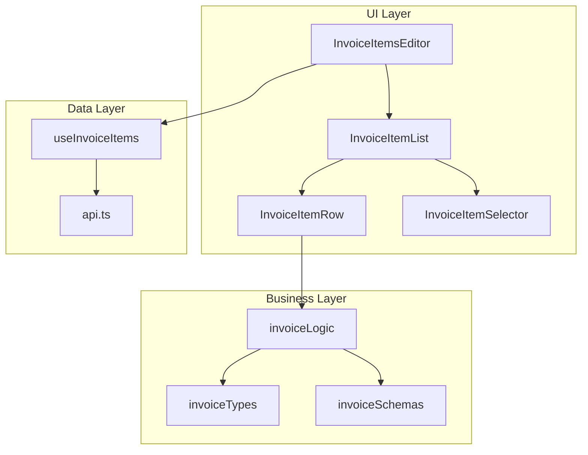
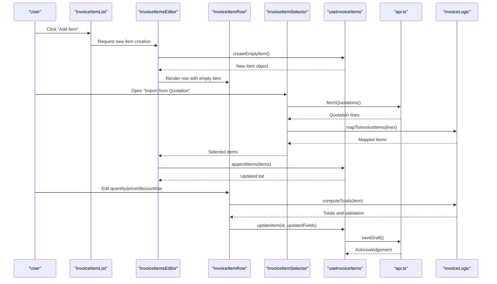
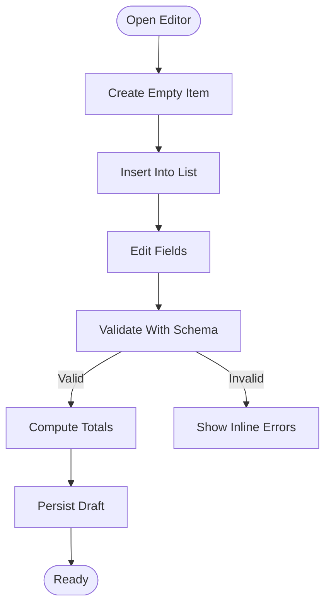
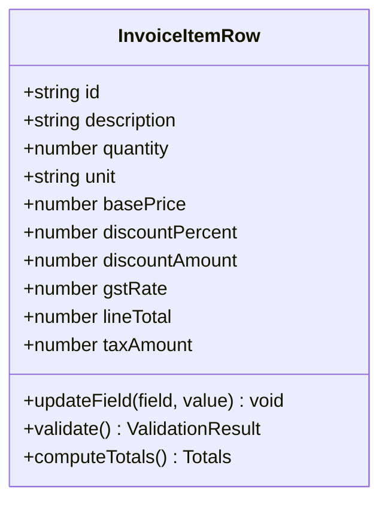
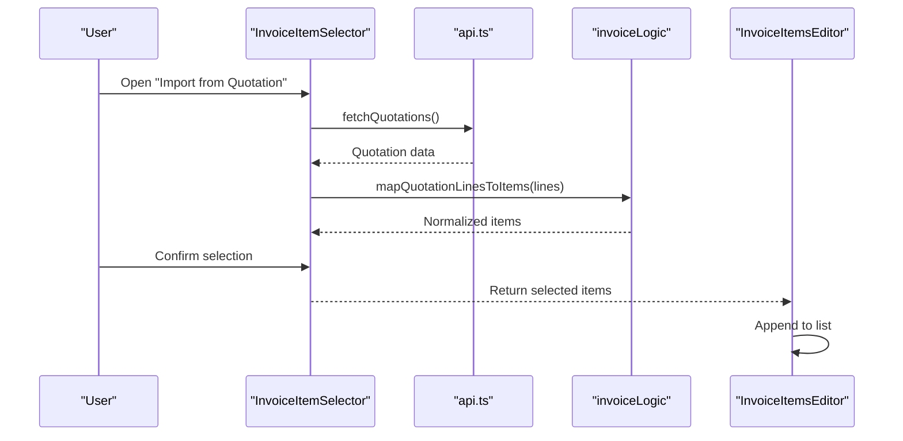
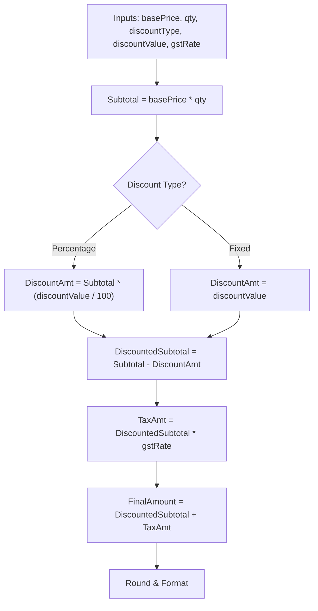
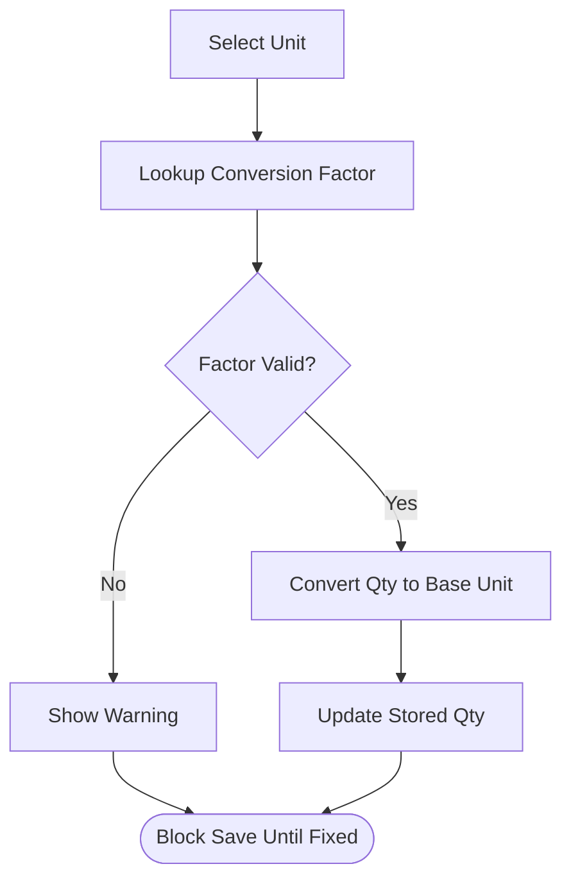
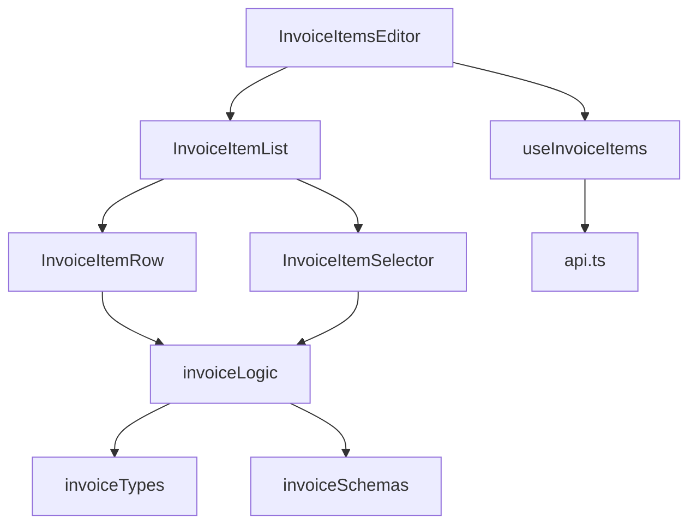

# Invoice Items Management

<cite>
**Referenced Files in This Document**
- [InvoiceItemsEditor.tsx](file://src/invoices/components/InvoiceItemsEditor.tsx)
- [InvoiceItemRow.tsx](file://src/invoices/components/InvoiceItemRow.tsx)
- [InvoiceItemList.tsx](file://src/invoices/components/InvoiceItemList.tsx)
- [InvoiceItemSelector.tsx](file://src/invoices/components/InvoiceItemSelector.tsx)
- [useInvoiceItems.ts](file://src/invoices/hooks/useInvoiceItems.ts)
- [invoiceLogic.ts](file://src/invoices/logic.ts)
- [invoiceTypes.ts](file://src/invoices/types.ts)
- [invoiceSchemas.ts](file://src/invoices/schemas.ts)
- [api.ts](file://src/invoices/api.ts)
- [ui-utils.ts](file://src/invoices/ui-utils.ts)
</cite>

## Table of Contents
1. [Introduction](#introduction)
2. [Project Structure](#project-structure)
3. [Core Components](#core-components)
4. [Architecture Overview](#architecture-overview)
5. [Detailed Component Analysis](#detailed-component-analysis)
6. [Dependency Analysis](#dependency-analysis)
7. [Performance Considerations](#performance-considerations)
8. [Troubleshooting Guide](#troubleshooting-guide)
9. [Conclusion](#conclusion)

## Introduction
This document explains the Invoice Items Management system with a focus on how line items are created, modified, and deleted within invoices. It covers item selection from quotations, manual item addition with custom pricing, quantity management, unit conversions, and the pricing calculation engine (base prices, discounts, taxes including GST, and final amounts). It also includes examples for adding items from different sources, handling item variants, managing descriptions, validation rules, error handling, and data persistence patterns.

## Project Structure
The invoice items feature is implemented under the invoices module with a clear separation between UI components, business logic, types, schemas, hooks, and API integration:

- Components:
  - InvoiceItemsEditor: orchestrates item list editing, add/remove operations, and delegates to row-level editing.
  - InvoiceItemList: renders the table/grid of invoice items and provides actions like add, import from quotation, and bulk operations.
  - InvoiceItemRow: represents a single editable line item with fields for description, quantity, unit, price, discount, tax, and totals.
  - InvoiceItemSelector: modal/drawer for selecting existing items or importing from quotations.
- Logic and Types:
  - invoiceLogic: pure functions for calculations (discounts, taxes, totals), validations, and transformations.
  - invoiceTypes: TypeScript interfaces for invoice items and related entities.
  - invoiceSchemas: validation schemas for items and invoice headers.
- Hooks and API:
  - useInvoiceItems: manages local state, persistence, and synchronization with backend via api.ts.
  - api.ts: HTTP/RPC calls for saving invoice items and fetching reference data (items, quotations, units).
- Utilities:
  - ui-utils.ts: helpers for formatting, display, and common UI behaviors.

**Diagram sources**
- [InvoiceItemsEditor.tsx](file://src/invoices/components/InvoiceItemsEditor.tsx)
- [InvoiceItemList.tsx](file://src/invoices/components/InvoiceItemList.tsx)
- [InvoiceItemRow.tsx](file://src/invoices/components/InvoiceItemRow.tsx)
- [InvoiceItemSelector.tsx](file://src/invoices/components/InvoiceItemSelector.tsx)
- [invoiceLogic.ts](file://src/invoices/logic.ts)
- [invoiceTypes.ts](file://src/invoices/types.ts)
- [invoiceSchemas.ts](file://src/invoices/schemas.ts)
- [useInvoiceItems.ts](file://src/invoices/hooks/useInvoiceItems.ts)
- [api.ts](file://src/invoices/api.ts)

**Section sources**
- [InvoiceItemsEditor.tsx](file://src/invoices/components/InvoiceItemsEditor.tsx)
- [InvoiceItemList.tsx](file://src/invoices/components/InvoiceItemList.tsx)
- [InvoiceItemRow.tsx](file://src/invoices/components/InvoiceItemRow.tsx)
- [InvoiceItemSelector.tsx](file://src/invoices/components/InvoiceItemSelector.tsx)
- [invoiceLogic.ts](file://src/invoices/logic.ts)
- [invoiceTypes.ts](file://src/invoices/types.ts)
- [invoiceSchemas.ts](file://src/invoices/schemas.ts)
- [useInvoiceItems.ts](file://src/invoices/hooks/useInvoiceItems.ts)
- [api.ts](file://src/invoices/api.ts)

## Core Components
- InvoiceItemsEditor
  - Responsibilities:
    - Manages the collection of invoice items.
    - Provides add, remove, duplicate, reorder, and import actions.
    - Delegates per-row editing to InvoiceItemRow.
    - Triggers validation and persists changes through useInvoiceItems.
  - Key interactions:
    - Calls selector to import items from quotations or catalog.
    - Uses logic functions to compute totals and validate rows.
    - Emits events to parent for save and draft workflows.

- InvoiceItemList
  - Responsibilities:
    - Renders the grid/table of items.
    - Exposes toolbar actions: Add Item, Import from Quotation, Bulk Delete.
    - Handles keyboard shortcuts and accessibility features.
    - Integrates with sorting/filtering if applicable.

- InvoiceItemRow
  - Responsibilities:
    - Displays and edits all fields for a single item.
    - Enforces inline validation and shows errors.
    - Updates quantities, units, base price, discounts, taxes, and computed totals.
    - Supports variant selection and description editing.

- InvoiceItemSelector
  - Responsibilities:
    - Presents available items and quotations for import.
    - Allows searching, filtering, and multi-select.
    - Maps selected quotation lines into invoice items with appropriate defaults.

- useInvoiceItems
  - Responsibilities:
    - Maintains local state of items and metadata.
    - Persists drafts and syncs with backend via api.ts.
    - Normalizes incoming data and applies default settings.

- invoiceLogic
  - Responsibilities:
    - Computes discounted price, tax amounts (GST), and final amount.
    - Applies rounding rules and currency formatting.
    - Validates constraints such as non-negative quantities and valid units.

- invoiceTypes and invoiceSchemas
  - Responsibilities:
    - Define strict contracts for item fields and relationships.
    - Provide runtime validation rules and error messages.

- api.ts
  - Responsibilities:
    - Fetches items, quotations, units, and tax configurations.
    - Saves invoice items and updates totals.

**Section sources**
- [InvoiceItemsEditor.tsx](file://src/invoices/components/InvoiceItemsEditor.tsx)
- [InvoiceItemList.tsx](file://src/invoices/components/InvoiceItemList.tsx)
- [InvoiceItemRow.tsx](file://src/invoices/components/InvoiceItemRow.tsx)
- [InvoiceItemSelector.tsx](file://src/invoices/components/InvoiceItemSelector.tsx)
- [useInvoiceItems.ts](file://src/invoices/hooks/useInvoiceItems.ts)
- [invoiceLogic.ts](file://src/invoices/logic.ts)
- [invoiceTypes.ts](file://src/invoices/types.ts)
- [invoiceSchemas.ts](file://src/invoices/schemas.ts)
- [api.ts](file://src/invoices/api.ts)

## Architecture Overview
The system follows a layered architecture:
- UI Layer: Components handle user interactions and rendering.
- Business Layer: Pure logic computes values and validates inputs.
- Data Layer: Hooks manage state and persist data via API.

**Diagram sources**
- [InvoiceItemList.tsx](file://src/invoices/components/InvoiceItemList.tsx)
- [InvoiceItemsEditor.tsx](file://src/invoices/components/InvoiceItemsEditor.tsx)
- [InvoiceItemRow.tsx](file://src/invoices/components/InvoiceItemRow.tsx)
- [InvoiceItemSelector.tsx](file://src/invoices/components/InvoiceItemSelector.tsx)
- [useInvoiceItems.ts](file://src/invoices/hooks/useInvoiceItems.ts)
- [api.ts](file://src/invoices/api.ts)
- [invoiceLogic.ts](file://src/invoices/logic.ts)

## Detailed Component Analysis

### InvoiceItemsEditor
- Creation Flow:
  - Adds a new empty item using a factory function that sets defaults (unit, currency, tax rate).
  - Inserts at cursor position or appends to end based on context.
- Modification Flow:
  - Forwards field changes to useInvoiceItems.updateItem.
  - Recomputes totals via invoiceLogic.computeTotals after each change.
- Deletion Flow:
  - Removes item by id and recalculates document totals.
- Integration Points:
  - Imports items from quotations via InvoiceItemSelector.
  - Persists changes through useInvoiceItems.saveDraft.

**Diagram sources**
- [InvoiceItemsEditor.tsx](file://src/invoices/components/InvoiceItemsEditor.tsx)
- [invoiceSchemas.ts](file://src/invoices/schemas.ts)
- [invoiceLogic.ts](file://src/invoices/logic.ts)
- [useInvoiceItems.ts](file://src/invoices/hooks/useInvoiceItems.ts)

**Section sources**
- [InvoiceItemsEditor.tsx](file://src/invoices/components/InvoiceItemsEditor.tsx)
- [invoiceSchemas.ts](file://src/invoices/schemas.ts)
- [invoiceLogic.ts](file://src/invoices/logic.ts)
- [useInvoiceItems.ts](file://src/invoices/hooks/useInvoiceItems.ts)

### InvoiceItemRow
- Field Editing:
  - Description: free text with optional auto-fill from item master.
  - Quantity: numeric input with min/max constraints; supports decimals where applicable.
  - Unit: dropdown with unit conversion support; converts displayed quantity to base unit for storage.
  - Base Price: editable; can be overridden per line.
  - Discount: percentage or fixed amount; validated against zero/negative thresholds.
  - Tax (GST): selectable rate; applied to discounted subtotal.
  - Totals: computed line total and tax amount; final amount = (base price × qty − discount) + tax.
- Validation:
  - Non-negative quantity and price.
  - Valid unit mapping and conversion factor.
  - Discount not exceeding line subtotal.
- Error Handling:
  - Inline messages for invalid inputs.
  - Prevents save when any row has errors.

**Diagram sources**
- [InvoiceItemRow.tsx](file://src/invoices/components/InvoiceItemRow.tsx)
- [invoiceTypes.ts](file://src/invoices/types.ts)
- [invoiceLogic.ts](file://src/invoices/logic.ts)

**Section sources**
- [InvoiceItemRow.tsx](file://src/invoices/components/InvoiceItemRow.tsx)
- [invoiceTypes.ts](file://src/invoices/types.ts)
- [invoiceLogic.ts](file://src/invoices/logic.ts)

### InvoiceItemSelector
- Sources:
  - Item Catalog: search by name, SKU, category.
  - Quotation Lines: import existing quoted items with pre-filled pricing and discounts.
- Selection Behavior:
  - Multi-select with preview.
  - Mapping function normalizes quotation lines into invoice items.
- Variant Handling:
  - If quotation lines include variant identifiers, maps to item variants and adjusts pricing accordingly.

**Diagram sources**
- [InvoiceItemSelector.tsx](file://src/invoices/components/InvoiceItemSelector.tsx)
- [api.ts](file://src/invoices/api.ts)
- [invoiceLogic.ts](file://src/invoices/logic.ts)
- [InvoiceItemsEditor.tsx](file://src/invoices/components/InvoiceItemsEditor.tsx)

**Section sources**
- [InvoiceItemSelector.tsx](file://src/invoices/components/InvoiceItemSelector.tsx)
- [api.ts](file://src/invoices/api.ts)
- [invoiceLogic.ts](file://src/invoices/logic.ts)
- [InvoiceItemsEditor.tsx](file://src/invoices/components/InvoiceItemsEditor.tsx)

### Pricing Calculation Engine
- Inputs:
  - Base price per unit.
  - Quantity.
  - Discount type (percentage or fixed amount).
  - Tax configuration (GST rates).
- Computation Steps:
  - Subtotal = base price × quantity.
  - Discounted subtotal = subtotal − discount amount.
  - Tax amount = discounted subtotal × GST rate.
  - Final amount = discounted subtotal + tax amount.
- Rounding and Currency:
  - Applies rounding rules consistent with currency precision.
  - Formats values for display while preserving exact values for calculations.

**Diagram sources**
- [invoiceLogic.ts](file://src/invoices/logic.ts)
- [invoiceTypes.ts](file://src/invoices/types.ts)

**Section sources**
- [invoiceLogic.ts](file://src/invoices/logic.ts)
- [invoiceTypes.ts](file://src/invoices/types.ts)

### Unit Conversions
- Supported Units:
  - Length, weight, volume, area, and custom units defined in the item master.
- Conversion Rules:
  - Each unit has a conversion factor relative to a base unit.
  - Displayed quantity is converted to base unit for storage and reporting.
- UI Behavior:
  - Changing unit updates displayed quantity automatically.
  - Invalid conversions show warnings and prevent save.

**Diagram sources**
- [InvoiceItemRow.tsx](file://src/invoices/components/InvoiceItemRow.tsx)
- [invoiceLogic.ts](file://src/invoices/logic.ts)

**Section sources**
- [InvoiceItemRow.tsx](file://src/invoices/components/InvoiceItemRow.tsx)
- [invoiceLogic.ts](file://src/invoices/logic.ts)

### Examples: Adding Items From Different Sources
- From Item Catalog:
  - Search and select an item; defaults include description, unit, base price, and tax rate.
  - Override price or discount as needed.
- From Quotation:
  - Choose a quotation; import selected lines; preserve quoted discounts and variants.
  - Adjust quantities and units before finalizing.
- Manual Addition:
  - Create a blank row; enter description, set unit and quantity, define base price and discount.
  - Apply GST rate and verify totals.

[No sources needed since this section provides conceptual guidance]

### Handling Item Variants
- Variant Identification:
  - Items may have multiple variants with distinct pricing and attributes.
- Mapping:
  - When importing from quotations, variant IDs are preserved and mapped to invoice item variants.
- Pricing Impact:
  - Variant-specific base prices override default item prices.
- Validation:
  - Ensure variant exists and is active; otherwise, prompt to select a valid variant.

**Section sources**
- [InvoiceItemSelector.tsx](file://src/invoices/components/InvoiceItemSelector.tsx)
- [invoiceLogic.ts](file://src/invoices/logic.ts)
- [invoiceTypes.ts](file://src/invoices/types.ts)

### Managing Item Descriptions
- Auto-fill:
  - Selecting an item populates description from item master.
- Customization:
  - Users can edit descriptions per line to reflect project-specific notes.
- Persistence:
  - Custom descriptions are saved with the invoice item.

**Section sources**
- [InvoiceItemRow.tsx](file://src/invoices/components/InvoiceItemRow.tsx)
- [api.ts](file://src/invoices/api.ts)

### Validation Rules and Error Handling
- Rules:
  - Quantity must be greater than zero.
  - Base price must be non-negative.
  - Discount cannot exceed line subtotal.
  - Unit conversion factors must be valid.
  - GST rate must be configured and applicable.
- Error Handling:
  - Inline validation messages appear next to invalid fields.
  - Save is blocked until all rows pass validation.
  - Network errors during persistence show user-friendly alerts and allow retry.

**Section sources**
- [invoiceSchemas.ts](file://src/invoices/schemas.ts)
- [invoiceLogic.ts](file://src/invoices/logic.ts)
- [InvoiceItemRow.tsx](file://src/invoices/components/InvoiceItemRow.tsx)

### Data Persistence Patterns
- Draft Saving:
  - useInvoiceItems periodically saves draft items to backend via api.ts.
- Conflict Resolution:
  - Optimistic updates with rollback on failure.
- Sync Strategy:
  - On load, fetch latest invoice items and merge with local state.
  - On save, send only changed rows to minimize payload size.

**Section sources**
- [useInvoiceItems.ts](file://src/invoices/hooks/useInvoiceItems.ts)
- [api.ts](file://src/invoices/api.ts)

## Dependency Analysis
The following diagram illustrates key dependencies among components, logic, and data layers:

**Diagram sources**
- [InvoiceItemsEditor.tsx](file://src/invoices/components/InvoiceItemsEditor.tsx)
- [InvoiceItemList.tsx](file://src/invoices/components/InvoiceItemList.tsx)
- [InvoiceItemRow.tsx](file://src/invoices/components/InvoiceItemRow.tsx)
- [InvoiceItemSelector.tsx](file://src/invoices/components/InvoiceItemSelector.tsx)
- [invoiceLogic.ts](file://src/invoices/logic.ts)
- [invoiceTypes.ts](file://src/invoices/types.ts)
- [invoiceSchemas.ts](file://src/invoices/schemas.ts)
- [useInvoiceItems.ts](file://src/invoices/hooks/useInvoiceItems.ts)
- [api.ts](file://src/invoices/api.ts)

**Section sources**
- [InvoiceItemsEditor.tsx](file://src/invoices/components/InvoiceItemsEditor.tsx)
- [InvoiceItemList.tsx](file://src/invoices/components/InvoiceItemList.tsx)
- [InvoiceItemRow.tsx](file://src/invoices/components/InvoiceItemRow.tsx)
- [InvoiceItemSelector.tsx](file://src/invoices/components/InvoiceItemSelector.tsx)
- [invoiceLogic.ts](file://src/invoices/logic.ts)
- [invoiceTypes.ts](file://src/invoices/types.ts)
- [invoiceSchemas.ts](file://src/invoices/schemas.ts)
- [useInvoiceItems.ts](file://src/invoices/hooks/useInvoiceItems.ts)
- [api.ts](file://src/invoices/api.ts)

## Performance Considerations
- Efficient Rendering:
  - Use virtualized lists for large item counts to maintain responsiveness.
- Memoization:
  - Memoize computed totals and validation results to avoid unnecessary recalculations.
- Batch Updates:
  - Debounce rapid field changes and batch API calls for better network efficiency.
- Unit Conversion Optimization:
  - Cache conversion factors and precompute normalized quantities.

[No sources needed since this section provides general guidance]

## Troubleshooting Guide
- Common Issues:
  - Invalid unit conversion: ensure conversion factors exist and are positive.
  - Discount exceeds subtotal: adjust discount type or value.
  - Missing GST configuration: configure applicable tax rates in settings.
  - Save failures: check network connectivity and retry; review error logs for details.
- Debugging Tips:
  - Inspect computed totals and intermediate values in developer tools.
  - Validate schema compliance before attempting persistence.
  - Use draft mode to test changes without committing to backend.

**Section sources**
- [invoiceSchemas.ts](file://src/invoices/schemas.ts)
- [invoiceLogic.ts](file://src/invoices/logic.ts)
- [useInvoiceItems.ts](file://src/invoices/hooks/useInvoiceItems.ts)
- [api.ts](file://src/invoices/api.ts)

## Conclusion
The Invoice Items Management system provides a robust framework for creating, modifying, and deleting invoice line items. It supports importing from quotations, manual additions with custom pricing, flexible unit conversions, and accurate pricing computations including discounts and GST. Strong validation, clear error handling, and efficient persistence patterns ensure a reliable user experience. The modular architecture separates concerns across UI, logic, and data layers, enabling maintainability and extensibility.