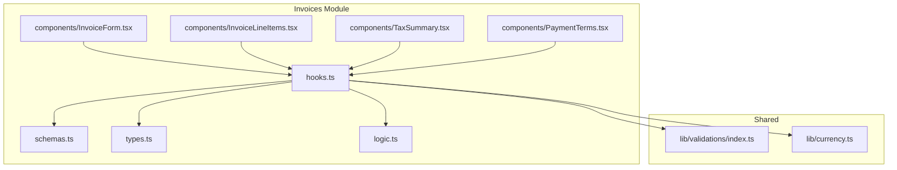
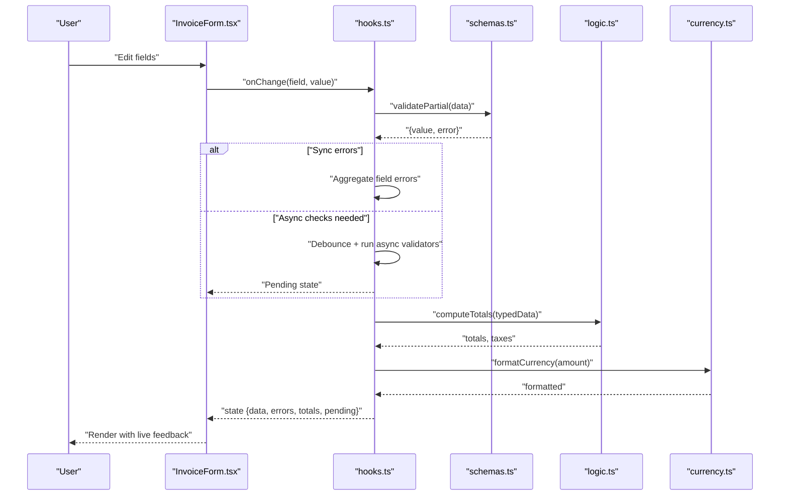
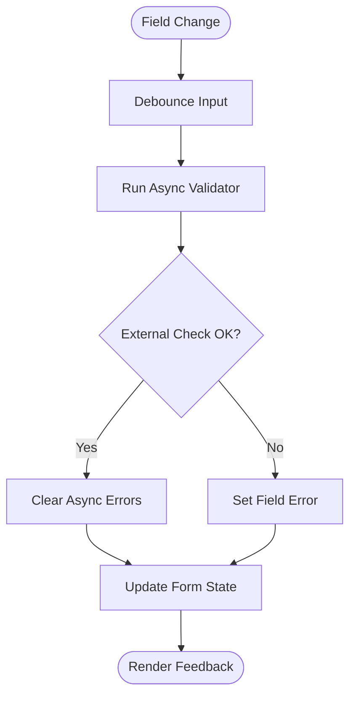
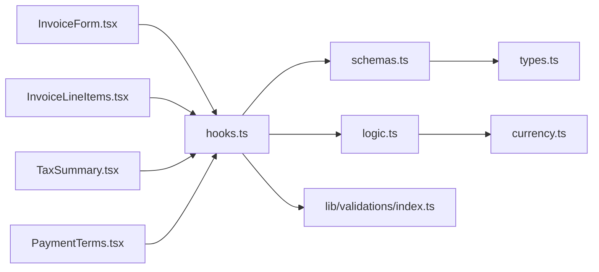
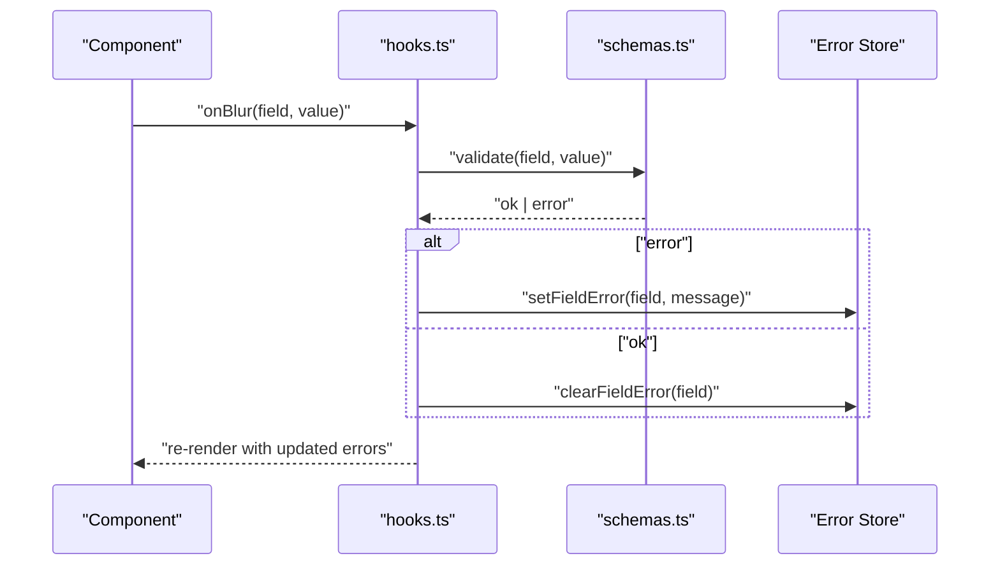

# Invoice Validation & Schemas

<cite>
**Referenced Files in This Document**
- [src/invoices/schemas.ts](file://src/invoices/schemas.ts)
- [src/invoices/types.ts](file://src/invoices/types.ts)
- [src/invoices/logic.ts](file://src/invoices/logic.ts)
- [src/invoices/hooks.ts](file://src/invoices/hooks.ts)
- [src/invoices/components/InvoiceForm.tsx](file://src/invoices/components/InvoiceForm.tsx)
- [src/invoices/components/InvoiceLineItems.tsx](file://src/invoices/components/InvoiceLineItems.tsx)
- [src/invoices/components/TaxSummary.tsx](file://src/invoices/components/TaxSummary.tsx)
- [src/invoices/components/PaymentTerms.tsx](file://src/invoices/components/PaymentTerms.tsx)
- [src/lib/validations/index.ts](file://src/lib/validations/index.ts)
- [src/lib/currency.ts](file://src/lib/currency.ts)
</cite>

## Table of Contents
1. [Introduction](#introduction)
2. [Project Structure](#project-structure)
3. [Core Components](#core-components)
4. [Architecture Overview](#architecture-overview)
5. [Detailed Component Analysis](#detailed-component-analysis)
6. [Dependency Analysis](#dependency-analysis)
7. [Performance Considerations](#performance-considerations)
8. [Troubleshooting Guide](#troubleshooting-guide)
9. [Conclusion](#conclusion)
10. [Appendices](#appendices)

## Introduction
This document explains the Invoice Validation and Schema system built with Zod for type-safe invoice data, React hooks for form state management, and field-level validation with real-time feedback. It covers schema definitions for invoice headers, line items, tax calculations, and payment terms; custom and async validation patterns; schema versioning strategies; and performance optimizations for large forms.

## Project Structure
The invoice module is organized by feature with clear separation between schemas, types, business logic, UI components, and shared utilities:
- Schemas and types define the contract for invoices and related entities.
- Logic encapsulates calculations (totals, taxes, discounts).
- Hooks centralize form state and validation orchestration.
- Components render fields, line items, tax summaries, and payment terms.
- Shared utilities provide currency formatting and reusable validations.

**Diagram sources**
- [src/invoices/schemas.ts](file://src/invoices/schemas.ts)
- [src/invoices/types.ts](file://src/invoices/types.ts)
- [src/invoices/logic.ts](file://src/invoices/logic.ts)
- [src/invoices/hooks.ts](file://src/invoices/hooks.ts)
- [src/invoices/components/InvoiceForm.tsx](file://src/invoices/components/InvoiceForm.tsx)
- [src/invoices/components/InvoiceLineItems.tsx](file://src/invoices/components/InvoiceLineItems.tsx)
- [src/invoices/components/TaxSummary.tsx](file://src/invoices/components/TaxSummary.tsx)
- [src/invoices/components/PaymentTerms.tsx](file://src/invoices/components/PaymentTerms.tsx)
- [src/lib/validations/index.ts](file://src/lib/validations/index.ts)
- [src/lib/currency.ts](file://src/lib/currency.ts)

**Section sources**
- [src/invoices/schemas.ts](file://src/invoices/schemas.ts)
- [src/invoices/types.ts](file://src/invoices/types.ts)
- [src/invoices/logic.ts](file://src/invoices/logic.ts)
- [src/invoices/hooks.ts](file://src/invoices/hooks.ts)
- [src/invoices/components/InvoiceForm.tsx](file://src/invoices/components/InvoiceForm.tsx)
- [src/invoices/components/InvoiceLineItems.tsx](file://src/invoices/components/InvoiceLineItems.tsx)
- [src/invoices/components/TaxSummary.tsx](file://src/invoices/components/TaxSummary.tsx)
- [src/invoices/components/PaymentTerms.tsx](file://src/invoices/components/PaymentTerms.tsx)
- [src/lib/validations/index.ts](file://src/lib/validations/index.ts)
- [src/lib/currency.ts](file://src/lib/currency.ts)

## Core Components
- Schema layer (Zod): Defines strict contracts for invoice headers, line items, taxes, and payment terms. Includes required fields, data types, ranges, and cross-field rules.
- Type layer: TypeScript interfaces derived from Zod schemas to ensure compile-time safety across the app.
- Logic layer: Pure functions for totals, tax computations, discount application, and rounding behavior.
- Hooks layer: Centralized form state using React hooks, integrating Zod validation, debounced async checks, and error aggregation.
- UI components: Field-level validation display, dynamic line item table, tax summary panel, and payment terms editor.

Key responsibilities:
- Maintain a single source of truth for validation rules.
- Provide typed values and errors to components.
- Compute derived values efficiently and memoize where appropriate.
- Surface actionable messages to users with minimal re-renders.

**Section sources**
- [src/invoices/schemas.ts](file://src/invoices/schemas.ts)
- [src/invoices/types.ts](file://src/invoices/types.ts)
- [src/invoices/logic.ts](file://src/invoices/logic.ts)
- [src/invoices/hooks.ts](file://src/invoices/hooks.ts)
- [src/invoices/components/InvoiceForm.tsx](file://src/invoices/components/InvoiceForm.tsx)
- [src/invoices/components/InvoiceLineItems.tsx](file://src/invoices/components/InvoiceLineItems.tsx)
- [src/invoices/components/TaxSummary.tsx](file://src/invoices/components/TaxSummary.tsx)
- [src/invoices/components/PaymentTerms.tsx](file://src/invoices/components/PaymentTerms.tsx)

## Architecture Overview
The system follows a layered architecture:
- UI components consume a validated form state provided by hooks.
- Hooks orchestrate Zod validation, compute derived totals/taxes via logic, and manage async checks.
- Schemas enforce structure and constraints; types mirror schemas for TS safety.
- Shared utilities handle currency formatting and common validations.

**Diagram sources**
- [src/invoices/components/InvoiceForm.tsx](file://src/invoices/components/InvoiceForm.tsx)
- [src/invoices/hooks.ts](file://src/invoices/hooks.ts)
- [src/invoices/schemas.ts](file://src/invoices/schemas.ts)
- [src/invoices/logic.ts](file://src/invoices/logic.ts)
- [src/lib/currency.ts](file://src/lib/currency.ts)

## Detailed Component Analysis

### Schema Definitions (Zod)
The schema layer defines:
- Invoice header: identifiers, dates, client info, currency, notes, status, and version metadata.
- Line items: description, quantity, unit price, discounts, taxes, and per-line totals.
- Tax calculations: tax rates, taxable amounts, and computed tax values.
- Payment terms: due date, method, installments, and conditional fields.

Validation characteristics:
- Required fields enforced at schema level.
- Numeric ranges and precision controls for monetary values.
- Cross-field rules (e.g., total payable equals sum of lines plus taxes minus discounts).
- Versioned schemas to support backward compatibility during migrations.

Examples of rule categories:
- Data type enforcement (string, number, boolean, enums).
- Business rules (non-negative quantities, valid date ordering).
- Conditional requirements (taxes required when rate > 0).

**Section sources**
- [src/invoices/schemas.ts](file://src/invoices/schemas.ts)
- [src/invoices/types.ts](file://src/invoices/types.ts)

### Types and Contracts
TypeScript types are aligned with Zod schemas to guarantee consistency:
- Header interface mirrors header schema.
- LineItem interface mirrors line item schema.
- TaxCalculation interface mirrors tax schema.
- PaymentTerms interface mirrors payment terms schema.

Benefits:
- Compile-time safety across components and hooks.
- Clear API boundaries for logic and UI layers.

**Section sources**
- [src/invoices/types.ts](file://src/invoices/types.ts)
- [src/invoices/schemas.ts](file://src/invoices/schemas.ts)

### Business Logic (Totals and Taxes)
Pure functions compute:
- Subtotal from line items.
- Discount application (per-line or global).
- Taxable base and tax amounts based on configured rates.
- Grand total with rounding rules.

Design principles:
- Deterministic and side-effect free.
- Memoization-friendly inputs for performance.
- Currency-aware rounding to avoid floating-point drift.

**Section sources**
- [src/invoices/logic.ts](file://src/invoices/logic.ts)
- [src/lib/currency.ts](file://src/lib/currency.ts)

### Form State Management (Hooks)
The hooks layer provides:
- Centralized state for form data, errors, and pending flags.
- Integration with Zod for sync validation on change.
- Debounced async validation for external checks (e.g., client existence, credit limits).
- Aggregation of field-level errors and cross-field messages.
- Computed totals and formatted currency values exposed to components.

Patterns:
- Use of React hooks for local state and effects.
- Selective re-renders by exposing only necessary derived values.
- Error normalization and user-friendly messages.

**Section sources**
- [src/invoices/hooks.ts](file://src/invoices/hooks.ts)
- [src/lib/validations/index.ts](file://src/lib/validations/index.ts)

### UI Components
- InvoiceForm: Orchestrates header fields, dispatches changes to hooks, and displays validation feedback.
- InvoiceLineItems: Renders a dynamic table for line items with inline validation and add/remove operations.
- TaxSummary: Displays computed tax breakdown and grand total.
- PaymentTerms: Edits payment conditions and validates due dates and installment logic.

Field-level validation:
- Immediate feedback on blur/change.
- Inline error messages near fields.
- Disabled submit until all validations pass.

**Section sources**
- [src/invoices/components/InvoiceForm.tsx](file://src/invoices/components/InvoiceForm.tsx)
- [src/invoices/components/InvoiceLineItems.tsx](file://src/invoices/components/InvoiceLineItems.tsx)
- [src/invoices/components/TaxSummary.tsx](file://src/invoices/components/TaxSummary.tsx)
- [src/invoices/components/PaymentTerms.tsx](file://src/invoices/components/PaymentTerms.tsx)

### Custom Validation Rules
Custom rules include:
- Date range checks (issue date before due date).
- Monetary precision and non-negative constraints.
- Cross-field consistency (discounts not exceeding line totals).
- Enumerated options for currency and tax codes.

Implementation approach:
- Extend Zod schemas with refine/transform methods.
- Normalize error paths to match form field names.
- Separate pure checks from async checks for clarity.

**Section sources**
- [src/invoices/schemas.ts](file://src/invoices/schemas.ts)
- [src/lib/validations/index.ts](file://src/lib/validations/index.ts)

### Async Validation for External Data Checks
Common async checks:
- Client credit limit verification.
- Item availability or pricing updates.
- Duplicate invoice number detection.

Flow:
- Trigger on field change after debounce.
- Show pending indicator while checking.
- Merge server-provided errors into field-level state.

**Diagram sources**
- [src/invoices/hooks.ts](file://src/invoices/hooks.ts)
- [src/lib/validations/index.ts](file://src/lib/validations/index.ts)

### Schema Versioning Strategies
To evolve schemas safely:
- Introduce versioned schema variants (e.g., v1, v2) with explicit migration helpers.
- Keep default versions stable and deprecate old fields gracefully.
- Validate incoming payloads against the expected version and coerce to current schema.
- Maintain backward-compatible transforms for legacy data.

Practical tips:
- Tag documents with a version field.
- Use transform pipelines to normalize older formats.
- Test both old and new schemas in integration tests.

**Section sources**
- [src/invoices/schemas.ts](file://src/invoices/schemas.ts)
- [src/invoices/types.ts](file://src/invoices/types.ts)

## Dependency Analysis
The following diagram shows how modules depend on each other:

**Diagram sources**
- [src/invoices/schemas.ts](file://src/invoices/schemas.ts)
- [src/invoices/types.ts](file://src/invoices/types.ts)
- [src/invoices/logic.ts](file://src/invoices/logic.ts)
- [src/invoices/hooks.ts](file://src/invoices/hooks.ts)
- [src/invoices/components/InvoiceForm.tsx](file://src/invoices/components/InvoiceForm.tsx)
- [src/invoices/components/InvoiceLineItems.tsx](file://src/invoices/components/InvoiceLineItems.tsx)
- [src/invoices/components/TaxSummary.tsx](file://src/invoices/components/TaxSummary.tsx)
- [src/invoices/components/PaymentTerms.tsx](file://src/invoices/components/PaymentTerms.tsx)
- [src/lib/validations/index.ts](file://src/lib/validations/index.ts)
- [src/lib/currency.ts](file://src/lib/currency.ts)

**Section sources**
- [src/invoices/schemas.ts](file://src/invoices/schemas.ts)
- [src/invoices/types.ts](file://src/invoices/types.ts)
- [src/invoices/logic.ts](file://src/invoices/logic.ts)
- [src/invoices/hooks.ts](file://src/invoices/hooks.ts)
- [src/invoices/components/InvoiceForm.tsx](file://src/invoices/components/InvoiceForm.tsx)
- [src/invoices/components/InvoiceLineItems.tsx](file://src/invoices/components/InvoiceLineItems.tsx)
- [src/invoices/components/TaxSummary.tsx](file://src/invoices/components/TaxSummary.tsx)
- [src/invoices/components/PaymentTerms.tsx](file://src/invoices/components/PaymentTerms.tsx)
- [src/lib/validations/index.ts](file://src/lib/validations/index.ts)
- [src/lib/currency.ts](file://src/lib/currency.ts)

## Performance Considerations
Optimizations for large invoice forms:
- Debounce async validation to reduce network calls.
- Memoize expensive computations (totals, taxes) with stable inputs.
- Split heavy components (line items table) into virtualized lists if needed.
- Avoid unnecessary re-renders by selecting only required state slices in components.
- Batch updates for multiple line item changes.
- Use currency utilities to prevent repeated formatting work.

[No sources needed since this section provides general guidance]

## Troubleshooting Guide
Common issues and resolutions:
- Validation errors not appearing: Ensure field names match schema paths and that hooks propagate errors to components.
- Totals mismatch: Verify rounding rules and that discounts/taxes are applied in the correct order.
- Async checks stuck in pending: Confirm debounce timing and error clearing on success.
- Currency formatting inconsistencies: Use centralized currency utilities and consistent decimal places.

Debugging steps:
- Log partial validation results to isolate failing fields.
- Temporarily disable async checks to confirm sync validation correctness.
- Inspect computed totals with known inputs to validate logic.

**Section sources**
- [src/invoices/hooks.ts](file://src/invoices/hooks.ts)
- [src/invoices/logic.ts](file://src/invoices/logic.ts)
- [src/lib/currency.ts](file://src/lib/currency.ts)

## Conclusion
The Invoice Validation and Schema system combines Zod-based schemas, typed contracts, pure business logic, and React hooks to deliver robust, real-time validation with clear error handling. With careful attention to schema versioning, async validation design, and performance optimization, the system scales well for complex invoice forms and maintains high reliability.

[No sources needed since this section summarizes without analyzing specific files]

## Appendices

### Example: Field-Level Validation Flow

**Diagram sources**
- [src/invoices/hooks.ts](file://src/invoices/hooks.ts)
- [src/invoices/schemas.ts](file://src/invoices/schemas.ts)