# Materials Integration

<cite>
**Referenced Files in This Document**
- [InvoiceMaterialsEditor.tsx](file://src/invoices/components/InvoiceMaterialsEditor.tsx)
- [useMaterials.ts](file://src/hooks/useMaterials.ts)
- [material-intents/api.ts](file://src/material-intents/api.ts)
- [material-usage/api.ts](file://src/material-usage/api.ts)
- [invoices/api.ts](file://src/invoices/api.ts)
- [invoices/logic.ts](file://src/invoices/logic.ts)
- [invoices/types.ts](file://src/invoices/types.ts)
- [hooks/useWarehouses.ts](file://src/hooks/useWarehouses.ts)
- [pages/MaterialConsumptionReport.tsx](file://src/pages/MaterialConsumptionReport.tsx)
- [pages/MaterialIntentsList.tsx](file://src/pages/MaterialIntentsList.tsx)
- [pages/MaterialUsageTracker.tsx](file://src/pages/MaterialUsageTracker.tsx)
- [pages/ProjectMaterialIntents.tsx](file://src/pages/ProjectMaterialIntents.tsx)
- [pages/ProjectMaterialList.tsx](file://src/pages/ProjectMaterialList.tsx)
- [pages/ProjectMaterialDashboard.tsx](file://src/pages/ProjectMaterialDashboard.tsx)
- [features/materials/hooks.ts](file://src/features/materials/hooks.ts)
- [features/materials/api.ts](file://src/features/materials/api.ts)
- [features/materials/types.ts](file://src/features/materials/types.ts)
- [features/materials/utils.ts](file://src/features/materials/utils.ts)
- [features/materials/stock-check.ts](file://src/features/materials/stock-check.ts)
- [features/materials/batch-tracking.ts](file://src/features/materials/batch-tracking.ts)
- [features/materials/serial-number-handling.ts](file://src/features/materials/serial-number-handling.ts)
- [features/materials/conflict-resolution.ts](file://src/features/materials/conflict-resolution.ts)
- [features/materials/partial-usage.ts](file://src/features/materials/partial-usage.ts)
- [features/materials/returns.ts](file://src/features/materials/returns.ts)
- [features/materials/pricing.ts](file://src/features/materials/pricing.ts)
- [features/materials/inventory-updates.ts](file://src/features/materials/inventory-updates.ts)
</cite>

## Table of Contents
1. [Introduction](#introduction)
2. [Project Structure](#project-structure)
3. [Core Components](#core-components)
4. [Architecture Overview](#architecture-overview)
5. [Detailed Component Analysis](#detailed-component-analysis)
6. [Dependency Analysis](#dependency-analysis)
7. [Performance Considerations](#performance-considerations)
8. [Troubleshooting Guide](#troubleshooting-guide)
9. [Conclusion](#conclusion)
10. [Appendices](#appendices)

## Introduction
This document explains the Materials Integration system for invoicing, focusing on how InvoiceMaterialsEditor tracks material consumption and integrates with inventory management. It covers material selection, stock availability checks, automatic price calculations based on material costs, warehouse integration, batch tracking, serial number handling, partial usage, returns, stock deduction logic, real-time inventory updates, and conflict resolution when multiple users modify materials simultaneously.

## Project Structure
The materials integration spans UI components, hooks, feature modules, and API layers:
- UI layer: InvoiceMaterialsEditor and related pages (consumption reports, intents, usage tracker).
- Hooks layer: useMaterials and useWarehouses for data access and state synchronization.
- Feature modules: materials feature encapsulating stock checks, batch/serial handling, pricing, inventory updates, partial usage, returns, and conflict resolution.
- API layer: material-intents, material-usage, invoices APIs coordinating server-side operations.

```mermaid
graph TB
subgraph "UI"
IME["InvoiceMaterialsEditor.tsx"]
MCR["MaterialConsumptionReport.tsx"]
MIL["MaterialIntentsList.tsx"]
MUT["MaterialUsageTracker.tsx"]
PMI["ProjectMaterialIntents.tsx"]
PML["ProjectMaterialList.tsx"]
PMD["ProjectMaterialDashboard.tsx"]
end
subgraph "Hooks"
UM["useMaterials.ts"]
UW["useWarehouses.ts"]
end
subgraph "Features"
FStock["stock-check.ts"]
FBat["batch-tracking.ts"]
FSer["serial-number-handling.ts"]
FPri["pricing.ts"]
FInv["inventory-updates.ts"]
FPart["partial-usage.ts"]
FRet["returns.ts"]
FConf["conflict-resolution.ts"]
end
subgraph "API"
AIntents["material-intents/api.ts"]
AUsage["material-usage/api.ts"]
AInv["invoices/api.ts"]
end
IME --> UM
IME --> UW
IME --> FStock
IME --> FBat
IME --> FSer
IME --> FPri
IME --> FInv
IME --> FPart
IME --> FRet
IME --> FConf
IME --> AIntents
IME --> AUsage
IME --> AInv
MCR --> UM
MIL --> AIntents
MUT --> AUsage
PMI --> AIntents
PML --> UM
PMD --> UM
```

**Diagram sources**
- [InvoiceMaterialsEditor.tsx](file://src/invoices/components/InvoiceMaterialsEditor.tsx)
- [useMaterials.ts](file://src/hooks/useMaterials.ts)
- [useWarehouses.ts](file://src/hooks/useWarehouses.ts)
- [material-intents/api.ts](file://src/material-intents/api.ts)
- [material-usage/api.ts](file://src/material-usage/api.ts)
- [invoices/api.ts](file://src/invoices/api.ts)
- [features/materials/stock-check.ts](file://src/features/materials/stock-check.ts)
- [features/materials/batch-tracking.ts](file://src/features/materials/batch-tracking.ts)
- [features/materials/serial-number-handling.ts](file://src/features/materials/serial-number-handling.ts)
- [features/materials/pricing.ts](file://src/features/materials/pricing.ts)
- [features/materials/inventory-updates.ts](file://src/features/materials/inventory-updates.ts)
- [features/materials/partial-usage.ts](file://src/features/materials/partial-usage.ts)
- [features/materials/returns.ts](file://src/features/materials/returns.ts)
- [features/materials/conflict-resolution.ts](file://src/features/materials/conflict-resolution.ts)
- [pages/MaterialConsumptionReport.tsx](file://src/pages/MaterialConsumptionReport.tsx)
- [pages/MaterialIntentsList.tsx](file://src/pages/MaterialIntentsList.tsx)
- [pages/MaterialUsageTracker.tsx](file://src/pages/MaterialUsageTracker.tsx)
- [pages/ProjectMaterialIntents.tsx](file://src/pages/ProjectMaterialIntents.tsx)
- [pages/ProjectMaterialList.tsx](file://src/pages/ProjectMaterialList.tsx)
- [pages/ProjectMaterialDashboard.tsx](file://src/pages/ProjectMaterialDashboard.tsx)

**Section sources**
- [InvoiceMaterialsEditor.tsx](file://src/invoices/components/InvoiceMaterialsEditor.tsx)
- [useMaterials.ts](file://src/hooks/useMaterials.ts)
- [useWarehouses.ts](file://src/hooks/useWarehouses.ts)
- [material-intents/api.ts](file://src/material-intents/api.ts)
- [material-usage/api.ts](file://src/material-usage/api.ts)
- [invoices/api.ts](file://src/invoices/api.ts)
- [features/materials/stock-check.ts](file://src/features/materials/stock-check.ts)
- [features/materials/batch-tracking.ts](file://src/features/materials/batch-tracking.ts)
- [features/materials/serial-number-handling.ts](file://src/features/materials/serial-number-handling.ts)
- [features/materials/pricing.ts](file://src/features/materials/pricing.ts)
- [features/materials/inventory-updates.ts](file://src/features/materials/inventory-updates.ts)
- [features/materials/partial-usage.ts](file://src/features/materials/partial-usage.ts)
- [features/materials/returns.ts](file://src/features/materials/returns.ts)
- [features/materials/conflict-resolution.ts](file://src/features/materials/conflict-resolution.ts)
- [pages/MaterialConsumptionReport.tsx](file://src/pages/MaterialConsumptionReport.tsx)
- [pages/MaterialIntentsList.tsx](file://src/pages/MaterialIntentsList.tsx)
- [pages/MaterialUsageTracker.tsx](file://src/pages/MaterialUsageTracker.tsx)
- [pages/ProjectMaterialIntents.tsx](file://src/pages/ProjectMaterialIntents.tsx)
- [pages/ProjectMaterialList.tsx](file://src/pages/ProjectMaterialList.tsx)
- [pages/ProjectMaterialDashboard.tsx](file://src/pages/ProjectMaterialDashboard.tsx)

## Core Components
- InvoiceMaterialsEditor: Orchestrates material selection, validates stock, computes prices, records consumption, and persists invoice lines.
- useMaterials: Provides material catalog, stock levels, and mutation hooks to update inventory and consumption records.
- useWarehouses: Supplies warehouse context and location-based stock visibility.
- Material Intents and Usage APIs: Manage reservation-like intent records and actual usage postings.
- Invoices API: Creates or updates invoices with material line items and triggers downstream inventory effects.

Key responsibilities:
- Selection: Searchable item picker with filters by warehouse and availability.
- Availability: Real-time checks against current stock; prevents over-allocation.
- Pricing: Auto-calculates unit price from material cost rules; supports overrides with audit trail.
- Consumption: Records partial usage and full usage; links to batches and serial numbers where applicable.
- Returns: Supports material returns that restore stock and adjust invoice totals.
- Conflict Resolution: Optimistic updates with server reconciliation and user prompts on conflicts.

**Section sources**
- [InvoiceMaterialsEditor.tsx](file://src/invoices/components/InvoiceMaterialsEditor.tsx)
- [useMaterials.ts](file://src/hooks/useMaterials.ts)
- [useWarehouses.ts](file://src/hooks/useWarehouses.ts)
- [material-intents/api.ts](file://src/material-intents/api.ts)
- [material-usage/api.ts](file://src/material-usage/api.ts)
- [invoices/api.ts](file://src/invoices/api.ts)

## Architecture Overview
The system follows a layered architecture:
- UI Layer: Editors and dashboards interact with hooks and features.
- Feature Layer: Encapsulates domain logic (stock checks, batch/serial handling, pricing, returns, partial usage, conflict resolution).
- Data Access Layer: Hooks abstract Supabase queries and mutations.
- API Layer: Server endpoints handle transactions, validations, and side effects (e.g., inventory updates).

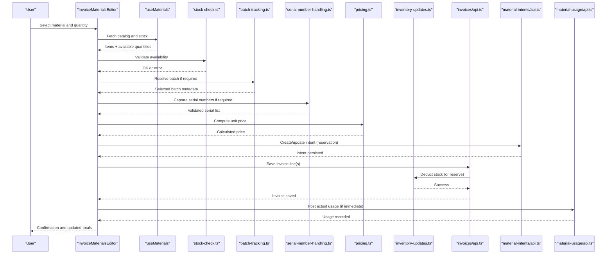

**Diagram sources**
- [InvoiceMaterialsEditor.tsx](file://src/invoices/components/InvoiceMaterialsEditor.tsx)
- [useMaterials.ts](file://src/hooks/useMaterials.ts)
- [features/materials/stock-check.ts](file://src/features/materials/stock-check.ts)
- [features/materials/batch-tracking.ts](file://src/features/materials/batch-tracking.ts)
- [features/materials/serial-number-handling.ts](file://src/features/materials/serial-number-handling.ts)
- [features/materials/pricing.ts](file://src/features/materials/pricing.ts)
- [features/materials/inventory-updates.ts](file://src/features/materials/inventory-updates.ts)
- [invoices/api.ts](file://src/invoices/api.ts)
- [material-intents/api.ts](file://src/material-intents/api.ts)
- [material-usage/api.ts](file://src/material-usage/api.ts)

## Detailed Component Analysis

### InvoiceMaterialsEditor
Responsibilities:
- Material selection with warehouse filtering and live availability.
- Automatic price calculation using pricing rules.
- Recording partial usage and linking to batches/serials.
- Persisting invoice lines and triggering inventory updates.
- Handling returns and reconciling changes.

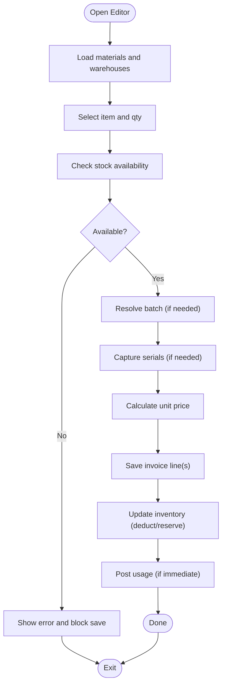

**Diagram sources**
- [InvoiceMaterialsEditor.tsx](file://src/invoices/components/InvoiceMaterialsEditor.tsx)
- [features/materials/stock-check.ts](file://src/features/materials/stock-check.ts)
- [features/materials/batch-tracking.ts](file://src/features/materials/batch-tracking.ts)
- [features/materials/serial-number-handling.ts](file://src/features/materials/serial-number-handling.ts)
- [features/materials/pricing.ts](file://src/features/materials/pricing.ts)
- [features/materials/inventory-updates.ts](file://src/features/materials/inventory-updates.ts)
- [invoices/api.ts](file://src/invoices/api.ts)

**Section sources**
- [InvoiceMaterialsEditor.tsx](file://src/invoices/components/InvoiceMaterialsEditor.tsx)

### Material Selection and Stock Availability
- Selection: Searchable dropdown with filters by warehouse and item attributes.
- Availability: Real-time check against current stock; enforces non-negative allocation.
- Partial usage: Allows allocating less than requested; remaining can be reserved or left unallocated.

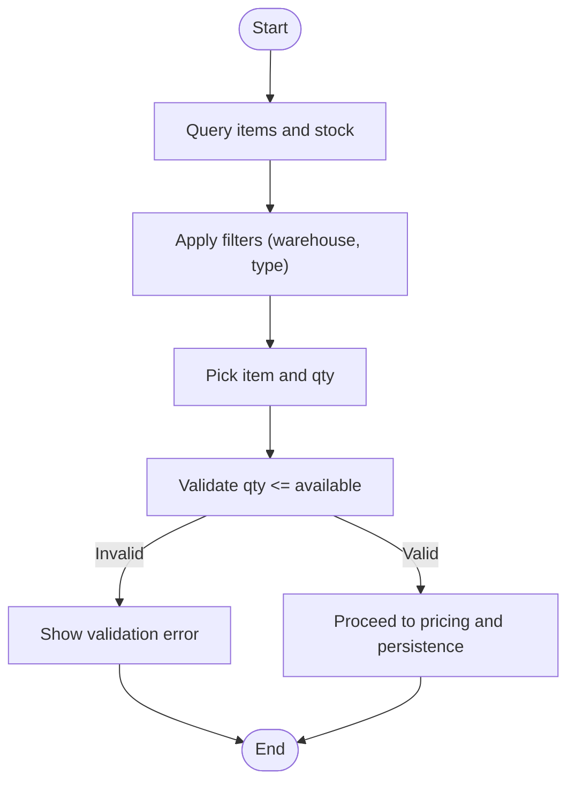

**Diagram sources**
- [useMaterials.ts](file://src/hooks/useMaterials.ts)
- [features/materials/stock-check.ts](file://src/features/materials/stock-check.ts)
- [features/materials/partial-usage.ts](file://src/features/materials/partial-usage.ts)

**Section sources**
- [useMaterials.ts](file://src/hooks/useMaterials.ts)
- [features/materials/stock-check.ts](file://src/features/materials/stock-check.ts)
- [features/materials/partial-usage.ts](file://src/features/materials/partial-usage.ts)

### Automatic Price Calculations
- Pricing engine reads base cost and applies markup/discount rules.
- Supports per-item overrides with audit logging.
- Re-computes totals on any change to quantity, price, or discounts.

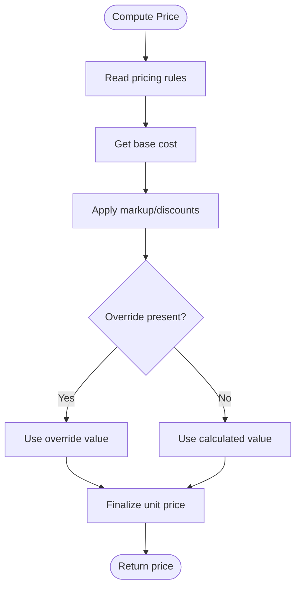

**Diagram sources**
- [features/materials/pricing.ts](file://src/features/materials/pricing.ts)
- [invoices/logic.ts](file://src/invoices/logic.ts)
- [invoices/types.ts](file://src/invoices/types.ts)

**Section sources**
- [features/materials/pricing.ts](file://src/features/materials/pricing.ts)
- [invoices/logic.ts](file://src/invoices/logic.ts)
- [invoices/types.ts](file://src/invoices/types.ts)

### Warehouse Management Integration
- Warehouse-aware stock visibility and allocation.
- Multi-warehouse support with location-specific reservations.
- Consolidation across warehouses for reporting and planning.

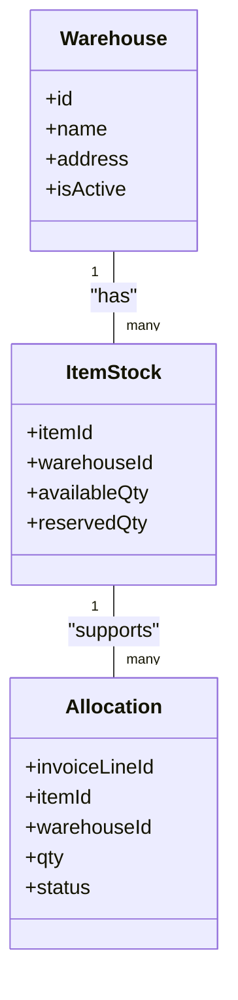

**Diagram sources**
- [useWarehouses.ts](file://src/hooks/useWarehouses.ts)
- [useMaterials.ts](file://src/hooks/useMaterials.ts)
- [features/materials/inventory-updates.ts](file://src/features/materials/inventory-updates.ts)

**Section sources**
- [useWarehouses.ts](file://src/hooks/useWarehouses.ts)
- [useMaterials.ts](file://src/hooks/useMaterials.ts)
- [features/materials/inventory-updates.ts](file://src/features/materials/inventory-updates.ts)

### Batch Tracking and Serial Number Handling
- Batch tracking: Enforces FIFO/FEFO policies and captures lot/expiry details.
- Serial numbers: Required for high-value items; validated uniqueness and linkage to usage.

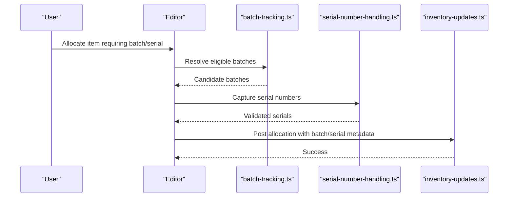

**Diagram sources**
- [features/materials/batch-tracking.ts](file://src/features/materials/batch-tracking.ts)
- [features/materials/serial-number-handling.ts](file://src/features/materials/serial-number-handling.ts)
- [features/materials/inventory-updates.ts](file://src/features/materials/inventory-updates.ts)

**Section sources**
- [features/materials/batch-tracking.ts](file://src/features/materials/batch-tracking.ts)
- [features/materials/serial-number-handling.ts](file://src/features/materials/serial-number-handling.ts)
- [features/materials/inventory-updates.ts](file://src/features/materials/inventory-updates.ts)

### Creating Invoices from Material Consumption Records
- Consumption records are transformed into invoice line items.
- Validation ensures all required fields (item, qty, warehouse, batch/serial) are present.
- Totals recompute automatically after mapping.

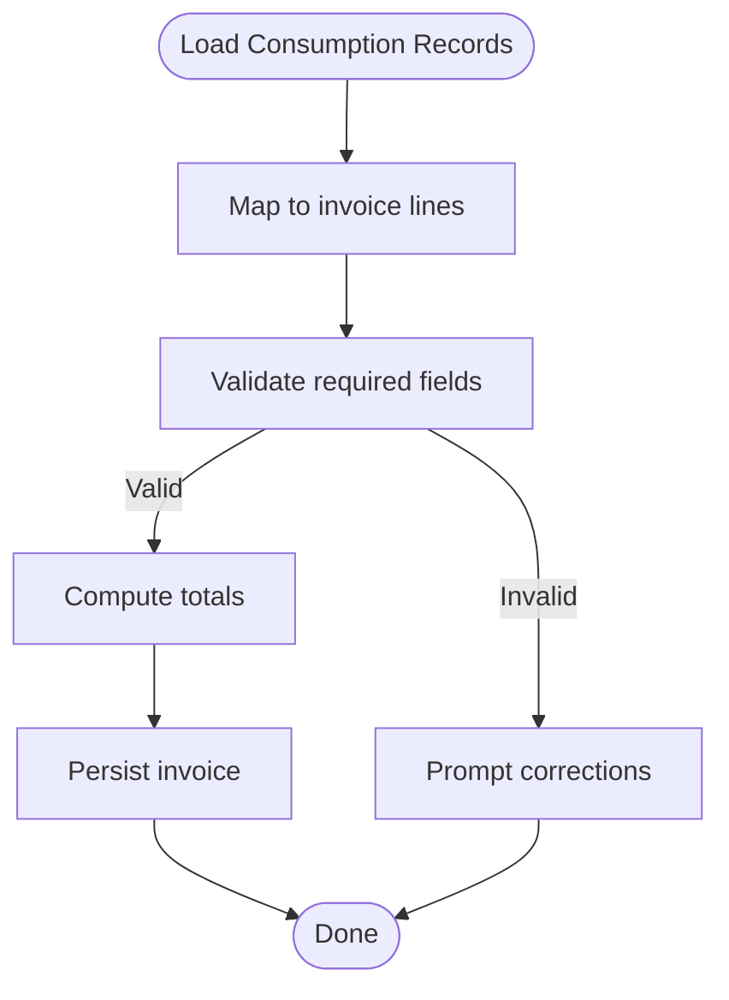

**Diagram sources**
- [pages/MaterialConsumptionReport.tsx](file://src/pages/MaterialConsumptionReport.tsx)
- [invoices/api.ts](file://src/invoices/api.ts)
- [invoices/logic.ts](file://src/invoices/logic.ts)

**Section sources**
- [pages/MaterialConsumptionReport.tsx](file://src/pages/MaterialConsumptionReport.tsx)
- [invoices/api.ts](file://src/invoices/api.ts)
- [invoices/logic.ts](file://src/invoices/logic.ts)

### Handling Partial Material Usage
- Supports allocating less than requested; remaining can be reserved or canceled.
- Tracks partial allocations per invoice line and aggregates totals.

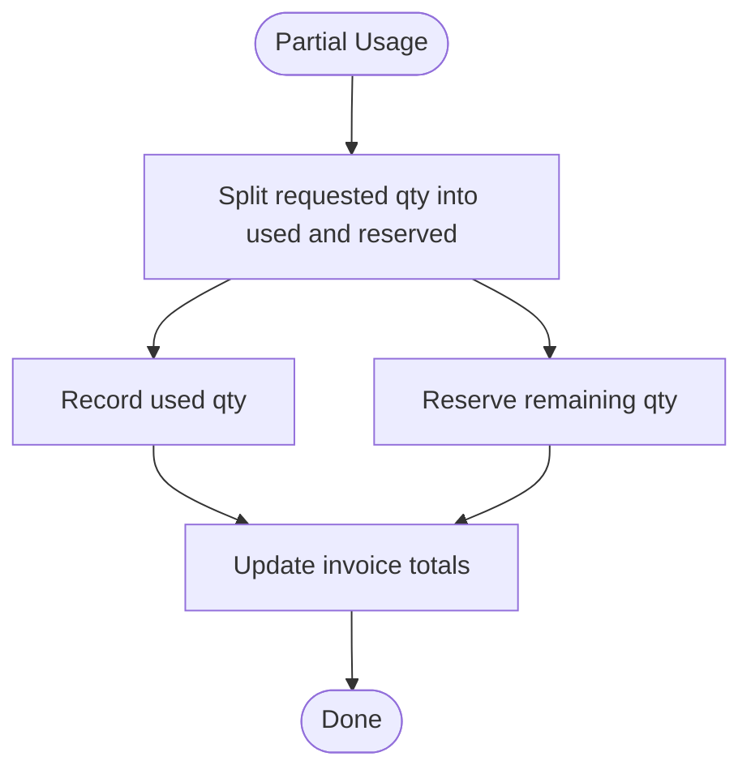

**Diagram sources**
- [features/materials/partial-usage.ts](file://src/features/materials/partial-usage.ts)
- [invoices/logic.ts](file://src/invoices/logic.ts)

**Section sources**
- [features/materials/partial-usage.ts](file://src/features/materials/partial-usage.ts)
- [invoices/logic.ts](file://src/invoices/logic.ts)

### Managing Material Returns
- Returns reverse consumption, restoring stock and adjusting invoice totals.
- Requires reason codes and optional reference to original allocation.

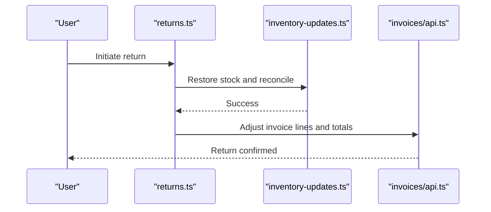

**Diagram sources**
- [features/materials/returns.ts](file://src/features/materials/returns.ts)
- [features/materials/inventory-updates.ts](file://src/features/materials/inventory-updates.ts)
- [invoices/api.ts](file://src/invoices/api.ts)

**Section sources**
- [features/materials/returns.ts](file://src/features/materials/returns.ts)
- [features/materials/inventory-updates.ts](file://src/features/materials/inventory-updates.ts)
- [invoices/api.ts](file://src/invoices/api.ts)

### Stock Deduction Logic and Real-Time Inventory Updates
- Deductions occur upon saving invoice lines or posting usage.
- Reservations reduce available stock while preserving committed quantities.
- Real-time updates propagate via hooks and presence mechanisms.

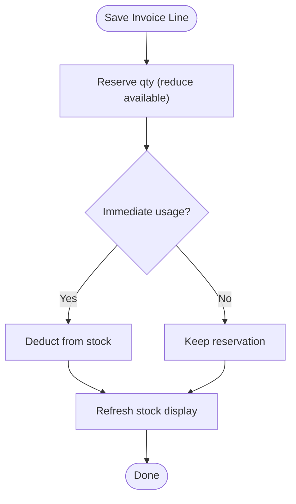

**Diagram sources**
- [features/materials/inventory-updates.ts](file://src/features/materials/inventory-updates.ts)
- [useMaterials.ts](file://src/hooks/useMaterials.ts)

**Section sources**
- [features/materials/inventory-updates.ts](file://src/features/materials/inventory-updates.ts)
- [useMaterials.ts](file://src/hooks/useMaterials.ts)

### Conflict Resolution for Concurrent Modifications
- Optimistic updates applied locally; server validates and reconciles.
- On conflict, user is prompted to review differences and choose resolution strategy (accept server, keep local, merge).
- Audit logs capture conflict events and resolutions.

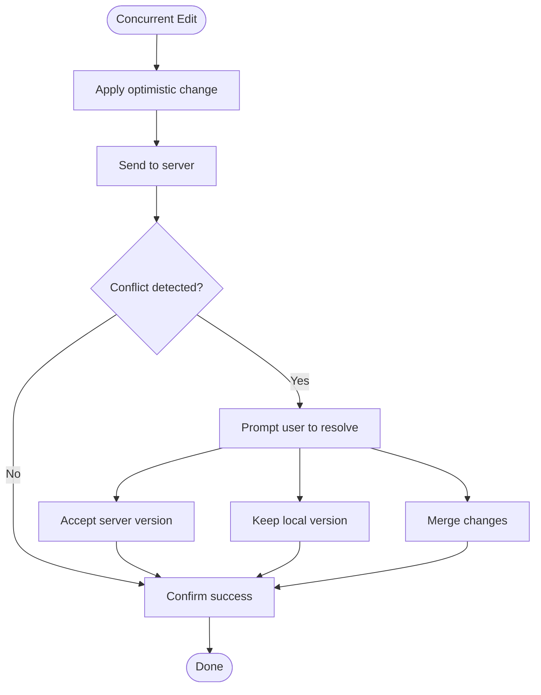

**Diagram sources**
- [features/materials/conflict-resolution.ts](file://src/features/materials/conflict-resolution.ts)
- [invoices/api.ts](file://src/invoices/api.ts)

**Section sources**
- [features/materials/conflict-resolution.ts](file://src/features/materials/conflict-resolution.ts)
- [invoices/api.ts](file://src/invoices/api.ts)

### Conceptual Overview
The materials integration connects invoicing workflows with inventory systems through a robust set of features:
- Selection and validation ensure accurate allocations.
- Pricing automation maintains consistency and traceability.
- Batch and serial tracking provide full traceability for compliance and quality.
- Partial usage and returns support flexible operational scenarios.
- Conflict resolution safeguards data integrity under concurrent edits.

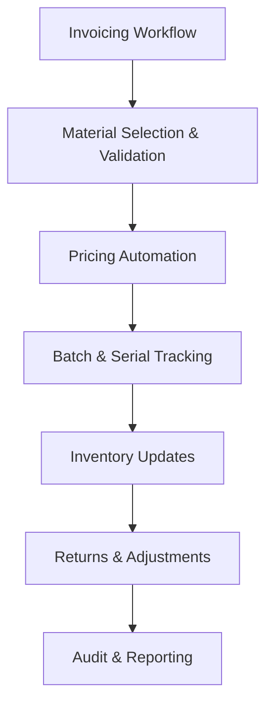

[No sources needed since this diagram shows conceptual workflow, not actual code structure]

## Dependency Analysis
The following diagram highlights key dependencies between core modules:

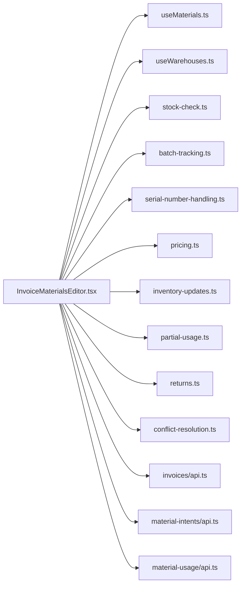

**Diagram sources**
- [InvoiceMaterialsEditor.tsx](file://src/invoices/components/InvoiceMaterialsEditor.tsx)
- [useMaterials.ts](file://src/hooks/useMaterials.ts)
- [useWarehouses.ts](file://src/hooks/useWarehouses.ts)
- [features/materials/stock-check.ts](file://src/features/materials/stock-check.ts)
- [features/materials/batch-tracking.ts](file://src/features/materials/batch-tracking.ts)
- [features/materials/serial-number-handling.ts](file://src/features/materials/serial-number-handling.ts)
- [features/materials/pricing.ts](file://src/features/materials/pricing.ts)
- [features/materials/inventory-updates.ts](file://src/features/materials/inventory-updates.ts)
- [features/materials/partial-usage.ts](file://src/features/materials/partial-usage.ts)
- [features/materials/returns.ts](file://src/features/materials/returns.ts)
- [features/materials/conflict-resolution.ts](file://src/features/materials/conflict-resolution.ts)
- [invoices/api.ts](file://src/invoices/api.ts)
- [material-intents/api.ts](file://src/material-intents/api.ts)
- [material-usage/api.ts](file://src/material-usage/api.ts)

**Section sources**
- [InvoiceMaterialsEditor.tsx](file://src/invoices/components/InvoiceMaterialsEditor.tsx)
- [useMaterials.ts](file://src/hooks/useMaterials.ts)
- [useWarehouses.ts](file://src/hooks/useWarehouses.ts)
- [features/materials/stock-check.ts](file://src/features/materials/stock-check.ts)
- [features/materials/batch-tracking.ts](file://src/features/materials/batch-tracking.ts)
- [features/materials/serial-number-handling.ts](file://src/features/materials/serial-number-handling.ts)
- [features/materials/pricing.ts](file://src/features/materials/pricing.ts)
- [features/materials/inventory-updates.ts](file://src/features/materials/inventory-updates.ts)
- [features/materials/partial-usage.ts](file://src/features/materials/partial-usage.ts)
- [features/materials/returns.ts](file://src/features/materials/returns.ts)
- [features/materials/conflict-resolution.ts](file://src/features/materials/conflict-resolution.ts)
- [invoices/api.ts](file://src/invoices/api.ts)
- [material-intents/api.ts](file://src/material-intents/api.ts)
- [material-usage/api.ts](file://src/material-usage/api.ts)

## Performance Considerations
- Debounce search inputs for material selection to reduce network load.
- Paginate large catalogs and stock lists; lazy-load additional pages.
- Batch inventory updates to minimize round trips during bulk saves.
- Cache frequently accessed pricing rules and warehouse configurations.
- Use optimistic updates with fast rollback on failure to improve perceived performance.

[No sources needed since this section provides general guidance]

## Troubleshooting Guide
Common issues and resolutions:
- Over-allocation errors: Ensure stock checks run before saving; verify warehouse context.
- Missing batch/serial: Enforce required fields for items configured with batch/serial tracking.
- Price discrepancies: Review pricing rules and overrides; check audit logs for manual adjustments.
- Conflicts on save: Use conflict resolution prompts; accept server version or merge changes carefully.
- Returns not reflected: Verify return flow posts both stock restoration and invoice adjustments.

**Section sources**
- [features/materials/stock-check.ts](file://src/features/materials/stock-check.ts)
- [features/materials/batch-tracking.ts](file://src/features/materials/batch-tracking.ts)
- [features/materials/serial-number-handling.ts](file://src/features/materials/serial-number-handling.ts)
- [features/materials/pricing.ts](file://src/features/materials/pricing.ts)
- [features/materials/conflict-resolution.ts](file://src/features/materials/conflict-resolution.ts)
- [features/materials/returns.ts](file://src/features/materials/returns.ts)

## Conclusion
The Materials Integration system provides a comprehensive solution for tracking material consumption within invoicing, ensuring accurate stock management, reliable pricing, and robust traceability through batch and serial tracking. Its design supports partial usage, returns, real-time updates, and safe concurrent editing, making it suitable for complex operational environments.

[No sources needed since this section summarizes without analyzing specific files]

## Appendices
- Related pages and utilities:
  - Material consumption reporting and dashboards for visibility and analysis.
  - Project-level material intents and lists for planning and execution.

**Section sources**
- [pages/MaterialConsumptionReport.tsx](file://src/pages/MaterialConsumptionReport.tsx)
- [pages/ProjectMaterialIntents.tsx](file://src/pages/ProjectMaterialIntents.tsx)
- [pages/ProjectMaterialList.tsx](file://src/pages/ProjectMaterialList.tsx)
- [pages/ProjectMaterialDashboard.tsx](file://src/pages/ProjectMaterialDashboard.tsx)