# Invoice Workflows & Status Management

<cite>
**Referenced Files in This Document**
- [src/invoices/types.ts](file://src/invoices/types.ts)
- [src/invoices/logic.ts](file://src/invoices/logic.ts)
- [src/invoices/api.ts](file://src/invoices/api.ts)
- [src/invoices/hooks.ts](file://src/invoices/hooks.ts)
- [src/invoices/components/InvoiceStatusBadge.tsx](file://src/invoices/components/InvoiceStatusBadge.tsx)
- [src/approvals/workflow-engine.ts](file://src/approvals/workflow-engine.ts)
- [src/approvals/api.ts](file://src/approvals/api.ts)
- [src/approvals/integration.ts](file://src/approvals/integration.ts)
- [src/approvals/notifications.ts](file://src/approvals/notifications.ts)
- [src/approvals/settings-api.ts](file://src/approvals/settings-api.ts)
- [src/approvals/siteReportApproval.ts](file://src/approvals/siteReportApproval.ts)
- [src/database-add-audit-log.sql](file://src/database-add-audit-log.sql)
- [src/database-approval-workflows-fix-fk.sql](file://src/database-approval-workflows-fix-fk.sql)
- [src/database-approval-workflows-rls.sql](file://src/database-approval-workflows-rls.sql)
- [src/database-approvals.sql](file://src/database-approvals.sql)
- [src/database-approvals-edge-cases.sql](file://src/database-approvals-edge-cases.sql)
- [src/database-approval.sql](file://src/database-approval.sql)
- [src/database-reviewer-workflow.sql](file://src/database-reviewer-workflow.sql)
- [src/database-document-settings.sql](file://src/database-document-settings.sql)
- [src/database-document-series.sql](file://src/database-document-series.sql)
- [src/database-invoice-template.sql](file://src/database-invoice-template.sql)
- [src/database-link-project-invoices-to-po.sql](file://src/database-link-project-invoices-to-po.sql)
- [src/database-proforma-invoices.sql](file://src/database-proforma-invoices.sql)
- [src/features/invoices/index.ts](file://src/features/invoices/index.ts)
- [src/pages/CreateProjectInvoiceModal.tsx](file://src/pages/CreateProjectInvoiceModal.tsx)
</cite>

## Table of Contents
1. [Introduction](#introduction)
2. [Project Structure](#project-structure)
3. [Core Components](#core-components)
4. [Architecture Overview](#architecture-overview)
5. [Detailed Component Analysis](#detailed-component-analysis)
6. [Dependency Analysis](#dependency-analysis)
7. [Performance Considerations](#performance-considerations)
8. [Troubleshooting Guide](#troubleshooting-guide)
9. [Conclusion](#conclusion)
10. [Appendices](#appendices)

## Introduction
This document explains the end-to-end invoice lifecycle and status management, including state definitions, transitions, approval workflows, audit trails, UI indicators, and integrations with project billing cycles and notifications. It also provides guidance for implementing custom status workflows, handling revisions, and managing cancellations.

## Project Structure
The invoice domain is implemented across dedicated modules:
- Domain types and logic reside under src/invoices
- Approval workflow engine and settings under src/approvals
- Database schema and migrations under src and supabase directories
- UI components for status badges and creation flows are located under src/invoices/components and src/pages

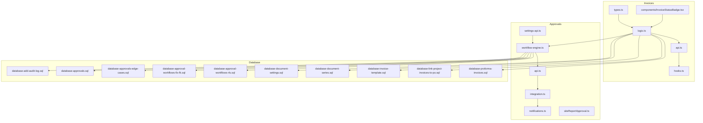

**Diagram sources**
- [src/invoices/types.ts](file://src/invoices/types.ts)
- [src/invoices/logic.ts](file://src/invoices/logic.ts)
- [src/invoices/api.ts](file://src/invoices/api.ts)
- [src/invoices/hooks.ts](file://src/invoices/hooks.ts)
- [src/invoices/components/InvoiceStatusBadge.tsx](file://src/invoices/components/InvoiceStatusBadge.tsx)
- [src/approvals/workflow-engine.ts](file://src/approvals/workflow-engine.ts)
- [src/approvals/api.ts](file://src/approvals/api.ts)
- [src/approvals/integration.ts](file://src/approvals/integration.ts)
- [src/approvals/notifications.ts](file://src/approvals/notifications.ts)
- [src/approvals/settings-api.ts](file://src/approvals/settings-api.ts)
- [src/approvals/siteReportApproval.ts](file://src/approvals/siteReportApproval.ts)
- [src/database-add-audit-log.sql](file://src/database-add-audit-log.sql)
- [src/database-approvals.sql](file://src/database-approvals.sql)
- [src/database-approvals-edge-cases.sql](file://src/database-approvals-edge-cases.sql)
- [src/database-approval-workflows-fix-fk.sql](file://src/database-approval-workflows-fix-fk.sql)
- [src/database-approval-workflows-rls.sql](file://src/database-approval-workflows-rls.sql)
- [src/database-document-settings.sql](file://src/database-document-settings.sql)
- [src/database-document-series.sql](file://src/database-document-series.sql)
- [src/database-invoice-template.sql](file://src/database-invoice-template.sql)
- [src/database-link-project-invoices-to-po.sql](file://src/database-link-project-invoices-to-po.sql)
- [src/database-proforma-invoices.sql](file://src/database-proforma-invoices.sql)

**Section sources**
- [src/invoices/types.ts](file://src/invoices/types.ts)
- [src/invoices/logic.ts](file://src/invoices/logic.ts)
- [src/invoices/api.ts](file://src/invoices/api.ts)
- [src/invoices/hooks.ts](file://src/invoices/hooks.ts)
- [src/invoices/components/InvoiceStatusBadge.tsx](file://src/invoices/components/InvoiceStatusBadge.tsx)
- [src/approvals/workflow-engine.ts](file://src/approvals/workflow-engine.ts)
- [src/approvals/api.ts](file://src/approvals/api.ts)
- [src/approvals/integration.ts](file://src/approvals/integration.ts)
- [src/approvals/notifications.ts](file://src/approvals/notifications.ts)
- [src/approvals/settings-api.ts](file://src/approvals/settings-api.ts)
- [src/approvals/siteReportApproval.ts](file://src/approvals/siteReportApproval.ts)
- [src/database-add-audit-log.sql](file://src/database-add-audit-log.sql)
- [src/database-approvals.sql](file://src/database-approvals.sql)
- [src/database-approvals-edge-cases.sql](file://src/database-approvals-edge-cases.sql)
- [src/database-approval-workflows-fix-fk.sql](file://src/database-approval-workflows-fix-fk.sql)
- [src/database-approval-workflows-rls.sql](file://src/database-approval-workflows-rls.sql)
- [src/database-document-settings.sql](file://src/database-document-settings.sql)
- [src/database-document-series.sql](file://src/database-document-series.sql)
- [src/database-invoice-template.sql](file://src/database-invoice-template.sql)
- [src/database-link-project-invoices-to-po.sql](file://src/database-link-project-invoices-to-po.sql)
- [src/database-proforma-invoices.sql](file://src/database-proforma-invoices.sql)

## Core Components
- Invoice types and status constants define the canonical states and transitions used by the application.
- Invoice logic encapsulates validation rules, transition guards, and side effects such as series assignment and template selection.
- API layer exposes operations to create, update, approve, cancel, and finalize invoices.
- Hooks provide reactive access to invoice data and actions within React components.
- InvoiceStatusBadge renders a visual indicator reflecting the current invoice status and may expose status-specific actions (e.g., Approve, Cancel).

Key responsibilities:
- State machine enforcement: ensure only valid transitions occur based on current status and user permissions.
- Approval orchestration: integrate with the approval workflow engine to route approvals and record outcomes.
- Audit logging: persist immutable records of all status changes and key actions.
- UI consistency: present consistent status visuals and actionable controls via the badge component.

**Section sources**
- [src/invoices/types.ts](file://src/invoices/types.ts)
- [src/invoices/logic.ts](file://src/invoices/logic.ts)
- [src/invoices/api.ts](file://src/invoices/api.ts)
- [src/invoices/hooks.ts](file://src/invoices/hooks.ts)
- [src/invoices/components/InvoiceStatusBadge.tsx](file://src/invoices/components/InvoiceStatusBadge.tsx)

## Architecture Overview
The system follows a layered architecture:
- Presentation layer: UI components (including InvoiceStatusBadge) render statuses and trigger actions.
- Business logic layer: invoice logic enforces state transitions and orchestrates side effects.
- Integration layer: approval workflow engine coordinates multi-level approvals and integrates with notifications.
- Persistence layer: database schemas store invoices, approvals, audit logs, document settings, and series.

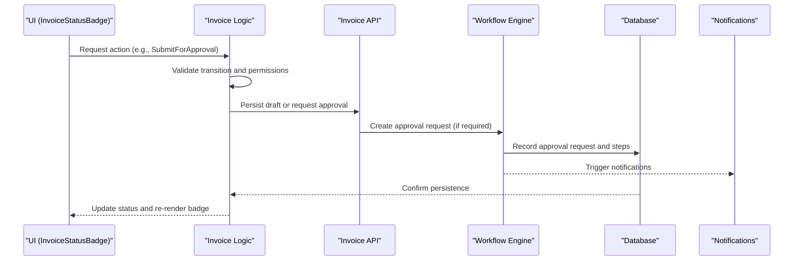

**Diagram sources**
- [src/invoices/components/InvoiceStatusBadge.tsx](file://src/invoices/components/InvoiceStatusBadge.tsx)
- [src/invoices/logic.ts](file://src/invoices/logic.ts)
- [src/invoices/api.ts](file://src/invoices/api.ts)
- [src/approvals/workflow-engine.ts](file://src/approvals/workflow-engine.ts)
- [src/approvals/notifications.ts](file://src/approvals/notifications.ts)
- [src/database-approvals.sql](file://src/database-approvals.sql)

## Detailed Component Analysis

### Invoice Lifecycle and States
Typical invoice states include Draft, Submitted, Approved, Issued, Partially Paid, Paid, and Cancelled. Transitions are guarded by business rules and permissions. The status badge displays the current state and may enable context-sensitive actions.

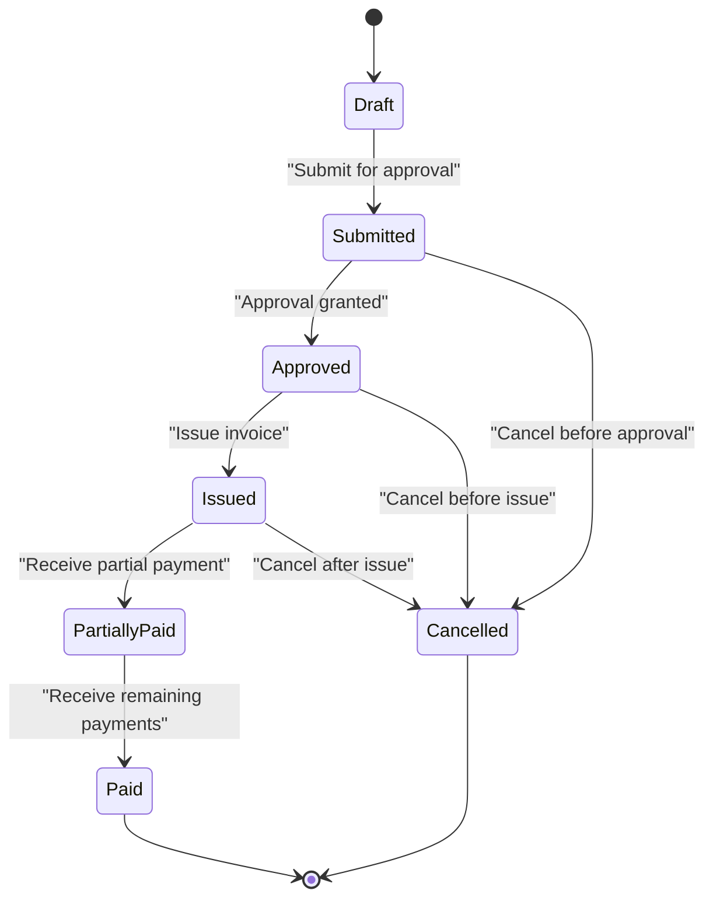

[No sources needed since this diagram shows conceptual workflow, not actual code structure]

### InvoiceStatusBadge Component
The badge component:
- Reads the current invoice status from props or local state.
- Renders a color-coded label and optional icon.
- Exposes action buttons when permitted (e.g., Approve, Cancel, Issue).
- Delegates actions to the invoice logic layer, which validates transitions and triggers side effects.

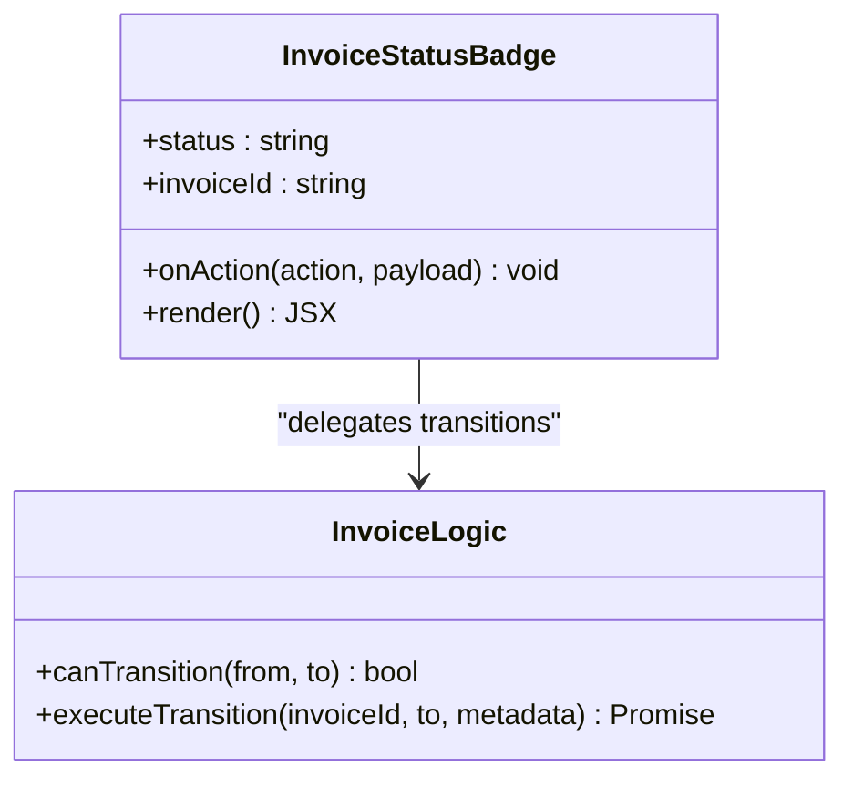

**Diagram sources**
- [src/invoices/components/InvoiceStatusBadge.tsx](file://src/invoices/components/InvoiceStatusBadge.tsx)
- [src/invoices/logic.ts](file://src/invoices/logic.ts)

**Section sources**
- [src/invoices/components/InvoiceStatusBadge.tsx](file://src/invoices/components/InvoiceStatusBadge.tsx)
- [src/invoices/logic.ts](file://src/invoices/logic.ts)

### Approval Workflow Orchestration
The approval workflow engine:
- Evaluates configured approval policies for invoices.
- Creates multi-level approval requests and tracks step completion.
- Integrates with notification services to alert approvers and stakeholders.
- Records outcomes and updates invoice status upon final decision.

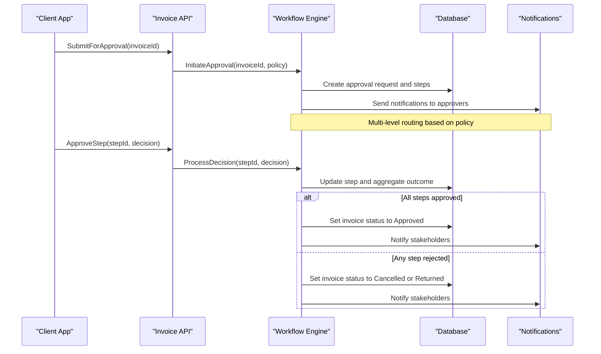

**Diagram sources**
- [src/approvals/workflow-engine.ts](file://src/approvals/workflow-engine.ts)
- [src/approvals/api.ts](file://src/approvals/api.ts)
- [src/approvals/notifications.ts](file://src/approvals/notifications.ts)
- [src/database-approvals.sql](file://src/database-approvals.sql)

**Section sources**
- [src/approvals/workflow-engine.ts](file://src/approvals/workflow-engine.ts)
- [src/approvals/api.ts](file://src/approvals/api.ts)
- [src/approvals/integration.ts](file://src/approvals/integration.ts)
- [src/approvals/notifications.ts](file://src/approvals/notifications.ts)
- [src/approvals/settings-api.ts](file://src/approvals/settings-api.ts)
- [src/approvals/siteReportApproval.ts](file://src/approvals/siteReportApproval.ts)
- [src/database-approvals.sql](file://src/database-approvals.sql)
- [src/database-approvals-edge-cases.sql](file://src/database-approvals-edge-cases.sql)
- [src/database-approval-workflows-fix-fk.sql](file://src/database-approval-workflows-fix-fk.sql)
- [src/database-approval-workflows-rls.sql](file://src/database-approval-workflows-rls.sql)

### Audit Trail Maintenance
Audit logs capture immutable records of critical events:
- Status transitions
- Approval decisions
- Cancellations and reversals
- Revisions and versioning

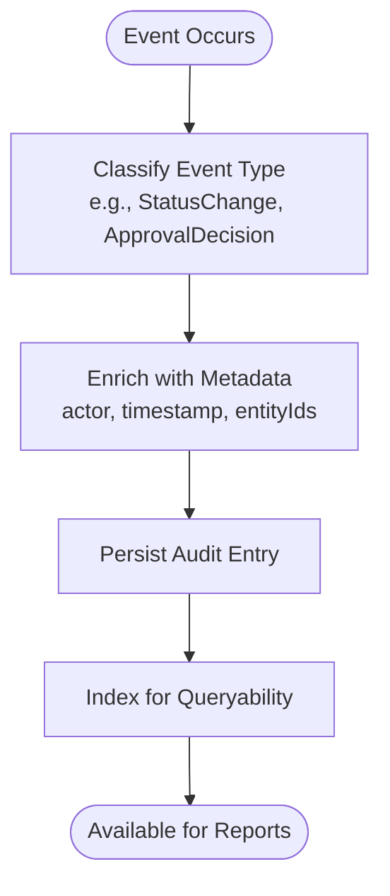

**Diagram sources**
- [src/database-add-audit-log.sql](file://src/database-add-audit-log.sql)

**Section sources**
- [src/database-add-audit-log.sql](file://src/database-add-audit-log.sql)

### Custom Status Workflows
To implement custom status workflows:
- Extend status definitions and transition guards in the invoice logic module.
- Configure approval policies through settings APIs to route new statuses appropriately.
- Update the badge component to render and act on new statuses.
- Ensure audit entries are created for each new transition.

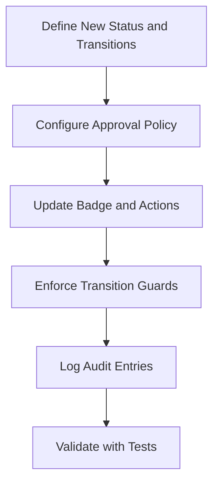

[No sources needed since this diagram shows conceptual workflow, not actual code structure]

### Handling Invoice Revisions
Revisions involve creating a new version while preserving history:
- Duplicate relevant fields into a revision record.
- Maintain linkage to the original invoice.
- Track revision numbers and reasons.
- Allow resubmission and re-approval of revised versions.

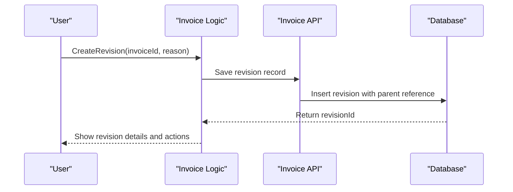

[No sources needed since this diagram shows conceptual workflow, not actual code structure]

### Managing Invoice Cancellations
Cancellations can occur at various stages:
- Before approval: allow cancellation directly.
- After approval but before issue: require confirmation and notify stakeholders.
- After issue: enforce stricter rules and possibly require reversal or credit note.

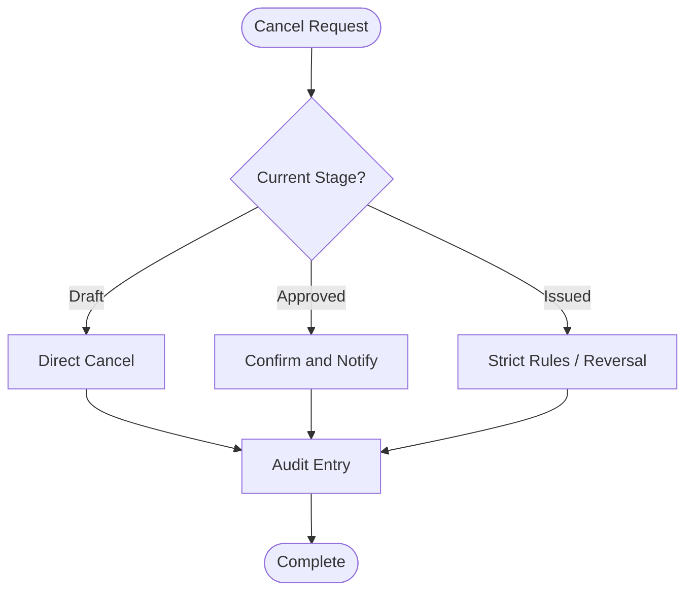

[No sources needed since this diagram shows conceptual workflow, not actual code structure]

### Integration with Project Billing Cycles
Invoices can be linked to projects and purchase orders:
- Use document series and templates to standardize issuance.
- Link invoices to project milestones and POs for traceability.
- Automate status updates based on project billing schedules.

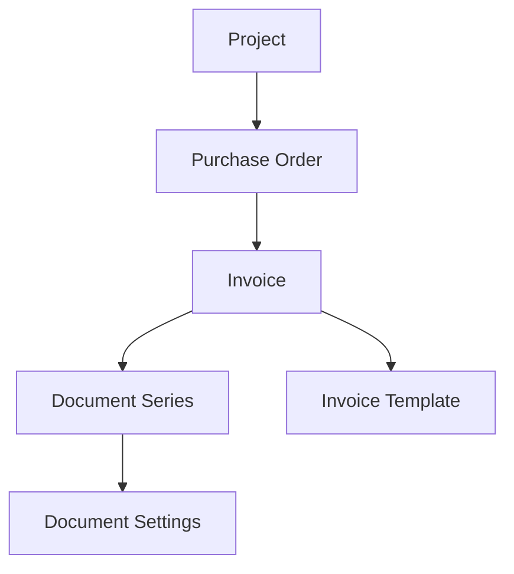

**Diagram sources**
- [src/database-link-project-invoices-to-po.sql](file://src/database-link-project-invoices-to-po.sql)
- [src/database-document-series.sql](file://src/database-document-series.sql)
- [src/database-invoice-template.sql](file://src/database-invoice-template.sql)
- [src/database-document-settings.sql](file://src/database-document-settings.sql)

**Section sources**
- [src/database-link-project-invoices-to-po.sql](file://src/database-link-project-invoices-to-po.sql)
- [src/database-document-series.sql](file://src/database-document-series.sql)
- [src/database-invoice-template.sql](file://src/database-invoice-template.sql)
- [src/database-document-settings.sql](file://src/database-document-settings.sql)

### Automated Status Updates and Notifications
Automated updates rely on:
- Workflow engine evaluating conditions and triggering transitions.
- Notification service sending alerts to users and stakeholders.
- Database constraints ensuring consistency and referential integrity.

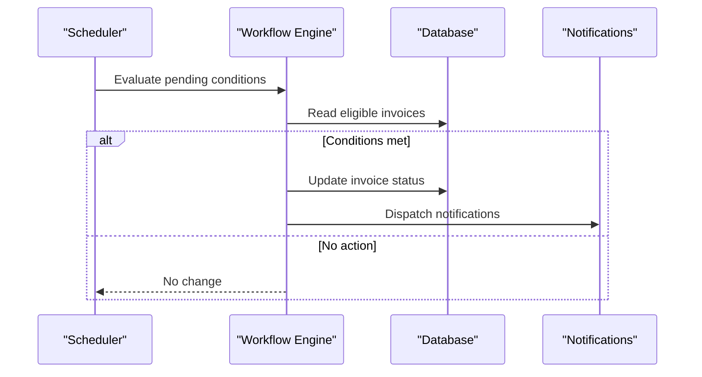

**Diagram sources**
- [src/approvals/workflow-engine.ts](file://src/approvals/workflow-engine.ts)
- [src/approvals/notifications.ts](file://src/approvals/notifications.ts)
- [src/database-approvals.sql](file://src/database-approvals.sql)

**Section sources**
- [src/approvals/workflow-engine.ts](file://src/approvals/workflow-engine.ts)
- [src/approvals/notifications.ts](file://src/approvals/notifications.ts)
- [src/database-approvals.sql](file://src/database-approvals.sql)

## Dependency Analysis
The following diagram highlights core dependencies between invoice and approval modules and their database interactions.

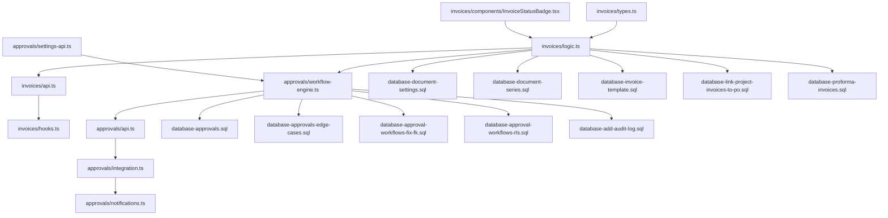

**Diagram sources**
- [src/invoices/types.ts](file://src/invoices/types.ts)
- [src/invoices/logic.ts](file://src/invoices/logic.ts)
- [src/invoices/api.ts](file://src/invoices/api.ts)
- [src/invoices/hooks.ts](file://src/invoices/hooks.ts)
- [src/invoices/components/InvoiceStatusBadge.tsx](file://src/invoices/components/InvoiceStatusBadge.tsx)
- [src/approvals/workflow-engine.ts](file://src/approvals/workflow-engine.ts)
- [src/approvals/api.ts](file://src/approvals/api.ts)
- [src/approvals/integration.ts](file://src/approvals/integration.ts)
- [src/approvals/notifications.ts](file://src/approvals/notifications.ts)
- [src/approvals/settings-api.ts](file://src/approvals/settings-api.ts)
- [src/database-add-audit-log.sql](file://src/database-add-audit-log.sql)
- [src/database-approvals.sql](file://src/database-approvals.sql)
- [src/database-approvals-edge-cases.sql](file://src/database-approvals-edge-cases.sql)
- [src/database-approval-workflows-fix-fk.sql](file://src/database-approval-workflows-fix-fk.sql)
- [src/database-approval-workflows-rls.sql](file://src/database-approval-workflows-rls.sql)
- [src/database-document-settings.sql](file://src/database-document-settings.sql)
- [src/database-document-series.sql](file://src/database-document-series.sql)
- [src/database-invoice-template.sql](file://src/database-invoice-template.sql)
- [src/database-link-project-invoices-to-po.sql](file://src/database-link-project-invoices-to-po.sql)
- [src/database-proforma-invoices.sql](file://src/database-proforma-invoices.sql)

**Section sources**
- [src/invoices/types.ts](file://src/invoices/types.ts)
- [src/invoices/logic.ts](file://src/invoices/logic.ts)
- [src/invoices/api.ts](file://src/invoices/api.ts)
- [src/invoices/hooks.ts](file://src/invoices/hooks.ts)
- [src/invoices/components/InvoiceStatusBadge.tsx](file://src/invoices/components/InvoiceStatusBadge.tsx)
- [src/approvals/workflow-engine.ts](file://src/approvals/workflow-engine.ts)
- [src/approvals/api.ts](file://src/approvals/api.ts)
- [src/approvals/integration.ts](file://src/approvals/integration.ts)
- [src/approvals/notifications.ts](file://src/approvals/notifications.ts)
- [src/approvals/settings-api.ts](file://src/approvals/settings-api.ts)
- [src/database-add-audit-log.sql](file://src/database-add-audit-log.sql)
- [src/database-approvals.sql](file://src/database-approvals.sql)
- [src/database-approvals-edge-cases.sql](file://src/database-approvals-edge-cases.sql)
- [src/database-approval-workflows-fix-fk.sql](file://src/database-approval-workflows-fix-fk.sql)
- [src/database-approval-workflows-rls.sql](file://src/database-approval-workflows-rls.sql)
- [src/database-document-settings.sql](file://src/database-document-settings.sql)
- [src/database-document-series.sql](file://src/database-document-series.sql)
- [src/database-invoice-template.sql](file://src/database-invoice-template.sql)
- [src/database-link-project-invoices-to-po.sql](file://src/database-link-project-invoices-to-po.sql)
- [src/database-proforma-invoices.sql](file://src/database-proforma-invoices.sql)

## Performance Considerations
- Minimize re-renders by memoizing status computations and badge rendering.
- Batch approval updates to reduce database writes during bulk actions.
- Use indexes on frequently queried fields (invoiceId, status, createdAt) to improve list performance.
- Avoid heavy computations in UI; delegate to hooks and background tasks where possible.

[No sources needed since this section provides general guidance]

## Troubleshooting Guide
Common issues and resolutions:
- Invalid transitions: verify guard functions and permission checks in invoice logic.
- Approval stuck: check workflow engine logs and database constraints for missing steps or RLS policies.
- Missing notifications: confirm integration configuration and notification service connectivity.
- Audit gaps: ensure audit logging is enabled and persisted for all critical actions.

**Section sources**
- [src/invoices/logic.ts](file://src/invoices/logic.ts)
- [src/approvals/workflow-engine.ts](file://src/approvals/workflow-engine.ts)
- [src/approvals/integration.ts](file://src/approvals/integration.ts)
- [src/database-approval-workflows-rls.sql](file://src/database-approval-workflows-rls.sql)
- [src/database-add-audit-log.sql](file://src/database-add-audit-log.sql)

## Conclusion
The invoice workflow system combines robust state management, configurable approvals, comprehensive auditing, and clear UI indicators. By adhering to defined transitions and leveraging the approval engine, organizations can maintain control, transparency, and compliance throughout the invoice lifecycle. Extensibility points allow customization for unique business requirements while preserving consistency and reliability.

[No sources needed since this section summarizes without analyzing specific files]

## Appendices

### Example: Creating an Invoice from a Project
The project invoice creation flow integrates with document series and templates, linking the invoice to the originating project and PO.

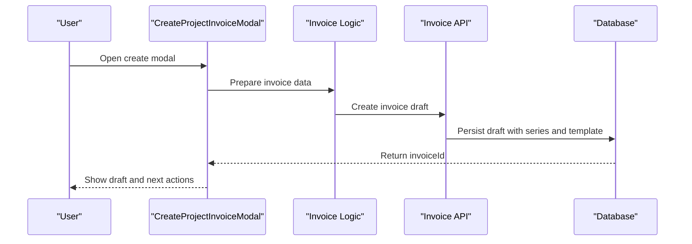

**Diagram sources**
- [src/pages/CreateProjectInvoiceModal.tsx](file://src/pages/CreateProjectInvoiceModal.tsx)
- [src/invoices/logic.ts](file://src/invoices/logic.ts)
- [src/invoices/api.ts](file://src/invoices/api.ts)
- [src/database-document-series.sql](file://src/database-document-series.sql)
- [src/database-invoice-template.sql](file://src/database-invoice-template.sql)
- [src/database-link-project-invoices-to-po.sql](file://src/database-link-project-invoices-to-po.sql)

**Section sources**
- [src/pages/CreateProjectInvoiceModal.tsx](file://src/pages/CreateProjectInvoiceModal.tsx)
- [src/features/invoices/index.ts](file://src/features/invoices/index.ts)
- [src/database-document-series.sql](file://src/database-document-series.sql)
- [src/database-invoice-template.sql](file://src/database-invoice-template.sql)
- [src/database-link-project-invoices-to-po.sql](file://src/database-link-project-invoices-to-po.sql)