# Invoicing System

<cite>
**Referenced Files in This Document**
- [src/invoices/types.ts](file://src/invoices/types.ts)
- [src/invoices/schemas.ts](file://src/invoices/schemas.ts)
- [src/invoices/logic.ts](file://src/invoices/logic.ts)
- [src/invoices/api.ts](file://src/invoices/api.ts)
- [src/invoices/hooks.ts](file://src/invoices/hooks.ts)
- [src/invoices/components/CreateInvoiceModal.tsx](file://src/invoices/components/CreateInvoiceModal.tsx)
- [src/invoices/components/InvoiceItemSelector.tsx](file://src/invoices/components/InvoiceItemSelector.tsx)
- [src/invoices/components/InvoiceSummary.tsx](file://src/invoices/components/InvoiceSummary.tsx)
- [src/invoices/pdf-document.tsx](file://src/invoices/pdf-document.tsx)
- [src/invoices/pdf.tsx](file://src/invoices/pdf.tsx)
- [src/invoices/grid-minimal-invoice-document.tsx](file://src/invoices/grid-minimal-invoice-document.tsx)
- [src/invoices/pro-grid-invoice-document.tsx](file://src/invoices/pro-grid-invoice-document.tsx)
- [src/invoices/ui-utils.ts](file://src/invoices/ui-utils.ts)
- [src/invoices/utils/index.ts](file://src/invoices/utils/index.ts)
- [src/invoices/stock-deduction/index.ts](file://src/invoices/stock-deduction/index.ts)
- [src/features/invoices/index.ts](file://src/features/invoices/index.ts)
- [src/pages/CreateQuotationV2/CreateQuotationPage.tsx](file://src/pages/CreateQuotationV2/CreateQuotationPage.tsx)
- [src/lib/quotation-workflow.ts](file://src/lib/quotation-workflow.ts)
- [src/material-intents/api.ts](file://src/material-intents/api.ts)
- [src/material-usage/api.ts](file://src/material-usage/api.ts)
- [src/hooks/useProjectTransactions.ts](file://src/hooks/useProjectTransactions.ts)
- [src/hooks/useApprovals.ts](file://src/hooks/useApprovals.ts)
- [src/approvals/workflow-engine.ts](file://src/approvals/workflow-engine.ts)
- [src/approvals/integration.ts](file://src/approvals/integration.ts)
- [src/approvals/settings-api.ts](file://src/approvals/settings-api.ts)
- [src/database-add-hsn-tax.sql](file://src/database-add-hsn-tax.sql)
- [src/database-quotation-conversions.sql](file://src/database-quotation-conversions.sql)
- [src/database-link-project-invoices-to-po.sql](file://src/database-link-project-invoices-to-po.sql)
- [src/database-material-intents-enhancement.sql](file://src/database-material-intents-enhancement.sql)
</cite>

## Table of Contents
1. [Introduction](#introduction)
2. [Project Structure](#project-structure)
3. [Core Components](#core-components)
4. [Architecture Overview](#architecture-overview)
5. [Detailed Component Analysis](#detailed-component-analysis)
6. [Dependency Analysis](#dependency-analysis)
7. [Performance Considerations](#performance-considerations)
8. [Troubleshooting Guide](#troubleshooting-guide)
9. [Conclusion](#conclusion)
10. [Appendices](#appendices)

## Introduction
This document explains the Invoicing System with a focus on:
- Invoice creation workflow (item selection, pricing calculations, tax handling)
- Status management, payment tracking, and reconciliation
- PDF generation with customizable templates and branding
- Converting quotations to invoices, partial payments, and invoice revisions
- Integration with material consumption tracking, project billing, and automated reminders
- Approval workflows for validation and multi-level authorization

The content is derived from the repository’s invoice module, related utilities, approvals integration, and database migrations that enable these capabilities.

## Project Structure
The invoicing feature is implemented under src/invoices with supporting pages, hooks, and integrations across the app. Key areas include:
- Domain types and schemas for invoices
- Business logic for calculations and validations
- API layer for persistence and operations
- UI components for creating invoices and selecting items
- PDF rendering and template variants
- Integrations with quotations, materials, projects, and approvals

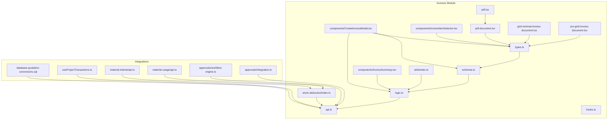

**Diagram sources**
- [src/invoices/types.ts](file://src/invoices/types.ts)
- [src/invoices/schemas.ts](file://src/invoices/schemas.ts)
- [src/invoices/logic.ts](file://src/invoices/logic.ts)
- [src/invoices/api.ts](file://src/invoices/api.ts)
- [src/invoices/components/CreateInvoiceModal.tsx](file://src/invoices/components/CreateInvoiceModal.tsx)
- [src/invoices/components/InvoiceItemSelector.tsx](file://src/invoices/components/InvoiceItemSelector.tsx)
- [src/invoices/components/InvoiceSummary.tsx](file://src/invoices/components/InvoiceSummary.tsx)
- [src/invoices/pdf-document.tsx](file://src/invoices/pdf-document.tsx)
- [src/invoices/pdf.tsx](file://src/invoices/pdf.tsx)
- [src/invoices/grid-minimal-invoice-document.tsx](file://src/invoices/grid-minimal-invoice-document.tsx)
- [src/invoices/pro-grid-invoice-document.tsx](file://src/invoices/pro-grid-invoice-document.tsx)
- [src/invoices/utils/index.ts](file://src/invoices/utils/index.ts)
- [src/invoices/stock-deduction/index.ts](file://src/invoices/stock-deduction/index.ts)
- [src/database-quotation-conversions.sql](file://src/database-quotation-conversions.sql)
- [src/hooks/useProjectTransactions.ts](file://src/hooks/useProjectTransactions.ts)
- [src/material-intents/api.ts](file://src/material-intents/api.ts)
- [src/material-usage/api.ts](file://src/material-usage/api.ts)
- [src/approvals/workflow-engine.ts](file://src/approvals/workflow-engine.ts)
- [src/approvals/integration.ts](file://src/approvals/integration.ts)

**Section sources**
- [src/invoices/types.ts](file://src/invoices/types.ts)
- [src/invoices/schemas.ts](file://src/invoices/schemas.ts)
- [src/invoices/logic.ts](file://src/invoices/logic.ts)
- [src/invoices/api.ts](file://src/invoices/api.ts)
- [src/invoices/hooks.ts](file://src/invoices/hooks.ts)
- [src/invoices/components/CreateInvoiceModal.tsx](file://src/invoices/components/CreateInvoiceModal.tsx)
- [src/invoices/components/InvoiceItemSelector.tsx](file://src/invoices/components/InvoiceItemSelector.tsx)
- [src/invoices/components/InvoiceSummary.tsx](file://src/invoices/components/InvoiceSummary.tsx)
- [src/invoices/pdf-document.tsx](file://src/invoices/pdf-document.tsx)
- [src/invoices/pdf.tsx](file://src/invoices/pdf.tsx)
- [src/invoices/grid-minimal-invoice-document.tsx](file://src/invoices/grid-minimal-invoice-document.tsx)
- [src/invoices/pro-grid-invoice-document.tsx](file://src/invoices/pro-grid-invoice-document.tsx)
- [src/invoices/ui-utils.ts](file://src/invoices/ui-utils.ts)
- [src/invoices/utils/index.ts](file://src/invoices/utils/index.ts)
- [src/invoices/stock-deduction/index.ts](file://src/invoices/stock-deduction/index.ts)
- [src/features/invoices/index.ts](file://src/features/invoices/index.ts)
- [src/pages/CreateQuotationV2/CreateQuotationPage.tsx](file://src/pages/CreateQuotationV2/CreateQuotationPage.tsx)
- [src/lib/quotation-workflow.ts](file://src/lib/quotation-workflow.ts)
- [src/material-intents/api.ts](file://src/material-intents/api.ts)
- [src/material-usage/api.ts](file://src/material-usage/api.ts)
- [src/hooks/useProjectTransactions.ts](file://src/hooks/useProjectTransactions.ts)
- [src/hooks/useApprovals.ts](file://src/hooks/useApprovals.ts)
- [src/approvals/workflow-engine.ts](file://src/approvals/workflow-engine.ts)
- [src/approvals/integration.ts](file://src/approvals/integration.ts)
- [src/database-add-hsn-tax.sql](file://src/database-add-hsn-tax.sql)
- [src/database-quotation-conversions.sql](file://src/database-quotation-conversions.sql)
- [src/database-link-project-invoices-to-po.sql](file://src/database-link-project-invoices-to-po.sql)
- [src/database-material-intents-enhancement.sql](file://src/database-material-intents-enhancement.sql)

## Core Components
- Domain model and validation
  - Types define invoice entities, line items, totals, taxes, and statuses.
  - Schemas enforce input constraints and normalization before business logic runs.
- Business logic
  - Pricing computations, discount application, tax calculation, and totals aggregation are centralized.
  - Utilities support formatting, rounding, and currency handling.
- API layer
  - Endpoints or RPCs create/update invoices, record payments, manage status transitions, and trigger side effects (e.g., stock deduction).
- UI components
  - CreateInvoiceModal orchestrates the creation flow.
  - InvoiceItemSelector enables item selection and quantity entry.
  - InvoiceSummary displays computed totals and tax breakdowns.
- PDF generation
  - pdf-document defines the invoice layout; pdf.tsx renders it.
  - grid-minimal-invoice-document and pro-grid-invoice-document provide alternative layouts.
- Integrations
  - Quotation conversion uses dedicated SQL migrations and workflow helpers.
  - Material intents and usage APIs integrate with stock deduction.
  - Project transactions link invoices to projects.
  - Approvals engine integrates for validation and multi-level authorization.

**Section sources**
- [src/invoices/types.ts](file://src/invoices/types.ts)
- [src/invoices/schemas.ts](file://src/invoices/schemas.ts)
- [src/invoices/logic.ts](file://src/invoices/logic.ts)
- [src/invoices/utils/index.ts](file://src/invoices/utils/index.ts)
- [src/invoices/api.ts](file://src/invoices/api.ts)
- [src/invoices/components/CreateInvoiceModal.tsx](file://src/invoices/components/CreateInvoiceModal.tsx)
- [src/invoices/components/InvoiceItemSelector.tsx](file://src/invoices/components/InvoiceItemSelector.tsx)
- [src/invoices/components/InvoiceSummary.tsx](file://src/invoices/components/InvoiceSummary.tsx)
- [src/invoices/pdf-document.tsx](file://src/invoices/pdf-document.tsx)
- [src/invoices/pdf.tsx](file://src/invoices/pdf.tsx)
- [src/invoices/grid-minimal-invoice-document.tsx](file://src/invoices/grid-minimal-invoice-document.tsx)
- [src/invoices/pro-grid-invoice-document.tsx](file://src/invoices/pro-grid-invoice-document.tsx)
- [src/invoices/stock-deduction/index.ts](file://src/invoices/stock-deduction/index.ts)
- [src/material-intents/api.ts](file://src/material-intents/api.ts)
- [src/material-usage/api.ts](file://src/material-usage/api.ts)
- [src/hooks/useProjectTransactions.ts](file://src/hooks/useProjectTransactions.ts)
- [src/approvals/workflow-engine.ts](file://src/approvals/workflow-engine.ts)
- [src/approvals/integration.ts](file://src/approvals/integration.ts)

## Architecture Overview
The system follows a layered architecture:
- Presentation layer: React components orchestrate user interactions.
- Domain layer: Types, schemas, and logic encapsulate rules and calculations.
- Integration layer: API calls persist data and coordinate cross-module actions.
- Rendering layer: PDF documents generate printable outputs.
- Cross-cutting concerns: Approvals, project billing, and material consumption are integrated via dedicated modules.

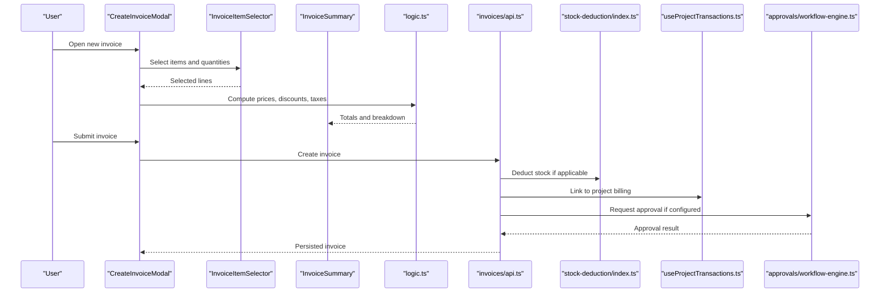

**Diagram sources**
- [src/invoices/components/CreateInvoiceModal.tsx](file://src/invoices/components/CreateInvoiceModal.tsx)
- [src/invoices/components/InvoiceItemSelector.tsx](file://src/invoices/components/InvoiceItemSelector.tsx)
- [src/invoices/components/InvoiceSummary.tsx](file://src/invoices/components/InvoiceSummary.tsx)
- [src/invoices/logic.ts](file://src/invoices/logic.ts)
- [src/invoices/api.ts](file://src/invoices/api.ts)
- [src/invoices/stock-deduction/index.ts](file://src/invoices/stock-deduction/index.ts)
- [src/hooks/useProjectTransactions.ts](file://src/hooks/useProjectTransactions.ts)
- [src/approvals/workflow-engine.ts](file://src/approvals/workflow-engine.ts)

## Detailed Component Analysis

### Invoice Creation Workflow
- Item selection
  - Users add items via InvoiceItemSelector, which validates quantities and maps to domain types.
- Pricing and tax computation
  - logic.ts applies unit prices, discounts, and tax rates to compute line totals and invoice totals.
  - Tax schema and HSN/SAC fields are supported by database additions.
- Submission and side effects
  - api.ts persists the invoice and triggers stock deduction and project billing linkage.
  - If enabled, approval requests are created through the approvals engine.

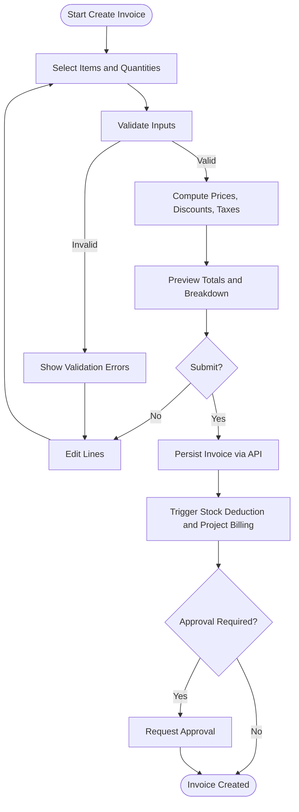

**Diagram sources**
- [src/invoices/components/InvoiceItemSelector.tsx](file://src/invoices/components/InvoiceItemSelector.tsx)
- [src/invoices/logic.ts](file://src/invoices/logic.ts)
- [src/invoices/api.ts](file://src/invoices/api.ts)
- [src/invoices/stock-deduction/index.ts](file://src/invoices/stock-deduction/index.ts)
- [src/hooks/useProjectTransactions.ts](file://src/hooks/useProjectTransactions.ts)
- [src/approvals/workflow-engine.ts](file://src/approvals/workflow-engine.ts)
- [src/database-add-hsn-tax.sql](file://src/database-add-hsn-tax.sql)

**Section sources**
- [src/invoices/components/InvoiceItemSelector.tsx](file://src/invoices/components/InvoiceItemSelector.tsx)
- [src/invoices/logic.ts](file://src/invoices/logic.ts)
- [src/invoices/api.ts](file://src/invoices/api.ts)
- [src/invoices/stock-deduction/index.ts](file://src/invoices/stock-deduction/index.ts)
- [src/hooks/useProjectTransactions.ts](file://src/hooks/useProjectTransactions.ts)
- [src/approvals/workflow-engine.ts](file://src/approvals/workflow-engine.ts)
- [src/database-add-hsn-tax.sql](file://src/database-add-hsn-tax.sql)

### Status Management, Payment Tracking, and Reconciliation
- Status lifecycle
  - Invoices transition through states such as Draft, Submitted, Approved, Issued, Partially Paid, Fully Paid, and Cancelled.
- Payments
  - Payments are recorded against invoices, updating outstanding balances and status.
- Reconciliation
  - Reconciliation aligns payments with invoice amounts and tracks discrepancies.

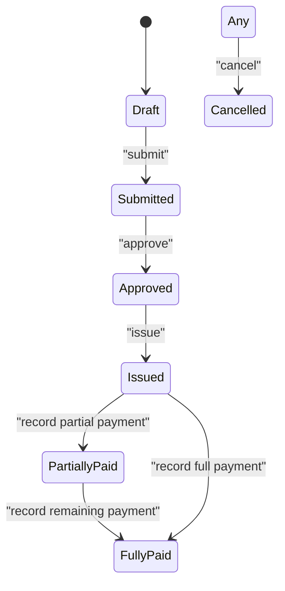

[No diagram sources since this diagram shows conceptual state transitions without mapping to specific files]

**Section sources**
- [src/invoices/types.ts](file://src/invoices/types.ts)
- [src/invoices/schemas.ts](file://src/invoices/schemas.ts)
- [src/invoices/api.ts](file://src/invoices/api.ts)

### PDF Generation and Customization
- Templates
  - pdf-document.tsx defines the core invoice layout.
  - grid-minimal-invoice-document.tsx and pro-grid-invoice-document.tsx provide alternative designs.
- Rendering
  - pdf.tsx orchestrates rendering using the selected template.
- Branding
  - Template variants allow customization of headers, footers, and styling.

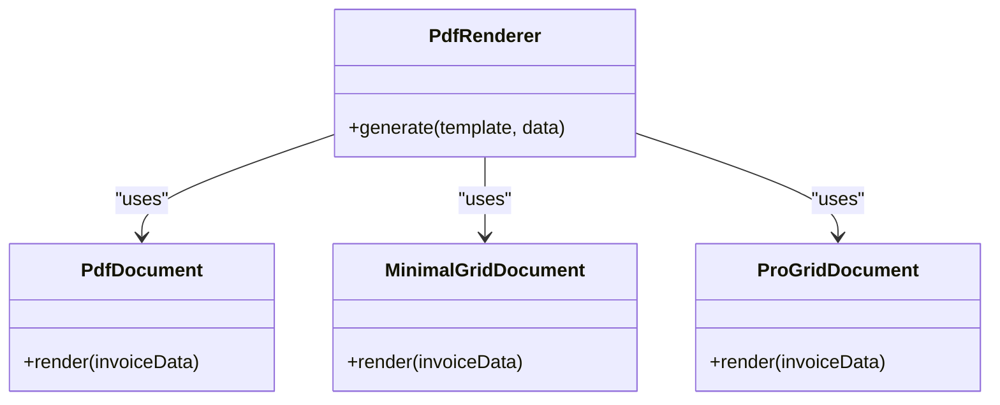

**Diagram sources**
- [src/invoices/pdf-document.tsx](file://src/invoices/pdf-document.tsx)
- [src/invoices/grid-minimal-invoice-document.tsx](file://src/invoices/grid-minimal-invoice-document.tsx)
- [src/invoices/pro-grid-invoice-document.tsx](file://src/invoices/pro-grid-invoice-document.tsx)
- [src/invoices/pdf.tsx](file://src/invoices/pdf.tsx)

**Section sources**
- [src/invoices/pdf-document.tsx](file://src/invoices/pdf-document.tsx)
- [src/invoices/pdf.tsx](file://src/invoices/pdf.tsx)
- [src/invoices/grid-minimal-invoice-document.tsx](file://src/invoices/grid-minimal-invoice-document.tsx)
- [src/invoices/pro-grid-invoice-document.tsx](file://src/invoices/pro-grid-invoice-document.tsx)

### Creating Invoices from Quotations
- Conversion path
  - The quotation module provides conversion flows and database mappings to transform quotes into invoices.
- Data mapping
  - Line items, pricing, and client details are mapped from quotations to invoices.
- Workflow integration
  - Quotation workflow helpers ensure consistent transitions and auditability.

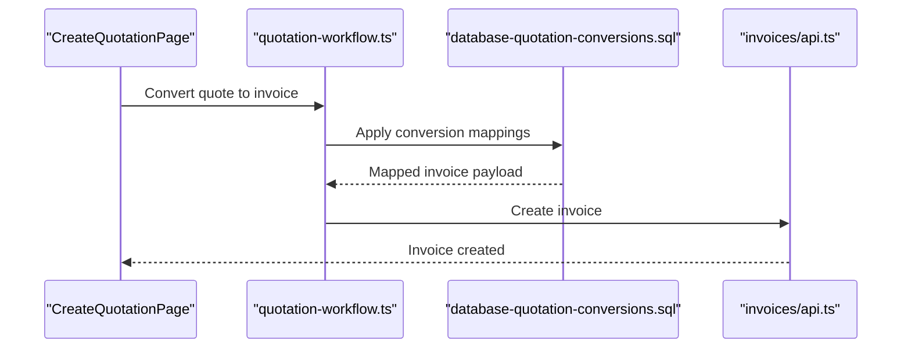

**Diagram sources**
- [src/pages/CreateQuotationV2/CreateQuotationPage.tsx](file://src/pages/CreateQuotationV2/CreateQuotationPage.tsx)
- [src/lib/quotation-workflow.ts](file://src/lib/quotation-workflow.ts)
- [src/database-quotation-conversions.sql](file://src/database-quotation-conversions.sql)
- [src/invoices/api.ts](file://src/invoices/api.ts)

**Section sources**
- [src/pages/CreateQuotationV2/CreateQuotationPage.tsx](file://src/pages/CreateQuotationV2/CreateQuotationPage.tsx)
- [src/lib/quotation-workflow.ts](file://src/lib/quotation-workflow.ts)
- [src/database-quotation-conversions.sql](file://src/database-quotation-conversions.sql)
- [src/invoices/api.ts](file://src/invoices/api.ts)

### Managing Partial Payments and Revisions
- Partial payments
  - Record multiple payments until the outstanding balance reaches zero.
- Revisions
  - Maintain versioning or amendment records when modifying issued invoices.
- Balance updates
  - Each payment updates totals and status accordingly.

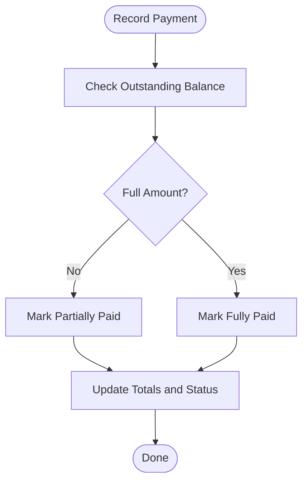

[No diagram sources since this diagram shows conceptual workflow, not actual code structure]

**Section sources**
- [src/invoices/types.ts](file://src/invoices/types.ts)
- [src/invoices/api.ts](file://src/invoices/api.ts)

### Integration with Material Consumption Tracking
- Material intents
  - Intent-based reservations can be consumed during invoice creation or fulfillment.
- Usage tracking
  - Actual usage entries reconcile with intended consumption.
- Stock deduction
  - On invoice issuance, stock deductions are applied based on line items.

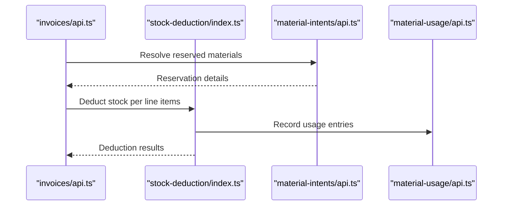

**Diagram sources**
- [src/invoices/api.ts](file://src/invoices/api.ts)
- [src/invoices/stock-deduction/index.ts](file://src/invoices/stock-deduction/index.ts)
- [src/material-intents/api.ts](file://src/material-intents/api.ts)
- [src/material-usage/api.ts](file://src/material-usage/api.ts)
- [src/database-material-intents-enhancement.sql](file://src/database-material-intents-enhancement.sql)

**Section sources**
- [src/invoices/api.ts](file://src/invoices/api.ts)
- [src/invoices/stock-deduction/index.ts](file://src/invoices/stock-deduction/index.ts)
- [src/material-intents/api.ts](file://src/material-intents/api.ts)
- [src/material-usage/api.ts](file://src/material-usage/api.ts)
- [src/database-material-intents-enhancement.sql](file://src/database-material-intents-enhancement.sql)

### Project Billing Integration
- Linking invoices to projects
  - Invoices are associated with projects for consolidated billing and reporting.
- Transaction tracking
  - useProjectTransactions aggregates project-related financial events.

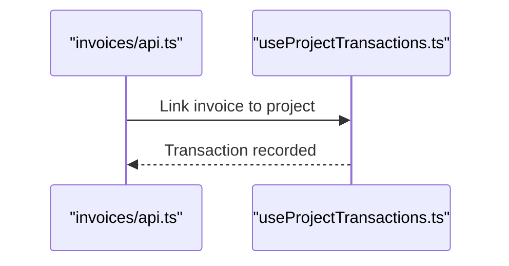

**Diagram sources**
- [src/invoices/api.ts](file://src/invoices/api.ts)
- [src/hooks/useProjectTransactions.ts](file://src/hooks/useProjectTransactions.ts)
- [src/database-link-project-invoices-to-po.sql](file://src/database-link-project-invoices-to-po.sql)

**Section sources**
- [src/invoices/api.ts](file://src/invoices/api.ts)
- [src/hooks/useProjectTransactions.ts](file://src/hooks/useProjectTransactions.ts)
- [src/database-link-project-invoices-to-po.sql](file://src/database-link-project-invoices-to-po.sql)

### Automated Payment Reminders
- Reminder triggers
  - Based on due dates and outstanding balances, reminders can be scheduled.
- Notification channels
  - Email or in-app notifications can be used to alert clients.

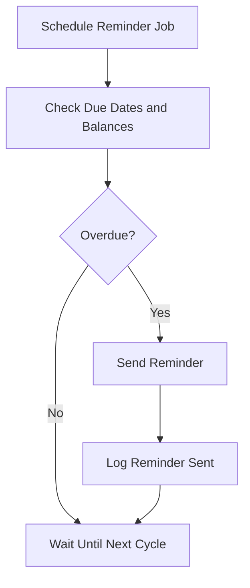

[No diagram sources since this diagram shows conceptual workflow, not actual code structure]

**Section sources**
- [src/invoices/types.ts](file://src/invoices/types.ts)
- [src/invoices/api.ts](file://src/invoices/api.ts)

### Approval Workflows for Validation and Multi-Level Authorization
- Workflow engine
  - Centralized engine manages approval steps, roles, and conditions.
- Settings and integration
  - Settings API configures approval policies; integration hooks connect approvals to invoice lifecycle.

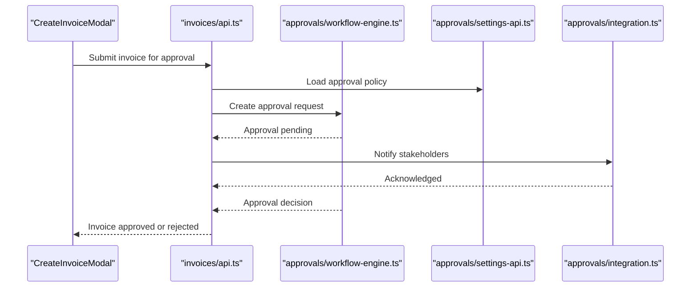

**Diagram sources**
- [src/invoices/components/CreateInvoiceModal.tsx](file://src/invoices/components/CreateInvoiceModal.tsx)
- [src/invoices/api.ts](file://src/invoices/api.ts)
- [src/approvals/workflow-engine.ts](file://src/approvals/workflow-engine.ts)
- [src/approvals/settings-api.ts](file://src/approvals/settings-api.ts)
- [src/approvals/integration.ts](file://src/approvals/integration.ts)

**Section sources**
- [src/invoices/components/CreateInvoiceModal.tsx](file://src/invoices/components/CreateInvoiceModal.tsx)
- [src/invoices/api.ts](file://src/invoices/api.ts)
- [src/approvals/workflow-engine.ts](file://src/approvals/workflow-engine.ts)
- [src/approvals/settings-api.ts](file://src/approvals/settings-api.ts)
- [src/approvals/integration.ts](file://src/approvals/integration.ts)

## Dependency Analysis
Key dependencies and relationships:
- Invoices depend on types and schemas for validation.
- Logic depends on utils for formatting and rounding.
- API coordinates stock deduction, project transactions, and approvals.
- PDF rendering depends on template documents.
- Database migrations provide schema support for conversions, tax fields, and project links.

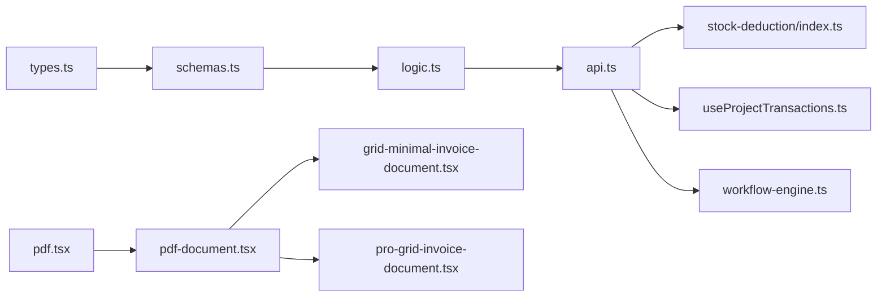

**Diagram sources**
- [src/invoices/types.ts](file://src/invoices/types.ts)
- [src/invoices/schemas.ts](file://src/invoices/schemas.ts)
- [src/invoices/logic.ts](file://src/invoices/logic.ts)
- [src/invoices/api.ts](file://src/invoices/api.ts)
- [src/invoices/stock-deduction/index.ts](file://src/invoices/stock-deduction/index.ts)
- [src/hooks/useProjectTransactions.ts](file://src/hooks/useProjectTransactions.ts)
- [src/approvals/workflow-engine.ts](file://src/approvals/workflow-engine.ts)
- [src/invoices/pdf.tsx](file://src/invoices/pdf.tsx)
- [src/invoices/pdf-document.tsx](file://src/invoices/pdf-document.tsx)
- [src/invoices/grid-minimal-invoice-document.tsx](file://src/invoices/grid-minimal-invoice-document.tsx)
- [src/invoices/pro-grid-invoice-document.tsx](file://src/invoices/pro-grid-invoice-document.tsx)

**Section sources**
- [src/invoices/types.ts](file://src/invoices/types.ts)
- [src/invoices/schemas.ts](file://src/invoices/schemas.ts)
- [src/invoices/logic.ts](file://src/invoices/logic.ts)
- [src/invoices/api.ts](file://src/invoices/api.ts)
- [src/invoices/stock-deduction/index.ts](file://src/invoices/stock-deduction/index.ts)
- [src/hooks/useProjectTransactions.ts](file://src/hooks/useProjectTransactions.ts)
- [src/approvals/workflow-engine.ts](file://src/approvals/workflow-engine.ts)
- [src/invoices/pdf.tsx](file://src/invoices/pdf.tsx)
- [src/invoices/pdf-document.tsx](file://src/invoices/pdf-document.tsx)
- [src/invoices/grid-minimal-invoice-document.tsx](file://src/invoices/grid-minimal-invoice-document.tsx)
- [src/invoices/pro-grid-invoice-document.tsx](file://src/invoices/pro-grid-invoice-document.tsx)

## Performance Considerations
- Batch operations
  - When creating invoices with many line items, batch computations and API calls to reduce round trips.
- Caching
  - Cache frequently accessed reference data (items, tax rates) to speed up item selection and pricing.
- Rendering optimization
  - Use minimal templates for large datasets; defer heavy rendering until necessary.
- Indexing
  - Ensure database indexes support frequent queries on invoice status, project links, and due dates.

[No sources needed since this section provides general guidance]

## Troubleshooting Guide
Common issues and resolutions:
- Validation errors during creation
  - Review schema constraints and ensure required fields are present.
- Incorrect totals or tax calculations
  - Verify tax rates and discount settings; check rounding behavior in utils.
- Stock deduction failures
  - Confirm inventory availability and reservation integrity; inspect material intent and usage logs.
- Approval bottlenecks
  - Check approval settings and workflow configuration; verify notification delivery.

**Section sources**
- [src/invoices/schemas.ts](file://src/invoices/schemas.ts)
- [src/invoices/logic.ts](file://src/invoices/logic.ts)
- [src/invoices/utils/index.ts](file://src/invoices/utils/index.ts)
- [src/invoices/stock-deduction/index.ts](file://src/invoices/stock-deduction/index.ts)
- [src/approvals/settings-api.ts](file://src/approvals/settings-api.ts)
- [src/approvals/integration.ts](file://src/approvals/integration.ts)

## Conclusion
The Invoicing System provides a robust foundation for creating invoices, managing payments, generating PDFs, and integrating with quotations, materials, projects, and approvals. Its modular design supports customization and scalability while maintaining clear separation of concerns across presentation, domain, integration, and rendering layers.

[No sources needed since this section summarizes without analyzing specific files]

## Appendices
- Example scenarios
  - Create an invoice from a quotation: follow the conversion sequence and ensure mappings are applied.
  - Manage partial payments: record payments incrementally and monitor status transitions.
  - Handle revisions: maintain versioned records and update outstanding balances accordingly.
  - Configure approvals: set policies via settings API and validate multi-level authorization flows.

[No sources needed since this section provides general guidance]