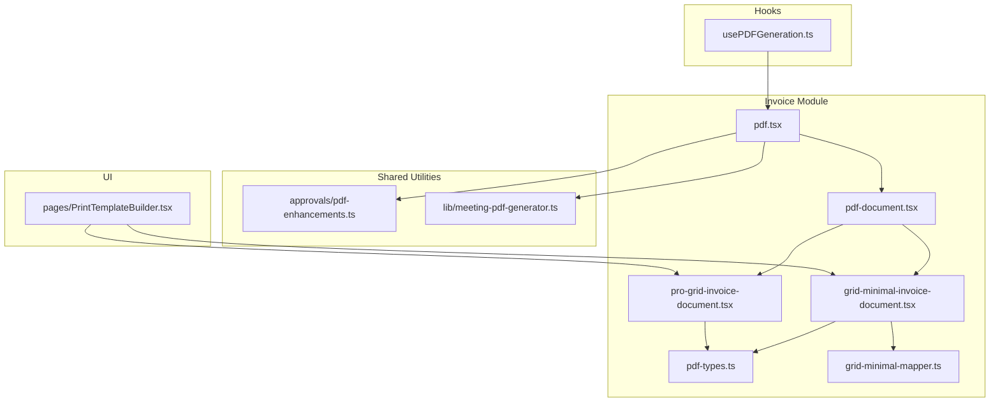
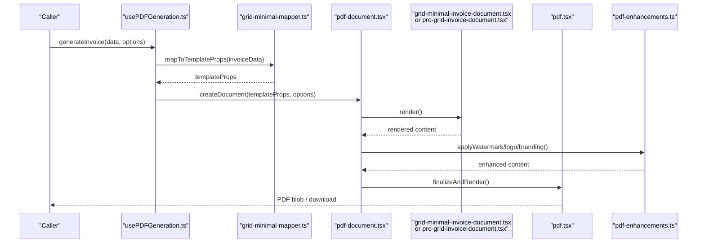
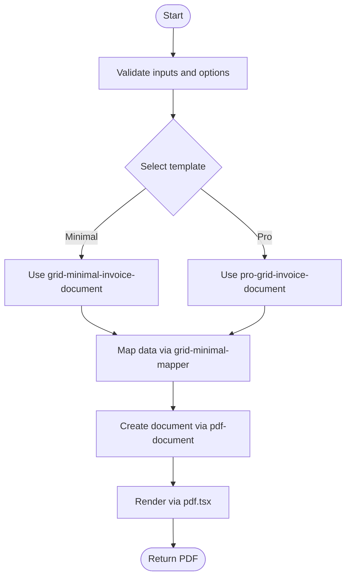
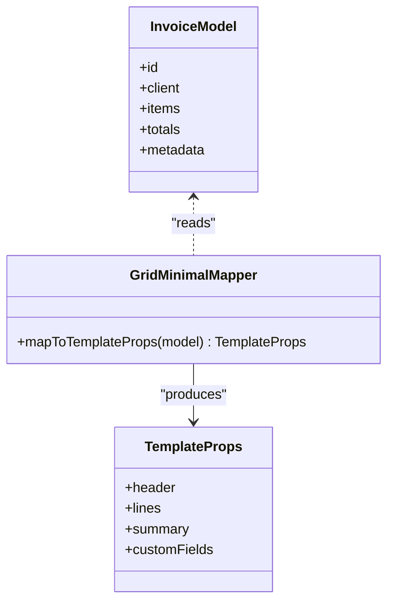
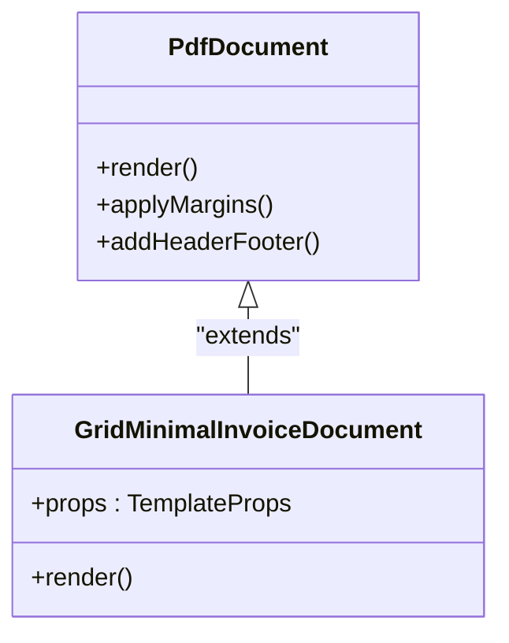
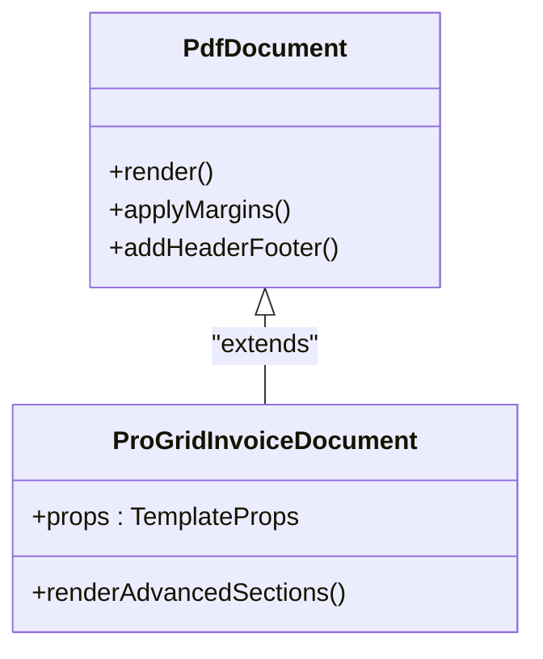
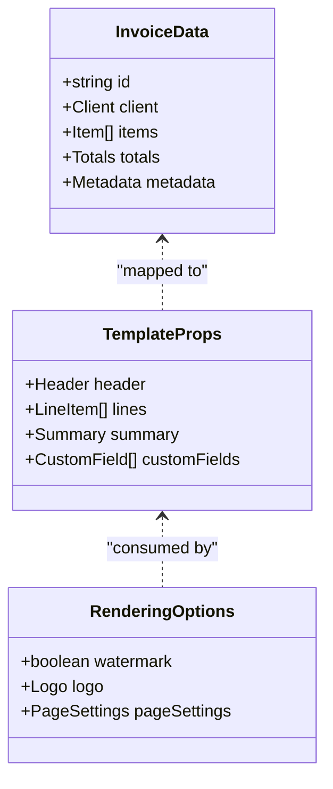
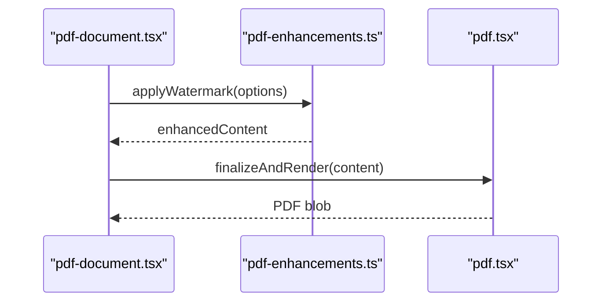
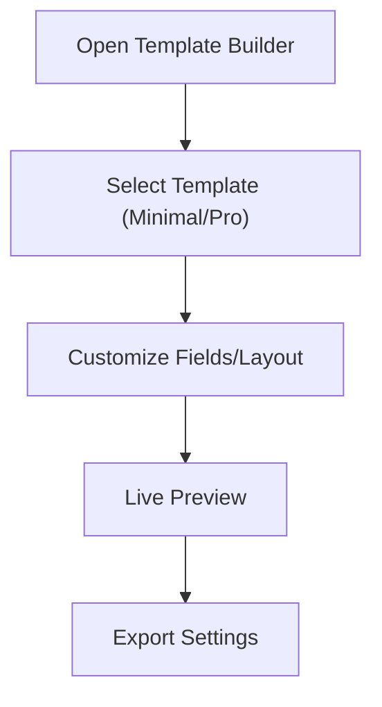
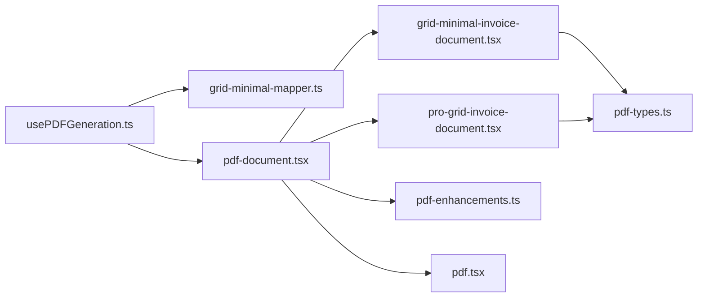

# PDF Generation & Templates

<cite>
**Referenced Files in This Document**
- [src/invoices/grid-minimal-invoice-document.tsx](file://src/invoices/grid-minimal-invoice-document.tsx)
- [src/invoices/pro-grid-invoice-document.tsx](file://src/invoices/pro-grid-invoice-document.tsx)
- [src/invoices/pdf.tsx](file://src/invoices/pdf.tsx)
- [src/invoices/pdf-document.tsx](file://src/invoices/pdf-document.tsx)
- [src/invoices/pdf-types.ts](file://src/invoices/pdf-types.ts)
- [src/invoices/grid-minimal-mapper.ts](file://src/invoices/grid-minimal-mapper.ts)
- [src/hooks/usePDFGeneration.ts](file://src/hooks/usePDFGeneration.ts)
- [src/approvals/pdf-enhancements.ts](file://src/approvals/pdf-enhancements.ts)
- [src/lib/meeting-pdf-generator.ts](file://src/lib/meeting-pdf-generator.ts)
- [src/pages/PrintTemplateBuilder.tsx](file://src/pages/PrintTemplateBuilder.tsx)
</cite>

## Table of Contents
1. [Introduction](#introduction)
2. [Project Structure](#project-structure)
3. [Core Components](#core-components)
4. [Architecture Overview](#architecture-overview)
5. [Detailed Component Analysis](#detailed-component-analysis)
6. [Dependency Analysis](#dependency-analysis)
7. [Performance Considerations](#performance-considerations)
8. [Troubleshooting Guide](#troubleshooting-guide)
9. [Conclusion](#conclusion)
10. [Appendices](#appendices)

## Introduction
This document explains the invoice PDF generation and template system, focusing on how templates are selected, data is bound, and rendering occurs to produce final PDFs. It covers:
- The standard grid-based invoice layout (grid-minimal-invoice-document)
- The advanced formatting layout (pro-grid-invoice-document)
- Template selection and data binding flows
- Customization capabilities such as branding, logo insertion, custom fields, and layout modifications
- Examples for generating invoices in different formats, adding watermarks, and implementing multi-page invoices
- Performance optimization strategies for large invoices and browser compatibility considerations

## Project Structure
The PDF generation pipeline spans a few key areas:
- Invoice-specific PDF components and types
- A hook that orchestrates PDF generation
- Shared utilities for approvals and other reports
- A template builder page for visual customization

**Diagram sources**
- [src/invoices/pdf.tsx](file://src/invoices/pdf.tsx)
- [src/invoices/pdf-document.tsx](file://src/invoices/pdf-document.tsx)
- [src/invoices/grid-minimal-invoice-document.tsx](file://src/invoices/grid-minimal-invoice-document.tsx)
- [src/invoices/pro-grid-invoice-document.tsx](file://src/invoices/pro-grid-invoice-document.tsx)
- [src/invoices/pdf-types.ts](file://src/invoices/pdf-types.ts)
- [src/invoices/grid-minimal-mapper.ts](file://src/invoices/grid-minimal-mapper.ts)
- [src/hooks/usePDFGeneration.ts](file://src/hooks/usePDFGeneration.ts)
- [src/approvals/pdf-enhancements.ts](file://src/approvals/pdf-enhancements.ts)
- [src/lib/meeting-pdf-generator.ts](file://src/lib/meeting-pdf-generator.ts)
- [src/pages/PrintTemplateBuilder.tsx](file://src/pages/PrintTemplateBuilder.tsx)

**Section sources**
- [src/invoices/pdf.tsx](file://src/invoices/pdf.tsx)
- [src/invoices/pdf-document.tsx](file://src/invoices/pdf-document.tsx)
- [src/invoices/grid-minimal-invoice-document.tsx](file://src/invoices/grid-minimal-invoice-document.tsx)
- [src/invoices/pro-grid-invoice-document.tsx](file://src/invoices/pro-grid-invoice-document.tsx)
- [src/invoices/pdf-types.ts](file://src/invoices/pdf-types.ts)
- [src/invoices/grid-minimal-mapper.ts](file://src/invoices/grid-minimal-mapper.ts)
- [src/hooks/usePDFGeneration.ts](file://src/hooks/usePDFGeneration.ts)
- [src/approvals/pdf-enhancements.ts](file://src/approvals/pdf-enhancements.ts)
- [src/lib/meeting-pdf-generator.ts](file://src/lib/meeting-pdf-generator.ts)
- [src/pages/PrintTemplateBuilder.tsx](file://src/pages/PrintTemplateBuilder.tsx)

## Core Components
- pdf.tsx: Entry point for invoice PDF generation; coordinates data preparation, template selection, and rendering.
- pdf-document.tsx: Base document wrapper handling page setup, margins, headers/footers, and shared layout concerns.
- grid-minimal-invoice-document.tsx: Standard invoice layout with a minimal grid structure suitable for most use cases.
- pro-grid-invoice-document.tsx: Advanced invoice layout offering richer formatting options and additional sections.
- pdf-types.ts: Shared type definitions for invoice data, template props, and rendering configuration.
- grid-minimal-mapper.ts: Maps domain invoice data into the shape expected by the minimal template.
- usePDFGeneration.ts: Hook that encapsulates the full generation workflow, including template selection and rendering orchestration.
- pdf-enhancements.ts: Utility functions for common PDF enhancements (e.g., watermarks, stamps).
- meeting-pdf-generator.ts: Example of another report generator using similar patterns; useful for cross-referencing approaches.
- PrintTemplateBuilder.tsx: UI for building and previewing print/PDF templates, enabling non-code customization.

Key responsibilities:
- Template selection based on user or system settings
- Data binding from application models to template props
- Rendering via a PDF engine (browser-based or server-side depending on environment)
- Applying enhancements like watermarks and branding assets

**Section sources**
- [src/invoices/pdf.tsx](file://src/invoices/pdf.tsx)
- [src/invoices/pdf-document.tsx](file://src/invoices/pdf-document.tsx)
- [src/invoices/grid-minimal-invoice-document.tsx](file://src/invoices/grid-minimal-invoice-document.tsx)
- [src/invoices/pro-grid-invoice-document.tsx](file://src/invoices/pro-grid-invoice-document.tsx)
- [src/invoices/pdf-types.ts](file://src/invoices/pdf-types.ts)
- [src/invoices/grid-minimal-mapper.ts](file://src/invoices/grid-minimal-mapper.ts)
- [src/hooks/usePDFGeneration.ts](file://src/hooks/usePDFGeneration.ts)
- [src/approvals/pdf-enhancements.ts](file://src/approvals/pdf-enhancements.ts)
- [src/lib/meeting-pdf-generator.ts](file://src/lib/meeting-pdf-generator.ts)
- [src/pages/PrintTemplateBuilder.tsx](file://src/pages/PrintTemplateBuilder.tsx)

## Architecture Overview
The invoice PDF generation follows a layered architecture:
- Orchestration layer: usePDFGeneration.ts drives the process
- Preparation layer: data mapping and normalization (grid-minimal-mapper.ts)
- Template layer: layout components (minimal vs pro)
- Rendering layer: pdf.tsx and pdf-document.tsx coordinate output

**Diagram sources**
- [src/hooks/usePDFGeneration.ts](file://src/hooks/usePDFGeneration.ts)
- [src/invoices/grid-minimal-mapper.ts](file://src/invoices/grid-minimal-mapper.ts)
- [src/invoices/pdf-document.tsx](file://src/invoices/pdf-document.tsx)
- [src/invoices/grid-minimal-invoice-document.tsx](file://src/invoices/grid-minimal-invoice-document.tsx)
- [src/invoices/pro-grid-invoice-document.tsx](file://src/invoices/pro-grid-invoice-document.tsx)
- [src/invoices/pdf.tsx](file://src/invoices/pdf.tsx)
- [src/approvals/pdf-enhancements.ts](file://src/approvals/pdf-enhancements.ts)

## Detailed Component Analysis

### Invoice PDF Orchestration (usePDFGeneration.ts)
Responsibilities:
- Accepts invoice data and generation options
- Selects appropriate template (minimal vs pro) based on settings
- Normalizes data via mapper
- Invokes document creation and rendering
- Handles errors and returns a PDF result

**Diagram sources**
- [src/hooks/usePDFGeneration.ts](file://src/hooks/usePDFGeneration.ts)
- [src/invoices/grid-minimal-invoice-document.tsx](file://src/invoices/grid-minimal-invoice-document.tsx)
- [src/invoices/pro-grid-invoice-document.tsx](file://src/invoices/pro-grid-invoice-document.tsx)
- [src/invoices/grid-minimal-mapper.ts](file://src/invoices/grid-minimal-mapper.ts)
- [src/invoices/pdf-document.tsx](file://src/invoices/pdf-document.tsx)
- [src/invoices/pdf.tsx](file://src/invoices/pdf.tsx)

**Section sources**
- [src/hooks/usePDFGeneration.ts](file://src/hooks/usePDFGeneration.ts)

### Data Mapping (grid-minimal-mapper.ts)
Responsibilities:
- Transforms raw invoice model into template-friendly props
- Ensures consistent field names and units
- Applies default values and formatting hints

**Diagram sources**
- [src/invoices/grid-minimal-mapper.ts](file://src/invoices/grid-minimal-mapper.ts)

**Section sources**
- [src/invoices/grid-minimal-mapper.ts](file://src/invoices/grid-minimal-mapper.ts)

### Minimal Invoice Layout (grid-minimal-invoice-document.tsx)
Responsibilities:
- Renders a clean, grid-based invoice layout
- Displays header, line items, totals, and notes
- Supports basic customization via props

**Diagram sources**
- [src/invoices/pdf-document.tsx](file://src/invoices/pdf-document.tsx)
- [src/invoices/grid-minimal-invoice-document.tsx](file://src/invoices/grid-minimal-invoice-document.tsx)

**Section sources**
- [src/invoices/grid-minimal-invoice-document.tsx](file://src/invoices/grid-minimal-invoice-document.tsx)
- [src/invoices/pdf-document.tsx](file://src/invoices/pdf-document.tsx)

### Pro Invoice Layout (pro-grid-invoice-document.tsx)
Responsibilities:
- Provides advanced formatting options
- Adds extra sections (e.g., payment terms, tax breakdowns, signatures)
- Enables richer styling and layout control

**Diagram sources**
- [src/invoices/pdf-document.tsx](file://src/invoices/pdf-document.tsx)
- [src/invoices/pro-grid-invoice-document.tsx](file://src/invoices/pro-grid-invoice-document.tsx)

**Section sources**
- [src/invoices/pro-grid-invoice-document.tsx](file://src/invoices/pro-grid-invoice-document.tsx)
- [src/invoices/pdf-document.tsx](file://src/invoices/pdf-document.tsx)

### Types and Contracts (pdf-types.ts)
Responsibilities:
- Defines shared interfaces for invoice data and template props
- Ensures consistency across mappers and templates

**Diagram sources**
- [src/invoices/pdf-types.ts](file://src/invoices/pdf-types.ts)

**Section sources**
- [src/invoices/pdf-types.ts](file://src/invoices/pdf-types.ts)

### Rendering Coordination (pdf.tsx)
Responsibilities:
- Finalizes document content
- Integrates enhancements (watermarks, logos)
- Produces the final PDF output

**Diagram sources**
- [src/invoices/pdf.tsx](file://src/invoices/pdf.tsx)
- [src/approvals/pdf-enhancements.ts](file://src/approvals/pdf-enhancements.ts)
- [src/invoices/pdf-document.tsx](file://src/invoices/pdf-document.tsx)

**Section sources**
- [src/invoices/pdf.tsx](file://src/invoices/pdf.tsx)
- [src/approvals/pdf-enhancements.ts](file://src/approvals/pdf-enhancements.ts)

### Template Builder UI (PrintTemplateBuilder.tsx)
Responsibilities:
- Visual editor for selecting and previewing templates
- Allows non-developers to adjust layouts and fields
- Integrates with minimal and pro templates for live previews

**Diagram sources**
- [src/pages/PrintTemplateBuilder.tsx](file://src/pages/PrintTemplateBuilder.tsx)
- [src/invoices/grid-minimal-invoice-document.tsx](file://src/invoices/grid-minimal-invoice-document.tsx)
- [src/invoices/pro-grid-invoice-document.tsx](file://src/invoices/pro-grid-invoice-document.tsx)

**Section sources**
- [src/pages/PrintTemplateBuilder.tsx](file://src/pages/PrintTemplateBuilder.tsx)

## Dependency Analysis
The following diagram shows how components depend on each other during invoice PDF generation:

**Diagram sources**
- [src/hooks/usePDFGeneration.ts](file://src/hooks/usePDFGeneration.ts)
- [src/invoices/grid-minimal-mapper.ts](file://src/invoices/grid-minimal-mapper.ts)
- [src/invoices/pdf-document.tsx](file://src/invoices/pdf-document.tsx)
- [src/invoices/grid-minimal-invoice-document.tsx](file://src/invoices/grid-minimal-invoice-document.tsx)
- [src/invoices/pro-grid-invoice-document.tsx](file://src/invoices/pro-grid-invoice-document.tsx)
- [src/invoices/pdf-types.ts](file://src/invoices/pdf-types.ts)
- [src/approvals/pdf-enhancements.ts](file://src/approvals/pdf-enhancements.ts)
- [src/invoices/pdf.tsx](file://src/invoices/pdf.tsx)

**Section sources**
- [src/hooks/usePDFGeneration.ts](file://src/hooks/usePDFGeneration.ts)
- [src/invoices/grid-minimal-mapper.ts](file://src/invoices/grid-minimal-mapper.ts)
- [src/invoices/pdf-document.tsx](file://src/invoices/pdf-document.tsx)
- [src/invoices/grid-minimal-invoice-document.tsx](file://src/invoices/grid-minimal-invoice-document.tsx)
- [src/invoices/pro-grid-invoice-document.tsx](file://src/invoices/pro-grid-invoice-document.tsx)
- [src/invoices/pdf-types.ts](file://src/invoices/pdf-types.ts)
- [src/approvals/pdf-enhancements.ts](file://src/approvals/pdf-enhancements.ts)
- [src/invoices/pdf.tsx](file://src/invoices/pdf.tsx)

## Performance Considerations
- Minimize re-renders: memoize template props and avoid unnecessary recomputation in mappers.
- Lazy load heavy assets: defer loading of high-resolution logos and fonts until needed.
- Stream large documents: paginate long item lists and split across pages to reduce memory pressure.
- Optimize images: compress and resize logos and attachments before embedding.
- Batch operations: group multiple PDF generations to reuse shared resources when possible.
- Browser compatibility: ensure CSS features used in templates are supported by the target PDF engine; prefer widely supported properties.

[No sources needed since this section provides general guidance]

## Troubleshooting Guide
Common issues and resolutions:
- Missing fields in template: verify mapping in grid-minimal-mapper.ts and ensure required keys exist in invoice data.
- Watermark not appearing: check pdf-enhancements.ts for correct asset paths and opacity settings.
- Multi-page truncation: confirm page break rules in templates and adjust margins/padding in pdf-document.tsx.
- Large invoice performance: implement pagination and lazy loading; consider splitting into multiple PDFs.
- Browser differences: test across browsers and adjust CSS fallbacks; avoid unsupported features.

**Section sources**
- [src/invoices/grid-minimal-mapper.ts](file://src/invoices/grid-minimal-mapper.ts)
- [src/approvals/pdf-enhancements.ts](file://src/approvals/pdf-enhancements.ts)
- [src/invoices/pdf-document.tsx](file://src/invoices/pdf-document.tsx)

## Conclusion
The invoice PDF generation system combines a clear separation of concerns—orchestration, mapping, templating, and rendering—to deliver flexible and customizable outputs. The minimal template serves everyday needs, while the pro template supports advanced formatting. With robust data binding, enhancement utilities, and a visual template builder, teams can tailor invoices efficiently. Following the performance and compatibility recommendations ensures reliable generation even for large documents.

[No sources needed since this section summarizes without analyzing specific files]

## Appendices

### Examples and Recipes

- Generate an invoice in minimal format:
  - Use the orchestration hook to select the minimal template and pass mapped props.
  - Reference: [src/hooks/usePDFGeneration.ts](file://src/hooks/usePDFGeneration.ts), [src/invoices/grid-minimal-invoice-document.tsx](file://src/invoices/grid-minimal-invoice-document.tsx)

- Generate an invoice in pro format:
  - Choose the pro template via options and supply extended fields.
  - Reference: [src/hooks/usePDFGeneration.ts](file://src/hooks/usePDFGeneration.ts), [src/invoices/pro-grid-invoice-document.tsx](file://src/invoices/pro-grid-invoice-document.tsx)

- Add company branding and logo:
  - Configure logo and brand colors in rendering options; apply via enhancements.
  - Reference: [src/approvals/pdf-enhancements.ts](file://src/approvals/pdf-enhancements.ts), [src/invoices/pdf.tsx](file://src/invoices/pdf.tsx)

- Insert custom fields:
  - Extend template props with custom fields and render them in the chosen template.
  - Reference: [src/invoices/pdf-types.ts](file://src/invoices/pdf-types.ts), [src/invoices/grid-minimal-invoice-document.tsx](file://src/invoices/grid-minimal-invoice-document.tsx)

- Modify layout:
  - Adjust margins, headers, footers, and grid columns in the base document and templates.
  - Reference: [src/invoices/pdf-document.tsx](file://src/invoices/pdf-document.tsx)

- Add watermarks:
  - Enable watermark option and configure image/opacity through enhancements.
  - Reference: [src/approvals/pdf-enhancements.ts](file://src/approvals/pdf-enhancements.ts)

- Implement multi-page invoices:
  - Ensure page breaks are handled in templates; paginate long item lists.
  - Reference: [src/invoices/grid-minimal-invoice-document.tsx](file://src/invoices/grid-minimal-invoice-document.tsx), [src/invoices/pro-grid-invoice-document.tsx](file://src/invoices/pro-grid-invoice-document.tsx)

- Cross-reference another generator:
  - Review meeting-pdf-generator.ts for patterns applicable to invoices.
  - Reference: [src/lib/meeting-pdf-generator.ts](file://src/lib/meeting-pdf-generator.ts)