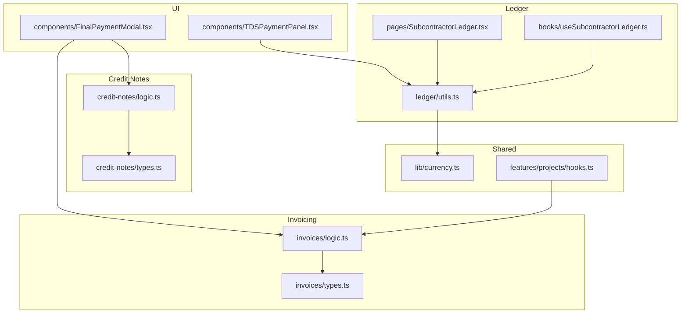
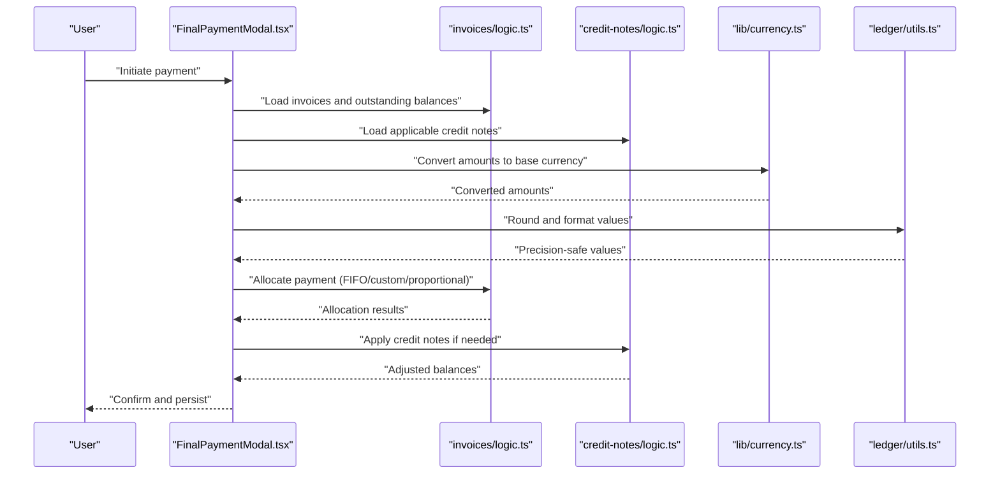
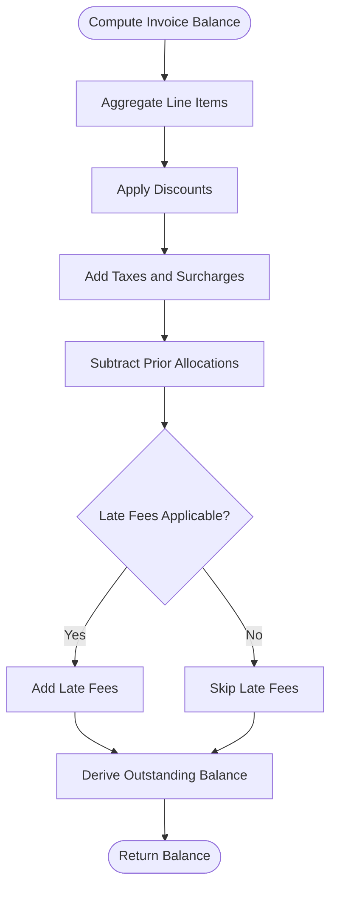
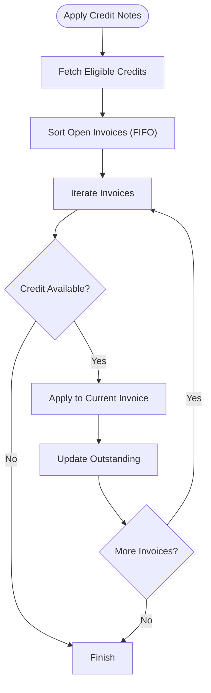
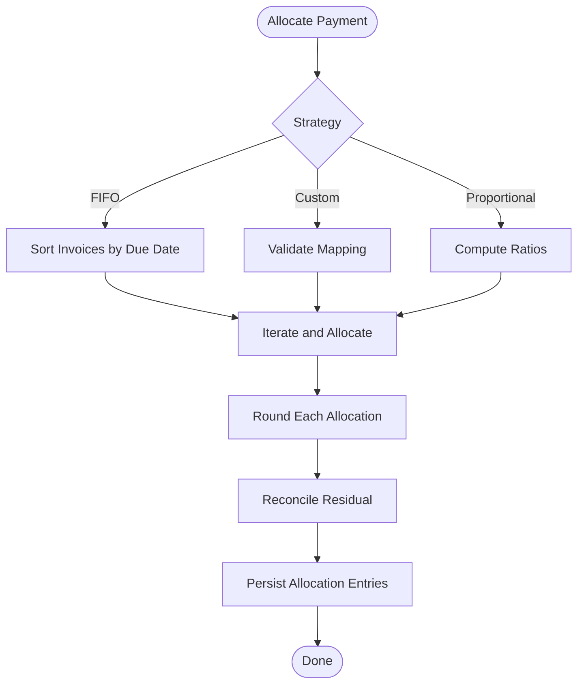
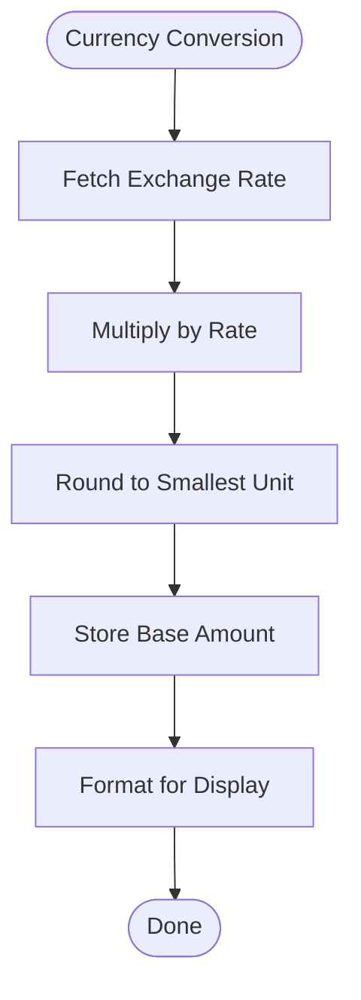
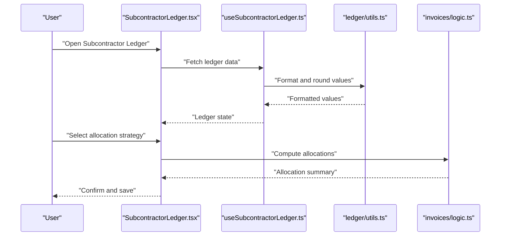
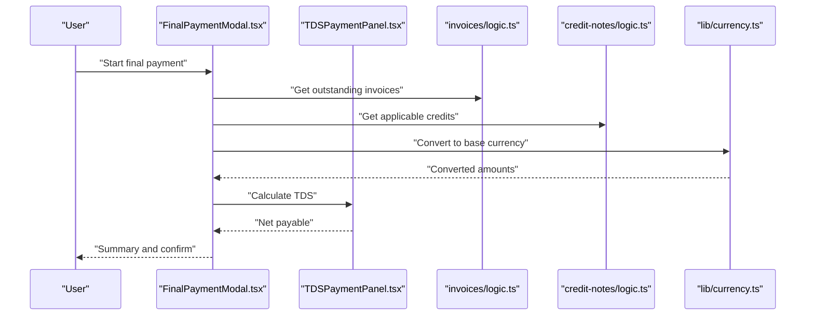
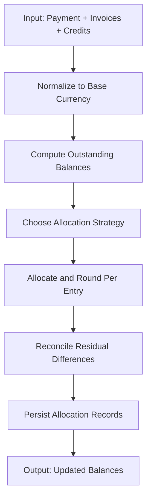
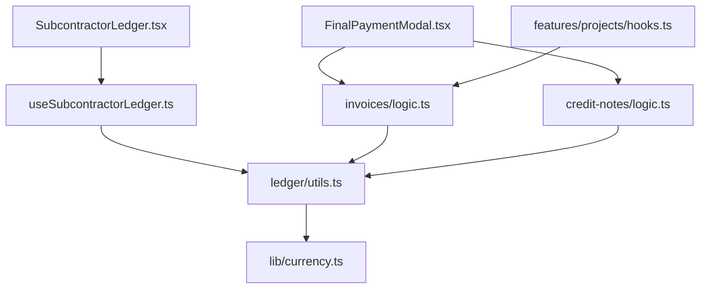

# Payment Calculations & Balance Management

<cite>
**Referenced Files in This Document**
- [src/invoices/logic.ts](file://src/invoices/logic.ts)
- [src/credit-notes/logic.ts](file://src/credit-notes/logic.ts)
- [src/lib/currency.ts](file://src/lib/currency.ts)
- [src/invoices/types.ts](file://src/invoices/types.ts)
- [src/credit-notes/types.ts](file://src/credit-notes/types.ts)
- [src/ledger/utils.ts](file://src/ledger/utils.ts)
- [src/pages/SubcontractorLedger.tsx](file://src/pages/SubcontractorLedger.tsx)
- [src/components/FinalPaymentModal.tsx](file://src/components/FinalPaymentModal.tsx)
- [src/components/TDSPaymentPanel.tsx](file://src/components/TDSPaymentPanel.tsx)
- [src/hooks/useSubcontractorLedger.ts](file://src/hooks/useSubcontractorLedger.ts)
- [src/features/projects/hooks.ts](file://src/features/projects/hooks.ts)
</cite>

## Table of Contents
1. [Introduction](#introduction)
2. [Project Structure](#project-structure)
3. [Core Components](#core-components)
4. [Architecture Overview](#architecture-overview)
5. [Detailed Component Analysis](#detailed-component-analysis)
6. [Dependency Analysis](#dependency-analysis)
7. [Performance Considerations](#performance-considerations)
8. [Troubleshooting Guide](#troubleshooting-guide)
9. [Conclusion](#conclusion)
10. [Appendices](#appendices)

## Introduction
This document explains the payment calculations and balance management system with a focus on:
- Outstanding balance computation across invoices and credit notes
- Applying payments to specific invoices using FIFO allocation, custom allocation rules, and proportional distribution
- Currency conversion handling for multi-currency environments
- Precision and rounding strategies to ensure financial accuracy
- Complex scenarios including discounts, taxes, late fees, and partial payments

The goal is to provide both conceptual clarity and code-level traceability so that developers and stakeholders can understand how balances are calculated and how payments are allocated deterministically.

## Project Structure
The payment and balance logic spans several modules:
- Invoicing module: invoice totals, outstanding balances, and allocation helpers
- Credit notes module: adjustments that reduce outstanding balances
- Ledger utilities: shared helpers for rounding, currency formatting, and ledger operations
- UI components: user flows for finalizing payments and managing subcontractor ledgers
- Hooks: data fetching and state synchronization for ledger views and project-related payment contexts

**Diagram sources**
- [src/invoices/logic.ts](file://src/invoices/logic.ts)
- [src/credit-notes/logic.ts](file://src/credit-notes/logic.ts)
- [src/lib/currency.ts](file://src/lib/currency.ts)
- [src/invoices/types.ts](file://src/invoices/types.ts)
- [src/credit-notes/types.ts](file://src/credit-notes/types.ts)
- [src/ledger/utils.ts](file://src/ledger/utils.ts)
- [src/pages/SubcontractorLedger.tsx](file://src/pages/SubcontractorLedger.tsx)
- [src/components/FinalPaymentModal.tsx](file://src/components/FinalPaymentModal.tsx)
- [src/components/TDSPaymentPanel.tsx](file://src/components/TDSPaymentPanel.tsx)
- [src/hooks/useSubcontractorLedger.ts](file://src/hooks/useSubcontractorLedger.ts)
- [src/features/projects/hooks.ts](file://src/features/projects/hooks.ts)

**Section sources**
- [src/invoices/logic.ts](file://src/invoices/logic.ts)
- [src/credit-notes/logic.ts](file://src/credit-notes/logic.ts)
- [src/lib/currency.ts](file://src/lib/currency.ts)
- [src/invoices/types.ts](file://src/invoices/types.ts)
- [src/credit-notes/types.ts](file://src/credit-notes/types.ts)
- [src/ledger/utils.ts](file://src/ledger/utils.ts)
- [src/pages/SubcontractorLedger.tsx](file://src/pages/SubcontractorLedger.tsx)
- [src/components/FinalPaymentModal.tsx](file://src/components/FinalPaymentModal.tsx)
- [src/components/TDSPaymentPanel.tsx](file://src/components/TDSPaymentPanel.tsx)
- [src/hooks/useSubcontractorLedger.ts](file://src/hooks/useSubcontractorLedger.ts)
- [src/features/projects/hooks.ts](file://src/features/projects/hooks.ts)

## Core Components
- Invoice balance calculation: Computes per-invoice outstanding amounts by aggregating line items, discounts, taxes, and prior allocations. It exposes functions to compute current outstanding and remaining after proposed allocations.
- Credit note application: Adjusts outstanding balances by applying credit notes against open invoices following defined precedence (e.g., oldest first).
- Payment allocation engine: Supports multiple strategies:
  - FIFO: allocate to earliest due invoices first
  - Custom allocation: explicit mapping of payment portions to specific invoices
  - Proportional distribution: distribute proportionally based on outstanding ratios
- Currency conversion: Converts amounts between currencies using configured rates and applies consistent rounding before storage or display.
- Ledger utilities: Provide rounding helpers, precision guards, and formatting utilities used across invoicing and credit notes.

Key responsibilities:
- Deterministic allocation order and tie-breaking rules
- Consistent rounding at each step to avoid drift
- Clear separation between display values and stored values
- Auditability via immutable allocation records

**Section sources**
- [src/invoices/logic.ts](file://src/invoices/logic.ts)
- [src/credit-notes/logic.ts](file://src/credit-notes/logic.ts)
- [src/ledger/utils.ts](file://src/ledger/utils.ts)
- [src/lib/currency.ts](file://src/lib/currency.ts)

## Architecture Overview
The system composes domain logic (invoicing and credit notes) with shared utilities (currency and ledger helpers) and presents user workflows through UI components and hooks.

**Diagram sources**
- [src/components/FinalPaymentModal.tsx](file://src/components/FinalPaymentModal.tsx)
- [src/invoices/logic.ts](file://src/invoices/logic.ts)
- [src/credit-notes/logic.ts](file://src/credit-notes/logic.ts)
- [src/lib/currency.ts](file://src/lib/currency.ts)
- [src/ledger/utils.ts](file://src/ledger/utils.ts)

## Detailed Component Analysis

### Invoice Balance Calculation
Responsibilities:
- Compute gross amount from line items
- Apply discounts (flat or percentage)
- Add taxes and surcharges
- Subtract prior payments and credit notes
- Derive outstanding balance per invoice

Algorithm highlights:
- Use integer-based cents or fixed-point arithmetic to avoid floating-point drift
- Round intermediate steps consistently (e.g., round tax lines to nearest cent)
- Maintain an allocation history to support re-computation and audit trails

Complex scenario considerations:
- Partial payments: track remaining balance and update allocation entries
- Late fees: add after due date thresholds; ensure they are included in outstanding totals
- Discounts: apply before or after taxes depending on policy; document precedence

**Diagram sources**
- [src/invoices/logic.ts](file://src/invoices/logic.ts)
- [src/ledger/utils.ts](file://src/ledger/utils.ts)

**Section sources**
- [src/invoices/logic.ts](file://src/invoices/logic.ts)
- [src/ledger/utils.ts](file://src/ledger/utils.ts)

### Credit Note Application
Responsibilities:
- Identify eligible credit notes for a given party/project
- Allocate credits to open invoices using FIFO or configurable rules
- Update outstanding balances and record allocation entries

Rules:
- Prefer oldest invoices first unless overridden by custom rules
- Ensure total applied credits do not exceed available credit balance
- Preserve audit trail for each applied credit note

**Diagram sources**
- [src/credit-notes/logic.ts](file://src/credit-notes/logic.ts)
- [src/invoices/logic.ts](file://src/invoices/logic.ts)

**Section sources**
- [src/credit-notes/logic.ts](file://src/credit-notes/logic.ts)
- [src/invoices/logic.ts](file://src/invoices/logic.ts)

### Payment Allocation Engine
Strategies:
- FIFO: allocate to earliest due invoices first; break ties by invoice number or creation date
- Custom allocation: user-specified mapping of payment portions to invoices
- Proportional distribution: distribute based on outstanding ratios while ensuring no over-allocation

Precision and rounding:
- Round each allocation entry to the smallest currency unit
- Reconcile residual differences by adjusting the last allocation to maintain exact totals

**Diagram sources**
- [src/invoices/logic.ts](file://src/invoices/logic.ts)
- [src/ledger/utils.ts](file://src/ledger/utils.ts)

**Section sources**
- [src/invoices/logic.ts](file://src/invoices/logic.ts)
- [src/ledger/utils.ts](file://src/ledger/utils.ts)

### Currency Conversion and Rounding
Responsibilities:
- Convert foreign currency amounts to base currency using configured exchange rates
- Apply consistent rounding rules before persistence and display
- Maintain separate display and stored values when necessary

Guidelines:
- Use integer-based units (cents) internally
- Round conversions to the nearest cent using a deterministic rule (e.g., half-up)
- Avoid repeated rounding by caching converted values where appropriate

**Diagram sources**
- [src/lib/currency.ts](file://src/lib/currency.ts)
- [src/ledger/utils.ts](file://src/ledger/utils.ts)

**Section sources**
- [src/lib/currency.ts](file://src/lib/currency.ts)
- [src/ledger/utils.ts](file://src/ledger/utils.ts)

### Subcontractor Ledger and Final Payments
Responsibilities:
- Present consolidated view of invoices, credit notes, and payments
- Support final settlement workflows with validation and confirmation
- Integrate TDS (tax deduction at source) handling where applicable

User flow:
- Load ledger data
- Review outstanding balances
- Choose allocation strategy
- Confirm and persist allocations

**Diagram sources**
- [src/pages/SubcontractorLedger.tsx](file://src/pages/SubcontractorLedger.tsx)
- [src/hooks/useSubcontractorLedger.ts](file://src/hooks/useSubcontractorLedger.ts)
- [src/ledger/utils.ts](file://src/ledger/utils.ts)
- [src/invoices/logic.ts](file://src/invoices/logic.ts)

**Section sources**
- [src/pages/SubcontractorLedger.tsx](file://src/pages/SubcontractorLedger.tsx)
- [src/hooks/useSubcontractorLedger.ts](file://src/hooks/useSubcontractorLedger.ts)
- [src/ledger/utils.ts](file://src/ledger/utils.ts)
- [src/invoices/logic.ts](file://src/invoices/logic.ts)

### Final Payment Modal and TDS Panel
Responsibilities:
- Finalize payments with validation checks (e.g., cannot overpay)
- Handle TDS deductions and show net payable amounts
- Provide clear summaries before committing allocations

**Diagram sources**
- [src/components/FinalPaymentModal.tsx](file://src/components/FinalPaymentModal.tsx)
- [src/components/TDSPaymentPanel.tsx](file://src/components/TDSPaymentPanel.tsx)
- [src/invoices/logic.ts](file://src/invoices/logic.ts)
- [src/credit-notes/logic.ts](file://src/credit-notes/logic.ts)
- [src/lib/currency.ts](file://src/lib/currency.ts)

**Section sources**
- [src/components/FinalPaymentModal.tsx](file://src/components/FinalPaymentModal.tsx)
- [src/components/TDSPaymentPanel.tsx](file://src/components/TDSPaymentPanel.tsx)
- [src/invoices/logic.ts](file://src/invoices/logic.ts)
- [src/credit-notes/logic.ts](file://src/credit-notes/logic.ts)
- [src/lib/currency.ts](file://src/lib/currency.ts)

### Conceptual Overview
Conceptually, the system ensures:
- Deterministic allocation order and reproducible outcomes
- Accurate rounding and reconciliation to prevent penny drift
- Clear separation between display formatting and stored numeric values
- Extensible allocation strategies with well-defined contracts

[No sources needed since this diagram shows conceptual workflow, not actual code structure]

## Dependency Analysis
The core dependencies form a layered architecture:
- UI layers depend on hooks and domain logic
- Domain logic depends on shared utilities for rounding and currency
- Ledger utilities encapsulate precision and formatting concerns

**Diagram sources**
- [src/components/FinalPaymentModal.tsx](file://src/components/FinalPaymentModal.tsx)
- [src/pages/SubcontractorLedger.tsx](file://src/pages/SubcontractorLedger.tsx)
- [src/hooks/useSubcontractorLedger.ts](file://src/hooks/useSubcontractorLedger.ts)
- [src/invoices/logic.ts](file://src/invoices/logic.ts)
- [src/credit-notes/logic.ts](file://src/credit-notes/logic.ts)
- [src/ledger/utils.ts](file://src/ledger/utils.ts)
- [src/lib/currency.ts](file://src/lib/currency.ts)
- [src/features/projects/hooks.ts](file://src/features/projects/hooks.ts)

**Section sources**
- [src/components/FinalPaymentModal.tsx](file://src/components/FinalPaymentModal.tsx)
- [src/pages/SubcontractorLedger.tsx](file://src/pages/SubcontractorLedger.tsx)
- [src/hooks/useSubcontractorLedger.ts](file://src/hooks/useSubcontractorLedger.ts)
- [src/invoices/logic.ts](file://src/invoices/logic.ts)
- [src/credit-notes/logic.ts](file://src/credit-notes/logic.ts)
- [src/ledger/utils.ts](file://src/ledger/utils.ts)
- [src/lib/currency.ts](file://src/lib/currency.ts)
- [src/features/projects/hooks.ts](file://src/features/projects/hooks.ts)

## Performance Considerations
- Minimize repeated conversions by caching exchange rates and precomputing normalized amounts
- Batch allocation computations to reduce redundant recalculations
- Use efficient sorting and stable ordering for FIFO to handle large invoice sets
- Keep rounding operations localized to utility functions to avoid scattered precision logic

## Troubleshooting Guide
Common issues and resolutions:
- Penny drift: verify rounding rules and ensure residual reconciliation adjusts the last allocation entry
- Over-allocation: validate that sum of allocations does not exceed outstanding balances
- Incorrect currency conversion: check exchange rate timestamps and rounding behavior
- Misapplied credit notes: confirm eligibility criteria and allocation precedence (FIFO vs custom)
- TDS discrepancies: review deduction percentages and net payable calculations

Validation checkpoints:
- Sum of allocated amounts equals payment total
- Outstanding balances reflect all prior allocations and credits
- Displayed values match stored values after rounding

**Section sources**
- [src/ledger/utils.ts](file://src/ledger/utils.ts)
- [src/invoices/logic.ts](file://src/invoices/logic.ts)
- [src/credit-notes/logic.ts](file://src/credit-notes/logic.ts)
- [src/lib/currency.ts](file://src/lib/currency.ts)

## Conclusion
The payment calculations and balance management system emphasizes deterministic allocation, precise rounding, and clear separation of concerns. By leveraging FIFO, custom, and proportional strategies alongside robust currency conversion and ledger utilities, it delivers accurate and auditable financial outcomes. The modular design supports extensibility and maintains consistency across UI flows and backend computations.

## Appendices

### Data Models and Types
- Invoice types define line items, discounts, taxes, and outstanding fields
- Credit note types capture adjustment amounts and applicability
- Ledger utilities expose rounding and formatting helpers

**Section sources**
- [src/invoices/types.ts](file://src/invoices/types.ts)
- [src/credit-notes/types.ts](file://src/credit-notes/types.ts)
- [src/ledger/utils.ts](file://src/ledger/utils.ts)