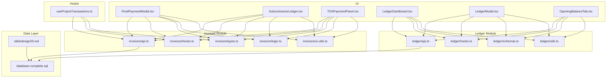
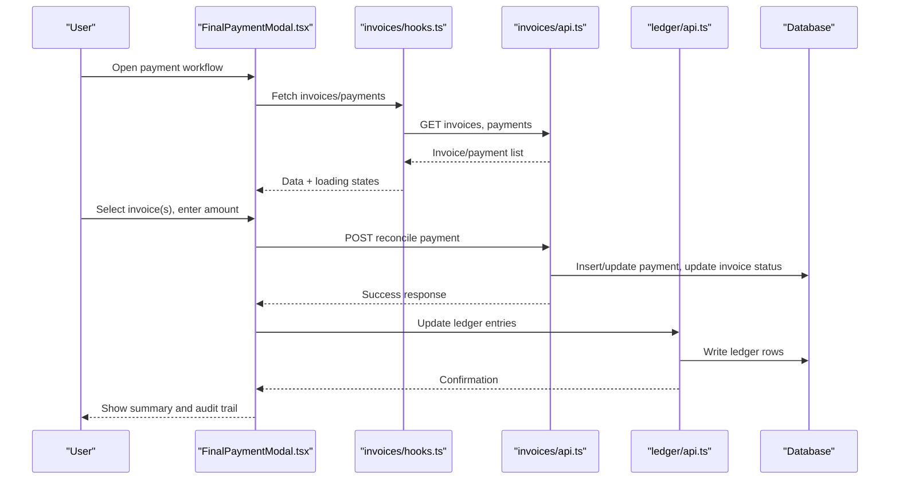
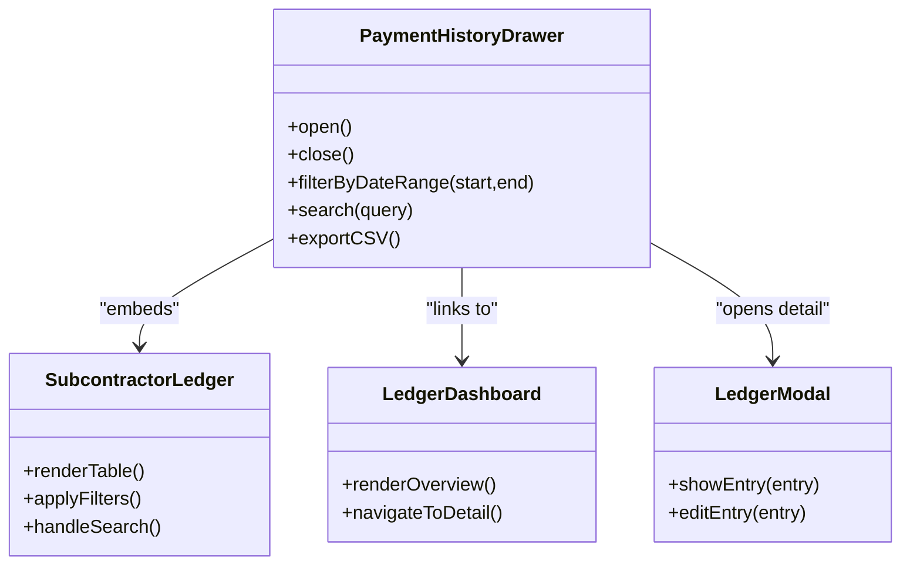
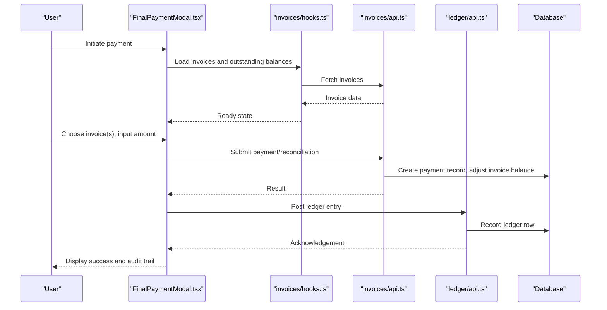
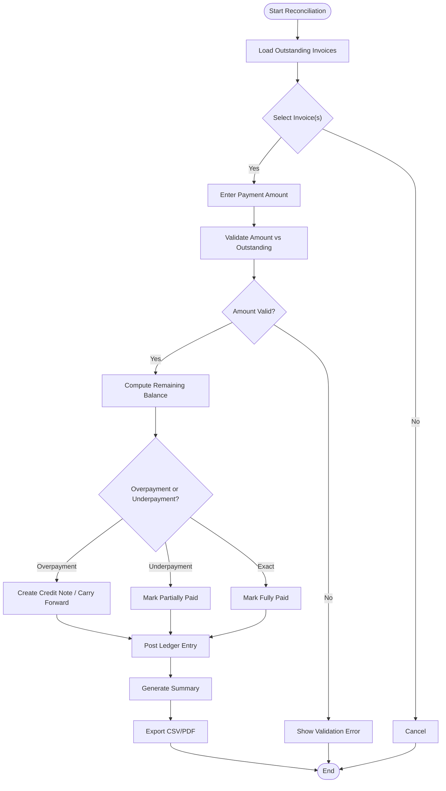
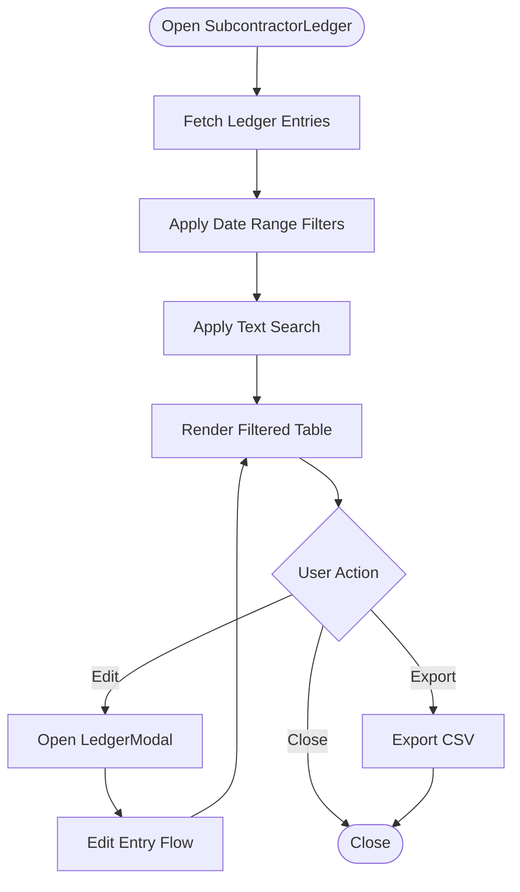
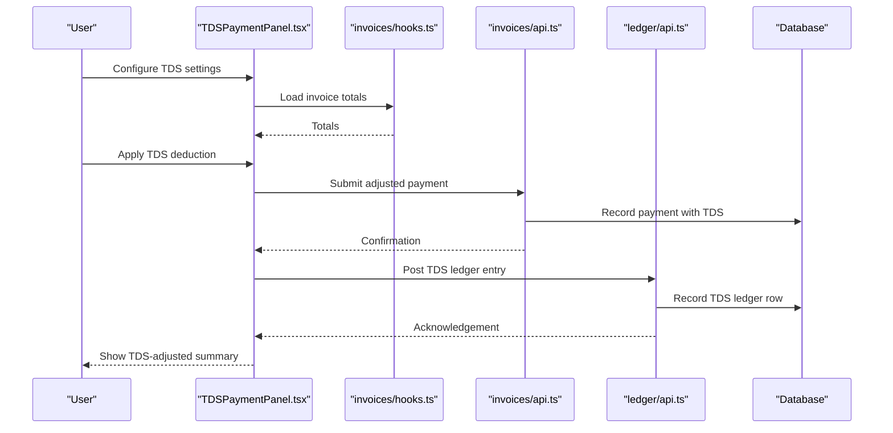
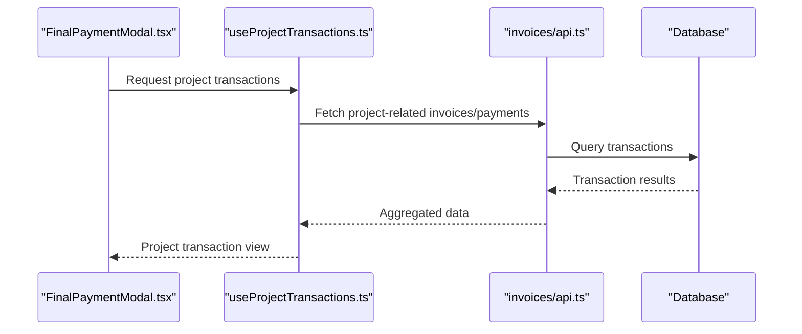
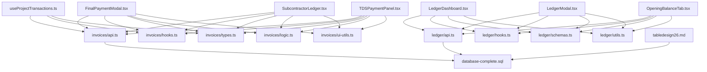

# Payment History & Reconciliation

<cite>
**Referenced Files in This Document**
- [FinalPaymentModal.tsx](file://src/components/FinalPaymentModal.tsx)
- [SubcontractorLedger.tsx](file://src/components/SubcontractorLedger.tsx)
- [TDSPaymentPanel.tsx](file://src/components/TDSPaymentPanel.tsx)
- [useProjectTransactions.ts](file://src/hooks/useProjectTransactions.ts)
- [api.ts (invoices)](file://src/invoices/api.ts)
- [hooks.ts (invoices)](file://src/invoices/hooks.ts)
- [types.ts (invoices)](file://src/invoices/types.ts)
- [logic.ts (invoices)](file://src/invoices/logic.ts)
- [ui-utils.ts (invoices)](file://src/invoices/ui-utils.ts)
- [LedgerDashboard.tsx](file://src/ledger/LedgerDashboard.tsx)
- [LedgerModal.tsx](file://src/ledger/LedgerModal.tsx)
- [OpeningBalanceTab.tsx](file://src/ledger/OpeningBalanceTab.tsx)
- [api.ts (ledger)](file://src/ledger/api.ts)
- [hooks.ts (ledger)](file://src/ledger/hooks.ts)
- [schemas.ts (ledger)](file://src/ledger/schemas.ts)
- [utils.ts (ledger)](file://src/ledger/utils.ts)
- [database-complete.sql](file://src/database-complete.sql)
- [supabase/tabledesign26.md](file://tabledesign26.md)
</cite>

## Table of Contents
1. [Introduction](#introduction)
2. [Project Structure](#project-structure)
3. [Core Components](#core-components)
4. [Architecture Overview](#architecture-overview)
5. [Detailed Component Analysis](#detailed-component-analysis)
6. [Dependency Analysis](#dependency-analysis)
7. [Performance Considerations](#performance-considerations)
8. [Troubleshooting Guide](#troubleshooting-guide)
9. [Conclusion](#conclusion)
10. [Appendices](#appendices)

## Introduction
This document explains the Payment History and Reconciliation features implemented across the application. It focuses on:
- Viewing complete payment records via a dedicated drawer-like interface
- Filtering by date ranges and searching specific transactions
- Reconciling payments to invoices, including handling overpayments and underpayments
- Generating reconciliation reports and exporting payment history for accounting
- Tracking payment status and maintaining audit trails for modifications
- Applying automated reconciliation rules where applicable

The content is grounded in the repository’s components, hooks, API layers, and database schema references.

## Project Structure
Payment-related UI and logic are primarily located under:
- src/components: FinalPaymentModal.tsx, SubcontractorLedger.tsx, TDSPaymentPanel.tsx
- src/hooks: useProjectTransactions.ts
- src/invoices: api.ts, hooks.ts, types.ts, logic.ts, ui-utils.ts
- src/ledger: LedgerDashboard.tsx, LedgerModal.tsx, OpeningBalanceTab.tsx, api.ts, hooks.ts, schemas.ts, utils.ts
- Database schema references: src/database-complete.sql, tabledesign26.md

**Diagram sources**
- [FinalPaymentModal.tsx](file://src/components/FinalPaymentModal.tsx)
- [SubcontractorLedger.tsx](file://src/components/SubcontractorLedger.tsx)
- [TDSPaymentPanel.tsx](file://src/components/TDSPaymentPanel.tsx)
- [useProjectTransactions.ts](file://src/hooks/useProjectTransactions.ts)
- [api.ts (invoices)](file://src/invoices/api.ts)
- [hooks.ts (invoices)](file://src/invoices/hooks.ts)
- [types.ts (invoices)](file://src/invoices/types.ts)
- [logic.ts (invoices)](file://src/invoices/logic.ts)
- [ui-utils.ts (invoices)](file://src/invoices/ui-utils.ts)
- [LedgerDashboard.tsx](file://src/ledger/LedgerDashboard.tsx)
- [LedgerModal.tsx](file://src/ledger/LedgerModal.tsx)
- [OpeningBalanceTab.tsx](file://src/ledger/OpeningBalanceTab.tsx)
- [api.ts (ledger)](file://src/ledger/api.ts)
- [hooks.ts (ledger)](file://src/ledger/hooks.ts)
- [schemas.ts (ledger)](file://src/ledger/schemas.ts)
- [utils.ts (ledger)](file://src/ledger/utils.ts)
- [database-complete.sql](file://src/database-complete.sql)
- [tabledesign26.md](file://tabledesign26.md)

**Section sources**
- [FinalPaymentModal.tsx](file://src/components/FinalPaymentModal.tsx)
- [SubcontractorLedger.tsx](file://src/components/SubcontractorLedger.tsx)
- [TDSPaymentPanel.tsx](file://src/components/TDSPaymentPanel.tsx)
- [useProjectTransactions.ts](file://src/hooks/useProjectTransactions.ts)
- [api.ts (invoices)](file://src/invoices/api.ts)
- [hooks.ts (invoices)](file://src/invoices/hooks.ts)
- [types.ts (invoices)](file://src/invoices/types.ts)
- [logic.ts (invoices)](file://src/invoices/logic.ts)
- [ui-utils.ts (invoices)](file://src/invoices/ui-utils.ts)
- [LedgerDashboard.tsx](file://src/ledger/LedgerDashboard.tsx)
- [LedgerModal.tsx](file://src/ledger/LedgerModal.tsx)
- [OpeningBalanceTab.tsx](file://src/ledger/OpeningBalanceTab.tsx)
- [api.ts (ledger)](file://src/ledger/api.ts)
- [hooks.ts (ledger)](file://src/ledger/hooks.ts)
- [schemas.ts (ledger)](file://src/ledger/schemas.ts)
- [utils.ts (ledger)](file://src/ledger/utils.ts)
- [database-complete.sql](file://src/database-complete.sql)
- [tabledesign26.md](file://tabledesign26.md)

## Core Components
- FinalPaymentModal.tsx: Orchestrates finalizing payments against invoices, applying partials, and updating statuses. Integrates with invoice APIs and hooks for data fetching and mutations.
- SubcontractorLedger.tsx: Presents ledger-style views for subcontractor payments, enabling filtering and search across transactions.
- TDSPaymentPanel.tsx: Handles TDS-specific payment adjustments and reporting within the payment flow.
- useProjectTransactions.ts: Provides project-scoped transaction queries and helpers used by payment flows.
- Invoices module (api.ts, hooks.ts, types.ts, logic.ts, ui-utils.ts): Encapsulates invoice retrieval, mutation, validation, and UI utilities relevant to payment matching and reconciliation.
- Ledger module (LedgerDashboard.tsx, LedgerModal.tsx, OpeningBalanceTab.tsx, api.ts, hooks.ts, schemas.ts, utils.ts): Centralizes ledger operations, including opening balances, modal interactions, and utility functions for calculations and formatting.

Key responsibilities:
- Data access: Fetching invoices, payments, and ledger entries
- Business logic: Matching payments to invoices, computing remaining balances, handling over/underpayments
- UI orchestration: Presenting filtered lists, search, and export capabilities
- Audit and status tracking: Recording changes and reflecting updated statuses

**Section sources**
- [FinalPaymentModal.tsx](file://src/components/FinalPaymentModal.tsx)
- [SubcontractorLedger.tsx](file://src/components/SubcontractorLedger.tsx)
- [TDSPaymentPanel.tsx](file://src/components/TDSPaymentPanel.tsx)
- [useProjectTransactions.ts](file://src/hooks/useProjectTransactions.ts)
- [api.ts (invoices)](file://src/invoices/api.ts)
- [hooks.ts (invoices)](file://src/invoices/hooks.ts)
- [types.ts (invoices)](file://src/invoices/types.ts)
- [logic.ts (invoices)](file://src/invoices/logic.ts)
- [ui-utils.ts (invoices)](file://src/invoices/ui-utils.ts)
- [LedgerDashboard.tsx](file://src/ledger/LedgerDashboard.tsx)
- [LedgerModal.tsx](file://src/ledger/LedgerModal.tsx)
- [OpeningBalanceTab.tsx](file://src/ledger/OpeningBalanceTab.tsx)
- [api.ts (ledger)](file://src/ledger/api.ts)
- [hooks.ts (ledger)](file://src/ledger/hooks.ts)
- [schemas.ts (ledger)](file://src/ledger/schemas.ts)
- [utils.ts (ledger)](file://src/ledger/utils.ts)

## Architecture Overview
The payment and reconciliation architecture follows a layered approach:
- UI layer: Modal/drawer components orchestrate user workflows
- Hooks layer: React Query or similar patterns manage data fetching and caching
- API layer: HTTP/RPC calls to backend services
- Data layer: Database tables and migrations define entities and relationships

**Diagram sources**
- [FinalPaymentModal.tsx](file://src/components/FinalPaymentModal.tsx)
- [hooks.ts (invoices)](file://src/invoices/hooks.ts)
- [api.ts (invoices)](file://src/invoices/api.ts)
- [api.ts (ledger)](file://src/ledger/api.ts)
- [database-complete.sql](file://src/database-complete.sql)

## Detailed Component Analysis

### PaymentHistoryDrawer Conceptual Model
Although there is no file explicitly named PaymentHistoryDrawer, the functionality described aligns with the ledger and invoice modules’ presentation layers. The conceptual model below shows how a “drawer” would integrate with existing components and data flows.

[No sources needed since this diagram shows conceptual workflow, not actual code structure]

### FinalPaymentModal Workflow
This component coordinates the end-to-end process of applying payments to invoices, including partial payments and status updates.

**Diagram sources**
- [FinalPaymentModal.tsx](file://src/components/FinalPaymentModal.tsx)
- [hooks.ts (invoices)](file://src/invoices/hooks.ts)
- [api.ts (invoices)](file://src/invoices/api.ts)
- [api.ts (ledger)](file://src/ledger/api.ts)
- [database-complete.sql](file://src/database-complete.sql)

**Section sources**
- [FinalPaymentModal.tsx](file://src/components/FinalPaymentModal.tsx)
- [hooks.ts (invoices)](file://src/invoices/hooks.ts)
- [api.ts (invoices)](file://src/invoices/api.ts)
- [api.ts (ledger)](file://src/ledger/api.ts)
- [database-complete.sql](file://src/database-complete.sql)

### Reconciliation Logic Flow
Reconciliation involves matching payments to invoices, handling overpayments and underpayments, and generating summaries.

**Diagram sources**
- [logic.ts (invoices)](file://src/invoices/logic.ts)
- [ui-utils.ts (invoices)](file://src/invoices/ui-utils.ts)
- [api.ts (ledger)](file://src/ledger/api.ts)
- [database-complete.sql](file://src/database-complete.sql)

**Section sources**
- [logic.ts (invoices)](file://src/invoices/logic.ts)
- [ui-utils.ts (invoices)](file://src/invoices/ui-utils.ts)
- [api.ts (ledger)](file://src/ledger/api.ts)
- [database-complete.sql](file://src/database-complete.sql)

### SubcontractorLedger Filtering and Search
The SubcontractorLedger component provides ledger-style views with filtering and search capabilities.

**Diagram sources**
- [SubcontractorLedger.tsx](file://src/components/SubcontractorLedger.tsx)
- [LedgerModal.tsx](file://src/ledger/LedgerModal.tsx)
- [api.ts (ledger)](file://src/ledger/api.ts)
- [hooks.ts (ledger)](file://src/ledger/hooks.ts)

**Section sources**
- [SubcontractorLedger.tsx](file://src/components/SubcontractorLedger.tsx)
- [LedgerModal.tsx](file://src/ledger/LedgerModal.tsx)
- [api.ts (ledger)](file://src/ledger/api.ts)
- [hooks.ts (ledger)](file://src/ledger/hooks.ts)

### TDS Payment Adjustments
TDSPaymentPanel handles TDS-specific adjustments during payment processing.

**Diagram sources**
- [TDSPaymentPanel.tsx](file://src/components/TDSPaymentPanel.tsx)
- [hooks.ts (invoices)](file://src/invoices/hooks.ts)
- [api.ts (invoices)](file://src/invoices/api.ts)
- [api.ts (ledger)](file://src/ledger/api.ts)
- [database-complete.sql](file://src/database-complete.sql)

**Section sources**
- [TDSPaymentPanel.tsx](file://src/components/TDSPaymentPanel.tsx)
- [hooks.ts (invoices)](file://src/invoices/hooks.ts)
- [api.ts (invoices)](file://src/invoices/api.ts)
- [api.ts (ledger)](file://src/ledger/api.ts)
- [database-complete.sql](file://src/database-complete.sql)

### Project Transactions Integration
useProjectTransactions provides project-scoped transaction data used by payment flows.

**Diagram sources**
- [useProjectTransactions.ts](file://src/hooks/useProjectTransactions.ts)
- [api.ts (invoices)](file://src/invoices/api.ts)
- [database-complete.sql](file://src/database-complete.sql)

**Section sources**
- [useProjectTransactions.ts](file://src/hooks/useProjectTransactions.ts)
- [api.ts (invoices)](file://src/invoices/api.ts)
- [database-complete.sql](file://src/database-complete.sql)

## Dependency Analysis
The following diagram maps key dependencies between UI components, hooks, API layers, and the database schema.

**Diagram sources**
- [FinalPaymentModal.tsx](file://src/components/FinalPaymentModal.tsx)
- [SubcontractorLedger.tsx](file://src/components/SubcontractorLedger.tsx)
- [TDSPaymentPanel.tsx](file://src/components/TDSPaymentPanel.tsx)
- [useProjectTransactions.ts](file://src/hooks/useProjectTransactions.ts)
- [api.ts (invoices)](file://src/invoices/api.ts)
- [hooks.ts (invoices)](file://src/invoices/hooks.ts)
- [types.ts (invoices)](file://src/invoices/types.ts)
- [logic.ts (invoices)](file://src/invoices/logic.ts)
- [ui-utils.ts (invoices)](file://src/invoices/ui-utils.ts)
- [LedgerDashboard.tsx](file://src/ledger/LedgerDashboard.tsx)
- [LedgerModal.tsx](file://src/ledger/LedgerModal.tsx)
- [OpeningBalanceTab.tsx](file://src/ledger/OpeningBalanceTab.tsx)
- [api.ts (ledger)](file://src/ledger/api.ts)
- [hooks.ts (ledger)](file://src/ledger/hooks.ts)
- [schemas.ts (ledger)](file://src/ledger/schemas.ts)
- [utils.ts (ledger)](file://src/ledger/utils.ts)
- [database-complete.sql](file://src/database-complete.sql)
- [tabledesign26.md](file://tabledesign26.md)

**Section sources**
- [FinalPaymentModal.tsx](file://src/components/FinalPaymentModal.tsx)
- [SubcontractorLedger.tsx](file://src/components/SubcontractorLedger.tsx)
- [TDSPaymentPanel.tsx](file://src/components/TDSPaymentPanel.tsx)
- [useProjectTransactions.ts](file://src/hooks/useProjectTransactions.ts)
- [api.ts (invoices)](file://src/invoices/api.ts)
- [hooks.ts (invoices)](file://src/invoices/hooks.ts)
- [types.ts (invoices)](file://src/invoices/types.ts)
- [logic.ts (invoices)](file://src/invoices/logic.ts)
- [ui-utils.ts (invoices)](file://src/invoices/ui-utils.ts)
- [LedgerDashboard.tsx](file://src/ledger/LedgerDashboard.tsx)
- [LedgerModal.tsx](file://src/ledger/LedgerModal.tsx)
- [OpeningBalanceTab.tsx](file://src/ledger/OpeningBalanceTab.tsx)
- [api.ts (ledger)](file://src/ledger/api.ts)
- [hooks.ts (ledger)](file://src/ledger/hooks.ts)
- [schemas.ts (ledger)](file://src/ledger/schemas.ts)
- [utils.ts (ledger)](file://src/ledger/utils.ts)
- [database-complete.sql](file://src/database-complete.sql)
- [tabledesign26.md](file://tabledesign26.md)

## Performance Considerations
- Use pagination and virtualization for large transaction lists in ledger views
- Debounce search inputs to reduce API calls
- Cache invoice and payment data using hooks to avoid redundant fetches
- Batch ledger updates when reconciling multiple invoices
- Optimize database queries with appropriate indexes on date fields and foreign keys

## Troubleshooting Guide
Common issues and resolutions:
- Payment mismatch errors: Validate amounts against outstanding balances before submission; check invoice status transitions
- Missing ledger entries: Ensure post-payment ledger API calls succeed; verify schema constraints
- Audit trail gaps: Confirm that all payment modifications trigger audit logging; review error paths
- Export failures: Validate CSV generation logic and ensure required fields are present

**Section sources**
- [logic.ts (invoices)](file://src/invoices/logic.ts)
- [ui-utils.ts (invoices)](file://src/invoices/ui-utils.ts)
- [api.ts (ledger)](file://src/ledger/api.ts)
- [schemas.ts (ledger)](file://src/ledger/schemas.ts)
- [utils.ts (ledger)](file://src/ledger/utils.ts)

## Conclusion
The Payment History and Reconciliation features are implemented through a cohesive set of components, hooks, and API layers. They provide robust support for viewing payment records, filtering and searching transactions, reconciling payments to invoices, handling over/underpayments, and generating summaries and exports. The ledger module centralizes financial entries, while invoice utilities encapsulate business logic and UI helpers. Proper audit trails and status tracking ensure transparency and accountability throughout the payment lifecycle.

## Appendices

### Example Workflows

#### Resolving Payment Discrepancies
- Identify discrepancies by comparing invoice outstanding balances with recorded payments
- Adjust amounts and apply TDS if applicable
- Post corrected ledger entries and regenerate summaries

#### Generating Payment Summaries
- Aggregate paid, partially paid, and unpaid invoices within selected date ranges
- Include TDS deductions and net payable amounts
- Export summaries for accounting review

#### Exporting Payment History
- Filter transactions by date range and search terms
- Generate CSV/PDF exports with standardized columns
- Ensure audit trail metadata is included for traceability

[No sources needed since this section provides general guidance]