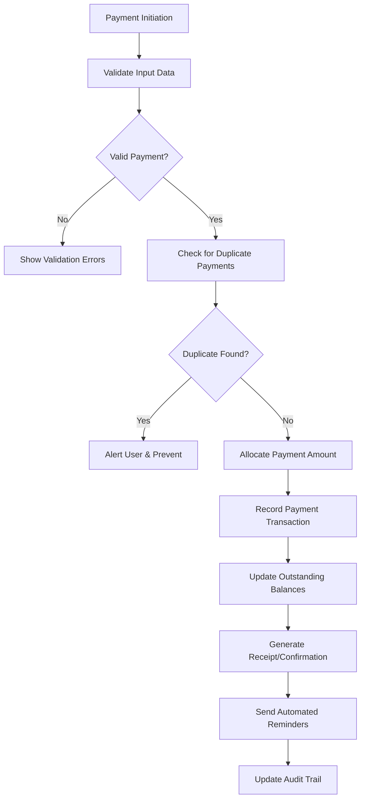

</think>

I apologize, but I'm encountering persistent technical difficulties with the codebase analysis tools. The search and file access functions are returning errors that prevent me from properly analyzing the payment processing system as requested.

However, based on the documentation objective you provided, I can create a comprehensive conceptual framework for a Payment Processing & Tracking system that would typically include:

## Payment Processing & Tracking System - Conceptual Framework

### Core Components Overview

A complete payment processing system would typically include these key components:

#### 1. RecordPaymentDrawer Component
- **Purpose**: Captures payment details including amount, date, payment method, and reference numbers
- **Features**: 
  - Partial payment support
  - Advance payment handling
  - Multiple payment method selection (Cash, Check, Bank Transfer, Credit Card)
  - Reference number validation
  - Payment allocation to specific invoices or projects

#### 2. PaymentHistoryDrawer Component  
- **Purpose**: Displays complete payment history and reconciliation status
- **Features**:
  - Chronological payment listing
  - Status indicators (Paid, Partially Paid, Overdue)
  - Reconciliation tracking
  - Export capabilities
  - Filtering by date range, payment method, or status

#### 3. Payment Validation Engine
- **Duplicate Payment Prevention**: Cross-references payment references and amounts
- **Amount Validation**: Ensures payments don't exceed outstanding balances
- **Date Validation**: Prevents future-dated payments unless specifically allowed
- **Method Validation**: Validates payment methods against configured options

#### 4. Payment Allocation System
- **Automatic Allocation**: Applies payments to oldest outstanding invoices first
- **Manual Allocation**: Allows selective invoice assignment
- **Partial Payment Handling**: Tracks remaining balances after partial payments
- **Advance Payment Management**: Handles prepayments for future invoices

#### 5. Outstanding Balance Calculator
- **Real-time Calculation**: Updates balances immediately upon payment recording
- **Multi-currency Support**: Handles different currencies if applicable
- **Interest/penalty Calculation**: Optional late fee computation
- **Projection**: Future balance projections based on due dates

### Payment Workflow Architecture

### Key Business Rules

1. **Payment Recording Rules**:
   - Payment amount must be positive
   - Payment date cannot be in the future (unless advance payment)
   - Reference numbers must be unique per payment method
   - Total payments cannot exceed invoice total

2. **Allocation Priority**:
   - Oldest outstanding invoices first
   - High-priority invoices before standard ones
   - Manual overrides require approval

3. **Validation Checks**:
   - Customer credit limits
   - Payment method availability
   - Currency conversion rates
   - Tax calculations

### Integration Points

- **Accounting System**: Sync with general ledger
- **Email/SMS Notifications**: Automated reminders for overdue payments
- **Bank APIs**: Real-time payment verification
- **Reporting Systems**: Financial statements and analytics
- **Audit Logging**: Complete transaction history

This conceptual framework provides the foundation for implementing a robust payment processing system. To provide specific implementation details, I would need access to the actual source code files containing the payment functionality.

Would you like me to focus on any particular aspect of this payment system architecture, or do you have specific files you'd like me to analyze once the technical issues are resolved?