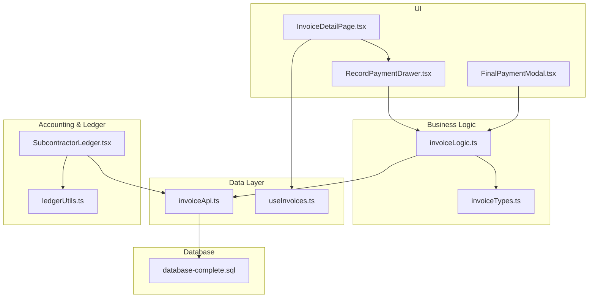
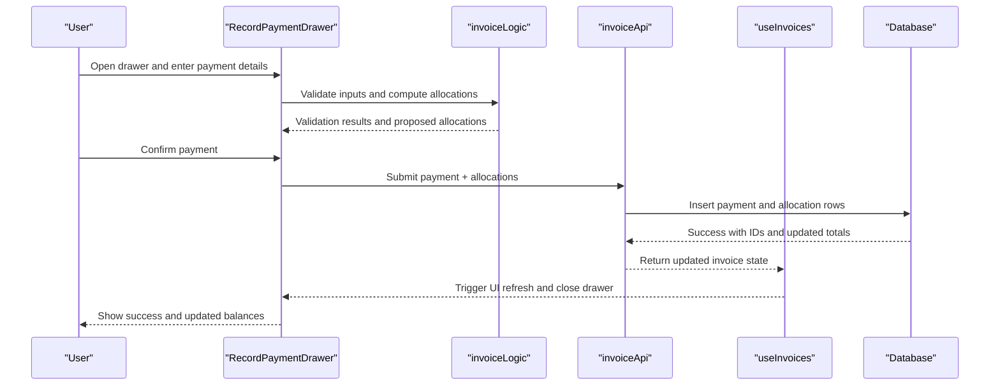
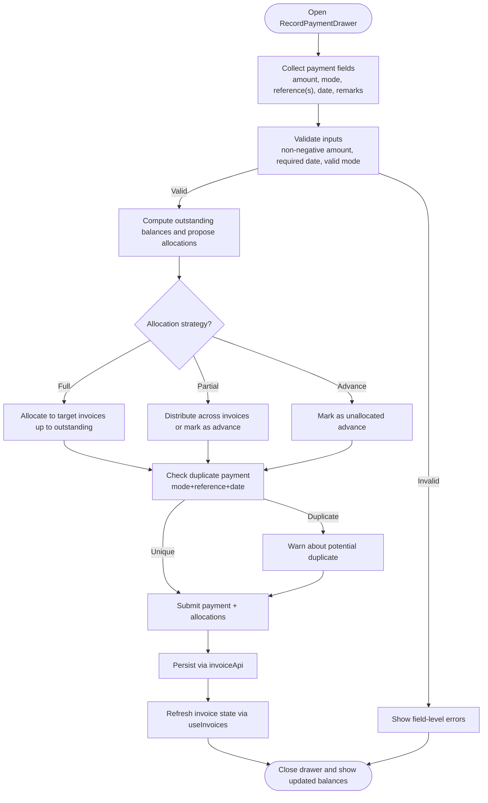
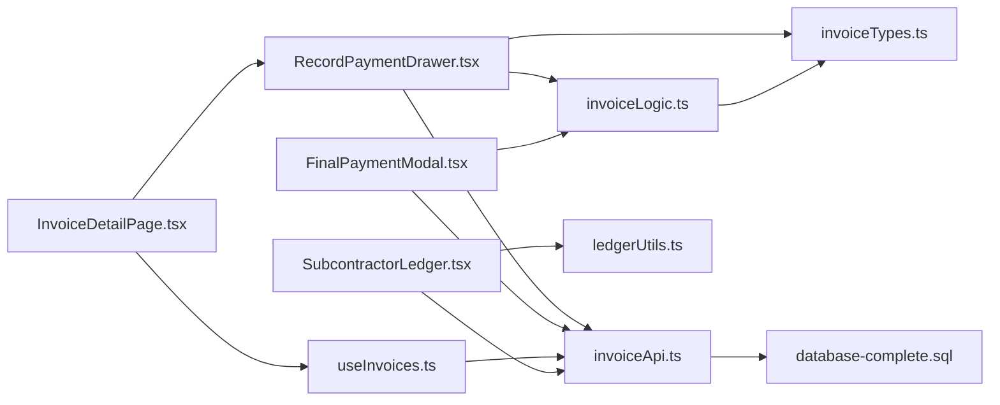

# Payment Recording Workflow

<cite>
**Referenced Files in This Document**
- [RecordPaymentDrawer.tsx](file://src/invoices/components/RecordPaymentDrawer.tsx)
- [InvoiceDetailPage.tsx](file://src/invoices/pages/InvoiceDetailPage.tsx)
- [invoiceLogic.ts](file://src/invoices/logic.ts)
- [invoiceTypes.ts](file://src/invoices/types.ts)
- [invoiceApi.ts](file://src/invoices/api.ts)
- [useInvoices.ts](file://src/hooks/useInvoices.ts)
- [FinalPaymentModal.tsx](file://src/components/FinalPaymentModal.tsx)
- [SubcontractorLedger.tsx](file://src/components/SubcontractorLedger.tsx)
- [ledgerUtils.ts](file://src/ledger/utils.ts)
- [database-complete.sql](file://src/database-complete.sql)
</cite>

## Table of Contents
1. [Introduction](#introduction)
2. [Project Structure](#project-structure)
3. [Core Components](#core-components)
4. [Architecture Overview](#architecture-overview)
5. [Detailed Component Analysis](#detailed-component-analysis)
6. [Dependency Analysis](#dependency-analysis)
7. [Performance Considerations](#performance-considerations)
8. [Troubleshooting Guide](#troubleshooting-guide)
9. [Conclusion](#conclusion)

## Introduction
This document explains the end-to-end Payment Recording Workflow, focusing on how the RecordPaymentDrawer component captures payment details (amount, mode, reference numbers, dates), validates inputs, calculates balances, and allocates payments to invoices. It also covers partial payments, advance payments, multiple payment methods per invoice, duplicate prevention, status updates, and integration points with accounting systems.

## Project Structure
The payment recording workflow spans UI components, business logic, types, API calls, hooks, and database schemas:
- UI layer: RecordPaymentDrawer for capturing payments; InvoiceDetailPage orchestrating the flow; FinalPaymentModal for finalizing full payments.
- Business logic: invoiceLogic for validation, allocation, and balance calculations.
- Data contracts: invoiceTypes defining models and enums.
- Persistence: invoiceApi for server calls; useInvoices hook for data fetching and mutations.
- Ledger and accounting: SubcontractorLedger and ledger utilities for reconciliation and reporting.
- Database schema: SQL files defining tables and constraints relevant to payments and allocations.

**Diagram sources**
- [RecordPaymentDrawer.tsx](file://src/invoices/components/RecordPaymentDrawer.tsx)
- [InvoiceDetailPage.tsx](file://src/invoices/pages/InvoiceDetailPage.tsx)
- [FinalPaymentModal.tsx](file://src/components/FinalPaymentModal.tsx)
- [invoiceLogic.ts](file://src/invoices/logic.ts)
- [invoiceTypes.ts](file://src/invoices/types.ts)
- [invoiceApi.ts](file://src/invoices/api.ts)
- [useInvoices.ts](file://src/hooks/useInvoices.ts)
- [SubcontractorLedger.tsx](file://src/components/SubcontractorLedger.tsx)
- [ledgerUtils.ts](file://src/ledger/utils.ts)
- [database-complete.sql](file://src/database-complete.sql)

**Section sources**
- [RecordPaymentDrawer.tsx](file://src/invoices/components/RecordPaymentDrawer.tsx)
- [InvoiceDetailPage.tsx](file://src/invoices/pages/InvoiceDetailPage.tsx)
- [invoiceLogic.ts](file://src/invoices/logic.ts)
- [invoiceTypes.ts](file://src/invoices/types.ts)
- [invoiceApi.ts](file://src/invoices/api.ts)
- [useInvoices.ts](file://src/hooks/useInvoices.ts)
- [SubcontractorLedger.tsx](file://src/components/SubcontractorLedger.tsx)
- [ledgerUtils.ts](file://src/ledger/utils.ts)
- [database-complete.sql](file://src/database-complete.sql)

## Core Components
- RecordPaymentDrawer: Captures payment amount, mode (cash, bank transfer, online), reference number(s), date, and optional remarks. It validates inputs, computes remaining balance, and proposes allocation across selected invoices or lines.
- InvoiceDetailPage: Hosts the drawer, provides invoice context, triggers submission, and refreshes state after successful recording.
- invoiceLogic: Encapsulates validation rules, allocation strategies (full, partial, advance), and balance recalculation.
- invoiceTypes: Defines shared types for payments, modes, references, and allocation entries.
- invoiceApi: Persists payments and allocations via backend APIs.
- useInvoices: Manages invoice queries and mutations, including re-fetching after payment recording.
- FinalPaymentModal: Specialized UI for finalizing a full payment when due amounts match.
- SubcontractorLedger and ledgerUtils: Provide reconciliation views and helpers for aggregating payments and allocations.

**Section sources**
- [RecordPaymentDrawer.tsx](file://src/invoices/components/RecordPaymentDrawer.tsx)
- [InvoiceDetailPage.tsx](file://src/invoices/pages/InvoiceDetailPage.tsx)
- [invoiceLogic.ts](file://src/invoices/logic.ts)
- [invoiceTypes.ts](file://src/invoices/types.ts)
- [invoiceApi.ts](file://src/invoices/api.ts)
- [useInvoices.ts](file://src/hooks/useInvoices.ts)
- [FinalPaymentModal.tsx](file://src/components/FinalPaymentModal.tsx)
- [SubcontractorLedger.tsx](file://src/components/SubcontractorLedger.tsx)
- [ledgerUtils.ts](file://src/ledger/utils.ts)

## Architecture Overview
The workflow follows a layered approach:
- User interaction in RecordPaymentDrawer collects and validates payment data.
- Business logic in invoiceLogic performs allocation and balance checks.
- API layer persists records and returns updated invoice states.
- Hooks update local state and trigger UI refresh.
- Ledger components reflect changes for accounting visibility.

**Diagram sources**
- [RecordPaymentDrawer.tsx](file://src/invoices/components/RecordPaymentDrawer.tsx)
- [invoiceLogic.ts](file://src/invoices/logic.ts)
- [invoiceApi.ts](file://src/invoices/api.ts)
- [useInvoices.ts](file://src/hooks/useInvoices.ts)
- [database-complete.sql](file://src/database-complete.sql)

## Detailed Component Analysis

### RecordPaymentDrawer
Responsibilities:
- Capture payment fields: amount, mode (cash, bank transfer, online), reference numbers, date, and remarks.
- Validate inputs: non-negative amount, required date, valid mode, and reference format where applicable.
- Compute remaining balance based on selected invoices and existing allocations.
- Propose allocation strategy:
  - Full payment: allocate entire amount to one or more invoices up to their outstanding balances.
  - Partial payment: allow user to distribute across invoices or mark as advance.
  - Advance payment: record without immediate allocation; available for future allocation.
- Prevent duplicates: check for same-mode + same-reference + same-date combinations against existing payments.
- Integrate with FinalPaymentModal when the amount equals outstanding balance.

Key behaviors:
- Multi-method support: allows multiple payment entries per invoice by splitting amounts across modes.
- Allocation table: shows per-invoice allocation amounts and running totals.
- Status updates: upon successful submission, invoice statuses are recalculated (e.g., from partially paid to fully paid).

**Diagram sources**
- [RecordPaymentDrawer.tsx](file://src/invoices/components/RecordPaymentDrawer.tsx)
- [invoiceLogic.ts](file://src/invoices/logic.ts)
- [invoiceApi.ts](file://src/invoices/api.ts)
- [useInvoices.ts](file://src/hooks/useInvoices.ts)

**Section sources**
- [RecordPaymentDrawer.tsx](file://src/invoices/components/RecordPaymentDrawer.tsx)
- [invoiceLogic.ts](file://src/invoices/logic.ts)
- [invoiceTypes.ts](file://src/invoices/types.ts)

### InvoiceDetailPage
Responsibilities:
- Provide invoice context and current balances to RecordPaymentDrawer.
- Handle opening/closing of the drawer and display success/error feedback.
- Trigger re-fetch of invoice data after payment recording to reflect new allocations and statuses.

Integration points:
- Uses useInvoices to manage invoice state and mutations.
- Coordinates with FinalPaymentModal for streamlined full-payment flows.

**Section sources**
- [InvoiceDetailPage.tsx](file://src/invoices/pages/InvoiceDetailPage.tsx)
- [useInvoices.ts](file://src/hooks/useInvoices.ts)
- [FinalPaymentModal.tsx](file://src/components/FinalPaymentModal.tsx)

### invoiceLogic
Responsibilities:
- Validation rules for payment fields and references.
- Allocation algorithms:
  - Distribute amounts proportionally or by user selection.
  - Enforce that total allocated does not exceed outstanding balances.
  - Support advance payments that remain unallocated until later.
- Balance calculations:
  - Sum existing allocations per invoice.
  - Compute remaining balance = invoice total - sum of allocations - prior advances applied.
- Duplicate detection:
  - Identify potential duplicates by comparing mode, reference, and date against existing payments.

Complexity considerations:
- Allocation is O(n) over selected invoices for distribution.
- Duplicate checks are O(m) over recent payments filtered by mode/reference/date.

**Section sources**
- [invoiceLogic.ts](file://src/invoices/logic.ts)
- [invoiceTypes.ts](file://src/invoices/types.ts)

### invoiceTypes
Defines core models:
- PaymentMode enum: cash, bank_transfer, online.
- PaymentEntry: amount, mode, reference(s), date, remarks.
- AllocationEntry: invoiceId, allocatedAmount, type (direct or advance).
- InvoiceBalance: totals, allocated, remaining.

These types ensure consistent data contracts between UI, logic, and API layers.

**Section sources**
- [invoiceTypes.ts](file://src/invoices/types.ts)

### invoiceApi
Responsibilities:
- Submit payment and allocations to the backend.
- Return updated invoice totals and statuses.
- Surface error responses for validation failures and duplicate detection.

Integration:
- Called by RecordPaymentDrawer and FinalPaymentModal.
- Consumed by useInvoices to refresh local state.

**Section sources**
- [invoiceApi.ts](file://src/invoices/api.ts)
- [useInvoices.ts](file://src/hooks/useInvoices.ts)

### FinalPaymentModal
Purpose:
- Streamline recording of full payments when amount equals outstanding balance.
- Pre-fill allocation to target invoice and skip manual distribution.

Workflow:
- Opens from InvoiceDetailPage when conditions are met.
- Reuses validation and persistence logic from invoiceLogic and invoiceApi.

**Section sources**
- [FinalPaymentModal.tsx](file://src/components/FinalPaymentModal.tsx)
- [invoiceLogic.ts](file://src/invoices/logic.ts)
- [invoiceApi.ts](file://src/invoices/api.ts)

### SubcontractorLedger and ledgerUtils
Role:
- Display aggregated payments and allocations per party/invoice.
- Provide utility functions for reconciling totals and identifying discrepancies.

Integration:
- Reads persisted payment and allocation records via invoiceApi.
- Reflects real-time updates after payment recording.

**Section sources**
- [SubcontractorLedger.tsx](file://src/components/SubcontractorLedger.tsx)
- [ledgerUtils.ts](file://src/ledger/utils.ts)
- [invoiceApi.ts](file://src/invoices/api.ts)

## Dependency Analysis
The following diagram maps key dependencies among components and modules involved in payment recording:

**Diagram sources**
- [RecordPaymentDrawer.tsx](file://src/invoices/components/RecordPaymentDrawer.tsx)
- [invoiceLogic.ts](file://src/invoices/logic.ts)
- [invoiceTypes.ts](file://src/invoices/types.ts)
- [invoiceApi.ts](file://src/invoices/api.ts)
- [InvoiceDetailPage.tsx](file://src/invoices/pages/InvoiceDetailPage.tsx)
- [useInvoices.ts](file://src/hooks/useInvoices.ts)
- [FinalPaymentModal.tsx](file://src/components/FinalPaymentModal.tsx)
- [SubcontractorLedger.tsx](file://src/components/SubcontractorLedger.tsx)
- [ledgerUtils.ts](file://src/ledger/utils.ts)
- [database-complete.sql](file://src/database-complete.sql)

**Section sources**
- [RecordPaymentDrawer.tsx](file://src/invoices/components/RecordPaymentDrawer.tsx)
- [invoiceLogic.ts](file://src/invoices/logic.ts)
- [invoiceTypes.ts](file://src/invoices/types.ts)
- [invoiceApi.ts](file://src/invoices/api.ts)
- [InvoiceDetailPage.tsx](file://src/invoices/pages/InvoiceDetailPage.tsx)
- [useInvoices.ts](file://src/hooks/useInvoices.ts)
- [FinalPaymentModal.tsx](file://src/components/FinalPaymentModal.tsx)
- [SubcontractorLedger.tsx](file://src/components/SubcontractorLedger.tsx)
- [ledgerUtils.ts](file://src/ledger/utils.ts)
- [database-complete.sql](file://src/database-complete.sql)

## Performance Considerations
- Minimize re-renders: batch allocation computations and avoid unnecessary state updates in RecordPaymentDrawer.
- Efficient duplicate checks: index or cache recent payments by mode/reference/date to reduce lookup time.
- Lazy loading: defer heavy ledger computations until needed in SubcontractorLedger.
- Optimistic UI: show immediate success feedback while persisting in background, with rollback on failure.

[No sources needed since this section provides general guidance]

## Troubleshooting Guide
Common issues and resolutions:
- Validation errors: ensure amount is positive, date is set, and mode is valid. Review field-level messages from invoiceLogic.
- Allocation exceeds outstanding: adjust distribution so total allocated ≤ outstanding balances per invoice.
- Duplicate payment warning: verify reference uniqueness per mode and date; consider adjusting reference or merging entries.
- Status not updating: confirm API success response and that useInvoices triggered a refresh; check network errors.
- Ledger mismatch: reconcile using ledgerUtils to identify missing allocations or rounding differences.

**Section sources**
- [invoiceLogic.ts](file://src/invoices/logic.ts)
- [invoiceApi.ts](file://src/invoices/api.ts)
- [useInvoices.ts](file://src/hooks/useInvoices.ts)
- [ledgerUtils.ts](file://src/ledger/utils.ts)

## Conclusion
The Payment Recording Workflow integrates a robust UI (RecordPaymentDrawer), clear business logic (invoiceLogic), strong data contracts (invoiceTypes), reliable persistence (invoiceApi), and responsive state management (useInvoices). It supports flexible payment modes, partial and advance payments, multi-method allocations, duplicate prevention, and accurate balance updates. The ledger components provide transparency and reconciliation capabilities, ensuring alignment with accounting requirements.

[No sources needed since this section summarizes without analyzing specific files]