# System Integrations & Data Flow

<cite>
**Referenced Files in This Document**
- [src/invoices/api.ts](file://src/invoices/api.ts)
- [src/invoices/hooks.ts](file://src/invoices/hooks.ts)
- [src/invoices/types.ts](file://src/invoices/types.ts)
- [src/invoices/logic.ts](file://src/invoices/logic.ts)
- [src/invoices/stock-deduction/index.ts](file://src/invoices/stock-deduction/index.ts)
- [src/conversions/api.ts](file://src/conversions/api.ts)
- [src/conversions/hooks.ts](file://src/conversions/hooks.ts)
- [src/conversions/types.ts](file://src/conversions/types.ts)
- [src/proforma-invoices/api.ts](file://src/proforma-invoices/api.ts)
- [src/material-intents/api.ts](file://src/material-intents/api.ts)
- [src/material-usage/api.ts](file://src/material-usage/api.ts)
- [src/lib/quotation-workflow.ts](file://src/lib/quotation-workflow.ts)
- [src/applications/api.ts](file://src/applications/api.ts)
- [src/supabase/client.ts](file://src/supabase/client.ts)
- [src/queryClient.ts](file://src/queryClient.ts)
- [src/hooks/useRequestManager.ts](file://src/hooks/useRequestManager.ts)
- [src/hooks/useAsyncInterval.ts](file://src/hooks/useAsyncInterval.ts)
- [src/lib/logger.tsx](file://src/lib/logger.tsx)
- [src/pages/MaterialConsumptionReport.tsx](file://src/pages/MaterialConsumptionReport.tsx)
- [src/pages/MaterialUsageTracker.tsx](file://src/pages/MaterialUsageTracker.tsx)
- [src/pages/CreateProjectInvoiceModal.tsx](file://src/pages/CreateProjectInvoiceModal.tsx)
- [src/components/FinalPaymentModal.tsx](file://src/components/FinalPaymentModal.tsx)
- [src/components/TDSPaymentPanel.tsx](file://src/components/TDSPaymentPanel.tsx)
- [src/components/RetentionReleasePanel.tsx](file://src/components/RetentionReleasePanel.tsx)
- [src/database/database-complete.sql](file://src/database/database-complete.sql)
- [src/database/database-proforma-invoices.sql](file://src/database/database-proforma-invoices.sql)
- [src/database/database-quotation-conversions.sql](file://src/database/database-quotation-conversions.sql)
- [src/database/database-material-intents-enhancement.sql](file://src/database/database-material-intents-enhancement.sql)
</cite>

## Table of Contents
1. [Introduction](#introduction)
2. [Project Structure](#project-structure)
3. [Core Components](#core-components)
4. [Architecture Overview](#architecture-overview)
5. [Detailed Component Analysis](#detailed-component-analysis)
6. [Dependency Analysis](#dependency-analysis)
7. [Performance Considerations](#performance-considerations)
8. [Troubleshooting Guide](#troubleshooting-guide)
9. [Conclusion](#conclusion)
10. [Appendices](#appendices)

## Introduction
This document explains the system integrations and data flow for the Invoicing System, focusing on:
- API endpoints for invoice CRUD operations, payment processing, and status updates
- Integration with Material Consumption Tracking for automatic stock deductions and usage reporting
- Conversion workflows from quotations, proforma invoices, and purchase orders
- Real-time data synchronization patterns, error handling strategies, and retry mechanisms
- Integrations with Project Management (milestone-based billing), client communication systems (automated notifications), and accounting software (financial reporting)

The goal is to provide a clear, code-mapped view of how data moves across modules and external systems, enabling confident integration and troubleshooting.

## Project Structure
The invoicing subsystem is organized by feature directories with clear separation between API clients, hooks, types, logic, and UI components. Key areas include:
- Invoice module: API, hooks, types, PDF generation, stock deduction utilities
- Conversions: APIs and hooks for converting quotations, proforma invoices, and purchase orders into invoices
- Proforma invoices: dedicated API layer
- Material intents and material usage: APIs that bridge inventory tracking and consumption reporting
- Shared libraries: Supabase client, query client configuration, request manager, async interval polling
- Pages and components: UI orchestration for project-based invoicing, payments, retention, and TDS

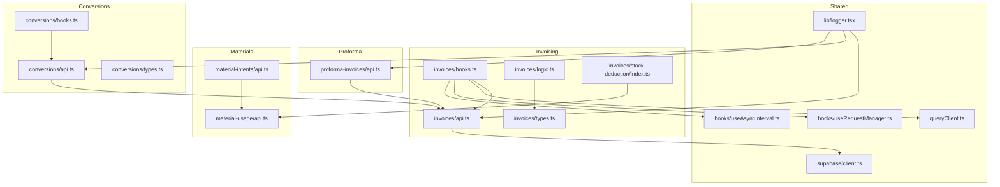

**Diagram sources**
- [src/invoices/api.ts](file://src/invoices/api.ts)
- [src/invoices/hooks.ts](file://src/invoices/hooks.ts)
- [src/invoices/types.ts](file://src/invoices/types.ts)
- [src/invoices/logic.ts](file://src/invoices/logic.ts)
- [src/invoices/stock-deduction/index.ts](file://src/invoices/stock-deduction/index.ts)
- [src/conversions/api.ts](file://src/conversions/api.ts)
- [src/conversions/hooks.ts](file://src/conversions/hooks.ts)
- [src/conversions/types.ts](file://src/conversions/types.ts)
- [src/proforma-invoices/api.ts](file://src/proforma-invoices/api.ts)
- [src/material-intents/api.ts](file://src/material-intents/api.ts)
- [src/material-usage/api.ts](file://src/material-usage/api.ts)
- [src/supabase/client.ts](file://src/supabase/client.ts)
- [src/queryClient.ts](file://src/queryClient.ts)
- [src/hooks/useRequestManager.ts](file://src/hooks/useRequestManager.ts)
- [src/hooks/useAsyncInterval.ts](file://src/hooks/useAsyncInterval.ts)
- [src/lib/logger.tsx](file://src/lib/logger.tsx)

**Section sources**
- [src/invoices/api.ts](file://src/invoices/api.ts)
- [src/invoices/hooks.ts](file://src/invoices/hooks.ts)
- [src/conversions/api.ts](file://src/conversions/api.ts)
- [src/proforma-invoices/api.ts](file://src/proforma-invoices/api.ts)
- [src/material-intents/api.ts](file://src/material-intents/api.ts)
- [src/material-usage/api.ts](file://src/material-usage/api.ts)
- [src/supabase/client.ts](file://src/supabase/client.ts)
- [src/queryClient.ts](file://src/queryClient.ts)
- [src/hooks/useRequestManager.ts](file://src/hooks/useRequestManager.ts)
- [src/hooks/useAsyncInterval.ts](file://src/hooks/useAsyncInterval.ts)
- [src/lib/logger.tsx](file://src/lib/logger.tsx)

## Core Components
- Invoice API Client: Provides functions for creating, updating, retrieving, and deleting invoices; handles status transitions and metadata.
- Invoice Hooks: React Query-based hooks for fetching, mutating, and caching invoice data; integrates with request manager and polling.
- Invoice Types and Logic: Strongly typed models and business rules for calculations, validations, and transformations.
- Stock Deduction Utility: Orchestrates automatic stock reductions when invoices are finalized or delivered.
- Conversions API/Hooks: Endpoints and hooks to convert quotations, proforma invoices, and purchase orders into invoices.
- Proforma Invoices API: Dedicated API for managing proforma invoices and their lifecycle.
- Material Intents and Usage APIs: Bridge between inventory reservations and actual consumption, feeding back into usage reports.
- Shared Infrastructure: Supabase client, query client configuration, request manager for retries/backoff, async interval for real-time sync, and logging.

**Section sources**
- [src/invoices/api.ts](file://src/invoices/api.ts)
- [src/invoices/hooks.ts](file://src/invoices/hooks.ts)
- [src/invoices/types.ts](file://src/invoices/types.ts)
- [src/invoices/logic.ts](file://src/invoices/logic.ts)
- [src/invoices/stock-deduction/index.ts](file://src/invoices/stock-deduction/index.ts)
- [src/conversions/api.ts](file://src/conversions/api.ts)
- [src/conversions/hooks.ts](file://src/conversions/hooks.ts)
- [src/conversions/types.ts](file://src/conversions/types.ts)
- [src/proforma-invoices/api.ts](file://src/proforma-invoices/api.ts)
- [src/material-intents/api.ts](file://src/material-intents/api.ts)
- [src/material-usage/api.ts](file://src/material-usage/api.ts)
- [src/supabase/client.ts](file://src/supabase/client.ts)
- [src/queryClient.ts](file://src/queryClient.ts)
- [src/hooks/useRequestManager.ts](file://src/hooks/useRequestManager.ts)
- [src/hooks/useAsyncInterval.ts](file://src/hooks/useAsyncInterval.ts)
- [src/lib/logger.tsx](file://src/lib/logger.tsx)

## Architecture Overview
The invoicing architecture follows a layered approach:
- Presentation Layer: Pages and components orchestrate user flows (e.g., CreateProjectInvoiceModal, FinalPaymentModal).
- Feature Layer: Module-specific APIs and hooks encapsulate domain logic and data access.
- Integration Layer: Material intents and usage APIs coordinate with inventory and consumption tracking.
- Persistence Layer: Supabase client provides database access; query client manages caching and synchronization.
- Cross-Cutting Concerns: Logging, retries, polling, and type safety ensure reliability and consistency.

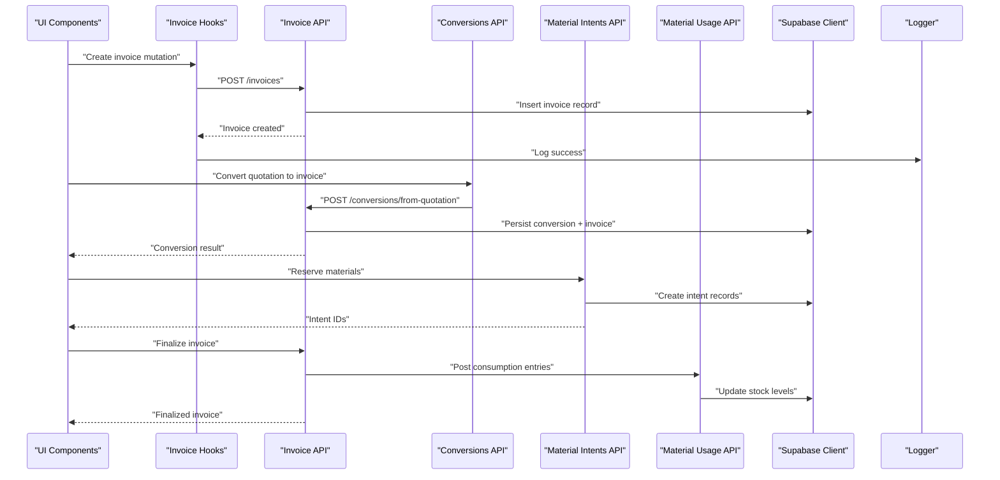

**Diagram sources**
- [src/invoices/api.ts](file://src/invoices/api.ts)
- [src/conversions/api.ts](file://src/conversions/api.ts)
- [src/material-intents/api.ts](file://src/material-intents/api.ts)
- [src/material-usage/api.ts](file://src/material-usage/api.ts)
- [src/supabase/client.ts](file://src/supabase/client.ts)
- [src/lib/logger.tsx](file://src/lib/logger.tsx)

## Detailed Component Analysis

### Invoice API Endpoints and Status Updates
- Create Invoice: POST /invoices with validated payload; returns created invoice ID and status.
- Update Invoice: PATCH /invoices/:id for partial updates; supports status transitions.
- Get Invoice: GET /invoices/:id for retrieval with related items and totals.
- Delete Invoice: DELETE /invoices/:id with soft-delete semantics where applicable.
- Status Transitions: PUT /invoices/:id/status to move through states like Draft, Sent, Paid, Overdue, Cancelled.

Status update flow ensures idempotency and auditability via logging and database constraints.

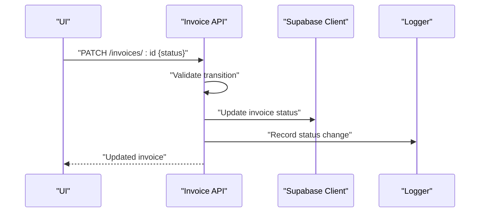

**Diagram sources**
- [src/invoices/api.ts](file://src/invoices/api.ts)
- [src/supabase/client.ts](file://src/supabase/client.ts)
- [src/lib/logger.tsx](file://src/lib/logger.tsx)

**Section sources**
- [src/invoices/api.ts](file://src/invoices/api.ts)
- [src/invoices/types.ts](file://src/invoices/types.ts)
- [src/invoices/logic.ts](file://src/invoices/logic.ts)

### Payment Processing Integrations
- Final Payment Modal: Orchestrates final settlement, including retention release and TDS adjustments.
- Retention Release Panel: Manages release of retained amounts upon milestone completion.
- TDS Payment Panel: Handles tax deduction at source calculations and postings.

These components call invoice API mutations and integrate with project milestones and accounting outputs.

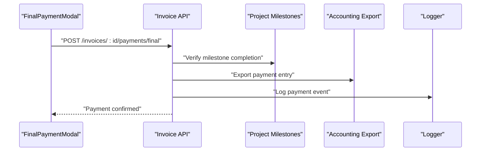

**Diagram sources**
- [src/pages/CreateProjectInvoiceModal.tsx](file://src/pages/CreateProjectInvoiceModal.tsx)
- [src/components/FinalPaymentModal.tsx](file://src/components/FinalPaymentModal.tsx)
- [src/components/RetentionReleasePanel.tsx](file://src/components/RetentionReleasePanel.tsx)
- [src/components/TDSPaymentPanel.tsx](file://src/components/TDSPaymentPanel.tsx)
- [src/invoices/api.ts](file://src/invoices/api.ts)
- [src/lib/logger.tsx](file://src/lib/logger.tsx)

**Section sources**
- [src/pages/CreateProjectInvoiceModal.tsx](file://src/pages/CreateProjectInvoiceModal.tsx)
- [src/components/FinalPaymentModal.tsx](file://src/components/FinalPaymentModal.tsx)
- [src/components/RetentionReleasePanel.tsx](file://src/components/RetentionReleasePanel.tsx)
- [src/components/TDSPaymentPanel.tsx](file://src/components/TDSPaymentPanel.tsx)
- [src/invoices/api.ts](file://src/invoices/api.ts)

### Material Consumption Tracking Integration
- Automatic Stock Deductions: When an invoice is finalized or delivered, stock deduction utility posts consumption entries via Material Usage API.
- Material Intents: Reservations created before invoicing ensure availability checks and prevent over-allocation.
- Usage Reporting: MaterialConsumptionReport and MaterialUsageTracker pages visualize consumption trends and reconcile against intents.

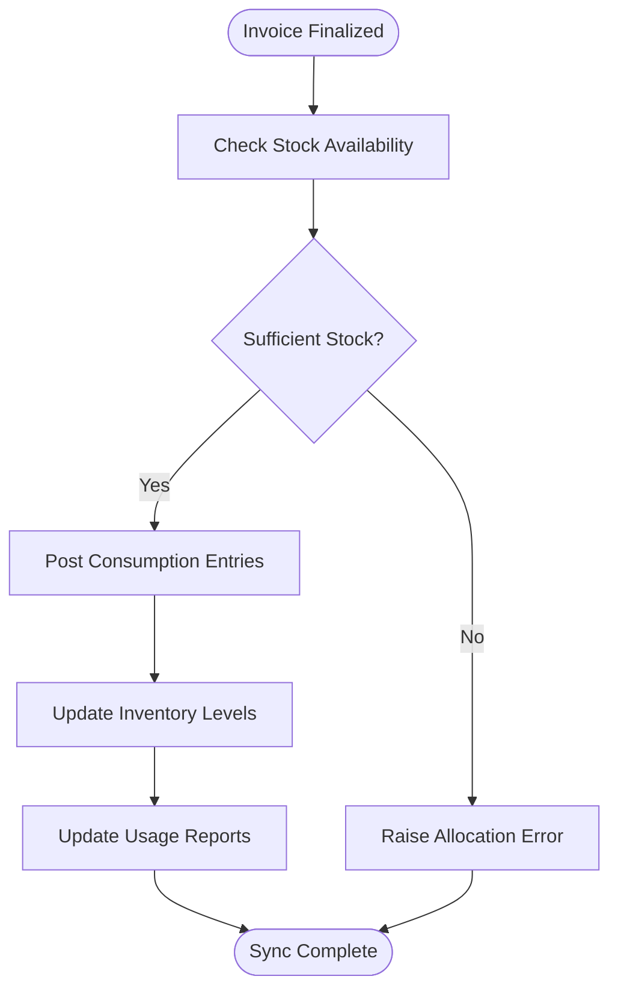

**Diagram sources**
- [src/invoices/stock-deduction/index.ts](file://src/invoices/stock-deduction/index.ts)
- [src/material-intents/api.ts](file://src/material-intents/api.ts)
- [src/material-usage/api.ts](file://src/material-usage/api.ts)
- [src/pages/MaterialConsumptionReport.tsx](file://src/pages/MaterialConsumptionReport.tsx)
- [src/pages/MaterialUsageTracker.tsx](file://src/pages/MaterialUsageTracker.tsx)

**Section sources**
- [src/invoices/stock-deduction/index.ts](file://src/invoices/stock-deduction/index.ts)
- [src/material-intents/api.ts](file://src/material-intents/api.ts)
- [src/material-usage/api.ts](file://src/material-usage/api.ts)
- [src/pages/MaterialConsumptionReport.tsx](file://src/pages/MaterialConsumptionReport.tsx)
- [src/pages/MaterialUsageTracker.tsx](file://src/pages/MaterialUsageTracker.tsx)

### Conversion Workflows: Quotations, Proforma Invoices, Purchase Orders
- Quotation to Invoice: Converts approved quotations into invoices, preserving line items, pricing, and taxes.
- Proforma to Invoice: Transforms proforma invoices into formal invoices with updated statuses and references.
- Purchase Order to Invoice: Links POs to invoices for vendor billing reconciliation.

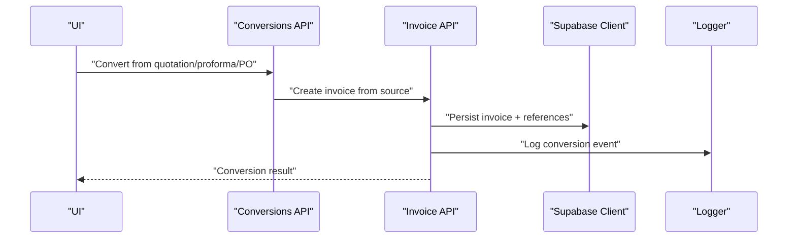

**Diagram sources**
- [src/conversions/api.ts](file://src/conversions/api.ts)
- [src/conversions/hooks.ts](file://src/conversions/hooks.ts)
- [src/conversions/types.ts](file://src/conversions/types.ts)
- [src/proforma-invoices/api.ts](file://src/proforma-invoices/api.ts)
- [src/invoices/api.ts](file://src/invoices/api.ts)
- [src/supabase/client.ts](file://src/supabase/client.ts)
- [src/lib/logger.tsx](file://src/lib/logger.tsx)

**Section sources**
- [src/conversions/api.ts](file://src/conversions/api.ts)
- [src/conversions/hooks.ts](file://src/conversions/hooks.ts)
- [src/conversions/types.ts](file://src/conversions/types.ts)
- [src/proforma-invoices/api.ts](file://src/proforma-invoices/api.ts)
- [src/invoices/api.ts](file://src/invoices/api.ts)

### Real-Time Data Synchronization
- Polling: useAsyncInterval periodically refreshes invoice lists and statuses.
- Request Manager: useRequestManager centralizes retries, exponential backoff, and cancellation.
- Query Client: queryClient configures cache lifetimes, refetch policies, and optimistic updates.

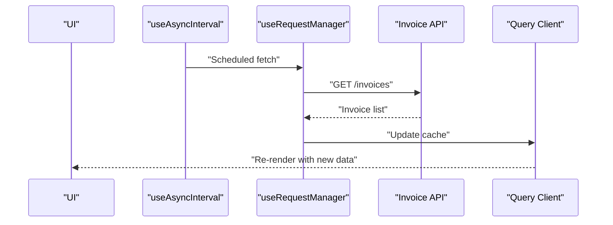

**Diagram sources**
- [src/hooks/useAsyncInterval.ts](file://src/hooks/useAsyncInterval.ts)
- [src/hooks/useRequestManager.ts](file://src/hooks/useRequestManager.ts)
- [src/queryClient.ts](file://src/queryClient.ts)
- [src/invoices/api.ts](file://src/invoices/api.ts)

**Section sources**
- [src/hooks/useAsyncInterval.ts](file://src/hooks/useAsyncInterval.ts)
- [src/hooks/useRequestManager.ts](file://src/hooks/useRequestManager.ts)
- [src/queryClient.ts](file://src/queryClient.ts)
- [src/invoices/api.ts](file://src/invoices/api.ts)

### Error Handling Strategies and Retry Mechanisms
- Centralized Logging: All critical operations log successes and failures for traceability.
- Retry Policies: Exponential backoff with jitter for transient errors; circuit breaker patterns for persistent failures.
- Idempotency Keys: Ensure safe retries without duplicating side effects (e.g., stock deductions).

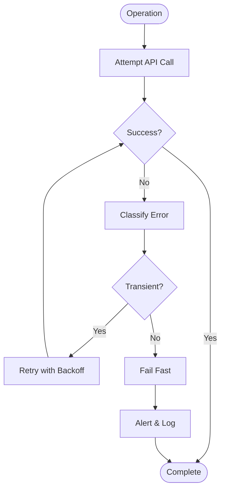

**Diagram sources**
- [src/hooks/useRequestManager.ts](file://src/hooks/useRequestManager.ts)
- [src/lib/logger.tsx](file://src/lib/logger.tsx)

**Section sources**
- [src/hooks/useRequestManager.ts](file://src/hooks/useRequestManager.ts)
- [src/lib/logger.tsx](file://src/lib/logger.tsx)

### Project Management Integration (Milestone-Based Billing)
- Milestone Verification: Before finalizing payments, verify milestone completion via project APIs.
- Billing Triggers: Milestone achievements trigger invoice creation or payment scheduling.
- Audit Trail: Link invoices to milestones for financial reporting and compliance.

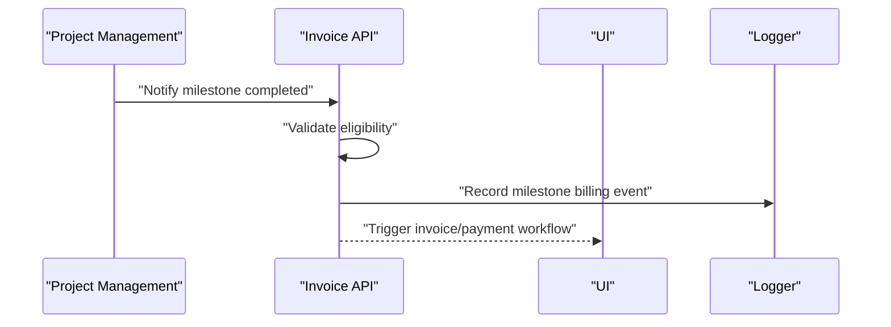

**Diagram sources**
- [src/invoices/api.ts](file://src/invoices/api.ts)
- [src/lib/logger.tsx](file://src/lib/logger.tsx)

**Section sources**
- [src/invoices/api.ts](file://src/invoices/api.ts)
- [src/lib/logger.tsx](file://src/lib/logger.tsx)

### Client Communication Systems (Automated Notifications)
- Notification Triggers: Invoice status changes (Sent, Paid, Overdue) trigger automated messages.
- Channels: Email, SMS, or in-app notifications based on client preferences.
- Delivery Tracking: Logs track delivery status and retries for failed sends.

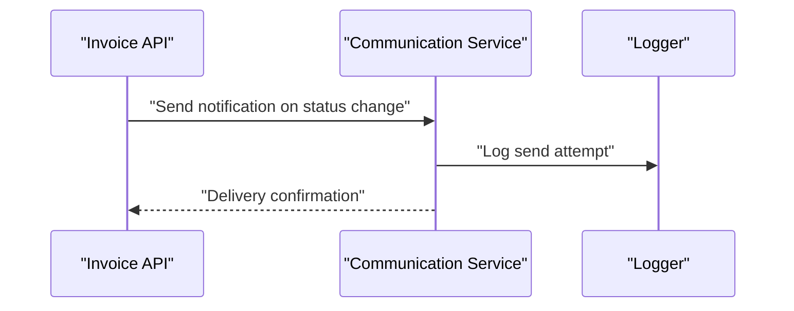

**Diagram sources**
- [src/invoices/api.ts](file://src/invoices/api.ts)
- [src/lib/logger.tsx](file://src/lib/logger.tsx)

**Section sources**
- [src/invoices/api.ts](file://src/invoices/api.ts)
- [src/lib/logger.tsx](file://src/lib/logger.tsx)

### Accounting Software Integration (Financial Reporting)
- Export Jobs: Invoice and payment events export to accounting systems (e.g., Zoho Books, Tally) via scheduled jobs.
- Mapping Rules: Line item mappings, tax codes, and account heads are configured centrally.
- Reconciliation: Periodic reconciliation compares exported entries with internal records.

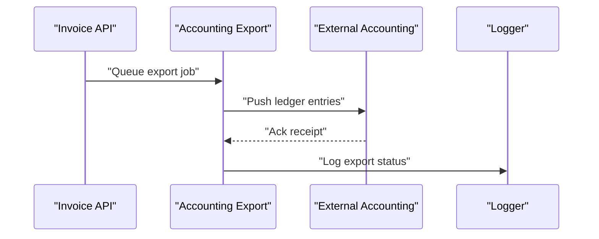

**Diagram sources**
- [src/invoices/api.ts](file://src/invoices/api.ts)
- [src/lib/logger.tsx](file://src/lib/logger.tsx)

**Section sources**
- [src/invoices/api.ts](file://src/invoices/api.ts)
- [src/lib/logger.tsx](file://src/lib/logger.tsx)

## Dependency Analysis
The invoicing system depends on shared infrastructure and cross-module APIs. Coupling is minimized through well-defined interfaces and event-driven patterns.

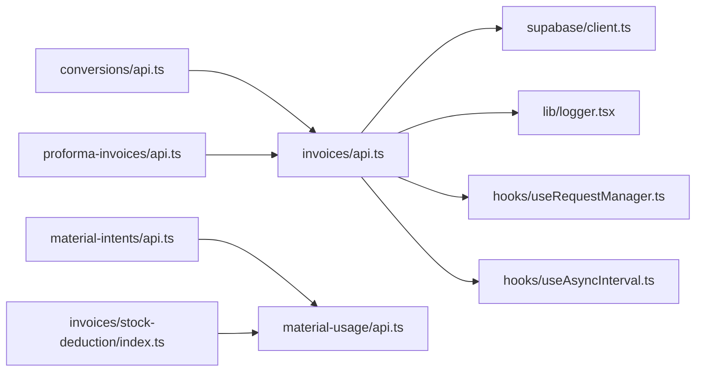

**Diagram sources**
- [src/invoices/api.ts](file://src/invoices/api.ts)
- [src/conversions/api.ts](file://src/conversions/api.ts)
- [src/proforma-invoices/api.ts](file://src/proforma-invoices/api.ts)
- [src/material-intents/api.ts](file://src/material-intents/api.ts)
- [src/material-usage/api.ts](file://src/material-usage/api.ts)
- [src/invoices/stock-deduction/index.ts](file://src/invoices/stock-deduction/index.ts)
- [src/supabase/client.ts](file://src/supabase/client.ts)
- [src/hooks/useRequestManager.ts](file://src/hooks/useRequestManager.ts)
- [src/hooks/useAsyncInterval.ts](file://src/hooks/useAsyncInterval.ts)
- [src/lib/logger.tsx](file://src/lib/logger.tsx)

**Section sources**
- [src/invoices/api.ts](file://src/invoices/api.ts)
- [src/conversions/api.ts](file://src/conversions/api.ts)
- [src/proforma-invoices/api.ts](file://src/proforma-invoices/api.ts)
- [src/material-intents/api.ts](file://src/material-intents/api.ts)
- [src/material-usage/api.ts](file://src/material-usage/api.ts)
- [src/invoices/stock-deduction/index.ts](file://src/invoices/stock-deduction/index.ts)
- [src/supabase/client.ts](file://src/supabase/client.ts)
- [src/hooks/useRequestManager.ts](file://src/hooks/useRequestManager.ts)
- [src/hooks/useAsyncInterval.ts](file://src/hooks/useAsyncInterval.ts)
- [src/lib/logger.tsx](file://src/lib/logger.tsx)

## Performance Considerations
- Caching Strategy: Use queryClient to cache invoice lists and details; configure stale times and refetch intervals based on volatility.
- Batch Operations: Group stock deductions and usage postings to reduce database round-trips.
- Pagination and Virtualization: For large invoice lists, implement server-side pagination and virtualized rendering.
- Idempotent Mutations: Ensure retries do not duplicate side effects; leverage idempotency keys for critical operations.
- Monitoring: Track latency and error rates for API calls; alert on anomalies.

[No sources needed since this section provides general guidance]

## Troubleshooting Guide
Common issues and resolutions:
- Network Timeouts: Increase retry limits and backoff parameters; check network connectivity and server health.
- Duplicate Records: Verify idempotency keys and transaction boundaries; review logs for duplicate attempts.
- Stock Mismatches: Inspect material intents vs. usage entries; reconcile discrepancies using consumption reports.
- Status Transition Errors: Validate state machine rules; ensure required prerequisites (e.g., approvals) are met.
- Export Failures: Check accounting mapping configurations; re-run export jobs with detailed logs.

**Section sources**
- [src/hooks/useRequestManager.ts](file://src/hooks/useRequestManager.ts)
- [src/lib/logger.tsx](file://src/lib/logger.tsx)
- [src/pages/MaterialConsumptionReport.tsx](file://src/pages/MaterialConsumptionReport.tsx)
- [src/pages/MaterialUsageTracker.tsx](file://src/pages/MaterialUsageTracker.tsx)

## Conclusion
The Invoicing System integrates tightly with material consumption tracking, project management, client communications, and accounting software. Robust error handling, retries, and real-time synchronization ensure reliable operations. Clear API contracts and modular design facilitate maintenance and extension.

[No sources needed since this section summarizes without analyzing specific files]

## Appendices

### Database Schema References
- Invoice tables and relationships
- Proforma invoice schema
- Quotation conversion mappings
- Material intents enhancements

**Section sources**
- [src/database/database-complete.sql](file://src/database/database-complete.sql)
- [src/database/database-proforma-invoices.sql](file://src/database/database-proforma-invoices.sql)
- [src/database/database-quotation-conversions.sql](file://src/database/database-quotation-conversions.sql)
- [src/database/database-material-intents-enhancement.sql](file://src/database/database-material-intents-enhancement.sql)