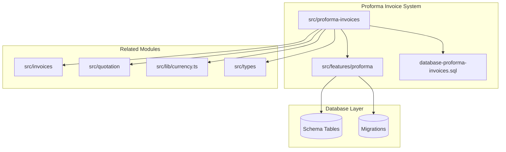
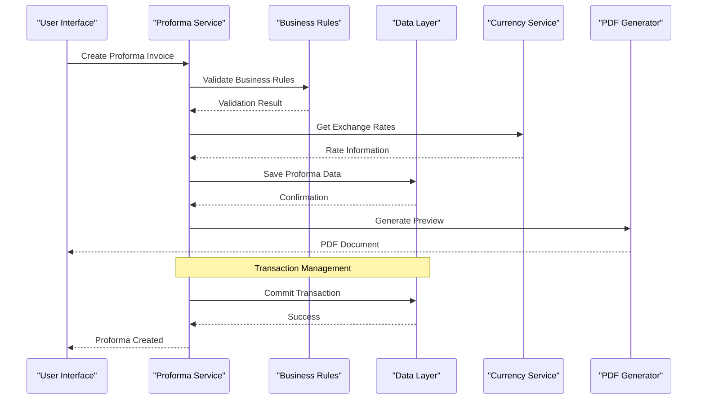
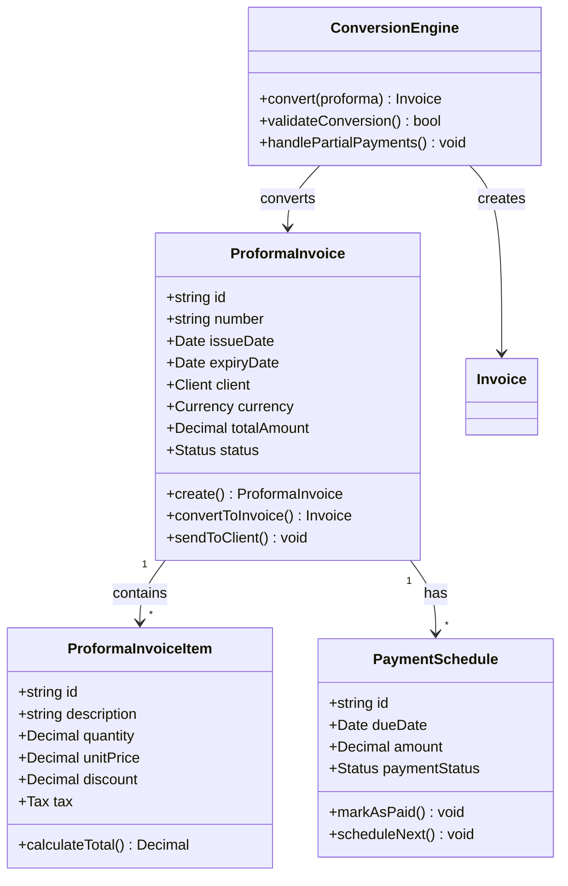
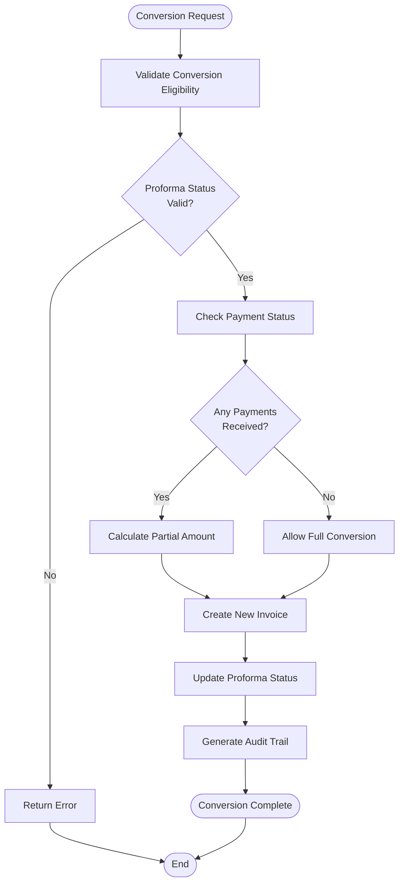
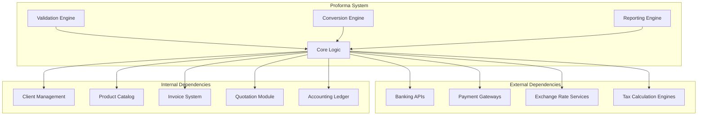

# Proforma Invoices

<cite>
**Referenced Files in This Document**
- [database-proforma-invoices.sql](file://database-proforma-invoices.sql)
- [src/proforma-invoices](file://src/proforma-invoices)
- [src/features/proforma](file://src/features/proforma)
- [src/invoices](file://src/invoices)
- [src/quotation](file://src/quotation)
- [src/lib/currency.ts](file://src/lib/currency.ts)
- [src/types](file://src/types)
</cite>

## Table of Contents
1. [Introduction](#introduction)
2. [Project Structure](#project-structure)
3. [Core Components](#core-components)
4. [Architecture Overview](#architecture-overview)
5. [Detailed Component Analysis](#detailed-component-analysis)
6. [Dependency Analysis](#dependency-analysis)
7. [Performance Considerations](#performance-considerations)
8. [Troubleshooting Guide](#troubleshooting-guide)
9. [Conclusion](#conclusion)
10. [Appendices](#appendices)

## Introduction

Proforma invoices serve as preliminary billing documents used in various business scenarios including advance payments, quotation conversions, and pre-invoicing situations. This system provides comprehensive functionality for creating, managing, and converting proforma invoices while maintaining full integration with the broader accounting and sales workflow.

The proforma invoice system supports international trade compliance, multi-currency handling, automated payment reconciliation, and seamless conversion to formal invoices when payments are received or milestones are achieved.

## Project Structure

The proforma invoice system is organized across multiple directories and modules:

**Diagram sources**
- [database-proforma-invoices.sql](file://database-proforma-invoices.sql)
- [src/proforma-invoices](file://src/proforma-invoices)
- [src/features/proforma](file://src/features/proforma)

**Section sources**
- [database-proforma-invoices.sql](file://database-proforma-invoices.sql)
- [src/proforma-invoices](file://src/proforma-invoices)

## Core Components

### Proforma Invoice Data Model

The proforma invoice system is built around a comprehensive data model that captures all essential information for advance billing scenarios:

#### Key Entities
- **ProformaInvoice**: Main entity containing invoice header information, client details, and financial calculations
- **ProformaInvoiceItem**: Line items with product/service details, quantities, pricing, and tax information
- **PaymentSchedule**: Milestone-based payment tracking for long-term projects
- **ConversionHistory**: Audit trail for proforma to invoice conversions

#### Financial Calculations
- Multi-currency support with exchange rate management
- Tax calculation engine supporting various jurisdictions
- Discount application at both line and document levels
- Payment term processing and due date calculations

### Creation Workflows

The system supports multiple creation scenarios:

#### Direct Proforma Creation
- Manual entry through dedicated interface
- Template-based generation from existing quotations
- Bulk creation from project milestones

#### Quotation Conversion
- One-click conversion from approved quotations
- Automatic data mapping and validation
- Revision history preservation

#### Advance Payment Processing
- Deposit collection workflows
- Partial payment tracking
- Refund handling capabilities

**Section sources**
- [database-proforma-invoices.sql](file://database-proforma-invoices.sql)
- [src/features/proforma](file://src/features/proforma)

## Architecture Overview

The proforma invoice system follows a modular architecture pattern with clear separation of concerns:

**Diagram sources**
- [src/features/proforma](file://src/features/proforma)
- [src/lib/currency.ts](file://src/lib/currency.ts)

### Component Relationships

**Diagram sources**
- [src/features/proforma](file://src/features/proforma)
- [src/invoices](file://src/invoices)

## Detailed Component Analysis

### Proforma Invoice Creation Engine

The creation engine handles the complex logic involved in generating valid proforma invoices:

#### Input Validation
- Client existence and credit limit verification
- Product/service availability checks
- Pricing validation against current catalogs
- Tax jurisdiction determination

#### Business Rule Enforcement
- Minimum/maximum invoice amounts
- Approval workflow triggers
- Duplicate detection mechanisms
- Expiry date calculations

#### Template Processing
- Dynamic content insertion
- Branding customization
- Multi-language support
- Regulatory compliance formatting

### Conversion Workflow

The proforma-to-invoice conversion process ensures data integrity and audit compliance:

**Diagram sources**
- [src/features/proforma](file://src/features/proforma)
- [src/invoices](file://src/invoices)

### Payment Tracking System

Advanced payment tracking capabilities support complex billing scenarios:

#### Milestone Billing
- Automated milestone detection
- Progress-based payment scheduling
- Completion verification workflows
- Retention amount handling

#### Partial Payment Processing
- Multiple payment recording
- Allocation strategy configuration
- Overpayment handling
- Underpayment notifications

#### Integration Points
- Banking API connections
- Payment gateway integration
- Accounting software sync
- Tax authority reporting

**Section sources**
- [src/features/proforma](file://src/features/proforma)
- [src/invoices](file://src/invoices)

### Currency and Exchange Rate Management

The system provides robust international currency support:

#### Exchange Rate Sources
- Real-time rate fetching from multiple providers
- Historical rate storage and retrieval
- Manual rate override capabilities
- Rate validity period management

#### Multi-Currency Operations
- Native currency conversion
- Rounding rule configuration
- Gain/loss calculation
- Reporting in multiple currencies

#### Compliance Features
- Central Bank rate adherence
- Tax jurisdiction specific rules
- Audit trail for rate changes
- Regulatory reporting formats

**Section sources**
- [src/lib/currency.ts](file://src/lib/currency.ts)

## Dependency Analysis

The proforma invoice system maintains clean dependencies while integrating with core business modules:

**Diagram sources**
- [src/features/proforma](file://src/features/proforma)
- [src/invoices](file://src/invoices)

### Coupling Analysis

The system demonstrates low coupling between components through well-defined interfaces:

- **Service Layer Abstraction**: All external integrations go through service interfaces
- **Event-Driven Architecture**: Loose coupling via event publishing/subscribing
- **Configuration-Driven Behavior**: Runtime configuration without code changes
- **Plugin Architecture**: Extensible validation and conversion rules

**Section sources**
- [src/features/proforma](file://src/features/proforma)

## Performance Considerations

### Database Optimization
- Indexed queries for frequently accessed fields
- Connection pooling for database operations
- Batch processing for bulk operations
- Read replicas for reporting queries

### Caching Strategies
- Exchange rate caching with TTL
- Product catalog caching
- Client information caching
- Template rendering caching

### Memory Management
- Stream processing for large documents
- Lazy loading of related entities
- Garbage collection optimization
- Memory leak prevention

### Scalability Patterns
- Horizontal scaling support
- Load balancing readiness
- Stateless service design
- Distributed transaction handling

## Troubleshooting Guide

### Common Issues and Solutions

#### Conversion Failures
- Verify proforma status and payment records
- Check for missing required fields
- Validate currency compatibility
- Review approval workflow status

#### Payment Reconciliation Problems
- Confirm bank statement matching rules
- Verify payment reference numbers
- Check for duplicate payment entries
- Validate exchange rate timestamps

#### Currency Conversion Errors
- Ensure exchange rate provider connectivity
- Verify rate validity periods
- Check rounding configuration
- Validate target currency support

#### Performance Issues
- Monitor database query performance
- Check cache hit ratios
- Review memory usage patterns
- Analyze API response times

### Debug Tools
- Comprehensive logging framework
- Performance monitoring dashboards
- Error tracking and alerting
- Audit trail analysis tools

**Section sources**
- [src/features/proforma](file://src/features/proforma)

## Conclusion

The proforma invoice system provides a comprehensive solution for advance billing scenarios with robust features for international trade, multi-currency operations, and seamless integration with existing business processes. The modular architecture ensures maintainability and scalability while providing extensive customization options for different business requirements.

Key strengths include:
- Flexible creation workflows supporting multiple business scenarios
- Robust currency and exchange rate management
- Comprehensive payment tracking and reconciliation
- Strong audit trails and compliance features
- Extensive integration capabilities with banking and accounting systems

The system is designed to grow with business needs while maintaining high performance and reliability standards.

## Appendices

### A. API Reference

#### Proforma Invoice Endpoints
- `POST /api/proforma/create` - Create new proforma invoice
- `PUT /api/proforma/{id}/update` - Update existing proforma
- `POST /api/proforma/{id}/convert` - Convert to invoice
- `GET /api/proforma/{id}/payments` - Get payment history
- `POST /api/proforma/{id}/payments` - Record payment

#### Payment Management
- `POST /api/payments/record` - Record payment against proforma
- `GET /api/payments/reconcile` - Reconcile bank statements
- `POST /api/payments/refund` - Process refund

### B. Configuration Options

#### Business Rules Configuration
- Minimum invoice amounts
- Approval thresholds
- Payment term defaults
- Tax calculation rules

#### Integration Settings
- Banking API credentials
- Exchange rate provider settings
- Email template configurations
- PDF generation options

### C. Migration Guide

#### Version Upgrades
- Database schema migrations
- Configuration updates
- Data transformation scripts
- Rollback procedures

#### Customization Examples
- Template customization
- Business rule extensions
- Integration plugins
- Report modifications