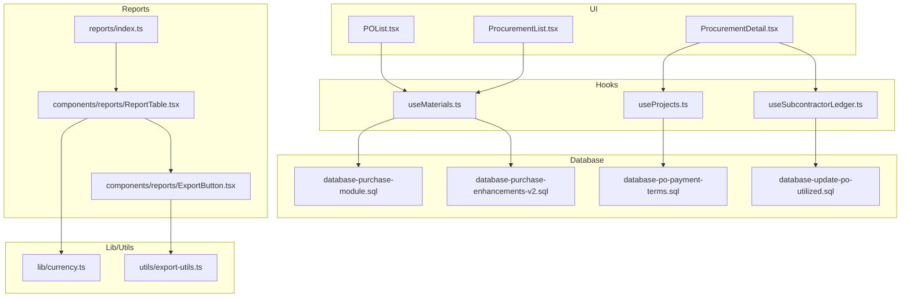
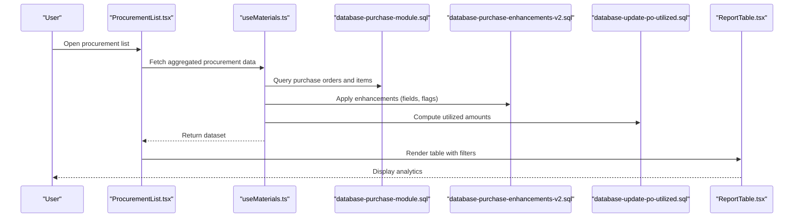
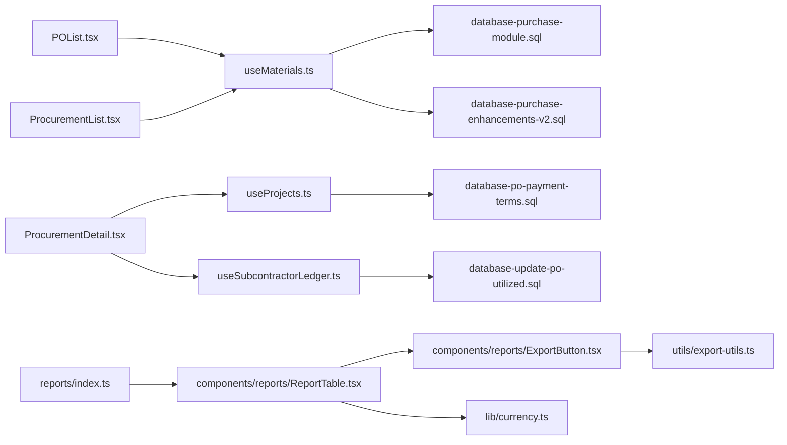
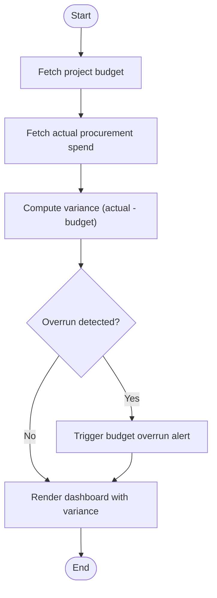

# Analytics & Reporting

<cite>
**Referenced Files in This Document**
- [POList.tsx](file://src/pages/POList.tsx)
- [ProcurementList.tsx](file://src/pages/ProcurementList.tsx)
- [ProcurementDetail.tsx](file://src/pages/ProcurementDetail.tsx)
- [PurchaseEnhancementsV2.sql](file://src/database-purchase-enhancements-v2.sql)
- [database-purchase-module.sql](file://src/database-purchase-module.sql)
- [database-po-payment-terms.sql](file://src/database-po-payment-terms.sql)
- [database-update-po-utilized.sql](file://src/database-update-po-utilized.sql)
- [useMaterials.ts](file://src/hooks/useMaterials.ts)
- [useProjects.ts](file://src/hooks/useProjects.ts)
- [useSubcontractorLedger.ts](file://src/hooks/useSubcontractorLedger.ts)
- [reports/index.ts](file://src/reports/index.ts)
- [components/reports/ReportTable.tsx](file://src/components/reports/ReportTable.tsx)
- [components/reports/ExportButton.tsx](file://src/components/reports/ExportButton.tsx)
- [lib/currency.ts](file://src/lib/currency.ts)
- [utils/export-utils.ts](file://src/utils/export-utils.ts)
</cite>

## Table of Contents
1. [Introduction](#introduction)
2. [Project Structure](#project-structure)
3. [Core Components](#core-components)
4. [Architecture Overview](#architecture-overview)
5. [Detailed Component Analysis](#detailed-component-analysis)
6. [Dependency Analysis](#dependency-analysis)
7. [Performance Considerations](#performance-considerations)
8. [Troubleshooting Guide](#troubleshooting-guide)
9. [Conclusion](#conclusion)
10. [Appendices](#appendices)

## Introduction
This document describes the purchase order analytics and reporting capabilities available in the application, focusing on:
- Spending analysis across vendors, projects, and time periods
- Vendor performance dashboards and procurement efficiency metrics
- Budget vs actual comparisons and cost savings tracking
- Trend analysis and custom report generation with export options
- Scheduled reporting and real-time dashboards with alerting for budget overruns
- Practical examples such as identifying cost optimization opportunities, vendor consolidation analysis, and measuring procurement cycle time

The goal is to provide both a high-level overview and detailed implementation references so that users and developers can understand how analytics are computed, presented, and extended.

## Project Structure
Analytics and reporting for purchase orders span UI pages, hooks for data access, database schema enhancements, and reusable report components. The key areas include:
- Pages for listing and drilling into procurement data
- Hooks for fetching materials, projects, and ledger data used by reports
- Database migrations that add or enhance purchase-related fields and utilization tracking
- Reusable report table and export utilities

**Diagram sources**
- [POList.tsx](file://src/pages/POList.tsx)
- [ProcurementList.tsx](file://src/pages/ProcurementList.tsx)
- [ProcurementDetail.tsx](file://src/pages/ProcurementDetail.tsx)
- [useMaterials.ts](file://src/hooks/useMaterials.ts)
- [useProjects.ts](file://src/hooks/useProjects.ts)
- [useSubcontractorLedger.ts](file://src/hooks/useSubcontractorLedger.ts)
- [database-purchase-module.sql](file://src/database-purchase-module.sql)
- [database-purchase-enhancements-v2.sql](file://src/database-purchase-enhancements-v2.sql)
- [database-po-payment-terms.sql](file://src/database-po-payment-terms.sql)
- [database-update-po-utilized.sql](file://src/database-update-po-utilized.sql)
- [reports/index.ts](file://src/reports/index.ts)
- [components/reports/ReportTable.tsx](file://src/components/reports/ReportTable.tsx)
- [components/reports/ExportButton.tsx](file://src/components/reports/ExportButton.tsx)
- [lib/currency.ts](file://src/lib/currency.ts)
- [utils/export-utils.ts](file://src/utils/export-utils.ts)

**Section sources**
- [POList.tsx](file://src/pages/POList.tsx)
- [ProcurementList.tsx](file://src/pages/ProcurementList.tsx)
- [ProcurementDetail.tsx](file://src/pages/ProcurementDetail.tsx)
- [useMaterials.ts](file://src/hooks/useMaterials.ts)
- [useProjects.ts](file://src/hooks/useProjects.ts)
- [useSubcontractorLedger.ts](file://src/hooks/useSubcontractorLedger.ts)
- [database-purchase-module.sql](file://src/database-purchase-module.sql)
- [database-purchase-enhancements-v2.sql](file://src/database-purchase-enhancements-v2.sql)
- [database-po-payment-terms.sql](file://src/database-po-payment-terms.sql)
- [database-update-po-utilized.sql](file://src/database-update-po-utilized.sql)
- [reports/index.ts](file://src/reports/index.ts)
- [components/reports/ReportTable.tsx](file://src/components/reports/ReportTable.tsx)
- [components/reports/ExportButton.tsx](file://src/components/reports/ExportButton.tsx)
- [lib/currency.ts](file://src/lib/currency.ts)
- [utils/export-utils.ts](file://src/utils/export-utils.ts)

## Core Components
- Purchase Order List (POList): Provides filtering, sorting, and summary views of purchase orders. It serves as the entry point for spending analysis and trend exploration.
- Procurement List (ProcurementList): Aggregates procurement events (orders, receipts, invoices) to support vendor performance and cycle time metrics.
- Procurement Detail (ProcurementDetail): Drills into specific procurement records, linking project budgets and payment terms to enable budget vs actual comparisons.
- Reports Index (reports/index.ts): Centralizes report definitions and routing for analytics pages.
- Report Table (components/reports/ReportTable.tsx): Reusable table component for rendering analytical datasets with pagination and filters.
- Export Button (components/reports/ExportButton.tsx): Triggers export actions using shared export utilities.

These components collaborate with hooks and database layers to compute and present analytics.

**Section sources**
- [POList.tsx](file://src/pages/POList.tsx)
- [ProcurementList.tsx](file://src/pages/ProcurementList.tsx)
- [ProcurementDetail.tsx](file://src/pages/ProcurementDetail.tsx)
- [reports/index.ts](file://src/reports/index.ts)
- [components/reports/ReportTable.tsx](file://src/components/reports/ReportTable.tsx)
- [components/reports/ExportButton.tsx](file://src/components/reports/ExportButton.tsx)

## Architecture Overview
The analytics architecture follows a layered approach:
- Presentation layer: Pages render tables and charts, applying filters and aggregations.
- Data access layer: Hooks fetch normalized data from the database and cache results.
- Schema layer: SQL migrations define purchase-related entities, payment terms, and utilization fields.
- Utilities: Currency formatting and export utilities standardize outputs.

**Diagram sources**
- [ProcurementList.tsx](file://src/pages/ProcurementList.tsx)
- [useMaterials.ts](file://src/hooks/useMaterials.ts)
- [database-purchase-module.sql](file://src/database-purchase-module.sql)
- [database-purchase-enhancements-v2.sql](file://src/database-purchase-enhancements-v2.sql)
- [database-update-po-utilized.sql](file://src/database-update-po-utilized.sql)
- [components/reports/ReportTable.tsx](file://src/components/reports/ReportTable.tsx)

## Detailed Component Analysis

### Spending Analysis
Spending analysis aggregates purchase orders by vendor, project, category, and date range. Key capabilities:
- Total spend per vendor and project
- Spend trends over time (monthly/quarterly)
- Category breakdowns and top spenders
- Filters for date ranges, statuses, and tags

Implementation highlights:
- Aggregation logic is driven by hooks querying purchase modules and enhancements.
- Currency formatting ensures consistent display across regions.

Example usage paths:
- [POList.tsx](file://src/pages/POList.tsx)
- [useMaterials.ts](file://src/hooks/useMaterials.ts)
- [database-purchase-module.sql](file://src/database-purchase-module.sql)
- [database-purchase-enhancements-v2.sql](file://src/database-purchase-enhancements-v2.sql)
- [lib/currency.ts](file://src/lib/currency.ts)

**Section sources**
- [POList.tsx](file://src/pages/POList.tsx)
- [useMaterials.ts](file://src/hooks/useMaterials.ts)
- [database-purchase-module.sql](file://src/database-purchase-module.sql)
- [database-purchase-enhancements-v2.sql](file://src/database-purchase-enhancements-v2.sql)
- [lib/currency.ts](file://src/lib/currency.ts)

### Vendor Performance Dashboards
Vendor performance dashboards evaluate reliability and quality based on:
- On-time delivery rates
- Price variance against benchmarks
- Defect/return rates (if tracked)
- Average lead times

Data sources:
- Procurement list aggregates receipt and invoice timestamps
- Payment terms inform expected vs actual settlement dates
- Utilization fields help correlate spend with consumption

Example usage paths:
- [ProcurementList.tsx](file://src/pages/ProcurementList.tsx)
- [useMaterials.ts](file://src/hooks/useMaterials.ts)
- [database-po-payment-terms.sql](file://src/database-po-payment-terms.sql)
- [database-update-po-utilized.sql](file://src/database-update-po-utilized.sql)

**Section sources**
- [ProcurementList.tsx](file://src/pages/ProcurementList.tsx)
- [useMaterials.ts](file://src/hooks/useMaterials.ts)
- [database-po-payment-terms.sql](file://src/database-po-payment-terms.sql)
- [database-update-po-utilized.sql](file://src/database-update-po-utilized.sql)

### Procurement Efficiency Metrics
Efficiency metrics focus on cycle time and process bottlenecks:
- End-to-end cycle time from requisition to receipt/invoice
- Approval duration and rework loops
- Average days to close purchase orders

Measurement approach:
- Timestamps captured at key stages (creation, approval, receipt, invoicing)
- Aggregated via hooks and rendered in report tables

Example usage paths:
- [ProcurementDetail.tsx](file://src/pages/ProcurementDetail.tsx)
- [useProjects.ts](file://src/hooks/useProjects.ts)
- [useSubcontractorLedger.ts](file://src/hooks/useSubcontractorLedger.ts)

**Section sources**
- [ProcurementDetail.tsx](file://src/pages/ProcurementDetail.tsx)
- [useProjects.ts](file://src/hooks/useProjects.ts)
- [useSubcontractorLedger.ts](file://src/hooks/useSubcontractorLedger.ts)

### Budget vs Actual Comparisons
Budget vs actual comparisons link project budgets to procurement spend:
- Budget baseline defined at project level
- Actual spend derived from approved purchase orders and receipts
- Variance calculated and highlighted for overruns

Integration points:
- Project hooks supply budget figures
- Procurement detail links POs to projects
- Payment terms and utilization refine actuals

Example usage paths:
- [ProcurementDetail.tsx](file://src/pages/ProcurementDetail.tsx)
- [useProjects.ts](file://src/hooks/useProjects.ts)
- [database-po-payment-terms.sql](file://src/database-po-payment-terms.sql)
- [database-update-po-utilized.sql](file://src/database-update-po-utilized.sql)

**Section sources**
- [ProcurementDetail.tsx](file://src/pages/ProcurementDetail.tsx)
- [useProjects.ts](file://src/hooks/useProjects.ts)
- [database-po-payment-terms.sql](file://src/database-po-payment-terms.sql)
- [database-update-po-utilized.sql](file://src/database-update-po-utilized.sql)

### Cost Savings Tracking
Cost savings tracking identifies reductions through:
- Negotiated price improvements versus historical averages
- Consolidated purchases leveraging volume discounts
- Substitutions with lower-cost alternatives

Computation:
- Compare current PO line item rates against last quoted or benchmark rates
- Aggregate savings by vendor, category, and period

Example usage paths:
- [POList.tsx](file://src/pages/POList.tsx)
- [useMaterials.ts](file://src/hooks/useMaterials.ts)
- [database-purchase-enhancements-v2.sql](file://src/database-purchase-enhancements-v2.sql)

**Section sources**
- [POList.tsx](file://src/pages/POList.tsx)
- [useMaterials.ts](file://src/hooks/useMaterials.ts)
- [database-purchase-enhancements-v2.sql](file://src/database-purchase-enhancements-v2.sql)

### Trend Analysis
Trend analysis visualizes spend patterns and anomalies:
- Monthly/quarterly spend curves
- Seasonal spikes and dips
- Outlier detection for unusual transactions

Rendering:
- Time-series aggregation in hooks
- Chart-ready datasets exported to visualization libraries

Example usage paths:
- [ProcurementList.tsx](file://src/pages/ProcurementList.tsx)
- [useMaterials.ts](file://src/hooks/useMaterials.ts)

**Section sources**
- [ProcurementList.tsx](file://src/pages/ProcurementList.tsx)
- [useMaterials.ts](file://src/hooks/useMaterials.ts)

### Custom Report Generation
Custom report generation allows users to:
- Select dimensions (vendor, project, category, date)
- Choose metrics (total spend, count, average lead time)
- Apply filters and groupings

Implementation:
- Report index centralizes definitions
- Report table renders dynamic columns and summaries

Example usage paths:
- [reports/index.ts](file://src/reports/index.ts)
- [components/reports/ReportTable.tsx](file://src/components/reports/ReportTable.tsx)

**Section sources**
- [reports/index.ts](file://src/reports/index.ts)
- [components/reports/ReportTable.tsx](file://src/components/reports/ReportTable.tsx)

### Export Formats
Export formats supported:
- CSV for tabular data
- Excel-compatible files where applicable
- JSON for programmatic consumption

Mechanism:
- Export button triggers export utilities
- Currency formatting applied before export

Example usage paths:
- [components/reports/ExportButton.tsx](file://src/components/reports/ExportButton.tsx)
- [utils/export-utils.ts](file://src/utils/export-utils.ts)
- [lib/currency.ts](file://src/lib/currency.ts)

**Section sources**
- [components/reports/ExportButton.tsx](file://src/components/reports/ExportButton.tsx)
- [utils/export-utils.ts](file://src/utils/export-utils.ts)
- [lib/currency.ts](file://src/lib/currency.ts)

### Scheduled Reporting
Scheduled reporting automates periodic delivery of analytics:
- Daily/weekly/monthly snapshots of key metrics
- Email or dashboard notifications with attachments

Operational notes:
- Scheduling typically handled by backend jobs or external schedulers
- Frontend provides endpoints and templates for generated reports

Example usage paths:
- [reports/index.ts](file://src/reports/index.ts)
- [components/reports/ReportTable.tsx](file://src/components/reports/ReportTable.tsx)

**Section sources**
- [reports/index.ts](file://src/reports/index.ts)
- [components/reports/ReportTable.tsx](file://src/components/reports/ReportTable.tsx)

### Real-Time Dashboards and Alerting
Real-time dashboards refresh periodically to reflect latest procurement activity:
- Live updates for spend totals and open PO counts
- Alerting for budget overruns and late deliveries

Alerting rules:
- Threshold-based alerts when actual spend exceeds budget
- Notifications triggered upon significant variances

Example usage paths:
- [ProcurementList.tsx](file://src/pages/ProcurementList.tsx)
- [ProcurementDetail.tsx](file://src/pages/ProcurementDetail.tsx)
- [useProjects.ts](file://src/hooks/useProjects.ts)

**Section sources**
- [ProcurementList.tsx](file://src/pages/ProcurementList.tsx)
- [ProcurementDetail.tsx](file://src/pages/ProcurementDetail.tsx)
- [useProjects.ts](file://src/hooks/useProjects.ts)

### Examples

#### Identifying Cost Optimization Opportunities
- Analyze price variance by comparing current PO rates to historical averages
- Identify categories with frequent overruns and negotiate better terms
- Track savings realized through substitutions and consolidations

Reference paths:
- [POList.tsx](file://src/pages/POList.tsx)
- [useMaterials.ts](file://src/hooks/useMaterials.ts)
- [database-purchase-enhancements-v2.sql](file://src/database-purchase-enhancements-v2.sql)

**Section sources**
- [POList.tsx](file://src/pages/POList.tsx)
- [useMaterials.ts](file://src/hooks/useMaterials.ts)
- [database-purchase-enhancements-v2.sql](file://src/database-purchase-enhancements-v2.sql)

#### Vendor Consolidation Analysis
- Evaluate total spend concentration across vendors
- Assess performance consistency and risk exposure
- Recommend consolidation targets based on reliability and pricing

Reference paths:
- [ProcurementList.tsx](file://src/pages/ProcurementList.tsx)
- [useMaterials.ts](file://src/hooks/useMaterials.ts)
- [database-po-payment-terms.sql](file://src/database-po-payment-terms.sql)

**Section sources**
- [ProcurementList.tsx](file://src/pages/ProcurementList.tsx)
- [useMaterials.ts](file://src/hooks/useMaterials.ts)
- [database-po-payment-terms.sql](file://src/database-po-payment-terms.sql)

#### Procurement Cycle Time Measurement
- Measure time from creation to receipt/invoice
- Identify bottlenecks in approvals and receiving
- Benchmark cycle times by vendor and category

Reference paths:
- [ProcurementDetail.tsx](file://src/pages/ProcurementDetail.tsx)
- [useProjects.ts](file://src/hooks/useProjects.ts)
- [useSubcontractorLedger.ts](file://src/hooks/useSubcontractorLedger.ts)

**Section sources**
- [ProcurementDetail.tsx](file://src/pages/ProcurementDetail.tsx)
- [useProjects.ts](file://src/hooks/useProjects.ts)
- [useSubcontractorLedger.ts](file://src/hooks/useSubcontractorLedger.ts)

## Dependency Analysis
The analytics stack depends on cohesive interactions between UI, hooks, and database layers. Coupling is minimized through well-defined interfaces in hooks and reusable report components.

**Diagram sources**
- [POList.tsx](file://src/pages/POList.tsx)
- [ProcurementList.tsx](file://src/pages/ProcurementList.tsx)
- [ProcurementDetail.tsx](file://src/pages/ProcurementDetail.tsx)
- [useMaterials.ts](file://src/hooks/useMaterials.ts)
- [useProjects.ts](file://src/hooks/useProjects.ts)
- [useSubcontractorLedger.ts](file://src/hooks/useSubcontractorLedger.ts)
- [database-purchase-module.sql](file://src/database-purchase-module.sql)
- [database-purchase-enhancements-v2.sql](file://src/database-purchase-enhancements-v2.sql)
- [database-po-payment-terms.sql](file://src/database-po-payment-terms.sql)
- [database-update-po-utilized.sql](file://src/database-update-po-utilized.sql)
- [reports/index.ts](file://src/reports/index.ts)
- [components/reports/ReportTable.tsx](file://src/components/reports/ReportTable.tsx)
- [components/reports/ExportButton.tsx](file://src/components/reports/ExportButton.tsx)
- [utils/export-utils.ts](file://src/utils/export-utils.ts)
- [lib/currency.ts](file://src/lib/currency.ts)

**Section sources**
- [POList.tsx](file://src/pages/POList.tsx)
- [ProcurementList.tsx](file://src/pages/ProcurementList.tsx)
- [ProcurementDetail.tsx](file://src/pages/ProcurementDetail.tsx)
- [useMaterials.ts](file://src/hooks/useMaterials.ts)
- [useProjects.ts](file://src/hooks/useProjects.ts)
- [useSubcontractorLedger.ts](file://src/hooks/useSubcontractorLedger.ts)
- [database-purchase-module.sql](file://src/database-purchase-module.sql)
- [database-purchase-enhancements-v2.sql](file://src/database-purchase-enhancements-v2.sql)
- [database-po-payment-terms.sql](file://src/database-po-payment-terms.sql)
- [database-update-po-utilized.sql](file://src/database-update-po-utilized.sql)
- [reports/index.ts](file://src/reports/index.ts)
- [components/reports/ReportTable.tsx](file://src/components/reports/ReportTable.tsx)
- [components/reports/ExportButton.tsx](file://src/components/reports/ExportButton.tsx)
- [utils/export-utils.ts](file://src/utils/export-utils.ts)
- [lib/currency.ts](file://src/lib/currency.ts)

## Performance Considerations
- Prefer server-side aggregation for large datasets to reduce client load
- Cache frequently accessed analytics using query clients or local storage
- Paginate and virtualize large tables to maintain responsiveness
- Normalize currency values consistently to avoid repeated conversions
- Defer heavy computations until filters stabilize (debounce inputs)

[No sources needed since this section provides general guidance]

## Troubleshooting Guide
Common issues and resolutions:
- Missing fields in reports: Verify database migrations have been applied for purchase enhancements and utilization updates.
- Incorrect currency formatting: Ensure currency utilities are configured correctly and locale settings match expectations.
- Export failures: Check export utility permissions and file size limits; consider chunked exports for large datasets.
- Stale data in dashboards: Confirm polling intervals and cache invalidation strategies are functioning.

**Section sources**
- [database-purchase-enhancements-v2.sql](file://src/database-purchase-enhancements-v2.sql)
- [database-update-po-utilized.sql](file://src/database-update-po-utilized.sql)
- [lib/currency.ts](file://src/lib/currency.ts)
- [utils/export-utils.ts](file://src/utils/export-utils.ts)

## Conclusion
The analytics and reporting system integrates purchase order data with project budgets and vendor performance indicators to deliver actionable insights. Through modular UI components, robust hooks, and enhanced database schemas, the platform supports comprehensive spending analysis, vendor evaluation, efficiency measurement, and customizable reporting with export capabilities. Real-time dashboards and alerting further empower proactive management of procurement activities and budget adherence.

[No sources needed since this section summarizes without analyzing specific files]

## Appendices

### Data Flow for Budget vs Actual Comparison

**Diagram sources**
- [ProcurementDetail.tsx](file://src/pages/ProcurementDetail.tsx)
- [useProjects.ts](file://src/hooks/useProjects.ts)
- [useMaterials.ts](file://src/hooks/useMaterials.ts)