# Order Fulfillment & Goods Receipt

<cite>
**Referenced Files in This Document**
- [CreatePO.tsx](file://src/pages/CreatePO.tsx)
- [POList.tsx](file://src/pages/POList.tsx)
- [PODetails.tsx](file://src/pages/PODetails.tsx)
- [CreateDC.tsx](file://src/pages/CreateDC.tsx)
- [DCList.tsx](file://src/pages/DCList.tsx)
- [DCView.tsx](file://src/pages/DCView.tsx)
- [MaterialInward.tsx](file://src/pages/MaterialInward.tsx)
- [ReceiveMaterial.tsx](file://src/pages/ReceiveMaterial.tsx)
- [ReturnEditorPage.tsx](file://src/pages/ReturnEditorPage.tsx)
- [ReturnListPage.tsx](file://src/pages/ReturnListPage.tsx)
- [ReturnViewPage.tsx](file://src/pages/ReturnViewPage.tsx)
- [PurchaseDetail.tsx](file://src/modules/Purchase/components/PurchaseDetail.tsx)
- [PurchaseList.tsx](file://src/modules/Purchase/components/PurchaseList.tsx)
- [purchase-enhancements-v2.sql](file://src/database-purchase-enhancements-v2.sql)
- [database-material-inward-update.sql](file://src/database-material-inward-update.sql)
- [database-po-payment-terms.sql](file://src/database-po-payment-terms.sql)
- [database-dc-po-fields.sql](file://src/database-dc-po-fields.sql)
- [database-link-project-invoices-to-po.sql](file://src/database-link-project-invoices-to-po.sql)
- [database-warehouse-purpose.sql](file://src/database-warehouse-purpose.sql)
- [useWarehouses.ts](file://src/hooks/useWarehouses.ts)
- [QuickStockCheck.tsx](file://src/pages/QuickStockCheck.tsx)
- [QuickStockCheckList.tsx](file://src/pages/QuickStockCheckList.tsx)
</cite>

## Table of Contents
1. [Introduction](#introduction)
2. [Project Structure](#project-structure)
3. [Core Components](#core-components)
4. [Architecture Overview](#architecture-overview)
5. [Detailed Component Analysis](#detailed-component-analysis)
6. [Dependency Analysis](#dependency-analysis)
7. [Performance Considerations](#performance-considerations)
8. [Troubleshooting Guide](#troubleshooting-guide)
9. [Conclusion](#conclusion)
10. [Appendices](#appendices)

## Introduction
This document explains the purchase order fulfillment and goods receipt processes, including three-way matching between purchase orders (PO), delivery challans (DC), and invoices; quality inspection workflows; partial deliveries; returns; inventory updates upon goods receipt; stock allocation; warehouse management integration; handling damaged goods and quantity discrepancies; vendor claims; and automated stock level updates with reorder point triggers. The content is grounded in the repository’s pages, modules, and database migrations that implement these flows.

## Project Structure
The relevant implementation spans UI pages for PO creation and listing, DC creation and viewing, material inward/receiving, returns, and supporting modules and database schemas. Key areas:
- Purchase Orders: Create and manage POs
- Delivery Challans: Create and view DCs linked to POs
- Material Inward/Receiving: Record receipts, quantities, and quality outcomes
- Returns: Process returns and credit notes
- Warehouse Integration: Manage warehouses and purposes
- Database Enhancements: Schema changes enabling PO-DC linkage, payment terms, project linking, and inventory updates

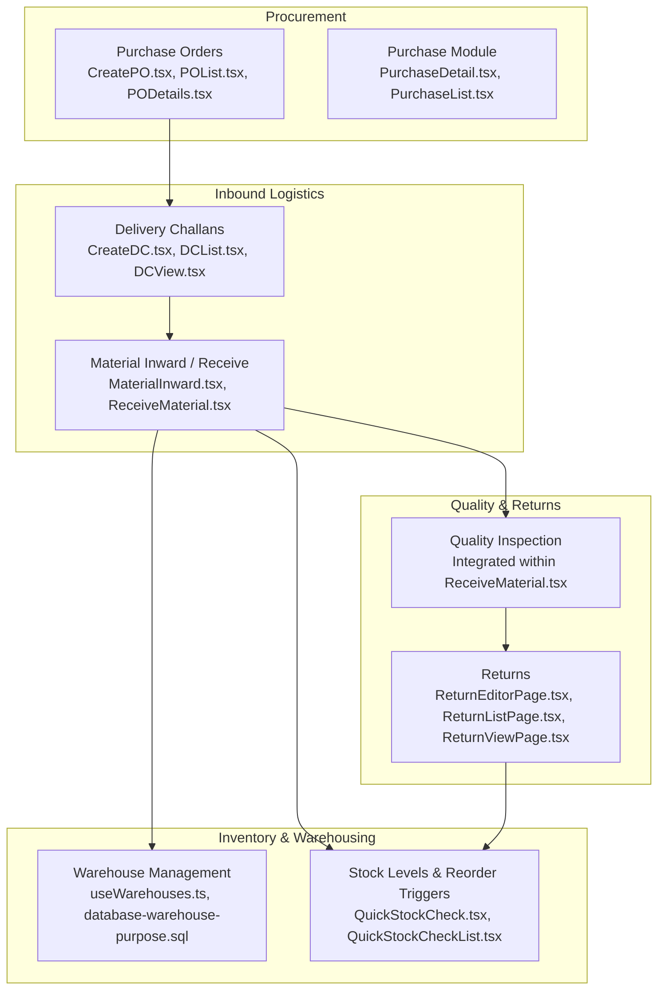

**Diagram sources**
- [CreatePO.tsx](file://src/pages/CreatePO.tsx)
- [POList.tsx](file://src/pages/POList.tsx)
- [PODetails.tsx](file://src/pages/PODetails.tsx)
- [CreateDC.tsx](file://src/pages/CreateDC.tsx)
- [DCList.tsx](file://src/pages/DCList.tsx)
- [DCView.tsx](file://src/pages/DCView.tsx)
- [MaterialInward.tsx](file://src/pages/MaterialInward.tsx)
- [ReceiveMaterial.tsx](file://src/pages/ReceiveMaterial.tsx)
- [ReturnEditorPage.tsx](file://src/pages/ReturnEditorPage.tsx)
- [ReturnListPage.tsx](file://src/pages/ReturnListPage.tsx)
- [ReturnViewPage.tsx](file://src/pages/ReturnViewPage.tsx)
- [PurchaseDetail.tsx](file://src/modules/Purchase/components/PurchaseDetail.tsx)
- [PurchaseList.tsx](file://src/modules/Purchase/components/PurchaseList.tsx)
- [useWarehouses.ts](file://src/hooks/useWarehouses.ts)
- [QuickStockCheck.tsx](file://src/pages/QuickStockCheck.tsx)
- [QuickStockCheckList.tsx](file://src/pages/QuickStockCheckList.tsx)
- [database-warehouse-purpose.sql](file://src/database-warehouse-purpose.sql)

**Section sources**
- [CreatePO.tsx](file://src/pages/CreatePO.tsx)
- [POList.tsx](file://src/pages/POList.tsx)
- [PODetails.tsx](file://src/pages/PODetails.tsx)
- [CreateDC.tsx](file://src/pages/CreateDC.tsx)
- [DCList.tsx](file://src/pages/DCList.tsx)
- [DCView.tsx](file://src/pages/DCView.tsx)
- [MaterialInward.tsx](file://src/pages/MaterialInward.tsx)
- [ReceiveMaterial.tsx](file://src/pages/ReceiveMaterial.tsx)
- [ReturnEditorPage.tsx](file://src/pages/ReturnEditorPage.tsx)
- [ReturnListPage.tsx](file://src/pages/ReturnListPage.tsx)
- [ReturnViewPage.tsx](file://src/pages/ReturnViewPage.tsx)
- [PurchaseDetail.tsx](file://src/modules/Purchase/components/PurchaseDetail.tsx)
- [PurchaseList.tsx](file://src/modules/Purchase/components/PurchaseList.tsx)
- [useWarehouses.ts](file://src/hooks/useWarehouses.ts)
- [QuickStockCheck.tsx](file://src/pages/QuickStockCheck.tsx)
- [QuickStockCheckList.tsx](file://src/pages/QuickStockCheckList.tsx)
- [database-warehouse-purpose.sql](file://src/database-warehouse-purpose.sql)

## Core Components
- Purchase Orders: Creation, editing, and tracking of POs with vendor and line-item details.
- Delivery Challans: Generation of DCs from POs, capturing expected quantities and shipment info.
- Material Inward/Receiving: Recording actual received quantities, lot/batch, and quality status.
- Quality Inspection: Marking items as pass/fail or partial acceptance during receiving.
- Returns: Processing returns for rejected/damaged goods and generating credit notes.
- Inventory Updates: Incrementing on-hand stock upon successful receipt; decrementing for returns.
- Warehouse Integration: Assigning receipts to specific warehouses and using warehouse purpose metadata.
- Stock Monitoring: Quick checks and reorder triggers based on current stock levels.

**Section sources**
- [CreatePO.tsx](file://src/pages/CreatePO.tsx)
- [CreateDC.tsx](file://src/pages/CreateDC.tsx)
- [MaterialInward.tsx](file://src/pages/MaterialInward.tsx)
- [ReceiveMaterial.tsx](file://src/pages/ReceiveMaterial.tsx)
- [ReturnEditorPage.tsx](file://src/pages/ReturnEditorPage.tsx)
- [useWarehouses.ts](file://src/hooks/useWarehouses.ts)
- [QuickStockCheck.tsx](file://src/pages/QuickStockCheck.tsx)

## Architecture Overview
The procurement-to-receipt flow integrates multiple components:
- PO creation drives downstream DC generation.
- DCs capture expected shipments and link back to POs.
- Receiving validates against DC/PO and updates inventory.
- Quality inspection influences acceptance and potential returns.
- Returns adjust inventory and can trigger credit notes.
- Warehouse assignments ensure accurate location-based stock.

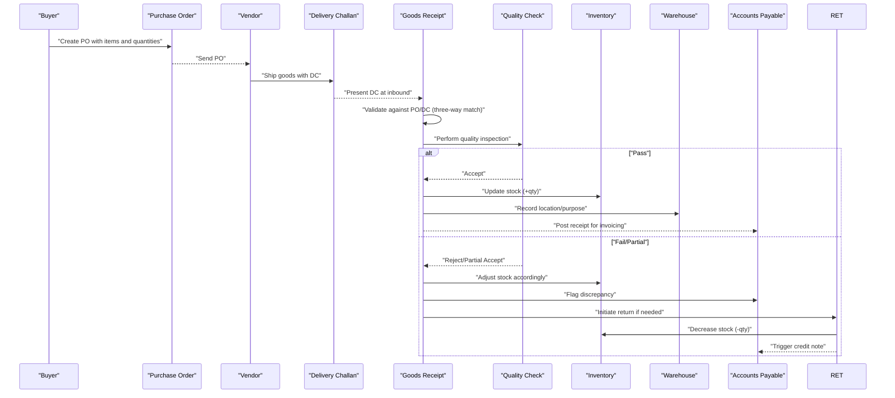

**Diagram sources**
- [CreatePO.tsx](file://src/pages/CreatePO.tsx)
- [CreateDC.tsx](file://src/pages/CreateDC.tsx)
- [MaterialInward.tsx](file://src/pages/MaterialInward.tsx)
- [ReceiveMaterial.tsx](file://src/pages/ReceiveMaterial.tsx)
- [ReturnEditorPage.tsx](file://src/pages/ReturnEditorPage.tsx)
- [useWarehouses.ts](file://src/hooks/useWarehouses.ts)
- [database-dc-po-fields.sql](file://src/database-dc-po-fields.sql)
- [database-material-inward-update.sql](file://src/database-material-inward-update.sql)

## Detailed Component Analysis

### Three-Way Matching: PO, DC, Invoice
Three-way matching ensures consistency across:
- Purchase Order: Agreed quantities, rates, and terms
- Delivery Challan: Actual shipped quantities and references
- Invoice: Billed amounts aligned with accepted receipts

Key aspects:
- Linkage fields between DC and PO enable traceability.
- Payment terms are defined per PO to align invoicing schedules.
- Project linkage supports cost allocation and billing.

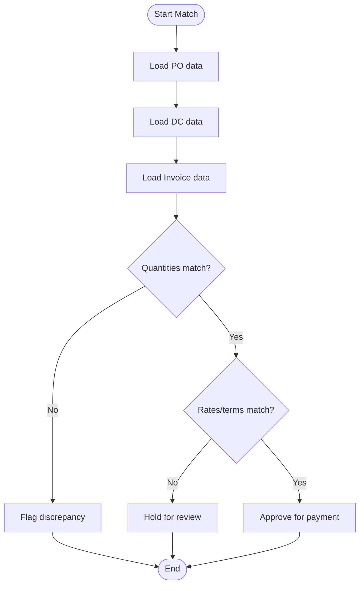

**Diagram sources**
- [database-dc-po-fields.sql](file://src/database-dc-po-fields.sql)
- [database-po-payment-terms.sql](file://src/database-po-payment-terms.sql)
- [database-link-project-invoices-to-po.sql](file://src/database-link-project-invoices-to-po.sql)

**Section sources**
- [database-dc-po-fields.sql](file://src/database-dc-po-fields.sql)
- [database-po-payment-terms.sql](file://src/database-po-payment-terms.sql)
- [database-link-project-invoices-to-po.sql](file://src/database-link-project-invoices-to-po.sql)

### Quality Inspection Workflows
Quality checks occur during receiving:
- Inspect items for defects, damage, or non-conformance.
- Mark items as Pass, Fail, or Partially Accepted.
- Partial acceptance allows splitting into acceptable and reject batches.
- Results drive inventory updates and potential returns.

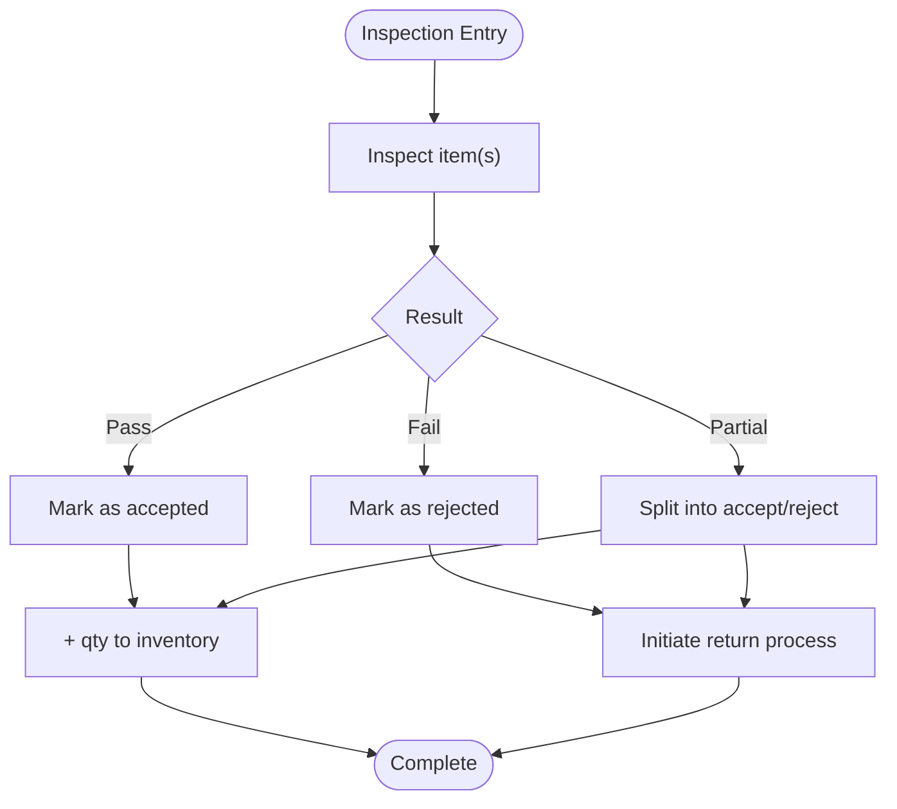

**Diagram sources**
- [ReceiveMaterial.tsx](file://src/pages/ReceiveMaterial.tsx)
- [MaterialInward.tsx](file://src/pages/MaterialInward.tsx)
- [ReturnEditorPage.tsx](file://src/pages/ReturnEditorPage.tsx)

**Section sources**
- [ReceiveMaterial.tsx](file://src/pages/ReceiveMaterial.tsx)
- [MaterialInward.tsx](file://src/pages/MaterialInward.tsx)
- [ReturnEditorPage.tsx](file://src/pages/ReturnEditorPage.tsx)

### Partial Delivery Handling
Partial deliveries are supported by:
- Allowing DC lines to reflect shipped vs. ordered quantities.
- Enabling multiple receipts against a single PO line until fully fulfilled.
- Tracking remaining open quantities to guide future deliveries.

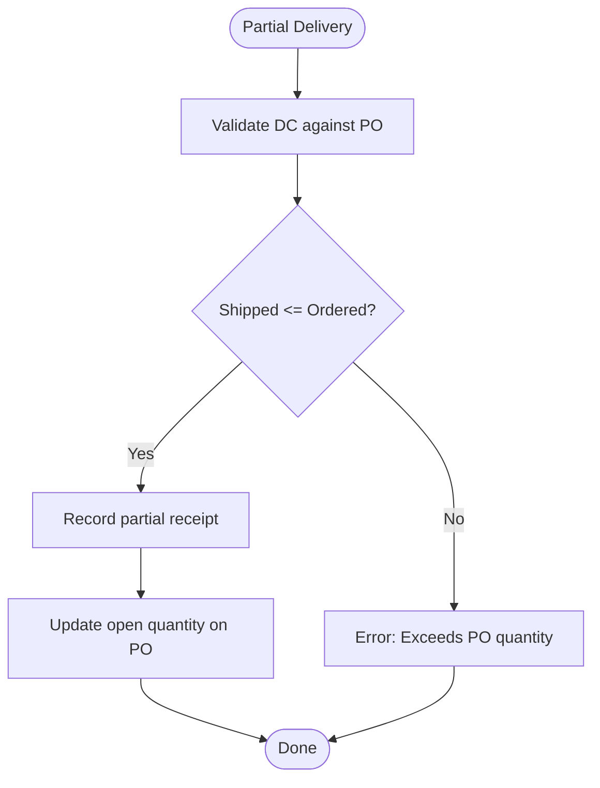

**Diagram sources**
- [CreateDC.tsx](file://src/pages/CreateDC.tsx)
- [DCView.tsx](file://src/pages/DCView.tsx)
- [MaterialInward.tsx](file://src/pages/MaterialInward.tsx)
- [ReceiveMaterial.tsx](file://src/pages/ReceiveMaterial.tsx)

**Section sources**
- [CreateDC.tsx](file://src/pages/CreateDC.tsx)
- [DCView.tsx](file://src/pages/DCView.tsx)
- [MaterialInward.tsx](file://src/pages/MaterialInward.tsx)
- [ReceiveMaterial.tsx](file://src/pages/ReceiveMaterial.tsx)

### Return Processing
Returns handle rejected or damaged goods:
- Create return entries referencing original receipts or DCs.
- Adjust inventory downward for returned quantities.
- Generate credit notes where applicable and notify accounts payable.

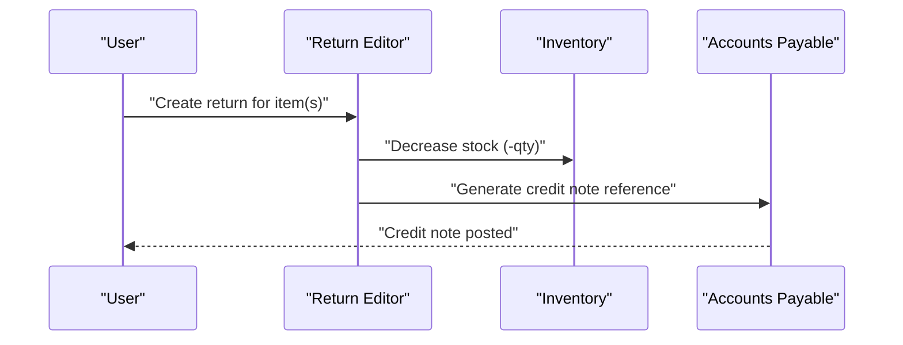

**Diagram sources**
- [ReturnEditorPage.tsx](file://src/pages/ReturnEditorPage.tsx)
- [ReturnListPage.tsx](file://src/pages/ReturnListPage.tsx)
- [ReturnViewPage.tsx](file://src/pages/ReturnViewPage.tsx)

**Section sources**
- [ReturnEditorPage.tsx](file://src/pages/ReturnEditorPage.tsx)
- [ReturnListPage.tsx](file://src/pages/ReturnListPage.tsx)
- [ReturnViewPage.tsx](file://src/pages/ReturnViewPage.tsx)

### Inventory Updates Upon Goods Receipt
Upon successful receipt:
- On-hand stock increases by accepted quantities.
- Location and warehouse assignment are recorded.
- Audit trails capture who performed the receipt and when.

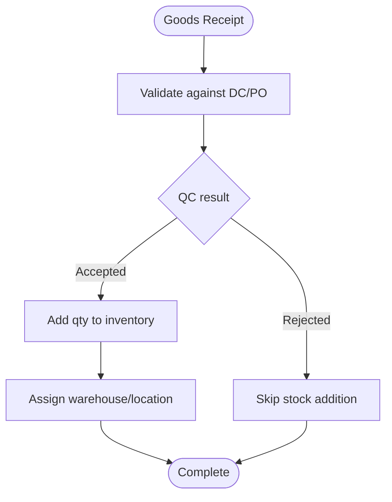

**Diagram sources**
- [MaterialInward.tsx](file://src/pages/MaterialInward.tsx)
- [ReceiveMaterial.tsx](file://src/pages/ReceiveMaterial.tsx)
- [database-material-inward-update.sql](file://src/database-material-inward-update.sql)
- [useWarehouses.ts](file://src/hooks/useWarehouses.ts)

**Section sources**
- [MaterialInward.tsx](file://src/pages/MaterialInward.tsx)
- [ReceiveMaterial.tsx](file://src/pages/ReceiveMaterial.tsx)
- [database-material-inward-update.sql](file://src/database-material-inward-update.sql)
- [useWarehouses.ts](file://src/hooks/useWarehouses.ts)

### Stock Allocation and Warehouse Management Integration
- Warehouse selection during receipt ensures accurate location tracking.
- Warehouse purpose metadata supports specialized storage types.
- Stock allocation can be tied to projects or internal cost centers via PO linkage.

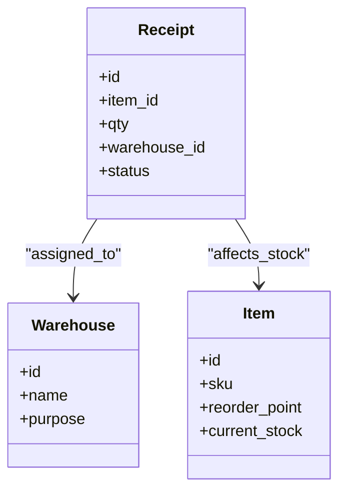

**Diagram sources**
- [useWarehouses.ts](file://src/hooks/useWarehouses.ts)
- [database-warehouse-purpose.sql](file://src/database-warehouse-purpose.sql)
- [ReceiveMaterial.tsx](file://src/pages/ReceiveMaterial.tsx)

**Section sources**
- [useWarehouses.ts](file://src/hooks/useWarehouses.ts)
- [database-warehouse-purpose.sql](file://src/database-warehouse-purpose.sql)
- [ReceiveMaterial.tsx](file://src/pages/ReceiveMaterial.tsx)

### Handling Damaged Goods, Quantity Discrepancies, and Vendor Claims
- Damaged goods: Mark as rejected during QC; initiate return and credit note.
- Quantity discrepancies: Flag during three-way match; hold invoice until resolved.
- Vendor claims: Document discrepancies and attach evidence; route to AP for resolution.

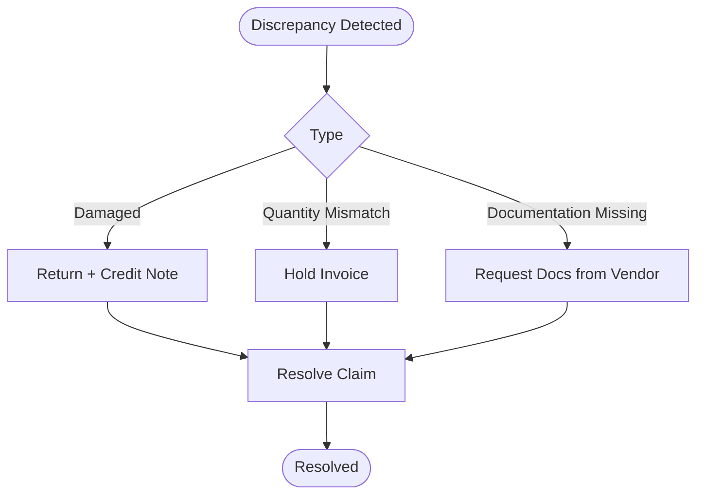

**Diagram sources**
- [ReceiveMaterial.tsx](file://src/pages/ReceiveMaterial.tsx)
- [ReturnEditorPage.tsx](file://src/pages/ReturnEditorPage.tsx)
- [database-dc-po-fields.sql](file://src/database-dc-po-fields.sql)

**Section sources**
- [ReceiveMaterial.tsx](file://src/pages/ReceiveMaterial.tsx)
- [ReturnEditorPage.tsx](file://src/pages/ReturnEditorPage.tsx)
- [database-dc-po-fields.sql](file://src/database-dc-po-fields.sql)

### Automated Stock Level Updates and Reorder Point Triggers
- After each receipt, stock levels update automatically.
- Quick stock checks allow monitoring and alerts.
- Reorder points can trigger replenishment actions when stock falls below thresholds.

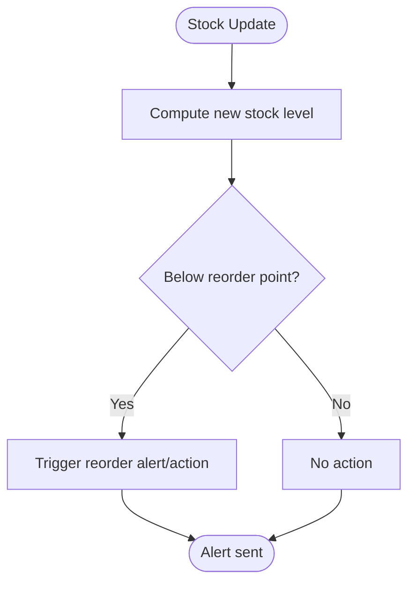

**Diagram sources**
- [QuickStockCheck.tsx](file://src/pages/QuickStockCheck.tsx)
- [QuickStockCheckList.tsx](file://src/pages/QuickStockCheckList.tsx)
- [database-material-inward-update.sql](file://src/database-material-inward-update.sql)

**Section sources**
- [QuickStockCheck.tsx](file://src/pages/QuickStockCheck.tsx)
- [QuickStockCheckList.tsx](file://src/pages/QuickStockCheckList.tsx)
- [database-material-inward-update.sql](file://src/database-material-inward-update.sql)

## Dependency Analysis
The following diagram maps key dependencies among procurement, receiving, returns, and inventory components:

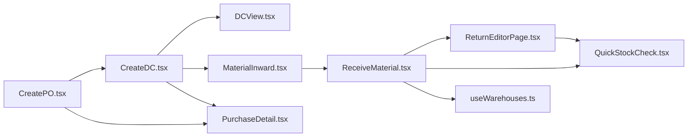

**Diagram sources**
- [CreatePO.tsx](file://src/pages/CreatePO.tsx)
- [CreateDC.tsx](file://src/pages/CreateDC.tsx)
- [DCView.tsx](file://src/pages/DCView.tsx)
- [MaterialInward.tsx](file://src/pages/MaterialInward.tsx)
- [ReceiveMaterial.tsx](file://src/pages/ReceiveMaterial.tsx)
- [ReturnEditorPage.tsx](file://src/pages/ReturnEditorPage.tsx)
- [QuickStockCheck.tsx](file://src/pages/QuickStockCheck.tsx)
- [useWarehouses.ts](file://src/hooks/useWarehouses.ts)
- [PurchaseDetail.tsx](file://src/modules/Purchase/components/PurchaseDetail.tsx)

**Section sources**
- [CreatePO.tsx](file://src/pages/CreatePO.tsx)
- [CreateDC.tsx](file://src/pages/CreateDC.tsx)
- [DCView.tsx](file://src/pages/DCView.tsx)
- [MaterialInward.tsx](file://src/pages/MaterialInward.tsx)
- [ReceiveMaterial.tsx](file://src/pages/ReceiveMaterial.tsx)
- [ReturnEditorPage.tsx](file://src/pages/ReturnEditorPage.tsx)
- [QuickStockCheck.tsx](file://src/pages/QuickStockCheck.tsx)
- [useWarehouses.ts](file://src/hooks/useWarehouses.ts)
- [PurchaseDetail.tsx](file://src/modules/Purchase/components/PurchaseDetail.tsx)

## Performance Considerations
- Batch operations: When processing large receipts, batch inventory updates to reduce overhead.
- Indexing: Ensure indexes on PO, DC, and receipt tables for fast lookups during three-way matching.
- Caching: Cache warehouse lists and item master data to speed up UI interactions.
- Validation: Perform client-side validation early to minimize server round-trips.
- Asynchronous tasks: Offload heavy computations (e.g., reorder triggers) to background jobs.

[No sources needed since this section provides general guidance]

## Troubleshooting Guide
Common issues and resolutions:
- Three-way mismatch: Verify PO quantities/rates, DC shipment records, and invoice details; use discrepancy flags to hold invoices.
- Incorrect stock updates: Confirm QC results and receipt statuses; re-run inventory reconciliation scripts if necessary.
- Warehouse assignment errors: Ensure valid warehouse IDs and correct purpose metadata; validate warehouse availability.
- Return processing failures: Check return references to original receipts; confirm credit note generation steps.

**Section sources**
- [ReceiveMaterial.tsx](file://src/pages/ReceiveMaterial.tsx)
- [ReturnEditorPage.tsx](file://src/pages/ReturnEditorPage.tsx)
- [useWarehouses.ts](file://src/hooks/useWarehouses.ts)
- [database-material-inward-update.sql](file://src/database-material-inward-update.sql)

## Conclusion
The system implements a robust procurement-to-receipt workflow with strong controls for three-way matching, quality inspection, partial deliveries, returns, and inventory accuracy. Warehouse integration and automated stock updates support efficient operations, while quick stock checks and reorder triggers help maintain optimal inventory levels. Proper handling of discrepancies and vendor claims ensures financial integrity and operational continuity.

[No sources needed since this section summarizes without analyzing specific files]

## Appendices

### Example Scenarios
- Damaged goods: During receiving, mark items as rejected; create a return entry; generate a credit note; adjust stock downward.
- Quantity discrepancy: If DC shows fewer items than PO, record partial receipt; flag discrepancy; hold invoice until vendor clarification.
- Reorder trigger: After receipt, compute new stock; if below reorder point, trigger an alert to procurement for replenishment.

[No sources needed since this section provides conceptual examples]