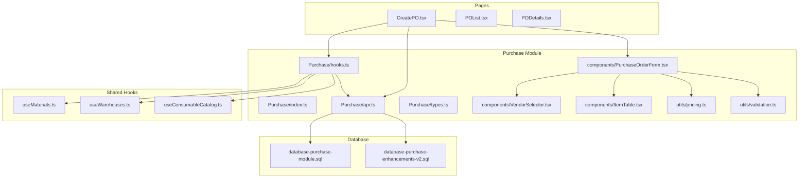
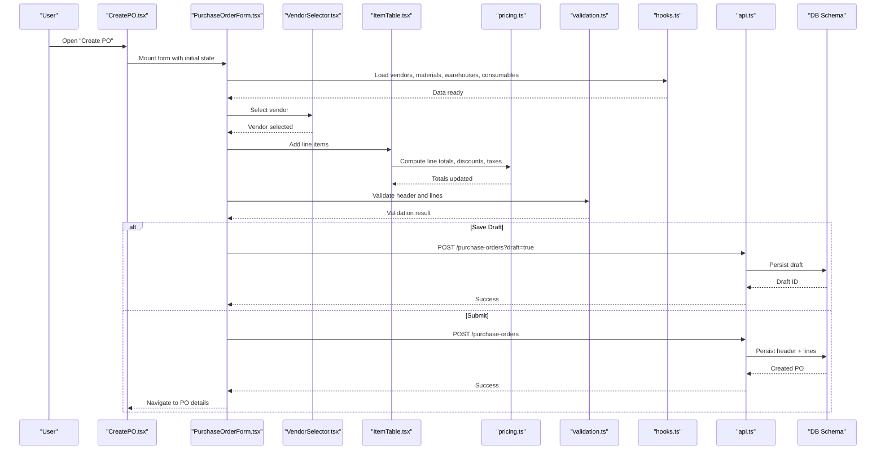
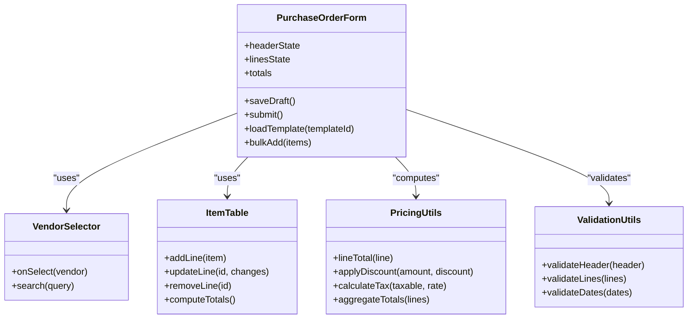
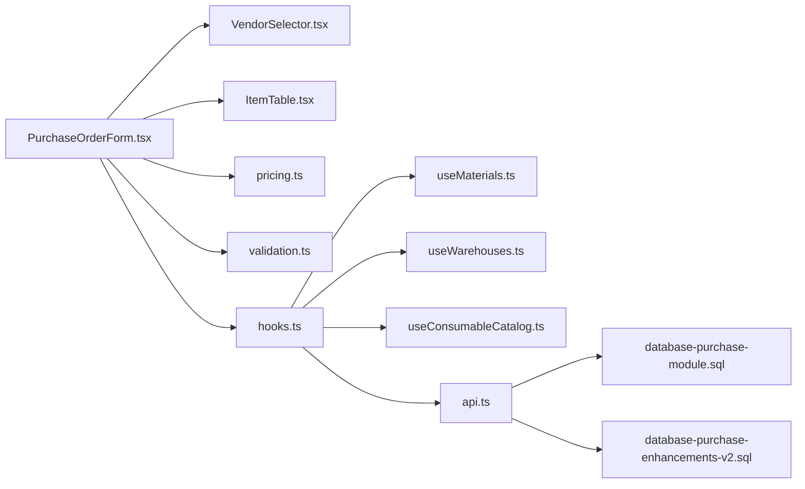

# Purchase Order Creation

<cite>
**Referenced Files in This Document**
- [CreatePO.tsx](file://src/pages/CreatePO.tsx)
- [POList.tsx](file://src/pages/POList.tsx)
- [PODetails.tsx](file://src/pages/PODetails.tsx)
- [Purchase/index.ts](file://src/modules/Purchase/index.ts)
- [Purchase/api.ts](file://src/modules/Purchase/api.ts)
- [Purchase/hooks.ts](file://src/modules/Purchase/hooks.ts)
- [Purchase/types.ts](file://src/modules/Purchase/types.ts)
- [Purchase/components/PurchaseOrderForm.tsx](file://src/modules/Purchase/components/PurchaseOrderForm.tsx)
- [Purchase/components/VendorSelector.tsx](file://src/modules/Purchase/components/VendorSelector.tsx)
- [Purchase/components/ItemTable.tsx](file://src/modules/Purchase/components/ItemTable.tsx)
- [Purchase/utils/pricing.ts](file://src/modules/Purchase/utils/pricing.ts)
- [Purchase/utils/validation.ts](file://src/modules/Purchase/utils/validation.ts)
- [useMaterials.ts](file://src/hooks/useMaterials.ts)
- [useWarehouses.ts](file://src/hooks/useWarehouses.ts)
- [useConsumableCatalog.ts](file://src/hooks/useConsumableCatalog.ts)
- [database-purchase-module.sql](file://src/database-purchase-module.sql)
- [database-purchase-enhancements-v2.sql](file://src/database-purchase-enhancements-v2.sql)
- [migrate_create_po.cjs](file://migrate_create_po.cjs)
</cite>

## Table of Contents
1. [Introduction](#introduction)
2. [Project Structure](#project-structure)
3. [Core Components](#core-components)
4. [Architecture Overview](#architecture-overview)
5. [Detailed Component Analysis](#detailed-component-analysis)
6. [Dependency Analysis](#dependency-analysis)
7. [Performance Considerations](#performance-considerations)
8. [Troubleshooting Guide](#troubleshooting-guide)
9. [Conclusion](#conclusion)

## Introduction
This document explains the purchase order creation functionality end-to-end: how new purchase orders are created from material requisitions, vendor selection, item addition, pricing configuration, quantity management, validation rules, data binding patterns, and integrations with material catalog, vendor master data, and pricing history. It also covers handling different item types (materials, services, consumables), tax calculations, discount applications, bulk operations, template usage, and draft saving capabilities.

## Project Structure
The purchase module is organized under src/modules/Purchase with clear separation between UI components, business logic utilities, API integration, hooks, and type definitions. Pages for listing and viewing POs live under src/pages.

**Diagram sources**
- [CreatePO.tsx](file://src/pages/CreatePO.tsx)
- [Purchase/index.ts](file://src/modules/Purchase/index.ts)
- [Purchase/api.ts](file://src/modules/Purchase/api.ts)
- [Purchase/hooks.ts](file://src/modules/Purchase/hooks.ts)
- [Purchase/types.ts](file://src/modules/Purchase/types.ts)
- [Purchase/components/PurchaseOrderForm.tsx](file://src/modules/Purchase/components/PurchaseOrderForm.tsx)
- [Purchase/components/VendorSelector.tsx](file://src/modules/Purchase/components/VendorSelector.tsx)
- [Purchase/components/ItemTable.tsx](file://src/modules/Purchase/components/ItemTable.tsx)
- [Purchase/utils/pricing.ts](file://src/modules/Purchase/utils/pricing.ts)
- [Purchase/utils/validation.ts](file://src/modules/Purchase/utils/validation.ts)
- [useMaterials.ts](file://src/hooks/useMaterials.ts)
- [useWarehouses.ts](file://src/hooks/useWarehouses.ts)
- [useConsumableCatalog.ts](file://src/hooks/useConsumableCatalog.ts)
- [database-purchase-module.sql](file://src/database-purchase-module.sql)
- [database-purchase-enhancements-v2.sql](file://src/database-purchase-enhancements-v2.sql)

**Section sources**
- [CreatePO.tsx](file://src/pages/CreatePO.tsx)
- [POList.tsx](file://src/pages/POList.tsx)
- [PODetails.tsx](file://src/pages/PODetails.tsx)
- [Purchase/index.ts](file://src/modules/Purchase/index.ts)
- [Purchase/api.ts](file://src/modules/Purchase/api.ts)
- [Purchase/hooks.ts](file://src/modules/Purchase/hooks.ts)
- [Purchase/types.ts](file://src/modules/Purchase/types.ts)
- [Purchase/components/PurchaseOrderForm.tsx](file://src/modules/Purchase/components/PurchaseOrderForm.tsx)
- [Purchase/components/VendorSelector.tsx](file://src/modules/Purchase/components/VendorSelector.tsx)
- [Purchase/components/ItemTable.tsx](file://src/modules/Purchase/components/ItemTable.tsx)
- [Purchase/utils/pricing.ts](file://src/modules/Purchase/utils/pricing.ts)
- [Purchase/utils/validation.ts](file://src/modules/Purchase/utils/validation.ts)
- [useMaterials.ts](file://src/hooks/useMaterials.ts)
- [useWarehouses.ts](file://src/hooks/useWarehouses.ts)
- [useConsumableCatalog.ts](file://src/hooks/useConsumableCatalog.ts)
- [database-purchase-module.sql](file://src/database-purchase-module.sql)
- [database-purchase-enhancements-v2.sql](file://src/database-purchase-enhancements-v2.sql)

## Core Components
- PurchaseOrderForm: Orchestrates header fields (vendor, dates, terms), line items table, totals, taxes, discounts, and submission/draft flows.
- VendorSelector: Provides searchable vendor list with filtering by location, currency, and default payment terms.
- ItemTable: Manages line item CRUD, unit conversions, pricing overrides, tax rates, and discount application per line or globally.
- Pricing utilities: Compute line totals, apply discounts, calculate taxes, and aggregate to header-level totals.
- Validation utilities: Enforce required fields, numeric constraints, date ordering, and business rules before submission.
- API layer: Encapsulates create, update, draft save, and fetch operations for PO headers and lines.
- Hooks: Provide reactive access to vendors, materials, warehouses, consumables, and pricing history; manage form state and persistence.

Key responsibilities and interactions:
- Header-level data binding: vendor, project, warehouse, delivery address, payment terms, currency, notes.
- Line-level data binding: item selection, UOM, qty, price, discount %, tax rate, amount, description, HSN/SAC.
- Computed values: subtotal, total discount, taxable amount, tax amounts, grand total.
- Drafting: periodic auto-save and manual save-draft with optimistic updates.
- Submission: validates, persists header and lines, returns confirmation and navigation.

**Section sources**
- [Purchase/components/PurchaseOrderForm.tsx](file://src/modules/Purchase/components/PurchaseOrderForm.tsx)
- [Purchase/components/VendorSelector.tsx](file://src/modules/Purchase/components/VendorSelector.tsx)
- [Purchase/components/ItemTable.tsx](file://src/modules/Purchase/components/ItemTable.tsx)
- [Purchase/utils/pricing.ts](file://src/modules/Purchase/utils/pricing.ts)
- [Purchase/utils/validation.ts](file://src/modules/Purchase/utils/validation.ts)
- [Purchase/api.ts](file://src/modules/Purchase/api.ts)
- [Purchase/hooks.ts](file://src/modules/Purchase/hooks.ts)

## Architecture Overview
The PO creation flow integrates UI components with shared hooks and an API layer that communicates with the database schema defined in SQL migrations.

**Diagram sources**
- [CreatePO.tsx](file://src/pages/CreatePO.tsx)
- [Purchase/components/PurchaseOrderForm.tsx](file://src/modules/Purchase/components/PurchaseOrderForm.tsx)
- [Purchase/components/VendorSelector.tsx](file://src/modules/Purchase/components/VendorSelector.tsx)
- [Purchase/components/ItemTable.tsx](file://src/modules/Purchase/components/ItemTable.tsx)
- [Purchase/utils/pricing.ts](file://src/modules/Purchase/utils/pricing.ts)
- [Purchase/utils/validation.ts](file://src/modules/Purchase/utils/validation.ts)
- [Purchase/hooks.ts](file://src/modules/Purchase/hooks.ts)
- [Purchase/api.ts](file://src/modules/Purchase/api.ts)
- [database-purchase-module.sql](file://src/database-purchase-module.sql)
- [database-purchase-enhancements-v2.sql](file://src/database-purchase-enhancements-v2.sql)

## Detailed Component Analysis

### PurchaseOrderForm
Responsibilities:
- Binds header fields to form state and manages lifecycle events.
- Integrates VendorSelector and ItemTable.
- Applies global discount and tax settings; supports per-line overrides.
- Handles draft auto-save and manual save-draft.
- Submits final PO after validation.

Data binding patterns:
- Controlled inputs for all header fields.
- Array-based state for line items with computed totals.
- Derived state for subtotal, discount, taxable amount, tax, and grand total.

Validation rules enforced:
- Required header fields (vendor, date, warehouse).
- Positive quantities and prices.
- Date ordering (issue date <= expected delivery).
- At least one valid line item.
- Tax and discount percentages within allowed ranges.

Draft and templates:
- Auto-save on changes with debounce.
- Manual save-draft button.
- Template loader to pre-populate header and lines from saved templates.

Bulk operations:
- Bulk add from material requisition or BOQ via multi-select.
- Bulk import via CSV/Excel using a modal integrated into the page.

Integration points:
- useMaterials, useWarehouses, useConsumableCatalog for catalogs.
- Pricing utilities for computations.
- API layer for persistence.

**Section sources**
- [Purchase/components/PurchaseOrderForm.tsx](file://src/modules/Purchase/components/PurchaseOrderForm.tsx)
- [Purchase/hooks.ts](file://src/modules/Purchase/hooks.ts)
- [Purchase/utils/pricing.ts](file://src/modules/Purchase/utils/pricing.ts)
- [Purchase/utils/validation.ts](file://src/modules/Purchase/utils/validation.ts)
- [useMaterials.ts](file://src/hooks/useMaterials.ts)
- [useWarehouses.ts](file://src/hooks/useWarehouses.ts)
- [useConsumableCatalog.ts](file://src/hooks/useConsumableCatalog.ts)

#### Class-like structure overview

**Diagram sources**
- [Purchase/components/PurchaseOrderForm.tsx](file://src/modules/Purchase/components/PurchaseOrderForm.tsx)
- [Purchase/components/VendorSelector.tsx](file://src/modules/Purchase/components/VendorSelector.tsx)
- [Purchase/components/ItemTable.tsx](file://src/modules/Purchase/components/ItemTable.tsx)
- [Purchase/utils/pricing.ts](file://src/modules/Purchase/utils/pricing.ts)
- [Purchase/utils/validation.ts](file://src/modules/Purchase/utils/validation.ts)

### VendorSelector
Features:
- Searchable dropdown with filters (location, currency, active status).
- Displays default payment terms and contact info.
- Supports quick-add vendor via inline modal.

Data binding:
- Selected vendor object bound to form header.
- Fallback defaults applied when vendor has no explicit terms.

**Section sources**
- [Purchase/components/VendorSelector.tsx](file://src/modules/Purchase/components/VendorSelector.tsx)

### ItemTable
Features:
- Add/remove/reorder lines.
- Item selector integrating materials and consumables.
- Unit conversion helpers and stock availability hints.
- Per-line price override with suggestion from pricing history.
- Per-line discount % and tax rate override.
- Inline validation feedback.

Processing logic:
- Recomputes line totals on any change.
- Aggregates header totals when lines change.

**Section sources**
- [Purchase/components/ItemTable.tsx](file://src/modules/Purchase/components/ItemTable.tsx)
- [Purchase/utils/pricing.ts](file://src/modules/Purchase/utils/pricing.ts)

### Pricing Utilities
Responsibilities:
- Compute line totals based on qty, base price, discount, and tax.
- Apply global vs per-line discount precedence.
- Calculate tax amounts by rate and taxable base.
- Aggregate totals for display and submission payload.

Complexity considerations:
- O(n) recomputation over lines on each change; optimized with memoization where applicable.

**Section sources**
- [Purchase/utils/pricing.ts](file://src/modules/Purchase/utils/pricing.ts)

### Validation Utilities
Rules:
- Header: vendor, issue date, warehouse required.
- Lines: positive qty, non-negative price, valid item reference.
- Dates: issue date <= expected delivery.
- Percentages: discount and tax within configured bounds.
- Business: at least one line item; consistent currency.

Error handling:
- Collects field-specific errors and displays inline messages.
- Blocks submission until resolved.

**Section sources**
- [Purchase/utils/validation.ts](file://src/modules/Purchase/utils/validation.ts)

### API Layer
Endpoints and operations:
- Create draft: persist header and lines with draft flag.
- Submit: validate server-side, persist finalized PO.
- Fetch: retrieve PO details, including lines and totals.
- Templates: load/save reusable PO templates.

Error handling:
- Network retries for transient failures.
- Server error mapping to user-friendly messages.

**Section sources**
- [Purchase/api.ts](file://src/modules/Purchase/api.ts)
- [database-purchase-module.sql](file://src/database-purchase-module.sql)
- [database-purchase-enhancements-v2.sql](file://src/database-purchase-enhancements-v2.sql)

### Hooks
Responsibilities:
- Fetch and cache vendors, materials, warehouses, consumables.
- Manage form state, drafts, and persistence.
- Provide derived data like suggested prices from pricing history.

Integration:
- useMaterials for material catalog.
- useWarehouses for warehouse selection.
- useConsumableCatalog for consumable items.

**Section sources**
- [Purchase/hooks.ts](file://src/modules/Purchase/hooks.ts)
- [useMaterials.ts](file://src/hooks/useMaterials.ts)
- [useWarehouses.ts](file://src/hooks/useWarehouses.ts)
- [useConsumableCatalog.ts](file://src/hooks/useConsumableCatalog.ts)

### Page Integration
- CreatePO orchestrates routing, permissions, and passes props to PurchaseOrderForm.
- POList provides entry points to create and view POs.
- PODetails shows finalized PO with read-only view and actions.

**Section sources**
- [CreatePO.tsx](file://src/pages/CreatePO.tsx)
- [POList.tsx](file://src/pages/POList.tsx)
- [PODetails.tsx](file://src/pages/PODetails.tsx)

## Dependency Analysis
High-level dependencies:
- UI components depend on shared hooks for data access.
- Pricing and validation utilities are pure functions used by the form.
- API layer depends on database schema migrations for persistence.
- Catalog hooks integrate external data sources (materials, consumables, warehouses).

**Diagram sources**
- [Purchase/components/PurchaseOrderForm.tsx](file://src/modules/Purchase/components/PurchaseOrderForm.tsx)
- [Purchase/components/VendorSelector.tsx](file://src/modules/Purchase/components/VendorSelector.tsx)
- [Purchase/components/ItemTable.tsx](file://src/modules/Purchase/components/ItemTable.tsx)
- [Purchase/utils/pricing.ts](file://src/modules/Purchase/utils/pricing.ts)
- [Purchase/utils/validation.ts](file://src/modules/Purchase/utils/validation.ts)
- [Purchase/hooks.ts](file://src/modules/Purchase/hooks.ts)
- [useMaterials.ts](file://src/hooks/useMaterials.ts)
- [useWarehouses.ts](file://src/hooks/useWarehouses.ts)
- [useConsumableCatalog.ts](file://src/hooks/useConsumableCatalog.ts)
- [Purchase/api.ts](file://src/modules/Purchase/api.ts)
- [database-purchase-module.sql](file://src/database-purchase-module.sql)
- [database-purchase-enhancements-v2.sql](file://src/database-purchase-enhancements-v2.sql)

**Section sources**
- [Purchase/index.ts](file://src/modules/Purchase/index.ts)
- [Purchase/api.ts](file://src/modules/Purchase/api.ts)
- [Purchase/hooks.ts](file://src/modules/Purchase/hooks.ts)
- [Purchase/types.ts](file://src/modules/Purchase/types.ts)

## Performance Considerations
- Memoize computed totals and filtered lists to avoid unnecessary recalculations.
- Debounce draft saves and search queries.
- Paginate or virtualize large catalogs (materials, consumables) to improve rendering performance.
- Batch updates for bulk operations to reduce re-renders.
- Cache frequently accessed vendor and pricing data.

[No sources needed since this section provides general guidance]

## Troubleshooting Guide
Common issues and resolutions:
- Missing vendor or warehouse: ensure required selections are made before submission.
- Invalid dates: verify issue date precedes expected delivery date.
- Negative or zero quantities: enforce minimum thresholds and provide inline warnings.
- Price overrides: confirm currency matches vendor currency; handle exchange rates if applicable.
- Tax discrepancies: check tax rate validity and taxable base calculation.
- Draft not saving: inspect network requests and local storage; verify debounce timing.
- Bulk add failures: validate imported rows and map missing fields; show detailed error rows.

Operational checks:
- Confirm API endpoints respond with correct payloads.
- Verify database schema includes required columns for PO header and lines.
- Ensure migration scripts have been applied successfully.

**Section sources**
- [Purchase/utils/validation.ts](file://src/modules/Purchase/utils/validation.ts)
- [Purchase/api.ts](file://src/modules/Purchase/api.ts)
- [database-purchase-module.sql](file://src/database-purchase-module.sql)
- [database-purchase-enhancements-v2.sql](file://src/database-purchase-enhancements-v2.sql)

## Conclusion
The purchase order creation feature is built around a modular architecture separating UI, computation, validation, and persistence. The form integrates vendor and item catalogs, applies pricing and tax logic, supports drafting and templates, and enforces robust validation. With careful attention to performance and error handling, it provides a reliable workflow for creating accurate purchase orders from material requisitions.

[No sources needed since this section summarizes without analyzing specific files]