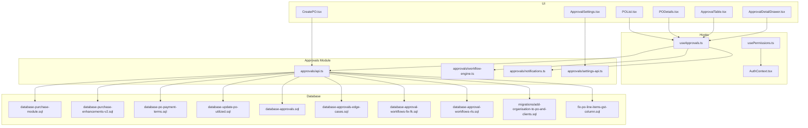
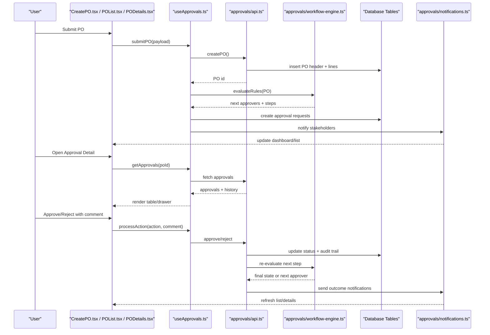
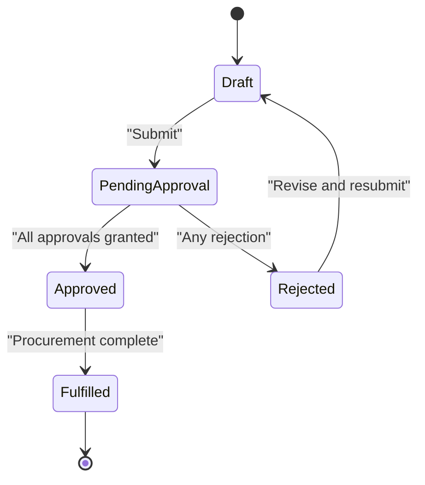
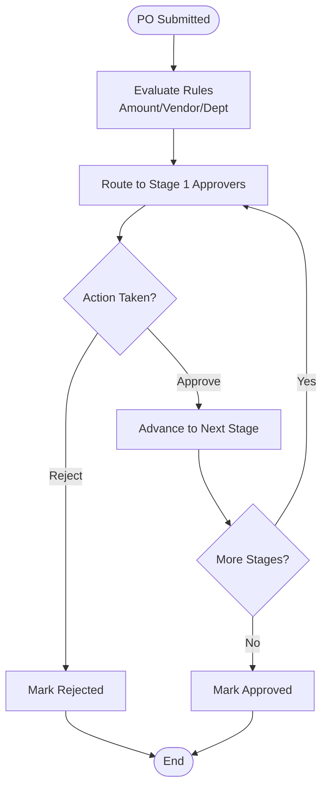
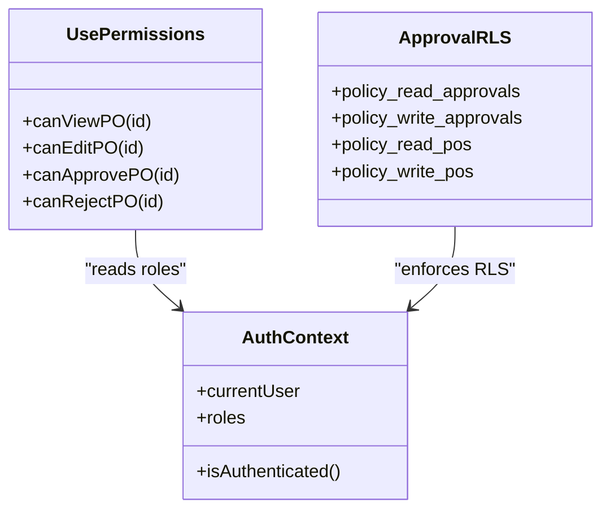
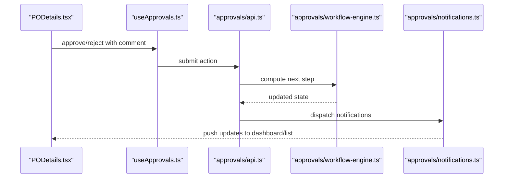
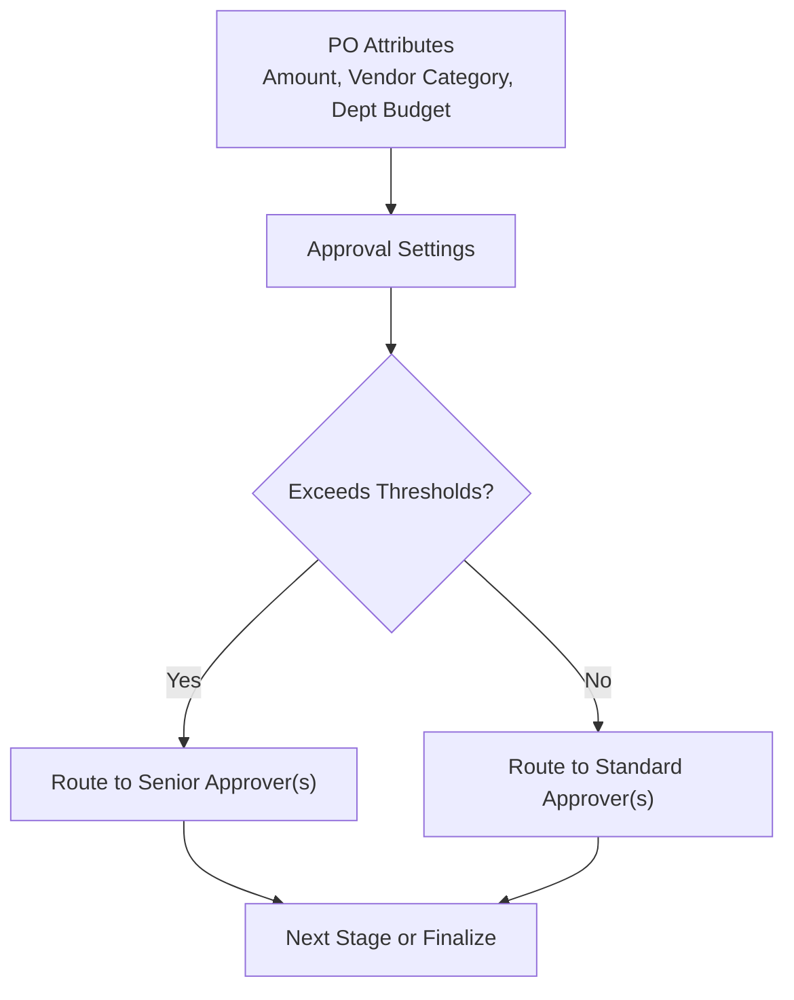
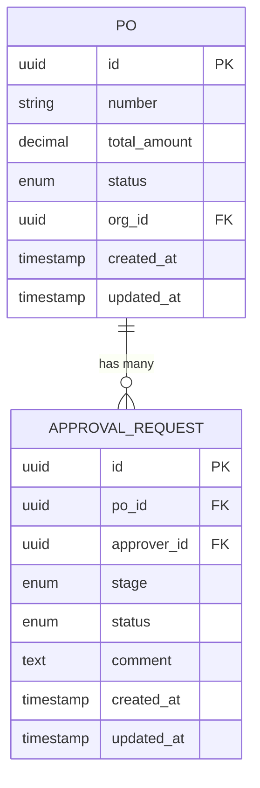
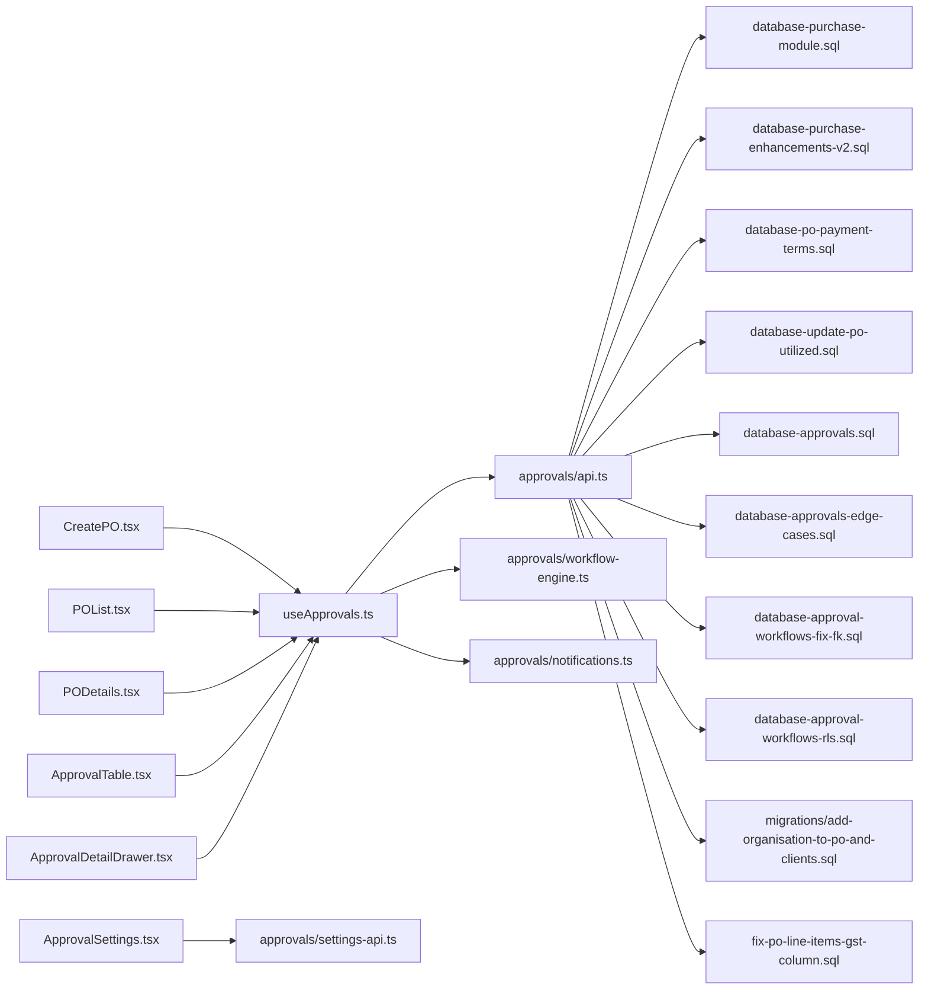

# Purchase Order Workflow & Approval

<cite>
**Referenced Files in This Document**
- [CreatePO.tsx](file://src/pages/CreatePO.tsx)
- [POList.tsx](file://src/pages/POList.tsx)
- [PODetails.tsx](file://src/pages/PODetails.tsx)
- [ApprovalTable.tsx](file://src/components/ApprovalTable.tsx)
- [ApprovalDetailDrawer.tsx](file://src/components/ApprovalDetailDrawer.tsx)
- [ApprovalSettings.tsx](file://src/components/ApprovalSettings.tsx)
- [useApprovals.ts](file://src/hooks/useApprovals.ts)
- [approvals/api.ts](file://src/approvals/api.ts)
- [approvals/workflow-engine.ts](file://src/approvals/workflow-engine.ts)
- [approvals/notifications.ts](file://src/approvals/notifications.ts)
- [approvals/settings-api.ts](file://src/approvals/settings-api.ts)
- [database-approval-workflows-fix-fk.sql](file://src/database-approval-workflows-fix-fk.sql)
- [database-approval-workflows-rls.sql](file://src/database-approval-workflows-rls.sql)
- [database-approval.sql](file://src/database-approval.sql)
- [database-approvals-edge-cases.sql](file://src/database-approvals-edge-cases.sql)
- [database-approvals.sql](file://src/database-approvals.sql)
- [database-purchase-module.sql](file://src/database-purchase-module.sql)
- [database-purchase-enhancements-v2.sql](file://src/database-purchase-enhancements-v2.sql)
- [database-po-payment-terms.sql](file://src/database-po-payment-terms.sql)
- [database-update-po-utilized.sql](file://src/database-update-po-utilized.sql)
- [fix_po_line_items_gst_column.sql](file://src/fix-po-line-items-gst-column.sql)
- [migrations/add-organisation-to-po-and-clients.sql](file://src/migrations/add-organisation-to-po-and-clients.sql)
- [hooks/usePermissions.ts](file://src/hooks/usePermissions.ts)
- [contexts/AuthContext.tsx](file://src/contexts/AuthContext.tsx)
</cite>

## Table of Contents
1. [Introduction](#introduction)
2. [Project Structure](#project-structure)
3. [Core Components](#core-components)
4. [Architecture Overview](#architecture-overview)
5. [Detailed Component Analysis](#detailed-component-analysis)
6. [Dependency Analysis](#dependency-analysis)
7. [Performance Considerations](#performance-considerations)
8. [Troubleshooting Guide](#troubleshooting-guide)
9. [Conclusion](#conclusion)
10. [Appendices](#appendices)

## Introduction
This document explains the purchase order (PO) approval workflows and status management implemented in the application. It covers multi-stage approvals, role-based permissions, escalation rules, PO status transitions, notifications, dashboard updates, conditional approvals by amount/vendor/category/budget, audit trails, comments, and compliance tracking. The content is grounded in the repository’s source files and SQL migrations to ensure accuracy and traceability.

## Project Structure
The PO workflow spans UI pages, reusable components, hooks, API integrations, a workflow engine, notification utilities, and database schema/migrations. Key areas:
- Pages for creating, listing, and viewing POs
- Approval UI components and settings
- Hooks for approvals and permissions
- Approvals module with API, workflow engine, and notifications
- Database schemas and migrations for approvals and PO enhancements

**Diagram sources**
- [CreatePO.tsx](file://src/pages/CreatePO.tsx)
- [POList.tsx](file://src/pages/POList.tsx)
- [PODetails.tsx](file://src/pages/PODetails.tsx)
- [ApprovalTable.tsx](file://src/components/ApprovalTable.tsx)
- [ApprovalDetailDrawer.tsx](file://src/components/ApprovalDetailDrawer.tsx)
- [ApprovalSettings.tsx](file://src/components/ApprovalSettings.tsx)
- [useApprovals.ts](file://src/hooks/useApprovals.ts)
- [approvals/api.ts](file://src/approvals/api.ts)
- [approvals/workflow-engine.ts](file://src/approvals/workflow-engine.ts)
- [approvals/notifications.ts](file://src/approvals/notifications.ts)
- [approvals/settings-api.ts](file://src/approvals/settings-api.ts)
- [database-purchase-module.sql](file://src/database-purchase-module.sql)
- [database-purchase-enhancements-v2.sql](file://src/database-purchase-enhancements-v2.sql)
- [database-po-payment-terms.sql](file://src/database-po-payment-terms.sql)
- [database-update-po-utilized.sql](file://src/database-update-po-utilized.sql)
- [database-approvals.sql](file://src/database-approvals.sql)
- [database-approvals-edge-cases.sql](file://src/database-approvals-edge-cases.sql)
- [database-approval-workflows-fix-fk.sql](file://src/database-approval-workflows-fix-fk.sql)
- [database-approval-workflows-rls.sql](file://src/database-approval-workflows-rls.sql)
- [migrations/add-organisation-to-po-and-clients.sql](file://src/migrations/add-organisation-to-po-and-clients.sql)
- [fix-po-line-items-gst-column.sql](file://src/fix-po-line-items-gst-column.sql)

**Section sources**
- [CreatePO.tsx](file://src/pages/CreatePO.tsx)
- [POList.tsx](file://src/pages/POList.tsx)
- [PODetails.tsx](file://src/pages/PODetails.tsx)
- [ApprovalTable.tsx](file://src/components/ApprovalTable.tsx)
- [ApprovalDetailDrawer.tsx](file://src/components/ApprovalDetailDrawer.tsx)
- [ApprovalSettings.tsx](file://src/components/ApprovalSettings.tsx)
- [useApprovals.ts](file://src/hooks/useApprovals.ts)
- [approvals/api.ts](file://src/approvals/api.ts)
- [approvals/workflow-engine.ts](file://src/approvals/workflow-engine.ts)
- [approvals/notifications.ts](file://src/approvals/notifications.ts)
- [approvals/settings-api.ts](file://src/approvals/settings-api.ts)
- [database-purchase-module.sql](file://src/database-purchase-module.sql)
- [database-purchase-enhancements-v2.sql](file://src/database-purchase-enhancements-v2.sql)
- [database-po-payment-terms.sql](file://src/database-po-payment-terms.sql)
- [database-update-po-utilized.sql](file://src/database-update-po-utilized.sql)
- [database-approvals.sql](file://src/database-approvals.sql)
- [database-approvals-edge-cases.sql](file://src/database-approvals-edge-cases.sql)
- [database-approval-workflows-fix-fk.sql](file://src/database-approval-workflows-fix-fk.sql)
- [database-approval-workflows-rls.sql](file://src/database-approval-workflows-rls.sql)
- [migrations/add-organisation-to-po-and-clients.sql](file://src/migrations/add-organisation-to-po-and-clients.sql)
- [fix-po-line-items-gst-column.sql](file://src/fix-po-line-items-gst-column.sql)

## Core Components
- CreatePO page: Initiates PO creation and submission into the approval pipeline.
- POList page: Displays POs with filters and actions; integrates with approval hooks for live status.
- PODetails page: Shows full PO details, approval history, and actions.
- ApprovalTable and ApprovalDetailDrawer: Provide approval queue views and detailed action/comment flows.
- ApprovalSettings: Configures approval rules and thresholds.
- useApprovals hook: Centralizes fetching, submitting, and reacting to approval events.
- approvals/api: Encapsulates backend calls for approvals and PO operations.
- approvals/workflow-engine: Implements decision logic for routing approvals based on business rules.
- approvals/notifications: Sends alerts and updates dashboards when statuses change.
- approvals/settings-api: Manages persistence of approval configurations.
- Database schemas/migrations: Define tables, constraints, RLS policies, and enhancements for POs and approvals.

**Section sources**
- [CreatePO.tsx](file://src/pages/CreatePO.tsx)
- [POList.tsx](file://src/pages/POList.tsx)
- [PODetails.tsx](file://src/pages/PODetails.tsx)
- [ApprovalTable.tsx](file://src/components/ApprovalTable.tsx)
- [ApprovalDetailDrawer.tsx](file://src/components/ApprovalDetailDrawer.tsx)
- [ApprovalSettings.tsx](file://src/components/ApprovalSettings.tsx)
- [useApprovals.ts](file://src/hooks/useApprovals.ts)
- [approvals/api.ts](file://src/approvals/api.ts)
- [approvals/workflow-engine.ts](file://src/approvals/workflow-engine.ts)
- [approvals/notifications.ts](file://src/approvals/notifications.ts)
- [approvals/settings-api.ts](file://src/approvals/settings-api.ts)
- [database-purchase-module.sql](file://src/database-purchase-module.sql)
- [database-purchase-enhancements-v2.sql](file://src/database-purchase-enhancements-v2.sql)
- [database-approvals.sql](file://src/database-approvals.sql)
- [database-approvals-edge-cases.sql](file://src/database-approvals-edge-cases.sql)
- [database-approval-workflows-fix-fk.sql](file://src/database-approval-workflows-fix-fk.sql)
- [database-approval-workflows-rls.sql](file://src/database-approval-workflows-rls.sql)

## Architecture Overview
The PO approval architecture follows a layered approach:
- UI layer: Pages and components orchestrate user interactions and display real-time states.
- Hook layer: useApprovals coordinates data fetching, mutations, and side effects.
- Module layer: approvals/api handles HTTP/RPC calls; workflow-engine applies business rules; notifications triggers alerts.
- Data layer: Supabase-backed tables store POs, approvals, and related metadata with RLS policies ensuring secure access.

**Diagram sources**
- [CreatePO.tsx](file://src/pages/CreatePO.tsx)
- [POList.tsx](file://src/pages/POList.tsx)
- [PODetails.tsx](file://src/pages/PODetails.tsx)
- [useApprovals.ts](file://src/hooks/useApprovals.ts)
- [approvals/api.ts](file://src/approvals/api.ts)
- [approvals/workflow-engine.ts](file://src/approvals/workflow-engine.ts)
- [approvals/notifications.ts](file://src/approvals/notifications.ts)
- [database-approvals.sql](file://src/database-approvals.sql)
- [database-purchase-module.sql](file://src/database-purchase-module.sql)

## Detailed Component Analysis

### PO Status Transitions and Business Implications
- Draft: Created but not submitted; editable by originator.
- Pending Approval: Submitted; routed to approvers per rules; cannot be edited by originator.
- Approved: All required approvals completed; ready for fulfillment.
- Rejected: One or more approvers declined; requires revision or escalation.
- Fulfilled: Procurement completed against PO; may trigger inventory updates and payment terms.

Transitions are enforced by the workflow engine and persisted via the approvals API and database.

**Diagram sources**
- [approvals/workflow-engine.ts](file://src/approvals/workflow-engine.ts)
- [approvals/api.ts](file://src/approvals/api.ts)
- [database-approvals.sql](file://src/database-approvals.sql)
- [database-purchase-module.sql](file://src/database-purchase-module.sql)

**Section sources**
- [POList.tsx](file://src/pages/POList.tsx)
- [PODetails.tsx](file://src/pages/PODetails.tsx)
- [useApprovals.ts](file://src/hooks/useApprovals.ts)
- [approvals/workflow-engine.ts](file://src/approvals/workflow-engine.ts)
- [database-purchase-module.sql](file://src/database-purchase-module.sql)
- [database-purchase-enhancements-v2.sql](file://src/database-purchase-enhancements-v2.sql)
- [database-po-payment-terms.sql](file://src/database-po-payment-terms.sql)
- [database-update-po-utilized.sql](file://src/database-update-po-utilized.sql)

### Multi-Stage Approval Processes
- Sequential stages: Each stage requires one or more approvers to act before advancing.
- Parallel stages: Multiple approvers can act concurrently within a stage.
- Conditional branching: Amount thresholds, vendor categories, or department budgets determine routing.
- Escalation: If an approver does not act within a configured time window, the request escalates to a higher authority.

Implementation highlights:
- Rules evaluation occurs in the workflow engine after submission and after each action.
- Next approvers and stage progression are computed and persisted as approval records.
- Escalation timers and fallback approvers are managed by the workflow engine and notifications.

**Diagram sources**
- [approvals/workflow-engine.ts](file://src/approvals/workflow-engine.ts)
- [approvals/api.ts](file://src/approvals/api.ts)
- [database-approvals.sql](file://src/database-approvals.sql)

**Section sources**
- [approvals/workflow-engine.ts](file://src/approvals/workflow-engine.ts)
- [approvals/api.ts](file://src/approvals/api.ts)
- [database-approvals.sql](file://src/database-approvals.sql)
- [database-approvals-edge-cases.sql](file://src/database-approvals-edge-cases.sql)

### Role-Based Permissions and Access Control
- Roles and permissions are evaluated at UI and API layers to restrict who can view, edit, approve, or reject POs.
- RLS policies enforce row-level security on approval and PO tables.
- Permission checks integrate with authentication context and permission hooks.

Key integration points:
- Auth context provides current user identity and roles.
- Permission hook centralizes authorization checks across components.
- Database RLS policies prevent unauthorized reads/writes.

**Diagram sources**
- [contexts/AuthContext.tsx](file://src/contexts/AuthContext.tsx)
- [hooks/usePermissions.ts](file://src/hooks/usePermissions.ts)
- [database-approval-workflows-rls.sql](file://src/database-approval-workflows-rls.sql)

**Section sources**
- [contexts/AuthContext.tsx](file://src/contexts/AuthContext.tsx)
- [hooks/usePermissions.ts](file://src/hooks/usePermissions.ts)
- [database-approval-workflows-rls.sql](file://src/database-approval-workflows-rls.sql)

### Notification Systems, Email Alerts, and Dashboard Updates
- Notifications are triggered upon status changes, new approvals, escalations, and completions.
- Email alerts are sent to relevant stakeholders (requesters, approvers, managers).
- Dashboards and lists refresh automatically using real-time updates from the approvals hook.

Operational flow:
- After each approval action, the API invokes the workflow engine and then the notification service.
- Notifications update in-app dashboards and external channels (email).
- Users see immediate feedback in POList and PODetails.

**Diagram sources**
- [PODetails.tsx](file://src/pages/PODetails.tsx)
- [useApprovals.ts](file://src/hooks/useApprovals.ts)
- [approvals/api.ts](file://src/approvals/api.ts)
- [approvals/workflow-engine.ts](file://src/approvals/workflow-engine.ts)
- [approvals/notifications.ts](file://src/approvals/notifications.ts)

**Section sources**
- [approvals/notifications.ts](file://src/approvals/notifications.ts)
- [useApprovals.ts](file://src/hooks/useApprovals.ts)
- [POList.tsx](file://src/pages/POList.tsx)
- [PODetails.tsx](file://src/pages/PODetails.tsx)

### Conditional Approvals Based on Thresholds, Vendor Categories, and Department Budgets
- Amount thresholds: Higher values route to senior approvers or additional stages.
- Vendor categories: Special vendors require compliance checks or extra approvals.
- Department budgets: Requests exceeding budget limits escalate to finance or procurement heads.

Configuration:
- ApprovalSettings allows administrators to define thresholds and category rules.
- Settings API persists configuration and exposes it to the workflow engine.

**Diagram sources**
- [ApprovalSettings.tsx](file://src/components/ApprovalSettings.tsx)
- [approvals/settings-api.ts](file://src/approvals/settings-api.ts)
- [approvals/workflow-engine.ts](file://src/approvals/workflow-engine.ts)

**Section sources**
- [ApprovalSettings.tsx](file://src/components/ApprovalSettings.tsx)
- [approvals/settings-api.ts](file://src/approvals/settings-api.ts)
- [approvals/workflow-engine.ts](file://src/approvals/workflow-engine.ts)

### Audit Trails, Approval Comments, and Compliance Tracking
- Every action (submit, approve, reject, escalate) is recorded with actor, timestamp, and comment.
- Audit logs support compliance reporting and dispute resolution.
- Comments are visible in the approval detail drawer and linked to specific actions.

Data model and persistence:
- Approval records include action type, approver, comment, and timestamps.
- Edge-case migrations ensure referential integrity and consistent behavior.

**Diagram sources**
- [database-purchase-module.sql](file://src/database-purchase-module.sql)
- [database-approvals.sql](file://src/database-approvals.sql)
- [database-approvals-edge-cases.sql](file://src/database-approvals-edge-cases.sql)

**Section sources**
- [ApprovalDetailDrawer.tsx](file://src/components/ApprovalDetailDrawer.tsx)
- [ApprovalTable.tsx](file://src/components/ApprovalTable.tsx)
- [database-approvals.sql](file://src/database-approvals.sql)
- [database-approvals-edge-cases.sql](file://src/database-approvals-edge-cases.sql)
- [database-approval-workflows-fix-fk.sql](file://src/database-approval-workflows-fix-fk.sql)

## Dependency Analysis
The following diagram maps key dependencies between UI, hooks, approvals module, and database layers.

**Diagram sources**
- [CreatePO.tsx](file://src/pages/CreatePO.tsx)
- [POList.tsx](file://src/pages/POList.tsx)
- [PODetails.tsx](file://src/pages/PODetails.tsx)
- [ApprovalTable.tsx](file://src/components/ApprovalTable.tsx)
- [ApprovalDetailDrawer.tsx](file://src/components/ApprovalDetailDrawer.tsx)
- [ApprovalSettings.tsx](file://src/components/ApprovalSettings.tsx)
- [useApprovals.ts](file://src/hooks/useApprovals.ts)
- [approvals/api.ts](file://src/approvals/api.ts)
- [approvals/workflow-engine.ts](file://src/approvals/workflow-engine.ts)
- [approvals/notifications.ts](file://src/approvals/notifications.ts)
- [approvals/settings-api.ts](file://src/approvals/settings-api.ts)
- [database-purchase-module.sql](file://src/database-purchase-module.sql)
- [database-purchase-enhancements-v2.sql](file://src/database-purchase-enhancements-v2.sql)
- [database-po-payment-terms.sql](file://src/database-po-payment-terms.sql)
- [database-update-po-utilized.sql](file://src/database-update-po-utilized.sql)
- [database-approvals.sql](file://src/database-approvals.sql)
- [database-approvals-edge-cases.sql](file://src/database-approvals-edge-cases.sql)
- [database-approval-workflows-fix-fk.sql](file://src/database-approval-workflows-fix-fk.sql)
- [database-approval-workflows-rls.sql](file://src/database-approval-workflows-rls.sql)
- [migrations/add-organisation-to-po-and-clients.sql](file://src/migrations/add-organisation-to-po-and-clients.sql)
- [fix-po-line-items-gst-column.sql](file://src/fix-po-line-items-gst-column.sql)

**Section sources**
- [useApprovals.ts](file://src/hooks/useApprovals.ts)
- [approvals/api.ts](file://src/approvals/api.ts)
- [approvals/workflow-engine.ts](file://src/approvals/workflow-engine.ts)
- [approvals/notifications.ts](file://src/approvals/notifications.ts)
- [approvals/settings-api.ts](file://src/approvals/settings-api.ts)
- [database-purchase-module.sql](file://src/database-purchase-module.sql)
- [database-purchase-enhancements-v2.sql](file://src/database-purchase-enhancements-v2.sql)
- [database-approvals.sql](file://src/database-approvals.sql)
- [database-approvals-edge-cases.sql](file://src/database-approvals-edge-cases.sql)
- [database-approval-workflows-fix-fk.sql](file://src/database-approval-workflows-fix-fk.sql)
- [database-approval-workflows-rls.sql](file://src/database-approval-workflows-rls.sql)
- [migrations/add-organisation-to-po-and-clients.sql](file://src/migrations/add-organisation-to-po-and-clients.sql)
- [fix-po-line-items-gst-column.sql](file://src/fix-po-line-items-gst-column.sql)

## Performance Considerations
- Batch operations: When updating multiple PO statuses or bulk approving, prefer batched API calls to reduce round trips.
- Pagination and filtering: Use server-side pagination and filters in POList to minimize payload sizes.
- Caching: Cache approval settings and frequently accessed PO metadata to avoid repeated queries.
- Real-time updates: Leverage efficient subscriptions for approval events to keep dashboards responsive without polling.
- Indexing: Ensure database indexes on commonly queried columns (po_id, approver_id, status) to speed up lookups.

[No sources needed since this section provides general guidance]

## Troubleshooting Guide
Common issues and resolutions:
- Missing foreign keys in approval workflows: Apply the fix migration to restore referential integrity.
- Row-level security blocking access: Verify RLS policies and user roles; ensure correct org scoping.
- Incorrect GST column in PO line items: Run the fix script to align schema with expected structure.
- Organization linkage missing: Apply the migration that adds organization fields to PO and clients.
- Approval edge cases: Review edge-case migrations for robustness around concurrent approvals and state transitions.

**Section sources**
- [database-approval-workflows-fix-fk.sql](file://src/database-approval-workflows-fix-fk.sql)
- [database-approval-workflows-rls.sql](file://src/database-approval-workflows-rls.sql)
- [fix-po-line-items-gst-column.sql](file://src/fix-po-line-items-gst-column.sql)
- [migrations/add-organisation-to-po-and-clients.sql](file://src/migrations/add-organisation-to-po-and-clients.sql)
- [database-approvals-edge-cases.sql](file://src/database-approvals-edge-cases.sql)

## Conclusion
The PO approval system combines a configurable workflow engine, robust UI components, centralized hooks, and secure database policies to deliver a comprehensive approval experience. Status transitions are well-defined, permissions are enforced at multiple layers, and notifications keep stakeholders informed. With clear audit trails and compliance tracking, the system supports both operational efficiency and governance requirements.

[No sources needed since this section summarizes without analyzing specific files]

## Appendices

### Example Scenarios
- High-value PO: Amount exceeds threshold → routes to senior approver and finance review.
- Restricted vendor: Vendor category flagged → requires compliance approval before proceeding.
- Budget overrun: Department budget exceeded → escalates to procurement head and finance.

These scenarios are implemented via ApprovalSettings and evaluated by the workflow engine during submission and subsequent actions.

**Section sources**
- [ApprovalSettings.tsx](file://src/components/ApprovalSettings.tsx)
- [approvals/settings-api.ts](file://src/approvals/settings-api.ts)
- [approvals/workflow-engine.ts](file://src/approvals/workflow-engine.ts)