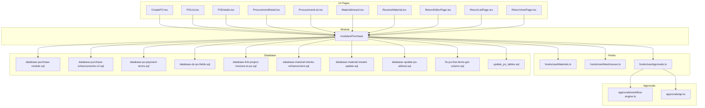
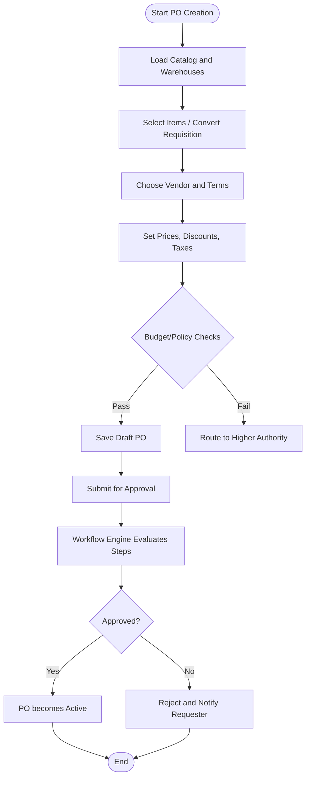
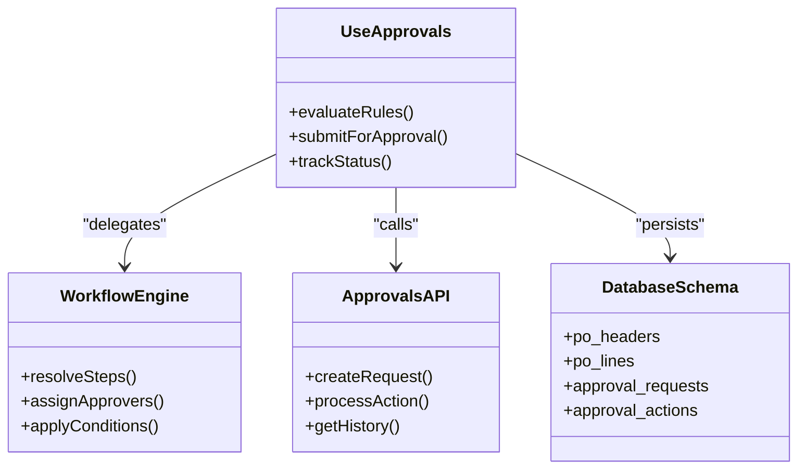
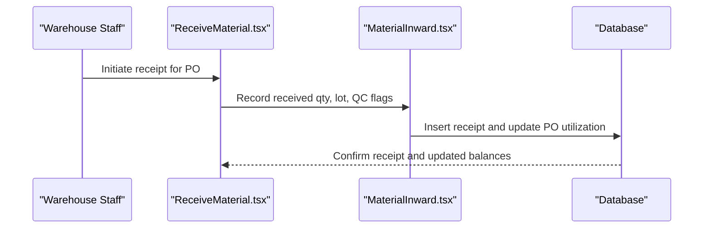
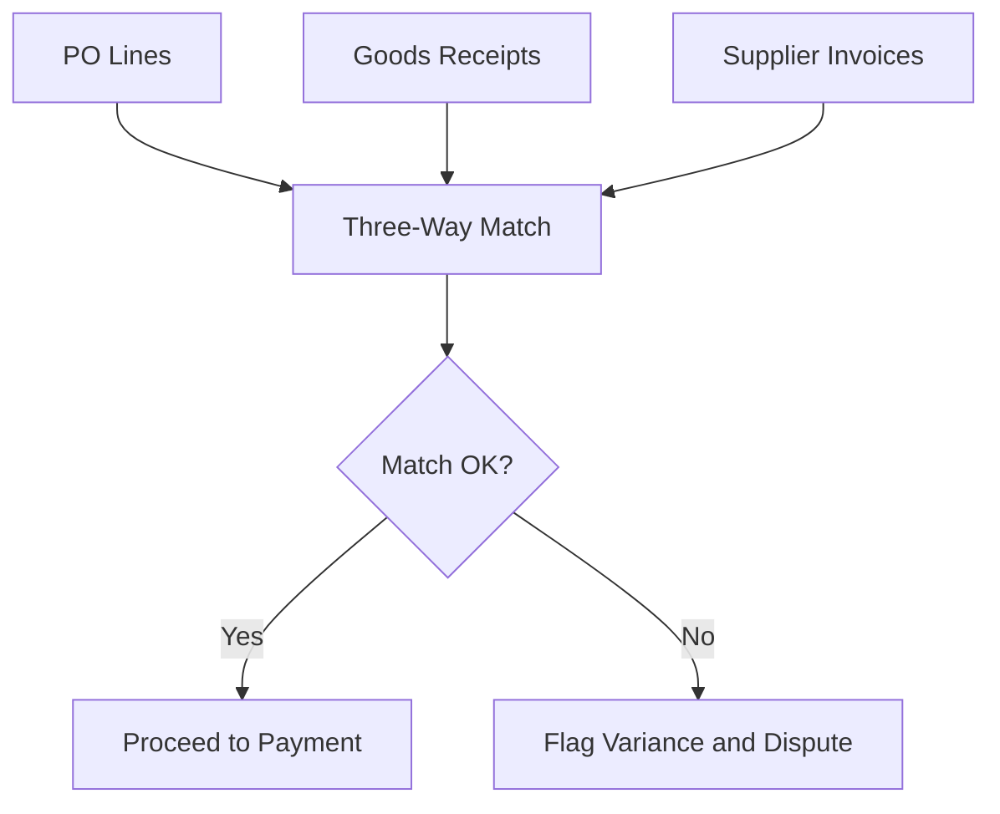
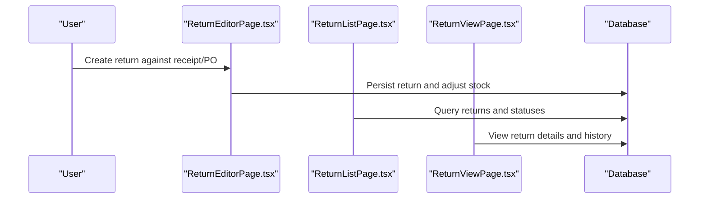
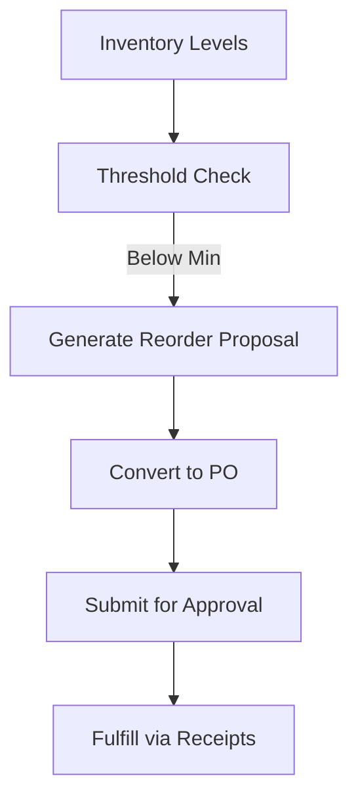
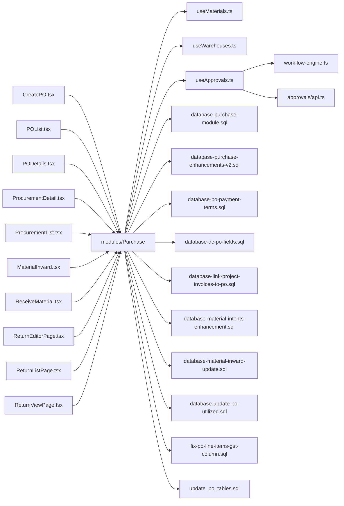

# Purchase Orders

<cite>
**Referenced Files in This Document**
- [CreatePO.tsx](file://src/pages/CreatePO.tsx)
- [POList.tsx](file://src/pages/POList.tsx)
- [PODetails.tsx](file://src/pages/PODetails.tsx)
- [ProcurementDetail.tsx](file://src/pages/ProcurementDetail.tsx)
- [ProcurementList.tsx](file://src/pages/ProcurementList.tsx)
- [MaterialInward.tsx](file://src/pages/MaterialInward.tsx)
- [ReceiveMaterial.tsx](file://src/pages/ReceiveMaterial.tsx)
- [ReturnEditorPage.tsx](file://src/pages/ReturnEditorPage.tsx)
- [ReturnListPage.tsx](file://src/pages/ReturnListPage.tsx)
- [ReturnViewPage.tsx](file://src/pages/ReturnViewPage.tsx)
- [PurchaseModule](file://src/modules/Purchase)
- [database-purchase-module.sql](file://src/database-purchase-module.sql)
- [database-purchase-enhancements-v2.sql](file://src/database-purchase-enhancements-v2.sql)
- [database-po-payment-terms.sql](file://src/database-po-payment-terms.sql)
- [database-dc-po-fields.sql](file://src/database-dc-po-fields.sql)
- [database-link-project-invoices-to-po.sql](file://src/database-link-project-invoices-to-po.sql)
- [database-material-intents-enhancement.sql](file://src/database-material-intents-enhancement.sql)
- [database-material-inward-update.sql](file://src/database-material-inward-update.sql)
- [database-update-po-utilized.sql](file://src/database-update-po-utilized.sql)
- [fix-po-line-items-gst-column.sql](file://src/fix-po-line-items-gst-column.sql)
- [update_po_tables.sql](file://update_po_tables.sql)
- [migrate_create_po.cjs](file://migrate_create_po.cjs)
- [useMaterials.ts](file://src/hooks/useMaterials.ts)
- [useWarehouses.ts](file://src/hooks/useWarehouses.ts)
- [useApprovals.ts](file://src/hooks/useApprovals.ts)
- [approvals/workflow-engine.ts](file://src/approvals/workflow-engine.ts)
- [approvals/api.ts](file://src/approvals/api.ts)
</cite>

## Table of Contents
1. [Introduction](#introduction)
2. [Project Structure](#project-structure)
3. [Core Components](#core-components)
4. [Architecture Overview](#architecture-overview)
5. [Detailed Component Analysis](#detailed-component-analysis)
6. [Dependency Analysis](#dependency-analysis)
7. [Performance Considerations](#performance-considerations)
8. [Troubleshooting Guide](#troubleshooting-guide)
9. [Conclusion](#conclusion)
10. [Appendices](#appendices)

## Introduction
This document explains the Purchase Order Management system, covering end-to-end procurement workflows: creation from material requisitions, vendor selection and pricing negotiation, approval routing, status tracking, fulfillment via goods receipt, quality inspection integration, three-way matching with invoices, partial deliveries, returns, vendor performance tracking, budget controls and policy enforcement, and integrations with inventory systems including automated reordering triggers. The content is grounded in the repository’s pages, modules, database migrations, and approvals infrastructure.

## Project Structure
The purchase order functionality spans UI pages, a dedicated module, hooks for data access, and database schema definitions. Key areas include:
- Pages for creating, listing, viewing POs and related procurement documents
- Module entry points for purchase features
- Database migrations defining tables and relationships for POs, receipts, returns, and integrations
- Approval workflow engine and API used by POs and other documents



**Diagram sources**
- [CreatePO.tsx](file://src/pages/CreatePO.tsx)
- [POList.tsx](file://src/pages/POList.tsx)
- [PODetails.tsx](file://src/pages/PODetails.tsx)
- [ProcurementDetail.tsx](file://src/pages/ProcurementDetail.tsx)
- [ProcurementList.tsx](file://src/pages/ProcurementList.tsx)
- [MaterialInward.tsx](file://src/pages/MaterialInward.tsx)
- [ReceiveMaterial.tsx](file://src/pages/ReceiveMaterial.tsx)
- [ReturnEditorPage.tsx](file://src/pages/ReturnEditorPage.tsx)
- [ReturnListPage.tsx](file://src/pages/ReturnListPage.tsx)
- [ReturnViewPage.tsx](file://src/pages/ReturnViewPage.tsx)
- [PurchaseModule](file://src/modules/Purchase)
- [useMaterials.ts](file://src/hooks/useMaterials.ts)
- [useWarehouses.ts](file://src/hooks/useWarehouses.ts)
- [useApprovals.ts](file://src/hooks/useApprovals.ts)
- [approvals/workflow-engine.ts](file://src/approvals/workflow-engine.ts)
- [approvals/api.ts](file://src/approvals/api.ts)
- [database-purchase-module.sql](file://src/database-purchase-module.sql)
- [database-purchase-enhancements-v2.sql](file://src/database-purchase-enhancements-v2.sql)
- [database-po-payment-terms.sql](file://src/database-po-payment-terms.sql)
- [database-dc-po-fields.sql](file://src/database-dc-po-fields.sql)
- [database-link-project-invoices-to-po.sql](file://src/database-link-project-invoices-to-po.sql)
- [database-material-intents-enhancement.sql](file://src/database-material-intents-enhancement.sql)
- [database-material-inward-update.sql](file://src/database-material-inward-update.sql)
- [database-update-po-utilized.sql](file://src/database-update-po-utilized.sql)
- [fix-po-line-items-gst-column.sql](file://src/fix-po-line-items-gst-column.sql)
- [update_po_tables.sql](file://update_po_tables.sql)

**Section sources**
- [CreatePO.tsx](file://src/pages/CreatePO.tsx)
- [POList.tsx](file://src/pages/POList.tsx)
- [PODetails.tsx](file://src/pages/PODetails.tsx)
- [ProcurementDetail.tsx](file://src/pages/ProcurementDetail.tsx)
- [ProcurementList.tsx](file://src/pages/ProcurementList.tsx)
- [MaterialInward.tsx](file://src/pages/MaterialInward.tsx)
- [ReceiveMaterial.tsx](file://src/pages/ReceiveMaterial.tsx)
- [ReturnEditorPage.tsx](file://src/pages/ReturnEditorPage.tsx)
- [ReturnListPage.tsx](file://src/pages/ReturnListPage.tsx)
- [ReturnViewPage.tsx](file://src/pages/ReturnViewPage.tsx)
- [PurchaseModule](file://src/modules/Purchase)
- [useMaterials.ts](file://src/hooks/useMaterials.ts)
- [useWarehouses.ts](file://src/hooks/useWarehouses.ts)
- [useApprovals.ts](file://src/hooks/useApprovals.ts)
- [approvals/workflow-engine.ts](file://src/approvals/workflow-engine.ts)
- [approvals/api.ts](file://src/approvals/api.ts)
- [database-purchase-module.sql](file://src/database-purchase-module.sql)
- [database-purchase-enhancements-v2.sql](file://src/database-purchase-enhancements-v2.sql)
- [database-po-payment-terms.sql](file://src/database-po-payment-terms.sql)
- [database-dc-po-fields.sql](file://src/database-dc-po-fields.sql)
- [database-link-project-invoices-to-po.sql](file://src/database-link-project-invoices-to-po.sql)
- [database-material-intents-enhancement.sql](file://src/database-material-intents-enhancement.sql)
- [database-material-inward-update.sql](file://src/database-material-inward-update.sql)
- [database-update-po-utilized.sql](file://src/database-update-po-utilized.sql)
- [fix-po-line-items-gst-column.sql](file://src/fix-po-line-items-gst-column.sql)
- [update_po_tables.sql](file://update_po_tables.sql)

## Core Components
- Purchase Order Creation: UI page to create POs, link to requisitions or material intents, select vendors, set pricing, taxes, payment terms, and project context.
- PO Listing and Detail Views: Browse, filter, and drill into PO details, line items, approvals, and fulfillment status.
- Procurement Workflows: Dedicated pages for procurement detail and list views to coordinate sourcing and negotiations.
- Goods Receipt and Inward: Material inward and receiving pages to record received quantities, lot/batch info, and link back to PO lines.
- Returns: Editor, list, and view pages for return processing against POs and receipts.
- Approvals Integration: Reusable hooks and workflow engine to route POs through multi-step approvals based on policies.
- Data Access Hooks: Materials and warehouses hooks to support item selection, stock checks, and warehouse targeting.
- Database Schema: Migrations that define core entities (PO headers/lines), enhancements (payment terms, DC linkage, invoice linking), and operational updates (utilization tracking, GST column fixes).

Key responsibilities:
- CreatePO.tsx orchestrates PO creation flows and validation.
- POList.tsx and PODetails.tsx provide navigation and detailed context.
- ProcurementDetail.tsx and ProcurementList.tsx manage sourcing activities and vendor interactions.
- MaterialInward.tsx and ReceiveMaterial.tsx capture inbound logistics and quality attributes.
- Return* pages handle reverse logistics and credit notes linkage.
- useApprovals.ts integrates with approvals/workflow-engine.ts and approvals/api.ts to enforce governance.
- useMaterials.ts and useWarehouses.ts supply catalog and location data.
- Database migrations define persistent structures and constraints.

**Section sources**
- [CreatePO.tsx](file://src/pages/CreatePO.tsx)
- [POList.tsx](file://src/pages/POList.tsx)
- [PODetails.tsx](file://src/pages/PODetails.tsx)
- [ProcurementDetail.tsx](file://src/pages/ProcurementDetail.tsx)
- [ProcurementList.tsx](file://src/pages/ProcurementList.tsx)
- [MaterialInward.tsx](file://src/pages/MaterialInward.tsx)
- [ReceiveMaterial.tsx](file://src/pages/ReceiveMaterial.tsx)
- [ReturnEditorPage.tsx](file://src/pages/ReturnEditorPage.tsx)
- [ReturnListPage.tsx](file://src/pages/ReturnListPage.tsx)
- [ReturnViewPage.tsx](file://src/pages/ReturnViewPage.tsx)
- [useMaterials.ts](file://src/hooks/useMaterials.ts)
- [useWarehouses.ts](file://src/hooks/useWarehouses.ts)
- [useApprovals.ts](file://src/hooks/useApprovals.ts)
- [approvals/workflow-engine.ts](file://src/approvals/workflow-engine.ts)
- [approvals/api.ts](file://src/approvals/api.ts)
- [database-purchase-module.sql](file://src/database-purchase-module.sql)
- [database-purchase-enhancements-v2.sql](file://src/database-purchase-enhancements-v2.sql)
- [database-po-payment-terms.sql](file://src/database-po-payment-terms.sql)
- [database-dc-po-fields.sql](file://src/database-dc-po-fields.sql)
- [database-link-project-invoices-to-po.sql](file://src/database-link-project-invoices-to-po.sql)
- [database-material-intents-enhancement.sql](file://src/database-material-intents-enhancement.sql)
- [database-material-inward-update.sql](file://src/database-material-inward-update.sql)
- [database-update-po-utilized.sql](file://src/database-update-po-utilized.sql)
- [fix-po-line-items-gst-column.sql](file://src/fix-po-line-items-gst-column.sql)
- [update_po_tables.sql](file://update_po_tables.sql)

## Architecture Overview
The system follows a layered architecture:
- Presentation Layer: React pages for user interactions across PO lifecycle.
- Domain Layer: Purchase module encapsulates business logic and orchestration.
- Integration Layer: Hooks and APIs connect to Supabase-backed data stores and approvals engine.
- Persistence Layer: Relational schema defined by SQL migrations.

```mermaid
sequenceDiagram
participant User as "User"
participant Page as "CreatePO.tsx"
participant Module as "modules/Purchase"
participant HookMat as "useMaterials.ts"
participant HookWh as "useWarehouses.ts"
participant HookApp as "useApprovals.ts"
participant WF as "workflow-engine.ts"
participant DB as "Database Migrations"
User->>Page : Open PO creation form
Page->>HookMat : Load materials/catalog
Page->>HookWh : Load warehouses
Page->>Module : Build draft PO (items, vendor, pricing)
Module->>DB : Persist draft PO header/lines
Module->>HookApp : Evaluate approval rules
HookApp->>WF : Resolve workflow steps
WF-->>HookApp : Next approvers and conditions
HookApp-->>Module : Approval state and notifications
Module-->>Page : Draft saved; approval pending
User->>Page : Submit for approval
Page->>Module : Transition to approved/rejected
Module->>DB : Update PO status and audit trail
```

**Diagram sources**
- [CreatePO.tsx](file://src/pages/CreatePO.tsx)
- [PurchaseModule](file://src/modules/Purchase)
- [useMaterials.ts](file://src/hooks/useMaterials.ts)
- [useWarehouses.ts](file://src/hooks/useWarehouses.ts)
- [useApprovals.ts](file://src/hooks/useApprovals.ts)
- [approvals/workflow-engine.ts](file://src/approvals/workflow-engine.ts)
- [database-purchase-module.sql](file://src/database-purchase-module.sql)

## Detailed Component Analysis

### Purchase Order Creation from Material Requisitions
- Entry point: CreatePO.tsx provides the form and orchestration to build a PO.
- Inputs: Material requisitions or material intents can be converted into PO lines; catalogs are loaded via useMaterials.ts; target warehouse via useWarehouses.ts.
- Vendor selection and pricing: Users choose vendors and set unit prices, discounts, taxes, and payment terms. Payment terms are supported by dedicated migration.
- Policy checks: Budget controls and spending limits are enforced before submission; if exceeded, the workflow routes to higher authorities.
- Output: A draft PO is persisted with header and line items, then routed through approvals.



**Diagram sources**
- [CreatePO.tsx](file://src/pages/CreatePO.tsx)
- [useMaterials.ts](file://src/hooks/useMaterials.ts)
- [useWarehouses.ts](file://src/hooks/useWarehouses.ts)
- [database-po-payment-terms.sql](file://src/database-po-payment-terms.sql)
- [approvals/workflow-engine.ts](file://src/approvals/workflow-engine.ts)

**Section sources**
- [CreatePO.tsx](file://src/pages/CreatePO.tsx)
- [useMaterials.ts](file://src/hooks/useMaterials.ts)
- [useWarehouses.ts](file://src/hooks/useWarehouses.ts)
- [database-po-payment-terms.sql](file://src/database-po-payment-terms.sql)
- [approvals/workflow-engine.ts](file://src/approvals/workflow-engine.ts)

### Vendor Selection and Pricing Negotiation
- Vendor management and selection occur within the PO creation flow and procurement pages.
- Pricing negotiation is captured at line level, including negotiated rates, discounts, and tax configurations.
- Historical last quoted rates and vendor mappings inform decisions and ensure compliance with negotiated contracts.

**Section sources**
- [ProcurementDetail.tsx](file://src/pages/ProcurementDetail.tsx)
- [ProcurementList.tsx](file://src/pages/ProcurementList.tsx)
- [CreatePO.tsx](file://src/pages/CreatePO.tsx)

### PO Approval Workflows and Status Tracking
- Approval integration uses useApprovals.ts which delegates to the workflow engine and API.
- Status transitions are tracked in the database; utilization fields reflect fulfillment progress.
- Audit trails and notifications are generated during transitions.



**Diagram sources**
- [useApprovals.ts](file://src/hooks/useApprovals.ts)
- [approvals/workflow-engine.ts](file://src/approvals/workflow-engine.ts)
- [approvals/api.ts](file://src/approvals/api.ts)
- [database-purchase-module.sql](file://src/database-purchase-module.sql)

**Section sources**
- [useApprovals.ts](file://src/hooks/useApprovals.ts)
- [approvals/workflow-engine.ts](file://src/approvals/workflow-engine.ts)
- [approvals/api.ts](file://src/approvals/api.ts)
- [database-update-po-utilized.sql](file://src/database-update-po-utilized.sql)

### Fulfillment Processes and Goods Receipt Matching
- Goods receipt is recorded via MaterialInward.tsx and ReceiveMaterial.tsx, linking receipts to PO lines.
- Receipts capture received quantities, dates, batch/lot, and optional quality attributes.
- Utilization fields track how much of each PO line has been fulfilled.



**Diagram sources**
- [ReceiveMaterial.tsx](file://src/pages/ReceiveMaterial.tsx)
- [MaterialInward.tsx](file://src/pages/MaterialInward.tsx)
- [database-material-inward-update.sql](file://src/database-material-inward-update.sql)
- [database-update-po-utilized.sql](file://src/database-update-po-utilized.sql)

**Section sources**
- [ReceiveMaterial.tsx](file://src/pages/ReceiveMaterial.tsx)
- [MaterialInward.tsx](file://src/pages/MaterialInward.tsx)
- [database-material-inward-update.sql](file://src/database-material-inward-update.sql)
- [database-update-po-utilized.sql](file://src/database-update-po-utilized.sql)

### Quality Inspection Integration
- Quality attributes can be attached during inward recording to support inspection outcomes.
- Inspection results influence acceptance, quarantine, or rejection decisions and subsequent actions (e.g., returns).

**Section sources**
- [MaterialInward.tsx](file://src/pages/MaterialInward.tsx)
- [ReceiveMaterial.tsx](file://src/pages/ReceiveMaterial.tsx)

### Three-Way Matching with Invoices
- Three-way matching aligns PO lines, receipts, and invoices.
- Linking between invoices and POs is supported by dedicated migration, enabling matching logic and variance handling.



**Diagram sources**
- [database-link-project-invoices-to-po.sql](file://src/database-link-project-invoices-to-po.sql)
- [database-dc-po-fields.sql](file://src/database-dc-po-fields.sql)

**Section sources**
- [database-link-project-invoices-to-po.sql](file://src/database-link-project-invoices-to-po.sql)
- [database-dc-po-fields.sql](file://src/database-dc-po-fields.sql)

### Partial Deliveries
- Partial deliveries are supported by allowing multiple receipts per PO line until full quantity is fulfilled.
- Utilization fields track remaining open quantities and guide follow-up actions.

**Section sources**
- [database-update-po-utilized.sql](file://src/database-update-po-utilized.sql)
- [ReceiveMaterial.tsx](file://src/pages/ReceiveMaterial.tsx)

### Return Processing
- Return flows are managed via ReturnEditorPage.tsx, ReturnListPage.tsx, and ReturnViewPage.tsx.
- Returns reference receipts and PO lines, enabling credit note generation and inventory adjustments.



**Diagram sources**
- [ReturnEditorPage.tsx](file://src/pages/ReturnEditorPage.tsx)
- [ReturnListPage.tsx](file://src/pages/ReturnListPage.tsx)
- [ReturnViewPage.tsx](file://src/pages/ReturnViewPage.tsx)

**Section sources**
- [ReturnEditorPage.tsx](file://src/pages/ReturnEditorPage.tsx)
- [ReturnListPage.tsx](file://src/pages/ReturnListPage.tsx)
- [ReturnViewPage.tsx](file://src/pages/ReturnViewPage.tsx)

### Vendor Performance Tracking
- Vendor performance metrics can be derived from PO fulfillment, receipt accuracy, return rates, and pricing adherence.
- These metrics inform future vendor selection and negotiation strategies.

**Section sources**
- [ProcurementDetail.tsx](file://src/pages/ProcurementDetail.tsx)
- [ProcurementList.tsx](file://src/pages/ProcurementList.tsx)
- [database-purchase-enhancements-v2.sql](file://src/database-purchase-enhancements-v2.sql)

### Budget Controls, Spending Limits, and Policy Enforcement
- Before submission, budget checks evaluate available funds and policy thresholds.
- If limits are exceeded, the workflow escalates to additional approvers or blocks submission until exceptions are authorized.

**Section sources**
- [CreatePO.tsx](file://src/pages/CreatePO.tsx)
- [approvals/workflow-engine.ts](file://src/approvals/workflow-engine.ts)

### Integration with Inventory Systems and Automated Reordering Triggers
- Material intents and inward updates integrate with inventory to maintain accurate stock levels.
- Automated reordering triggers can be configured based on minimum stock thresholds and consumption patterns.



**Diagram sources**
- [database-material-intents-enhancement.sql](file://src/database-material-intents-enhancement.sql)
- [database-material-inward-update.sql](file://src/database-material-inward-update.sql)

**Section sources**
- [database-material-intents-enhancement.sql](file://src/database-material-intents-enhancement.sql)
- [database-material-inward-update.sql](file://src/database-material-inward-update.sql)

## Dependency Analysis
The following diagram maps key dependencies among pages, module, hooks, approvals, and database migrations.



**Diagram sources**
- [CreatePO.tsx](file://src/pages/CreatePO.tsx)
- [POList.tsx](file://src/pages/POList.tsx)
- [PODetails.tsx](file://src/pages/PODetails.tsx)
- [ProcurementDetail.tsx](file://src/pages/ProcurementDetail.tsx)
- [ProcurementList.tsx](file://src/pages/ProcurementList.tsx)
- [MaterialInward.tsx](file://src/pages/MaterialInward.tsx)
- [ReceiveMaterial.tsx](file://src/pages/ReceiveMaterial.tsx)
- [ReturnEditorPage.tsx](file://src/pages/ReturnEditorPage.tsx)
- [ReturnListPage.tsx](file://src/pages/ReturnListPage.tsx)
- [ReturnViewPage.tsx](file://src/pages/ReturnViewPage.tsx)
- [PurchaseModule](file://src/modules/Purchase)
- [useMaterials.ts](file://src/hooks/useMaterials.ts)
- [useWarehouses.ts](file://src/hooks/useWarehouses.ts)
- [useApprovals.ts](file://src/hooks/useApprovals.ts)
- [approvals/workflow-engine.ts](file://src/approvals/workflow-engine.ts)
- [approvals/api.ts](file://src/approvals/api.ts)
- [database-purchase-module.sql](file://src/database-purchase-module.sql)
- [database-purchase-enhancements-v2.sql](file://src/database-purchase-enhancements-v2.sql)
- [database-po-payment-terms.sql](file://src/database-po-payment-terms.sql)
- [database-dc-po-fields.sql](file://src/database-dc-po-fields.sql)
- [database-link-project-invoices-to-po.sql](file://src/database-link-project-invoices-to-po.sql)
- [database-material-intents-enhancement.sql](file://src/database-material-intents-enhancement.sql)
- [database-material-inward-update.sql](file://src/database-material-inward-update.sql)
- [database-update-po-utilized.sql](file://src/database-update-po-utilized.sql)
- [fix-po-line-items-gst-column.sql](file://src/fix-po-line-items-gst-column.sql)
- [update_po_tables.sql](file://update_po_tables.sql)

**Section sources**
- [CreatePO.tsx](file://src/pages/CreatePO.tsx)
- [POList.tsx](file://src/pages/POList.tsx)
- [PODetails.tsx](file://src/pages/PODetails.tsx)
- [ProcurementDetail.tsx](file://src/pages/ProcurementDetail.tsx)
- [ProcurementList.tsx](file://src/pages/ProcurementList.tsx)
- [MaterialInward.tsx](file://src/pages/MaterialInward.tsx)
- [ReceiveMaterial.tsx](file://src/pages/ReceiveMaterial.tsx)
- [ReturnEditorPage.tsx](file://src/pages/ReturnEditorPage.tsx)
- [ReturnListPage.tsx](file://src/pages/ReturnListPage.tsx)
- [ReturnViewPage.tsx](file://src/pages/ReturnViewPage.tsx)
- [PurchaseModule](file://src/modules/Purchase)
- [useMaterials.ts](file://src/hooks/useMaterials.ts)
- [useWarehouses.ts](file://src/hooks/useWarehouses.ts)
- [useApprovals.ts](file://src/hooks/useApprovals.ts)
- [approvals/workflow-engine.ts](file://src/approvals/workflow-engine.ts)
- [approvals/api.ts](file://src/approvals/api.ts)
- [database-purchase-module.sql](file://src/database-purchase-module.sql)
- [database-purchase-enhancements-v2.sql](file://src/database-purchase-enhancements-v2.sql)
- [database-po-payment-terms.sql](file://src/database-po-payment-terms.sql)
- [database-dc-po-fields.sql](file://src/database-dc-po-fields.sql)
- [database-link-project-invoices-to-po.sql](file://src/database-link-project-invoices-to-po.sql)
- [database-material-intents-enhancement.sql](file://src/database-material-intents-enhancement.sql)
- [database-material-inward-update.sql](file://src/database-material-inward-update.sql)
- [database-update-po-utilized.sql](file://src/database-update-po-utilized.sql)
- [fix-po-line-items-gst-column.sql](file://src/fix-po-line-items-gst-column.sql)
- [update_po_tables.sql](file://update_po_tables.sql)

## Performance Considerations
- Batch operations: When creating POs with many line items, prefer batched writes to reduce round trips.
- Indexing: Ensure indexes on frequently queried columns such as PO numbers, vendor IDs, and status fields.
- Pagination: For large lists (POs, receipts, returns), implement server-side pagination and filtering.
- Caching: Cache catalog and warehouse lookups where appropriate to minimize repeated queries.
- Optimistic updates: Apply optimistic UI updates for non-critical transitions to improve responsiveness.

[No sources needed since this section provides general guidance]

## Troubleshooting Guide
Common issues and resolutions:
- Approval not triggered: Verify workflow configuration and approver assignments; check approval request logs.
- Budget exceeded unexpectedly: Review budget settings and policy thresholds; confirm currency and exchange rates.
- Three-way match failures: Validate PO lines, receipt quantities, and invoice amounts; investigate variance flags.
- Partial delivery mismatches: Check utilization fields and reconcile outstanding quantities.
- GST calculation errors: Ensure GST columns are correctly populated and migrated.

**Section sources**
- [useApprovals.ts](file://src/hooks/useApprovals.ts)
- [approvals/workflow-engine.ts](file://src/approvals/workflow-engine.ts)
- [database-link-project-invoices-to-po.sql](file://src/database-link-project-invoices-to-po.sql)
- [database-update-po-utilized.sql](file://src/database-update-po-utilized.sql)
- [fix-po-line-items-gst-column.sql](file://src/fix-po-line-items-gst-column.sql)

## Conclusion
The Purchase Order Management system provides a comprehensive, integrated solution spanning requisition conversion, vendor selection, pricing negotiation, approvals, fulfillment, quality inspection, three-way matching, returns, and vendor performance analytics. Its modular design, robust approvals integration, and well-defined database schema enable scalable and compliant procurement operations. Continuous improvements should focus on performance optimizations, enhanced reporting, and deeper automation for reordering and policy enforcement.

[No sources needed since this section summarizes without analyzing specific files]

## Appendices

### Migration and Utility Scripts Reference
- Migration scripts for core purchase module, enhancements, payment terms, DC linkage, invoice linking, material intents, inward updates, utilization tracking, GST fixes, and table updates.
- Utility scripts for migrating PO creation logic and UI scaffolding.

**Section sources**
- [database-purchase-module.sql](file://src/database-purchase-module.sql)
- [database-purchase-enhancements-v2.sql](file://src/database-purchase-enhancements-v2.sql)
- [database-po-payment-terms.sql](file://src/database-po-payment-terms.sql)
- [database-dc-po-fields.sql](file://src/database-dc-po-fields.sql)
- [database-link-project-invoices-to-po.sql](file://src/database-link-project-invoices-to-po.sql)
- [database-material-intents-enhancement.sql](file://src/database-material-intents-enhancement.sql)
- [database-material-inward-update.sql](file://src/database-material-inward-update.sql)
- [database-update-po-utilized.sql](file://src/database-update-po-utilized.sql)
- [fix-po-line-items-gst-column.sql](file://src/fix-po-line-items-gst-column.sql)
- [update_po_tables.sql](file://update_po_tables.sql)
- [migrate_create_po.cjs](file://migrate_create_po.cjs)