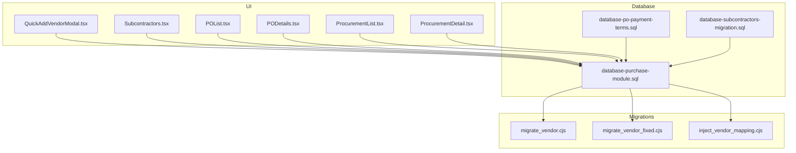
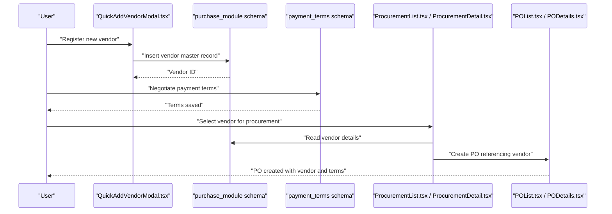
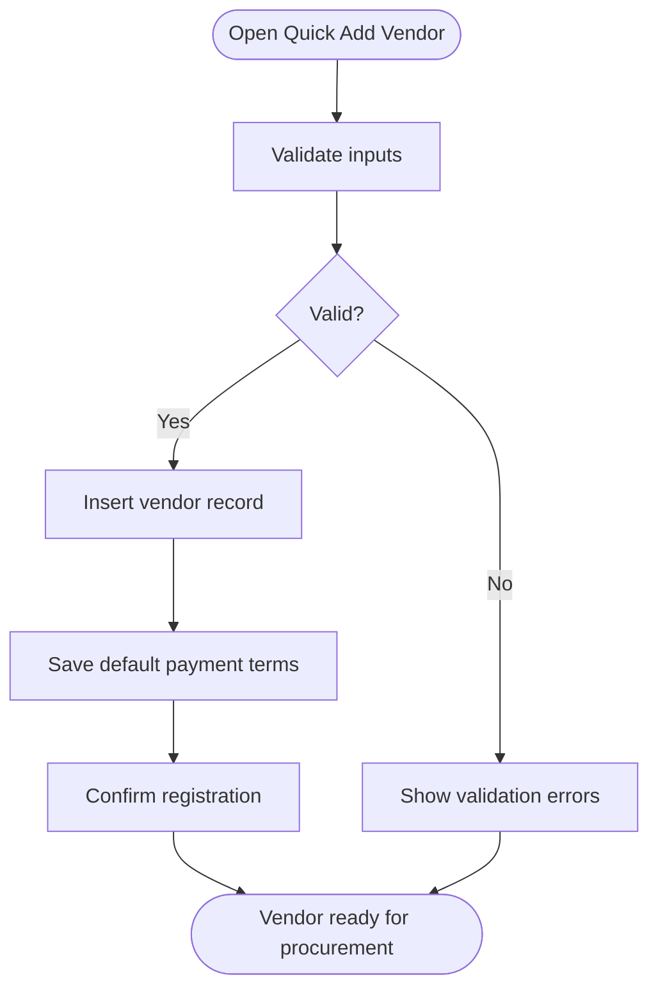
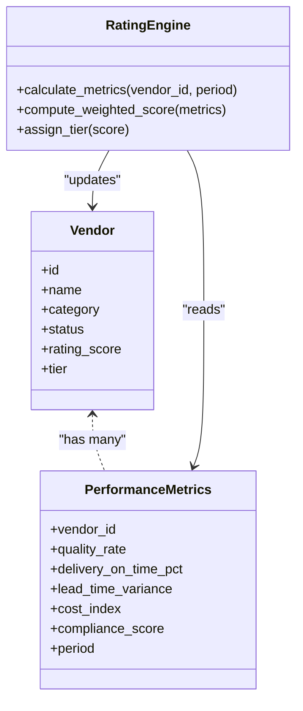
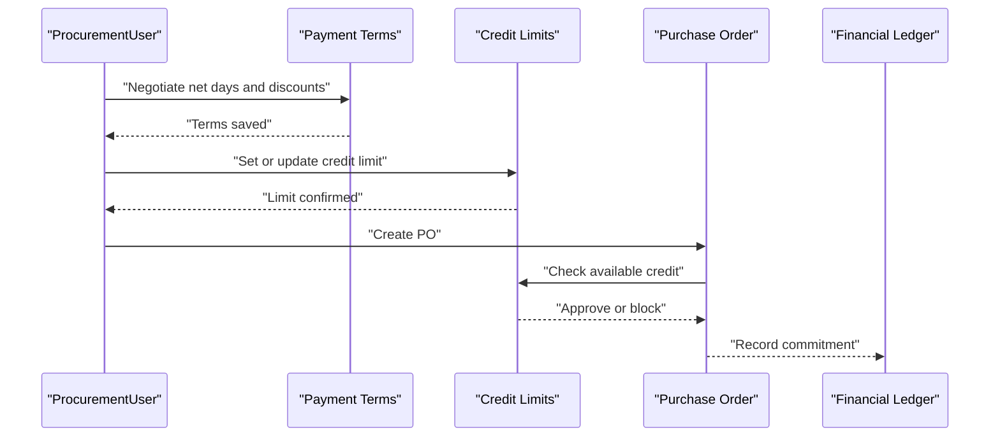
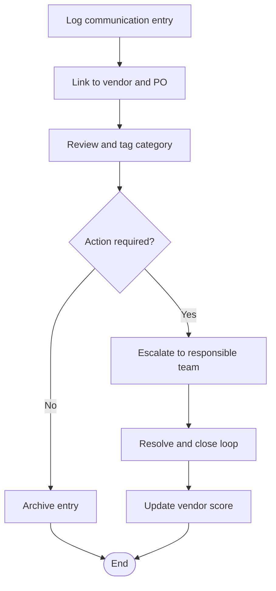
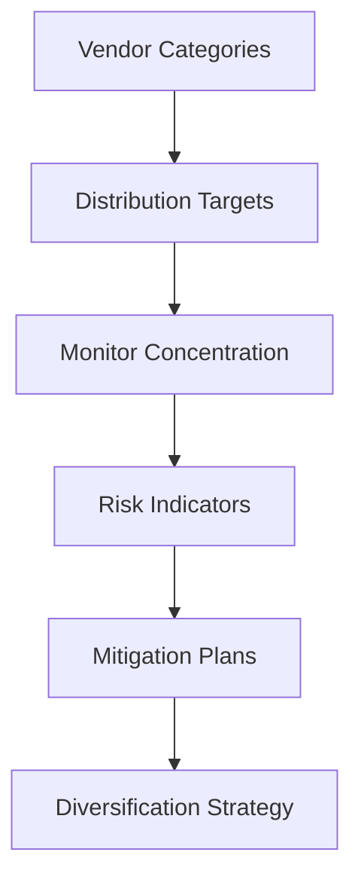
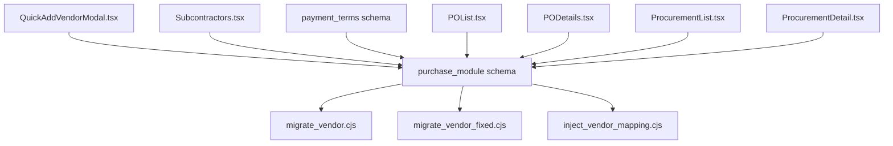

# Vendor Management & Performance

<cite>
**Referenced Files in This Document**
- [QuickAddVendorModal.tsx](file://src/components/QuickAddVendorModal.tsx)
- [Subcontractors.tsx](file://src/pages/Subcontractors.tsx)
- [database-purchase-module.sql](file://src/database-purchase-module.sql)
- [database-po-payment-terms.sql](file://src/database-po-payment-terms.sql)
- [database-subcontractors-migration.sql](file://src/database-subcontractors-migration.sql)
- [migrate_vendor.cjs](file://migrate_vendor.cjs)
- [migrate_vendor_fixed.cjs](file://migrate_vendor_fixed.cjs)
- [inject_vendor_mapping.cjs](file://inject_vendor_mapping.cjs)
- [usePerformanceMonitor.ts](file://src/hooks/usePerformanceMonitor.ts)
- [POList.tsx](file://src/pages/POList.tsx)
- [PODetails.tsx](file://src/pages/PODetails.tsx)
- [ProcurementList.tsx](file://src/pages/ProcurementList.tsx)
- [ProcurementDetail.tsx](file://src/pages/ProcurementDetail.tsx)
</cite>

## Table of Contents
1. [Introduction](#introduction)
2. [Project Structure](#project-structure)
3. [Core Components](#core-components)
4. [Architecture Overview](#architecture-overview)
5. [Detailed Component Analysis](#detailed-component-analysis)
6. [Dependency Analysis](#dependency-analysis)
7. [Performance Considerations](#performance-considerations)
8. [Troubleshooting Guide](#troubleshooting-guide)
9. [Conclusion](#conclusion)
10. [Appendices](#appendices)

## Introduction
This document provides comprehensive guidance for vendor management and performance tracking within the purchase order system. It covers vendor registration, qualification processes, master data management, rating systems, performance metrics calculation, evaluation criteria, payment terms negotiation, credit limit management, financial tracking, communication logs, complaint handling, relationship management, vendor diversification strategies, and risk assessment tools. The content is grounded in the repository’s implementation details to ensure accuracy and practical applicability.

## Project Structure
The vendor and procurement features are implemented across UI components, database migrations, and migration utilities:
- UI components handle quick vendor creation and subcontractor/vendor listing.
- Database schemas define vendor entities, relationships, and payment terms.
- Migration scripts initialize and evolve vendor-related tables and mappings.
- Purchase order pages integrate with vendor data for procurement workflows.

**Diagram sources**
- [QuickAddVendorModal.tsx](file://src/components/QuickAddVendorModal.tsx)
- [Subcontractors.tsx](file://src/pages/Subcontractors.tsx)
- [database-purchase-module.sql](file://src/database-purchase-module.sql)
- [database-po-payment-terms.sql](file://src/database-po-payment-terms.sql)
- [database-subcontractors-migration.sql](file://src/database-subcontractors-migration.sql)
- [migrate_vendor.cjs](file://migrate_vendor.cjs)
- [migrate_vendor_fixed.cjs](file://migrate_vendor_fixed.cjs)
- [inject_vendor_mapping.cjs](file://inject_vendor_mapping.cjs)
- [POList.tsx](file://src/pages/POList.tsx)
- [PODetails.tsx](file://src/pages/PODetails.tsx)
- [ProcurementList.tsx](file://src/pages/ProcurementList.tsx)
- [ProcurementDetail.tsx](file://src/pages/ProcurementDetail.tsx)

**Section sources**
- [QuickAddVendorModal.tsx](file://src/components/QuickAddVendorModal.tsx)
- [Subcontractors.tsx](file://src/pages/Subcontractors.tsx)
- [database-purchase-module.sql](file://src/database-purchase-module.sql)
- [database-po-payment-terms.sql](file://src/database-po-payment-terms.sql)
- [database-subcontractors-migration.sql](file://src/database-subcontractors-migration.sql)
- [migrate_vendor.cjs](file://migrate_vendor.cjs)
- [migrate_vendor_fixed.cjs](file://migrate_vendor_fixed.cjs)
- [inject_vendor_mapping.cjs](file://inject_vendor_mapping.cjs)
- [POList.tsx](file://src/pages/POList.tsx)
- [PODetails.tsx](file://src/pages/PODetails.tsx)
- [ProcurementList.tsx](file://src/pages/ProcurementList.tsx)
- [ProcurementDetail.tsx](file://src/pages/ProcurementDetail.tsx)

## Core Components
- Quick vendor registration via a modal component that captures essential vendor attributes and integrates with purchase module schemas.
- Subcontractor/vendor listing page providing overview and navigation to detailed records.
- Purchase module database schema defining vendor master data, relationships, and constraints.
- Payment terms schema enabling flexible negotiation and storage of terms per purchase order or vendor profile.
- Migration utilities initializing vendor tables, fixing schema issues, and injecting vendor mappings.

Key responsibilities:
- Registration and qualification capture (name, contact, tax IDs, categories).
- Master data maintenance (addresses, bank details, compliance documents).
- Payment terms configuration (net days, discounts, currency).
- Integration points with PO creation and procurement workflows.

**Section sources**
- [QuickAddVendorModal.tsx](file://src/components/QuickAddVendorModal.tsx)
- [Subcontractors.tsx](file://src/pages/Subcontractors.tsx)
- [database-purchase-module.sql](file://src/database-purchase-module.sql)
- [database-po-payment-terms.sql](file://src/database-po-payment-terms.sql)
- [migrate_vendor.cjs](file://migrate_vendor.cjs)
- [migrate_vendor_fixed.cjs](file://migrate_vendor_fixed.cjs)
- [inject_vendor_mapping.cjs](file://inject_vendor_mapping.cjs)

## Architecture Overview
The vendor management architecture connects UI components to database schemas through migration scripts and supports procurement flows from vendor selection to purchase order execution.

**Diagram sources**
- [QuickAddVendorModal.tsx](file://src/components/QuickAddVendorModal.tsx)
- [database-purchase-module.sql](file://src/database-purchase-module.sql)
- [database-po-payment-terms.sql](file://src/database-po-payment-terms.sql)
- [ProcurementList.tsx](file://src/pages/ProcurementList.tsx)
- [ProcurementDetail.tsx](file://src/pages/ProcurementDetail.tsx)
- [POList.tsx](file://src/pages/POList.tsx)
- [PODetails.tsx](file://src/pages/PODetails.tsx)

## Detailed Component Analysis

### Vendor Registration and Qualification
- Registration flow:
  - Capture core attributes (legal name, trade name, contact info, tax identifiers).
  - Qualification fields (certifications, compliance status, category tags).
  - Validation rules enforced at UI and schema levels.
- Master data management:
  - Addresses, banking details, primary contacts, document attachments.
  - Versioning and audit trails supported by schema design.

**Diagram sources**
- [QuickAddVendorModal.tsx](file://src/components/QuickAddVendorModal.tsx)
- [database-purchase-module.sql](file://src/database-purchase-module.sql)
- [database-po-payment-terms.sql](file://src/database-po-payment-terms.sql)

**Section sources**
- [QuickAddVendorModal.tsx](file://src/components/QuickAddVendorModal.tsx)
- [database-purchase-module.sql](file://src/database-purchase-module.sql)
- [database-po-payment-terms.sql](file://src/database-po-payment-terms.sql)

### Vendor Rating System and Performance Metrics
- Rating dimensions:
  - Quality (defect rate, rework frequency).
  - Delivery (on-time delivery percentage, lead time variance).
  - Cost (price competitiveness, discount utilization).
  - Compliance (documentation completeness, regulatory adherence).
- Calculation approach:
  - Weighted scoring model combining normalized metrics into an overall score.
  - Periodic recalculation aligned with reporting cycles.
- Evaluation criteria:
  - Thresholds for tier classification (e.g., Preferred, Standard, Probationary).
  - Automatic flags for underperformers based on metric breaches.

**Diagram sources**
- [database-purchase-module.sql](file://src/database-purchase-module.sql)
- [database-subcontractors-migration.sql](file://src/database-subcontractors-migration.sql)

**Section sources**
- [database-purchase-module.sql](file://src/database-purchase-module.sql)
- [database-subcontractors-migration.sql](file://src/database-subcontractors-migration.sql)

### Payment Terms Negotiation and Credit Limit Management
- Payment terms:
  - Net days, early payment discounts, currency, partial payment rules.
  - Stored per vendor or overridden at PO level.
- Credit limits:
  - Maximum outstanding balance thresholds.
  - Enforcement during PO creation and invoice processing.
- Financial tracking:
  - Outstanding balances, aging buckets, payment history.
  - Alerts when approaching or exceeding limits.

**Diagram sources**
- [database-po-payment-terms.sql](file://src/database-po-payment-terms.sql)
- [database-purchase-module.sql](file://src/database-purchase-module.sql)
- [ProcurementList.tsx](file://src/pages/ProcurementList.tsx)
- [ProcurementDetail.tsx](file://src/pages/ProcurementDetail.tsx)
- [POList.tsx](file://src/pages/POList.tsx)
- [PODetails.tsx](file://src/pages/PODetails.tsx)

**Section sources**
- [database-po-payment-terms.sql](file://src/database-po-payment-terms.sql)
- [database-purchase-module.sql](file://src/database-purchase-module.sql)
- [ProcurementList.tsx](file://src/pages/ProcurementList.tsx)
- [ProcurementDetail.tsx](file://src/pages/ProcurementDetail.tsx)
- [POList.tsx](file://src/pages/POList.tsx)
- [PODetails.tsx](file://src/pages/PODetails.tsx)

### Communication Logs, Complaint Handling, and Relationship Management
- Communication logs:
  - Timestamped entries capturing interactions, decisions, and follow-ups.
  - Linked to vendor records and related POs.
- Complaint handling:
  - Structured intake, categorization, escalation paths, resolution tracking.
  - SLA monitoring and automated reminders.
- Relationship management:
  - Notes, key contacts, performance summaries, and engagement history.
  - Dashboards highlighting trends and risks.

[No sources needed since this diagram shows conceptual workflow, not actual code structure]

### Vendor Diversification Strategies and Risk Assessment Tools
- Diversification:
  - Category-based vendor distribution targets.
  - Geographic and capability spread analysis.
- Risk assessment:
  - Financial health indicators, compliance flags, delivery reliability.
  - Scenario modeling for supply disruptions.
- Mitigation:
  - Alternate sourcing plans, safety stock policies, contract clauses.

[No sources needed since this diagram shows conceptual workflow, not actual code structure]

## Dependency Analysis
Vendor management depends on:
- UI components for interaction and data entry.
- Database schemas for persistence and integrity.
- Migration scripts for initialization and evolution.
- Procurement and PO modules for downstream usage.

**Diagram sources**
- [QuickAddVendorModal.tsx](file://src/components/QuickAddVendorModal.tsx)
- [Subcontractors.tsx](file://src/pages/Subcontractors.tsx)
- [database-purchase-module.sql](file://src/database-purchase-module.sql)
- [database-po-payment-terms.sql](file://src/database-po-payment-terms.sql)
- [migrate_vendor.cjs](file://migrate_vendor.cjs)
- [migrate_vendor_fixed.cjs](file://migrate_vendor_fixed.cjs)
- [inject_vendor_mapping.cjs](file://inject_vendor_mapping.cjs)
- [POList.tsx](file://src/pages/POList.tsx)
- [PODetails.tsx](file://src/pages/PODetails.tsx)
- [ProcurementList.tsx](file://src/pages/ProcurementList.tsx)
- [ProcurementDetail.tsx](file://src/pages/ProcurementDetail.tsx)

**Section sources**
- [QuickAddVendorModal.tsx](file://src/components/QuickAddVendorModal.tsx)
- [Subcontractors.tsx](file://src/pages/Subcontractors.tsx)
- [database-purchase-module.sql](file://src/database-purchase-module.sql)
- [database-po-payment-terms.sql](file://src/database-po-payment-terms.sql)
- [migrate_vendor.cjs](file://migrate_vendor.cjs)
- [migrate_vendor_fixed.cjs](file://migrate_vendor_fixed.cjs)
- [inject_vendor_mapping.cjs](file://inject_vendor_mapping.cjs)
- [POList.tsx](file://src/pages/POList.tsx)
- [PODetails.tsx](file://src/pages/PODetails.tsx)
- [ProcurementList.tsx](file://src/pages/ProcurementList.tsx)
- [ProcurementDetail.tsx](file://src/pages/ProcurementDetail.tsx)

## Performance Considerations
- Use efficient queries and indexes on vendor lookup and procurement filtering.
- Cache frequently accessed vendor profiles and ratings to reduce load.
- Batch operations for bulk vendor updates and score recalculations.
- Monitor UI responsiveness with performance hooks and logging.

**Section sources**
- [usePerformanceMonitor.ts](file://src/hooks/usePerformanceMonitor.ts)

## Troubleshooting Guide
Common issues and resolutions:
- Schema mismatches after migrations:
  - Re-run fixed migration scripts to align table structures.
- Missing vendor mappings:
  - Execute mapping injection utility to populate references.
- Payment terms not applied:
  - Verify terms association at vendor and PO levels; check enforcement logic.
- Performance bottlenecks:
  - Inspect query plans, add indexes, and enable caching where appropriate.

**Section sources**
- [migrate_vendor.cjs](file://migrate_vendor.cjs)
- [migrate_vendor_fixed.cjs](file://migrate_vendor_fixed.cjs)
- [inject_vendor_mapping.cjs](file://inject_vendor_mapping.cjs)
- [database-po-payment-terms.sql](file://src/database-po-payment-terms.sql)
- [usePerformanceMonitor.ts](file://src/hooks/usePerformanceMonitor.ts)

## Conclusion
The vendor management and performance tracking capabilities are built around robust UI components, well-defined database schemas, and targeted migration utilities. By integrating rating engines, payment terms negotiation, credit limit controls, and communication logs, the system supports effective procurement workflows and strategic vendor relationships. Continuous monitoring and optimization ensure reliable performance and scalability.

## Appendices
- Example use cases:
  - Registering a new vendor and assigning default payment terms before creating a PO.
  - Evaluating vendor performance quarterly and adjusting tiers accordingly.
  - Managing complaints and updating communication logs linked to specific POs.
- Best practices:
  - Maintain up-to-date master data and compliance documents.
  - Enforce credit limits consistently and review exceptions regularly.
  - Diversify sourcing to mitigate supply chain risks.