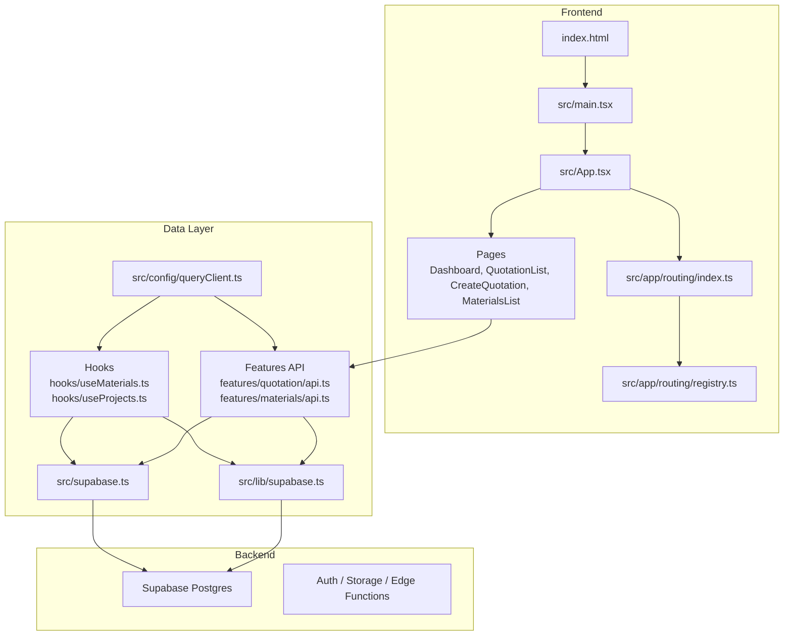
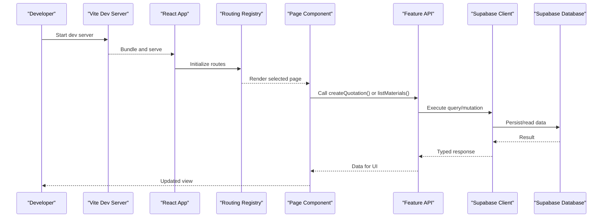
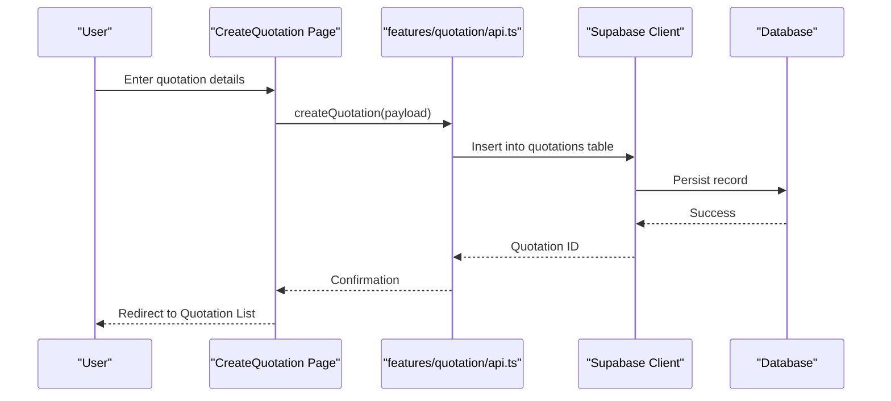
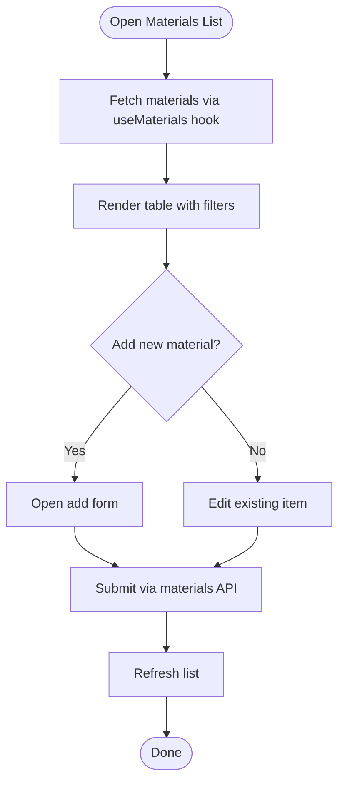
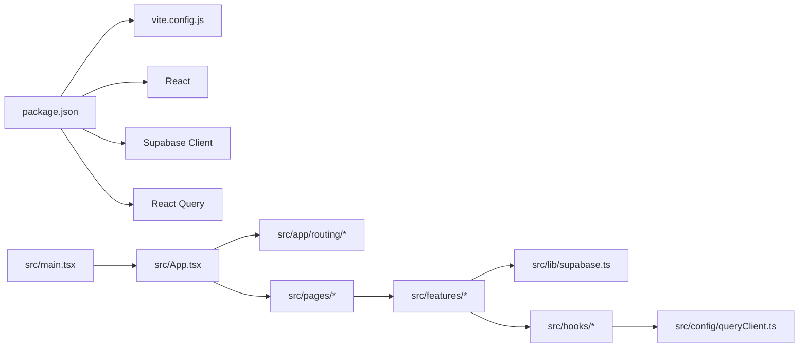

# Getting Started

<cite>
**Referenced Files in This Document**
- [package.json](file://package.json)
- [vite.config.js](file://vite.config.js)
- [index.html](file://index.html)
- [src/main.tsx](file://src/main.tsx)
- [src/App.tsx](file://src/App.tsx)
- [src/supabase.ts](file://src/supabase.ts)
- [src/config/queryClient.ts](file://src/config/queryClient.ts)
- [src/lib/supabase.ts](file://src/lib/supabase.ts)
- [src/pages/Dashboard.tsx](file://src/pages/Dashboard.tsx)
- [src/pages/QuotationList.tsx](file://src/pages/QuotationList.tsx)
- [src/pages/CreateQuotation.tsx](file://src/pages/CreateQuotation.tsx)
- [src/pages/MaterialsList.tsx](file://src/pages/MaterialsList.tsx)
- [src/features/quotation/api.ts](file://src/features/quotation/api.ts)
- [src/features/materials/api.ts](file://src/features/materials/api.ts)
- [src/hooks/useMaterials.ts](file://src/hooks/useMaterials.ts)
- [src/hooks/useProjects.ts](file://src/hooks/useProjects.ts)
- [src/app/routing/index.ts](file://src/app/routing/index.ts)
- [src/app/routing/registry.ts](file://src/app/routing/registry.ts)
- [supabase/migrations/001_initial_schema.sql](file://supabase/migrations/001_initial_schema.sql)
- [sql/database-setup.sql](file://sql/database-setup.sql)
- [docs/follow-up-centre/SUPABASE_SETUP.md](file://docs/follow-up-centre/SUPABASE_SETUP.md)
- [docs/GOOGLE_OAUTH_SETUP.md](file://docs/GOOGLE_OAUTH_SETUP.md)
</cite>

## Table of Contents
1. Introduction
2. Project Structure
3. Core Components
4. Architecture Overview
5. Detailed Component Analysis
6. Dependency Analysis
7. Performance Considerations
8. Troubleshooting Guide
9. Conclusion

## Introduction
MEP Project ERP is a construction and manufacturing enterprise resource planning system designed to streamline quotations, materials management, projects, approvals, and related workflows for MEP contractors, fabricators, and manufacturers. It provides:
- A modern web interface built with Vite and React
- Real-time data access via Supabase (PostgreSQL + Auth + Storage)
- Domain-focused modules for Quotations, Materials, Projects, Approvals, and more
- Extensible architecture with feature folders and typed APIs

Target audience:
- Construction and fabrication teams managing end-to-end project lifecycles
- Manufacturing units coordinating material usage and production
- Small to mid-sized enterprises needing an integrated ERP without heavy infrastructure

Core value propositions:
- Unified platform for sales-to-delivery processes
- Strong data model and auditability through SQL migrations
- Developer-friendly setup with clear configuration and local development tooling

## Project Structure
The application is a Vite-based React app with feature-oriented organization:
- src/app: routing registry and types
- src/features: domain modules (quotation, materials, etc.)
- src/pages: top-level pages and flows
- src/hooks: reusable data hooks
- src/lib: shared utilities including Supabase client
- supabase/migrations: database schema evolution
- sql: additional setup scripts
- docs: setup guides and product documentation

**Diagram sources**
- [index.html:1-50](file://index.html#L1-L50)
- [src/main.tsx:1-40](file://src/main.tsx#L1-L40)
- [src/App.tsx:1-60](file://src/App.tsx#L1-L60)
- [src/app/routing/index.ts:1-40](file://src/app/routing/index.ts#L1-L40)
- [src/app/routing/registry.ts:1-40](file://src/app/routing/registry.ts#L1-L40)
- [src/pages/Dashboard.tsx:1-40](file://src/pages/Dashboard.tsx#L1-L40)
- [src/pages/QuotationList.tsx:1-40](file://src/pages/QuotationList.tsx#L1-L40)
- [src/pages/CreateQuotation.tsx:1-40](file://src/pages/CreateQuotation.tsx#L1-L40)
- [src/pages/MaterialsList.tsx:1-40](file://src/pages/MaterialsList.tsx#L1-L40)
- [src/lib/supabase.ts:1-40](file://src/lib/supabase.ts#L1-L40)
- [src/supabase.ts:1-40](file://src/supabase.ts#L1-L40)
- [src/config/queryClient.ts:1-40](file://src/config/queryClient.ts#L1-L40)
- [src/features/quotation/api.ts:1-40](file://src/features/quotation/api.ts#L1-L40)
- [src/features/materials/api.ts:1-40](file://src/features/materials/api.ts#L1-L40)
- [src/hooks/useMaterials.ts:1-40](file://src/hooks/useMaterials.ts#L1-L40)
- [src/hooks/useProjects.ts:1-40](file://src/hooks/useProjects.ts#L1-L40)

**Section sources**
- [package.json:1-60](file://package.json#L1-L60)
- [vite.config.js:1-60](file://vite.config.js#L1-L60)
- [index.html:1-50](file://index.html#L1-L50)
- [src/main.tsx:1-40](file://src/main.tsx#L1-L40)
- [src/App.tsx:1-60](file://src/App.tsx#L1-L60)
- [src/app/routing/index.ts:1-40](file://src/app/routing/index.ts#L1-L40)
- [src/app/routing/registry.ts:1-40](file://src/app/routing/registry.ts#L1-L40)

## Core Components
- Application bootstrap: entrypoint initializes the React app and configures global providers and query client.
- Routing: central registry maps routes to page components for navigation.
- Data layer: Supabase client configured for environment variables; features expose typed APIs; hooks encapsulate queries and mutations.
- Pages: Dashboard, Quotation List, Create Quotation, Materials List provide core user flows.

Key responsibilities:
- Environment-driven configuration for Supabase URL and keys
- Feature-scoped APIs that call Supabase tables and RPCs
- Hooks that manage caching, loading states, and error handling
- Page components orchestrating UI interactions and business logic

**Section sources**
- [src/main.tsx:1-40](file://src/main.tsx#L1-L40)
- [src/config/queryClient.ts:1-40](file://src/config/queryClient.ts#L1-L40)
- [src/app/routing/index.ts:1-40](file://src/app/routing/index.ts#L1-L40)
- [src/app/routing/registry.ts:1-40](file://src/app/routing/registry.ts#L1-L40)
- [src/lib/supabase.ts:1-40](file://src/lib/supabase.ts#L1-L40)
- [src/supabase.ts:1-40](file://src/supabase.ts#L1-L40)

## Architecture Overview
The frontend uses Vite for fast builds and dev server, React for UI, and Supabase as backend-as-a-service. Queries and mutations are handled by a typed feature API layer and React Query via a configured query client.

**Diagram sources**
- [vite.config.js:1-60](file://vite.config.js#L1-L60)
- [src/main.tsx:1-40](file://src/main.tsx#L1-L40)
- [src/app/routing/index.ts:1-40](file://src/app/routing/index.ts#L1-L40)
- [src/pages/CreateQuotation.tsx:1-40](file://src/pages/CreateQuotation.tsx#L1-L40)
- [src/pages/MaterialsList.tsx:1-40](file://src/pages/MaterialsList.tsx#L1-L40)
- [src/features/quotation/api.ts:1-40](file://src/features/quotation/api.ts#L1-L40)
- [src/features/materials/api.ts:1-40](file://src/features/materials/api.ts#L1-L40)
- [src/lib/supabase.ts:1-40](file://src/lib/supabase.ts#L1-L40)

## Detailed Component Analysis

### Installation and Environment Setup
- Prerequisites: Node.js LTS recommended, npm or pnpm/yarn available.
- Install dependencies:
  - Run the package manager install command from the repository root.
- Configure environment variables:
  - Create a .env file at the project root with Supabase URL and anon key.
  - Ensure these values match your Supabase project settings.
- Build and run:
  - Use the provided scripts to start the dev server and build assets.

Environment variables typically include:
- SUPABASE_URL
- SUPABASE_ANON_KEY

Optional integrations:
- Google OAuth: follow the guide to enable provider and configure redirect URIs.

**Section sources**
- [package.json:1-60](file://package.json#L1-L60)
- [vite.config.js:1-60](file://vite.config.js#L1-L60)
- [docs/GOOGLE_OAUTH_SETUP.md:1-40](file://docs/GOOGLE_OAUTH_SETUP.md#L1-L40)

### Database Initialization
- Apply initial schema using Supabase migrations or SQL scripts:
  - Use the migration file under supabase/migrations to set up core tables.
  - Optionally run additional setup scripts under sql for extended features.
- Verify connectivity:
  - Confirm the Supabase client can connect using the configured URL and anon key.

Recommended steps:
- Import the initial migration into your Supabase project.
- If needed, execute supplementary SQL files for specific modules.

**Section sources**
- [supabase/migrations/001_initial_schema.sql:1-40](file://supabase/migrations/001_initial_schema.sql#L1-L40)
- [sql/database-setup.sql:1-40](file://sql/database-setup.sql#L1-L40)
- [docs/follow-up-centre/SUPABASE_SETUP.md:1-40](file://docs/follow-up-centre/SUPABASE_SETUP.md#L1-L40)

### Local Development Workflow
- Start the dev server:
  - Launch the Vite dev server to get hot module replacement and fast refresh.
- Navigate to pages:
  - Access Dashboard, Quotation List, Create Quotation, and Materials List via the routing registry.
- Inspect network calls:
  - Use browser dev tools to verify API calls to Supabase.
- Debugging tips:
  - Check console logs for errors in feature APIs and hooks.
  - Validate environment variables if Supabase calls fail.

**Section sources**
- [vite.config.js:1-60](file://vite.config.js#L1-L60)
- [src/app/routing/index.ts:1-40](file://src/app/routing/index.ts#L1-L40)
- [src/app/routing/registry.ts:1-40](file://src/app/routing/registry.ts#L1-L40)
- [src/pages/Dashboard.tsx:1-40](file://src/pages/Dashboard.tsx#L1-L40)
- [src/pages/QuotationList.tsx:1-40](file://src/pages/QuotationList.tsx#L1-L40)
- [src/pages/CreateQuotation.tsx:1-40](file://src/pages/CreateQuotation.tsx#L1-L40)
- [src/pages/MaterialsList.tsx:1-40](file://src/pages/MaterialsList.tsx#L1-L40)

### Creating Your First Quotation
End-to-end flow:
- Open the Create Quotation page.
- Fill required fields such as client, date, and items.
- Submit the form to persist the quotation via the quotation API.
- View the created quotation in the Quotation List.

**Diagram sources**
- [src/pages/CreateQuotation.tsx:1-40](file://src/pages/CreateQuotation.tsx#L1-L40)
- [src/features/quotation/api.ts:1-40](file://src/features/quotation/api.ts#L1-L40)
- [src/lib/supabase.ts:1-40](file://src/lib/supabase.ts#L1-L40)

**Section sources**
- [src/pages/CreateQuotation.tsx:1-40](file://src/pages/CreateQuotation.tsx#L1-L40)
- [src/features/quotation/api.ts:1-40](file://src/features/quotation/api.ts#L1-L40)

### Managing Materials
Common tasks:
- Browse materials via the Materials List page.
- Add new materials using the materials API.
- Update quantities and categories as needed.

**Diagram sources**
- [src/pages/MaterialsList.tsx:1-40](file://src/pages/MaterialsList.tsx#L1-L40)
- [src/features/materials/api.ts:1-40](file://src/features/materials/api.ts#L1-L40)
- [src/hooks/useMaterials.ts:1-40](file://src/hooks/useMaterials.ts#L1-L40)

**Section sources**
- [src/pages/MaterialsList.tsx:1-40](file://src/pages/MaterialsList.tsx#L1-L40)
- [src/features/materials/api.ts:1-40](file://src/features/materials/api.ts#L1-L40)
- [src/hooks/useMaterials.ts:1-40](file://src/hooks/useMaterials.ts#L1-L40)

### Navigation and Routing
- The routing registry maps URLs to page components.
- Use the registry to add new routes and organize navigation.
- Ensure route guards and permissions are applied where necessary.

**Section sources**
- [src/app/routing/index.ts:1-40](file://src/app/routing/index.ts#L1-L40)
- [src/app/routing/registry.ts:1-40](file://src/app/routing/registry.ts#L1-L40)

## Dependency Analysis
Key runtime dependencies:
- Vite for build and dev server
- React for UI framework
- Supabase client for data access
- React Query via configured query client for caching and state synchronization

**Diagram sources**
- [package.json:1-60](file://package.json#L1-L60)
- [vite.config.js:1-60](file://vite.config.js#L1-L60)
- [src/main.tsx:1-40](file://src/main.tsx#L1-L40)
- [src/App.tsx:1-60](file://src/App.tsx#L1-L60)
- [src/app/routing/index.ts:1-40](file://src/app/routing/index.ts#L1-L40)
- [src/app/routing/registry.ts:1-40](file://src/app/routing/registry.ts#L1-L40)
- [src/lib/supabase.ts:1-40](file://src/lib/supabase.ts#L1-L40)
- [src/config/queryClient.ts:1-40](file://src/config/queryClient.ts#L1-L40)

**Section sources**
- [package.json:1-60](file://package.json#L1-L60)
- [vite.config.js:1-60](file://vite.config.js#L1-L60)
- [src/config/queryClient.ts:1-40](file://src/config/queryClient.ts#L1-L40)

## Performance Considerations
- Use feature-scoped APIs to keep requests targeted and cacheable.
- Leverage React Query configuration for optimal refetch policies and stale times.
- Avoid unnecessary re-renders by memoizing expensive computations in hooks.
- Paginate large lists and implement virtualization where appropriate.

[No sources needed since this section provides general guidance]

## Troubleshooting Guide
Common issues and resolutions:
- Supabase connection failures:
  - Verify SUPABASE_URL and SUPABASE_ANON_KEY in .env.
  - Ensure the Supabase project is active and accessible from your IP.
- Migration errors:
  - Re-run the initial migration or apply missing SQL scripts.
  - Check RLS policies if inserts/updates are denied.
- Routing not found:
  - Confirm route registration in the routing registry.
  - Ensure page components export default correctly.
- Network errors in feature APIs:
  - Inspect request payloads and responses in browser dev tools.
  - Validate table schemas and column names against migrations.

Debugging techniques:
- Enable verbose logging in the query client during development.
- Use breakpoints in feature APIs and hooks to inspect data flow.
- Test Supabase queries directly in the dashboard to isolate frontend issues.

**Section sources**
- [src/lib/supabase.ts:1-40](file://src/lib/supabase.ts#L1-L40)
- [src/config/queryClient.ts:1-40](file://src/config/queryClient.ts#L1-L40)
- [src/app/routing/registry.ts:1-40](file://src/app/routing/registry.ts#L1-L40)
- [supabase/migrations/001_initial_schema.sql:1-40](file://supabase/migrations/001_initial_schema.sql#L1-L40)

## Conclusion
You now have the essentials to install, configure, and run the MEP Project ERP locally. Start by setting up environment variables, initializing the database, and exploring core pages like Quotation and Materials. Use the feature APIs and hooks to extend functionality, and rely on the routing registry to integrate new modules seamlessly. For deeper setup details, consult the Supabase and OAuth guides included in the repository.