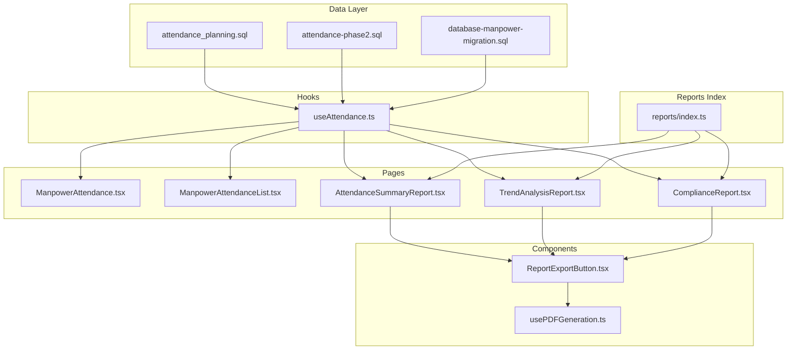
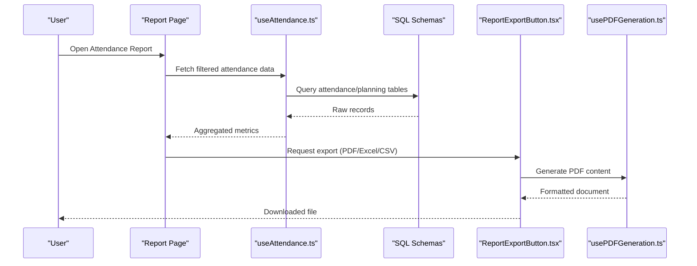
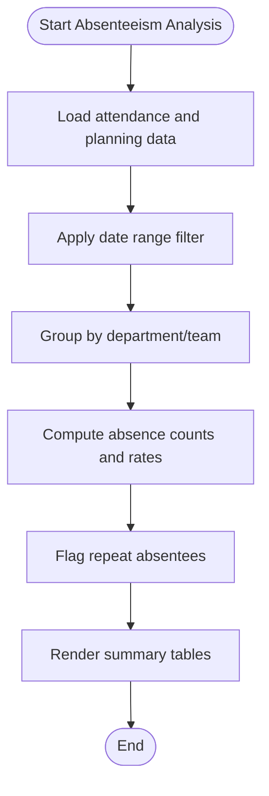
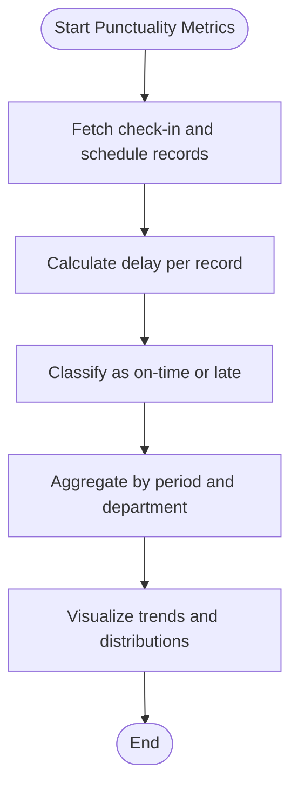
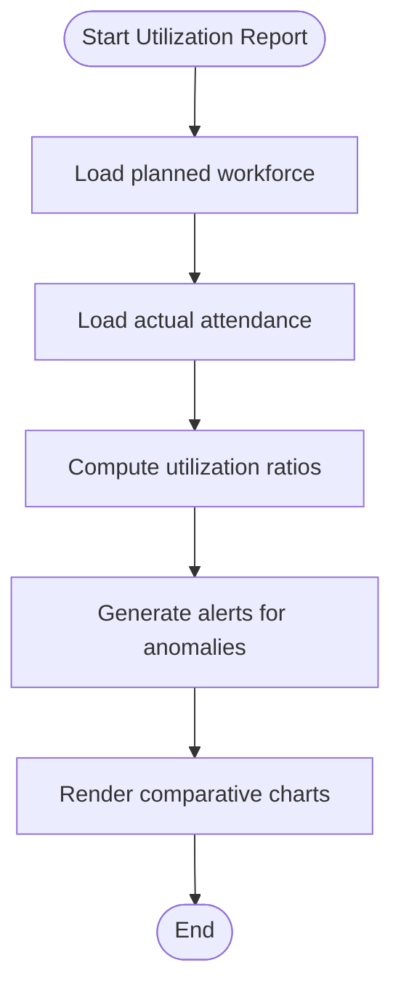
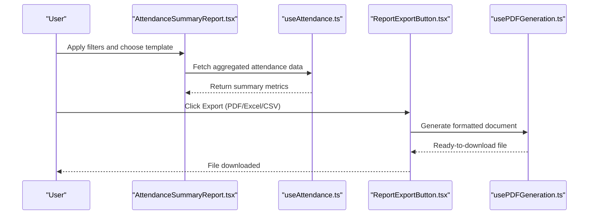
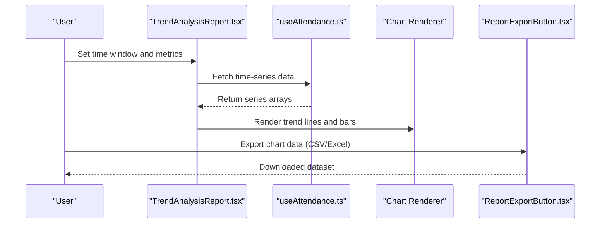
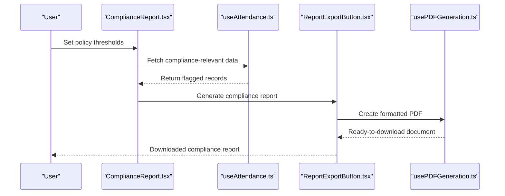
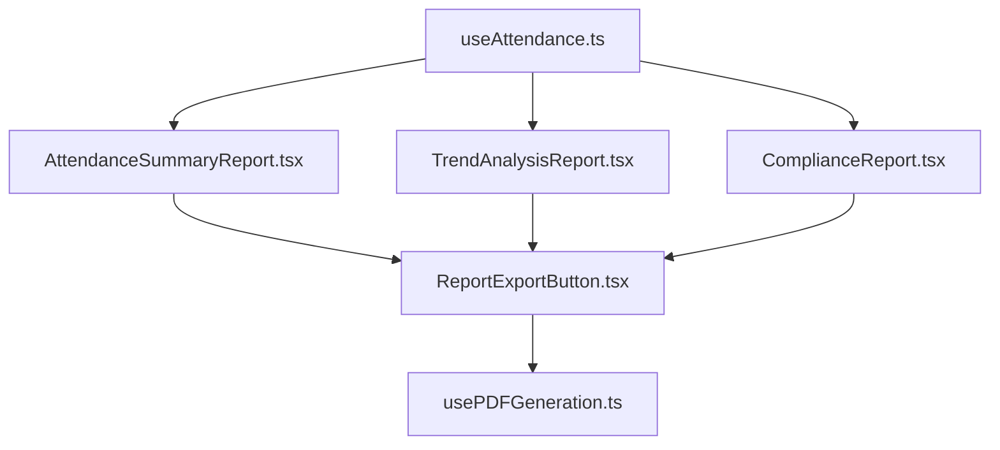

# Attendance Analytics & Reporting

<cite>
**Referenced Files in This Document**
- [useAttendance.ts](file://src/hooks/useAttendance.ts)
- [ManpowerAttendance.tsx](file://src/pages/ManpowerAttendance.tsx)
- [ManpowerAttendanceList.tsx](file://src/pages/ManpowerAttendanceList.tsx)
- [attendance_planning.sql](file://sql/attendance_planning.sql)
- [attendance_phase2.sql](file://sql/attendance-phase2.sql)
- [database-manpower-migration.sql](file://src/database-manpower-migration.sql)
- [reports/index.ts](file://src/reports/index.ts)
- [components/reports/ReportExportButton.tsx](file://src/components/reports/ReportExportButton.tsx)
- [hooks/usePDFGeneration.ts](file://src/hooks/usePDFGeneration.ts)
- [pages/reports/AttendanceSummaryReport.tsx](file://src/pages/reports/AttendanceSummaryReport.tsx)
- [pages/reports/TrendAnalysisReport.tsx](file://src/pages/reports/TrendAnalysisReport.tsx)
- [pages/reports/ComplianceReport.tsx](file://src/pages/reports/ComplianceReport.tsx)
</cite>

## Table of Contents
1. [Introduction](#introduction)
2. [Project Structure](#project-structure)
3. [Core Components](#core-components)
4. [Architecture Overview](#architecture-overview)
5. [Detailed Component Analysis](#detailed-component-analysis)
6. [Dependency Analysis](#dependency-analysis)
7. [Performance Considerations](#performance-considerations)
8. [Troubleshooting Guide](#troubleshooting-guide)
9. [Conclusion](#conclusion)
10. [Appendices](#appendices)

## Introduction
This document explains the attendance analytics and reporting capabilities, focusing on absenteeism analysis, punctuality metrics, workforce utilization reports, customizable report templates, date range filtering, department-wise breakdowns, export formats (PDF, Excel, CSV), KPI dashboards, automated scheduling and email delivery, and integration with external BI tools. It also provides troubleshooting guidance and performance optimization strategies for large datasets.

## Project Structure
The attendance analytics and reporting features are implemented across hooks, pages, SQL migrations, and reusable components:
- Hooks provide data access and business logic for attendance records and planning.
- Pages implement user-facing analytics views and report generators.
- SQL files define attendance schema and planning structures.
- Reusable components handle exports and PDF generation.

**Diagram sources**
- [attendance_planning.sql](file://sql/attendance_planning.sql)
- [attendance-phase2.sql](file://sql/attendance-phase2.sql)
- [database-manpower-migration.sql](file://src/database-manpower-migration.sql)
- [useAttendance.ts](file://src/hooks/useAttendance.ts)
- [ManpowerAttendance.tsx](file://src/pages/ManpowerAttendance.tsx)
- [ManpowerAttendanceList.tsx](file://src/pages/ManpowerAttendanceList.tsx)
- [AttendanceSummaryReport.tsx](file://src/pages/reports/AttendanceSummaryReport.tsx)
- [TrendAnalysisReport.tsx](file://src/pages/reports/TrendAnalysisReport.tsx)
- [ComplianceReport.tsx](file://src/pages/reports/ComplianceReport.tsx)
- [ReportExportButton.tsx](file://src/components/reports/ReportExportButton.tsx)
- [usePDFGeneration.ts](file://src/hooks/usePDFGeneration.ts)
- [reports/index.ts](file://src/reports/index.ts)

**Section sources**
- [useAttendance.ts](file://src/hooks/useAttendance.ts)
- [ManpowerAttendance.tsx](file://src/pages/ManpowerAttendance.tsx)
- [ManpowerAttendanceList.tsx](file://src/pages/ManpowerAttendanceList.tsx)
- [attendance_planning.sql](file://sql/attendance_planning.sql)
- [attendance-phase2.sql](file://sql/attendance-phase2.sql)
- [database-manpower-migration.sql](file://src/database-manpower-migration.sql)
- [reports/index.ts](file://src/reports/index.ts)
- [ReportExportButton.tsx](file://src/components/reports/ReportExportButton.tsx)
- [usePDFGeneration.ts](file://src/hooks/usePDFGeneration.ts)
- [AttendanceSummaryReport.tsx](file://src/pages/reports/AttendanceSummaryReport.tsx)
- [TrendAnalysisReport.tsx](file://src/pages/reports/TrendAnalysisReport.tsx)
- [ComplianceReport.tsx](file://src/pages/reports/ComplianceReport.tsx)

## Core Components
- Attendance Data Hook: Centralizes fetching, caching, and transformation of attendance records and planning data. Provides filtered results by date ranges and departments.
- Attendance Entry Pages: Provide UI for viewing and managing daily attendance and planning.
- Report Pages: Implement specific analytics such as summaries, trends, and compliance checks.
- Export Utilities: Offer standardized export to PDF, Excel, and CSV with consistent formatting.
- Reports Index: Aggregates available reports and their metadata for navigation and programmatic access.

Key responsibilities:
- Data retrieval and aggregation for absenteeism, punctuality, and utilization metrics.
- Rendering charts and tables for trend analysis and comparative insights.
- Generating formatted exports and integrating with PDF generation utilities.

**Section sources**
- [useAttendance.ts](file://src/hooks/useAttendance.ts)
- [ManpowerAttendance.tsx](file://src/pages/ManpowerAttendance.tsx)
- [ManpowerAttendanceList.tsx](file://src/pages/ManpowerAttendanceList.tsx)
- [AttendanceSummaryReport.tsx](file://src/pages/reports/AttendanceSummaryReport.tsx)
- [TrendAnalysisReport.tsx](file://src/pages/reports/TrendAnalysisReport.tsx)
- [ComplianceReport.tsx](file://src/pages/reports/ComplianceReport.tsx)
- [ReportExportButton.tsx](file://src/components/reports/ReportExportButton.tsx)
- [usePDFGeneration.ts](file://src/hooks/usePDFGeneration.ts)
- [reports/index.ts](file://src/reports/index.ts)

## Architecture Overview
The system follows a layered architecture:
- Data Layer: SQL schemas and migrations define attendance tables and planning structures.
- Hook Layer: useAttendance encapsulates data access and transformations.
- Presentation Layer: Pages render analytics and reports.
- Export Layer: Components and hooks generate PDF/Excel/CSV outputs.

**Diagram sources**
- [useAttendance.ts](file://src/hooks/useAttendance.ts)
- [attendance_planning.sql](file://sql/attendance_planning.sql)
- [attendance-phase2.sql](file://sql/attendance-phase2.sql)
- [AttendanceSummaryReport.tsx](file://src/pages/reports/AttendanceSummaryReport.tsx)
- [ReportExportButton.tsx](file://src/components/reports/ReportExportButton.tsx)
- [usePDFGeneration.ts](file://src/hooks/usePDFGeneration.ts)

## Detailed Component Analysis

### Absenteeism Analysis
Absenteeism analysis computes absence rates per employee, team, and department over configurable date ranges. It leverages attendance records and planned working days to derive metrics such as total absences, absence rate percentage, and recurring absentees.

- Data inputs: Daily attendance entries, planned schedules, department mappings.
- Metrics: Absence count, absence rate, repeat absence flags, department totals.
- Filtering: Date range, department, employee group.
- Output: Summary tables and charts highlighting high-absence areas.

**Diagram sources**
- [useAttendance.ts](file://src/hooks/useAttendance.ts)
- [attendance_planning.sql](file://sql/attendance_planning.sql)
- [attendance-phase2.sql](file://sql/attendance-phase2.sql)

**Section sources**
- [useAttendance.ts](file://src/hooks/useAttendance.ts)
- [attendance_planning.sql](file://sql/attendance_planning.sql)
- [attendance-phase2.sql](file://sql/attendance-phase2.sql)

### Punctuality Metrics
Punctuality metrics evaluate check-in timeliness against scheduled start times. Key indicators include average delay minutes, on-time arrival percentage, and late arrival frequency.

- Inputs: Check-in timestamps, scheduled start times, shift definitions.
- Calculations: Delay computation, thresholds for “on-time” vs “late”, rolling averages.
- Outputs: Trend lines and heatmaps showing punctuality patterns by day or week.

**Diagram sources**
- [useAttendance.ts](file://src/hooks/useAttendance.ts)
- [attendance_planning.sql](file://sql/attendance_planning.sql)

**Section sources**
- [useAttendance.ts](file://src/hooks/useAttendance.ts)
- [attendance_planning.sql](file://sql/attendance_planning.sql)

### Workforce Utilization Reports
Workforce utilization reports compare actual attendance against planned capacity to assess productivity and resource allocation.

- Inputs: Planned headcount, actual attendance, department assignments.
- Metrics: Utilization ratio, overtime indicators, underutilization alerts.
- Outputs: Comparative charts across teams and time periods.

**Diagram sources**
- [useAttendance.ts](file://src/hooks/useAttendance.ts)
- [attendance_planning.sql](file://sql/attendance_planning.sql)
- [attendance-phase2.sql](file://sql/attendance-phase2.sql)

**Section sources**
- [useAttendance.ts](file://src/hooks/useAttendance.ts)
- [attendance_planning.sql](file://sql/attendance_planning.sql)
- [attendance-phase2.sql](file://sql/attendance-phase2.sql)

### Customizable Report Templates
Report templates allow users to select fields, layouts, and grouping options. The template engine supports:
- Field selection (employee name, department, dates, metrics).
- Grouping by department, team, or project.
- Sorting and pagination controls.
- Header/footer customization and branding.

Template configuration is managed centrally via the reports index and consumed by each report page.

**Section sources**
- [reports/index.ts](file://src/reports/index.ts)
- [AttendanceSummaryReport.tsx](file://src/pages/reports/AttendanceSummaryReport.tsx)
- [TrendAnalysisReport.tsx](file://src/pages/reports/TrendAnalysisReport.tsx)
- [ComplianceReport.tsx](file://src/pages/reports/ComplianceReport.tsx)

### Date Range Filtering and Department-wise Breakdowns
Filters are applied at the hook layer to reduce payload size and improve performance:
- Date range filters constrain queries to relevant periods.
- Department filters enable drill-down into specific units.
- Combined filters support multi-dimensional analysis.

These filters are exposed in the UI and passed through to data requests.

**Section sources**
- [useAttendance.ts](file://src/hooks/useAttendance.ts)
- [ManpowerAttendanceList.tsx](file://src/pages/ManpowerAttendanceList.tsx)

### Concrete Examples

#### Generating Attendance Summaries
- Navigate to the Attendance Summary Report page.
- Select date range and department filters.
- Choose template fields and grouping options.
- Click Export to download PDF/Excel/CSV.

**Diagram sources**
- [AttendanceSummaryReport.tsx](file://src/pages/reports/AttendanceSummaryReport.tsx)
- [useAttendance.ts](file://src/hooks/useAttendance.ts)
- [ReportExportButton.tsx](file://src/components/reports/ReportExportButton.tsx)
- [usePDFGeneration.ts](file://src/hooks/usePDFGeneration.ts)

**Section sources**
- [AttendanceSummaryReport.tsx](file://src/pages/reports/AttendanceSummaryReport.tsx)
- [useAttendance.ts](file://src/hooks/useAttendance.ts)
- [ReportExportButton.tsx](file://src/components/reports/ReportExportButton.tsx)
- [usePDFGeneration.ts](file://src/hooks/usePDFGeneration.ts)

#### Trend Analysis Charts
- Open the Trend Analysis Report page.
- Configure time window (daily/weekly/monthly).
- Select metrics (absences, delays, utilization).
- Render interactive charts and export results.

**Diagram sources**
- [TrendAnalysisReport.tsx](file://src/pages/reports/TrendAnalysisReport.tsx)
- [useAttendance.ts](file://src/hooks/useAttendance.ts)
- [ReportExportButton.tsx](file://src/components/reports/ReportExportButton.tsx)

**Section sources**
- [TrendAnalysisReport.tsx](file://src/pages/reports/TrendAnalysisReport.tsx)
- [useAttendance.ts](file://src/hooks/useAttendance.ts)
- [ReportExportButton.tsx](file://src/components/reports/ReportExportButton.tsx)

#### Compliance Reports
- Access the Compliance Report page.
- Define policy thresholds (e.g., maximum allowed absences, punctuality SLAs).
- Generate compliance status per department and employee.
- Export formatted compliance documents.

**Diagram sources**
- [ComplianceReport.tsx](file://src/pages/reports/ComplianceReport.tsx)
- [useAttendance.ts](file://src/hooks/useAttendance.ts)
- [ReportExportButton.tsx](file://src/components/reports/ReportExportButton.tsx)
- [usePDFGeneration.ts](file://src/hooks/usePDFGeneration.ts)

**Section sources**
- [ComplianceReport.tsx](file://src/pages/reports/ComplianceReport.tsx)
- [useAttendance.ts](file://src/hooks/useAttendance.ts)
- [ReportExportButton.tsx](file://src/components/reports/ReportExportButton.tsx)
- [usePDFGeneration.ts](file://src/hooks/usePDFGeneration.ts)

### Export Formats and Layouts
- PDF: Professional layout with headers, footers, charts, and tables; generated via the PDF generation hook.
- Excel: Tabular data with formatted columns, conditional highlights, and sheet organization.
- CSV: Lightweight tab-separated values for downstream processing.

Export button component orchestrates format selection and triggers appropriate rendering pipelines.

**Section sources**
- [ReportExportButton.tsx](file://src/components/reports/ReportExportButton.tsx)
- [usePDFGeneration.ts](file://src/hooks/usePDFGeneration.ts)

### KPI Dashboards
KPI dashboards present key attendance metrics:
- Absence rate (%)
- On-time arrival (%)
- Average delay minutes
- Utilization ratio
- Repeat absentee count

Comparative analysis allows side-by-side comparison across teams and time periods.

**Section sources**
- [useAttendance.ts](file://src/hooks/useAttendance.ts)
- [AttendanceSummaryReport.tsx](file://src/pages/reports/AttendanceSummaryReport.tsx)
- [TrendAnalysisReport.tsx](file://src/pages/reports/TrendAnalysisReport.tsx)

### Automated Report Scheduling and Email Delivery
Automated scheduling can be implemented using server-side jobs that:
- Trigger report generation at defined intervals.
- Compose emails with attachments (PDF/Excel/CSV).
- Deliver to configured recipients.

Integration points:
- Job scheduler service (external or internal cron).
- Email service provider API.
- Report generation endpoints invoked by the scheduler.

Note: Implementation details depend on your deployment environment and chosen services.

[No sources needed since this section provides general guidance]

### Integration with External BI Tools
- Export raw datasets (CSV/Excel) for ingestion into BI platforms.
- Use APIs to fetch aggregated metrics for dashboard embedding.
- Maintain consistent field naming and date formats for seamless integration.

[No sources needed since this section provides general guidance]

## Dependency Analysis
The following diagram shows core dependencies between hooks, pages, and export utilities.

**Diagram sources**
- [useAttendance.ts](file://src/hooks/useAttendance.ts)
- [AttendanceSummaryReport.tsx](file://src/pages/reports/AttendanceSummaryReport.tsx)
- [TrendAnalysisReport.tsx](file://src/pages/reports/TrendAnalysisReport.tsx)
- [ComplianceReport.tsx](file://src/pages/reports/ComplianceReport.tsx)
- [ReportExportButton.tsx](file://src/components/reports/ReportExportButton.tsx)
- [usePDFGeneration.ts](file://src/hooks/usePDFGeneration.ts)

**Section sources**
- [useAttendance.ts](file://src/hooks/useAttendance.ts)
- [AttendanceSummaryReport.tsx](file://src/pages/reports/AttendanceSummaryReport.tsx)
- [TrendAnalysisReport.tsx](file://src/pages/reports/TrendAnalysisReport.tsx)
- [ComplianceReport.tsx](file://src/pages/reports/ComplianceReport.tsx)
- [ReportExportButton.tsx](file://src/components/reports/ReportExportButton.tsx)
- [usePDFGeneration.ts](file://src/hooks/usePDFGeneration.ts)

## Performance Considerations
- Prefer server-side filtering and pagination to minimize payload sizes.
- Cache frequently accessed aggregates using query clients or in-memory caches.
- Defer heavy computations to background jobs when generating large reports.
- Optimize SQL queries with indexes on date and department columns.
- Use virtualized tables for large datasets in the UI.

[No sources needed since this section provides general guidance]

## Troubleshooting Guide
Common issues and resolutions:
- Missing data in reports: Verify date range filters and ensure attendance records exist for selected periods.
- Export failures: Confirm PDF generation dependencies and file permissions; validate template configurations.
- Slow performance: Reduce date ranges, apply department filters, and enable pagination.
- Incorrect metrics: Cross-check calculation logic against attendance and planning schemas.

**Section sources**
- [useAttendance.ts](file://src/hooks/useAttendance.ts)
- [ReportExportButton.tsx](file://src/components/reports/ReportExportButton.tsx)
- [usePDFGeneration.ts](file://src/hooks/usePDFGeneration.ts)

## Conclusion
The attendance analytics and reporting system provides robust absenteeism analysis, punctuality metrics, and workforce utilization insights. With customizable templates, flexible filtering, and multiple export formats, it supports comprehensive reporting needs. KPI dashboards and comparative analyses enhance decision-making, while automation and BI integrations extend reach beyond the application.

[No sources needed since this section summarizes without analyzing specific files]

## Appendices

### Data Schema References
- Attendance planning structure and related tables are defined in SQL migration files.
- Manpower-related database changes are included in dedicated migration scripts.

**Section sources**
- [attendance_planning.sql](file://sql/attendance_planning.sql)
- [attendance-phase2.sql](file://sql/attendance-phase2.sql)
- [database-manpower-migration.sql](file://src/database-manpower-migration.sql)