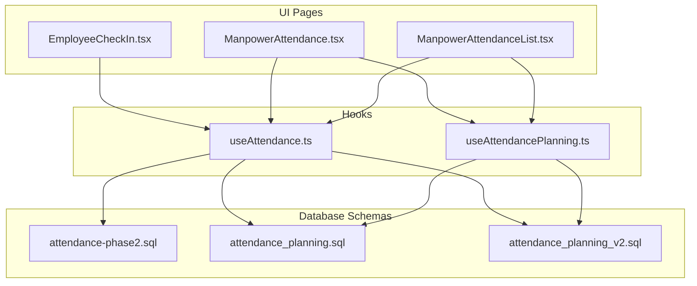
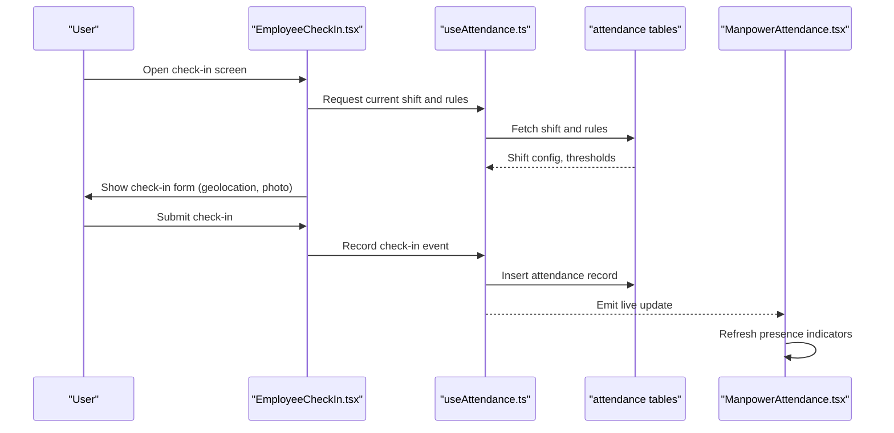
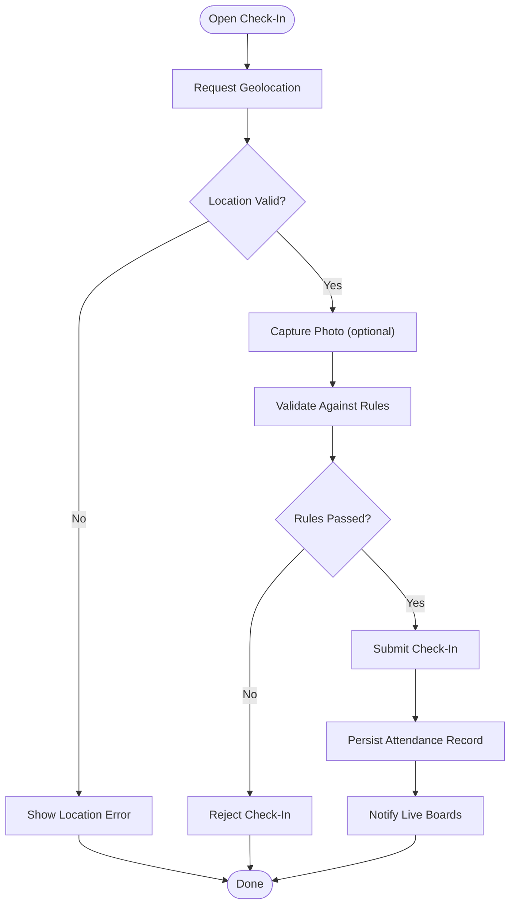
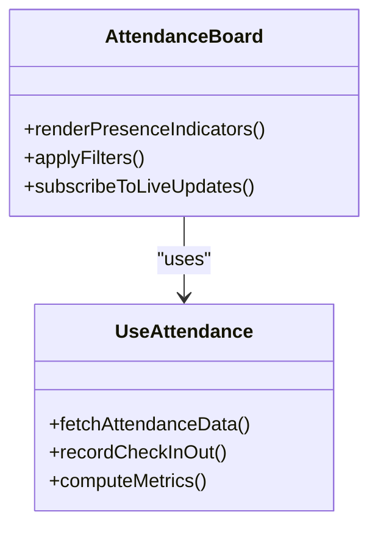
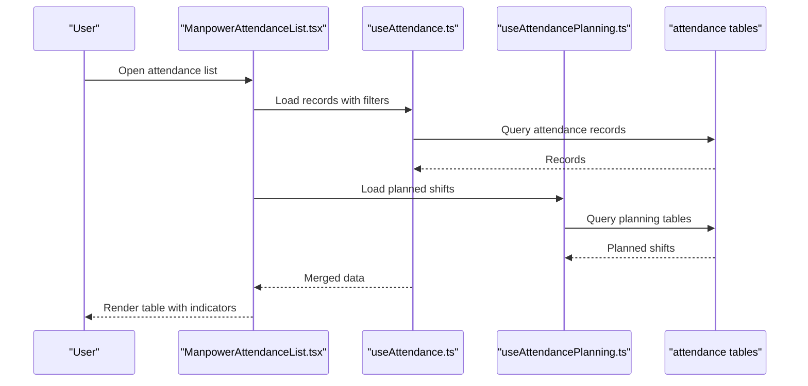
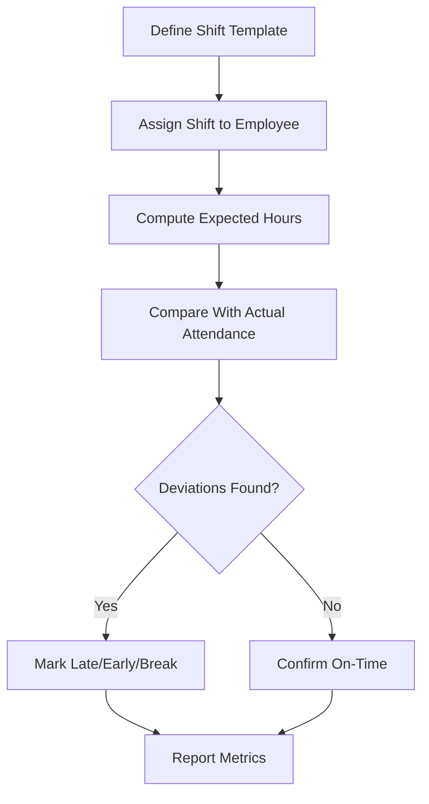
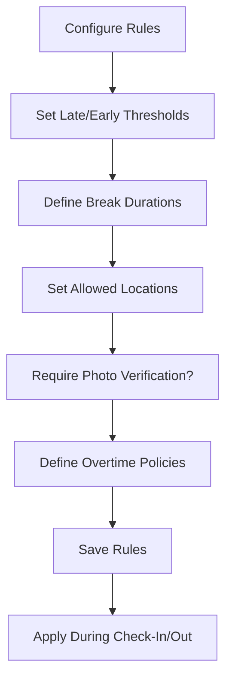
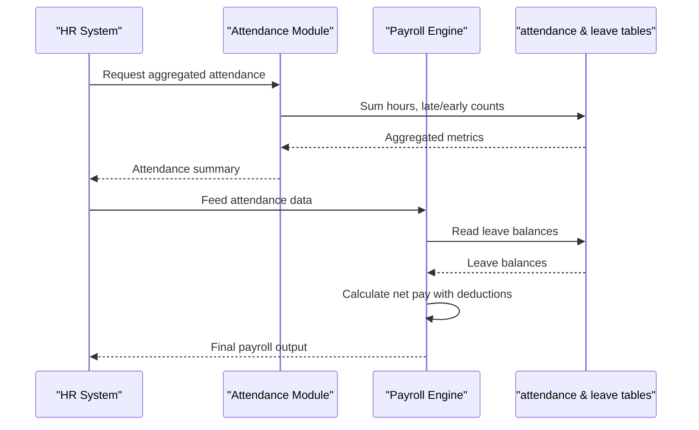
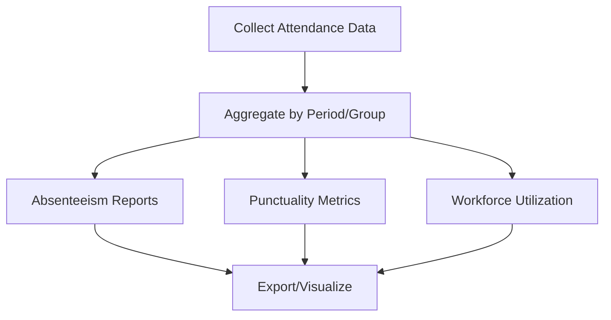
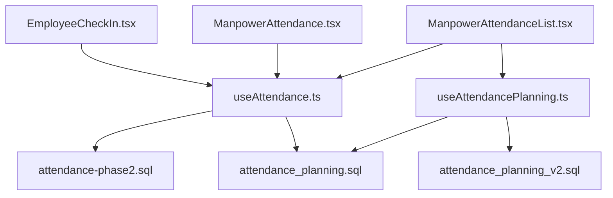

# Attendance Tracking

<cite>
**Referenced Files in This Document**
- [EmployeeCheckIn.tsx](file://src/pages/EmployeeCheckIn.tsx)
- [ManpowerAttendance.tsx](file://src/pages/ManpowerAttendance.tsx)
- [ManpowerAttendanceList.tsx](file://src/pages/ManpowerAttendanceList.tsx)
- [useAttendance.ts](file://src/hooks/useAttendance.ts)
- [useAttendancePlanning.ts](file://src/hooks/useAttendancePlanning.ts)
- [attendance-phase2.sql](file://sql/attendance-phase2.sql)
- [attendance_planning.sql](file://sql/attendance_planning.sql)
- [attendance_planning_v2.sql](file://sql/attendance_planning_v2.sql)
</cite>

## Table of Contents
1. [Introduction](#introduction)
2. [Project Structure](#project-structure)
3. [Core Components](#core-components)
4. [Architecture Overview](#architecture-overview)
5. [Detailed Component Analysis](#detailed-component-analysis)
6. [Dependency Analysis](#dependency-analysis)
7. [Performance Considerations](#performance-considerations)
8. [Troubleshooting Guide](#troubleshooting-guide)
9. [Conclusion](#conclusion)
10. [Appendices](#appendices)

## Introduction
This document explains the Attendance Tracking system with a focus on real-time monitoring, check-in/check-out procedures, shift management, mobile geolocation and photo verification, attendance rules configuration, live attendance board, late arrival and early departure handling, break time management, payroll integration, leave balance deductions, reporting for absenteeism and punctuality, workforce utilization, troubleshooting, and performance optimization for large workforces.

## Project Structure
The attendance feature spans UI pages, hooks for data access and state, and SQL migrations defining schemas and planning logic:
- Pages: Employee check-in flow, attendance dashboard, and attendance list views.
- Hooks: Attendance data fetching, caching, and planning utilities.
- SQL: Schema definitions and planning enhancements for attendance records and schedules.

**Diagram sources**
- [EmployeeCheckIn.tsx](file://src/pages/EmployeeCheckIn.tsx)
- [ManpowerAttendance.tsx](file://src/pages/ManpowerAttendance.tsx)
- [ManpowerAttendanceList.tsx](file://src/pages/ManpowerAttendanceList.tsx)
- [useAttendance.ts](file://src/hooks/useAttendance.ts)
- [useAttendancePlanning.ts](file://src/hooks/useAttendancePlanning.ts)
- [attendance-phase2.sql](file://sql/attendance-phase2.sql)
- [attendance_planning.sql](file://sql/attendance_planning.sql)
- [attendance_planning_v2.sql](file://sql/attendance_planning_v2.sql)

**Section sources**
- [EmployeeCheckIn.tsx](file://src/pages/EmployeeCheckIn.tsx)
- [ManpowerAttendance.tsx](file://src/pages/ManpowerAttendance.tsx)
- [ManpowerAttendanceList.tsx](file://src/pages/ManpowerAttendanceList.tsx)
- [useAttendance.ts](file://src/hooks/useAttendance.ts)
- [useAttendancePlanning.ts](file://src/hooks/useAttendancePlanning.ts)
- [attendance-phase2.sql](file://sql/attendance-phase2.sql)
- [attendance_planning.sql](file://sql/attendance_planning.sql)
- [attendance_planning_v2.sql](file://sql/attendance_planning_v2.sql)

## Core Components
- Real-time attendance monitoring: Live updates via hooks and presence-aware patterns to reflect current status across dashboards.
- Check-in/check-out procedures: Mobile-friendly flows capturing timestamps, location, and optional photo verification.
- Shift management: Planning tables and helpers to assign shifts, compute working hours, and handle breaks.
- Attendance rules: Configurable thresholds for late arrivals, early departures, and overtime policies.
- Attendance board: Visual indicators for present, absent, late, early, and on-break statuses with live refresh.
- Payroll integration: Aggregated hours, late/early metrics, and leave deductions feed into salary calculations.
- Reporting: Absenteeism analysis, punctuality metrics, and workforce utilization reports.

**Section sources**
- [useAttendance.ts](file://src/hooks/useAttendance.ts)
- [useAttendancePlanning.ts](file://src/hooks/useAttendancePlanning.ts)
- [ManpowerAttendance.tsx](file://src/pages/ManpowerAttendance.tsx)
- [ManpowerAttendanceList.tsx](file://src/pages/ManpowerAttendanceList.tsx)
- [attendance_planning.sql](file://sql/attendance_planning.sql)
- [attendance_planning_v2.sql](file://sql/attendance_planning_v2.sql)

## Architecture Overview
The attendance system follows a layered architecture:
- UI layer: Pages render attendance boards and check-in forms.
- Data layer: Hooks encapsulate API calls, caching, and real-time updates.
- Persistence layer: SQL migrations define attendance records, planning, and related metadata.

**Diagram sources**
- [EmployeeCheckIn.tsx](file://src/pages/EmployeeCheckIn.tsx)
- [useAttendance.ts](file://src/hooks/useAttendance.ts)
- [ManpowerAttendance.tsx](file://src/pages/ManpowerAttendance.tsx)
- [attendance-phase2.sql](file://sql/attendance-phase2.sql)

## Detailed Component Analysis

### Employee Check-In Flow
- Captures geolocation coordinates and optional photo verification at check-in.
- Validates against configured rules (allowed locations, time windows).
- Records check-in timestamp and associates with user’s active shift.
- Triggers live updates to attendance boards.

**Diagram sources**
- [EmployeeCheckIn.tsx](file://src/pages/EmployeeCheckIn.tsx)
- [useAttendance.ts](file://src/hooks/useAttendance.ts)

**Section sources**
- [EmployeeCheckIn.tsx](file://src/pages/EmployeeCheckIn.tsx)
- [useAttendance.ts](file://src/hooks/useAttendance.ts)

### Attendance Board and Live Updates
- Displays presence indicators per employee: present, absent, late, early, on-break.
- Uses real-time subscriptions or polling to refresh status without manual reload.
- Supports filters by date, department, project, and shift.

**Diagram sources**
- [ManpowerAttendance.tsx](file://src/pages/ManpowerAttendance.tsx)
- [useAttendance.ts](file://src/hooks/useAttendance.ts)

**Section sources**
- [ManpowerAttendance.tsx](file://src/pages/ManpowerAttendance.tsx)
- [useAttendance.ts](file://src/hooks/useAttendance.ts)

### Attendance List View
- Provides tabular view of attendance records with sorting and pagination.
- Exports and drill-down capabilities for detailed inspection.
- Integrates with planning data to show expected vs actual attendance.

**Diagram sources**
- [ManpowerAttendanceList.tsx](file://src/pages/ManpowerAttendanceList.tsx)
- [useAttendance.ts](file://src/hooks/useAttendance.ts)
- [useAttendancePlanning.ts](file://src/hooks/useAttendancePlanning.ts)
- [attendance_planning.sql](file://sql/attendance_planning.sql)

**Section sources**
- [ManpowerAttendanceList.tsx](file://src/pages/ManpowerAttendanceList.tsx)
- [useAttendance.ts](file://src/hooks/useAttendance.ts)
- [useAttendancePlanning.ts](file://src/hooks/useAttendancePlanning.ts)
- [attendance_planning.sql](file://sql/attendance_planning.sql)

### Shift Management and Planning
- Defines shifts, start/end times, break durations, and allowed locations.
- Computes expected working hours and flags deviations.
- Supports multiple shift templates and dynamic reassignment.

**Diagram sources**
- [useAttendancePlanning.ts](file://src/hooks/useAttendancePlanning.ts)
- [attendance_planning.sql](file://sql/attendance_planning.sql)
- [attendance_planning_v2.sql](file://sql/attendance_planning_v2.sql)

**Section sources**
- [useAttendancePlanning.ts](file://src/hooks/useAttendancePlanning.ts)
- [attendance_planning.sql](file://sql/attendance_planning.sql)
- [attendance_planning_v2.sql](file://sql/attendance_planning_v2.sql)

### Attendance Rules Configuration
- Configure late arrival threshold, early departure tolerance, and break allowances.
- Enforce location-based validation and photo verification requirements.
- Apply overtime policies based on exceeded hours beyond scheduled shifts.

**Diagram sources**
- [useAttendance.ts](file://src/hooks/useAttendance.ts)
- [attendance-phase2.sql](file://sql/attendance-phase2.sql)

**Section sources**
- [useAttendance.ts](file://src/hooks/useAttendance.ts)
- [attendance-phase2.sql](file://sql/attendance-phase2.sql)

### Payroll Integration and Leave Deductions
- Aggregates daily attendance into monthly totals for payroll processing.
- Applies leave balance deductions based on approved leaves.
- Calculates overtime pay according to configured policies.

**Diagram sources**
- [useAttendance.ts](file://src/hooks/useAttendance.ts)
- [attendance-phase2.sql](file://sql/attendance-phase2.sql)

**Section sources**
- [useAttendance.ts](file://src/hooks/useAttendance.ts)
- [attendance-phase2.sql](file://sql/attendance-phase2.sql)

### Reporting Features
- Absenteeism analysis: Daily/weekly/monthly absence rates by department/project.
- Punctuality metrics: Late arrival frequency, average delay minutes, early departure trends.
- Workforce utilization: Ratio of productive hours to total scheduled hours.

**Diagram sources**
- [useAttendance.ts](file://src/hooks/useAttendance.ts)
- [ManpowerAttendanceList.tsx](file://src/pages/ManpowerAttendanceList.tsx)

**Section sources**
- [useAttendance.ts](file://src/hooks/useAttendance.ts)
- [ManpowerAttendanceList.tsx](file://src/pages/ManpowerAttendanceList.tsx)

## Dependency Analysis
Attendance components depend on hooks for data operations and SQL schemas for persistence. The planning module extends core attendance with scheduling logic.

**Diagram sources**
- [EmployeeCheckIn.tsx](file://src/pages/EmployeeCheckIn.tsx)
- [ManpowerAttendance.tsx](file://src/pages/ManpowerAttendance.tsx)
- [ManpowerAttendanceList.tsx](file://src/pages/ManpowerAttendanceList.tsx)
- [useAttendance.ts](file://src/hooks/useAttendance.ts)
- [useAttendancePlanning.ts](file://src/hooks/useAttendancePlanning.ts)
- [attendance-phase2.sql](file://sql/attendance-phase2.sql)
- [attendance_planning.sql](file://sql/attendance_planning.sql)
- [attendance_planning_v2.sql](file://sql/attendance_planning_v2.sql)

**Section sources**
- [EmployeeCheckIn.tsx](file://src/pages/EmployeeCheckIn.tsx)
- [ManpowerAttendance.tsx](file://src/pages/ManpowerAttendance.tsx)
- [ManpowerAttendanceList.tsx](file://src/pages/ManpowerAttendanceList.tsx)
- [useAttendance.ts](file://src/hooks/useAttendance.ts)
- [useAttendancePlanning.ts](file://src/hooks/useAttendancePlanning.ts)
- [attendance-phase2.sql](file://sql/attendance-phase2.sql)
- [attendance_planning.sql](file://sql/attendance_planning.sql)
- [attendance_planning_v2.sql](file://sql/attendance_planning_v2.sql)

## Performance Considerations
- Batch requests and cache frequently accessed attendance data to reduce server load.
- Use incremental updates for live boards instead of full page refreshes.
- Index attendance records by employee, date, and shift to optimize queries.
- Limit photo uploads to compressed formats and store asynchronously.
- Implement pagination and virtualized lists for large attendance datasets.
- Debounce location updates during check-in to avoid excessive GPS polling.

[No sources needed since this section provides general guidance]

## Troubleshooting Guide
Common issues and resolutions:
- Geolocation not available: Ensure device permissions are granted; fallback to manual location entry if configured.
- Photo upload failures: Verify network connectivity and storage bucket permissions; retry with compression.
- Late/early flags incorrect: Review threshold configurations and timezone settings; validate shift assignments.
- Live updates not refreshing: Check subscription channels or polling intervals; ensure backend events are emitted.
- Payroll discrepancies: Reconcile attendance aggregates with leave records; audit overtime policy application.

**Section sources**
- [EmployeeCheckIn.tsx](file://src/pages/EmployeeCheckIn.tsx)
- [useAttendance.ts](file://src/hooks/useAttendance.ts)
- [ManpowerAttendance.tsx](file://src/pages/ManpowerAttendance.tsx)
- [ManpowerAttendanceList.tsx](file://src/pages/ManpowerAttendanceList.tsx)

## Conclusion
The Attendance Tracking system integrates real-time monitoring, robust check-in/out workflows, shift planning, rule enforcement, and comprehensive reporting. It supports mobile geolocation and photo verification, aligns with payroll processes, and scales for large workforces through optimized data handling and UI patterns.

[No sources needed since this section summarizes without analyzing specific files]

## Appendices
- Example configurations:
  - Late arrival threshold: e.g., 10 minutes grace period.
  - Early departure tolerance: e.g., 15 minutes before shift end.
  - Break allowance: e.g., 30-minute unpaid lunch after 4 hours worked.
  - Overtime policy: e.g., 1.5x rate after 8 hours/day.
- Reporting examples:
  - Absenteeism rate by department over last quarter.
  - Average late arrival minutes per team.
  - Utilization ratio comparing productive hours to scheduled hours.

[No sources needed since this section provides general guidance]