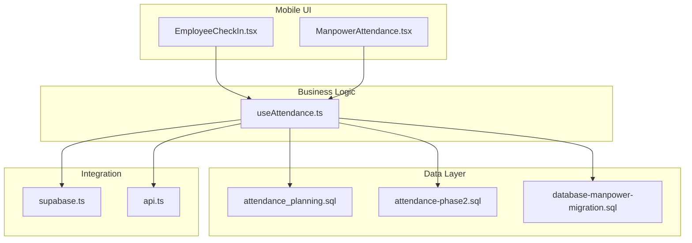
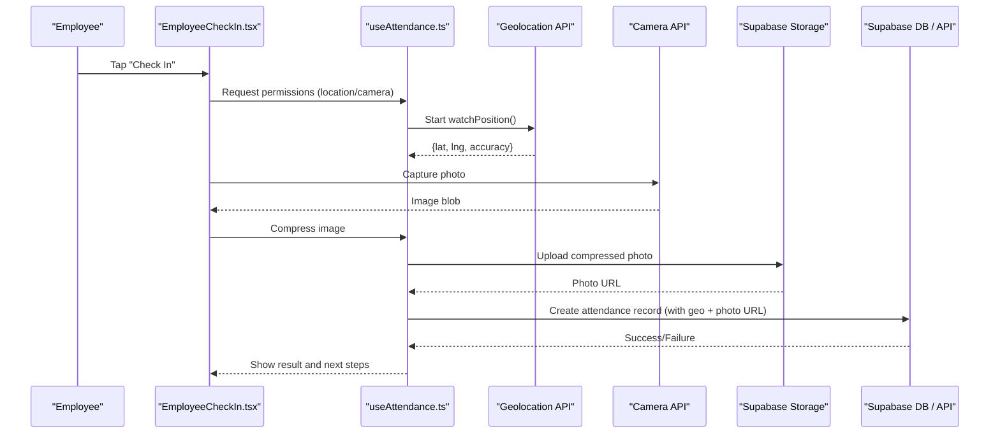
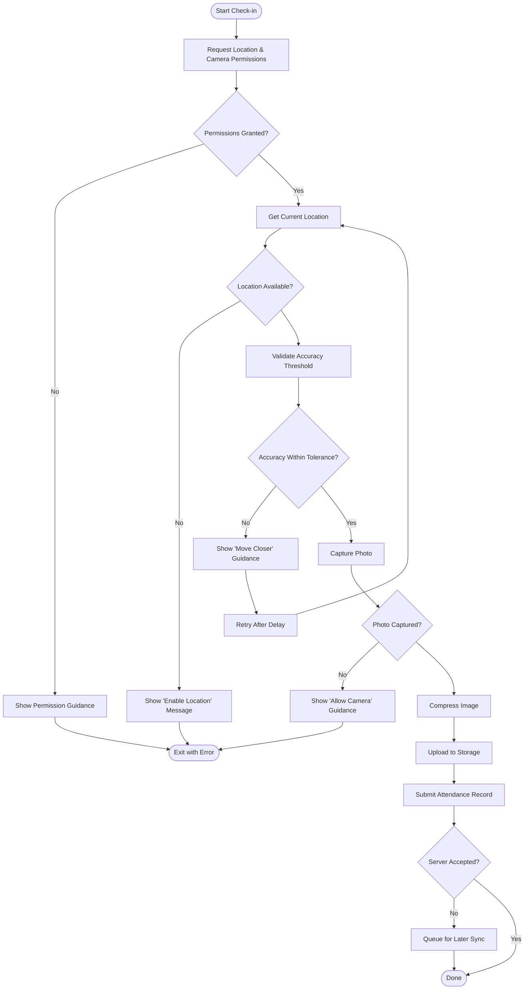
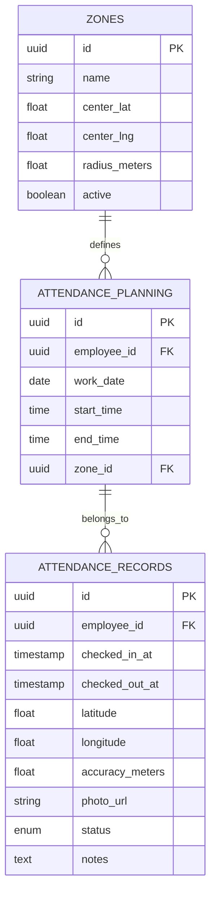
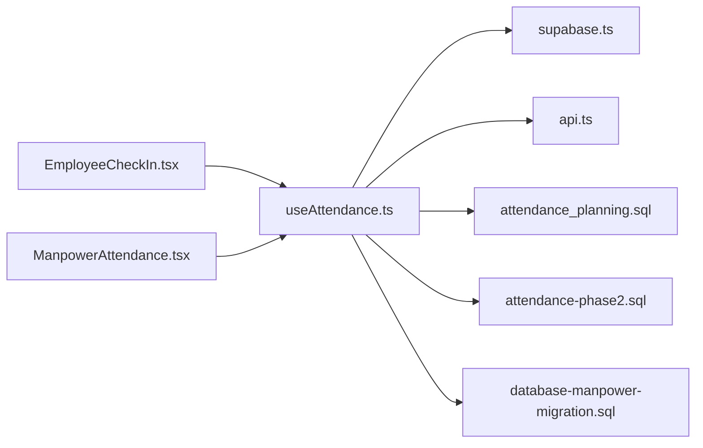

# Mobile Check-in System

<cite>
**Referenced Files in This Document**
- [EmployeeCheckIn.tsx](file://src/pages/EmployeeCheckIn.tsx)
- [ManpowerAttendance.tsx](file://src/pages/ManpowerAttendance.tsx)
- [useAttendance.ts](file://src/hooks/useAttendance.ts)
- [attendance_planning.sql](file://sql/attendance_planning.sql)
- [attendance-phase2.sql](file://sql/attendance-phase2.sql)
- [database-manpower-migration.sql](file://src/database-manpower-migration.sql)
- [supabase.ts](file://src/supabase.ts)
- [api.ts](file://src/api.ts)
</cite>

## Table of Contents
1. [Introduction](#introduction)
2. [Project Structure](#project-structure)
3. [Core Components](#core-components)
4. [Architecture Overview](#architecture-overview)
5. [Detailed Component Analysis](#detailed-component-analysis)
6. [Dependency Analysis](#dependency-analysis)
7. [Performance Considerations](#performance-considerations)
8. [Troubleshooting Guide](#troubleshooting-guide)
9. [Conclusion](#conclusion)

## Introduction
This document explains the mobile check-in system with a focus on geolocation-based attendance capture, photo verification, GPS accuracy validation, mobile-responsive interface design, touch interactions, offline capabilities, security measures, battery optimization, background processing constraints, and data synchronization when connectivity is restored. It also provides concrete configuration examples for check-in zones, distance tolerances, and photo verification rules, along with troubleshooting guidance for common mobile issues such as GPS inaccuracies, camera permissions, and network connectivity problems.

## Project Structure
The mobile check-in feature spans UI pages, hooks for business logic, database schemas, and API integration layers:
- Pages provide the user-facing interfaces for employees to check in/out and for managers to view attendance.
- Hooks encapsulate state management, device capability checks, and API calls.
- SQL migrations define the schema for attendance records, planning, and related metadata.
- Supabase client and API modules handle authentication, storage, and server-side operations.

**Diagram sources**
- [EmployeeCheckIn.tsx](file://src/pages/EmployeeCheckIn.tsx)
- [ManpowerAttendance.tsx](file://src/pages/ManpowerAttendance.tsx)
- [useAttendance.ts](file://src/hooks/useAttendance.ts)
- [attendance_planning.sql](file://sql/attendance_planning.sql)
- [attendance-phase2.sql](file://sql/attendance-phase2.sql)
- [database-manpower-migration.sql](file://src/database-manpower-migration.sql)
- [supabase.ts](file://src/supabase.ts)
- [api.ts](file://src/api.ts)

**Section sources**
- [EmployeeCheckIn.tsx](file://src/pages/EmployeeCheckIn.tsx)
- [ManpowerAttendance.tsx](file://src/pages/ManpowerAttendance.tsx)
- [useAttendance.ts](file://src/hooks/useAttendance.ts)
- [attendance_planning.sql](file://sql/attendance_planning.sql)
- [attendance-phase2.sql](file://sql/attendance-phase2.sql)
- [database-manpower-migration.sql](file://src/database-manpower-migration.sql)
- [supabase.ts](file://src/supabase.ts)
- [api.ts](file://src/api.ts)

## Core Components
- Employee Check-in Page: Provides the primary mobile experience for capturing location, taking photos, and submitting attendance. It handles permission prompts, live location updates, and error feedback.
- Attendance Management Page: Displays attendance records, filters by date or employee, and supports manager actions like approvals or corrections.
- Attendance Hook: Centralizes device capability detection (geolocation, camera), local state for pending submissions, retry/backoff logic, and API calls to create/update attendance entries.
- Database Schemas: Define tables for attendance records, planning, and related metadata; include fields for coordinates, accuracy, timestamps, photo references, and status.
- Integration Layer: Uses Supabase client for auth, storage (photos), and database access; API module may wrap additional server endpoints or edge functions.

Key responsibilities:
- Geolocation capture with accuracy thresholds
- Photo capture and compression before upload
- Offline queuing and background sync
- Security validations (device fingerprinting, IP validation, anti-spoofing)
- Mobile UX patterns (touch-friendly controls, responsive layout)

**Section sources**
- [EmployeeCheckIn.tsx](file://src/pages/EmployeeCheckIn.tsx)
- [ManpowerAttendance.tsx](file://src/pages/ManpowerAttendance.tsx)
- [useAttendance.ts](file://src/hooks/useAttendance.ts)
- [attendance_planning.sql](file://sql/attendance_planning.sql)
- [attendance-phase2.sql](file://sql/attendance-phase2.sql)
- [database-manpower-migration.sql](file://src/database-manpower-migration.sql)
- [supabase.ts](file://src/supabase.ts)
- [api.ts](file://src/api.ts)

## Architecture Overview
The mobile check-in architecture follows a layered approach:
- Presentation layer: React pages optimized for mobile devices with touch interactions and responsive layouts.
- Business logic layer: Hook-based state machine handling permissions, location polling, photo capture, validation, and submission.
- Data persistence: Local queue for offline submissions; remote storage via Supabase for photos and attendance records.
- Security layer: Device fingerprinting, IP validation, and anti-spoofing checks performed at both client and server boundaries.

**Diagram sources**
- [EmployeeCheckIn.tsx](file://src/pages/EmployeeCheckIn.tsx)
- [useAttendance.ts](file://src/hooks/useAttendance.ts)
- [supabase.ts](file://src/supabase.ts)
- [api.ts](file://src/api.ts)

## Detailed Component Analysis

### Employee Check-in Flow
The check-in flow orchestrates permissions, location capture, photo verification, validation, and submission. It includes safeguards for low accuracy, invalid times, and missing photos based on policy.

**Diagram sources**
- [EmployeeCheckIn.tsx](file://src/pages/EmployeeCheckIn.tsx)
- [useAttendance.ts](file://src/hooks/useAttendance.ts)
- [supabase.ts](file://src/supabase.ts)
- [api.ts](file://src/api.ts)

**Section sources**
- [EmployeeCheckIn.tsx](file://src/pages/EmployeeCheckIn.tsx)
- [useAttendance.ts](file://src/hooks/useAttendance.ts)

### Attendance Planning and Records
The database schemas define how attendance records are stored and planned:
- Attendance records include employee identifiers, timestamps, coordinates, accuracy, photo references, and status.
- Planning tables support scheduling and zone definitions.
- Phase 2 enhancements add additional fields for validation and auditability.

**Diagram sources**
- [attendance_planning.sql](file://sql/attendance_planning.sql)
- [attendance-phase2.sql](file://sql/attendance-phase2.sql)
- [database-manpower-migration.sql](file://src/database-manpower-migration.sql)

**Section sources**
- [attendance_planning.sql](file://sql/attendance_planning.sql)
- [attendance-phase2.sql](file://sql/attendance-phase2.sql)
- [database-manpower-migration.sql](file://src/database-manpower-migration.sql)

### Configuration Examples
- Check-in Zones:
  - Define a zone with center coordinates and radius in meters.
  - Example: Center at lat 12.9716, lng 77.5946 with radius 100 meters.
- Distance Tolerances:
  - Set minimum accuracy threshold (e.g., 50 meters).
  - Reject check-ins if reported accuracy exceeds threshold.
- Photo Verification Rules:
  - Require a photo for each check-in.
  - Enforce minimum resolution and file size after compression.
  - Optionally validate that the photo contains a face using server-side analysis.

These configurations can be managed through admin settings and enforced by the hook and server-side policies.

[No sources needed since this section provides general configuration guidance]

### Security Measures
- Device Fingerprinting:
  - Collect device metadata (model, OS version, browser fingerprint) and store with attendance records for audit.
- IP Validation:
  - Log client IP addresses and compare against known office ranges or VPN endpoints.
- Anti-Spoofing Mechanisms:
  - Detect mock locations and emulator environments.
  - Validate GPS consistency over time and reject sudden unrealistic jumps.
  - Cross-check photo EXIF metadata and timestamps.

Implementation should occur in both client and server layers to ensure robustness.

[No sources needed since this section provides general security guidance]

### Mobile-Responsive Interface Design and Touch Interactions
- Responsive Layout:
  - Use fluid grids and adaptive components to fit various screen sizes.
  - Ensure large touch targets for buttons and inputs.
- Touch Interactions:
  - Support swipe gestures for navigation between steps.
  - Provide haptic feedback where available.
- Accessibility:
  - Include ARIA labels and keyboard navigation fallbacks.
  - Offer high contrast mode and scalable fonts.

[No sources needed since this section provides general UX guidance]

### Offline Check-in Capabilities and Background Processing
- Offline Queue:
  - Persist pending check-ins locally until connectivity is restored.
  - Assign unique IDs and timestamps to avoid duplicates.
- Background Sync:
  - Use periodic sync jobs to flush queued items when online.
  - Implement exponential backoff and retry limits.
- Battery Optimization:
  - Reduce GPS polling frequency when not actively checking in.
  - Pause background tasks during low battery states.

[No sources needed since this section provides general performance guidance]

## Dependency Analysis
The following diagram shows key dependencies among UI, logic, and data layers:

**Diagram sources**
- [EmployeeCheckIn.tsx](file://src/pages/EmployeeCheckIn.tsx)
- [ManpowerAttendance.tsx](file://src/pages/ManpowerAttendance.tsx)
- [useAttendance.ts](file://src/hooks/useAttendance.ts)
- [supabase.ts](file://src/supabase.ts)
- [api.ts](file://src/api.ts)
- [attendance_planning.sql](file://sql/attendance_planning.sql)
- [attendance-phase2.sql](file://sql/attendance-phase2.sql)
- [database-manpower-migration.sql](file://src/database-manpower-migration.sql)

**Section sources**
- [EmployeeCheckIn.tsx](file://src/pages/EmployeeCheckIn.tsx)
- [ManpowerAttendance.tsx](file://src/pages/ManpowerAttendance.tsx)
- [useAttendance.ts](file://src/hooks/useAttendance.ts)
- [supabase.ts](file://src/supabase.ts)
- [api.ts](file://src/api.ts)
- [attendance_planning.sql](file://sql/attendance_planning.sql)
- [attendance-phase2.sql](file://sql/attendance-phase2.sql)
- [database-manpower-migration.sql](file://src/database-manpower-migration.sql)

## Performance Considerations
- Minimize GPS polling intervals and stop watching when idle.
- Compress images before upload to reduce bandwidth and storage costs.
- Batch API requests when possible to reduce overhead.
- Cache static assets and use service workers for faster load times.
- Monitor memory usage and avoid long-lived closures in event listeners.

[No sources needed since this section provides general guidance]

## Troubleshooting Guide
Common mobile issues and resolutions:
- GPS Inaccuracies:
  - Encourage users to move outdoors or near windows.
  - Increase tolerance temporarily and prompt re-capture.
  - Warn about indoor GPS drift and suggest Wi-Fi assisted location.
- Camera Permissions:
  - Provide clear instructions to enable camera access in device settings.
  - Re-prompt permissions gracefully and explain necessity.
- Network Connectivity Problems:
  - Detect offline state and queue submissions.
  - Show progress indicators and retry notifications.
  - Validate server responses and log errors for diagnostics.
- Battery Drain:
  - Limit background location updates.
  - Disable unnecessary animations and heavy computations.
- Anti-Spoofing Alerts:
  - If mock locations are detected, instruct users to disable developer options or location spoofing apps.

[No sources needed since this section provides general troubleshooting guidance]

## Conclusion
The mobile check-in system integrates geolocation capture, photo verification, and robust validation to ensure accurate and secure attendance tracking. By implementing responsive UI patterns, offline capabilities, and strong security measures, it delivers a reliable experience across diverse mobile environments. Proper configuration of zones, tolerances, and photo rules, combined with proactive troubleshooting and performance optimizations, ensures consistent operation even under challenging conditions.