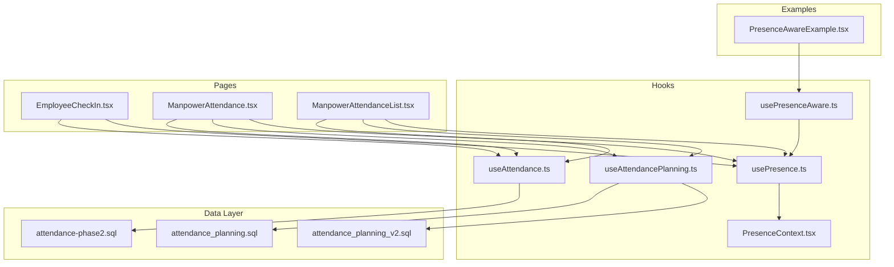
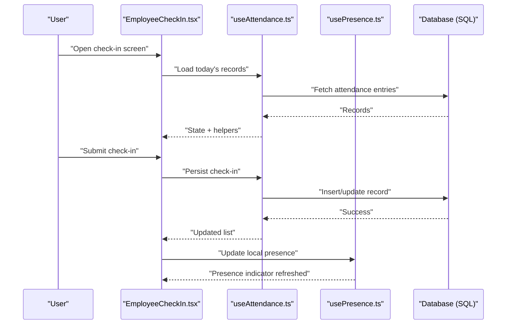
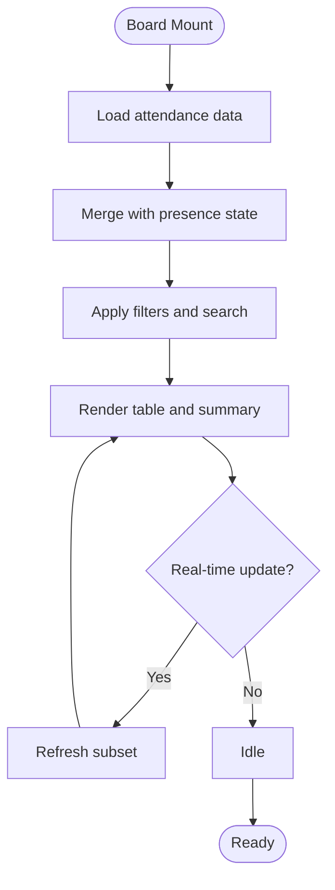
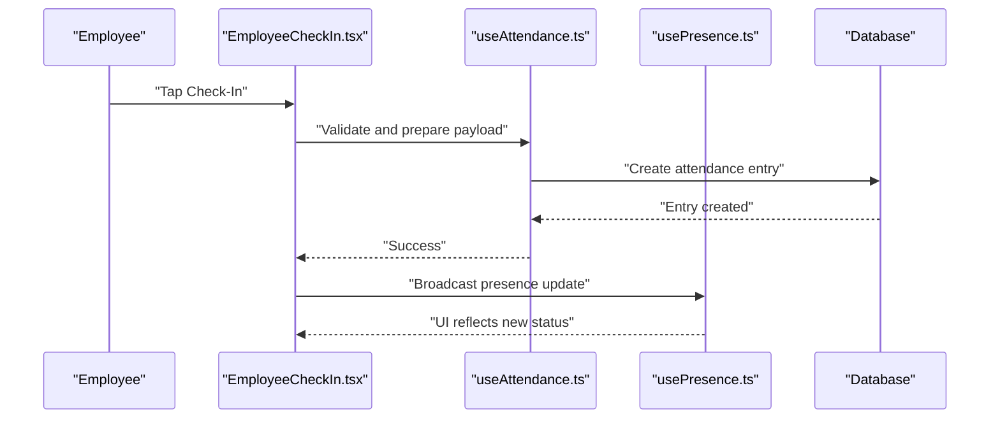
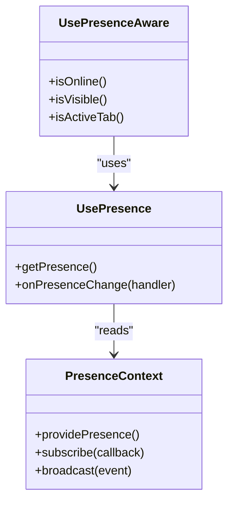
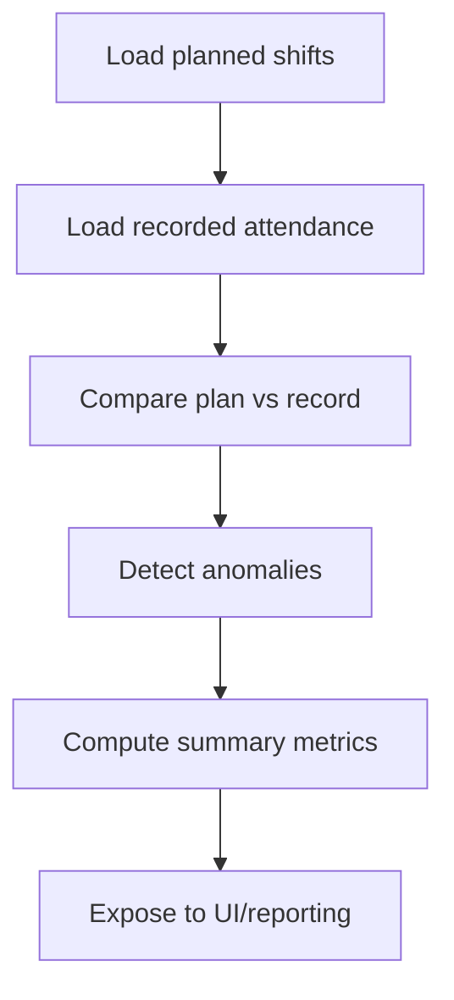
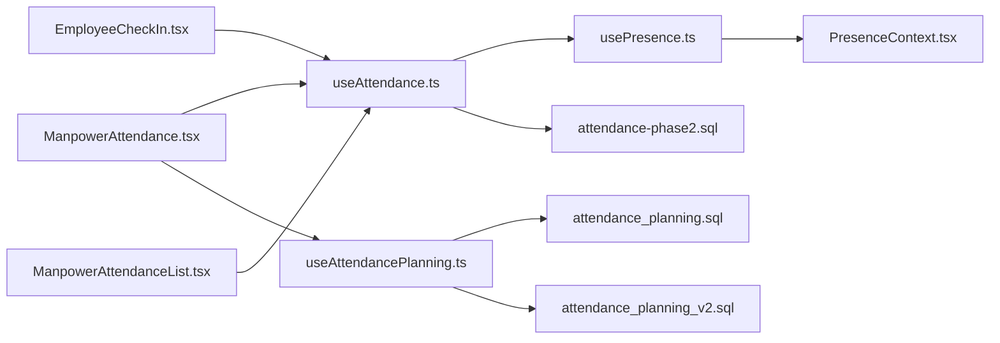

# Real-time Attendance Monitoring

<cite>
**Referenced Files in This Document**
- [useAttendance.ts](file://src/hooks/useAttendance.ts)
- [useAttendancePlanning.ts](file://src/hooks/useAttendancePlanning.ts)
- [EmployeeCheckIn.tsx](file://src/pages/EmployeeCheckIn.tsx)
- [ManpowerAttendance.tsx](file://src/pages/ManpowerAttendance.tsx)
- [ManpowerAttendanceList.tsx](file://src/pages/ManpowerAttendanceList.tsx)
- [PresenceContext.tsx](file://src/hooks/PresenceContext.tsx)
- [usePresence.ts](file://src/hooks/usePresence.ts)
- [usePresenceAware.ts](file://src/hooks/usePresenceAware.ts)
- [PresenceAwareExample.tsx](file://src/examples/PresenceAwareExample.tsx)
- [attendance-phase2.sql](file://sql/attendance-phase2.sql)
- [attendance_planning.sql](file://sql/attendance_planning.sql)
- [attendance_planning_v2.sql](file://sql/attendance_planning_v2.sql)
</cite>

## Table of Contents
1. [Introduction](#introduction)
2. [Project Structure](#project-structure)
3. [Core Components](#core-components)
4. [Architecture Overview](#architecture-overview)
5. [Detailed Component Analysis](#detailed-component-analysis)
6. [Dependency Analysis](#dependency-analysis)
7. [Performance Considerations](#performance-considerations)
8. [Troubleshooting Guide](#troubleshooting-guide)
9. [Conclusion](#conclusion)
10. [Appendices](#appendices)

## Introduction
This document explains the real-time attendance monitoring system, focusing on the live attendance board interface, presence indicators, and real-time updates. It covers how employee check-in/check-out status is tracked, location-based presence detection, automatic status changes, configuration of monitoring rules and alert thresholds, dashboard components with filtering and search, performance optimization for large workforces, WebSocket-based live updates, offline handling strategies, integration points with HR modules, and export capabilities for reporting.

## Project Structure
The attendance feature spans hooks, pages, examples, and SQL migrations:
- Hooks provide data access, presence state, and planning utilities.
- Pages implement user-facing interfaces such as check-in flows and attendance dashboards.
- Examples demonstrate presence-aware patterns.
- SQL files define attendance schema and planning structures.

**Diagram sources**
- [useAttendance.ts](file://src/hooks/useAttendance.ts)
- [useAttendancePlanning.ts](file://src/hooks/useAttendancePlanning.ts)
- [usePresence.ts](file://src/hooks/usePresence.ts)
- [PresenceContext.tsx](file://src/hooks/PresenceContext.tsx)
- [usePresenceAware.ts](file://src/hooks/usePresenceAware.ts)
- [EmployeeCheckIn.tsx](file://src/pages/EmployeeCheckIn.tsx)
- [ManpowerAttendance.tsx](file://src/pages/ManpowerAttendance.tsx)
- [ManpowerAttendanceList.tsx](file://src/pages/ManpowerAttendanceList.tsx)
- [PresenceAwareExample.tsx](file://src/examples/PresenceAwareExample.tsx)
- [attendance-phase2.sql](file://sql/attendance-phase2.sql)
- [attendance_planning.sql](file://sql/attendance_planning.sql)
- [attendance_planning_v2.sql](file://sql/attendance_planning_v2.sql)

**Section sources**
- [useAttendance.ts](file://src/hooks/useAttendance.ts)
- [useAttendancePlanning.ts](file://src/hooks/useAttendancePlanning.ts)
- [EmployeeCheckIn.tsx](file://src/pages/EmployeeCheckIn.tsx)
- [ManpowerAttendance.tsx](file://src/pages/ManpowerAttendance.tsx)
- [ManpowerAttendanceList.tsx](file://src/pages/ManpowerAttendanceList.tsx)
- [PresenceContext.tsx](file://src/hooks/PresenceContext.tsx)
- [usePresence.ts](file://src/hooks/usePresence.ts)
- [usePresenceAware.ts](file://src/hooks/usePresenceAware.ts)
- [PresenceAwareExample.tsx](file://src/examples/PresenceAwareExample.tsx)
- [attendance-phase2.sql](file://sql/attendance-phase2.sql)
- [attendance_planning.sql](file://sql/attendance_planning.sql)
- [attendance_planning_v2.sql](file://sql/attendance_planning_v2.sql)

## Core Components
- Live Attendance Board: The main dashboard surfaces current presence, shift coverage, and exceptions. It integrates with presence hooks to reflect real-time changes.
- Check-In/Check-Out Flow: Employee-facing page to record arrival/departure, capture location context when available, and persist records via API calls.
- Presence Indicators: Visual cues (e.g., online/offline, at-site, remote) driven by presence state and optional geolocation checks.
- Real-Time Updates: Subscriptions or polling mechanisms update the UI without manual refresh.
- Planning Utilities: Tools to compute expected vs actual attendance, detect anomalies, and support scheduling integrations.

Key responsibilities:
- Data fetching and caching for attendance records.
- Maintaining presence state across tabs/devices.
- Rendering filtered/searchable lists and summaries.
- Handling offline scenarios gracefully.

**Section sources**
- [ManpowerAttendance.tsx](file://src/pages/ManpowerAttendance.tsx)
- [ManpowerAttendanceList.tsx](file://src/pages/ManpowerAttendanceList.tsx)
- [EmployeeCheckIn.tsx](file://src/pages/EmployeeCheckIn.tsx)
- [useAttendance.ts](file://src/hooks/useAttendance.ts)
- [useAttendancePlanning.ts](file://src/hooks/useAttendancePlanning.ts)
- [usePresence.ts](file://src/hooks/usePresence.ts)
- [PresenceContext.tsx](file://src/hooks/PresenceContext.tsx)

## Architecture Overview
The system combines a React-based UI with hooks for data and presence management, backed by database schemas that define attendance and planning entities.

**Diagram sources**
- [EmployeeCheckIn.tsx](file://src/pages/EmployeeCheckIn.tsx)
- [useAttendance.ts](file://src/hooks/useAttendance.ts)
- [usePresence.ts](file://src/hooks/usePresence.ts)
- [attendance-phase2.sql](file://sql/attendance-phase2.sql)

## Detailed Component Analysis

### Live Attendance Board
- Purpose: Provide a real-time overview of workforce presence, including counts by status and site.
- Key features:
  - Presence indicators per employee.
  - Filters by department, site, shift, and status.
  - Search by name or ID.
  - Auto-refresh via presence subscriptions or periodic polling.
- Data flow:
  - Fetches attendance snapshots and merges with presence state.
  - Applies filters and search client-side for responsiveness.
  - Highlights exceptions (late arrivals, early departures).

**Diagram sources**
- [ManpowerAttendance.tsx](file://src/pages/ManpowerAttendance.tsx)
- [ManpowerAttendanceList.tsx](file://src/pages/ManpowerAttendanceList.tsx)
- [useAttendance.ts](file://src/hooks/useAttendance.ts)
- [usePresence.ts](file://src/hooks/usePresence.ts)

**Section sources**
- [ManpowerAttendance.tsx](file://src/pages/ManpowerAttendance.tsx)
- [ManpowerAttendanceList.tsx](file://src/pages/ManpowerAttendanceList.tsx)
- [useAttendance.ts](file://src/hooks/useAttendance.ts)
- [usePresence.ts](file://src/hooks/usePresence.ts)

### Check-In/Check-Out Interface
- Purpose: Allow employees to record start/end of shifts and capture contextual data (e.g., location).
- Behavior:
  - Validates eligibility (shift window, permissions).
  - Captures timestamp and optional geolocation.
  - Persists via API and updates local state.
  - Reflects immediate presence change.

**Diagram sources**
- [EmployeeCheckIn.tsx](file://src/pages/EmployeeCheckIn.tsx)
- [useAttendance.ts](file://src/hooks/useAttendance.ts)
- [usePresence.ts](file://src/hooks/usePresence.ts)
- [attendance-phase2.sql](file://sql/attendance-phase2.sql)

**Section sources**
- [EmployeeCheckIn.tsx](file://src/pages/EmployeeCheckIn.tsx)
- [useAttendance.ts](file://src/hooks/useAttendance.ts)
- [usePresence.ts](file://src/hooks/usePresence.ts)
- [attendance-phase2.sql](file://sql/attendance-phase2.sql)

### Presence System
- Purpose: Maintain up-to-date presence state across the app and enable real-time indicators.
- Components:
  - Context provider to broadcast presence events.
  - Hook to subscribe to presence changes.
  - Awareness helper to react to visibility and connectivity.

**Diagram sources**
- [PresenceContext.tsx](file://src/hooks/PresenceContext.tsx)
- [usePresence.ts](file://src/hooks/usePresence.ts)
- [usePresenceAware.ts](file://src/hooks/usePresenceAware.ts)

**Section sources**
- [PresenceContext.tsx](file://src/hooks/PresenceContext.tsx)
- [usePresence.ts](file://src/hooks/usePresence.ts)
- [usePresenceAware.ts](file://src/hooks/usePresenceAware.ts)
- [PresenceAwareExample.tsx](file://src/examples/PresenceAwareExample.tsx)

### Attendance Planning Utilities
- Purpose: Compute expected vs actual attendance, detect anomalies, and support scheduling integrations.
- Capabilities:
  - Compare planned shifts with recorded check-ins/out.
  - Identify late arrivals, early departures, and no-shows.
  - Aggregate metrics for dashboards and reports.

**Diagram sources**
- [useAttendancePlanning.ts](file://src/hooks/useAttendancePlanning.ts)
- [attendance_planning.sql](file://sql/attendance_planning.sql)
- [attendance_planning_v2.sql](file://sql/attendance_planning_v2.sql)

**Section sources**
- [useAttendancePlanning.ts](file://src/hooks/useAttendancePlanning.ts)
- [attendance_planning.sql](file://sql/attendance_planning.sql)
- [attendance_planning_v2.sql](file://sql/attendance_planning_v2.sql)

## Dependency Analysis
- UI pages depend on hooks for data and presence.
- Hooks depend on database schemas for persistence and planning logic.
- Presence system decouples UI from connection details, enabling consistent real-time behavior.

**Diagram sources**
- [EmployeeCheckIn.tsx](file://src/pages/EmployeeCheckIn.tsx)
- [ManpowerAttendance.tsx](file://src/pages/ManpowerAttendance.tsx)
- [ManpowerAttendanceList.tsx](file://src/pages/ManpowerAttendanceList.tsx)
- [useAttendance.ts](file://src/hooks/useAttendance.ts)
- [useAttendancePlanning.ts](file://src/hooks/useAttendancePlanning.ts)
- [usePresence.ts](file://src/hooks/usePresence.ts)
- [PresenceContext.tsx](file://src/hooks/PresenceContext.tsx)
- [attendance-phase2.sql](file://sql/attendance-phase2.sql)
- [attendance_planning.sql](file://sql/attendance_planning.sql)
- [attendance_planning_v2.sql](file://sql/attendance_planning_v2.sql)

**Section sources**
- [EmployeeCheckIn.tsx](file://src/pages/EmployeeCheckIn.tsx)
- [ManpowerAttendance.tsx](file://src/pages/ManpowerAttendance.tsx)
- [ManpowerAttendanceList.tsx](file://src/pages/ManpowerAttendanceList.tsx)
- [useAttendance.ts](file://src/hooks/useAttendance.ts)
- [useAttendancePlanning.ts](file://src/hooks/useAttendancePlanning.ts)
- [usePresence.ts](file://src/hooks/usePresence.ts)
- [PresenceContext.tsx](file://src/hooks/PresenceContext.tsx)
- [attendance-phase2.sql](file://sql/attendance-phase2.sql)
- [attendance_planning.sql](file://sql/attendance_planning.sql)
- [attendance_planning_v2.sql](file://sql/attendance_planning_v2.sql)

## Performance Considerations
- Virtualization and pagination for large attendance lists.
- Client-side filtering and search to reduce server load.
- Debounced input for search fields.
- Selective re-renders using memoized selectors and presence subscriptions.
- Batched writes for bulk operations (e.g., mass check-ins).
- Efficient queries leveraging indexes defined in schema migrations.

[No sources needed since this section provides general guidance]

## Troubleshooting Guide
Common issues and resolutions:
- Presence not updating:
  - Verify presence context subscription and event broadcasting.
  - Check browser visibility and tab activity states.
- Stale attendance data:
  - Ensure background refresh or presence-driven updates are active.
  - Validate network connectivity and retry policies.
- Location-based presence unreliable:
  - Confirm geolocation permissions and fallback behaviors.
  - Log location fetch errors and degrade gracefully.
- Offline mode:
  - Queue pending actions locally and sync when back online.
  - Show clear offline indicators and allow read-only access.

**Section sources**
- [PresenceContext.tsx](file://src/hooks/PresenceContext.tsx)
- [usePresence.ts](file://src/hooks/usePresence.ts)
- [usePresenceAware.ts](file://src/hooks/usePresenceAware.ts)
- [useAttendance.ts](file://src/hooks/useAttendance.ts)

## Conclusion
The real-time attendance monitoring system integrates presence-aware UI components with robust data hooks and planning utilities. It supports live dashboards, accurate check-in/out workflows, and scalable performance patterns suitable for large workforces. With structured schemas and modular hooks, it remains extensible for advanced analytics, notifications, and integrations with broader HR systems.

[No sources needed since this section summarizes without analyzing specific files]

## Appendices

### Configuration Examples
- Monitoring rules:
  - Define shift windows and tolerance thresholds for late arrivals.
  - Configure site-specific presence radii for location-based checks.
- Notification thresholds:
  - Alert managers when absence exceeds configured limits.
  - Trigger reminders before shift start for unconfirmed employees.
- Alert systems:
  - Integrate with email/SMS channels for critical exceptions.
  - Route alerts based on role and department.

[No sources needed since this section provides general guidance]

### Dashboard Components and Controls
- Summary cards: total present, absent, late, early departure.
- Filter panel: department, site, shift, status.
- Search bar: name, ID, badge number.
- Export options: CSV/PDF for daily/monthly reports.

[No sources needed since this section provides general guidance]

### Integration Points
- HR modules:
  - Employee master data synchronization.
  - Shift schedules and leave balances.
- Reporting:
  - Consolidated exports for payroll and compliance.
  - Audit trails for attendance modifications.

[No sources needed since this section provides general guidance]